# 0基础小白怎么入门Linux运维？看这套，Linux运维全套培训课程，保姆级教学视频 - P76：中级运维-13.SELECT多表查询，复制表，破解密码，授权访问，存储引擎-上 - 小方脸不方- - BV138411B7p5

好我们今天呢继续来讲这个查询啊，select查询，上节课的最后呢，我们讲的是什么，讲的是嵌套查询，这个嵌套查询，这里的话其实主要需要注意的就是，签到查询的两种方式，一种呢是作为什么。

一种是作为这个子的查询语句呢，在哪呢，在相当于是在原主要的查询语句的这个，where条件语句里面，哎，就是子查询语句呢在where条件语句里，一种的话就是什么，一种的话就是将我们这个查询的一个结果。

作为什么，作为第二次查询的一个表格来算啊，就这两种情况啊，一种呢就在相当于一种是把slide语句呢，放在了，就是把slide的子查询语句放在了where的部分，一种是放在from部分啊，就是两种啊。

唯一区别的话就是form部分的话，记得加个别名，其他的话用法是和我们正常的一个select，就是一样的好吧，那么接下来的朋友来介绍什么呢，来介绍一下这个多表查询的问题啊，多表查询多表查询啊。

免思义就是多少表嘛啊，多少表一起查啊，首先的话我们先来看怎么办啊，先来看用两张表为例，唉我们先来讲这个怎么进行多表查询，那首先的话多表查询的话，其实唉如果说直接用select语句啊，有什么特殊情况。

或者什么特殊的语法都不用的话。

能不能查呢，其实也可以，就比如说我们还是用C和gt这两个表，哎，什么叫只用select语句呢，其实就是什么呢。

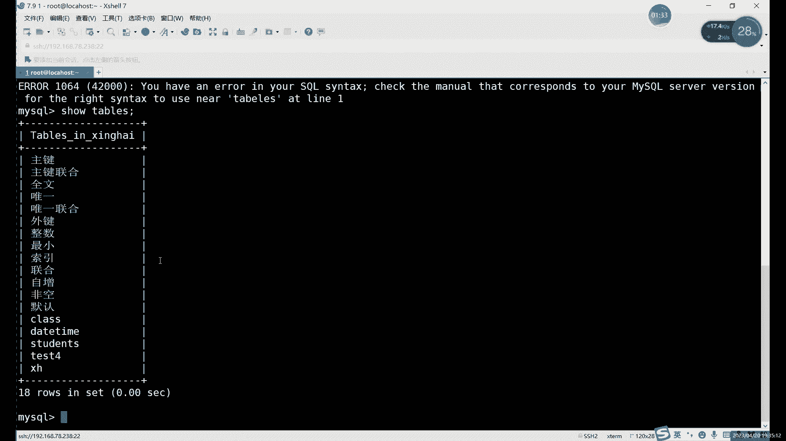

就是只写什么呢，只写我们的这两个表格这个名字。

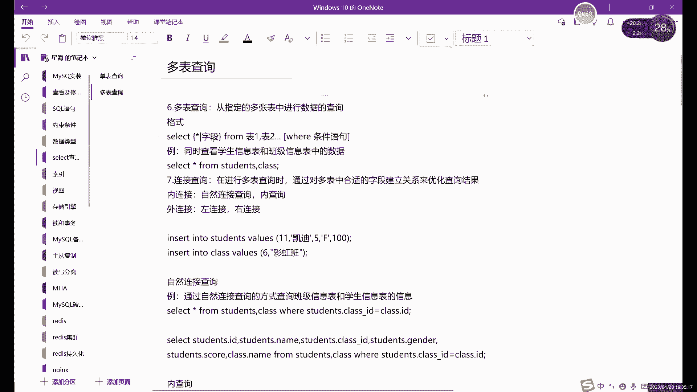

其他的我们什么什么条件都不加，就比如说我们正常的话select信号form，那么看我们的学生表，是这样的对吧，看那个班级表的话，class class应该是这个单词诶不对，看哪个单词啊啊class啊。

对CLAS啊，这个表对吧，两个表啊，如果说把它俩加在一起对吧，之前的话我们说过select这个语句呢，第一部分的话是写结果对吧，写查询结果我们还是新号对吧，我们还有信号。

后面的话form这里加的是表格名称，之前我们都是一个表格对吧，从来就没有改过，这边对吧，就最多的话在嵌套语句那里，把那个嵌套的语句放在这，那也其实只是一个表格对吧，我们用嵌套语句的时候。

其实form这里也是一个表格而已，那如果说想要查询多个表格情况下的话，首先肯定要把多个表格放在这里，就比如说呢先把这两个表的名字写在上面，写上来，students和什么呢。

和class i class两个表格对吧，这样的话就是什么，这种情况，就是首先多少上去肯定要有两个表的名字，然后后面的where呢我们可以先不加对吧，之前我们正常查询对吧。

你select的新from加上class也好对吧，加上这段也好，都能查询出我们整个表格的一个结果，是不是唉，所以说呢我们接下来来看一下，这查能不能查出一个结果来，唉首先我们就直接执行，那没问题对吧。

能有结果，这个结果呢，可以看一下数量特别多，唉为什么数量特别多呢，那首先对吧，配齐四次，你看每个名字都出现了四次，为什么每次都出现了四次呢，啊其实原因很简单，就是我们这种查询方式啊。

它本身就是相当于是一个错误的语法啊，但是不影响我们正常的显示，正常的话我们这个表格是11列对吧，11行啊，这个表格是四行，将两个表格的所有情况呢都结合起来，那就是什么，那就是四十四十四行对吧。

就是每一个情况你看排到11，每个人都有四次，相当于将每个班级和他这个本身的信息哎，就是班级信息和我们的学生信息呢，每一次都做了个排列组合，相当于是对吧，11×4，那不就是44嘛。

所以说它就变成了44行数据，这样的话肯定是怎么说呢，这这44行里面肯定有11行是正确的，但是呢剩下的33行都是错误的数据，也都是我们无意义的数据，所以说正常的我们都表查询呢。

肯定不能说哎你直接select新from，加两个表格就完事了对吧，那其实我们就不用讲了对吧，多大查询的话，我们是有特殊的语法，一旦说你不往后边加的表格呢，是两个或两个以上的时候。

就不能用正常的这个slide语的语法啊，会我们接下来的话就来具体讲一下，这个坐标查询的语法怎么用，对吧，你看这里虽然说它能显示一些数据，但是明显就是什么明显就特别乱，哎，他相当于把所有的组合排列。

组合都给我写了一次啊，相当于用穷举的方法，把所有的这个组合都是写类似。

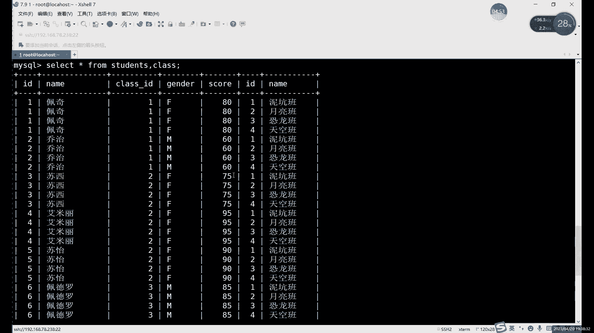

那我们接下来的话就来具体看一下，你的多表查询呢怎么用，首先呢这样查询肯定是不对的，虽然说有数据，但是呢这个数据呢不合理，而且呢很浪费这个浪费，我们这个相当于是其实也降降低了，不用说降低吧。

就是他查询速度会有点慢，为什么呢，当然这个速度慢，它就不是用来查询的，而且还可以将给我们做排列组合是吧，做了44个不同的排列组合，其实根本就没有这么多数据啊，反倒查数据越查越多，那肯定不对对吧啊。

所以说在多个查询里面。

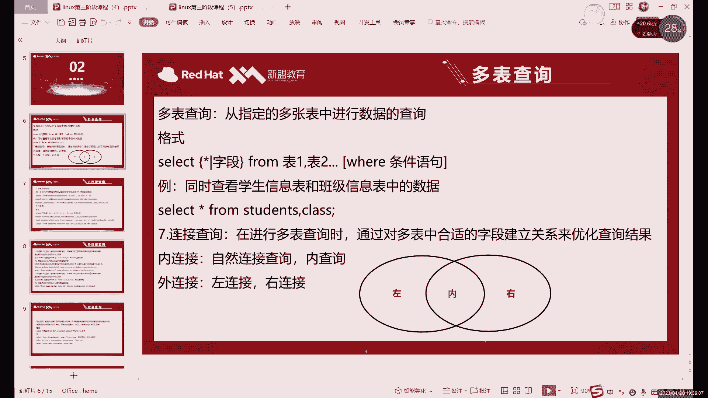

我们其实用到的查询方式呢，其实叫连接查询，连接查询连接的是什么呢，我们就是连接两个表的，两个表格当中的一个相同数语，就是把两个表格当中的相同数据连在一起，唉这样的话就可以什么呢。

可以帮我们过滤一些无用的无意义的数据，就比如说我们可以看到我们刚才过滤出这些啊，我们找一个class i d吧，cos d等于一对吧，首先第一个配齐，配齐class id是一。

所以说它对应的就是第一个班级，这个是没问题的，那下面三个的话其实都是什么，都是他列举出来啊，234他都分别列举一次，也就是正确的数据只有这一个，那我们怎么怎么将这正确的数据过滤出来呢。

啊我们可以看到有两个数据是相同的，在我们这个表格当中，哪两个呢是class id和id都是一啊，但不要看前面这前面这个是呃学生的id，这两个都是什么，都是班级的id，哎这个相同指的是什么。

我这里说的其实并不是指数据相同，而是而是什么，而是指数据的这个类型相同，它表达的是同一类的东西，这样的话用这种这个应该要用这种数据啊，两种这两列相同的数据啊，他们虽然说的名字不一样。

但是他们表达的意思是一样的，都是都是班级D对吧，你看像这个虽然说他长的也一样对吧，都是一，但是呢它是一个学生的，所以说呢我们需要的是什么，需要的是这两个ID，通过这两个id来过滤我们的一个正确的数据。

来教我们正确数据整个过滤出来，所以说呢连接查询呢就是连接他俩，就把这两个id呢连接在一起，就是我们的SISTANCE里的class id和class表格里面的id，这两个字段连在一起。

这两个只要一匹配哎，它就能过滤一些无用数据，什么意思呢，就比如说我们这里是一对吧，和我们这个表格里面的匹配的话，一等于一，所以说呢我们就使用这条数据，那后面的234不等于一就全部删掉了啊，它会自动删掉。

这后边这三后边这三个数据会直接删掉啊，相当于给我们过滤了很多无用信息，就比如说我们可以直接啊来执行一下啊，那连接查询怎么怎么用呢。

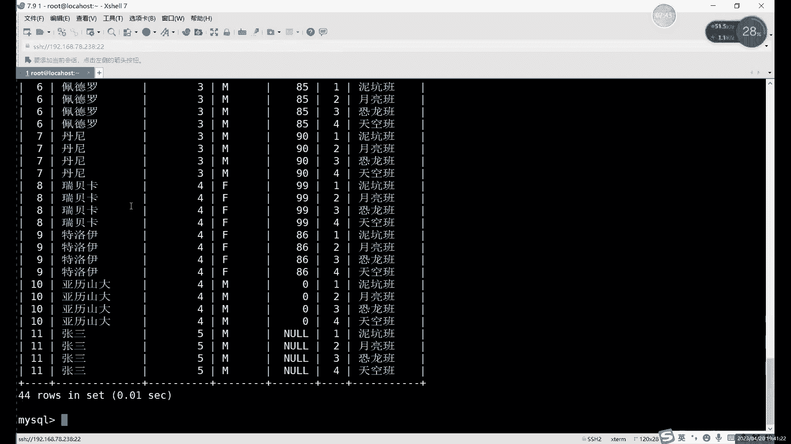

那首先呢我们先来看什么呢，我们先不看这个图啊，我们先来用一下最简单的一个连接查询的方式。

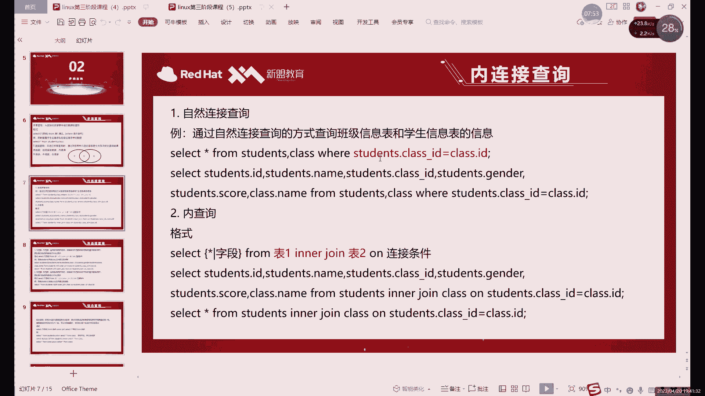

两种方式啊，就是我们正常两个表格查询的话，有两种方式，哪两种呢，我们的这个一种呢是在where的条件语句里面，后面去限制一种呢，还是在from别限制两个呢，效果是一样的啊，所以写哪都可以啊。

写在哪里都可以啊，where的话，这里就更偏向于条件的语句，条件语句，而这个form后边的话就其实就是将两个表格呢啊，联系在一起，其实是一样的啊，它们的效果一样，只不过不一样的是就是写法不一样啊。

就是这两个效果其实都是相同的啊。

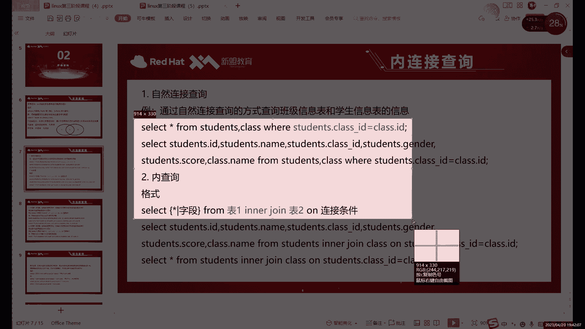

效果都是相同的，就比如说呢我们来看一下，首先的话，我们这两个表格的这个名称不用变对吧，后边我们可以直接where为我们这个限制条件呢，它比较特殊啊，这次我们写的建设条件，跟我们前面写的都不一样。

之前我等于号的话，有时候是什么，有时候写字符对吧，某一个值等于某就是某一个字段呢，等于某一个值，有时候字符有时候数字整数啊什么的对吧，这次的话我们是什么呢，没有数，没有数据，没有数值，也没有字符。

我们用的什么，就是将两个字段相等，这里的含义就是把它俩联系在一起，查找什么呢，更或者说换一种说法，就是查找这两个值，这两列里边值相同的一个数据，唉就是什么呢，就是这个意思其实很简单。

就是class id里边等于一的对吧，我们这个class点ID等于一的，我们就显示出来，就class id相同的，显示出来不同的就不过这个调对吧，正常的话我们没有这个where语句的话。

我们是这样的对吧，那这个where语句的话其实就是一等于一，那就显示对吧，一等不等于二，那就不显示，所以说呢第二个比如说乔治这里，你看第二个的话就是二啊，还是一对吧，一等于一。

那就显示这个还是显示这个下面的话。

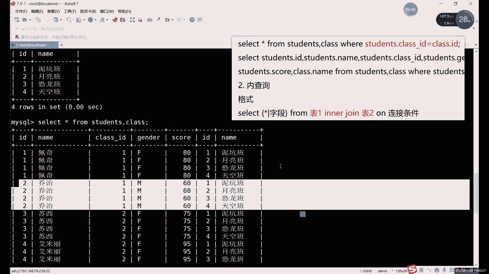

比如说啊有一些其他数据了，如果换第三位同学，他的单机是二，所以说它显示的是第二这一列啊，这一行啊，这个的where条件限制语句，就是让他俩里边数据相同的，数据相同的显示出来啊，这是一种方式。

原理其实不一样，但是结果一样啊，这两种语句的话原理不一样，但是结果是相同的，大家可以看啊，我们就直接过滤出来了，我们一看到我们只过滤出什么，只过滤了12信息，唉只过滤的是行信息。

但是我们class id这里呢不是不是class student，表格里面其实是我们后面又添加了一张三对吧，他为什么没有呢，我们看一下他的id是谁呢，他的id是五，他的id是5pass。

表格里面是1234没有五没有五，怎么办呢，就他就找不到，相当于是找不到cos id和class点id相同的字段，找不到呢自然就不会显示了，哎不是说这个数据没有，我们正因为是这个什么，它是个条件。

where条件语句，他只过滤我们这个需要的条件，他这个条件不满足，那我们自然就不需要它了，那就不显示这个数据对吧，这个就是什么，这个就是我们的连接查询的用法，其实主要呢就是用一个VR的条件啊。

用where条件来限制我们的这个获取的数据，这是一种第二种写法呢，也是结果是一样的啊，结果是一样的，只不过他这个就是嗯怎么说呢，这个是比较专业的，上面那个呢其实就是用了个VR条件语句。

下面这个是专业的什么呢，专业的多表查询的用法，比如说，比如我们这里写什么啊，from后边我们继续写什么，继续写表格名字表一表二呢，就是你前面写的表它就叫表一，后面写的叫表叫表二嗯总体上来说呢，其实嗯。

这个表一表二，其实在这里呢没有什么太大含义啊，但是我后面的话这个表一表二还是很有用的，所以说这里的话就先写哪个都可以啊，现在哪个系都可以，因为这两这个零这种查询方式呢，我们这里其实，呃谁前谁后无所谓啊。

谁前谁后无所谓啊，inner joy加上什么呢，加上我们的表二，表二是谁，表二是class对吧，两个表连接在一起，到现在其实我们还是在from后边，还是在from这语句里。

我们写的其实就是将这两个表联系在一块，通过哪个条件呢，通过class id这个，通过cos d这个条件，当然了，你不能直接写car s d，因为因为是两个表格。

两个表格的话class CD它也是不一样的，是它是两个不一样的名字，叫名字叫法不一样，所以我们还是得写上表格的名字，加class id等于其实看起来差不多对吧，一个是用VR去连接查询的条件。

where的话相当于是用select语句去限制条件，这个二的话是我们这个多表查询的，特殊的用法啊，他这里头其实都没加什么的，都没有用where第二个语句根本就没有用where啊。

我们限制这个用连用的是二来连接，作用是一样的啊，作用是一样的，就是换了一种用法啊，作用是一样的，比如说呢我们可以来看一下这个，这里的话正常的两个class点id啊，class点id大家可以看。

其实这两个结果呢，唉这两个结果其实是一样的对吧，只不过呢他俩只是用法不一样啊，VR它是通过什么，它是通过一个限制条件，通过一个条件来限制啊，通过这两个id的条件相同来限制，这个的话其实也类似。

只不过呢就是用法不一样啊，它没有用where的条件，而是直接在from后面加上了，我们这种多有啥特殊用法啊，对有特殊用法，啊对代表查小表，小表查表，查询速度肯定是肯定是会不一样的啊，肯定是会不一样的。

大表反应小表，其实一般情况下的话速度会稍微快一些啊，速度肯定会稍微快一些，其实主要是因为，如果前面这个代表的话，其实我们正常，正常的话其实就是什么就是将什么，将我们的这个传输结果。

长尾客户客户端的时候呢，其实一般查询结果会比较通常比较小，所以说传输的数据量也比较少啊，所以说呢大表查小表其实一般会快一些，当然这个其实和索引的这个也有一点关系啊，和索引其实也有关系，一般情况下呢。

其实小表的索引呢，其实查找的效率肯定是更高的对吧，数表比较小，索引其实数据越少，索引肯定是越快的，是索引是就查找速度肯定是越快的，然后如果你是大小表查代表的话，其实我们一般就会通过一些。

因为扫代表里面数据很多吧，啊代表里面数据数据量是比较大的，所以说查询速度肯定会比较慢啊，函数速度肯定会比较慢，声音有点卡吗，还是画面不是画面没有动啊，声音是不是有点卡，刚才应该这里还好。

我这倒是没有看到声音有点卡，是不我再换个耳机，现在怎么样，感觉这两个耳机没有一天，可能有一天是左边耳机好用，有一天是右边耳机好用，现在我又换到左边的耳机，现在的声音怎么样，应该还可以吧。

就一般情况下的话，就最好的，最好是大表放在前面啊，大表放在前面，大小其实就是看什么，就看数据量啊，最主要看一下数据量，声音有时候破音是破音，是不是有有时候声音稍微有点亮嗯。

就是查询的时候就是我们多表查询的时候，你把大的表放在前面啊，通过通过大的去查小的，因为小的数据量比较少啊，小的数据量比较少，考察一点啊，如果说您是从小的去查大的话，相当于是你这个要把大表里面的数据。

全部要过一遍的话，数据量越大速度越慢啊，数据量越大速度越慢，这个的话这种查询呢我们主要就是通过什么呢，这两种都是什么，都是我们的连接条件，就是通过我们这两个id呢，就相同的数据就全部过滤出来啊。

就过滤相同的数据，所以说呢啊这种连接查询的话，它的名字叫什么呢。

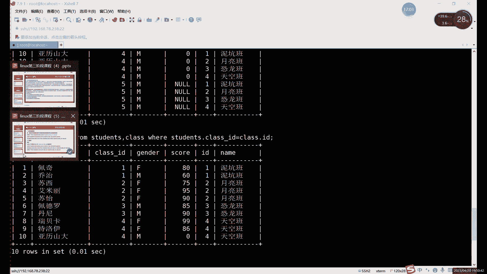

一般就是可以叫，其实叫法很多啊，你这其实理解了他的这个命令的作用就行了，叫法的话其实无所谓对吧，内连接上啊和自然间查询两种呢，就是用法不一样，它实际的一个结果是一样的，就是我们刚才查的是哪部分呢。

啊刚才查的是这部分，然后这部分的内连接查询呢其实就是什么，就是查询一些我们的这个两个表格当中的，相同的数据，为什么这么说呢，其实是你看我们前面在左边这个表格。

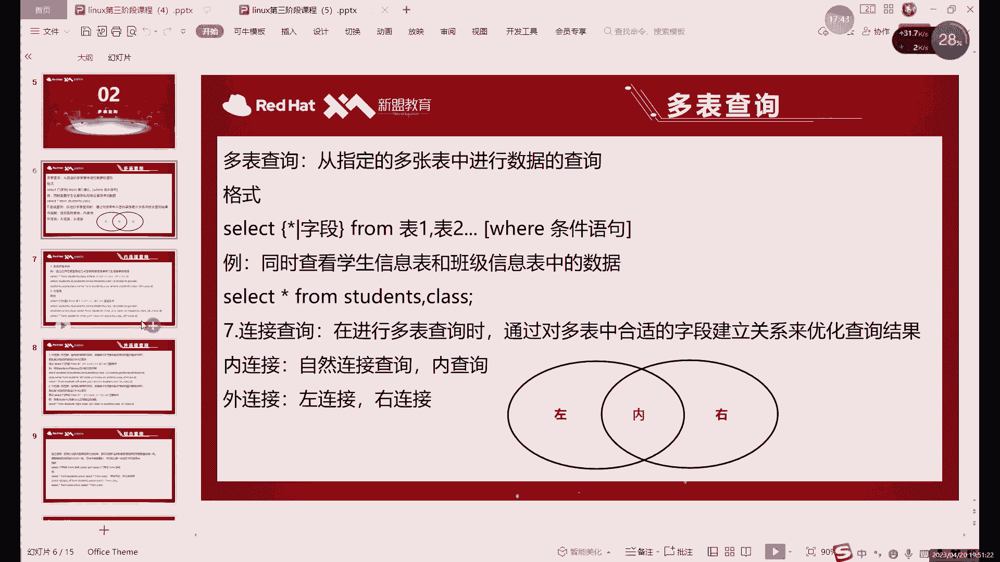

就比如说我们左边这个表格是，一共有11行数据对吧，但是我们的连接查询只能查出十行，就是因为第11行的数据呢，我们第一个表格里面有对吧，这个class id里有第二个id里面没有。

这种情况下的话就会出现什么问题呢对吧，就是我们的日常内联系查询，第一个表格里面有五，但是第二个表格没有的话，他也没法匹配我们的条件对吧，没办法匹配条件的话，它就会什么，他就会直接。

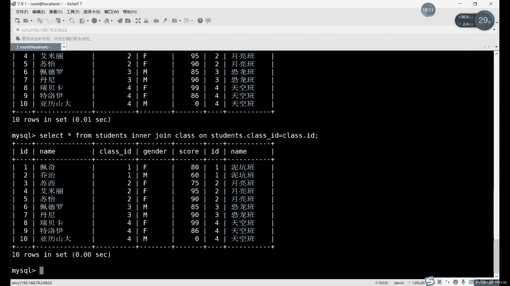

也就不显示，也就是我们的11那个就是张三的张三同学，他是在左边的啊，因为它的数据的话和我们右边是不一样的，张三同学其实在左边，我们刚才的这个这两种，其实他查的都是哪部分内容呢，都是中间这部分内容。

唉中间这部分内容，所以说呢这里的话第一种查询的话，其实就是查询什么的啊，我刚才讲的第一种查询，其实就是查询两个表格当中，那就支付针对于某一个字段啊，某一个针对于这个字段。

我们当前这两个表格当中相符的内容啊，就是数据相同的内容，就是我们的内连接查询，当然那与它相对的啊，我们左边是有一部分内容对吧，右边也有一部分内容啊，这两部分内容如果说通过我们这种查询方式。

它如果显示不出来的话，其实我们数据也可以说是不完整对吧，但如果说想要显示左边啊，或者说右边内容的话，怎么办呢，就是用我们的其他的两种其他的连接方式啊，就是换一下我们这种命令啊，就得换命令啊。

接下来说的是啊，我们说这个左连接和右连接哎，就是左边这部分，右边这部分，那么现在的话，其实我们张三其实就相当于在左边了，右边呢没有11，这一个不是没有11没有五这个id对吧，包括右边的话。

就是我们在插入插入插入一条内容吧。

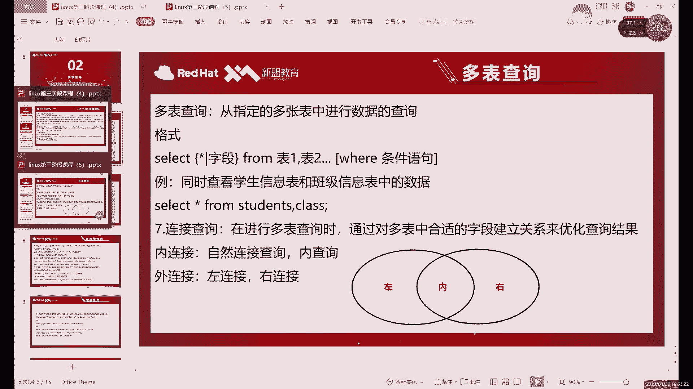

比如在这class表格里我再插一条啊，方便演示啊，Insert into，看啊123456对吧，看个六吧，六的话我就随便写一个，啊再查一下内容，再看一行内容呢，现在第三个表格里面它是有什么。

不是第一不是第三个，第二个表格里select是from啊，加上什么，加上class，对啊，我们现在是12346，左边这个表格呢是12345对，两个表格其实都已经有了不同的消息啊，不同的信息了啊。

不同信息了，不同的信息的话，我们是可以通过什么，就是通过单独的左连接或者右连接能够显示啊，通过左连接连接显示左右其实是怎么区分呢，就是通过表一表二来区分的。

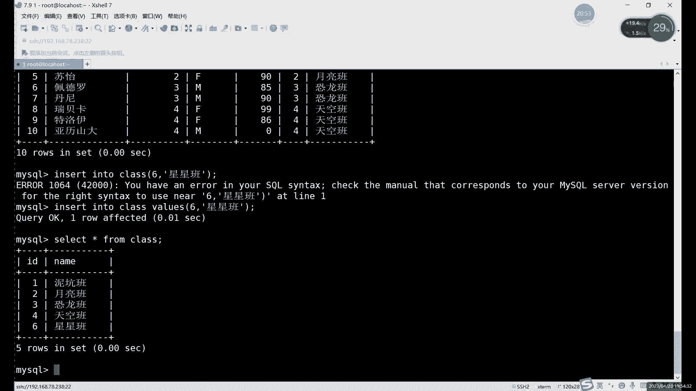

我刚才不是说了吗，就是刚才的其实你左边写哪个，其实结果都一样对吧啊，先写哪个，其实结果都一样，但是左右呢就不一样了，左右它是通过什么去区分，就是通过表一和表二去区分的啊，连接方式的话。

其实我们这个是现在说了三种对吧，现在说了三种，其实呢完整的话一共有1234567，一共有七种，其实解连接方式我们一共有七种啊，不着急，我们一个一个说啊，现在我们也只是说了三种而已啊，一共有七种方式。

啊对对，其实就是谁在前面，谁就是左边这个谁就是谁在左边，谁在谁是表一，那谁就是左，谁是表二，谁就是右啊，就是这么区分的，所以说呢如果说你用了左连接和右连接的话，这个表一表二的顺序其实就有哎。

就需要什么只需要考虑一下，当然了，如果说你两个表很明显的有大小之分的话，其实就是把大表尽量放左边啊，如果说差不多的情况下呢，那其实哪个放前面都可以啊，主要就是放前面的就是代表的是组合是吧，表二就是右啊。

左连接查询的内容是什么呢，他查询的是我们左边独有的内容，和相同的内容啊，这左边独有的和相同的这一部分，什么意思，就是我们的它其实就是什么，就是换一种说法，就是，表一全部的内容啊。

等于全部内容加上什么加上表二，加上和表面相同的一部分内容啊，这个就是我们这个就是左连接啊，就是以以我们的表意为主，那又连接的话就是以表二为主，那就是以表二为主。

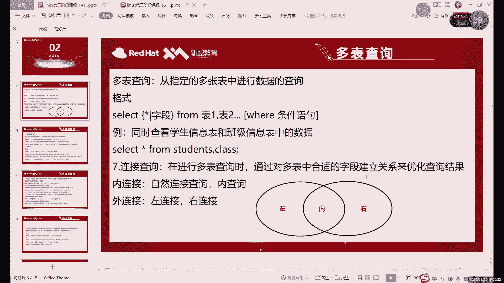

这个的话比如说我们直接给大家演示一下啊，人演示一下，比如说我们现在还是用students做表一啊，students class做表二，我的顺序就不变了啊，顺序就不变了，然后呢我们接下来看什么呢。

接下来看一下左和右啊，它是一个区别啊，它它的一个区别，首先命令的话其实他就是单词换了个单词，其他的是一样的啊，就是left和right的一个区别，left这里的话就是就是我们英文组嘛对吧。

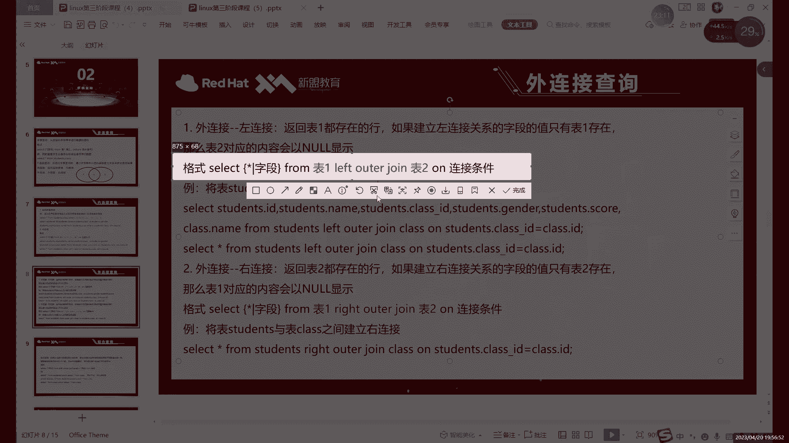

right吧，就是英文右，这段话首先我们先啊还是用什么，还是用students作为什么作为表一啊，还是加students作为表意，比如说我们这里表一写的话，看students写在哪呢。

S t u d n t s lt，然后呢left这个啊，左对吧，左连接查询，二后边跟的条件呢还是一样的啊，二后边跟的条件还是一样的，cos i d等于bus的id啊，左连接查询大家可以看啊。

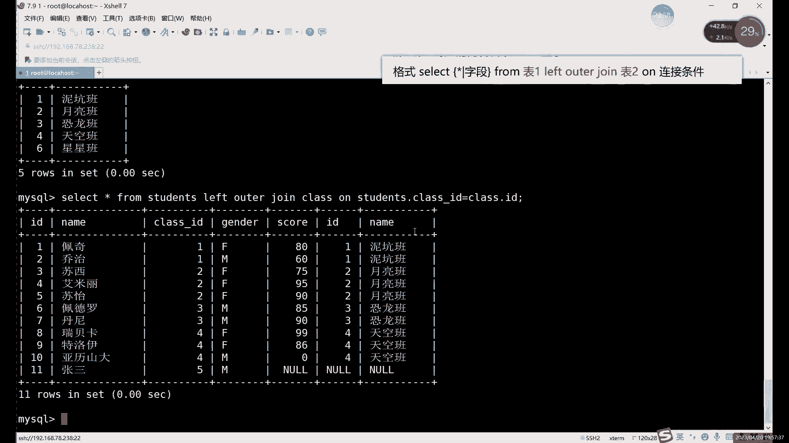

就是这里的话上边的第十，上面十条的话，和我们前面的那个内连接是一样的啊，也就是这个左连接的话，其实就是包括了什么，包括了内连接。

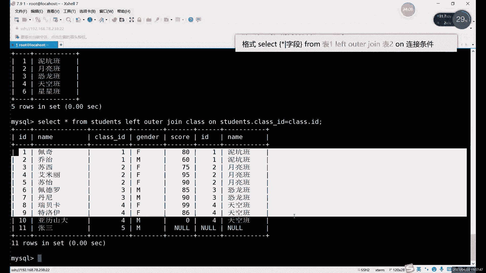

除了那些内连接的数据以外呢，还有哪一部分呢，就是我们表一的内容，表一剩下的所有内容呢，没有和我们的表面匹配的东西，就显示在最下面啊，这里面比如说这只是一条数据没有匹配，如果是十条数据没有匹配的话。

也会有的都写在下面啊，都写在下面，然后呢如果说因为他没有和这个匹配对吧，没有和表二匹配，所以说呢后边表二的内容的话，我们用空值去填啊，用空值去填充啊，这个左右其实都一样，那右的话对吧，反过来就是以谁呢。

以我们的class表为主，以class表为主显示出来的内容的话就是。

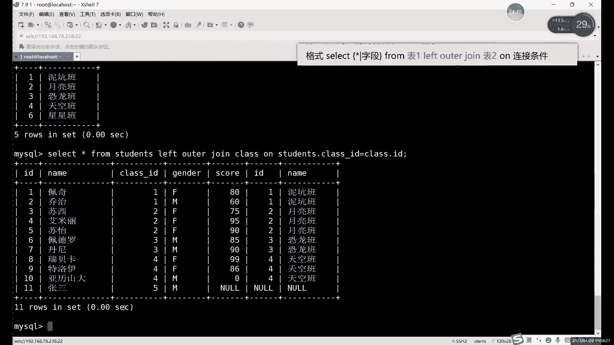

这边还是十条都有对吧，因为内连接都是有的啊，1234都有，然后呢五的话我们电压表没有。

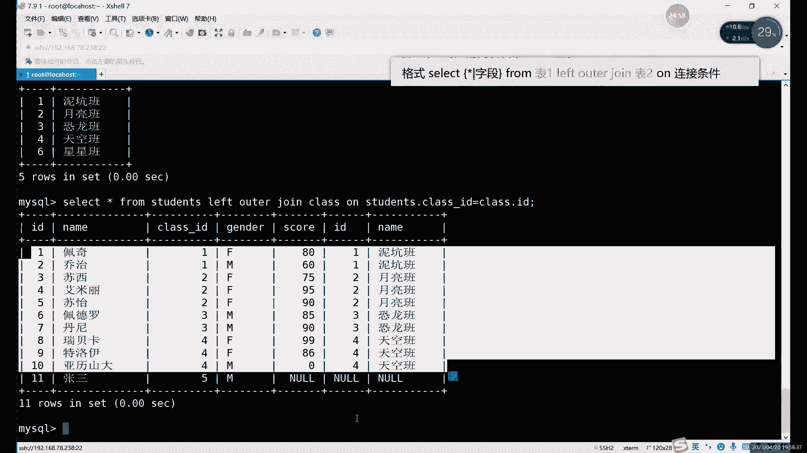

它有井，它有个六，我们刚才添加了一个六对吧，添加一个六，然后它就会显示它六这个班级，那我们可以来演示去了，左右的话其实就是什么呢，就是把这个两边换了一下啊，左右就是把两边换了一下。

或者说其实你甚至不换左右都行，你把这个class和students的一个位置换一下，他也是效果也是一样的啊，我们这里就换了，换这个单词吧，我们把这个left换成Y啊，不换两个表位置吧。

我们还是尽量是因为这两个表，我们还是有一点区别的对吧，有点区别的，这里的话我们换成right之后呢，我们直接执行，大家可以看到前面就全变成空了，空值了对吧，从这个id一直到成绩一直是空的。

到哪开始才有了呢，他又到id这里，哎这个是什么，这就是U的啊，又连接查询，就是包括了我们内连接查询和什么，和我们第二个表二的剩下的所有内容啊，这样同样同样也是一样的，如果说你有七班，八班也会列在下面啊。

前面的话肯定都是空值，因为四个字表格里没有这个六班的同学对吧，没有六六班啊，这个就是左连接和右连接的区别。

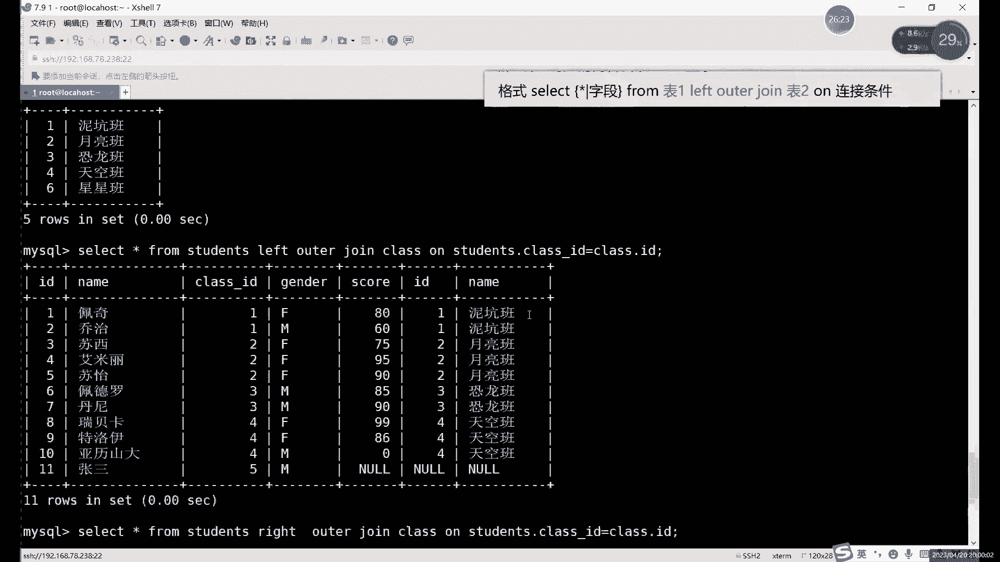

左右的话其实你就可以看成就看成这个椭，就看这个椭圆就行对吧，左边低右连接，其实看那个椭圆内连接是中间那部分，左的话其实准确来说是这个椭圆，然后右边的话是这个椭圆啊，他不是说左连接就是表就全是表率的数据。

还是表一加上相同的数据，右连接就是表二加上相同的数据，哎这就是左右连接的一个区别啊，以及他俩的话，其实都是都是包括这个内查询的一些数据的啊，都是里面都是包括这个，然后呢我们接下来看什么。

看一个这个是什么，这是我们的以左右对吧，加上内连接，下面的话我们还有还有几种，还有几种，比如说我们接下来看这个嗯二左右啊，但是这个是联合查询啊，我们就先不说联合查询吧，我们先说这个。

与全连接查询吧啊全连接查询，什么叫权利的查询呢，啊就是什么，就是，两个椭圆一起返回啊，不知道能不能理解这个全连接的话，就是返回全部的意思吧，但是呢返回全部的话，它也不是说直接把两个椭圆的数据全对。

对在一块，而是什么呢，而是。

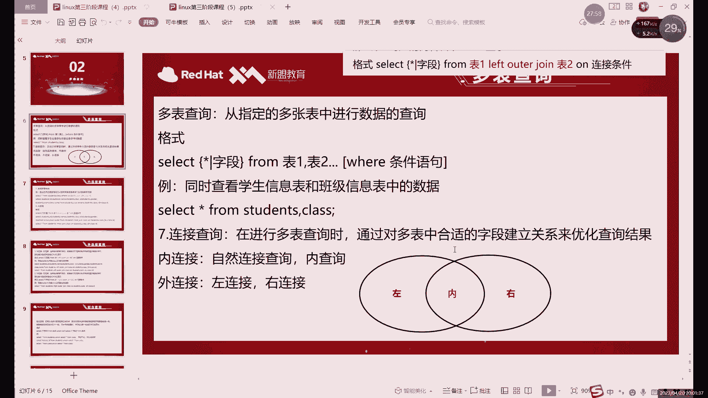

中间的正常显示对吧，内连接我们还是包括还是包括内连接的，有包括相同数据，不同数据呢就是左边和右边这两部分对吧，这两部分的话我们也一块去显示啊，一块就显示，唉就比如说我们可以看一下这里的话。

还是换单词就行，我们不换位置啊，换单词不换位置，换了一个for，这里全连接嘛，就是报所有的，相当于是所有嘛，哎不对，换错位置了，就前面这个，不然后呢alt，啊全链接查询的话，这里我们就是说相当于什么。

包括两两个表格当中相同的内容和不同的内容，所有的东西都放在一块了，就是能匹配的尽量都匹配，不能匹配的我们分开显示啊，不能匹配的我们分开显示，所以这里显示出来最终结果的话，其实就是什么。

就是把把我们上面那个左连接和右连接，加在一块儿，那先把左连接和右连接加到一块去显示啊，加到一块去显示，比如说我们这里直接执行啊，直接执行来for order，没有看下BOUTER。

还有outer door students，Relaxing from，报错是在alter那里，这表格名字我没问题，还是也报了一个不知道的好嗯，students点class id等于class点id。

嗯看一下select新from seasons第一个表对吧，我们four对啊，查看表是正常的，刚才我们不也用的是students点2class d吗，表示在的啊，我想啊，不知道的行。

for alter是吧，啊students点class1等于class y d报的措施，在alter这里，O u t e r r o，MYSQL的全外链接，看一下啊。

这个outer falter全连接的话嗯，正常这里，内连接我们取两张表的交集嘛对吧，取两张表的交集，左外连接取的是A表和交集，左连接右连接，哦对这个MYSQL不支持这个命令。

他MYSQL不是不支持这个强化联系，他支持他只是全连接，它是支持，但是它不支持这个命令啊，不支持这个命令。

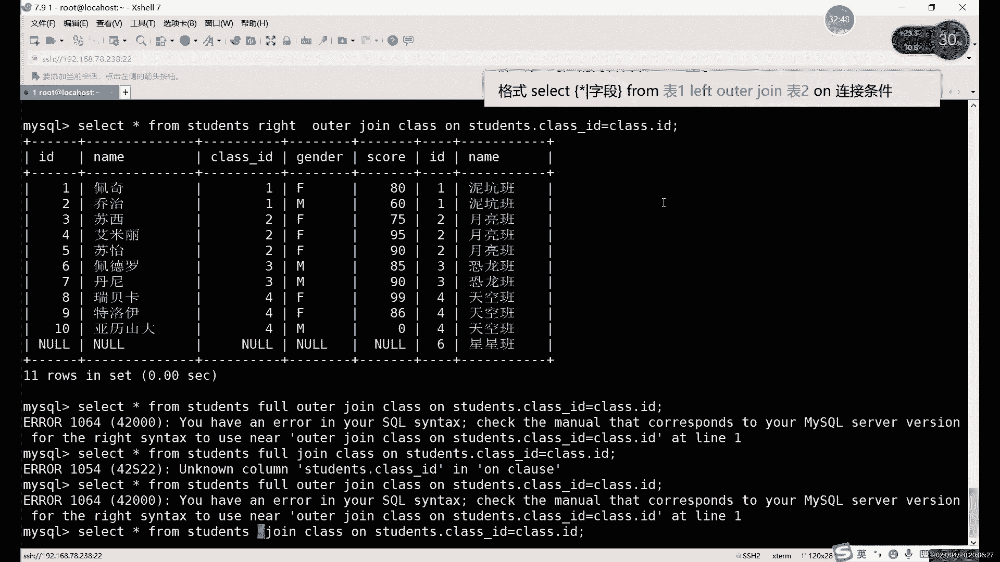

对是UI，就是我们下面这个就是我们下面那个什么，看看这个联合查询这里啊，联合查询这个用法，MYSQL的话，他倒是支持这个全连接，但是呢它不支持这个呃go out这种写法，它是用什么。

我们用这个union这种写法，这种解法的话，联合查询的话，可以将多次的查询结果合并起来啊，将多次多次合并，多次的查询结果合并，能用这种方式，这种方法的话，其实。

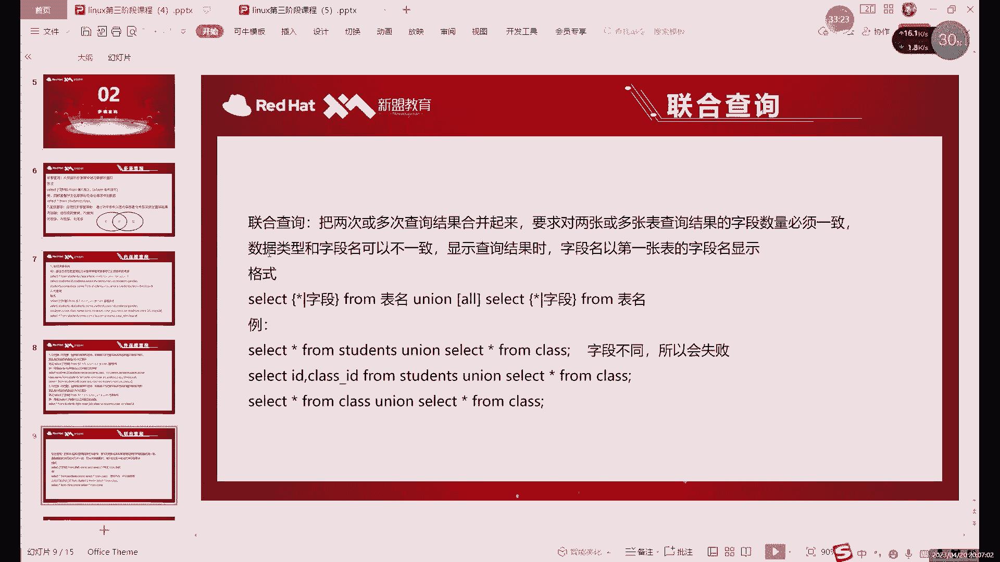

这种方法其实它不算多表查询啊，其实不算多表查询，但是呢我们这个MYSQL里面可以用这个union呢，将什么，将我们的多个表格当中的，这个就是相当于这里的话就代替了这个for alter。

这个用命令for not a joy，或者说for joy的话，MYSQL没有这个命令，MYSQL没有这个命令，都是支持到这还支持的，我们把中间这个换一下。

嗯select seen from students，然后呢加上我们这个，左左左去哪儿呢，你打断一下吧，我把左的复制出来吧，怎么做全连接呢，我们这里的话MYSQL比较特殊，因为它没有刚才这个命令的话。

MYSQL不支持这个命令，其他数据库还是有的，然后这里的话我们把这个这个是左连接对吧，我们MYSQL里面做全连接呃，其实很简单啊，非常简单粗暴，就是把这两个连接在一起啊，union的话它是代表什么。

它代表的是连接，就是联合查询，就是它是可以将两次的查询结果，合在合并在一起的啊，将两次查询合并在一起，这种话可以用在像我们这种全连接的情况下，也可以是什么，也可以是两个表格的两次查询呢。

啊两个字查询的不同结果呢拼合并在一起，拼在一块，也可以用这个游扭啊，又用这种查询方式，这里的话我们拼一下谁呢。

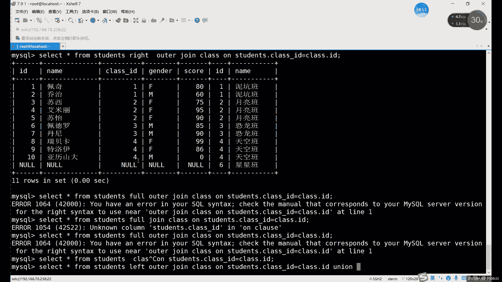

我们拼这个就是左和右拼在一块啊，我们全连接是左右拼在一块儿啊。

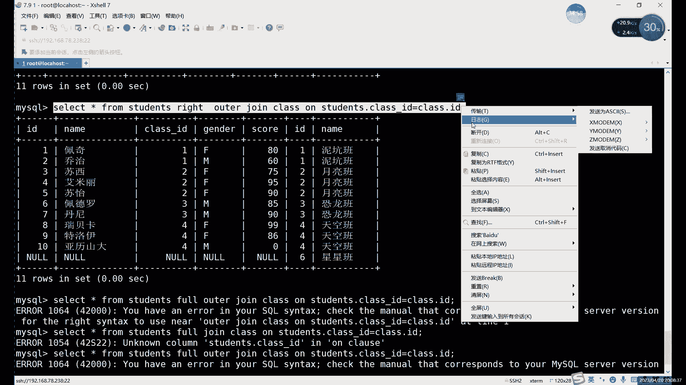

那就是把左和右拼在一起，看一下命令应该是没问题，left对吧，这个是right，中间呢用UU连在一块。

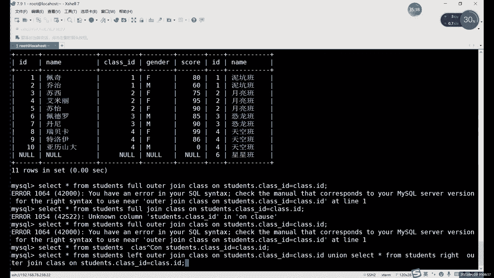

那我们直接回车对吧，这里的话大家可以看到除了1~10以外呢，下面还包括什么11对吧，右边是空的，然后六班级的话，这里的话前面是空的对吧，这个其实就是什么，这就是全联接查询，就是什么，就是嗯代表哪一块呢。

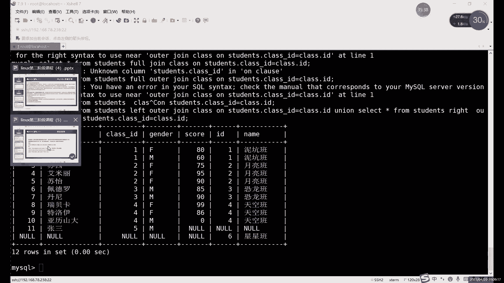

我还是用这个图看吧啊，用这个图看刚才的内连接查询呢是中间这块啊，中间这块是内连接查询，左的话是这一圈啊，这一圈是多啊，这一圈是左，然后右连接查询是这一块，啊就是内部的加上我们右边啊，全链接呢。

就是我们这里这两个椭圆里边加起来，所有内容啊，这就是全连夜查询啊，全连夜查询，开始，啊左连接当然左连接右连接的话，这是我们已经说了什么，说了四种对吧，四种还有三种，还有三种是比较特殊的情况呃。

后后面三种的话，它是用来过滤一些没有匹配的信息的啊，是比较特殊的三种情况，就比如说呢我们还可以过滤哪一部分呢，就这一部分只要做的和只要右边，还有一种是什么呢，还有一种是只要两边的两边一起显示啊。

一共什么，一共七种方法啊，一共七种方法。

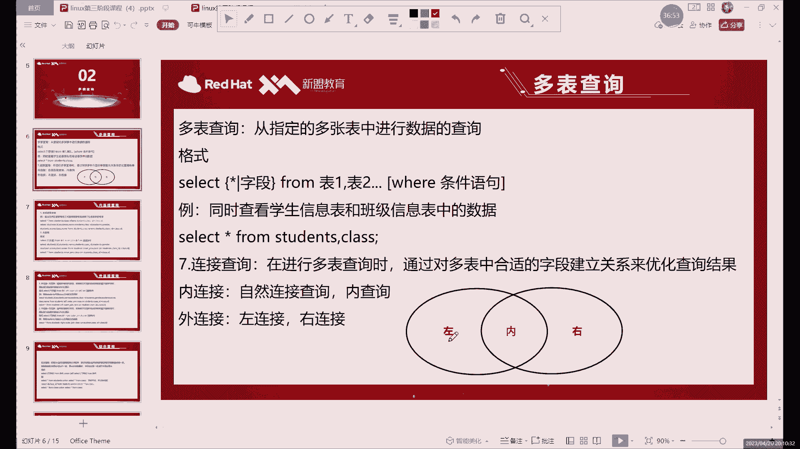

这里的话首先权利查询的话啊，这要注意就是MYSQL里面的权利查询的话，其他数据库里面到时候可以用这个B，哪去了命命运的啊，for joy或者说是for outer joy都可以啊，这两命都可以。

但是MYSQL0不支持MYSQL。

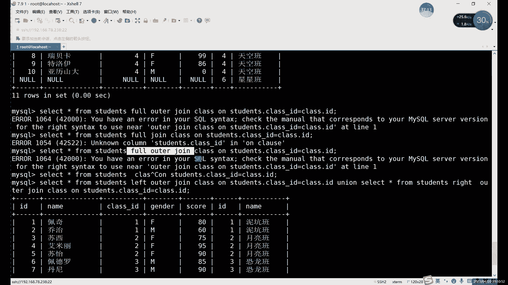

我们用什么，我们用这个联合查询的方式啊，用联合查询命令呢，将我们两次的查询结果呢合并在一起啊，作为这个权利证查询哎，都有权利介绍，然后左右呢，就是如果说只要左边那部分，或者说右边半部分的话。

怎么过滤呢啊就直接用什么呢，唉直接用我们这个二还是用on，其实这个方法很简单，我们直接用where就行了，由all加上where一起用啊，这样的话方便过滤一点是吧，比如说呢left可以用left。

就比如说如果说我们现在想要哪部分。

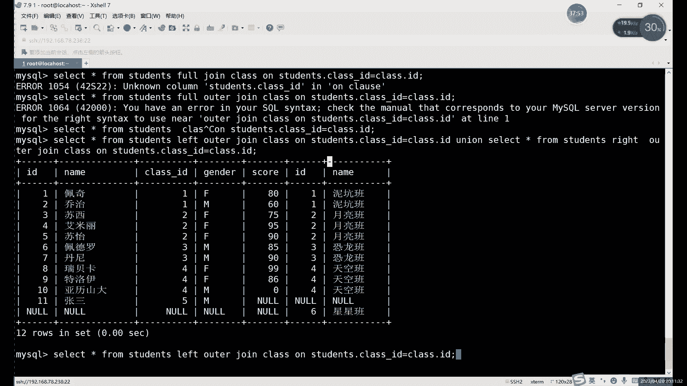

我们现在如果说只想要左边这部分，就不用内连接，我们只要左边这一小部分，这一小部分呢其实我们就一个数据对吧，就是张三那个数据这部分怎么提取呢。

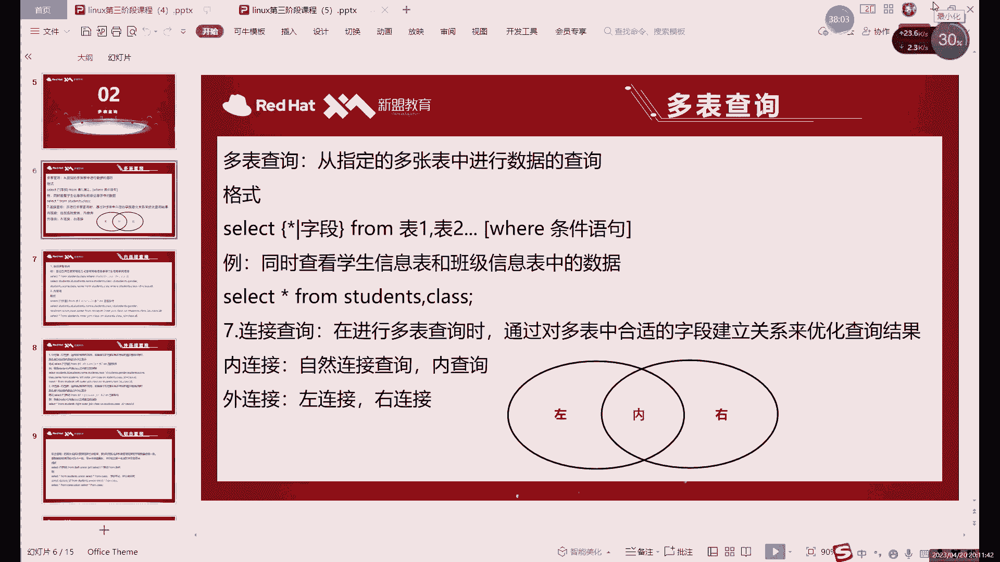

其实很简单，就是这个叫，我们右边这个字段叫什么来着啊，class id表格的话是哪个表格呢，啊就是class点点RD啊，Class i d，你只是想要左边那部分的话，我们就只需要什么呢。

只需要cad等于什么呢，啊等于now，831等于N，啊glass1等于二，这样的话其实就是左边那部分啊，如果说想要右边那部分呢，啊就这边这部分怎么办呢，那也是一样的，那就换一个id。

这两个的话其实我们主要是判断，通过这个class id和谁呢和这个id来判断，所以这里的话我们直接换成什么，换成student，啊students is not，这样的话就什么。

就是右边那个表格的a students弄好是空的啊，left是吧，我们把left换成right，这个是右边那部分的一个特殊的数据啊，特殊的数据就是第六个班级啊，当然了，最后一种应该能举一反三。

能推出来对吧，你看你用哪个呢，哎这是主要是，主要还是怪怪什么怪这个，怪MYSQL哈，这个这个只能说怪MYSQL它不支持，这个没办法啊，MYSQL它不支持，只能用什么，只能用。

这两个命令啊依然还是这两个名啊，不是说两个命令，就是依然还是我们这个UU的联合查询啊，联合查询名，诶联合查询这里left和right，你们得换个id，bug点id啊，复制错了。

复制了那个刚才空的那一行了啊，其实这个UI呢就是把相同的数，把这个两次的打输了，在这儿啊，就是把两次的命令呢，或者把两次的这个查询结果呢合并在一起啊，合并在一起，啊如果说你做这个连接的话。

其实不管是左连接，右连接还是什么，还是内连接，其实都一样，你都得知道条件呀，你不知道条件的话，你肯定不能怎么联系在一起呢对吧，因为什么两个表格里边，你数据肯定是大部分数据肯定都是不一样的啊。

可能只有几个对吧，有几个个别的这个字段，他们表达的是一样的含义对吧，就比如说我们这里这两个id，他就这两个id就所有数据都相同嘛，那肯定也不一定对吧，就像我们这里的话，ID这里有11对吧。

class d那边没有，class那边有个6students，这边有没有也不是说所有数据都相同，但是呢你这两列数据要什么呢，要保证这两列数据是否表达了同样的信息，同样的内容。

那这样的话自然我们这里的这个连接查询的话，就是通过我们这个特殊的条件，就能联系在一起啊，左右也好，其实然后通过这些的话，其实就是你只要怎么，你只要说把你连接的那个条件它变成空值，现在就能判断了。

只需要判断一下，你就只需要找那个你连接的条件，像其他条件行不行呢，其实也可以对吧，你比如说name等于now啊，name is n他也能出这个效果啊，但是呢其实你没必要去去找这个字段，你只需要什么。

只需要用你连接的那两个字段就行，因为两个表格你连接这个字段的话，如果说有不同的数据，那肯定就是如果说你要显示左边的表格里面，特殊的数据的话，那就把右边这个表格里面的字段变成了哎。

如果要显示右边特殊的一些数据对吧，你就把左边的写成，那自然都能过滤出来，自然就都能过一个，这个其实是通过看，主要是后边的话主要就是靠VR的一个过滤啊，二的话他这里我们只是连接的作用啊。

只是将两个字段连在一块，连在一块啊，我们这边过滤的话，你直接用一个WR，把一个特殊数据过滤出来就行了，啊这个就是什么，这就是我们的七种方式对吧，七种方式其实就是。

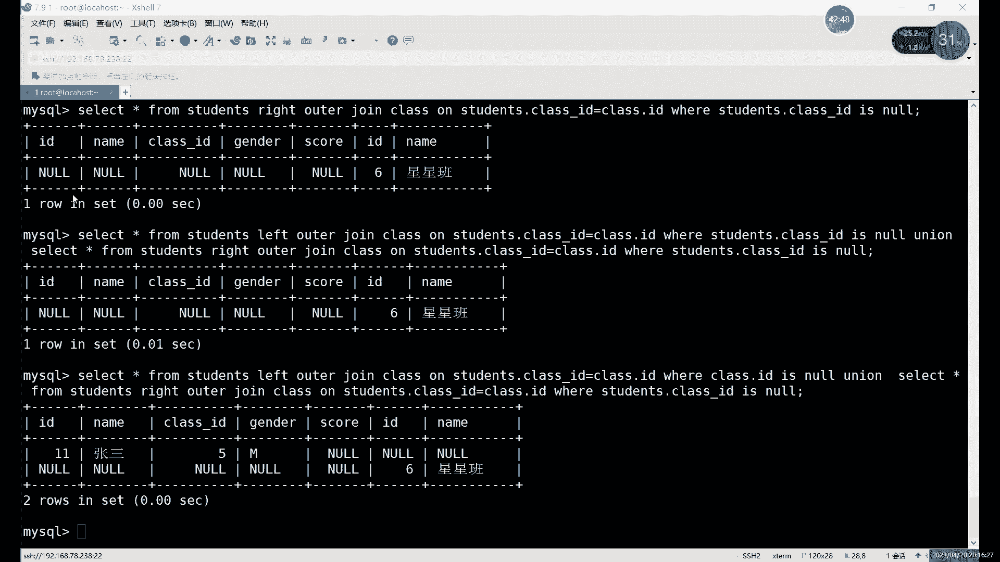

这两个椭圆的事对吧，内连接一种左边一种，右边一种全部一种四种嘛对吧，然后呢分别的左边特殊的数据，右边特殊的数据和两边啊都是多余的数据啊，你可以说它是多余的数据，因为两边没有两边。

相当于是没有匹配的数据的话，其实就哎就多余了呗啊，因为它就变成了变出了很多空值啊，因为没有R匹配，没有相同的数据啊，没有生成数据，这就是什么，这就是我们的七种多表查询的方式啊，这种多表查询的方式。

刚才的话我们是说了一个什么呢，嗯我刚才中间插了一个，这个叫最后这个联合查询对吧，联合查询其实主要的话，本来其实可以不用在这个多角弹性这里，只不过是因为MYSQL这里面有个命令不支持啊。

for全连接查询它不支持，所以说我们这里是被迫就用了一个，用了这个unit的连接查询它呢，它的作用是什么，就是联合查询，不能说连接查询，联合查询，它是将两次或者多次的查询结果连在一起，哎。

就是把你如果查个两三次的一些数据呢，可以堆在一起，像我们刚才其实就一样，我们一般就是把两次的查询数据呢，合并在一起的，那合并在一起显示对吧，相同的话它就会驱虫，然后就去掉，只会显示一次。

而且所有数据只会显示一次啊，这个就是什么，这就是联合查询的意思啊，就是作用，当然除了刚才的多表查询，我们可以用联合查询的话，我们正常的单个表格查询，其实也可以用两个联合就联合他就去连接对吧。

就比如说可能是一个表格啊，查询了两次啊，查询是不同的啊，查询出来的过滤的过滤的信息不一样，所以查询出了两次不同的信息啊，数据不一样啊，我们可以什么，如果这两次都需要的话，我们可以用这个联合查询呢。

就把这两个表格连在一起，就是把这两个查询结果，准确的说就是把这两个select语句连在一起，连在一起的查询结果呢其实就是什么，就是按照什么呢，按照我们这个从上到下对吧，就是前面的表肯定在上面啊。

后面一个在下边啊，这相方式去排列，啊这样排列之后的话，我们就能相当于是把两次查询结果，合并在一起了，合并在一起了，但是呢这个联合查询是有要求的，像我们刚才其实连韩语都是很正常的，没有任何报错信息啊。

没有什么特殊的情况，如果说你是两个不同的表格，或者说是一个表格的两次查询结果，一旦这两次查询结果就是两个自带语句呢，它的这个返回的列不一样啊，或者说就是返回的这个字段的数量，不一样的情况下呢，啊他就。

他也不能说报错，他就是很总之就是，尤其像这个，如果你的两个字段不一样的话，就比如说嗯，显示的就特别怪，所以说呢这个联合查询的话一定要注意，就是尽量保证什么，保证你的两次的查询结果这一个条件，而不是条件。

就是查询的结果，至少在类型上数据肯定是不一样的，一样的话就没必要用，就别用了，数据在不一样的情况下，尽量保证保证字段是相同的啊，保证自然相同，miss我们可以来看一下啊，我们来看一下。

如果说我们直接将class表格和students表格，用这种方式一起查行不行呢。

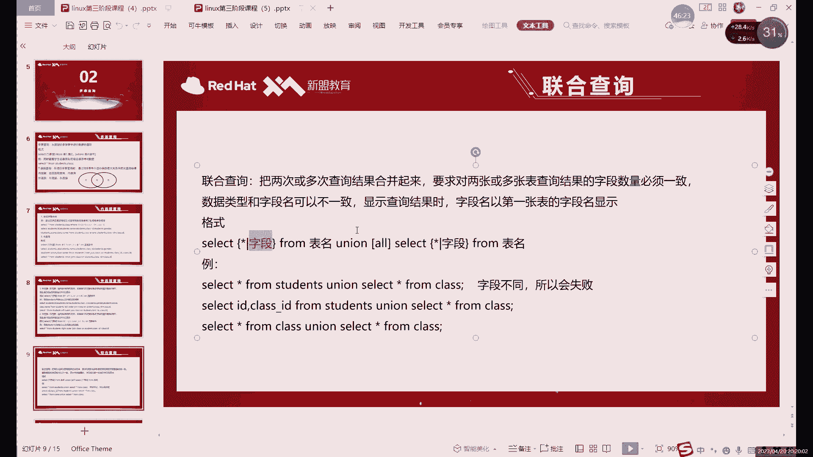

我们可以来试一下，前面我们是用的是联合，就是连接查询的方式，现在我们换成什么呢，我们换成这个联合查询的方式，就是UNION，就是我们刚才啊做全连接的时候啊，做全连接到全外连接的时候。

这两种的话我们可以直接写一下select in号，from pass啊，我们可以直接执行，而他会报一个什么错呢，它会报一个我们使用的这个查询的结果，它有不同的什么呢，啊不同的列啊。

number嘛啊列数呢不一样，为什么不一样呢，student总共一共是1234555列，class呢是两列对吧。

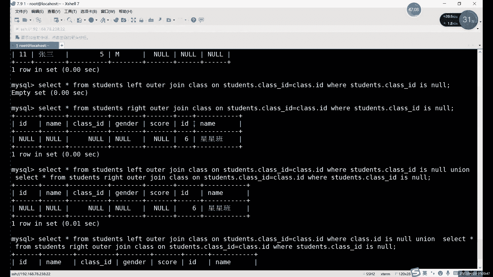