# 0基础小白怎么入门Linux运维？看这套，Linux运维全套培训课程，保姆级教学视频 - P80：中级运维-17.事务，锁，备份-中 - 小方脸不方- - BV138411B7p5

多多怎么创建呢，我们在select的时候啊，就是在那我们现在是SELECT吧。

啊用select语句，XH啊V啊，不加V2就直接破share，我可以直接这样写，啊这就是什么，这就是共享的移动速啊，这就是共享移动速诶，啊four s h a r e。

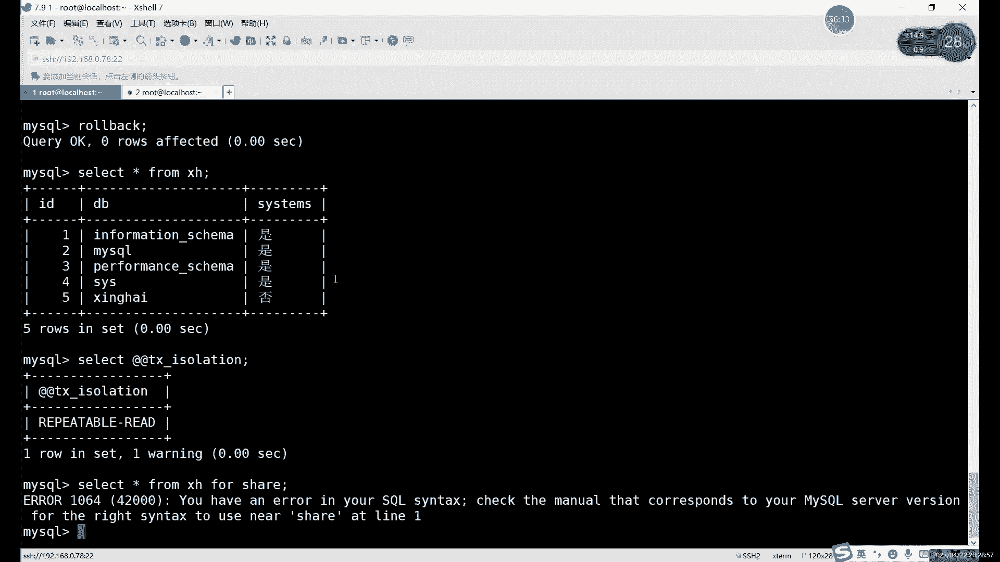

I log in shemo，啊lock in share mode，这个不是啊，for for的话，这个后边用的是什么，用的是排大嘴就共享。

懂的话，Lock in share mode，啊，这个的话就相当于创建者，就是创建了一个共享锁啊，只不共享锁的话，你看不出什么效果，为什么呢，因为你共享之后呢，就是你怎么就是多个终端是可以同时查询的啊。

查询这个命令的话，其实啊没有什么没有太大的限制啊，如果你是共享的一个用的共享锁的用法的话，就是查询上的话就没什么太大限制啊，没什么太大的限制，那哪个又有限制的，就是我们这个啊排查组。

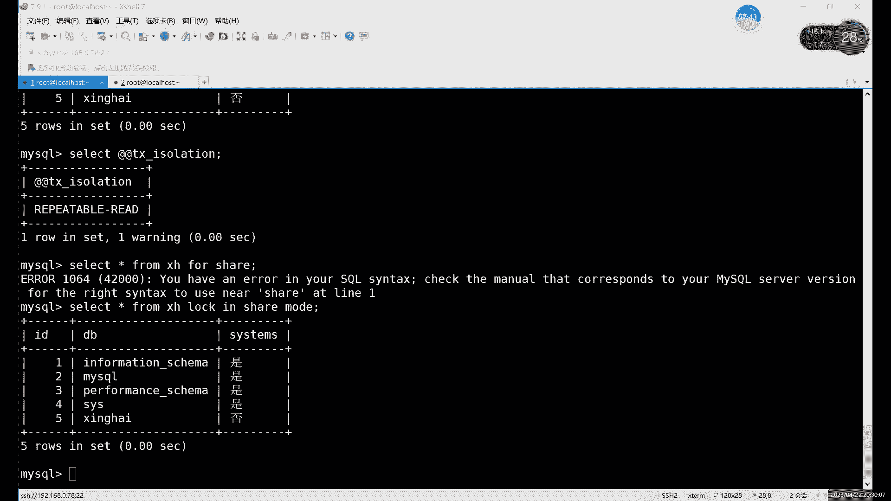

啊就是我们这个第二种，孩子走这里的话是什么，它是一个独占的啊，就是会阻塞其他事物啊，就是上面的话堵锁这边就共享锁，这边没什么太大问题，就是协索这里的话就是什么，它就是真的就是加什么就正常。

你这个终端在执行一个事物的时候呢，啊拒绝其他所有终端的一个操作，就其他所有终端就不能用了啊，其他所有终端就不能用了，啊就比如说呢我们可以来看一下，如果要创建一个线索的话，其实这里。

我们就比如说用一个insert命令吧，啊用insert命令来创建吧，这里我们首先先来看一下的嗯，嗯比如说我们设置一个，写着走的话，我们就这样设置吧，Lol o c k，table叫什么XH对吧啊。

这个话就写r right w i t写嘛，写的话就是right啊，就相当于是把这个把这个表呢给它锁上啊，用什么用什么锁，用这个写锁啊，用解锁去锁上吧，锁上之后的话，比如说我们这里开个15。

啊今天我们开启一个事务，然后呢我们可以插入数据了，insert input在哪插入呢，X h，123456，Dt，然后后面加上什么，后面加上我们这个服啊，这让我们插入数据对吧啊，没有任何问题。

然后我们换个终端，我们再来看看，我们进入到数据库里边，然后切换到我们的这个数据库嗯，我们可以看一下，在信号form表格的XS对吧，XH然后比如说我们现在哎，如果说想要对这种呢，然后对这个，BBGM啊。

我想要对这个表格做操作的话，我用一个比如说insert，Insert into，比如说我们写个什么呢，嗯随便写一个，写完之后的话，我们执行一下，我看执行一下commit命令吧，Do mi t。

给我们说的是是这张表，我看一下，刚才我在这个看一下啊，我第一张表这里有看啊，第一章我们在设置的时候，Log table x h right，这里是锁是上上上是在给xx表，我们上那个解锁。

上了解锁之后的话，我们开启事务，开启事务，开启事务的时候呢，insert into加上insert into，现在看一下select这里啊，select加上新号from x h好，那边已经添加上。

insert into的时候，我们加一个什么吧，对这里的话我们正常insert语句的话啊，这个是insert语句是吧，啊这个flow for update，一般我们用在用在这个flag语句里面。

slag语句里面的这个，然后像写作的话，看这里是哪有哪个哪个问题都面临打错了，看看，这里先把这个啊，我先我先把这个先回滚吧啊，B a c k go back，另外混完之后看这个表格里面的内容吧。

SELECT现在是什么什么情况啊，装XH123457对吧，因为这边我们刚才提交了一次啊，提交了一次，好123457正常开了，事故之后看一下啊，B根，in开启事务。

然后呢我们用select这个selection from blessing from s h，我们加哪个组呢。

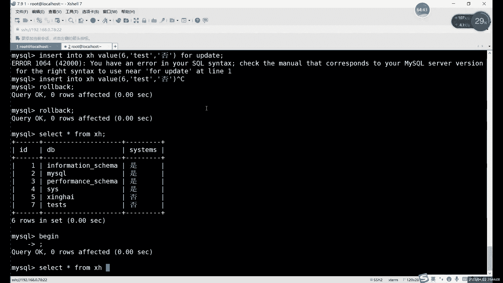

我们加一下这个，因为slide这里的话其实算是有两种啊，正常slide的话他是不会加锁的，就是因为正常slide我们是不会对什么，不会对这个，不对我们数据做任何操作啊，所以说他不会加任何组。

然后的话我们select这里锁是有两种啊，select锁是有两种，一种是共享的，一种是排他锁啊，互相走的话，其实还是允许什么允许多个flag，怎么去行情，还是可以查询的。

然后呢排他锁的话就是什么就是不允许啊，就是不允许查询，我们这里加个GRAUPDATE啊。

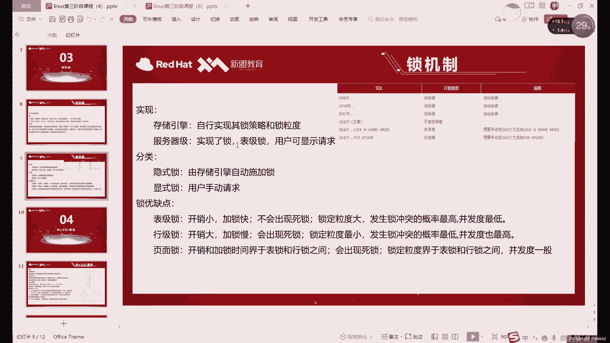

我们家这个排查组，session from啊，加上for update，啊发条组，然后的话我们可以在其他的地方我们再看一下，that肯定还可以查，是可以查的，我们在insert插入一个数据。

我们再看一下，插入一个八，啊这边就没问题了对吧，这个就是什么，这个就是SLG那边那个排查组啊，SLG那边的排查组就是select，你可以就是你执行select的时候呢，你可以允许其他数据插入。

也可以不允许这个是完全自由，那就是你select用的时候呢，就相当于是你可以让他动，也可以让它可以允许他继续插数据，也可以不允许这个我们现在用的这个for update的话，就相当于是排他锁啊。

就是共享排他意思就很简单，就是共享就是允许用允许一起用啊，排查所就是不允许嘛啊PTT相当于独占了，就是你这个事物就独占了我们这个数据，这个表格了啊，独家是个表格，啊这个就是什么。

这就是我们这个凯撒索和这个共享所，啊这边终于有反应了，刚才刚才有系统有个提示音对吧啊，可以看到这个就是所以已经超时了啊，所以已经超时了，这这种这就是FDATE，这就是我们的排查锁啊，排查锁啊。

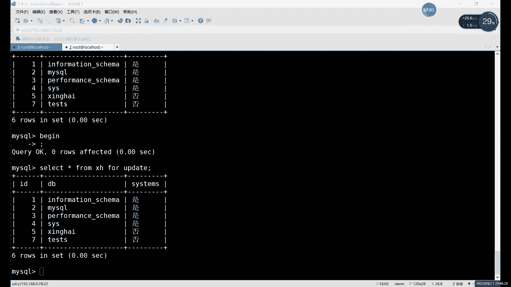

共享走的话就是这个啊，Lock in share mode。

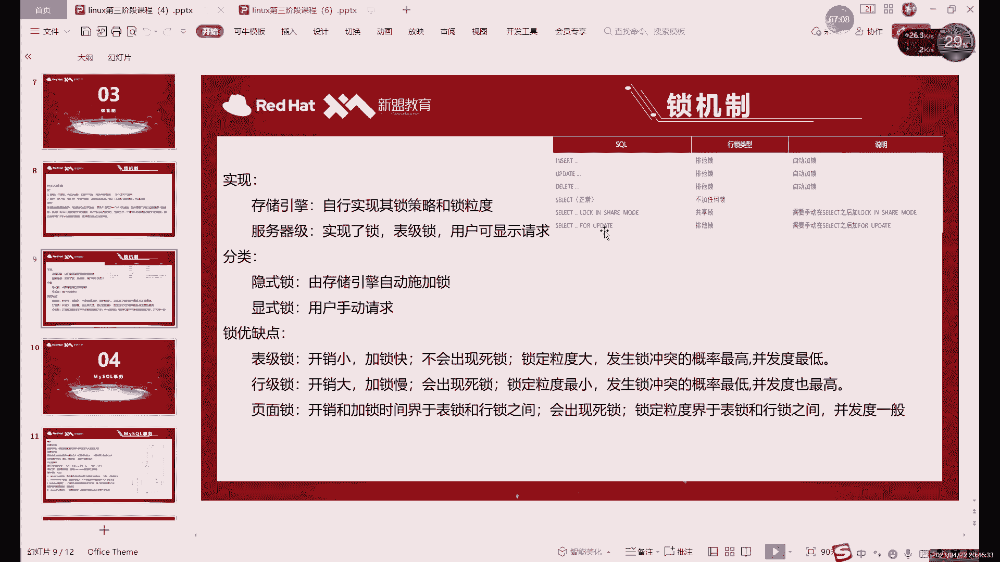

我们刚才第一次用的是这个，共两组，我看一下，第一次用的我们是哪个啊，第一第一次其实我们一直以，第一次我们根本没用，因为它第一次我们用的是insert命令对吧，new ser啊，insert命令。

这里呢我看一下最开始开启事务的时候，啊最开始我们都是拍了一个图，啊，一开始我们就开了一个上面那个什么共享组啊，Lock in share mode，开了一个共享锁，那刚才的话我们开的是什么。

刚才我们开的是这个for update啊，就是Python select命令，它默认啊，默认当是可以允许多个命令一起用的，就是你这边插入我们是可以允许其他的插入的，那你开了这个开了锁之后就不允许啊。

他有时候不允许。

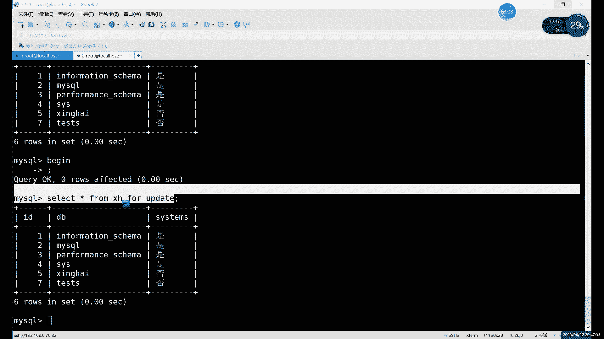

然后呢，其实呢锁的话，这里其实我们并不需要操作太多，也不用操作太多，因为什么呢，因为insert update，delete这个这三个命令的都是自动排它锁，就是你执行的时候，大家一定要开事务啊。

大家注意啊，所机制所机制你想要想要触发，首先第一个你事物的话一定得开，就是你不要用那个不要用这个自动提交，用了自动提交的话，其实锁肯定是不会生效的，因为每次自动提交之后的话，事务一关闭，事务关闭的话。

锁它就不会锁，这边我就不会生效了啊，就只有什么，就是你可以开始正常开事务的时候开的事物，然后呢我们不管是insert也好啊，增删改查其实都可以都可以上锁啊，都可以上去排他锁。

其实排他锁的话其实就是相当于把其他的呢啊，其他的直接就锁上了啊，这就锁上，然后这里的话其实我们这个是手动锁是吧，我们这个是相当于显示锁，是手动锁啊，那是存储引擎，可以可以什么可以自动施加锁。

就比如说呢我们一会在什么时候，一会儿的时候我们会讲什么呢，会讲那个，备份的时候啊，备份的时候，备份的时候其实我们可以上锁啊，当然被分类的时候也是可以上锁，就是锁的话不一定是非要自删改查。

除了这几个以外呢，还有备份备份数据的话，因为我们如果说啊，你要备份一个一个时间点的数据的话，你肯定是不能不不能，允许其他的任务再继续执行了对吧，你暂时是我们可以上上，当于是暂时上了个锁。

暂时上了锁之后的话，相当于保暂时保证数据数据不变嘛对吧，你备份好之后呢，再次进行才能进行这个数据的一些修改，什么的啊，然后呢这里的话剩下就是啊读者写作，其实我们刚才演示的就是这两种啊读者解锁。

共享者独占所啊，读者的话就是共享的啊，就是协作的话也是也是这个哪去了啊，就是这个挂update啊，包括对这种排查所，左这边的一个优缺点的话，就是这里锁的话，其实我们分为好几种啊。

好几种上面的话其实是几种不同的分类方式啊，不同的分类方式，啊这边是分为表级锁，行级锁和页面锁，啊，表弟组行基层和页面锁，嗯然后这里的话其实就是嗯，点击锁开销是最小的啊，加速是最快的啊，加索是最快的。

但是呢它这个容易出现什么，容易出现锁的冲突，容易出现锁的冲突啊，容易出现锁的冲突，然后呢INTEDP其实我们用的这种存储引擎的话，三种其实都是支持的，就是行锁表锁和什么和我的页面。

所其实三种都可以支持啊，都可以支持，默认的话其实是用的是航机组啊，就是我们MYSQL里面，现在默认用的是航机组与运动dB引擎啊，用的是这个行情所，这里的话其实行情走的话。

其实我们就是在就是在同时多个事务，同时访问一张表的时候啊，访问一张表的不同行的时候呢，是可以同时进行什么，可以说请同时进行这个独自操作啊，写操作的话就需要什么呢，就需要加这个排查锁啊，就需要加上锁了啊。

当然也是支持这个表锁和叶锁的，那一般情况下，我们应当DP用的是这个第二种行级锁啊，就一般情况下默认用的就是这种，啊我这里的话其实就是什么，其实就是一个保护机制吧，就是和事物一起的一个保护机制啊。

一定要注意是要开事物，要开事物，不然的话你的锁基本上就大部分所知都都，其实是不会生效的啊，不开事物的话，大部分锁其实不会生效的，因为正常情况下呢，我们至今一个任务呢没有没有失误的情况下呢。

就全部都自动提交了，全部都是自动提交的话，其实这个就是不会涉及到冲突问题了对吧，因为这种需求肯定会有先有后啊，有先有后，就不像事物，一旦你同时开启事务对吧，你肯定是有多个终端，如果有同时开事物的话。

那肯定是要同时修改是吧，就相当于是同时修改啊，这个就是只有在开了15的时候才会出现锁，就是我们的锁着呢，相当于是锁才能更方便使用嘛，啊就是没有没有事故的时候，就是其实这个事物有没有事故呢。

其实就是全部靠的是什么，全部靠的就是那个自动提交，自动提交，一旦开了的话，其实就跟事故关了没有什么区别啊，跟事故关闭没有什么区别，因为我们就无法手动去提交，无法手动回滚啊，其实也就没有没有事故的话。

其实我们也没办法去手动去添加组了啊，这个就是我们这边事物的问题，也就是我们的第四种SQL语句啊，第四种SQL语句，啊四个SQL语句的话，从最开始的我们的创建表格，创建库啊，到我们的插入数据，修改数据。

增删改查到我们后边的授权啊，以及这个事物，就是四种不同类型的这个SQL语句啊，啊当然这个提交的话，如果说你平时做其他实验先练习，就是你不做事物的练习的时候，自动提交，还是就开的吧啊自动销售开始。

不然的话就是确实你只是一条命令提交一次呢，确实是稍微有点麻烦啊，就是稍微有点麻烦啊，这该说不说，确实嗯，如果说你不是涉及到一些大，大量数据的修改的话，其实是可以不开，事故的话是可以不开的啊。

你可以先暂时先把那个自动机器给关掉啊，不是先开着啊，可以先开始用的时候再关。

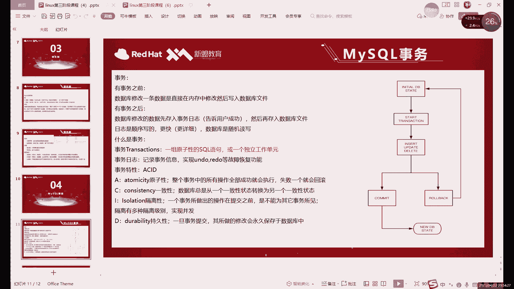

就是用的时候想用这个快照的时候，你再关啊，一般我们就就得先先暂时就开了啊，这开不开都行，后面其实我们也用不怎么改数据，后面也不怎么改数据，后边的话我们下一个主要内容的话。

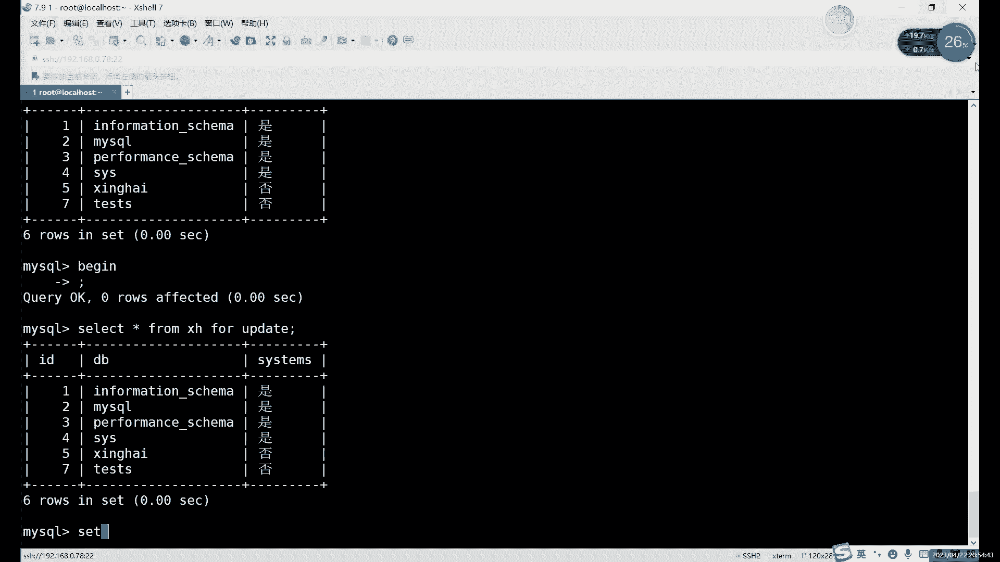

就是就是这个关于我们的备份了啊，关于我们备份备份，这里的话备份的重要性，这个不用我多强调吧对吧，大家应该删库跑路，为什么能为什么要跑路呢，就是因为没有备份，但凡有备份啊，他肯定就肯定就进不去了。

有备份肯定进不去啊，有备份肯定进不去，所以说我们这里的话是什么，一般就是，这个数据备份呢，数据库嘛对吧，你其实你系统都得做这份，更不用说这个数据库了，唉像我们而且像我们一些像什么，像这个配置文件。

但系统里面的一些配置文件的话，其实也是需要什么，也需要做备份的啊，也是需要做备份的啊，就比如说呢嗯，你看像一些服务，很多服务的话，其实你在修改这个配置文件的时候，就可以提前做一个备份。

这样的话你在修改错之后呢对吧，修改错之后呢可以随时恢复嘛啊可以随时恢复，这个其实备份的思想呢其实在哪其实都很重要，不管你做的是什么实验，做的是什么服务，从事的是具体是哪一哪一方面的行业，从事哪个行业。

其实备份都很重要对吧，备份的重要性，我就这里不再多说了啊，备份了，啊所以说呢这个备份的话，其实，很重要啊很重要，就是前面的那些我们的这些这个叫SQL语句对吧，你不一定都能用到啊。

就是在工作中呢其实不一定都能用到对吧，有可能就不一定是你负责，但是在这个备份的话，其实肯定用的是最多的，不管说你干的是哪个岗位，备份肯定都少不了啊，标本其实都少不了，啊然后呢，像刚才这个。

刚才不是说备份配置文件嘛对吧，像我们MYSQL配置文件其实也可以备份一下啊，可以备份一下，因为什么，因为因为像我们刚才那个什么呢，刚才我们修改那个，修改那个叫，自动提交的时候对吧，修改自动提交的时候。

那个设置呢其实什么就是当前回合有用啊，当前会话管用，如果说退出之后的话啊，退出之后就没了啊，关闭之后的话就没了，你必须要什么，必须你如果要想永久永久关的话，也是配置文件。

配置文件写一个a u t o commit等于零就行了啊，AUTOCB等于零就可以了，就写在MYSQL里边啊，讲相机的重启，那个就是永久生效了啊，就写到配置文件里，永久生效。

如果只是如果是在像我刚才那set，就是ATOCB的话，就是临时的啊，那个是临时的，啊死锁的话指的是什么，死锁指的是两个进程对吧，同时执行的时候啊，同时执行的时候呢，就比如说嗯，比如说一个事物比正常的话。

其实我们就开两个事物嘛，啊一般开两个事物，嗯如果说多个进多个进程同时访问啊，肯定开了好几个事故情况下呢，如果是可能会出现什么，可能会出现这个，一个事物可能会等待另一个事物占用的资源啊，因为什么。

因为本来是我们，当然这只是针对于修改一个同一个表格嘛对吧，修改在修改同一个表格的时候呢，可能就会涉及到什么，涉及到你可能修改到同一个东西啊，同一行对吧，同一行同一个内容的时候呢，啊如果说振动资源的话。

他们就会什么呢，就会出现相互等待的形象啊，相互相互等待啊，相互等待，就是比如说我们都要用一个资源的话，他就会你等我，我等你，然后就一直等下去了啊，你说我等你一直等下去了，一直等下去的话。

他们就随时都不执行，相当于是其实但凡有一个执行的，他们也其实也不会形成死锁啊，相当于两个进程之间的互相等待，互相等的话就形成死锁，啊然后的话这里的话我们可以看一下，这个就是在数据库里面这个备份的话。

我们继续继续说这个备份吧，啊数据库里面备份的话，其实，方法很多啊，方法是真的很多，首先的话我们先来了解一下，了解一下我们的备份策略啊，了解备份策略部分策略的话，其实就是我们备份数据的一种方式吧。

这里的数据不仅仅指的是MYSQL里面数据啊，其实其他的服务啊，系统啊这些其实都算啊，都算数据都是需要备份的啊，这些在我们系统里面其实都是需要备份的，然后首先的话我们来看一下这个，完全备份以及全量备份。

这里对吧，然后以及增量备份差异，备份是三个它们的区别，这三个它备份它是它是通过什么分类的呢，其实是通过备份数据的一个啊，备份的数据量上啊，他们肯定是不一样的，就比如说呢首先第一种全量备份啊。

或者说完全备份的，它就是备份我们指定目录下的所有数据，如果说放到数据库里面啊，他可以什么完全备份，可以备份整个数据库啊，也可以，当然也可以是备份整个库，或者说是一个表，它其实都算什么，都算是全量备份。

完全备份，只要是你备份的是这个目标下的所有数据啊，那么你就算是完全备份，而且是每一次备份的时候都备份所有数据，就比如说我们可以看一下这个下面这一个，就比如说我们目前啊你星期日的时候呢，就三个数据。

然后后面每一天都会新增一部分数据啊，每天都会加点数据，那每天加数据的时候呢，我们如果是你是全量备份，就是全程使用全量备份的话，我们背叛了数据之后有什么效果啊，就是一天我备份三个对吧，第二天就备份了四个。

第三天备份了五个，就是你备份的数据呢是数据量是很大的，就是每一天备份的数据量都非常大啊，这样的话当然好处是什么呢，好处当然数据很完整呀，每天的话都是有最完整最完整的数据啊。

每天都备份前一天的最完整的数据，这是它的好处，那它的坏处是什么呢，坏处是你随着时间的增长，你可能每天备份的时间会越来越长，有数据量越多，你备份的时间越长，越花时间，而且你积攒的数据也越来越多啊。

积攒的数据也越来越多，越来越多啊，备份的效率也慢对吧，这个就是什么，这就是强量备份的一个问题啊，这是全量备份的一个问题，所以说一般情况下呢啊也不是说不用吧，也是全量备份的，大家可以看到这个备份的量啊。

每天都会增长啊，越来越多，那肯定不太合适吧对吧，对于大量的，尤其像数据库的备份的话，这种如果一直用全力备份肯定是不合适的，好，接下来我们再来看，我们再来看一个增量备份，增量备份是什么呢。

它是基于上一次备份基础上呢，再去备份新的数据，唉真正的意思其实我们可以看图，我们上一次备份了123对吧，第一天被分成123，第二天呢我们只新增了四，就只备份四，第三天只备份五，然后指标为6789。

大家看到这个它备份的数据是最少的，它也是最快的啊，最主要也是最快的，这种的话其实是尤其是在我们数据库里面，用的是最多的啊，就是增量备份，然后第三种差异备份的话，这个是它是什么，它其实要比全量备份少一些。

但是呢它有比增量备份要多一些，什么意思，就是它是针对于上一次完全备份基础上的啊，做新的备份，就比如说你第一天是123，然后后边的话你可以发现后边他也是慢慢增长，所以说呢这种的话其实在这份上呢。

也不是那么合适啊，也不是那么合适，总体上来说呢，这三种里边其实最好的是最好的，其实是增量对比，就只基于上一次备份基础，上一期备份新增数据，这样的话呢速度最快对吧，效率也高啊，恢复数据有问题吗。

恢复数据期也没问题啊，数据我们都有，你看数据的话，其实就是每天数据加起来对吧，其实就和哪个相同呢，和我每天全力备份其实是一样的，数据没有问题啊，他就是他其实唯一的问题，就是它唯一缺点就是每每天的数据。

我们是分开的嘛对吧，分开分开的不是一起的，你恢复的时候呢是一个需要一个一个文件，选择一个文件，一个文件就恢复的啊，这是他一个问题，但是呢当然呢我们出问题，不可能说你天天出问题对吧。

你有可能就偶尔和一两个月出一次问题对吧啊，一两个月出的问题，一两个月也只恢复一次，大部分的情况下呢，我们备份主要的工作还是用在哪个部分呢，就是在备份的部分啊，所以说呢这个增量备份呢。

还是相对那两种来说是更最合适的，唉就是在第一天的话大家都一样啊，第一天的话，你第一次备份的肯定要全部东西都要有啊，所以说第一天备份的是看不出来什么，就从从后边的时候能看出来。

我们这个三个备份之间的一个区别啊，就在这种备份方式的话，啊这三种被动方式的话，就是我们的什么呢，就是我们这个，常用的这几种备份的这个策略吧，啊可以说是备份的策略，然后备份策略，这里的话。

当然我们首先呢啊我们一会儿演示的时候呢，待会我们先说什么，我们先说全量备份啊，一会儿说的先说全量备份，嗯然后我们接下来看我们接下来看一下这个，这是一种分分类的方式。

就是我们备份策略是有很多种分类方式的啊，这是一种，然后呢我们接下来看后边的几种分类方式哈，作为这么三种啊，就是在备份的时候，首先上面这个热温冷对吧，这三个是什么意思，就是热备份，冷备份是闷备份。

它其实就是备份时候我们数据库的一个状态啊，这可是数据库的一个状态，要在数据库运行的时候呢，我们是否可以进行读写，啊如果说不不进行读写的话，那就是什么，那就是冷备份啊，不能对数据库进行读写操作。

那就是冷备份，热备份呢就是什么，那就是开着数据库啊，直接执行备份命令，我们数据库呢不影响正常的读写啊，可以正常读写，分配分的话就是什么，就只能直接读，不能扔洗啊，也不用这么三种，然后物理备份，逻辑备份。

这里的话就是什么呢，这个其实，这套就是我们听或者主主要说的啊，主要要说的物理备份的话，是直接对数据库的文件进行备份对吧。

我们数据库文件是有哪些呢，就是我们之前看到的那些像哎终端还得再开。

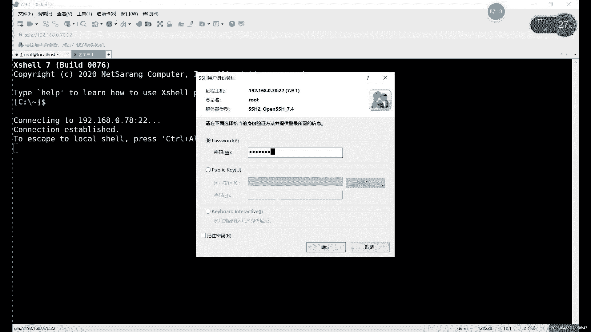

我们进入到这个CD，切换到user在logo下的MYSQL里面的这个hater目录，对吧，其实就是这些啊，这些文件啊包括什么呢，包括数据文件，包括结构啊，就是数据库的结构的文件啊。

或者说表的不用说数据库结构，就是表的结构的文件，表格结构和表的数据，那这些的话就你直接复制这些算不算备份呢，它也算备份啊，它就是算备份，那就直接复制，他们其实就已经算备份了，算哪种备份呢，算物理备份。

就直接是物理上的备份文件啊，物理上的这份文件，这是一种方法，还有一种方法是什么呢，叫逻辑备份，逻辑备份一种方式的话，总体上来说呢。

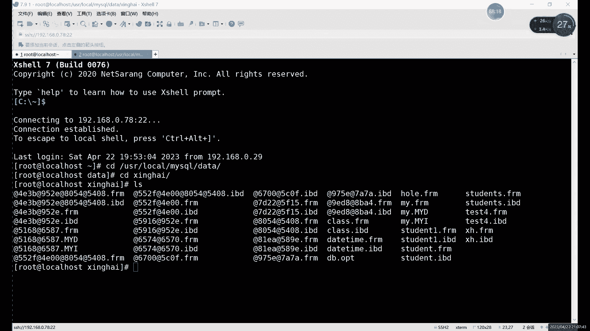

它是什么，它是对于我们数据库的SQL语句进行备份，哎也就是他不是不是说记那么多结构啊，记那么多数据，它其实就是什么，就是将我们整个表格，将一个表格呢唉浓缩成两句话，好像物理备份，我们直接背下文件对吧。

我们就拷贝文件，文件里面具体是什么无所谓啊，就全部复制就行了，啊所以说呢这里这个逻辑部分它指的是什么，就是将我们这些文件里的内容浓缩成两句话，哪两句话呢。

create和insert great就是创建创建我们的目录对吧，也就是我的表格结构，insert就是数据对吧，插入数据，因为所有数据的话，其实只需要一条insert语句，其实就可以了。

你不管你用多么大的表格，一条insert语句肯定是够的，所以说呢这个逻辑备份的话，其实就是将我们两个文，将文件浓缩成两句话，就一个表格，就是两句话，一个create insert。

啊这种方式的话就是什么，就是逻辑备份，但逻辑备份它需要一个转化的过程啊，当然转换这个也很快啊，转换也很快，因为本来物理备份里面他已经不过，不管是表格也好啊，数据也好，其实都有啊。

他就是把物理备份里面那些文件啊，文件内容转化成两句话而已啊，这就是逻辑备份啊，逻辑备份，那在被动方式上的话，首先呢，冷备份的话不能对数据库进行读写操作啊，就是什么呢，就是关闭数据库。

这种的话嗯就是冷备份的话，就是缺点是什么呢，就是我们会演示的时候，首先冷备份肯定是有缺点的，就是数据库不能运行吗，那优点是什么，优点是它速度肯定会稍微快一点，因为数据库普运行。

我们直接全部复制文件也好啊，就全部进行这个对面也好啊，速度肯定会稍微快一点啊，如果说什么呢，如果说是热备份或者温的配置两种的话啊，数据库再运行对吧，数据库再运行，不管说有没有洗。

他至少有为什么他至少有毒的操作对吧，有毒的操作有可能有洗的操作，那这个时候会影响到什么，影响到我们数据库的这个也影响我们复制啊，或者说是转化这个转化成SQL语句的这种效率，对吧，所以说设备分类分的话。

热备分类分速度会稍微更慢一些，但是呢至少数据库它是可以同时运行的，就一起工作啊，相当于是同时备份一个同事工作啊，这个就是我们这个这两种备份的一个优缺点吧，物理的分和逻辑备份。

这里的话其实也没有什么优缺点去说啊，都是没问题的，这两种方式都可以啊，都可以，然后上面这三种的话其实也是也是这个，也是三也是三种方式，它只不过是其实这三种分类方式的话，就是三个不同的领域嘛。

这种的话就是你复制的时候呢，数据控制的状态是怎么样，这种的话就是真正的，你复制这个数据的一种方式，那这个的话就是什么，就是复制数据的数量唉，复制数据的量，啊总之的话其实总体上来说呢。

我们对于MYSQL来说，我们更常用的是怎么怎么去复制呢，就是用首先第一次先用完全备份，然后呢后边呢用什么，后面用增量备份，然后备份过程的话，其实，嗯备份过程上的话，其实就是，物理备份，逻辑备份。

其实这两种都可以用啊，物理备份的话其实就是它的备份速度呢，怎么说呢，备份速度会快一些，因为什么，因为它不需要任何思考，就直接拷贝文件就行了啊，直接拷贝文件就可以了，然后逻辑备份，这里呢逻辑备份这里的话。

其实就它导入的就是我们两种语句啊，因为他需要这个转换语句嘛，然后语句速度肯定要比这个逻辑微分要慢一些，但是呢它的文件呢啊，它的文件会非常小啊，它的文件会非常小，整体上来说呢。

嗯物理部分逻辑分其实都可以啊，如果逻辑分这里的话，其实也，逻辑规范这里的话其实更在迁移数据库的时候，其实更方便一些，迁移数据库的时候，我们一般也会用这个逻辑本能更好一些，因为文件来说也比较小。

而且呢它里面就是全部都是一些啊SQL语句，执行起来也比较方便，而且很方便，还有就是这个逻辑分呢，其实是可以什么可以选择性的恢复的啊，恢复数据可以选择性恢复，但物理备份的话他就不行。

因为物理分它就是就整个一个整文件啊，而逻辑备份的话，这边是我们可以选择某一部分进行恢复的啊，这个就是我们的几种备份方式，首先的话我们先来看个什么呢，我们先来演示，我们先暂时用全量备份啊。

我们先用全量备份，先用全量备份来演示下面这几种啊，下面这几种，冷备份的话，我们就其实你每次备份的时候，其实都包括了这三个里边的一个对吧，就比如说我用全量备份，那你冷备热备里面选一个吧对吧。

物理逻辑里面就选一个嗯，我就这么选吧，我就先用什么呢，先用这个产量备份，然后呢冷备份加上物理备份的啊，能不能加上物理备份。

冷备份加上物理部分，我们首先怎么做呢，啊首先先关闭数据库，啊冷备份的话，我们就直接有就是白味的，啊我们先关闭数据库，关掉之后呢，我们可以用什么，就用物理论证的方法，物理作用的话，它其实有很多命啊。

大家可以大家可以说一下，大家可以说一下，这个物理备份能用到哪些命令啊，因为物理备份的话，我们是直接备份什么，直接备份文件啊，那备份文件能用到哪些命令，大家都可以啊，可以随意自由说一下，因为这个的话其实。

啊让MYSQL看到数据的话，那就用远远程的软件呀，啊用远程用远程软件啊，你不用远程软件肯定是看不到的啊，肯定是看不到的，脚本他其实都不他其实脚本根本就不算方式，脚本它里面放的不也是命运对吧。

其实呢脚本这个东西呢，其实你根本不用不用考虑它，为什么呢，你只要把这些，我们这些刚一会儿我们要说的命令呢，你把直接翻到脚本里，那就是那就是脚本，那就是脚本备份了啊，脚本其实根本就不重要。

脚本里面他最多也就是啊设置一些这个啊，能自由设置一些这个什么复备份的，文件的一些名字啊，日期啊，时间呀，然后备份的这个频率啊，这些东西嘛对吧，其他的备份命令的话跟脚本没有关系。

脚本他只是把我命令翻译翻到这个，转到文件里面而已啊，物理备份上的话，就是直接几种面鞋都行啊，主要就是有这么几个CP对吧，其实就三个命令，主要就是三个命令，MMV肯定不能用了，MV那就不算备份了。

MV呢只有捡走了啊，所以说呢就是复制打包两层复制打包的话，其实他其实也算个复制嘛，就是复制之后呢可以复制之后打包，也可以直接打包，这个其实都行啊，都可以物理备份的话就是直接复制文件啊。

复制文件直接复制文件不能直接识别的话，那可能是你，哪复制有问题啊，或者打包啊，那肯定是文件文件有损坏啊，直接复制文件是可以的啊，因为什么，因为数据库里面他那些数据呢，它就是文件啊。

它就是一些普通的文件而已，它也并不是说数据库里面，他就是就是那些表格的表格，只是我们展现的一种形式，这个表格它只是我们看的一些形式，它实际上就是文件加上的文件，两个文件一个文件呢是这个框啊。

框架一个文件是里面的东西啊，这是俩文件而已嘛，比如说存储服务器上啊，你备份好之后呢，可以拷贝到存储服务器上，如果没有的话，没没有的话，可以没有，就可以直接拷贝到硬盘里面对吧，也可以直接拷到硬盘里面对吧。

啊移动硬盘吗，然后呢CPTR这类的话无非一个是拷贝，一个是打包，拷贝之前的话，我们先创建一个备份的目录吧，啊创建一个备份的目录，创建好编目录之后的话，我们直接可以CP杠RP对吧。

如果说我们要拷贝整个数据库，怎么拷贝呢，user deo下的MYSQL下面的data目录里的，看一下啊，一个两个我们就直接拷贝，啊对你如果说怕怕弄错了啊，怕出事，你可以怎么办呢，你可以只布置一个表格啊。

复制表格就复制，只复制一个表格，只要你复制的是它全部内容，备份的是他全部的，这个就算什么，就算全量备份，全量备份，它指的不是复制整个数据库的意思，它指的是复制某一个对象的全部内容，这个要全量备份对吧。

你可以复制某一个数据表对吧，可以复制一个表啊，当然了，我们这里就看MYSQL下面data下面的一个数据库吧，啊就一个数据库里面所有内容，我们把这一个数据库里面所有内容复制出来啊，复制到哪。

复制到bag up的目录下，当然也可以什么也可以，直接这样，把整个目录复制出来也行，或者复制目录下所有内容，这样的话其实都行啊，都可以，定时备份需不需要关数据库，那你得看你用哪种标的方式对吧。

你用的是冷备份，那肯定是关的，那用热备份那就不用关啊，这个定时备份的话，你具体看哪种方式啊，具体看哪种方式，关不关的，他不是说用不用脚本对吧啊，这个这个用的是什么，这个看的是你用的哪种方式而已啊。

冷备份的话速度肯定是快的啊，但是呢他肯定要把数据库关了，这可能这是他的缺点，优点是速度快对吧，你每一种方式其实都是有它存在的意义啊，也是有都有它的优缺点，这里的话我们把它备份出来之后呢。

我们可以看一下backup目录下，如果按这种方法备份的话，它其实我们备份出来的是整个目录，就是把心海这个目录给折算出来了啊，或者你如果这里加信号的话，就是备份里面的所有文件啊，那种话其实都行啊，都行。

备份好之后呢，如果说哎觉得这个包太大了，你可以用T2打包一下啊，我们这里就我们这里就不用了啊，T2打包的话其实也一样，打包之后呢，你可以sap sap远程的拷贝啊，或者说你直接本地的船也行啊。

传到其他的移动硬盘上，或者传到其他的这个磁盘分区上啊，可以传到其他磁盘上，对吧，如果说你电脑磁盘坏了对吧，如果说有一块磁盘坏了吧啊不是电脑，就是服务器里面磁砖坏了，有一块坏了的话。

你说你的数据值不在一块磁盘上，其实都还有救，是你只要复制到其他的这个目录里面啊，其实还是可以的，唉然后呢这里的话我们可以看一下，首先的话我们直接模拟一个故障嘛，那我们接给他删了啊，直接给他删了。

备份恢复的话，这里就是备份回来，怎么你怎么备份呢，你怎么恢复啊，每种方法都要注意啊，大家注意就是你怎么弄弄出去的，就怎么弄回来啊，因为这个怎么因为每次每一种方法它的文件啊，他可能目录啊都不一样对吧。

比如说你是物理备份的话，物理备份那就物理恢复啊，逻辑备份就逻辑回复啊，这句话首先我们直接RM杠2f user加logo下的，data目录下的，好MYSQL里面的data目录下的这个目录。

我们整个一个直接删对吧，这就是商户啊，又没有跑路的，没事，其实我们不用，因为因为我没有备份啊，有备份的情况下还是比较安全，这里是让我们开启数据库之后呢，我们可以看一下，进到数据库里面啊。

你接受DTABSES啊，我们这就少一个库啊，我们这就少了一个库，那怎么办呢，那就恢复呗，恢复的时候最好是什么呢，就是你怎么备份呢，怎么恢复什么意思，就是你用的热备份，那你就开着回复，你用的是冷备份呢。

最好还是关了再回复，逻辑备份呢就是逻辑恢复方法，物理备份的话就带CP回去就行啊，就是你怎么备份了之后怎么恢复，这样的话就保证哎，最大程度上保证我们数据的一个安全啊，这话就是把BAUP里面的什么呢。

把BA目录呢拷贝到哪呢，在拷贝到user下logo下的MYSQL里的deda data目录下，就可以啊，就这么拷贝，拷贝完之后呢，我们直接开启数据库，开启之后呢，我们直接进入。

然后受BATABSBS是吧，他就回来了，啊由于这个东西怎么说呢，物理备份的话，它其实就是一个备份文件的过程，或者说是备份目录，如果说你是备份一个表格的话，那就是备份两个文件啊。

两个文件注意备份表格是两个文件，然后备份一个库的话，就是一个目录啊，就是你那个库的某一个目录，如果说你想要备份整个数据库的话，那你就直接备份什么的，备份这个，想问问一个数据的话。

那就是MYSQL下面的data，如果说包括数据啊，配置这些全要有的话，那就是MYSQL这整个目录也可以备份啊，也可以，数据库的是什么，就是如果你做的是数据库的迁移的话。

其实嗯如果不是一个数据库做数据库迁移，其实最好还是用什么，最好用逻辑类的啊，这个物理备份的方式的话，其实总体上来说呢还是就没有逻辑配合，那么好吧啊，我更推荐还是用逻辑备份，你逻辑备份的话，首先呢文件小。

文件小，它这个文件会稍微相对来说小一些，运动起来也方便啊，如果说你是，如果是不同的数据库之间的话，可能会涉及到，如果说如果说有数据库名字相同的话，这个肯定就不能就没办法恢复啊，也没办法。

这个如果要迁移数据库的话，不同的数据库之间呢如果一旦有一样名字的，那肯定会出问题啊，肯定会出问题，所以说呢啊一般情况下的话，还是如果只是本就是我们做备份的话，其实楼物理流算是可以的，那是可以的。

你就复制出来之后呢，啊保存就是保存到你其他的主机也好啊，其他的存储服务器也好啊，保存到印度硬盘里面也好，这都可以啊，恢复的时候直接整个一整个一起恢复就行了，如果RM高RF刚目录下新号的话。

如果你提前做了备份啊，其实还有也也还有就啊，其实也还有救，如果备份整个目录的话，其实确实这个东西会很多东西数据会很多啊，一般也很少备份整个目录，所以说呢这种还是比较危险的是吧，你就既既然知道要跑路。

你为什么还要执行它呢，对吧啊，啊这个的话就是什么，这个我们刚才演示的就是我们这个物理备份，加上我加上这个冷备份，冷备份，然后呢另一种就tr tr的话，你得打包的时候呢，打包解包的时候需要注意啊。

打包解包是需要注意的，这个它和CP命令它又不太一样，你看CP的话，你复制文件，它就是俩文件对吧，你这样复制来复制去没问题，打包目录的话，一个目录来回到这边，到那边拷贝过来，拷贝过去其实也没问题。

但是tr不一样，tr的话，我们如果说你是打败打包整个目录的话，打包好之后，你的解包呢，如果说你不知道最后解放出来，解包出来个什么玩意儿啊，你首先先不要解放到数据库的目录里，你可以先解放到其他目录里面啊。

看一下目录少没少，文件少没少，你再复制进去啊，这个TL需要注意一下的，DL需要注意一下，然后这里的话这个tr的话我们就强化tr，我们不演示了啊，不演示了，这个其实这个这个是第一阶段，第一阶段的命令啊。

然后这就不演示了，还有就是需要注意一个SAP对吧，sap的话，SB你如果说网络不够快的话，你就可以尽量就不要用这个命令了，因为这个它用的是，他直接就相当于直接在网线上跑，从网线上传输数据啊。

所以说呢如果说网速不快的话，最好用什么，还是用移动硬盘比较好啊，因为移动硬盘的传输速度还是很快的，一其实连移动硬盘，一般比这个网络传输速度要快很多，而且移动硬盘比较稳定啊，不容易出现中断。

CP的话这个限制条件还是有点多的对吧，你网络的稳定网速度过快，不然的话也数量很大的情况下，这个SB其实特别慢，特别慢，啊这个的话就是我们的物理备份和冷备份，然后呢，当然了。

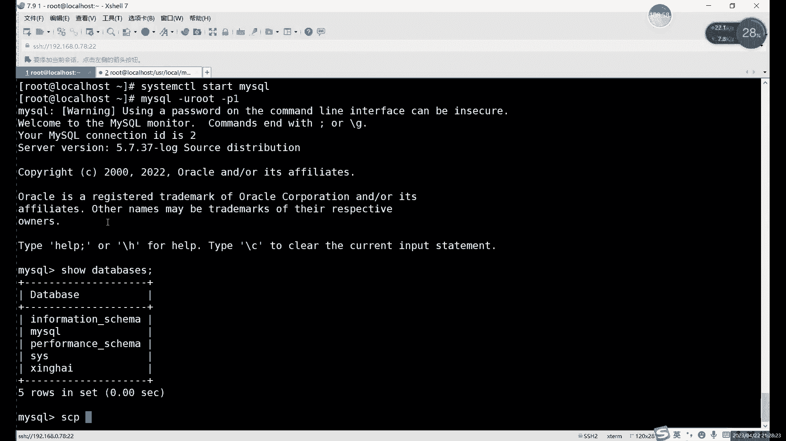

也有一个全要备份啊，完全备份，好下一个我们来看什么呢。

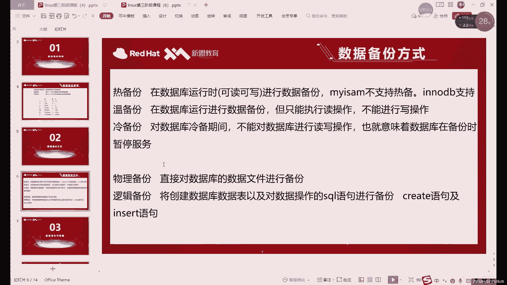

下面来看这个嗯，下一个来看逻辑，肯定要看逻辑备份了对吧，逻辑备份逻辑部分的话，这边我们就直接用热备份了，我就不关数据库啊，关数据库情况下一起用逻辑备份，这里需要注意什么呢。

它其实备份出来它的效果是什么样子的，其实我们之前已经看过类似的，看过类似的，你看像这种的话，它是什么，它是物理备份啊，这种话都是物理被动直接拷贝文件嘛，你像逻辑分，它其实备份的类似于什么，类似于这个啊。

给大家先看一下它它是不是备份出来。

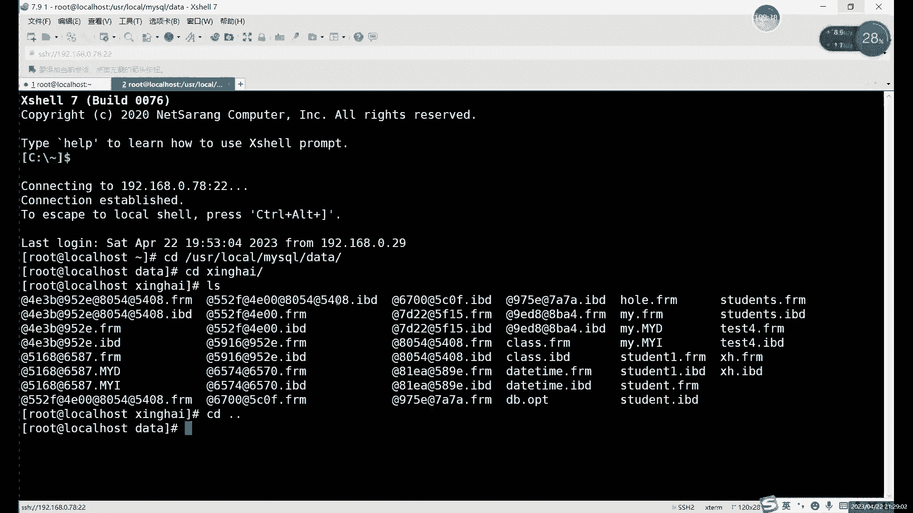

什么玩意儿啊，它就类似于这种东西，对吧，你物理的话就拷贝文件里面是什么无所谓，你先拿着走就行了，如果是逻辑变量的话，我们其实需要什么呢，需要用到这种像这个，类似于这种二进制日志文件里面的内。

当然我们不会包括delete update，你相当于什么意思，就是你看我们这个二进制里边，一般是哪些命令呢。

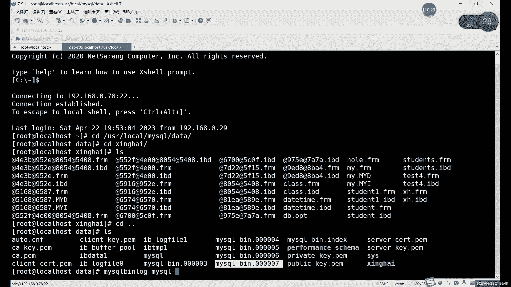

比如我直接搜索commit吧，唉不对，这是cat reless，不能这么，啊我们这是刚生产的燃，没有多少信息啊，看我这里有个啥就啥也没有，我们就是重启来修复，从一旦重启数据库啊，它就会重新生成一个文件。

重新设表示这里没有信息，没有信息。

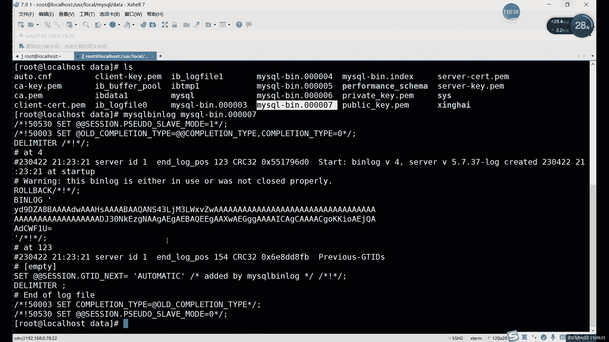

那就看我们能看这个零六吧，没有是我们通讯数据库之前的，你就比如说零六处理的没那么少，啊我重启了两回是吧，那就看零五，你看我们其实在逻辑备份里面，包括的就是哪些呢。

就是insert命令合成的和create create，当然这里我们很长时间没有create过，哪些不会有呢，这些set它肯定没有对吧，像我们设置这个set里肯定也没有，只有什么insert啊。

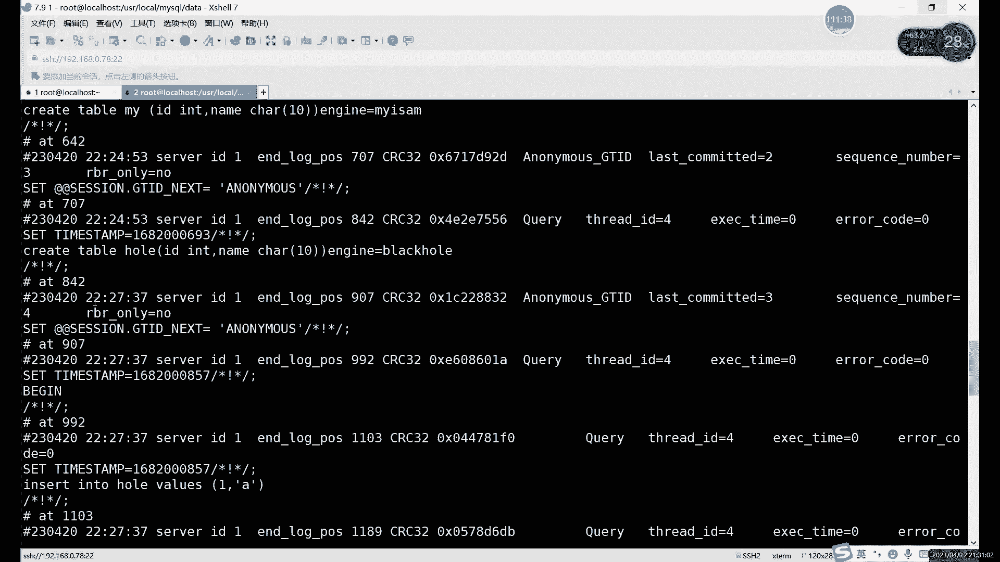

当然这个不是set命令，这个是一个啊，还有哪些啊，这还有grant命令，那GRA命令它其实也没有啊，因为什么，因为关命令的话，他这种结果呢它写入到哪了，他是写入到一个表格里啊。

所以说他关注的一个最终结果，它其实也是什么，也会变成一个insert啊，quit啊，找到了就说quit，我们的这个二进制就是我们的逻辑备份，它里面只会被说什么。

就是create命令加上加insert命令，其他的像这些ground的话，能不能转换成insert，可以对吧，delete update能不能转化成insert，其实也行，那其实就是最终的一个表格。

用两个命令显示啊，就是create和insert，这两个就像其他的命令都其实都没有啊，这些都没有，update author也不会有，为什么呢，因为你看我们备份的时候呢。

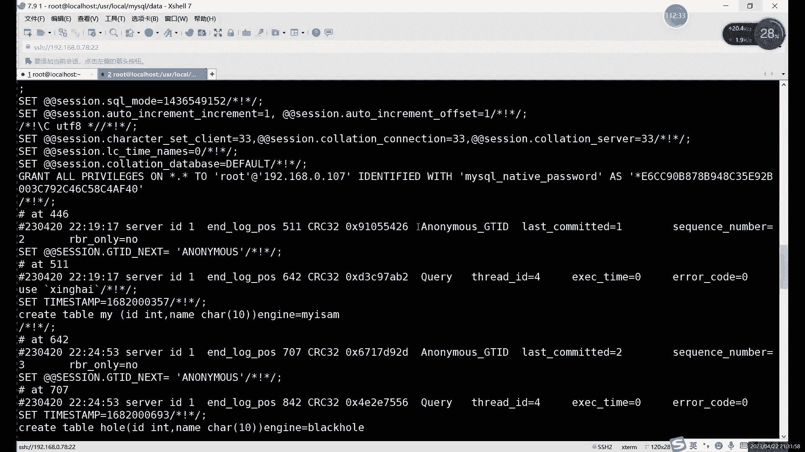

它是一个完整的表格对吧，四四方方的，有些数据。

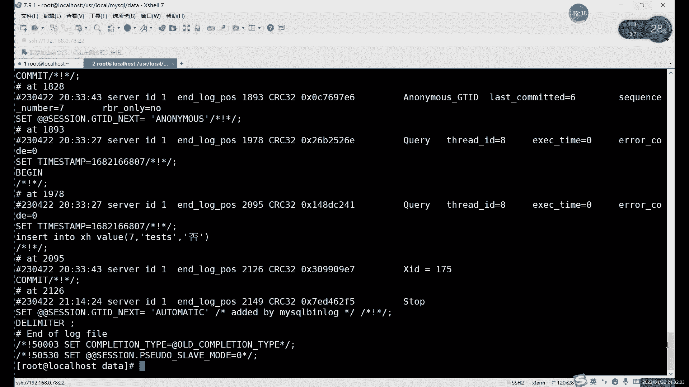

表格呢，兄弟啊，在这啊。

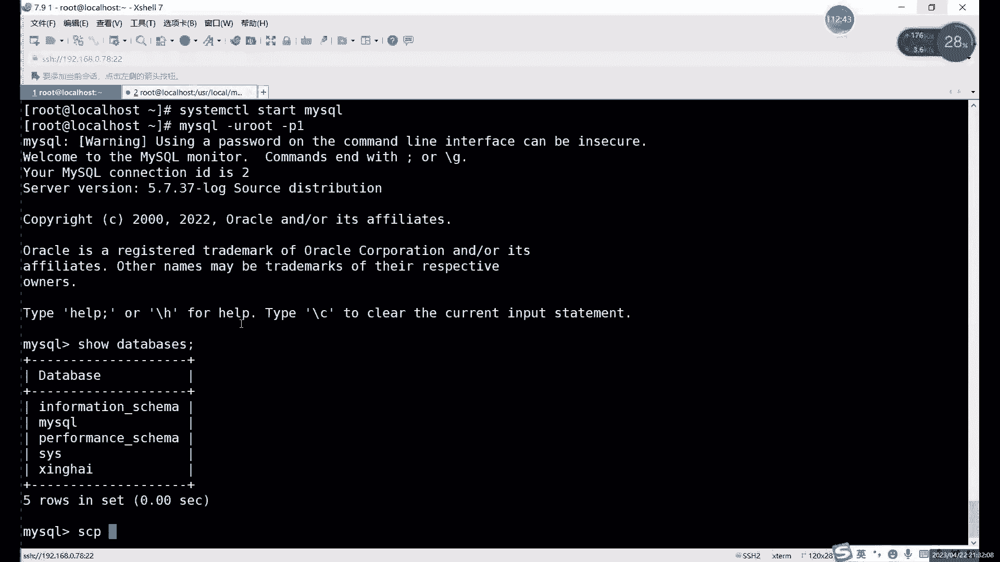

找到了啊，比如说当然这个我们不是个表格啊，为什么不是个表格，假设它是个表格，我们备份它怎么备份呢，就是create把它用于create meeting，Create table database。

然后呢，自动的话就比如说database，然后CHAR完了对吧，数据怎么办呢，Insert into，这是base values啊，value然后括号里面写上information一个。

然后逗号MYSQL一个PERFORMATION，一个SYS一个心海一个，其实我们中间这个是添加进去的对吧，这个是后添加进去的，那需要不要说不用写进去呢，其实不用说不用写一个up主的命令呢。

用不用写个insert命令呢，而不是insert，这个是我们怎么进去的啊，这是我们create进去，这是create创建这个啊，当然了，假设我们这个是后边更新的啊，后边更新的数据啊。

或者或者后边我们也可能删除了一些数据对吧，我们之前也删过，也更新了一些数据，那这些呢其实不需要记录，就全部的，我们以最终结果为准，就我们看这个结果反推什么，反推insert语句就行了，它相当于是这样啊。

就是用insert去就反对出一个insert语句，然后去存在我们的文件里面，这个就叫逻辑备份，它就是看表格推命名，推出一个create和一个insert就行了啊。

这注意一个incret insert就可以啊，那这个就是逻辑备份，我们一会就来演示一下啊，一会儿来演示一下这个逻辑备份怎么用啊。

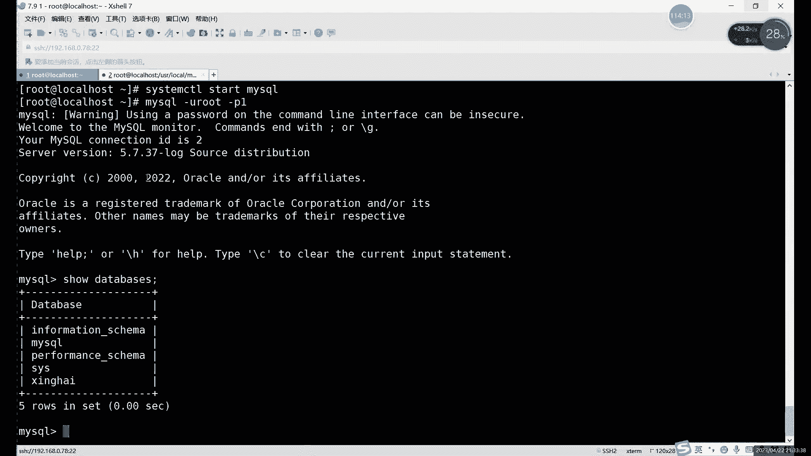

怎么用，这话其实涉及到前面一个。

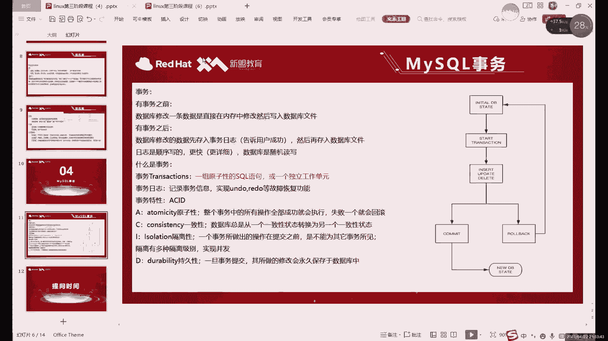

导入导出啊，其实也也也和备份一样啊。

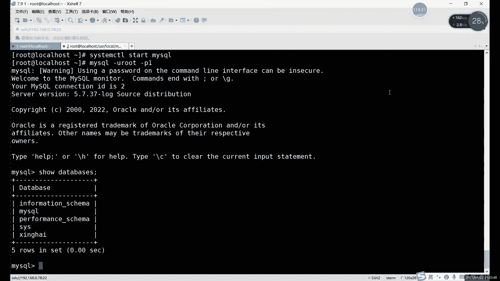