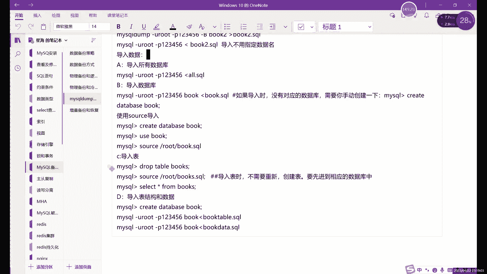
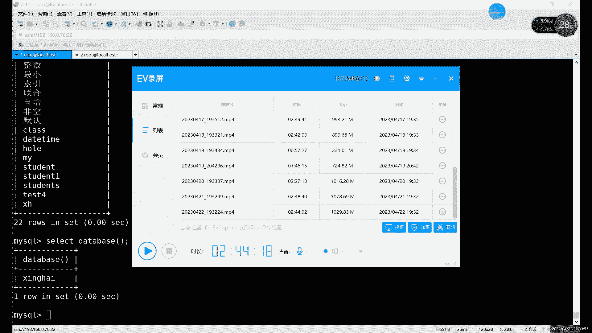

# 0基础小白怎么入门Linux运维？看这套，Linux运维全套培训课程，保姆级教学视频 - P81：中级运维-18.事务，锁，备份-下 - 小方脸不方- - BV138411B7p5

还有这个，好我们继续往下说啊，就是逻辑备份呢，他其实需要的就是我们的mysql down这个命令呃，他呢也是我们数据库MYSQL里面导入导入导出工具，一个比较常用的啊，导入导出工具比较常用的一个啊。

当然主要是导出啊，主要是导出就是我们数据导出的一个命令啊，这个我们之前是跳就是在讲在讲什么呢，是不啊，在讲select查询的时候对吧，查询之前我们把这个跳过了啊，因为这个导出导入呢。

它其实就是类似于什么，类似于这个备份和恢复啊，导入导出其实就类似被分恢复的这么一个过程，那首先呢备份的话就是导出对吧，导出数据的话，我mysql dump其实就是我们的逻辑备份逻辑备份啊，用法的话。

首先第一个找出所有数据库，就是杠大A啊，高大A就是最简单的啊，就备份所有数据库的一个用法啊，所有数据库，那这个所有数据库呢，其实我们在导出的时候呢，比如说我们可以看一下啊，它其实是导出一个整个的文件啊。

一个大文件，比如说我们可以看看。

把这个文件我们先退啊，我们先不用看，退不退，其实不用退出啊，就是，我们这里是个什么，我们这里是个，我们现在用热备份啊，逻辑备份我们就不退出了，不退出了啊，我们直接备份，直接备份的话。

就直接用我们的mysgo down，买这个字后面加什么，加上杠u root，杠T改你的密码啊，加你密码，然后后边呢加上什么，加上杠大A就可以，杠大A指的就是所有数据库啊，它这里代表的就是二这个单词嘛。

R这个单词当然还有一种写法，就是全写全写怎么写的，全写是杠杠二杠database啊，Data basis，这个是全写，所以写全了就这么长对吧，其实没有什么太大必要，就他可以完全用一个一个字母来代替。

就是杠大A它就代表全部，所以说呢就是杠当杠大A就行了，杠杠2database database，这个其实很少很少用，因为没什么必要啊，我们就直接用杠大A杠杠A执行的一个结果，啊我们执行之后呢。

啊我们然后后边加什么呢，后边加上重定向，重定向，把它导入到哪呢，因为什么，因为前面这个呢其实算什么，其实算是登录到数据库当中，然后呢导出数据导出到哪儿，具体我们其实还没有指定，对吧啊，没有指定怎么办呢。

那就是杠后面加上文件名字就行，比如说我就随便写一个吧，这里的话可以写绝对路径，可以写相对路径啊，你相对路径的话，就相当于直接备份到这个路径目录下了，你想指定某个具体目录的话也可以对吧。

你后面前面加上绝对路径就行啊，这个就是什么，这就是我们的，逻辑备份啊，逻辑备份或者是导出其实都可以啊，这两种这种说法其实是一样的，用mysl down命令的导数呢其实就是逻辑备份啊，就是逻辑备份。

好我们接下来看什么呢，接下来看一下这个文件吧对吧，刚才我说了这个文件里面的内容的话，主要包括什么呢，主要包括的就是，啊主要包括的就是我们的create命令和谁呢，和insert命令啊，主要是这两个。

当然还有其他的，其他具体是什么呢，我们直接打开看啊，我们打开看，嗯就比如说我们先来看一下什么呢，先来看一下这个，嗯这个警告是很常见的对吧，因为我们把密码打在命令行里面了，你直接隐藏起来就行了。

隐藏起来如果说就是mysql u root p这样回车的话，就相当于在他就要再输一次密码，那这个时候就肯定不会有这个警告了啊，不会有这个警告，文件啊就在这二点circle，我们可以看它有多大啊。

看看它有多大，S杠H2，直接看一下A杠LA项，800k，对吧，是不是很小，然后比如说我们再把哪个文件看一下呢，嗯那个backup对吧，当时backup这个目录我甚至可以给backup打个包。

我给大家打个包吧，DR杠ZC，Back up，下面的，啊这个目录是吧，点第二点DJ啊，随便打一个哈，随便打个包，这个其实更小一点啊，这个是一个，啊这是一个库里面的，这个是整个数据库，这是整个数据库。

总体来说呢，数据库其实备份起来，我们这里是不是让大家看到很小的数据量，还是很小的，我们其实也就几十个表格而已对吧，几十个表格，啊总体上来说呢，其实，母数量小，所以说看起来不明显啊，看起来不明显。

然后这里的话是两个文件对吧，这这个打包里面那些内容是什么呢，这个里边他是我们的文件，每个表里面有两个文件对吧，这个整体上其实我们整个数据库就是一个文件，把整个数据库放一个文件里面啊。

比如我们可以来看一下这个文件吧，这个文件是可以直接cat看的，我直接换成less吧，换less直接cat看，直接用命令去看的啊，这一节看嗯，然后呢首先第一个他第一个数据库是什么。

第一个数据库就是MYSQL对吧，Mysql，你们就到我们自己创建的数据库里面看一看，啊在这，嗯啊相当于从这开始对吧，从这开始就是我们那个我们自己创建的数据库，我们这里创建数据库的话，我们可以看到啊。

就是首先数据库的名字对吧，然后它里边我们记录的命令只有哪些呢，create database啊，Great database，第一个命令对吧，great命令，第二个呢我们还有一个use。

就切换到这个数据库里边啊，然后接下来的话是什么呢，接下来就是drive命令，然后create和insert me啊，就这三个insert啊，insert在这，为什么这里有个job命令，大家可以猜一下。

为什么我们这里有个job，啊，照命令之后的话是create和insert质量没问题对吧，我们之前已经说过了，create就是创建一下，创建我们的表结构，然后insert是插入我们的数据，你是一个数据吗。

啊这个表格音就一个数据，你看在写数据的时候注意细节哈哈lock先锁，锁完之后呢，再解锁啊，就是相当于是我们在插入数据的时候，就只是啊允许我们就是我们本地啊，就允许我们当前自己的这个事务执行。

其他的就不允许执行啊，大不允许执行照顾命令是为什么呢，就是因为我们导出或者备份的目的是什么呢，啊就是为了还原嘛对吧，所需要的时候要还原，对不对啊，需要的时候还原的时候呢，我们肯定在数据库里面。

不一定说整个数据库都没了，那可能就是某一部分数据库误删除了，或者说是就是丢了几个数据库，或者几个文件的一个数据对吧，大部分的文件都没问题，那你恢复的时候呢，可能如果说不知道具体是哪个数据库出问题了。

那你恢复的时候怎么办呢，啊你可以这样去把整个文件都恢复了，把这个文件都恢复的过程中的话，如果有数据库的话，创建是肯定会报错的，会重复的，所以说呢我们就先删掉再创建，这样的话就就避免避免这个报错了啊。

他肯定不会出现报错啊，这个就是为什么会有这个dB命令啊，会有这个删除命令啊，除了删除以外的话，就只剩什么，只剩create和insert，没别的了对吧，所以说呢这个就是为什么我刚才说。

其实这里面我只存现在只存两个命令，你update呀，delete根本不会出现在这个里面，包括那些alter修改也不会，为什么呢，就是你修改之后的话，我们才把你备份出来的，那就一个亏损就可以解决啊。

1create就可以解决，啊这个job的话就是因为你恢复的时候，如果说他的表格是，如果说表格是存在的，你这样直接创建它肯定会报错啊，他直接就报错了，你上面一旦报错的话，下面我们没办法执行了。

所以说呢我们每一个都要先删掉再创建，再插入数据啊，又是为什么先要删除啊，就是为什么先删除的原因，其他表格也一样，大家可以看每个都是先删除再创建再插入啊，当然这个没有数据啊，这个没有数据。

有几个都很多没有数据啊，像这个啊，唯一性约束这个都一样哈，先删再创建再插入啊，这个就是什么，这就是我们，逻辑备份它备份的文件里面的内容对吧，那也就是他恢复的时候，其实这个恢复的过程。

大家肯定也都能理解了对吧，恢复其实就很简单了，就是删掉创建插入，删掉创建插入，这就是他恢复的一个原理啊，就是先把目录删掉，所以不是先把我们先把文对，应该是先把这个表格删掉，在创建的插入啊，修改的话。

只要你别改坏了，还修改就别改坏了，肯定还是能用的啊，你如果说哪改了有问题，拿格式出问题了，那那肯定就不行，这个文件可不能随便改啊，你别想别想着改文件，这个文件可不能随便改，改了的话，如果只是改数据的话。

那就是改了之后，你重新恢复的数据就跟之前就不一样了啊，如果说把结构改的出现了问题，那可能插入的时候就会报错，一报错了，那就直接就中断了啊，我们这个MYSQL里面如果同时执行几十条命令的话。

中间有一条报错就不会不会继续执行了，大家注意注意这个问题，中间一旦有一条报错，就不会继续执行啊，所以这个不要随便改的，啊这就是我们这个逻辑备份啊，当然这个是之前物理备份那个一个数据库啊。

这个是我们的逻辑备份啊，这是什么，这是一个整个数据库啊，如果说一个文，你想要直销员备份一个数据库怎么办呢，唉就比如我们的数据，其实只是存放在一个数据库里面的对吧，系统默认库里面其实没什么太多的重要数据。

这主要是一些系统设置那些用户权限，密码什么的啊，真正的这个业务啊，数据啊我们一般是放在一个单独数据库里面，这种情况下，我们只要这个单独数据库行不行呢，也可以就是直接加上这个数据库的名称就行了。

就比如说怎么备份呢，就是MYSQL，我刚才我们是，满头杠u root杠T是吧，杠大A啊，如果只想要一个数据库怎么写呢，哎就是，杠哎不说不是杠，直接加上名字啊，直接加上数据库的名字，就是某个数据库的名称。

就导出某个数据库，啊直接导入就行了，啊这里一定记得改名字啊，你不改名字，相当于直接给人给之前那个文件覆盖了啊，我们导出导出之后呢，我们可以再看一下，在哪呢名字去哪，啊在这16K对吧。

嗯然后这里的话我们可以看一下，直接喊直接看啊，在，啊或者less些都行啊，就是用cat cat，用cat的话，那就用鼠标滚轮滑吧，把内容是一样的啊，其实刚才我们看的不也是这个这个数据库嘛。

啊内容没问题对吧，每人内容没问题啊，这就是什么，这就是导出一个数据库，还有这是什么用法呢，啊这是一个数据库啊，你可以是整个库，单个数据库，或者说是一个表格对吧，比如说我们想要某个表格怎么导入呢。

啊导出吧，怎么备份，就是co之前我们一般不是库点表对吗啊，求授权也是查看，也是这里比较特殊，因为你加了点之后的话，他这里，其实有点问题，加上点之后，他会以为你是命令啊，或者说是其他字符。

所以我们这里不能加点，只能是什么空格，有库空格，某个表，没有这个表啊，XA是吧啊，有这个表啊，相当于只备份了一个U哎呀，忘记换名字了，忘记换名字的话，那我们cat的时候就。

忘记换名字后果是什么，就是之前被分没了啊，之前备份就没了，就只剩下什么，只剩下这一个表格啊，只剩下这一个表格，然后你看这里插入数据，其实我们只分好几次插入的对吧，分好几次插入的。

那其实你最终备份出来它就是一条数据，就一个insert就可以解决啊，可以追加重定向啊，可以追加，但你追加的话其实不太好，因为什么，因为一般这里的话我们就是单独的一个表格啊，或者一个库啊。

几个库就全部都库这样去备份，如果用追加的话，其实也不太好，我这里是忘记改名字了，其实这里一般追加级也不用对吧，覆盖其实也不用，就是单独一个你备份什么的，其实就是就是什么就不要尽量不要备份。

尽量不要追加或覆盖啊，而且是忘改名字了，追加也行，追加的话就，哎如果说你想备份几个表格的话啊，你可以把这几个备份表格追加到一个文件里，也可以啊，可以，但尽量还是分开吧，就尽量还是分开去写啊，分开就写。

你恢复的时候好恢复对吧，如果是放在一块的，恢复恢复起来可能会有点乱啊，可能会有点乱。

因为你看啊，就是每一个他开头都是这一部分。

然后每一个表格之后呢，其实它应该是怎么开始，就是从这里开始，所以说追加其实不好。

因为追加的话，它这里边这边信息完都会重复啊，信息都会重复，啊最好就直接用，就是正常就直接用覆盖这种方法，就是记得改名字啊，刚开始忘记改名字了，之前我被分子已经没了啊，之前被分类库子直接全部给覆盖掉了。

啊这是导出单张表，也可以还有两种导入方式呢，就是就是更细一点对吧，你从所有的库到一个库到一个表，还能不能再细呢，可以再细啊，就是结构或者说是什么呢，结构或者说是这个数据也能单独导出唉。

结果数据可以单独导出，怎么导呢，MYSQLDMP杠u root放P1，然后呢加上这个，数据库，然后，加一个杠D，这就是导出结构，名字，啊我尽量名字都要重复，不然的话就全部给覆盖掉了。

覆盖掉可本来就相当于没被封啊，这样的话就是说他是不他是备份，整个这个叫结构，那数据呢换一个选项，换成什么，换成杠T，啊这就是数据，我们会来具体看一下这两个文件啊，嗯less，D点C口里面就是什么。

里面就是结构，看到没有，就每个就只有create命令，它其实就相当于把create命令和insert分开了，哎如果只想要把某些结构过滤出来，或者说把某某个数据，就是把我们数据库过滤出来的话。

就这样去这样去导出啊，这样就导出当地的话就只要什么，只要结构就只要create命令啊，只要quit命令，如果是你只想要什么呢，只想要这个数据的话，那就是什么，就是这个，杠T这个选项就是相当于只有什么呢。

只有insert啊，大家看到没，JOINSIR当然没有的，这个没有数据的话，他就没有数据的话，他也嗯至少也有个啊，他也得写啊，他也得写，没有数据的也得写出来，啊，他就是把我们的这个正常的一个文件呢。

分成两部分了啊，就比如它其实就是把这一个整个数据库的，文件呢分成两部分，一部分是结构，一部分是数据啊，这是两个用法，然后这个就是导出对吧，导出或者叫备份，那么还原怎么还原呢，啊就现在我们是用怎么用的。

是这个逻辑备份对吧，我们现在用的逻辑备份，那逻辑备份之后呢，怎么才能还原啊，这个问题的话，首先我们先来看，刚才也说了，就是你怎么会问怎么还原对吧，物理备份了，你CP过去就CPCP出去就CP回来。

逻辑备份呢，那就什么，那就是MYSQLDM出去是不是MYSQL回来呢，不是啊，不是这个不是啊，嗯用的是这个文件，当然命名就不一样了，MYSQLDM只是导出的命令，它没有导入啊，它有导入功能。

也就是它只是备份，那还原怎么办呢，还原的话一般我们会，常用的有两个命令，首先就是MYSQL啊。

首先是MYSQLPPT这边有没有写。

讲物理逻辑备份，好像忘记写在这里。

啊那我就直接什么，我直接看笔记吧，啊再看笔记啊，刚才的话是导出啊，专业是导出，导出的命令的话就是一共就这么几个啊，杠A，所有的，然后呢直接加上数据库名字啊，或者当单张表结构什么的，然后导出结束之后。

其实也就是备份了，备份备份完之后的话，我们接下来说什么就导入，导入的话也就是什么也就是这个还原了是吧，也就是还原的过程，还原数据的过程的话，其实就是mysql sum命令不能用，没有什么用。

MYSQL命令就行啊，用买这个命令可以直接去还原数据，那是MYSQL命令具体怎么用呢，就是MYSQL杠UU的8P和前面的一样啊，也和MYSQL前面一样，这里的话就主要还是输用需要个密码对吧。

因为你没有密码的话，你相当于不能进入到数据库里直接命令，这里的话其实就相当于什么，相当于是在数据库里面去执行什么的，相当于是在数据库里面执行，我们的文件里面的一些内容对吧，我们店里包括些什么内容呢。

你看像create创建数据库的命令对吧，创建表格啊，当然先是删除表格，创建表格，插入数据，一共就这四个命令不对吧，四个不同的命令，它其实就是直接在我们数据库当中执行的啊，并不是说大家啊。

并不是说这个恢复的过程有多么麻烦，就是它其实就是把这个文件里面的内容呢，复制到它的命令行里边，从头到尾执行，医院执行完成之后的话，其实就已经完成了，完成数据恢复了啊，这就是数据恢复它的一个过程啊。

其实很简单，他们并不是说没有什么太高深的这个啊，他其实就是复制一下数据，就是把我们整个文件的数据啊，从到尾执行一遍啊，这就恢复过程，然后导入的时候呢，首先第一啊导入整个库其实就没什么好注意的。

就直接什么呢，直接，用什么用这个MYSQLMYSQL杠1root gp啊，直接导入就行对吧，导出的话我们重定向是大于号对吧，导入那就小于号呗，啊导入就小于号，那导入的这个过程的话。

其实后面加上文件名字就行，比如我们这里导一下啊，这直接导入一下，怎么导呢，mysql u root杠T1，然后加上什么呢，小于号就导入吗，二点circle啊，就直接导入了，哎看它不是立刻执行，他停顿了。

那么零点几秒，为什么他其实也是需要过程的，我们的执行语句它也需要过程，虽然说我们这个文件不大，就几百K，但其实里面的语句已经非常多了啊，光表格至少都有上百个表格了啊，每个语句的话。

就每个表格就至少有两条命令呗，啊两条命令，啊，这里的话就是我们这里就是我们导入的命令啊，或者说叫恢复，啊更准确一点说的话其实就是什么，就是全量的恢复啊，全量回复。

这种方式呢为什么说我们为什么要用热备份啊，为什么不能用冷备份呢，大家可以啊，大家可以思考一下，为什么我们逻辑备份的时候，我们一直要用热备份啊，物理备份的时候，我们反而就是用可以用冷的，原因其实很简单啊。

这是什么呢，就是，执行我MYSQLLP也好，执行MYSQL也好，不然不知道大家发现没有，就是我们都有这个杠一路杠P这一部分对吧，一就是密码啊，一就是密码，我这个密码比较简单，应该比较简单。

有这个说明什么，说明我们需要进入数据库啊，这出现了杠U杠P，说明我们是需要进入数据库的，你如果说要能用冷备份，那你怎么进数据库，对我们已经把数据库关掉了，就没法进入了，对没法进入的话。

其实我们这里是什么啊，就没办法用这个命令，所以说为什么逻辑备份需要用热备份呢，就是因为冷备份它不好使，他导不出来数据了对吧，数据库都关了，我们就拿不到数据了啊，这就是为什么我们逻辑分。

我们一般是用热备份啊，有数据库一定要开的，不开数据出不来，那恢复也一样，你数据库不开启的话，我们这个会办法执行MYSQLU刚P的命令，就没办法进入到数据库当中，执行这些数据，对执行这些命令，刚才也说了。

其实恢复的过程呢，其实就是把我们日志不是日记，把我们这个文件里的，就是备份文件里的所有的命令执行一次唉，执行一次的话，肯定要进入数据库才能执行对吧，所以说我们是需要什么逻辑备份的话。

一定要需要这个数据库开的哈，数据库需要开的啊，这个的话就是什么意思导入啊，这是导入一个数据库，不是整个数据库，导入一个数据库怎么导呢，MYSQL杠U放P，然后呢嗯然后加上什么呢。

加上这个某个数据库的名字。

然后呢这里需要注意一下，就是导入的时候一定一定要有对应的数据库啊，啊一定要有对应的数据库，有这个数据库的话，它才能正常导入啊，它才能正常导入，为什么呢，啊因为我们数据库它没有那个没有那个什么。

其实这里的话我看啊嗯如果导入，比如说我们先删一下吧。

我刚才备份的是哪个数据库来着，不对，我们备份的库没了，我们再重新备份一次啊，Mysql du mysql dump，我们备份一次，再删除刚才那个被覆盖了，然后被覆盖掉了，我们得重新备份，放U杠P。

文件那就直接覆盖了，啊但是这个后缀没有意义啊，大家注意这后缀没有意义啊，不要说看见点SQL呢，只是为了我们方便标识啊，告诉告诉我们是个什么呢，啊告诉我们这个是，啊这个是什么呢。

这个是这个是一个数据库文件啊，它并不是说一定要用这种，一定要用这个格式啊，因为我们本身没有意义嘛，啊本身是没有什么意义的啊，所以说我们是需要什么呢，我们需要看一下这个，啊需要看一下，这个一定要注意啊。

这是没有意义没有意义，一切皆文件啊，一切皆文件，而且后缀无异，然后MYSQLDMP杠u root杠P1，然后呢加上这个名字啊，然后直接导入就行啊，这就导入啊，为了更逼真一点呢，我们先把数据库删一删嘛。

啊给数据库删了吧，要不我看一下啊，嗯可以啊，可以删掉，DROBRDROP删掉数据库啊，drip dvd AD a b s e啊，这次我们不用RM和RF啊，那个是三目录的哎，正规删库应该是这样算的。

这才是正规删库的命令是吧，dB database加上这个或者名字对我回的删了，删了之后怎么恢复啊，恢复，MYSQLMYSQL杠优路的杠P，为什么报错呢，啊这就刚才说的那个，就是我们在导入库的时候呢。

需要什么，需要提前创建一下库的名字啊，需要提前创建库的名字，还有这个用用cad不好用，Less，为什么要提前cool创建库的名字呢，原因很简单啊，就是什么呢，你看这里我们导出的是这个库对吧。

database上面写了这个对吧，那如果说啊那可以再问，就是比如说这里问大家一个问题，就是，如果说导入的是表格的话，需不需要提前创建表格啊，那可以思考一下，导入库的时候，我们刚才没有创建库对吧。

没有这库已经被删了，但导入它报错了对为什么倒错了，因为没有入库，那表格我们在导入的时候需不需要创建呢，啊这个就啊那肯定是不需要的，因为刚才也已经说了对吧，JO命令你创建了，我也给你删了。

所以说呢你这个创创建其实一样一个道理，为什么库需要创建呢，就是因为大家可以看到我们这个文件从哪开始，从这开始的，那从这到下边根本就没有没有create data base这个东西。

所以说呢你如果说没有这个库的话，哪儿去了啊，就是创建这个这个叫什么，创建这个表格的时候，它就属于什么呢啊，它就属于是NO，而不是UNKNO啊，这找不到什么，找不到数据库啊。

这是类似于你在你进入数据库里面，没有切换数据库，就开始执行命令啊，就是这么一个状态，所以说呢一定要提前什么，提前创建好数据库啊，我们先创建一，这是MYSQL还是MYSQL。

Create d a t a b s e s，Create tt base，加上这个注意库的名字，哎我们重新创建一下，创建好之后呢，哎再来重新的导入，或者说叫恢复吧，啊叫恢复就正常了对吧。

然后我们再来看一看，这边创建好了对吧，我们show tables，啊use对吧，其实就是这个命令，你如果说不不创建数据库的话，那其实就是你创建什么东西，它其实就是属于这种这种状态，找不到唉，找不到对吧。

就是导入，这就全回来了，这个就是这就是逻辑备份啊，逻辑备份和逻辑，按你逻辑备份和恢复吧，看不能说逻辑恢复，逻辑恢复好别扭啊，有点别扭，啊这个是什么。

这就是我们恢复啊，恢复这里，然后恢复的话，其第一个首先啊记得创建库就是导入库的时候，创建库导入表就无所谓了，因为表我刚才也说了啊，他自己会创建的啊，就是我们的备份文件里他有这个创建步骤。

但是这个单个库没有，单个库没有，然后我们接下来是什么，接下来是这个实用另一个命令导入啊，导入命令的话，MYSQL是一个，还有一种的话可以在数据库里面去导入，就不一定非要说是在哪呢啊，不一定非要在这个买。

就是不一定要非要在这个命令行里面去找，命令行里面去执行，也可以进入到我们数据库当中，这道数学课当中的话，我们一般用这个source命令去导入啊，SOS命令去导入。

这边的话也需要有一个也有的操作需要注意的，也有需要注意的。

就比如首先呢你再删一次吧，啊再删一次就是把这个数据库呢再删掉，我们再模拟一次啊，再模拟一次故障，data base啊，对base，这次删掉之后的话，我们用什么，我们不在外边用MYSQL面具去导入啊。

我们用在数据库里面对吧，目前我已经进到里面，其实呢tab键补全也不一定不是完全不能用，就能用的非常有限吧，但是这在MYSQL里面突然发现，false命令是可以补全的哈。

然后呢系统里面几个数据库它也可以不去吧，就比如说你看use information那直接补全了啊，也都也可以补全，就很少就能补全面非常少，你还是别想命，就就自己打吧，把数据库的名字都能补全。

就是你use的时候，use这个命令里面数据库名字都能补全啊，都可以补全，然后呢这个造字名也能补全啊，能补全名很少，就是你不要想了，大部分人都是不能不能补全的啊，能补全命令很少，就也没必要去记。

非要记这个问题，那你也没必要啊，没必要，然后呢，我们来看一下这下面的这个source执行之后呢。

然后边加什么呢，啊后面继续加这个，目录啊加目录什么意思呢。

就是我们在这个数据库里边，是可以读取到外部的文件的啊，录取到外部文件的，就比如说呢我们可以看一下这个啊，不能补全就算了吧，本来也其实我这里也能补全，也就这么2223个命令啊，也没必要记啊，就没必要记啊。

不能补全就不能补全嘛，因为大部分命令它确实就不能补，然后呢我们在里面是可以读取到外部文件，所以说我们可以直接加绝对路径啊，直接绝对路径，当然了，如果说你这样直接写行不行呢。

比如我们在哪个目录下的录制下的啊，这这里不能补全啊，收大吧，这个它不是命令行，所以说他肯定不能补全我们的目录，他找不到目录在哪呢啊，还是找不到的，啊所以说呢我们这里是需要什么呢。

唉我们这里需要我们把这个，打全一点是点circle对吧，我文件是点circle，然后大家可以看到我们这里出了点什么问题，NO database select啊，select就找不到，就大量的报错啊。

都是这么保持这么多吗，啊就基本都找不到对吧，基本都找不到，那怎么办呢，那我们就只能是什么，只能是先像比如说受d a t a b s e s show database，基本上我们数据库没有对吧。

我们需要先创建create table，database dt a b s创建样本数据库啊，这里不仅要创建我的MYSQL的命令的话，只要创建就可以了对吧，那如果是什么呢，如果是source命令的话。

不仅要创建，还有什么还要进入啊，要你要先进去，进去之后的话，我们在执行什么，执行source命令的话，他就可以对吧，执行source命令才可以，就相当于直接在我们数据库里面执行create，加不对。

应该说是job create insert，然后job create insert这样一个表格，三个命令，一个表格，三个命令就是这样执行下来，然后这里加的话是我们绝对路径啊，价值的路径哈。

嗯那个叫点SQL啊，就全进来了啊，这下就全都OK了对吧，没问题，我们可以看一下show tables，他就全回来了对吧，这个就是什么，这就是导入后轮还原吧，这是还原这个某个数据库的时候。

如果用false命令的话，需要注意什么，需要注意这个一定要在数据库当中才行啊，这是需要注意的，这是第一点啊，第一点还有一个需要注意的，就是导入单个文件时候，导入单个表格的时候吧，导入单个表格。

现在我没有啊，我们先先导出一个啊，先导一个出来，比如说呢我们先用还是在用mysql dB先备份啊，杠u root放P1，我们备份一个哪一个表格，点二不用点2XH好，备份X这个表格，然后导出就叫X是吧。

点circle啊，导出导入之后的话，我们这里再用until s sc命令去导入啊，MYSQL命令导入的话，这个其实很简单，因为它不需要创建表格，也不要关，也不需要管库的事情啊，主要是库存在啊。

一定要注意就是复制的，它要存在才行啊，不一定要存在好吧，就导入的时候库一定要存在你库没有的话，你没办法导的啊，一定要一定要，啊一定要重新这个，重新导入就行啊，不是不是重新这个。

就MYSQL命令的时候呢，这个其实嗯怎么说呢，就是你像如果是单个表的话，馒头这里倒是没有写，导入表没有影响，导入表的话，只要你保证什么，保证我们的库存在就可以，保证库存在就可以造成这里的话需要什么呢。

需要进入到相应的数据库当中的啊。

因为什么呢，因为，你就可以完全把我们这个还原的命令，就看成你正常打命令对吧，正常你的数据库打命令啊，无非就是导入啊，不是删除导入，删除创建和导入嘛对吧。

当然我们自正常执行的就其实就是create加insert，我恢复的时候就前面就是多了一个罩，就是防止重复啊，防止重复也就是防止报错嘛，所以这里的source的话，也需要进入到我们这个库里面。

当然我们现在是在的啊，我们现在是在比如我们而不是RM dB table，我们删掉XH啊，删掉之后的话，我们再导入SURC而不删行不行呢，不删也可以啊，如果说你是数据库的表格里边啊。

改错了几条数据啊啊或者说是几条数据表现，删除之后呢啊忘记数据具体是什么呢，那这个时候呢就需要什么呢，就需要用这个source，那就可以，这样你可以不删表格的情况下能用source导入啊。

salt root下的，这个有个名字叫xx对吧，啊XS就可以，那然后这个功夫也是一样的啊，后不也是一样的，这么多行，为什么这么多行呢，我们这个表格里边xx是数据，数据行数不少是吧，数据不少。

我们可以看一下，这次恢复之后呢，我们DC x h对吧，要不还是会还就回来了嘛，还是等几啊，就正常了，这个就是什么，这就是我们恢复啊，恢复的话两个两种方法吧，嗯就是我们的经验教。

全量备份的逻辑备份怎么恢复啊，MYSQL或source啊，为什么我这里强调全量备份呢，因为什么，因为增量备份是不一样的，增量备份是不一样的，好增量备份的话，今天肯定没时间了，我们下周二对吧，下周二啊。

我们下周继续啊，下周继续这个增量备份，增量备份需要注意什么呢。

我先提前给大家介绍一下啊，先介绍一下增量备份，全套备份的话就这么多啊。

包括分的备份恢复啊，都用这些命令就可以了啊，就这几个命令，然后呢这里需要注意的，我介绍一下这个关于增量备份的问题对吧，增量备份的话，我们刚才其实最开始和全量备份差异备。

就是讲的时候介绍的时候介绍了这个它的优点。

就是什么没有重复数据，备份数据量小，时间也短，唉速度也快，对我们的真正的业务的影响其实非常小对吧，因为他被份的东西少呀，他只需要备份这个真正的啊，不是说真正的就只需要备份这个，更新的数据吧，可以这么说。

就只需要备份更新的数据啊，这就没必要去备份一些原有的啊，他只不过更新就可以，他就是建立在文就是上一次备份基础上啊，建立在上一次备份的基础上，去回去进行一个备份数据。

但是MYSL呢当然我们是没有直接的命令啊，就是没有直接的命令做增量备份的全程备份，我们用MYSQOM就可以了啊，呃增量备份的没有直接的命令，但是呢我所以说我们MYSQL里面通质量标本，怎么做呢。

我们就用二进制日志对吧，很熟悉对吧，我们已经很多次提到过它了啊，就是二进制日志，为什么用二进制日志呢，而且日志它里面放的是什么对吧，我们前面已经给大家看过了，他放的是对数据的修改对吧，创建表格唉。

对数据的修改，加上什么呢，加上一些像创建表格对数据的修改，以及我们设置一些系统里边的一些设置啊，这些话都是他们都会放在这个二进制日志里，也就是什么，也就是除了S命令以外呢。

其实其他的都会写到这个二进制日志里面，不管是增加还是删除啊，其实都是都是相当于都可以备份，对吧啊，我们增量备份的话，他不是说啊，如果说有删掉数据怎么办呢，那我们增量备份怎么备份呢。

啊他就是备份一个delete语句啊，他就是备份了删除的语句，啊这个就是我们MYSL里面增量备份的一种方式，就是通过二进制日志来啊，通过二进制来备份对吧，所以说呢这个其实怎么说呢，嗯增量备份的话。

总体上来说，所以问的话还是很简单，主要是恢复啊，主要是恢复啊，这句话我们下节课再说，然后你查看表格的话，不查看哪个库的话，做tables不就行了对吧，说tables，是不是很方便对吧啊。

你show tables的时候，他其实就为你这个表格的话，它相当于给你列出了一个表格嘛对吧，临时的一个表格tables in星海对吧，就是在某个库里边啊，在某个库里边啊，或者说什么呢，你不想用这个。

其实也可以用select，这个看起来不太正规对吧，你说tables我们查看的表格对吧，显示库的名字感觉是有点奇怪啊，感觉是有点奇怪，啊也可以用什么，也可以用select database，然后括号啊。

你对比一下这个简单一些吧，show tables简单一些，但如果说你表格特别多的话，他可能顶着把你这个名字全给顶级了，所以说呢呃更专业一点的话，就select加上database，加括号就行。

嗯或者说是看一下啊，Ber base，啊这个时列出所有数据库了，所以查看的话就select database就可以了啊，select database就可以啊，这个就是什么，这就是查看什么。

查看当前所在的数据库，这个命令其实怎么说呢，意义也不大，因为什么你想去哪呢，你直接use去就行了呗，对吧，直接use去就可以了，查看的话其实是有点多此一举啊，当然也没问题啊。

查看的话就select the base里面啊，昨天在虚拟机软件，你说的是啥，虚拟机软件，ESSI吗，啊那我们今天的内容就这么多啊，内容就这么多啊，下节课的话我们主要就是开始说什么。

说增量备份以及增量备份完之后，我们会讲这个主从怎么复制，就是my soul的集群，所以说大家提前准备好什么呢，提前准备好这个，1233台吧，单台买SQL最好用源码安装啊，最好都用源码安装的。

一定要提前准备一下，要不然下节课实验就没办法做了，实验课实验得得三台啊，三台好啊，这个的话大家今天的话就是一些备份的命令，这命令的话其实也不是很难，就是有好有好多个命令对，大概有十几个了。

有十几个命令里面还有不同的这个企业没有，11个也就十几个选项对吧，大大小小加起来十几个选项啊，主要就是把备份的时候注意那几个点看一下啊，笔记里都有标注对吧，每一个每一个面需要注意的啊。

进到某需要进到库啊，或者说需要创建库啊，这些注意事项啊，也注意事项需要注意一下好吧，那今天的话内容就这么多啊，删库的时候报错，重新发一下吧。

