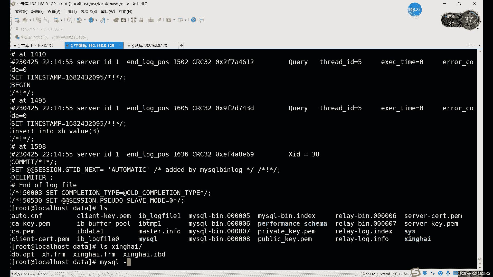
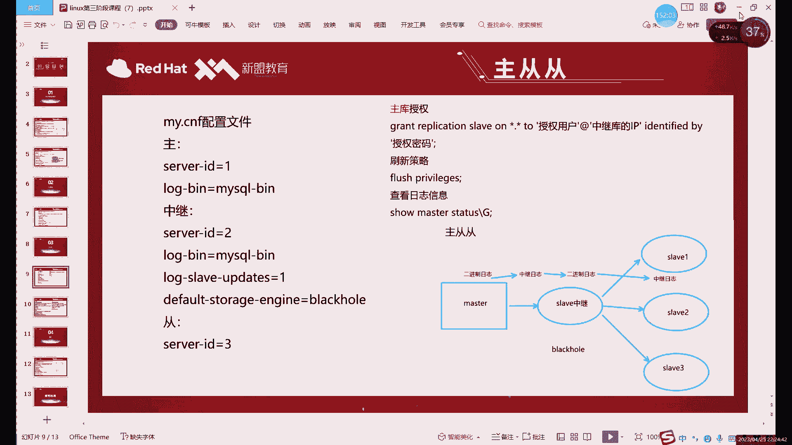

# 0基础小白怎么入门Linux运维？看这套，Linux运维全套培训课程，保姆级教学视频 - P84：中级运维-21.增量备份，主从复制-下 - 小方脸不方- - BV138411B7p5

跳过这个主地主多重对吧，一组多层，一组多重，它其实是有一个问题，就是什么就是重库，如果越多的话，对于主库这边读写压力是比较大的，因为什么，因为每次主库这边一旦提交一个数据对吧，主库这边我每修改一个数据。

我们的存库这边呢就会先就要同步一次，对吧啊，都要有一个进程来啊，帮我们去同步，然后接下来的话就是你如果每多一个同步，相当于一个同步的话，就同步一次对吧，同步越多呢，那发的越多，发的越多呢，就压力越大。

压力越大就越容易出事对吧，越容易出事，所以说呢我们一般情况下呢，啊如果说你后边真的有多重复的话，我们是需要加什么呢，是需要加这个一个中继的东西来放在这里，啊那个中继的作用是什么呢，中继的作用的话。

其实就是一个过渡或者传递数据，就比如说你看啊，如果说像一台从库连上这三个家伙，一台存库连这三个家伙的话，不是一台主库连着三个同库，如果他每生成一次数据，就每修改一次数据，就同时向单库去发发送消息对吧。

如果说我们换成这种，那其实就相当于什么，相当于我们是一主一从，对于主观来说呢，我们就是一主一从啊，就没有那么大的读写的压力啊，没有那么大的读写压力，这样的话就自然就轻松一些了啊。

读起来比小了就不容易宕机了啊，服务器出故障，宕机的原因一般是什么呢，除了断电这种啊，除了断电这种比比较恶心以外呢，除了断电这种以外呢，其实最常见的就是资源跑得太满就容易宕机啊，就比如说你内存也好。

CPU也好，硬盘也好，三个里面其实有一个满的就容易出事嗯，有一个满的就可能只是他一个硬件输入故障，但是大家也知道对吧，对于服务器来说，一个硬件出故障，那整体肯定容易出事啊，硬盘其实还好。

硬盘如果做了瑞兹的话，不致命对吧，就不致命了，但是如果你是内存啊，或者说CPU出点问题啥的话，那那一样一旦出问题，整个服务器你就跑不起来了啊，所以说呢这个其实，你不能让场。

不能让一台的一台服务器的压力太大，所以说我们这里就用了什么，用了一个中继的库来进行转接啊，进行转接，嗯一主多从的话，你如果说是像这种写法的话，那确实可以，这样的话也行，但是这样没必要，为什么呢，因为。

倒也可以啊，但是也可以啊，这也是一种就一直解决方法啊，就是可以不让一个库压力那么大啊，是一种解决方法啊，就是，可能我们这个其实道理是一样的啊，道理是一样的，就是只要是不要让主库压力大就行啊。

只要不让主库压力太大就行，因为我们是主从啊，就是我们主从的这个结构里面，主库是负责写的对吧，写入是负责是主和派负责的，而读取的话主库也行，从库也可以啊，大家注意啊，这是从库呢不能写数据啊。

啊这里强调一个，刚才没有说啊，就是主从一旦做了之后呢，主库就不要再写数据了，不是重复就不要再写数据了，因为你写了数据的话，其实当时也不是很不太影响，但是主要问题是啥呢，就是如果你写了数据之后呢。

然后主库那边也刚好写了一个跟你类似的唉，然后容易冲突，对外冲突是一个问题，第二的话就是你重复写了，你就是主播也不知道你写就自己写的啊，那跟重复没啥关系，主库跟没啥关系，就是说重复就做完主从之后。

重复就不要再写数据了啊，不要再写数据了，然后这里的话我们这个中继库的作用是什么，作用，就是我刚才说了，起到一个中间过渡引导的作用对吧，而且我刚才也介绍了这个存储引擎，我们用什么用黑洞啊，用黑洞。

这个黑洞的话大家特点应该还记得吧，就不存数据对吧，黑洞我们之前讲过的不存数据，不存数据，它干什么呢，啊就只是用来过渡的啊，黑洞能用的场景很少，这就是其中之一，也是它主要应用一个场景啊，这种的话。

就是为什么说它为什么这个要用黑洞呢，啊大家可以想一下，为什么我们这里给主库做一个过渡的话，为什么要加黑洞，能他能不能作为一个正常的数据库呢，其实倒也可以啊，如果说他作为一个正常的数据库的话。

它其实后边还不是面对什么，面对了三个对，面对了多个什么多个重复，那这种情况下的话，其实和一个主库面对多个同步呢，效果其实也差不太多对吧，效果其实是一样的，那他的压力就会很大。

所以说呢你如果说一个主库向多个同步进行，同步数据的话啊，尤其像这个中继库啊，主库的话很容易出问题，中地库的话，这里为了避免对吧，尽量避免我们这个，硬盘跑的太硬盘内存对吧，CPU是硬件资源跑太高。

那怎么办呢，那我们就是中间这里呢不存数据，不写数据是吧，不写数据的硬盘就加一就没那么大了对吧对吧，不写数据的话，其实就不需要开那么多进程去啊，去管理这个关于数据的问题啊。

所以这就是为什么我们这里要用黑洞引擎，哎，不用我们默认那种移动dB，用默认的一道也不是不行啊，如果你用了之后的话，其实用了之后的话，其实这个中底库跟没做没啥区别啊，因为你本来从库。

本来主库可以直接给他对吧，你中间加了个中级库，其实还速度会更慢一点对吧，那你加中继库的目的是什么，其实就是目的，因为主要是减轻主C的压力啊，而且你本身自己你也不能压力太大，你压力太大的话，你也容易挂。

你挂了的话，主动主动就断了，因为中间这一段的话，主从头部就直接断掉了，所以这里的话一定是我们一定用什么，一定用black house这种黑洞引擎不存数据啊，就是我这里的设计不要数据了。

我只是给你们做一个中转啊，他这里的读写压力其实基本没什么对原力，它只是面对于来面对于主库同库的之间，一个读写，他这里本身不写任何数据啊，不写任何数据的话，相当于至少至少读写压力降了50%，差不多啊。

因为少了差不多少了50%读写压力，啊然后这里的话就是什么，这里就是我们的主主童童这个做法，然后中医以及中间这个黑洞的问题对吧，中间这个黑洞啊已经提前好了好几节课，之前就讲过对吧，讲过这个黑洞的问题。

然后这里的话我们接下来呢就具体来说一下，这个啊，这个怎么做啊，其实这个做起来也很简单，主要就是中间这个黑洞的问题啊，主要是和前面不一样，就中间这个黑洞我们怎么去设置啊，怎么去设置。

就比如说呢我们这里来看一下这个，现在的话我们你这里虽然说我图画的多啊，但你做这个实验的话，你三台就够啊，你做这个的话三台就够，所以说这里的话我们就直接什么。

我们直接就我直接把第三台也连上，第三台的话是这个1281128。

啊这里有这里我们就作为什么作为第三台啊，这台这台的话我们作为重复啊，8。0。128，然后呢第二台我换个名字，第二台我们这里就不叫同步了，准确点出它应该叫什么，叫中继啊，叫中继库。

现在的话其实我们是只是单纯做着，我们做了他和他的组成对吧，做了他和他的组成，做了它和它的主从的话，你接下来的话如果要做这个主动同的一种啊，中间的话我们需要换什么，中间需要换一种啊，不一样，存储引擎。

也就是我们刚才所说的黑洞换成黑洞之后呢，我们这里相当于不存数据了啊，就只是用来传递它们之间的数据啊，首先的话我这里先设置什么，我们在做这个主题之前的话，我们先把什么设置好呢，先把这个我的配置文件修改好。

因为配置文件需要修改，我们需要重启数据库，所以说我们这里先把配置文件修改好。

配置文件的修改的话，首先第一个主库这边啊，需要注意的就是开启二进制日志就好了啊，中继库的话需要干什么呢，需要第一开启中期开启二进制日志啊，这里大家注意啊，这就中继库也要开二进制值，为什么呢。

因为他是他的二进制值呢，需要我们的重复去读取嘛对吧，大家可以看这个图吗，刚才有没有没有细说这个图对吧，我们主库的二进制日志，同步到重复的中继日志里边，然后呢然后中间日志更新到啊，直接更新到二进制值。

我们这里开了黑洞，我们就相当于不进啊，不走库了，相当于直接两个日志之间同步，中继日志同步到二进制日志，然后二进制日志呢，它也同步到后边重复的中继日志里面啊，所以说这个他是一定要开这个二进制日志的啊。

就中继库一定要开，然后呢还要再开一个什么呢，还要再开一个日的一个更新啊，因为我们不用诶，就是我们用黑洞的话，我们是不写入数据的对吧，不写入数据的话，我们是要中继和二进制之间直接的更新的啊。

现在直接更新更新到二进距离这里啊，所以就开这么一个选项，然后呢还有一个最重要的最重要在这啊，default start engine就是black hole黑洞，把默认存储引擎改成黑洞，唉。

这样创建的所有的什么呢，这样创建的出来的所有这个信息的都是什么呢，都是这个，相当于是怎么说呢，就是不存数据，但是会写入到日志啊，我们不存数据，但是会写入到日志里面。

这个其实我们在讲存储引擎的时候已经说过啊，肯定那天没在是吧，就之前存储引擎是给大家演示了对吧，存储引擎那天我们也看日，就是你设置成黑洞的话，我们插数据表格里面是没有的，但是呢日里面会写啊。

日里其实是会写的啊，不管说你有没有中继日志吧，就是你自己如果说只是单纯的一个数据库，你开了黑洞，你写入数据它不会显示，就不会存储，但是也还是会写入到日志里的啊，还是会写入到二进制日志的。

然后重复的话不需要什么设置啊，seri id不要重复就行啊，这里的话我们其实还是要感谢server id，因为我默认的话这个是一啊。

默认全是一，第一台不用改啊。

第一台不用改，第二台呢我们需要退出修改一下，具体改进内容的话就就这几个啊，就这几个，这个是和我们前面做的主图不太一样的地方啊。

主要不太一样，就是我们的中继库啊，主要中立库从库主库没不用开什么主库不用改，直接编辑一下这个，我们的配置文件对吧，这个是我们什么正常的这个二进制制对吧，更新那个呢我们这边应该也开的啊，在这啊。

blog的它的它的准确名字叫什么，它是集连复制啊，什么叫集连复制呢，它其实其实就是两个日之间的更新啊，两日之间分析，二的话和一一样啊，一个意思，然后的话还有一个默认存储引擎，它这个在他这个在上面。

在上面default store的按键啊，我们把这个改成什么，改成黑洞啊，就不用WINDODB了，大写小写都可以啊，来个号嗯，MYSQL里面不区分大小写，所以说这个配置文件里面写大写一样。

写小写也一样啊，不来号，黑洞剪完之后保存就可以，Restart mysql，然后这里的话重启下好之后的话，第三排我们也改一下啊，第三台也需要改，因为user加logo下的MYSQL。

然后这里的话是server id，啊重启键盘锁口，这边的话就配置文件的话，基本上就改完了，接下来呢就是什么，就是还是授权啊，还是授权问题，授权的话，其实主库到中继库的授权，你刚才已经做过了对吧。

主库到中继库的授权已经做过了，接下来主要是什么呢，主要是这个，S slave s l a v，啊现在两个正常对吧，这边正常的，现在主库从库主扣中继库这边连接还是正常啊，这边还是正常的。

我们可以来看一下这个黑洞的效果啊，我们先来看一下黑洞效果，比如insert input，嗯稍等一下，我看一下嗯，没事可以创建insert into，我们插入一个在哪个表呢，啊这个表，比如插入一对吧。

插入这边正常插入了se select信号from，对吧有有数据对吧，有数据这边我们可以来看一下啊，又切换过去，from3from这个表格，这个表格有点问题，特别会一点问题，这个表格应该是有的对吧。

应该是有的，为什么它有呢，因为它不是黑洞引擎啊，大家注意这是存储引擎在创建的时候，就是它并不是说，你把配置文件里面的存储引擎改掉，就是你所有的表格都变成一个引擎，并不是这样。

就是他这个存储引擎默认的是什么意思，就是你在创建表格的时候，它是什么引擎，那就是什么引擎，就是配置文件里是什么，它就变成什么了，如果你后天就本来是应全部都是运动的引擎，你改成不来个号类型。

nob是不会改的啊，是不会变的，所以说这个的话有数据是正常的，我们这里再创建一个表格啊，query table x啊，然后呢我们插入数据，插入，对吧，这边还是正常的，我们再来看一下这个，型号from。

啊它是空的，啊所以说这个的话就是什么呢，这个就是哎我们这个黑洞的作用啊，因为这个它是我们创建，就改黑洞之前的一个表格，所以说它是一张GB的引擎啊，这是正常的，然后他呢就是什么，它就是个黑洞啊。

他这个这个表示黑洞引擎的表格啊，这个是黑洞引擎的表格，啊所以说这个的话就什么，这个就是我们的黑洞引擎的一个作用是吧，它就不会存，现在的话我们这个是主从啊，主同没问题对吧。

接下来如果说这个要继续做主动的话啊，现在数据当然是不一致的，但是是咱们可控范围内的，因为也只创建链表，两个表格不行，一会儿我们在右边创建来表格，效果也是一样的啊，效果是一样的。

嗯你可以提前在这里创建两个表格，好，MYSQL杠u root杠P1对吧，保持数据一致，最好保持数据一致，所以我这里就手动创建啊，Create table，你也可以备份啊。

这这里当然备份其他手动创建的快啊，啊创建好之后呢，再来一个表格table，ID对吧，I d i n g，切换到这个库里边创建，然后呢插入数据，啊我这属于是我这属于是手动同步数据，手动同步一。

然后再创建一个，X，啊这样的话数据就一致了，当然不一致呢，它不影响主从，但是你这样插入数据的时候，它就会出点问题啊，会出点问题好，我们接下来看这边的话，中间主要其实主要是中间做黑洞啊，其实主同同的话。

主要就是核心就是中间的黑洞问题啊，黑洞问题做完之后的话，大家注意就黑洞这里也不要插入数据啊，啊虽然说你确实不能插入，但是你也不要插入，为什么呢，因为它算是什么，它也是一个从库呀，它既是从库，又是主库。

他插入数据呢主库那边读不到哎，但是还会同步呢，还会同步到后面这台重复上，所以说呢这就导致什么感觉，好像主会被忽略了对吧，但是呢又数到会这样会导致数据不一致，所以说呢做好主从之后，就做好主动投资之后的话。

中间裁中地库呢不要查数据，他因为他禁止重复，又是主户，他这个位置很特殊对吧，你插入数据呢，主库也读不到，但是呢还要谈会同步到你的下一级啊，这个就很恶心，所以说呢这个中继库这边不要不要插入数据。

本来你插入也看不到对吧，你还何苦再插入数据，对不对啊，所以说呢我们这里就看一下，看一下这个，接下来就是这两个之间的对吧，这两个之间这两之间的话，首先我们还是授权对吧。

还是这个授权简单点写的话就可以这样写，不on on啊，因为二里面是包括所有权限的，包括这个主动，你如果实在懒得写，你可以这样写啊，关于二星角形图啊，最简单就可以这样写，然后root啊。

再给大家来个简单的就是百分号是吧，这就是什么精简版的identified，这就是我们精简版的授权命令，够简单是吧，把前面这个reputation换成二对吧，把这个IP换成百分号啊。

百分号呢代表的就是所有这个，当然你不用担心不安全的问题对吧，你能访问还有一集root密码呢对吧，还有一集授权密码，你不知道密码，你只是说能访问，你也进不去对吧，你也进不去啊，或者说你只是一个网站的话。

怎么写一个网站，就是192。168。0点版本号，百分号代表所有啊，MYSQL的通配符和正常LINUX系统不一样，LINUX系统里面仓位符是新号对吧，我们这里的这个是百分号，也不能说不一样吧。

其实你看前面我们也用了信号的通配符了对吧，前面这个我们还是用信号的通配符，也是代表所有的意思，这里是这个百分号，也是所有不能说不一样，只是把MYSQL这两个都用啊，都用，啊然后这里的话就是正常的。

这是精简版的时候全屏啊，你是在懒得打这样写，但是完整的话，其实这玩意这里还是放refication slave，因为什么二是包括所有权限的啊，包括所有权限，然后呢新点新的可以换具体的库。

然后呢百分号呢最好还是换具体的IP啊，用户的话root可以换成其他普通用户，密码呢可以换复杂一点的啊，因为这个这个是最简单的解法，那些复杂一点的话可以至少能翻一倍啊，只能翻一倍的长度啊。

这就是我们的授权对吧，收给后边，当然你这样授权呢，其实主库也能访问到他了，这个就涉及到什么，这个是涉及到啊双主的问题对吧，双主我们一会再说啊，我们先说这个属中同啊，我们先说主动同。

然后这边的话我们执行好之后的话，我们也要看什么，也要看这个受master live，不是buslave status s t a t u s，看一下这个啊，零八的1215啊，好多呀，这个怎么这么多。

啊所以说这里的话是这个什么，这里是这个，多是多，应该是可以嫌多的话，可以清一下，不清的也可以用啊，也可以用零八的1215啊，0815，然后这里的话，嗯啊这个之前应该是做过很多操作，后边是删了里面的数据。

所以说这里边啊日日志多也正常啊，日子多也正常，然后这个是我们第二个对吧，这个还是记录一下，那一会儿要用对吧，然后接下来呢我们来看什么呢，接下来看这个，你哪的啊，在这重复哎，最后一个重复连我们的第一台啊。

不是连中间这台中间骨不连第一台啊，Tt c h a n g e master two，master杠host，然后呢等于主块IP192。16，8。0。129啊，中间一台的IP，然后呢后边写master。

我们我这个就不不不竖着写了，我就横着写了，杠user等于啊root密码，一对吧，然后下一个是，怕master，对不对，Master gone password，password写写少了WORD。

然后第四个的话就是master glog gun file啊，我们的日志文件的名字啊，Mysrcle，当兵，10000哎不对，零零，000008啊这样。

然后最后一个的话是master gun log gun position，位置，幺这是这是1215是吗，这结了半个啊，1215，啊这个地方就是你可以横着写，横着写，方便什么，方便复制啊，横竖写方便复制。

可以复制啊，你数据写完那种很明亮复制的，然后这里的话我们直接回车就可以啊，回车就可以啊，这个master直接指定，之前的不需要清理一下，之前的不用清理，你只要保证还是那句话，主存的话保证数据一样就行。

刚才我不是手动同步，在重复上同步了一下数据嘛，啊手动写了一下数据啊，手动写了一下数据，这个文件啊，这个文件它每次都不是固定的吧，你也其实你也不知道他每天具体是啥。

你就是show master slave去看就行了，你要同步的时候就用这个去看，它不一定是哪个，有可能十十以上也有可能对吧，这里可能还能还会更多，两千两千三千也有啊，这个的话这个是这个不是固定的。

这个就是看你当时是用的哪个文件，日志文件是哪个哪个位置，那就用show master slave status，可以看就行，然后这边start slave，启动对吧，启动之后呢收4V5。

看一下状态data啊，master这里的话用master就看什么，就看日志的位置，用slave呢就看什么slave，就看主动复制状态啊，这这两个命令，GG主要是表格太宽了啊，表示太快，显示不下的话。

我们就换一种显示方式，换一种显示方式，然后这里的话我们可以看一下上边啊，两个叶子啊，那个意思没问题对吧，你看这里信息的话也有主从的信息嘛对吧，连的是129对吧，通过连端口3306用户root。

然后呢你看日志的日志名字零八，然后1215下面这个是谁呢，下面是他自己的日志啊，这是自己的中继日志啊，自己中继日志的位置，啊这个话是什么，这就是，这就是我们的连接成功之后的话。

我可以在主播这边执行一下命令吗，比如说我们插入个数据，比如在xx里面插入个二对吧，再插入个三，应该先换到这边，select s e LEC t select新from x h还是空的是吧，就是黑洞的话。

你永远不想不要想数据的问题啊，黑洞就不要想数据啊，你即使说你能做主重，但是你不用存数据啊，你不用存数据，然后第三台的话怎么办呢，第三台直接换这个第三台还是肯定是有的啊。

因为第三台是我们正常做组从哪去哪去，哎算了，我们再打一下吧，select的新from x h对吧，二三就来了，如果说我刚才不同步数据行不行呢，他肯定过不来数据，为什么呢。

因为刚才我同步数据主要最最最重要的是什么，就是创建这个表格，我创建了两个表格，对吧啊，这两个表格的话，如果说我刚才不创建啊，他这个他这个面积是过不来的啊，因为数据不同步啊，只要是两个yes。

其实代表什么，代表你的这个你同步的这个进程没问题了啊，它只是代表同步的进程没问题了，是否能真正同步数据呢，还是要看两边的数据是不是一样啊，不一样肯定是不能同步的，你看像我这里的话。

123刚才我要是不插入的话，那他如果只创建表格，不插入数据，不插入一那个数据的话，它其实现在就是二和三还能同步对吧，能同步他新的数据，但是你同步不了旧的啊，能同步新的都不能同步旧的，这是主动的一个问题。

也是需要注意的点，就是你同步之前呢尽量保持数据一致，不一致不一定会报错，他可能只是同步不了数据啊，就是不一致的话，可能就同步不过去啊，可能那边就是两个yes，就是同步不过去，啊这个就是我们第三个啊。

主总统这边的一个做法啊，中底库这边起到的主要作用是什么呢，就是传递日志对吧，我们你看我们可以没有对吧，然后我们出来可以看一下它的一个日志啊，比如说我们看什么呢，看这个就是叫什么来着。

切换到user下logo下的MYSQL里面的data目录对吧，天猫的data目录下，我们可以看一下日的话是零八对吧，诶啊对零八，那就写到零八了，是不是我们看一下908MYSQL，blog啊。

MYSQL杠冰00008，让我们看一下，对吧是有的，就是你不管说你是你存不存数据，其实不影响你的日志啊，因为你的命令呢实际上是执行了，执行了之后呢，只是不写入到数据库里，这样能少占用我们的空间对吧。

能稍微占用一点空间，就是相当于这个，占用空间小了对吧，你硬盘压力就不大，硬盘也压力不大，就自然就没有那么容易宕机了啊，没有容易宕机了，也没没那么容易卡了啊，像如果说硬盘质量不好的话。

其实读写读写的比较频繁的话，他也不一定不一定会宕机，可能会很卡，就比如说我拿这个前段时间那个什么，就是我们有一个服务器里面是有一个机械盘的，对吧，有个机械盘，机械盘的话，它有它问题就是什么。

他问题就是慢的啊，那就慢一点，慢的时候，然后你复制文件呀，恢复快照的时候呢就会比较卡啊，一卡的话就是什么，一卡基本上就涉及到了整个系统唉，因为那个什么，因为机械盘里面还装了个系统啊。

所以说呢这个怎么说呢，还是固态盘好啊，还是硬盘的话还是固态盘好，然后的话就是读写的话，就是不要让硬盘读写太太高啊，硬盘读写如果太多的话，其实也会导致系统卡顿啊，也会导致系统的卡顿。

然后的话也不是说只存中继是吧，哎怎么能说只存中继是真mysql blog relay log啊，relay杠冰00007对吧，不也是有嘛，这个是什么日子，它是中继日志啊，它是中继日志。

就是我们这两里面是它是有两个日志的，中继和中继是它连接主户用来用的是吧，他主库那边写的数据呢，它同步到中继日志里面，然后中介日期写入再去同步到什么再去写，同步到二进制日志里面，是这样一个顺序。

是先有这个中继日志啊，先有这个中继的，然后中继呢把数据给他整到哪，整到这个二进制日志里面啊，是这样的，啊这就是什么，这就是我们这个中继主从，同这边就是中继后的主要作用是吧，第一设计黑设置黑洞啊。

这我们可以不存数据，我们可以来看一下啊，看一下那个什么IOS青海这个目录啊，我们可以看这个目录，大家发现没有，这原来那个表格是有数据那个表格的，它是有这个RBD对吧，F2M是结构对吧，IBD是什么。

IBD是这个，数据嘛对吧，IPAD是我的数据，这个是有的是正常的对吧，我们是可以看到什么，看到那个IDE的数据呢，那是另一个表格，就是我们刚才那个，哪个表格来着，有点多了啊啊。

这个XH这个表格你看它是空的对吧，它是空的，但其实呢你看我们日志里面是有的，中继日里有二进制日志，也就哪没有呢，我们本地不存不存数据，那你看这里就只有结构啊，因为DC其实我们都可以看。

use切换到这个库里边。

然后呢DESC看一下XH对吧，结构我们有的它只是它就是只保留什么。

只保留一个结构，哪儿说理啊，我们就是只保留结构，就黑洞里边它只保留结构，不保留数据啊。

这个是什么，这个就是我们的这个。

中级库这边的一个特点啊，中级库这边的一个特点作用啊，主要就是传奇日志啊，就是用中继呢传给二进制，然后呢传给二进制之后的话，这个重复的中继呢再去读什么，再去读我们这个二二进制日志。

就比如说我们可以来看一下EST，我也来看一下我们的二级中级日志啊，嗯在，啊在这里对吧，My circle blog，我们来看一下人类log人类ban，然后00002，对吧，我们数据也是在的啊。

就是这个的话其实就是一个日志读一个日志，一个是图一个日志。

那简单来说就是这个图片对吧，就一个一个传下去，嗯中间是插入会有记录吧，你正常数据库的二进制是会记录的，我们所有数据库的一个执行的命令呢，二进制日记都会记录，就如果说你在这里随便写一条命令的话。

他就会记录，然后呢也能同步，所以说那就不要在这写了，你知道就不要写了啊。

我可以给大家演示一下，知道就不要写了，Insert，Into，value value1对1XH插入了对吧，插入了他也看不到对吧，插入了他也看不到，但是呢这边就能看到，对1231。

在最后这个一就是跟我们刚才插入啊，因为它是就相当于是第一，那就是这个烟怎么说呢，就是131，这台是129的主库对吧，129呢它也是128的主库，128我们是不直接连1231的，它是通过这个中继库连接的。

所以说呢中继库这边给了啥，他就他就写啥，他也不知道到底是谁给他的，他其实根本就不知道它上游还有一个数据库，这对他来说的话，他其实就是只知道哎这个129是他的主库，129是他主库，主库给我东西我就要写。

然后就写上来啊，这个就是什么，这个就是就相当于是它这里呢我可以看一下，这边可以看一下那个，看到没有啊，最后一条数据是三，就中继日志是没有的，因为中继日是读他的，而不读我们本身自己的啊。

不读我们自己写入的数据，我们自己写入数值谁来读呢，是二进制日志来读，但要分清楚这两个字的一个作用。

中级知识读其他的二阶知识是来用的，而我们本地的一些操作呢是会写入到，只只会写入到二级值日值啊，我的本机操作只会写到二进制。

你看这里算是没有的对吧，那我们再看另一个MYSQL宾啊，那是零八对吧，他就有这条数据啊，这个就是两个字的区别。

这个大家一定要区分清楚啊，就中继日志呢它是读二进制用的，它跟本机五，它跟本机的数据没有什么关系啊，但不能说没关系，就是他这里的其实读到之后呢，他会写入到本机，然后呢本期执行的所有命令都会写入到二进制。

中继和二进制是不一样的，当然你正常情况下的话，他俩其实内容是一样的，但是如果说你这里一旦写了点东西，中介是他不知道啊，只有二进制知道二进制一知道的话，下边的中介自然也就知道不是下边的中继日志。

就是同库的中继日志他也知道啊，这个就是他一个传递的过程，就一个日志传一个日志哎，再传一个人字，这就是我们主动的一个原理吧，主动原理就是通过日志来传递消息啊，通过日志来传递消息，中继当然是同步数据的啊。

中继它其实你不能说不咋不同步数据。

它同步啊，它同步数据，比如说我们insert into，我们不这次不插XH，我们插入星海这个表格，看这边的仓库，select信号from x h FX是星海，对吧，他同步到了，那他同步到了没有呢。

他肯定同步到了，因为他是个中间商嘛啊他就是个中继哎，中间商的啊，还不赚中间商，但也不是不赚差价哈，这场景嗯又是切换到，这个库里边，然后select，对吧，他能同步不同步的是谁。

不就是刚才你看效果看起来不同步，是因为什么，是因为黑洞的原因啊，有黑洞呢它是同步数据，但是你无法写入，因为黑洞引擎的缘故呢，它无法写入，无法写入到文件里，就是本地不保存数据，只是在只是过一过日志啊。

不保存数据啊，如果说像这个是，这个是我们设置黑洞之前的一个表格，它是inno dB引擎的，我们是正常可以同步数据的啊，我们是可以正常同步数据的啊，中距它也同步数据，如果设置成黑洞之后呢。

就不显示数据了啊，不再显示，中介上写的肯定不会同步主库呀，因为什么，因为他是重复呀，大家注意，就从库写的都跟主库没有关系啊，主库有没有主库，又没有指定什么。

这个如果说你想要两个之间同步行不行呢，也可以实现，这个就涉及到什么，涉及到这个双组的问题了，只有双主呢，就是两个之间呢A写入数据B能读到，B写入数据A能读到，这种叫双组，但是这种呢没有主从常用。

为什么没有主动常用呢，因为双组呢它这里读取压力其实是比较大的，因为其实你比如说你两个同时写啊，两个同时写完了，然后你两个又同分辨率，要读取彼此的数据啊，要读彼此数据，当然冲突这个当这个当然不会冲突啊。

这个冲突是不至于的，因为，如果说你修改相同的数据，比如说同步更新一个数据啊，同步更新一个数据，他顶多就是第二次更新就报错了啊，都不会说重组，那就是报错了啊，然后这里的话这个双主的做法的话。

和主虫一模一样，只不过是什么呢，就是我们正常刚才是这个图片对吧，我把这个图片给它翻转了一下，这就是双组，就是一个数据库呢，既是主又是从，就是互相为主从，那怎么做呢，就是主库授权，从库互相授权。

然后呢互相指定，互相指定参数啊。

先互相授权，然后互相指定参数，然后就完了，这就是双主的做法，做法很简单，就是做两次主动啊，你就可以理解成做两次主动，这个这个这个双组的优势是什么，优势就是两个都可以读数据，都可以写数据啊。

都可以对外提供服务，缺点是什么，缺点就是他们的读写压力比较大啊，读写压力比较大，所以说一般的话双组当然也有公司用啊，也有公司用用的，没有用，没有这个主动多啊，肯定是没用工作的啊。

这个双手大家感兴趣可以先去做一下，就相当于做了两次主同的授权啊，做了两次组合授权，好吧这个的话大家下期可以做一下啊，我这些课程就不讲了啊，课上就不讲了，因为操作是完全一模一样的啊，再再讲一次，再写一次。

其实没什么意义啊，操作是一样的啊，大家注意操作是一样的，就相当于是你是像这样嗯，刚才我们是它主，它是虫对吧，你做双主就是你再把它当成主，把它当成重再做一遍，那就是双主了啊，那就是双主，那就是谁修改文件。

彼此之间都会同步的啊，彼此都都会同步的。

啊这里需要注意的其实就嗯授权两次怎么说呢，就是ID肯定不一样对吧，首先id不一样，然后授权两次的话，分别只彼彼此的IP，或者说要懒的话，你就是嗯要懒的话，你就直接写百分号吧，啊直接写百分号。

然后呢下面这些的话就是也是互相纸啊，互相指你互相查看这个之后的话，两个数据库，它这个master文件肯定就是日志文件肯定不一样啊，这个肯定不可能一样啊，这里的话就注意两边的这个日志文件和日志文。

件位置就行了啊，日志文件的位置就行了，对这个的话这个缺点其实就是什么，双子的缺点其实就是这个注意同步上的问题啊，注意同步上的问题，所以说这个它用的就比稍微少一点对吧，因为说虽然说他可以说啊。

理论上是可以你改我我同步我敢，但是如果说同时修改一个数据的话，就可能会发生数据不一致的问题啊，这如果一旦数据不一致了是吧，所以说呢这个就其实就不太好弄啊，但是但是解决方法当然也有，但是你既然有这种。

其实主从其实要比双主好，主从其实比双手好对吧，有这种更好的选择，其实根本就没必要什么没必要做双主啊。

这双手确实容易脑力啊，确实容易脑力，啊做双主的话其实你随意吧，你想让谁就两个做双主的话，就是两个数据库对吧，你你同时就是主合同，同时就是主同时从两个角色啊，两个角色这个你也可以在哪做。

在这里也可以做对吧，他做主，他做的再做一次，就是他俩的装置是吧，这个其实对主从的话，我们下节课就讲解分离啊，周四就讲毒解分离对。

因为是主峰的优势就是什么，就是这个图解分离啊对吧，主从他虽然说不能同步数据，就是从不能同步同和主不能同步数据，但是这个其实没什么影响对吧，我们有读解问题，他不得读对吧，他不得写。

其实这个要比双主这个机制要好很多啊，比双主机制要好很啊，这就是我们这个主从这边大家下去的话啊，你当然做完先装好三台数据库，最好你有时间就装三个联网安装的，因为后边的话我们实验用样板装，可能会出点问题。

可能会出点小问题，所以说最好还是用样板安装啊，不是源码安装的，三台后边的话嗯最多也就三台了，我们也不会做太大的实验啊，不会做太大时间，三台就够啊，三台三台就够，如果说想做大的三头大的三台肯定不够。

三台肯定不够，至少就三台啊，至少三台，你像这个一主多从对吧，我们这里就是完全就是主从同对，不是主从同这里啊，123对吧，我们就用了三台啊，那正常的话你肯定重复会比稍微比多，会稍微多一点啊，稍微多一点。

my cat就下一课下一课的那个什么，这节课读解分离一样，就叫my cat，万一逐步断网，逐步断网呢，不到啊，你连不到存库，那肯定数据同步就做不了了，但是你至少本地还有一个嘛对吧，备份这个东西啊。

其实我们这个玩意儿这个主同同步，它也是个备份，我们叫什么，我们叫实施的栽培啊，实施备份实时备份，知识备份不行吗，你自己还有个本地的备份呀，你你别忘了二进制日志，他自己就算这就是一个备份呀。

那他就是个备份呀，从同步同步，没办法给你同步数据了，你还有这个帮你帮你救人，除非你没开日记啊，我日志肯定是开着的是吧，你做了这个手重的对吧，你还有个啊这个日志嘛，你断网了，这个没办法，这个肯定没断网了。

没啥解决方法，断网了，这几个就已经是属于故障啊，已经属于故障了，这没什么好解好解决的，只有什么，只有你只要祈祷你断网的时候，千万别再宕机就行啊，断网前还好，你就断网，别断电就行啊，断电就走啊，断电就走。

断网其实对数据没什么太大影响，你别断电就行，断网的话他再多就不能再就读写暂时就停了嘛，啊读写就暂时停了，放对后边就你手动同步就可以吗，就是备份嘛对吧，你不是有二级知识的备份吗。

这个同步到这个同步上不就可以了对吧，同步到同步上，备份是相当于我们是上节课不是讲的备份，和这节课讲主流同步啊，其实这俩他都算备份，一个是本地的备份，一个是相当于连了其他的，让他们做一个实时的备份啊。

这个就相当于双重保险嘛啊双重保险都得做，你不是说你做了组合之后不做，不做本地对面行不行，那肯定不行是吧，就像你断网的情况，把主动肯定要中断了啊，断电救不了，断电呢救不了啊，断电这种东西呃。

主库如果说主只是主库一个段的话，其实从库里边还可以，还还还在对吧，重复还在断电的话，整个业务其实你肯定就停了嘛，那也不会有什么断电，经常断，经常断电加UPS啊，经常断电加UPS，啊直接加UPS就行了。

这得加大功率的，加大功率UPS小功率，它撑不了几分钟，至少至少得买几千块钱那种，上万块钱的也行，UPS其实越贵越好，越贵的话，你撑的时间越长，几千的其实都不太好使。

