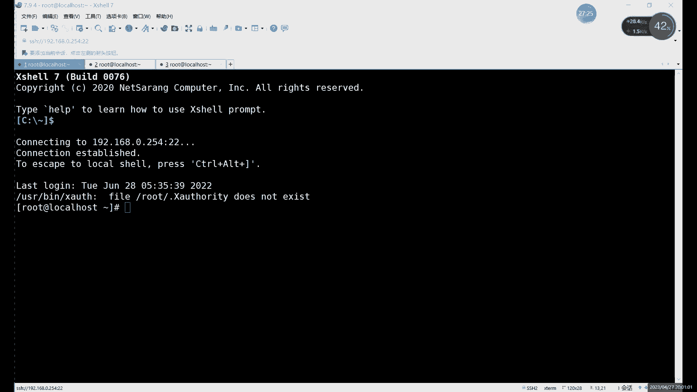

# 0基础小白怎么入门Linux运维？看这套，Linux运维全套培训课程，保姆级教学视频 - P85：中级运维-22.读写分离-上 - 小方脸不方- - BV138411B7p5

好我们今天的内容呢就是这个读写分离，接着上节课的主动复制一起做啊。

还是接着上节课的做，为什么要接上节课呢，啊因为我们的主动就是读写分离呢，它其实是什么呢，可以说是在主从复制的基础上，来进一步的进行一个，相当于是优化吧啊相当于是优化啊，为什么说是优化呢。

就像我们之前的这个读写分离啊，不是之前这个上节课的主动复制嗯，可以看一下，好的，上一个主动给我再开车进对吧，上节课主动不是这个其实不明显，我们来看下面的对吧，就看这个图。

这个是我们最后专业课最后做的这个主从，同对吧，其实我们和中间的中继没有什么关系，我们主要看什么，主要看这个主从之间，这种集群啊，就这种搭建的方法吧，其实我们重复它的作用是什么呢。

它的重复的作用就是啊很简单，就是一个，作为同步的作为一个实时的同步啊，这个里边我们的同步，其他其实就是个实时同步，或者说是一个实时的备份，哎这主库如果出现了意外啊，那么从库里面的数据啊，他都在啊。

从库里的数据都在，那这个时候呢我们来看它可以做什么呢，啊就可以进行一个数据恢复对吧啊，就把数据恢复到这个主库上啊，或者说呢主库如果暂时修不好呢，可以什么，可以把这个一个主一个存库呢拿来当一个什么。

当新的主库来用啊，也是可以的，这个是我们主从复制的这边的一个功能对吧，就是2。1点呢就是同步数据啊，当主库这边出现故障之后呢，数据我们不会丢失啊，这个的话要比什么，这个其实要比我们上节课讲的悖论要好。

为什么要比为什么要为什么这里说比贝恩好呢，因为大家想的是，其实之前讲的那个备份呢有什么问题呢，就是，比如说我们全量备份，这个我们频率就不说了，全量备份的频率一周两周对吧啊。

你定一个时间就可以增量备份的话对吧，比如说我们一天一次对吧，一天一次，其实频率还行吧，也不算快，也不算不算多，也不算少吧啊一天一次，然后呢大家可以想着，如果说我们的一天的中间啊出现了故障。

那就比如说我中午出现了故障啊，比如说每次我们是半夜备份对吧，半夜备份比较好一些，半夜备份，备份之后，啊半月备份之后呢，中午出现了问题，那么上午被封的这些数，就上午出现了新的数据，更新的数据啊也好对吧。

修改数据也好，他有什么问题，他就相当于是你恢复，你也只能恢复之前那个半夜的备份对吧，哎，所以说中间就比如说这半天的时间的，这些数据啊，你找不回来了啊，半天数据找不回来，这个怎么办呢。

啊这个的话就需要什么呢，就需要用到我们这个什么，就我们的，我们这个主，主从的一个同步对吧，有了主从同步的话，其实我们就可以什么呢，有了一个主动红路啊，其实我们做这个啊相当于是有实时的备份啊，实时备份。

哪怕你是一天的中间对吧，一天中间哎这个数据库突然出现故障了啊，也不会什么也不会说损失太多的故障，而不是也不会说损失太多的这个数据对吧，这个就是我们这个就是主动同步，这边的一个优势啊，但是为什么啊。

就这个为什么还要说这个优化的，就是关于主动复制的优化内容呢，其实很简单，就是因为主从这里呢大家可以看这个图对吧，其实在这个图里边呢，啊这是在这个图里面，比如说看这个主库和从库之间对吧。

正常我们主库写入数据对吧，读取数据，然后呢同步给同库里边啊，同步给同库啊，防护的作用呢，它其实就是一个实时的备份，而这种情况下肯定有一个问题就是什么呢，就是如果说不出现故障啊，就假设啊假设不出现故障。

如果不出现故障的话，其实它有个什么问题呢，就是我们可能就是这个重复着，他就一直在备份，然后没有其他事干对吧，就只是同步数据，然后呢压力就全在哪，压力就全在主户这里啊，就比如说你读写哎，你插入数据。

更改数据在主库这里执行对吧，写读取数据量也在主库这里执行，所以所有的其实外部的对我们数据库的操作呢，其实还是主顾一个人来担同库呢，只是做一个实时的备份，这样的话其实有个问题。

就是啊如果是访问量比较大的情况下，那这一个库呢可能就会容易出现吧，容易出现崩溃啊，我们之前也说过，这如果说磁盘的读写读写，这个使用率过高的话啊，其实可能会造成什么，可能会造成一些啊这个服务的重启呀。

啊像一些这个或者说内存高的时候，可能会有一些服务的重启，就比如说MYSQL啊，MYSQL的话，其实如果说你这个服务器啊，内存CPU过高的情况下呢，啊CPU使用率过高，内存塞满了啊，这是肯定会出现什么。

肯定会出现自动重启的现象啊，自动重启的话，这个相当于是自我一个保护，一个自我保护的机制啊，重启一下的话啊，释放一下进程对吧，释放一下进程，释放一下这些CPU内存啊，就可以什么就可以，至少能保证什么。

保证服务器不宕机对吧，但是呢可能服务会自己服务会掉啊，可能服务会掉，你这种情况下的话，你就是说服务服务器不宕机的服务啊，服务响应慢啊，或者说服务直接从自动重启了，那这种情况下可能会对。

也会对我们业务造成很大的影响对吧，所以说呢这种情况就这个主从问题，就是在这个单点这里啊，一个组一个主控压力太大了，那怎么办呢，啊我们就可以，我们这这里的话就涉及到这个什么，涉及到这个读写分离的问题啊。

就是对于我们主同这个优化主同的话，优势它就是就是同步数据对吧，同步对阵啊，红备份数据值能保证数据的安全性，安全性，完整性，但是呢就是主库的压力太大，所以说呢我们优化的优化的方法呢。

就是我们今天所说的这个主通读写分离啊，在组成的基础上去做什么意思，大家可以看啊，就是比如说我们右边这部分还是主从啊，右边这部分其实还是主从对吧，我们大家大家一定要先把什么先把怎么做好啊。

如果昨天子峰没做好的话，今天实验没办法没办法继续做，因为今天的时间就是基于主同的基础上啊。

在主通的基础上去做的，所以说呢我们今天这个，一定要提前做啊，一定要把这个提前做好，然后的话接下来我们看一下，接下来就来看这个，啊首先的话这个主同肯定没问题对吧，哎无有点问题啊。

我们这昨天主动其实稍微需要调整一下，昨天我们做的主动是三台对吧，但是不是一组两重，我们做的是一个中间是中继的对吧，啊中间是中继的，所以说呢这里的话需要什么呢，啊把这个主从稍微调整一下。

甚至我们可以把什么我们可以先把这个IP啊，IP都正常对吧，IP都正常，我们甚至可以先把什么，先把这个就是中间给抬上啊，我们昨天的中继库对吧，我昨天有台中地库，我们调整一下，把它变成，变成组组同的吧。

啊变成主同的方式，啊其实到这里可以不用调整，我们可以什么就一主一从吧，啊就一主一从，其实也可以做也可以做啊，也可以做一主一从，我这里再开一个，啊那就一主一从。

啊你一组长同学也可以啊也可以。

啊我还是用三台，我们就一主一从吧，啊一主一从，然后呢我们前面加一个什么，一会儿一会儿再说啊，这个不着急啊，然后我们这里的话可以看一下IP是，啊0。254，这个还可以，基本上固定看，这里的话。

首先我们这两台呢已经有一个主动了对吧，已经有了是131和129对吧。

我们先连一下这个插销，131和129的。

啊第二台是129。

然后呢我们再连一台这个254。

好我们这里是三台对吧，是三台，然后呢其中两台的话我们就是数据库啊，两台的数据库我们可以看一下，现在这个主动复制状态的话啊，mysql u root p1好，当然这边是主库，我们这边是这边是同步。

但因为同库这里的话，我们先把什么把那个改回来吧，就是把黑洞改回来吧，啊把黑洞去掉吧，啊VNETC加的这个不去黑洞的话，我们看不到数据对吧，不去黑洞看不到数据，etc下载mac3I啊，把这推动改回来。

INODB啊，印度DB，MYSQL啊，我们重启一下，重启之后的话，我们进入到数据库里面，我们可以看一下，看一下这个主动的状态啊，如果是正常的话，我们就继来继续啊，就可以继续往下做了，就可以继续往下做了。

读写分离呢它其实，它的原理其实很简单啊，就是什么就是把什么把这个读的操作分给谁呢，分给从库去干啊，就是让从库去负责什么，负责这个，读的部分，然后呢主库呢啊负责去写，相当于是把两种操作给分开了。

这样的话就能大大减少，怎么减少我们组织的压力对吧，尤其是像其实这个对于数据读写来说的话，很多啊，很多情况下呢读的操作可能要比什么，可能要比写的操作还要多一些对吧，因为什么，因为其实嗯只要涉及到洗它。

其实前提就得先读一遍对吧，你如果读不到的话，你肯定不知道你修改什么是吧，所以说呢这个一般情况下就是读写操作里面，肯定是读是占这个占的比例，相对来说大一点点啊，相对来说占的比例大一些。

然后这里的话我们看一下这个受，Slave status，看一下是不是两个yes啊，两个NO，那我们先开启一下slave，啊开启之后就正常啊，然后现在的话我们可以创建一个磁盘，创建个表。

看一下现在能否同步啊，能否同步，然后他已经把存储引擎改成改成int dB了，我们就能看到数据了啊，就可以看到数据了，反正看不到也没事，我们可以创建一个表来看看对吧，创建一个表，我切换到我们的库里边。

然后呢show show tables，啊就往第一个表里面插入过，我记得第一个表应该是个正常的表达，DESC啊，不对，应该是show create table什么呢，心海这样看啊。

正常这个是INNOD的引擎，我们可以向这里面插入点数据对吧，Insert into，Insert into，然后加上数据库的名称，然后是values啊，就是我们的数据，啊我这边插入一个一。

然后我们直接在这边看吧，啊select啊，先切换库，切换到我们这个同步的这个数据库里边，然后呢select信号from，我看一下这个这个表格里面，有没有插入新的数据，121对吧，一是刚刚插入的对吧。

一是刚刚插入，那说明什么，说明没问题了对吧，说明没问题了，这个是什么，这就是我们这个，啊这个的话就是我们这个一主从对吧。

没问题，主从没问题的话，我们先来做什么，做这个读写分离，读写分离的话，首先呢啊就是把两种操作给分开对吧，就是写呢其实就是增删改这三种命令对吧，读的话就是select这个命令啊。

就是这两这两种操作呢完全分开，由谁来分开呢。

就是由我们一个代理服务器来分开对吧，这里为什么我就连着三台对吧，我这个主从只有他俩主从。

第三台的作用是什么，第三台的作用我们是什么，它是一个代理服务器啊，他做代理服务器，那这个代理服务器它的他在我们这个集群里面，其实它起到的作用就是什么，就是读写分离，唉就是把读写这两种操作呢唉分开。

把写呢呃就是如果说有客户端啊，来访问我们这个数据库了对吧，访问也就是数据库，比如说我想读一条，读一条数据对吧，查看一条数据，那是属于写对吧，属于洗，不是属于读，读的话就分给什么，分给我们重复。

如果是写着操作对吧，我改数据，改数据就发给他，发给主库，这两个能不能反过来呢，哎就是能不能让什么能不能让这个主库去读，同步去写呢对吧，刚才也说了，这个读的操作可能会稍微多一些啊，能不能让主库去读呢。

啊大家可以思考一下这个问题啊，就是能不能让重复去写主库去读，现在的话我们是一个组一个虫嘛对吧，现在我们这个刚刚创建的是一个组，一个从和这个图里稍微有点不一样对吧，这图里是两个从啊，让重复去写的话。

当然可以写啊，重复是可以写进去的，但是呢主库读不到对吧，可以写对吧，你从库可以写，但主库读不到，因为什么，因为我们这个主从复制啊，它是单向的啊，主动复制它是单项目，所以说你主库写完数据之后。

从库同步对吧，从库就能读，但如果是你这个用重复去读数据啊，不是如果重复去写数据写进去了没问题，但是读呢要从主库上读，那这种情况下呢，你主库都同步到数据，同步到数据，它永远是你怎么插入，插入是成功的。

不会报错，但是呢还怎么读都读不到，为什么呢，就是因为主从同步这个关系啊，除非说你做个双主啊，那这个就这个就随便了对吧，做双主也就随便了，正常的话我们主从对吧，一定是什么，一定是主库负责洗，从库负责读。

啊所以说这种话就是什么，这就是为什么要把写的操作呢，都一定要分给主簿，这就是原因啊，其实为主从它是单向的过程啊，它这个单向的过程，把这两种操作分开之后呢，它其实就是什么，就是一人一半对吧，一人一半。

这样的话我们这样主库的话，那边压力就明显就是明显就能小很多对吧，明显小很多，啊所以说这个的话是什么，这个就是我们的，啊这个就是我们这个叫读写分离的这么一个啊，过程就是把这两种分开啊，把这个分开。

但是呢在具体做之前的话，先强调一个什么，先强调一个用户的问题啊，我们这里是会用到几个用户的对吧啊，因为涉及到什么涉及到授权问题啊，还是授权之前在讲授权的时候说过对吧，后面做集群呢啊。

你一直都会一直涉及到授权问题，就比如这里的授权呢，其实我们是分为三个用户的啊，大家注意我们这里的授权是三个用户，首先第一个用户的话啊，这个用户名字其实大家不用在意啊，这这这这这是什么名字啊。

大家这三个用户名字可以随便起啊，一样其实也可以啊，甚至呢就是三其实一样都可以，这个没有那么严格的规定啊，这个没有那么严格的规定，啊所以说这个的话是，嗯像这个是第一个啊，第一个第一个用户端是什么。

客户端连接代理服务器啊，是需要一个用户的啊，客户端连接代理服务器需要用户，然后呢这个用户的话它的作用呢其实就是什么，就是一个登录作用啊，相当于是代理服务器呢，它不是个数据库啊，大家注意啊。

代理服务器我们这里不需要安装数据库啊，当你装也行啊，可以装在数据库上面，但是它其实不需要啊，它只是通过什么，他这里是通过我们通过用，首先通过一个用户登录到代理服务器之后呢，然后呢就可以对什么。

其实就已经登录到这个数据库里面了啊，登录到数据库里面了，然后后边呢具体做的两种操作对吧，读个写啊，就是分别的是分发给了里边，我们已经提前设置好的唉主库和从库，然后呢这里就涉及到第二个用户。

就是我们与客户端呢，通过一用户呢连接到代理服务器了对吧，连接上来了，然后呢如果说你想要写的话啊，或者说想要读的话，肯定要连什么，肯定要去连接我们后端的这些实际的数据库，对吧，因为你这个代理服务器呢。

我们刚才也说了，它其实就是什么，它其实就是一个中转的作用，唉中转的作用没有什么，没有这个它里边没有什么数据哎，就这个代理服务器里面没有数据，我们是实际上让代理服务器呢，哎通过我们再来通过一个授权用户。

去访问我们的其他几个数据库啊，我们这里还要有第二个授权对吧，那第三个授权呢这个就已经做过了对吧，第三个授权已经做过了，就是上节课的这个主重的授权啊，这就是三个授权，就读解分类里边。

我们其实涉及到三种不同的授权啊，或者说是三个不同的用户吧啊三个不同的用户，啊这个的话是什么，这就是我们这个，啊，这个的话就是我们这个读写分离的一个，总的过程啊，三个用户一定要分清楚。

那首先的话读写分离我们不是赌重复，这个我们已经装做完了啊，没做完呢，你先做啊，不要说直接上来就做这个代理服务器，你做完了也没用啊，传了也没用，做完你相当于这个，效果出不来啊，做完其实效果也出不来。

做到直接做到也不会报错啊，等你效果出不来，知道首先你能确保一定要确保什么。

确保我们这个主从复制的啊，能连接上对吧，能同步到数据，然后普通通道数据后呢。

我们在第三台上呢，我们可以装什么呢，我们去装这个代理服务器，而这个代理服务器的话嗯，我们这里通过什么去代理呢，软件的话，啊我们这里用什么，我们用这个，啊my cat啊，软件的话我们用my cat。

但是这里的话其实软件有很多啊，就是带读写分离的这个这个软件呢非常多啊，我们这里的话就主要是以这个，my cat为主啊，my cat为主，还有什么，还有一个叫AMIRA啊，还有一个AMIA变形虫。

变形虫的话，我们这个后边有时间的话，我们也可以说啊，有时间也可以说，然后这个的话我们接下来呢具体的来就来，先来先说这个my cat啊，我们先说my cat，麦开到这里的话，其实主要就是。

啊包括我们后边他和我们后边这个，我看在笔记里面，笔记里面后面会发给大家，这两种不同的这个读写分离的，这个代理服务器啊，两种不同的代理服务器，然后这里的话首先第一种我们先说my cat对吧。

先说my cat，其实my cat是AMEER的，这个相当于后代啊，AMEER是先出的，然后后边的话更新换代更新到了这个my cat，他们俩呢就是是由什么，他们俩是有不同点，总体上来说呢。

Mac的总体优势呢啊，就是总体优势要就是做毒液分离啊，做其他的要比Mac要要要比A好一些啊，要比这个变形虫好一些啊，但是呢如果是仅仅做读写分离的话，只做读写分离的话。

其实还是AMIERAMELIA其实还是不错的啊，Mac的是后边又新增了很多不同的功能啊，有很多现在的很多不同功能，那首先的话我们先来看makemat mirror，两个都一样，他俩都是什么呢，都是这个。

java java写的对吧，java写的都有一个共同特点，就是什么就是需要JDK的环境，java写的这个软件其实都需要什么，都需要JDK环境，有了GGJDK环境的话，我们才能正常运行，才能正常运行。

那就比如说我们这里首先来看一下这个my cat啊，安装的话首先先安装JDK，1。8，1。7其实都行，他们至少是什么，至少需要个，我看AVAVA这个是至少需要1。6max，这边至少需要1。7啊。

也是安装个1。61。7啊，稍微高1。1。8也没问题啊，但是不要高太多，这个JDK环境呢，就是嗯也不能说完全的向下兼容吧，就是尽量什么尽量和这个它的需求匹配，就是你的这个软件呢。

其实java软件其实你安装的时候都可以，什么都可以，提前搜一下他的需要这个版本是多少啊，需要的版本是多少，就JDK版本版本不匹配的话，其实也不能用啊，也不能用，也不是不能用吧，可能会经常会报错啊。

经常会报错，所以说这里的话，首先我们先来看一下这个软件啊，先来看下这个软件，就是先安装一下JDK环境，嗯这里的话我看一下这个倒是没有提前发哈，看一下啊，好在这，安装的话。

其实mat amiri还有这个这个环境呢，其实都很简单，和我们前面的源码安装亚马装其实都不一样啊，都不一样啊，或者说整体上来说就java软件的安装的话，就更偏向于这个，二进制包对吧。

直接就是二进制包的安装，什么意思呢，就是直接解压就能用啊，因为有一部分有很多软件的话，就是像java开发的，还有这个go语言开发那些，其实在安装的时候，其实就是过程就稍微简单一些啊，就可以解包就能用啊。

解包就能用，啊这里给大家发一下怎么发一下这个，看一下这个包啊，书包的话，首先我们是一个JDK的一点，我看这个这个1。8吧啊，就这里可以点8JDK1。8，加上这个，My cat。

然后呢再加一个AMIER对吧，这三个包啊，三包一起发，然后呢其他的话像这个，我就直接发在什么，发在我们这个这一期的这个网盘里面了啊，放在最外边，啊就这三个包啊，已经放在这个jdk max。

还有米粉安装包里面，这个链接里的啊，一共三个对吧，一共三个JDK8U91，我们就安装什么安装这个安装八对吧，稍微比提高一点也没事，好吧啊，大家可以下载，如果现在想装的话，可以下载一下。

然后我们接下来的话就具体的先来安装什么呢。

先在这个第一台上对吧，就在第一台上，我们先来装什么呢，先来装这个，我们这个叫，JDK环境啊，我们先装AJD环境，就装这个8991。

啊这个包呢100多兆啊，因为什么他这么这么大呢，其实就是因为他是已经什么，已经把这些里面的源码内容编译好了啊，编译好之后呢，直接就打包在这编译好编译并且安装好，然后呢把它打了个包啊，然后发布出来了。

这种话就是二进制包的安装啊，这种包就叫二进制包的安装，一般呢其实常用的就是个安装方法，其实就是下载包之后呢，下载下来这个包之后呢，直接解压啊，直接解压JDK8U91，解压的话呢，如果你不想加高达C。

其实也可以不加高达C，也可以直接解压出来就行，解压好之后的话，如果你后面不加路径的话，就解压到当前目录啊，解压到当前目录剪下来之后的话，我们可以看一下IOS啊，它的名字就叫JDK，1。8啊。

点零杠九幺啊，它就是一个人，他就是我们这个1。8版本的这个JDK环境啊，然后这个的话其实就已经算什么，已经算安装好了啊，这就已经装好了，然后怎么用呢啊但是不能，这不可能是你剪好解压一下。

就只能直接能用了，这肯定不现实，我们要怎么用呢，就是把它，给它配置一个环境变量啊，就是在我们在安装那个MYSQL的时候，最后一步对吧，最后一步我们启动之前的话，我们做了什么，做了一个配置环境变量。

配置环境变量的作用其实很简单，就是方便执行命令，你不做也行，不做也不影响啊，就是方便执行命令一点，然后呢这里的话是这个什么，这里是这个如果你不做的话，相当于是他找不到啊，就找不到这个应该说什么。

应该说找不到命令对吧，找不到这个JDK的环境的路径啊，这个就是环境变量的一个作用嘛，啊ETCR的profile啊，当然我们可以先把这个JDK画画个目录对吧，直接放在root目录下，肯定不太好好。

这里随便创建一个文件，创建一个文件夹吧，啊user嗯，这边创建一个，user的java啊，首先创建一个，然后呢把这个直接拷贝过去就行，我就把JDK1。8这个目录，这个得拷贝到哪了，考虑到这个像。

嗯看一下1。8啊，就整个目录过去吧啊，user下的java，CP高RP啊，我们来看一下这个拷贝过去之后的话，这个就是我们里面的内容啊，就是还得再看一下java jdk啊，这里边那种。

但已经什么已经编译好了，已经安装好啊，已经安装好了，最后一步的话就是编辑一下什么，编辑一下我们的etc profile，就是环境变量文件对吧，拉到最下面直接写什么，直接写这个。

像我们这个java jdk的环境就可以是吧，这个的话其实这个其实也不用记对吧。

这个环境呢其实是什么呢，这个环境它其实就是这个，主要就是一个目录啊，主要就是目录版本啊，你这个词器也没用对吧，它其实就是什么，就是我们软件安装的目录命令的目录啊。

因为里面还需要修改，怎么修改，如果你目录变的话，需要修改对吧，还有一种还包括这个啊，文件变了对吧，你版本号不一样了啊，你肯定有文件名字也不一样啊，这里的话大家可以直接啊复制这段就可以，这个号是什么。

这个就是，环境变量，然后呢我们source重新加载一下啊，重新加载环境变量，然后呢就可以什么相当于可以使用啊，可以用这个，比如说我们java conversion，怎么验证环境变量添加成功的。

就是java conversion，就是在任何地方的执行我们java命令啊，能看到我们这个java版本就可以啊，就JDK版本对1。8，就是刚才我们安装的，嗯然后的话现接下来的话我们来看一下。

我们来看一下这个my cat啊，my cat my cat的话，其实这个也是个软件包啊，我们先把这个我找一下软件包啊。

我们还cat。

来开车进来之后呢，同样也是一样的杠ZXF啊，Mac直接解压就可以，填好之后的话，它是一个叫就是my cat目录啊，一个叫MAKET目录一样的过程对吧，我们随便创建一个目录。

软件的话我们就放在user下logo logo下面吧，创建一下user下logo下的一个my cat，然后呢我们CP杠rp my cat，拷贝到右侧角落下的埋伏里面啊，随便你创建目录就可以，在哪都行啊。

然后呢我们打开一下，再开一下etc发SDO，在还能再写一下，为什么呢，刚才那个是java的一个环境变量，我们还要写什么呢。

我们还要写这个像my cat一个环境变量啊。

也是一样的，就是路径加什么路径加命令啊，软件的路径加上我们的命令路径，然后同样也是拷贝过来，啊然后呢现在的话其实已经算什么，已经算安装好了对吧，已经算安装好了。

我看一下这个user llogo的my cat，我们切过去看一下啊，这边的话配置文件是哪个，配置文件就是我们的CONF目录啊，com目录就是配置文件，然后呢B目录的话就是我们命令啊，比如启动的话。

可以直接用这个B目录下命令，直接启动，比如说我们启动命令的话，我们就可以直接用什么的，可以直接用这个，in目录下的这个像我看命令是啊，my cat start啊，这就启动my head对吧。

Starting on my head，然后查看状态的话就是，换成什么呢，我看一下啊，状态是，嗯看一下啊，DAS啊，这个状态的话就是他能看的内容的话有限啊，只是只是能看些什么去看。

只能看一下我们的服务的正常启动了啊，就正在运行啊，正在运行的话是不是就没问题了对吧，这个就是安装my head，安装好之后的，其实安装没什么没什么，就是解压对吧，解压解一下环境变量就完了。

对最主要的是我们是配置啊，怎么配置这个读写分离，这里的话这个文件呢，不管是我们现在讲究my cat也好，还是一会儿要后面要说的这个变形虫也好，其实他们都有一个共同特点，就是什么。

就是我们这个这个叫文件的话，我们一般就是改两个文件啊，就不是说一个配置文件就完事了，是改两个配置文件，IOS我们来看一下iOS com目录嘛，啊对com目录com录的话，就是我们的一些配置文件啊。

这里的话最主要的是找一下，一个是我们的这个，设置数据库的啊，Dema xml，另一个呢是什么，另一个是server啊，另一个是server的插L是这个啊，这两个文件啊。

我们就只改这两件里面主要设置些什么呢，其实就是只要设置一些啊用户啊对吧，关于授权的一些内容啊，好像这些，当然那我刚才也说了，就是这里的话，首先我们刚才也说了，就是三个用户对吧，我们这里至少需要三个用户。

那这三个用户的话在哪设置呢，我们是需要切换到，而不是切换到，就是编辑这个编辑server这个文件，嗯康复录下的server点TML啊，编辑这个文件，这个文件里面有什么，这个文件里面有这个。

我们关于用户密码的设置啊，也就是我们所说的第一个用户，刚才我们说了，就是第一个用户，我们首先是登录谁呢，登录我们的这个叫代理服务器啊，就是首先你先设置来设置一个条件啊，主要其实就是设置用户密码。

就允许什么允许我们的客户端啊，或者其他的用户呢去登录啊，这里的话首先设置第一个用户啊。

第二个用户，第三个用户的话，我们那个，这里对吧，这个用户我们已经设置完了啊，所以说这里的话我们就没有什么，这个就不用管它了啊，已经用完了，用root用户对吧，我们用的root。

然后呢中间那个用户其实我们还没有设置啊，就是谁呢，就是我们的客户端去访问谁，访问谁呢，还不是客户端吗，就是代理服务器访问我们的这个数据库，也需要用户对吧，那这个用户的话，我们两个都需要设置，因为什么。

因为你写操作呢要访问主库对吧，读操作呢访问的是同库，就两个都要访问，所以说两个的授权呢，哎这都要让，就是相当于是这个叫我们的主服务器啊，主从这两个服务器呢都需要什么，都需要设置权限。

允许我们代理服务器登录啊。

允许代理服务器登录，并且查看查看啊，写入啊这些命令，所以说呢我们首先啊，我们先把用户全全全全搞定对吧，第三个现在已经搞定了，还是他第一个第二个，那第二个呢就是我们还是之前的命令对吧。

grant2新点心to对吧，我们直接就简单一点root at，然后呢这里用，啊你怕写错的话，最简单就这样写啊，就是最简单的写吧，啊你如果说怕写错你啊容易如果说容易写，多写些or呀to啊这些连接的词呀。

你就是记一个短一点的对吧，你记一个短一点的，这样好啊，这样方便一点对吧，这是最短的写法啊，这是最短的写法，设置密码我也能短一点对吧，一对吧，Ground on，新点进to用户加IP吧。

IP最短的就是百分号啊，然后我们这里的话就可以授权啊，允许相当于这里一旦授权的话，就是所有的用户的，其实都只要你能拼通，只要能拼通他的其实都能连到数据库，然后这是一个对吧。

然后第二个的话设置都是一样的啊，我们直接复制就可以了，应该是一样的这个授权啊，一样的授权授权之后呢，我们接下来就可以什么，就可以来搞第三个用户了对吧啊，不是第一第一用户，第三个的话就是主动的对吧。

第二个呢是我们这个，代理服务器访问数据库的用户，那第一个呢就是我们的用户啊，客户端访问我们代理服务器的，哎我们编辑一下康复服务器server的，下面我们进来来看啊，来找一下什么呢。

找一下这个我们修改用户的地方，修改用户在哪改呢，我们直接看CDCDCD我们搜索啊，我搜索，搜索一下这个，看一下搜索有什么好，原来那个是叫，B l o p e r t y，这里重复的有点多啊。

重复的有点多，最后大家直接搜搜这个不太好，我看搜哪个好，都debt，debt这个好，或者说呢我觉得其实不做也行哦，对这个其实不用搜啊，大家不用搜索，也不用说记什么行数啊，就是直接拉到末尾就行了啊。

直接一个大G直接到末尾就可以啊，刀包尾的话，这里我们有什么我们有这个啊，就是我们的用户密码的设置啊，用户密码来设置，首先的话用户这里呢你名字可以随便改，不用root也行啊，选root也可以。

这个的话就是我们登录我们的my cat，就是登录my cat的用户对吧，登龙马开什么虎，password吧，123456，其实我们这些都可以不用改的啊，你想改的话可以换其他的其实都可以不用改啊。

用这个默认的情形呢可以啊，可以用默认，啊这里就是什么，这里就是我们这个，第一个用户的设置啊，这里的话主要就是改可以改用户名啊，可以改密码这些啊，你可以随意改，然后这里的话就是我们这个啊。

第一个用户的位置啊，第一个用户的位置，然后这里需要注意的是，需要记一个东西，就是这个数据库啊，数据库叫test dB，这个是什么，这个什么意思啊，这个叫数据虚拟数据库的意思啊，这个是虚拟数据库。

也就是我们实际上客户端啊，或者用户连接到我们这个，那只能说是连接到我们的，你到我们代理服务器上的时候，谁能看到的数据库呢，只有什么，只有这个test TV啊，相当于创建一个虚拟数据库啊。

这个的话相当于掩盖了后边那个数据库的一，个名字啊，啊这就是第一个用户啊，这就是设置第一个用户的地方，那第二个用户呢啊在哪设置呢，我们直接保存退出啊，第二个我们也设置好了对吧，刚刚授权的嘛对吧，刚授权。

所以三个用户都设置好了，我们就可以接下来就可以具体配置是什么，具体配置这个读写分离的一些设置，就是第二个文件啊，SAMLXML数据库的配置。

进来之后呢，总体上来说呢要改的东西其实挺多的，大家一定要注意啊，一定要注意，这里的话你哪怕改改错一个单词啊，或者改错一个字母都不行啊，改错一个字母都不行啊，改错一个字母呢，服务重启就会报错啊。

所以说这里的一定要注意啊，一定要注意，首先第一个数据库的名称，啊第一个数据库名称是什么呢，就是我们刚才在第一个文件里面写的那个啊，登录的数据库名称保持一致就可以啊，量保持一致，然后呢接下来的是什么呢。

接下来呢就可以看什么呢，名称看完之后呢，啊就是我们的这个，还有这里其实对应的名称其实挺多的，蛮多的，这里是第一个对应上个文件，然后呢接下来后面还有个名字叫什么叫data node啊。

data node下面的话也有在看到的啊，但是大家可以看这个名字呢，稍微有点不太一样啊，稍微有点区别对吧，这里的话需要我们改一下啊，这里我们需要改一下，就是把这个data note改掉。

那就把前面的删掉啊，我们还是对称node好的，这两个名字也是对应的啊，注意啊，这两个名字也对应，然后中间那段的话其实没什么太大作用，我们是可以注释的，可以注释这个文件啊，XML格式的文件怎么注释。

和我们前面的不一样，我们正常用的文件井号注释就可以对吧，XML格式的文件注释呢，大家可以参照一下他们这里啊，参照一下原文件，就这么用，用这个括号感叹号杠杠啊，来做这个注释的符号，比如这里的话。

我们来写一下这个诶，我刚才没复制上，对吧，加上这么一段，然后呢大家可以到后面报错了，为什么报错了，因为我们这一个完整的注释呢，一定要包括前面和后面啊，一定要包括这个括号。

所以说呢这里我们再把后边也复制一下，包括在哪呢，包括在这个table，到这table这里就可以，啊写到table这里，啊这样的话相当于把这段注释了啊，大家注意，这里这个文件里面注释的方法就是感叹号啊。

括号感叹号，然后杠杠后面结尾那是杠杠括号啊，这么一个结构，这就是参照格式里面注释的方法啊，TML格式注释的方法，然后我们接下来看什么呢，接下来看一下这个，啊接下来看什么，接下来看这个test。

他的BB这里没什么问题啊，他的dB这里没什么问题，然后呢这里改了之后啊，把这里注释掉，输掉之后的话，下边呢就是就是我们具体详细信息啊，就是我们data load，就是我们数据节点的信息。

这个的话其实我们只有什么，其实只有一个啊，其实只只留一个就可以，后边呢都可以删掉啊。

只留一个就OK啊，太多了也没用，然后后面的话下面这一部分的话就是什么，就是我们的直接分离的配置，这里的话注意啊，含有对应的关系啊，不要说到这就放松了，这个test dB的和上个文件对应对吧。

这个dB和这个dB要一样，然后这里还有这段host，这段host是谁呢，和下面这个也要也要一样，然后呢这里这个data base啊，这个就比较重要了，这个是什么，这就是我们同步的数据库啊。

这个就是我们同步的数据库，没声音了吗，只能耳机又坏了，大家现在听着有声音吗，有的话刷波一啊，有的话刷波一，有是吧，有那你就退出去，重重反手打也没啥用，那就重新进一遍吧，重新进一下，没有，啊没声音。

重新进进一下就可以对吧。

这里的base是什么，这个就比较重要了啊，这个我们需要改它是什么，就是我刚才不是说了么，test dB呢，它是一个虚拟的数据库啊，就是我们用户连上之后呢，我们不让他看到我们正式数据库对吧。

第一次不让我们看，不让他看到真实数据库，让他看一个虚拟的，那这里的话就是我们要写写真实的数据库，名称啊，应该是名字是这个对吧，这个数据库一定要存在啊，这个数据库必须得存在，你不存在的话，后边就会报错啊。

大家注意啊，这里的话就是要存在，就是这个我们这的话，就指定我们读写分离的一个数据库啊，针对是哪个数据库来进行读写分离，然后下面的话这个就是什么，这个就是在这host这里和这里对应。

下面的话就是我们的主从这里的主要配置啊，不就是读写分离的主要配置，读写分离的配置的话，首先啊最大最小连接这个这个可以不用改啊，这个不用改，然后后面这个balance的话就是什么，就是我们的。

balance呢就是我们这个负载均衡啊，balance是负载均衡嗯，这个其实负载英文其实我们这里还应暂时，嗯其实暂暂时也用不到啊，暂时也用不到，唉不过呢这里需要改一下啊，这这这需要改一下。

就是负载均衡的主页分为两个设置，这里的话它有很多种不同的类型，就是balance这里零的话它是关闭的，零是关闭的，所以说默认的啊，默认就是它这里是不开读写分离的，然后负载均衡的话，负载均衡。

这里的话首先一共是分成，三种除了零以外啊，除了零以外，零的话就关闭啊，零就关闭，然后呢嗯还有三种话就123啊，三种123，一的话就是我们主库啊，大家注意就是一的话，如果你选一啊，一的话。

这种作业分离的话，它是什么，它是，唉这里有没有戏嗯。

啊，在这一套就是我们的所有的一个主库和从库呢，都是什么，都是一起，就是平均分配啊，就是所有的读操作呢都平均分，这种的话是什么意思，这个这个的话就不是它没有完全分离啊，这一的话它是没有完全分离。

它的意思是什么，就是我们的所有图操作呢，啊，这个和这个图和撤离图里面画的，当然还不一样啊，如果是选择一的话，就是balance那里选择一，那就是读的操作呢，写的操作还是全部由这个重复，就是主库来完成。

读呢一人一半啊，读的话一人一半写的话就全部由这个主库来，就主库的函数读写，然后呢重复这边的话只做一个足，所以这种的话你说他读写分离嘛，其实分了一部分对吧，分了一部分，但是没有完全分走啊，没有完全分走。

这种的话就相当于是从会有事干了，但是呢啊还不是读写分离不是很彻底啊。

读写分离不是很彻底，然后呢balance2的话，这种话就是所有的读操作呢随机的在right后后，right和RT上面分发啊，什么叫随机呢，就是嗯这里的话其实都不是负载均衡了啊，就是随机发啊，就随机发。

啊这种话也不彻底对吧，那也不是也不是彻底的自然逐渐分离，那第三第四就是这个叫三的啊，0123嘛，三的话它是什么，这话就是正常的啊，这是正常的。

这是我们所有图请求分发到我们这个red red hot read，host里面啊，就发给我们的同库，主库呢不分大压力啊，主库部分大压力，啊这里的话就是什么，这里就是我们这个读写分离者需要注意的啊。

读写分离就要注意的balance balance0的话就默认不开启，不开启的话，其实你如果说用这个Mac的话，其实没什么太大作用啊，它就是个代理，如果说你不开启独显分离的话。

它就是个代理作用也没什么太大意义，所以说呢我们这里肯定一般不会选零啊，不会选0123的话，三是最纯粹最彻底的注解分离，一号呢都是相当于是分了一部分啊，给到独库，给到重复，把独自操作分了一部分给重复。

还有一部分的话还是留在主库这个，所以说的话更纯粹一点，直接跟0号，我们就用什么，我们用三啊，我们就用三，把零改成三就行，然后下面的这个，啊switch type的话，这个是switch，看你等一下啊。

所以这三位的后面的后面，然后这个是关于这个读写分离的啊，还有一个什么，还有一个叫，切换的啊，还有一个叫切换的，他这个也可以起到一个监控作用啊，就是它可以监控主控的一个状态啊，你可以进行一个自动切换。

如果说你一个主播挂掉好了啊，就是我们这个主从里边主库挂掉的话，我们可以什么可以直接给从库切换切换过来啊，你可以给重复切换成主库啊，继续执行这个图的操作啊，继续读进行读操作呃，一是这里一是不自动切换。

然后一的话是自动切换啊，一的话自动切换，后面两种的话其实也都是，就不切换，就是一啊，切换就是一，这个话其实啊知道这个就可以啊，知道这两个就可以了，然后呢后边我看前面还有哪个需要改。

啊对我们这个数据库的这个引擎这里啊，driver这样的话，这个我们不能用这种GDBC的啊，我们换成我们换成这个，我们把这个换成这个换成NNATIVE就可以啊，换成native，N a n n nu。

然后边这个其实你一和一其实怎么说呢，其实这里这个如果说你写一的话，他就不会自动切换了，如果你只不过的话，就不会自动切换啊，不会自动切换，所以说这还是正常写一吧啊，还是写一吧啊。

这个的话就是主从读写分离的设置，读写分离设置好之后，下面还有一个叫什么，还有一个就是读写的一个问题啊，这以后他并没有说谁是主食，是从而是谁呢，而是他他说的是谁是谁，负责写的是负责读，但是我们知道啊。

负责写的只能有什么，只能有主，所以说这里的话就是right host就是主库read host就读啊，读的host就是我们的重复啊，这里怎么写的，它首先它默认只有毒的，这默认只有写的。

就默认只有一台数据库啊，孟州一台，然后呢这里的话我们需要改的是什么呢，需要改的是这个叫user，这里不用改对吧，user这里不用改，因为user root对吧，然后root密码是多少来着，嗯看一下密码。

说下密码是多少，我们表示一啊switch type的理智是主库出现故障之后，它会切换，就逐步出现故障之后的话会把重复切换上去，嗯这里的话啊，这密码我改成1/120，啊密码是一啊，用户是root。

然后呢前面的IP的话，我们需要改成什么。