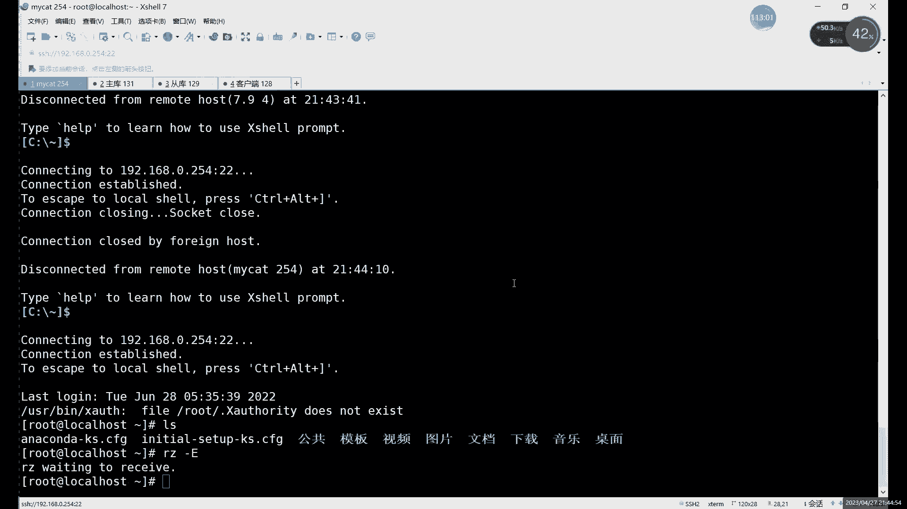
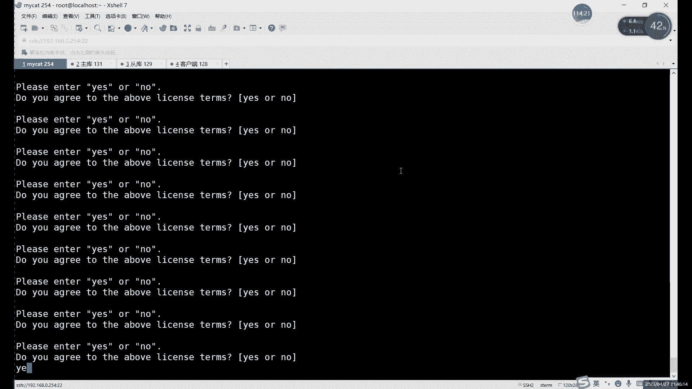

# 0基础小白怎么入门Linux运维？看这套，Linux运维全套培训课程，保姆级教学视频 - P86：中级运维-23.读写分离-中 - 小方脸不方- - BV138411B7p5

192。168。0点，131啊，主播IP冒号端口3306啊，这是什么，这就是第一个啊，第一个主库啊，默认没有写，从对吧，没有没有写，读读怎么写啊，读的话大家注意啊，就是一定要添加在哪呢。

一定要添加在这里啊，添到这个位置，就添加到这个right后里边，就这里不是right嘛对吧，这是write前前面的括号，后面的括号啊，前面的括号，后面括号，然后这里的话中间用什么。

中间用read host，啊连接方式啊，你说这里是吧，不能用这个，不能用JDBC的，JDBC的话，重启会报错啊，得换成native，然后read host，这里的话我们用什么。

我们用这个正常的话和上面写着，按照上面写就可以对吧，Read host，首先第一个host这个名字名字其实这个不重要啊，这个其实也不是主机名啊，它就是代表一个可能是你可以把这个写成什么。

就可以写成主库重复，这样啊，写成主库重复，这样这个无所谓的，啊host1live1，然后呢后边的U2L这个是这个必须要写对啊，这个必须要写对，就是我们的哦对这里还有JDBC是吧，好你看到这里。

这里的话其实简单写URL，直接这么写呢，前面都删了就行啊，不要写G不能写连JDBC的，因为GDBC，刚才我们不是刚把那个JDBC改了嘛对吧，然后这里的话是192。168。0点，这个是129。

冒号3306对吧，然后呢user后面就一样啊，后面就是什么，就是我们的数据库授权的，总结这里少了个括号，啊这少的问啊，这引号啊，啊最后一个是password，啊这样的话就可以了，然后最后再加一个什么。

最后结尾呢再收一个，再来一个括号，啊这要有始有终啊，要有始有终，前面啊用read host开头，后边就用read host结尾啊，前面怎么开的，后面怎么结尾啊，相当于这里的话其实就是什么。

就是在my cat里面的话，其实就是相当于是让每一个同库呢，就是属于他他都有自己的一个主库啊，这相当于什么呢，相当于是这个，一个这里的话其实相当于一组一组数据库对吧，分为多写，然后这里上面设置策略的话。

其实就是针对于他们学习设置对吧，比如说这balance b3对吧，他俩呢就是把图解分开，然后呢switch tab这里的话就是什么，就是主控坏掉的话，可以让什么让重复可以临时顶上来啊，临时顶上来。

这个就是什么，这就是我们的，啊这个就是我们这个毒液分离这个配置啊，配置怎么说呢，能修改的地方比较多，大家做的时候呢仔细看笔记啊，仔细看笔记，因为你错一个单词，错一个字母，它就没办法重启啊，它没办法重启。

啊这里的话我们可以直接连接啊，啊就可以重启之后呢，连接来看一下，看一下效果啊。

这个就是配置啊，这些就是配置啊，配置之后的话，我们一会儿啊，一会儿再重启一下，然后连上之后我们看看效果，看效果，好我们这里的话就马上把这个退出文件，然后重启一下我们这个my cat来启动。

其实命令其实都差不多对吧，那无非就是start stop restart这些啊，比如说我们可以看一下有没有restart命令啊，有restart restart的话就是他先停止，然后再启动啊。

你看先stop，然后再start，他其实你也只分开执行两个命令也是一样的啊，分开执行两命也是一样的，然后呢我们接下来的话就是启动之后，现在呢虽然说它没有报错对吧，你看一个stop，然后呢start啊。

还是started对吧，还是started，但其实呢它不一定启动了啊，他们因为没有什么没有没报started的对吧，它只有stop就已经关闭，但是他没有报已经启动，所以说我们要看一下这个状态，对不对啊。

怎么看状态，就是STERSSTATUS啊，Dators is ring，那就没问题了啊，是1ZRUNNING的话，这里的话就就相当于是my cat已经启动了啊，已经启动了啊，如果说没启动的话。

它一般都是报什么的，我们先给它关了吧，我先给它关系，大家可以多给大家看一下，没启动还是boss吗，先stop，然后呢再看看status啊，就是is not running。

就是如果说大家啊修改这个文件报错了啊，我们看状态的话，它是什么呢，就是is not running，就是你做完之后呢，你重启好之后呢，不要急着去连接，因为连接它，因为它这里是看不出对错的。

就看不出是否正常的啊，这个是一个问题，有一个是一个缺点啊，但是影响不大，在这里的话就是他已经starting啊，已经已经启动的话，再用什么，再用这个SC看一下，如果是running的话就没问题。

如果是not running的话，就说明什么呢，说明我们的这个配置文件有问题啊，就修改有问题，格式一般没什么事啊，就是只要你这个格式，一般我们按定位是按照它改的嘛，主要是内容里面。

那内容里面可能是有有几个单词错了啊，或者什么的，这个没有识别到吧，这些东西啊你需要什么，需要重新再需要改配置文件啊，需要改配置文件，然后这里的话就是查看这个，我看查看日志的话，如果说你错了的话。

用还是这个命令啊，我看是日志，那个是console，还不能叫CONSO，就这个应该叫什么来着，CSOL啊，是CONSOL，就是CSOL，cl啊，也是console，CONTR是CSOL。

然后这里的话就是我们正常启动啊，正常启动啊，如果说你正常的话，它有什么，就是my cat server start start up successful，就成功启动啊。

当然这还有日志log3跟my cat点log，如果说如果说错了的话，就是如果说你这个有报错怎么办呢，啊有报错的话，你就嗯其实这个命令其实就能他这个命令的话，如果有错的话，它会你不给你显示。

也不需要看字啊，这个也没必要看字，就这个命令就完全给你显示出来了，CSOL基本上能够完全显示啊，一般都会提示你哪部分有问题啊，你去修看，注意一下那边啊有哪个字母啊，或者说单词打错了啊。

或者说没有忘记修改了这些，啊这句话是什么，这个就是，我等一下看一下，成功启动，哦对现在我们还没有启动，我就说这三组为什么不动啊，我们先起一下啊，先起一下restart，先启动，启动之后呢。

我们再看一下CONSOL这个命令啊，启动之后呢，他执行的话有什么意思，Is already running，你就已经准备好启动啊，已经准备好运行了，可以这么说啊，这话有什么，这就是我们的啊，重启成功了。

重启成功，接下来我们就可以来验证，验证的话，大家注意啊，我们需要什么呢，我们需要一个客户端来连接啊，后端是谁呢，其实无所谓啊，主要是客户端必须要有一个特质，就是你必须要有MYSQL命令。

没有MYSQL命令的话，我们没办法连啊，你验证的时候需要连一下，然后这里怎么连呢，首先的话你这个my cat自己肯定是不能连，因为他这里我没有装饰，没有装MYSQL啊，没装MYSQL这个这个这个虚拟机。

然后后面两个都是有对吧，科学验证对吧，但是总总感觉用内部的去验证对吧，不是感觉我感觉不是很好对吧，你可以什么你可以在啊。

我就说怎么内存这么高，我开了四台。

啊我们看一下这个128对，我们把128也连上，我用128来测试对吧，因为128的话它是一个数据库，这个时候是不是数据库，对吧，这台的话我们是什么呢，这台是个my c，0。128啊，这是mat的128。

这个是主户的，诶对，254131，这个名字写错了，这是什么，这个是254，这才是从库交二九，啊最后一台我们是可以当做什么，当做客户端，或者说是做客户端吧，啊客户端128啊，Code18。

这个话我们是有MYSQL命令啊，有MYSL命令，我们可以进行连接，然后大家注意在连接的时候呢，我们怎么去连呢，首先呢啊我们回顾一下刚才说的那三个用户。

用哪个用户连呢，就是用最开始的第一个用户，就是我们的server XML里面执行用户是谁的，root用户的密码是123456对吧，密码是123456，和后边两个密码是不一样的，后边有两个密码的话。

我们授权的时候都是一对吧，啊这是这是一个区别啊，一定要注意，如果大家实在是区分不开哪个用户的话，其实有一个简单方法，就是所有用户，三个用户用户密码都一致就行了啊，用户面都一致，但这样肯定不太好啊。

这样肯定是不太好的，就是最能能分清楚，还是可以设置不同的用户名字也可以不一样，密码也可以不一样对吧，我们这里的话就是第四排嗯。

接下来我看一下嗯，这里设置的话就是，用户那个root，然后是root和123456对吧，然后我们这里直接用MYSQL杠u root啊，对有些东西还没给他，没给大家看，就是第三个这个如果你正常启动的话。

端口号是那个net star嗯，那start，这句话是等会儿来气来着啊，过滤一个JO，构成一个java，我看到口号是哪个啊，3306是我们的数据库，另一个是啊，对8066，8066是我们这个。

my cat这个端口号啊，8006，然后呢这个306是MYSQL数据库的，大家可以看到这里其实已经什么，已经建立连接了，对于重启好之后的话，他这里就是我们的这个叫代理服务器呢，会主动去连这几台数据库啊。

他不是说用互联访问的时候，他在连他已经提前连好了对吧，因为你如果限连的话，耽误时间呀对吧，所以说我们是提前连接好的啊，这里也好的，这个用户呢唉怎么说呢，也不用建立啊，这是不用建立。

像数据库里边那那两个用户的话，其实在great mini使用的时候就自动创建了，然后像这个的话，其实也不是，他们其实只用来登录的一个用户啊，他们其实根本就在系统里面，肯定不是对吧。

root用户密码不是1236456对吧，他就是一个用来登录的用户啊，是用来登录的用户，也就是除了什么，除了MCD这里以外的其他地方根本就不能用啊，就是专门就是相当于是Mac这里的专属的，一个登录用户啊。

你可以这样理解，不需要创建，不需要创建，对吧，你看我们这个root肯定不是root用户，为什么，因为root用户密码还不对对吧，所以说呢，这个其实你也可以成这个虚拟的用户吧，啊连一个虚拟的用户。

啊这个登录的话登录就是806端口，806端口你不能登3306啊，千万不能登306，因为什么，因为我们这个MK这边其实没有数据库，它是没有336端口的，这三六端口是谁呢，就是131的对吧。

129的就这两台的啊，因为我们的主从不是，因为我们的配置文件里面不是指定对接分离嘛，对吧，读解分离的话是有这两台的这个信息的啊，多解分离有这两台信息，所以说呢它就自动连接上了是吧，从我们这个0。

54就是本机嘛，连接到我们这个3306上面啊，这个的话就什么，这就是我们这个，啊这个就是我们的这个这边有个客户端口号，主要给大家看端口号8066啊，为啥看端口号呢。

主要这边就是MYSQLUROO是当P123456，然后是，杠HIP是192。168点，0。10。254对吧，0。254，然后呢再加一个杠大批，为什么这里又加了一个呢，因为如果说默认啊就是MYSQL用户。

就是MYSQL命令，其实默认它登录的，它有默认值吧啊就是什么，就是，用户密码是必须写的，后边的杠杆H它默认是谁的，默认是本地啊，所以说你不写的话，就是默认登录本地了啊，所以这里杠H接写IP。

然后杠大P的话，这个命名这个是端口号的意思啊，默认是谁呢，默认3306，你不写，他就按306走，所以这里的话我们得加上，直接加上8066这个端口号，你不能去连数据库啊，我们是连着谁。

连的是my cat这个软件啊，这个代理服务器，而且呢这个MC那台上他没有三角形来考，他就没有36端口，没有服务吧，不能说没有张口，就是36端口上没有服务，你访问他也访问不进去。

在这里的话我们直接执行与执行的话，报错什么报错是连不上0。254对吧，为啥连不上呢，啊为啥连不上呢，因为这个，刚恢复快照啊，没关，孟强唉，还是冒险的问题，这两个应该是他们仨应该关了吧，上节课就关了对吧。

那应该就可以了是吧，可能把防火墙这家伙怎么说呢，坏事做尽啊，就很多，怎么说呢，很多这个服务很多，你做实验报错，其实经常防经常就就是防火墙的问题，当然你这里放行端口行不行呢，你放行端口。

这里大家注意放行的不是3306啊，这你放心，三零我都没有用啊，我们该放哪端口，得放8066，就是为什么一直会经常会强调端口号的，这个问题，就是如果说在不过不能关防火墙的情况下呢。

就只能只能选择放一端口的这些做法，放心端口呢，那你至少知道这个端口是什么对吧，你MYSQL默认3306对吧，My cat，这个是8066啊，8。6端口啊，这个是什么，这就是我们的啊读写分离。

因为读解分离，这里的话其实我们已经已经连接到啊，其实算是已经连接到，那我们来看一下这个IOS安柏不能S啊，受DTABSES吧，来看一下啊，数据库呢叫test dB对吧，是我们指定的那个虚拟数据库啊。

就不是对，连接的是我们虚拟数据库，然后呢我们来看一下什么，来看一下这个里面的数据好吧，来看这个虚拟数据库里面的数据，又是TSTDB啊，切换过去进去，然后show tables啊，就显示出我们的表格了啊。

当然了，这个虚拟的怎么说呢，你说它有隐藏的作用吗，有但是不多，因为你什么，因为你切换到这个数据库之后呢，你切换到数据库里面之后呢，你会发现，然后你会发现这里tables in星海对吧。

是我真实的这个数据库的名字，就是这里的话，其实它只是就是虚拟，怎么说呢，这个虚拟只是首次登录的啊，首次登录界面啊，首次登录界面的话啊，设置了一个虚拟的这个名字啊，设置一个虚拟的名字。

这个你设置什么都可以啊，这个叫什么都行啊，主要是它的配置文件里面一定要指定好，指定好这个真实的数据库名字，真实数据库名字就肯定不能错，而且呢它一定要存在，大家注意，如果配置文件里指定真实数据库。

名字是一定要存在的，你不存在的话，重启是也会报错的啊，重启也会报错的，因为买my cat连接的时候，它是就是MCD，重启的时候还相当于读取了，重新读取数据库里面所有内容啊。

就是文件不是很多人读取配置文件里所有内容，配置文件里，主要包括的就是我们读写分离的一些设置对吧，所以问题设置里边就有什么，就有这些数据库的信息，他要测试什么，他要测试这个数据库能不能连上，连不上的话。

他也会给你报错啊，那我mt就不启动啊，这个是啊，这是也是一个问题，那一定要注意啊，就是，market里面写的那个数据库的名字呢，一定要什么，一定要存在啊，一定要存在，这个就是什么，这个就是啊。

这个就是我们的这个，图解分离，这里啊验证的话，我们接下来看什么，接下来看的话，看一下这个我们随便写点数据对吧，随便写点数据，这个是主库，这是重复对吧，这个主播就是重复，我们也可以写数据啊，写数据的话。

比如说，正常你这样正常读写数据的话，其实是什么，其实看不出什么效果啊，其实是看不出什么效果的啊，就比如说你们select from看一下表格，刚才我们插入数据库之后，他应该是121对吧啊。

数据肯定没问题啊，读的话是从从复读，但我们其实看不出来啊，我们这里其实暂时还看不出来，那我们插入一个数据的insert into哎，插入在，插入哪个位置呢，我们插入在1212随便写一个吧，啊随便写一个。

插入之后呢，我们再来看一遍对吧，1212就可以经常插入，那我们客户端登录上去之后呢，啊这样写入读取都没问题对吧，都没问题，唉，只是这里暂时我们看不出来他到底是从哪读的，对吧啊，那怎么办呢，我们很简单。

其实啊其实很简单，这个事情只需要什么呢，只需要停止主动复制就好啊，我们可以先暂时把主动复制给停掉，哎什么意思，因为为什么这里我们看不出效果，是因为虽然说它的读取和写入呢是分开的。

但是呢因为有这个主从同步哎，有主动复制，我们看不出来这个读解分离的效果啊，看不出来这个效果，那怎么办呢，我们可以我们可以先把这个暂时的关掉，把什么是三暂时关，就把读解问题先暂时不把主动复制暂时关掉啊。

把主动复制暂时关掉，关的话就是thought啊，slave停止了之后呢，哎呦等一下啊，这执行错了啊，准确说应该是在这里就行啊，应该是在这里不对，在这个第二个第二个stop live，啊停止停止之后的话。

我们先来看一下show slave，对吧它就变成NO了，现在就主动复制就已经关掉了对吧，关掉之后的话，我们来看一下这边啊，正常的读取数据依然没有问题啊，现在我们再插入一次啊，我们再插入一次。

嗯就比如说在这，Insert into，再来插入二对吧，我们再读取唉，这是什么，就是没有了对吧，为什么没有了呢，因为我们把主动复制给关了，读取是从从数据读取，写入呢是写在主库里对吧。

所以说我们的写入没有报错，但是没有信息，为什么呢，就是因为主动复制呢关掉啊，临时关掉之后呢，我们就没有数据啊，这边是重复不用看啊，我们看主库这边，主库这边是可以看到数据的，我们有说select新。

在新form加上这个，对吧，12122吧，又多了个二，啊为什么多了个二呢，唉这就是什么，这就是我们这个关掉这个关掉主动复制的，也就这个作用，所以说这个的话就能看出来，就能看出来我们的毒液分流域效果对吧。

写的话就是往我们主库里写，读呢从铜库去读，来听from，对吧，就只剩1212啊，这个就是什么，这就是我们的主从复制读写分离对吧，读写分离的效果啊，主要是看毒液分离的效果啊。

能能这样能做到这样的话就说明什么，说明我们的毒液分离就成功了啊，就说明毒液分离成功了啊，然后的话最多我们自然还代码启动啊，就启动了start slave，啊stars之类正常启动就可以了啊。

启动之后的话，我们会接着同步的，然后这个话是什么，这个就是我们的这个读写分离，这边的一个配置啊，主要是my cat啊，my cat组解分离配置啊，如果说要在这个，当然我们这里是设置了什么。

我们只是写了一个库对吧，写了一个库，如果想要写多个库呢，需要在配置文件里面这么写啊，vi编辑一下com目录下的scammer表示查没有，还是这个还是这个目录啊，还是这个文件啊，不用那个文件。

那个server文件的话，只是写一下用户名密码，那个用户名密码的话，随便指定啊，随便指定啊，主要就是指定之后呢，嗯我们在登录的时候用到，登录的时候才会用到这种，我也只在那里在一个地方去用啊。

其他地方根本用不到，它也不属于什么系统用户啊，不属于什么这个管理员啊，他其实可以看出来是一个虚拟虚拟的，一个可以看成一个授权用户吧，啊可以看成一个授权用户，他那root呢它不能暂时管理对吧。

因为你如果用这个密码能不能登，root用户就登不上啊，他就是登上，正常我们路由密码还是啊，还是你自己设置的啊，跟那个无关，跟那个无关，然后这里如果说想要弄多个数据库。

就同步多个数据库的话，在哪呢。

大家我们可以找到什么，找到数据库这部分就行啊，找到数据库这部分，你看我们这里其实有好多个不同的标签对吧，你看有这个data load呀对吧，Data host，然后还有什么还有scammer对吧。

这些各种各样不同的标签，这些标签的话，其实每个标签就是对应不同的数据嘛对吧，每个标签对应不同的数据啊，就比如说呢在这个。

那我们数据库是在哪呢。

最上面最上面这个什么，最上面总体上来说它是一个什么，他这个就是定义一个数据节点啊，这个只是定义一个数据节点，然后呢虚拟数据库的名字是这个啊，这是虚拟数据库的名字，然后呢定义多个的话是，在这个这里对吧。

数据库名字是在这儿啊，这个是我们数据库的名字，啊所以说你如果说想要定义什么，要定义就是添加，不用说添加位置，给多位库做读写分离的话啊，在这个相当于是在这个叫my cat里面，它其实就是做读写分离。

它是针对于什么，它是针对一户一户去做的，然后呢一库一库去做的话，还包括什么，包括这个像，嗯有不同的这个地方，有不同的这个主库存库对吧，有不同的主库存库的设置，就是下面这部分啊。

我们设置这个不同的数据库的话，就在这啊，在这，啊这个的话就是，正常的话，这里的话，其实我们啊当然还是看看还有没说对吧，switch type这里switch type这里的话是那个叫，切换的问题啊。

切换的问题，切换这个东西的话，其实就是什么，就是把同步关掉啊，不是把主库关掉啊，把主库关掉，那就比如说我们关一下吧，stop fil web refl的MSL啊，关一下，啊这里关掉了，关掉之后的话。

我们就可以什么呢，关掉之后呢，我们就可以看一下这边的一个效果，我们先退出来啊，所以说再定一下啊，这时再定一下啊，比如说我们现在，啊刚才应该再看一下那个数据啊，其实其实也没关系啊，没关系。

这里的话我们再进一次啊，就是mysql u root杠P这些的话其实不用变对吧，因为我们连接的还是什么的，就是你其实你主库挂对吧，但是其实我们也不知道对吧，也不知道啊，也不知道，然后后边的话我们把这个。

还是继续进这个数据库，大家可以看到没有任何影响对吧，没有任何影响，就是我们进的是哪呢，我们进的其实是我们的这个代理服务器是吧，进的是my cat，所以说对于这个我们用户就客户端访问来说呢。

其实没有什么变化对吧啊，没有什么变化，啊这也是什么，这也是这个MC的一个优势啊，Mac优势就是你的主库挂了之后呢，哎就是你访问其实不受太大影响啊，其实当然如果正常查看的话，确实也没啥关系对吧。

因为我们读的是从哪呢，读的话是从重复去读对吧啊，都是从重复去读，所以说呢这些都没什么太大关系啊，没什么太大关系，啊所以说这里的这个，你可以来看一下这个现在的，我们直接来还是执行刚才的命令。

show tables啊，没有选择数据库对吧，use啊，或者先看一下数据库吧，DATABSE其实没有什么变化对吧，我们切换到这个test TV里面，Test db，Test tv。

啊我们的命令呢怎么说呢，我们命令其实没什么大消息，但是数据它有大小写啊，这个表格的名字其实它其实可以看成数据的，因为它不属于命令啊，命令我们不需分大小写，这个表格时还是区分的。

就是我们数据还是区分大小写的，然后这里的话我们可以看一下嗯，直接查询吧，然后再查询一下side from，一边拒绝连接，select拒绝，Show tables，我刚才选的是看一下刚才在配置文件里。

我指定的是，Balance3，然后呢是switch type1，这里怎么也不应该拒绝连接呀，看一下这里的话我们选择一是什么意思，E的话就是这个一的话是可以进行主动切换啊。

就是我们关掉这个组之后会自动切换，会自动切换，这里确实有点奇怪啊，我看看balance这里三没问题对吧，这个是我们的主动，就是这个是毒液分离的设置，切换的话一是不解完对吧，一是切换的。

一直切换这里这台我们跟数据库的就关掉了，这个还是正常可以访问的，切换数据库之后，你看show database其实还可以对吧，哎这怎么有点奇怪，show database可以的，然后呢千万数据库也可以。

当然这个database其实属于什么，它其实也可以看作是代理服务器上面，也可以看到代理服务器上面，我们刚才那次重启的话，其实之前他设计的谁就是比，这里确实有点奇怪哈，他这里报的是什么。

就是那个java连接，它其实是跟什么有关，跟我们一个这个其实和我们刚才那个跟，谁有点关系，就是和，你们那个叫什么啊，my cat对吧，和my cat其实有关系，你看这是因为它是报错。

暴露和暴露和java有关的对吧，和java有关的报错这版本吗，这个版本一点卡，之前做的。

我看一下之前做的时候我用的是哪个版本了，上次，麦克的主动复制读写分离用的软件包是my cat，AMEER一点吧，上次用的其实就是这个软件包。

这个没啥问题啊，啊对软件包版本确实就是DK版本的话，它不能太就是尽量是和要求的一样啊，这两个要求一样不能太高，因为太高的话，其实他没有，他这个账号里面也没有说向下兼容这个问题。

所以说太高的话肯定是不能用，但是这里的话，其实1。8之前用的就是1。8的，我刚问题的应该是，防火墙可能都关了，这里都能防到，这其实有点奇怪，一的话它还是自动切换，我们必须换一个其他的试试。

换个二呗，我重启一下，因为start重启一下，对他这里已经连接不到什么，连接不到131对吧，大家可以看到就只能连到这个129，只能连到129人能量，129的话经常这边访问，这是连接了，我们退一下吧。

Use test db，Show tables，没有数据，好家伙，这报错还是报错，意思每次都不一样了，1184没有数，我们已经把这个现在启动了嗯，先把主库现在启动啊，这个其实，除数据。

这种报错还是头一次见，这句话我不行，把先把这个先启动啊，先启动，完之后其实也是正常的不正常的PTABLES，这里我们先把主库给关了，重复给关了，直观重复其实是可以，我按道理来说，这个。

哦对我们那个什么应该是切换了这个，我们这里先把这个我们可以把重复关，把同关的话，其实这个可以重复关肯定是可以的，因为啊其实主库同步相当于它是一组一组嘛，组一组，然后呢把同步关了。

这个的话其实是可以正常正常读的，就是你把同步关了的话，其实主户这边读写其实都能用啊，都写都能用，因为主要连的话其实还是连的是足够，就连他还是住户同库，本来不可能本来没有工作呀。

同户这边刚才不是读写分离度，已经验证验证成功了吗，所以说重复这边其实肯定是正常，EST我们退出来退出来，然后这边接近端口就只剩什么，只剩下131了对吧，只剩131了，129就不建行了。

然后这边我们再连一下，又是test dB，Show tables，这下应该是正常的对吧，这下是正常的，然后读写的话，这次这下读写的话，其实都应该什么都应该是在这个逐步上啊，都应该在主图上。

因为同步现在已经挂掉了啊，就是挂同库，其实直接挂同步不影响啊，直接过来同步不影响，然后我看一下这个这边的这个文件，还有一个文件，它其实是康复路线的，哎不对，这个康复目下的rules，还有一个文件。

这个文件里边的话，我看一下，rose文件，Get host，没有这个吗，啊这个的话就是切换这里的话看啊，主库同步挂角其实不影响同步挂掉，不影响主户这边的一个运行，不影响主库的运行，主控挂掉的话。

这边应该还是要什么，还是要设置一个策略啊，还是要设置策略的，就只是在配置文件里指定，其实还不够啊，只在配置文件里面指定就不够，啊这个的话就是这个话，就是我们这个读写分离这里啊，读写分离这里。

麦开头其实也不是一个主要作用，不是一个只要做这个，我们那个高可用的一个软件啊，不是主要做高考用的软件，高考用的这个集群的话，我们在下节课会讲啊，高考用题我们现在下节课会讲。

然后这节课的话我们主要还是说什么，还是说毒液分离的问题啊，这节课我们还是主要说毒液分离问题啊，这里读写分离就已经是可以正常使用啊，读写分离是正常，没问题，就是从不负责什么，从不负责读，然后呢主户负责喜。

然后呢相当于是重复呢，能给我们主库分担出很多的这个，分担很多的压力对吧，分担很多压力，那这个就是什么，这就是我们这个，嗯读写分离这里的作用啊，读写分离的作用，然后的话这个是my cat这个毒液分离啊。

my cat液分离，还有一个是AMIRAMIRACER的话，他其实做的更早一些啊，他他其实就是my cat的一个前身，就是max是在nu的基础上升级的啊，他是在NUA基础上升级之后的，升级之后的。

然后呢这里的话我们接下来看一下什么，接下来就来看一下这个变形虫啊，Ameer，怎么说呢，它其实和原理上，其实和这个什么原理上和my cat是一样的啊，这原理上是一致的啊，不同点是在哪呢。

不同点实际是这个，嗯其实my cat就是啊不是啊，变形虫这个变形虫的话是做的非常早啊，它主要就是对什么，主要就是对我们这个数据库进行做一个乳同啊，做乳同的这个做手同的配置啊，做子龙的配置，然后呢。

这个他和这个my cat的一个读写分离的配置，是不太一样啊，就和配置不太一样，就比如说我们在MC里面其实是相当于把什么呢，相当于把这个主库和从库分组了对吧，我们重复是写在主库里边的啊。

就是从故事写在主库里面的，而像这个Mac就是像amiable的话，这个其实，啊AVA的话，他其实什么它其实是把这个，所有的这个主库和所有的存库呢啊，分成了两部分啊，分成两部分什么意思呢。

就是主库呢就是AVIER变形虫的话，是给主库分配一个什么呢。

这个PPT里面没写啊，大家我直接可以可以可以可以看笔记啊，AVA它是给什么，它相当于是给我们所有的主库呢分了一个分，分了一部分，相当于是把什么，就是把我们这个他不是说把所有请求吧。

就是嗯就是把所有的这个任务吧，也不能说任务其实也不对，小修来说的话就是这样，AMEERAIMERAMEER里面的话，其实把两把从库和主库呢分成两部分，对他俩之间就没关系了，还是当主从复制还是有关系的。

除了主从复制以外，就没有任何关系了，和这个my cat不太一样对吧，my cat之前的话，其实我们是怎么说一个主库里面，我们这大致是怎么写的，我看，对吧，一个主库里边我是包含了什么，包含了重复的对吧。

包含了同库里面也可以，什么也可以包含多个重复啊，就一个主库里面相当于是和一个和几个同步的，问上一组，然后说如果说想要如果有多个同多个主库的话，怎么办呢，啊这个和两边就不太一样，这里发条线分开啊。

my cat这边的话它是如果有多个主库的话啊，如果有多个主库的话，就是每个主库的话，他要他都是分成一组的，一个主库一组，然后里边呢自己呢去那可以同库图，可以是一个可以是两个啊，可以是一个可以是两个啊。

就像这样，然后呢像这个那么本变形虫这边的话，它是它怎么怎么做这个独眼分离呢，就是，比如说其实呢数量的话，比如说我们就是两个组四个重吧，两个组四个从我们这边是这样，就是左边呢我分成了两个柱。

然后右边呢是分成四个，从，啊这个就是他俩的一个区别，其他地方就没什么太大的不一样的地方，就是这两个就是在这个地方，my cat的话，它是什么，就是把主从啊，就是把每个组分别带一对啊，分别带一队。

如果说有三个组的话，就要再开一个，再开一组啊，有第三个组的话要再开一组，然后像这个变异，从这边的话就是组合从完全分开了，这边呢就是完全这边就只负责什么，这边就只负责这个写的操作对吧，这边只负责写的操作。

全部由这些组来完成，直接从的话就负责读，这么做的好处是什么呢，这么做的好处是，AMEER这边的这个负载均衡，其实做的还是还是可以的啊，就这这样写的话，其实负载均衡比较好做啊，为什么就是你组的负载均衡。

就比如说我们一共有100条数据对吧，有100条插入的，比如说这个insert命令吧，100条insert命令的话，我们这边就可以什么就是你50条对吧，给你分50条，给我分50条，这样去分啊。

这样的话他其实做这个负载均衡比较好做，不像读这边也是100条，select语句是一人25条啊，这样的话每一个重复它的压力呢，每一个主库也好啊，同库也好啊，压力就没有那么大，然后像这边的这个负载的话。

它其实我说呢啊，它里面甚至还有什么还有随机分对吧，大家刚才不是在说那个balance的时候对吧，那个balance就是AMIGA配置文件里的balance，其实就是那个关于负载均衡的问题啊。

关于负载均衡问题，他这边其实还有什么还有随机分啊，还有随机分，还有主库也一起参与什么，一起参与这个平均分啊，所以说它里这里边其实有很多就是怎么说呢，他这边其实很多就是死危机的走啊。

随机走的就是每一个从库，就比如说拿读操作来说吧，啊就比如我们还是选刚才的bl3，因为ban12的话，这个时代是ban12的话，主库这边还要负责读啊，所以说主控压力加主科压力还是比较大啊。

能最大程度减轻楚库压力的话，其实就是什么，就是用balance3嘛，balance3的话就是读写完全分开，读写分开的话，读写是分开了对吧，这边主只负责洗啊，他们只负责读，这边负责读的时候呢。

那他还没不能设置，不能设置这个像等于这边的这个负载均衡，它是一个随机状态啊，它是个随机状态，所以说这里的话其实这个负载的话，这个剧本其实更好做一些啊，做得更好一些啊，在负载上，因为什么。

因为你看这里他的分组，那他就是完全把主从分开了，像my cat这边的话，它其实就是主从是在一体的，相当于主从是一体的啊，主动是一体的，就一个九，那至少带一个，不是不能说至少带一个吧。

其实AMIRA边只有如果只有一个数据库，其实也是可以的啊，不是就是my cat这边只有一个数据库也行啊，就一个主分自己一组，然后呢至少是带一个从啊，一个组至少带一个从啊，相当于是他为什么这样分呢。

其实my cat是这样考虑的，并不是说my cat不是不是说my cat不好啊，就是它的负载做的确实没有这个AVIER好，那为什么他要这样做呢，啊明知道不好，为什么要这样做呢，就是把主从分组呢。

其实这个主要是为了什么呢，啊这个就是主要为了这个主动切换啊，这个主要为了主动切换，这样你分开走的话啊，不管是从管理也好，主管理也好的话，就更方便切换一些，你像这边的话，如果说啊不能说，如果说吧。

这边就没有这个切换功能啊，就是AMIRAMIRA缺点是什么，AMIR它没有切换功能，就是主从之间的没办法切换啊，就没办法自动切换啊，这个就是它的一个缺点，手动切换当然都可以切啊啊手动切的话。

你就做个主动也可以切换啊，这边这边是amber这个缺点啊，总体上来说的话，my cat的优势是什么，my cat的话优势是它有自动切换的功能，而这个AMEER的变形虫这边的话，它的优势是什么。

就是负载啊，它的优势是负载方面做的比较好一些，当然了，这个高可用的这个什么自动切换呢，我们要一般还是用什么，一般还是用这个，我们下节课讲了这个MACA啊，还用下节课讲的MC更多一些啊，用这个更多一些啊。

所以说我们接下来的话就来具体说一下，这个变形虫里面啊，总体上配置不配置的话，这边要简单一些，就是AMIRA配置稍微简单一点，因为这个IPAD这边因为配置文件太长啊，配置文件太长，修改的东西实在太多了啊。

修改东西实在太多啊，AMIL这边的话就主要就是它里面的配置，就像我这个图里面画的啊，几个主呢写在一块对吧，几个重写在一块啊，就可以了啊，这个就是什么，这个就是AMEER这边的这个特点，总体上来说呢。

嗯如果只是单纯的做这个读写分离的话，更推荐什么，更推荐一本啊，如果说哎呦哎呦点没了，如果说呢，如果说除了这个主从，就是除除了读写分离以外吧，啊除了读写分离以外呢，啊你还要考虑其他的一些功能。

就比如说这些买啊，就是MYSQL的一些优化内容啊，分部分表这些啊，这个MIER是没有这些功能的，那就什么推荐这个my cat啊，跟推荐my cat，这个是200件一个选择吧，其实都可以啊，都可以好。

接下来的话我们具体说一下么，具体说一下是AVA安装也是一样的JDK啊，然后这个JDK他的要求是1。6的啊，他这个是1。6的版本，比它呢稍微小一点啊，这些就能看出来什么。

就他的时代他的时间要比他早一些对吧，他要求是1。7，他要求1。6嘛对吧，他这个其实这说明这个明白它其实就是什么，就是比mat更早一些啊，更早一批的一个软件，啊好吧，大家可以，下了休息几分钟。

我们一会儿回来了，继续讲这个AMIER啊，继续讲AMIA，这个的话总体上安装上来说，其实和my cat是一样的啊，就是换个换个JDK版本啊，换JDK版本我看一下，1。8，1。6，1。8高了两个版本。

啊更稳一些的话，我还是什么，还是用1。6吧，用这个1。8的话，高梁等等的话，这个真说不好没说不好。

AMEER这边的部署的话，首先的话就是这个JDK的环境对吧，我们换一下环境嘛啊就把这个八换成六，然后的话我们这里就，看一下0。254，0。254，我直接回复快照都快到，比删除快点。

删除的话也得删删好几个文件，还得把这个环境变量里面那些也删掉啊，我们这里就直接恢复快照，恢复快照了，如果快快快的再重新连接一下，然后我们把这个1。6的那个包呢拖进去啊，1。6。

然后这里的话我找一下那个包啊，这DK1。6的话，A b c1。6，啊我直接拖进来，这个包的话。

啊怎么说呢，这个包的安装其实，更简单一点啊，更简单一点，不过这个的话和刚才那个压缩包，还是有点区别的，这个包的话是，它是怎么安装呢，它是把这个，直接执行一下，我们这个，JDK6JDK1。6的这个啊，1。

1点冰，这个结尾的话它是一般就是执行文件啊，执行之后的话，它相当于执行了一个安装的脚本啊，这就类似于直接安装的脚本啊，我们这里可以安装一下。

那首先的话他得有什么，你要执行的话，必须要有什么要有执行权限，所以说呢要加上X啊，加个X，可执行权限之后的话，我们点杠，我们直接执行一下JDK6U，然后呢拉到这个最下面，然后最下面，啊拉到下面之后呢。

输入yes，啊。