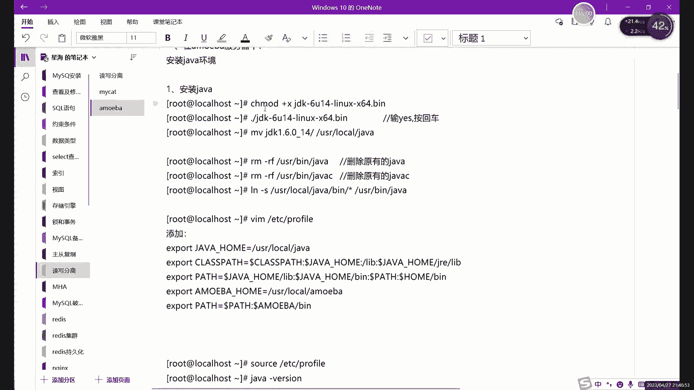
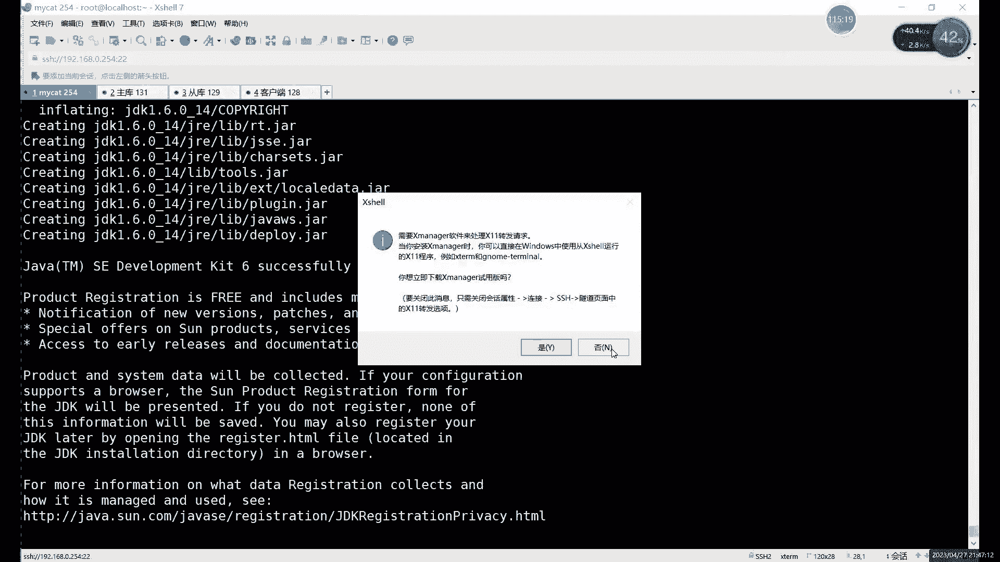
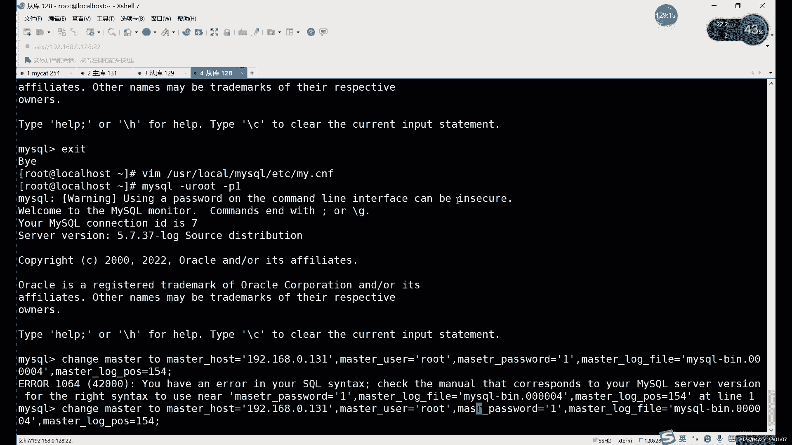
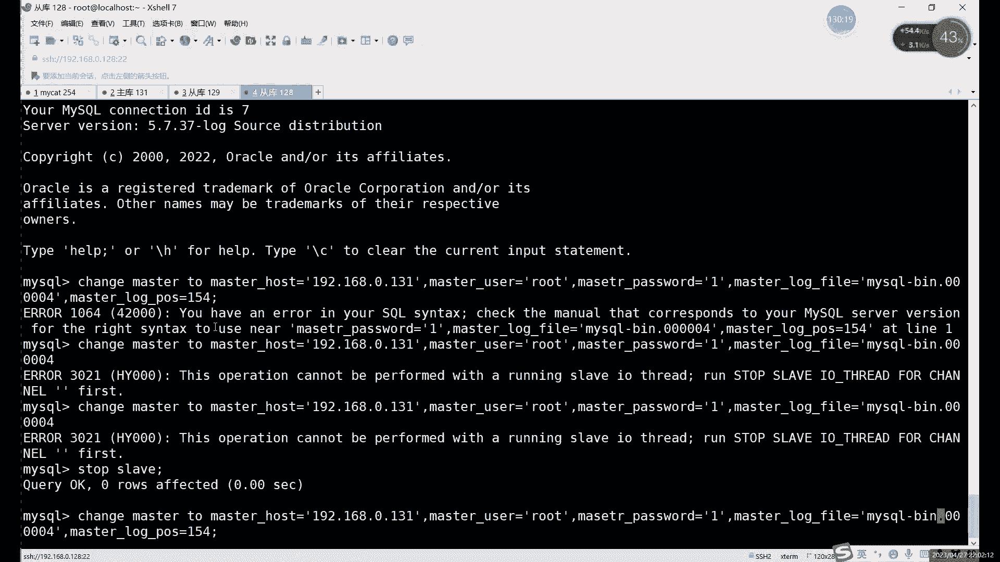
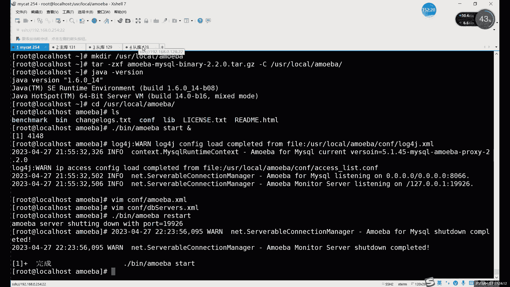

# 0基础小白怎么入门Linux运维？看这套，Linux运维全套培训课程，保姆级教学视频 - P87：中级运维-24.读写分离-下 - 小方脸不方- - BV138411B7p5

不知道打多了，看到yes之后的话，你就看到yes和 no的时候，你就选择yes就行。啊。这个就是安装安装的话，这个相当于是执行那个安装脚本啊，执行那个安装脚本执行好之后的话，就可以什么。

后边的话就和我们前面是一样啊。刚才那个的话其实就是个解压啊，直接把这个软件解压了。这个的话是我们是通过执行这个。啊，也不能说脚本吧，这个其实里边除了脚本以外啊，它肯定是包括脚本的，包括脚本以外的话。

还有什么还有我们的软件的一些信息啊，数据什么也在里边。啊，这里的话这个就是。

当然和执行脚本的方式是一样啊和执行脚本的方式一样。啊，这里的话。嗯。这边查下就是。

好埋你。那安装好之后的话，就是JDK1。6这个目录啊JDK1。6这个目录。比如说我们可以把这个JDK1。6的目录呢再移动到哪呢？呃，随便一个地方，比如说移动到右侧下楼下的。啊，我们目录还没有创建是吧？

我们再创建一下这个java目录。啊，创建好之后呢，我们把这整个JDK移动过去啊，移动到us侧下lo下的这个其实。怎么说呢？和前面那些安装方式，它不一样的地方就在。就不需要什么，不需要那些编译，对吧？

也不需要用那些亚m的命令啊，其实就不同的这个怎么说，其实就不同的语言吧，不同的编程语言写出来的软件，它安装分都不一样啊，这个的话大家就。有说候你见识多了就知道了，这个其实安装方式其实非常多啊。

这个的话就是。java语言的软件的话，基本上怎么说呢？就是JDK环境啊，就是直接很多都是解压，直接可以用啊，或者说一种是是解压之后就可以直接用的。另一种就是说像这样执行这个文件。

相当于执行了这个这个点兵呢，其实比较像什么？比较像咱们这个。windows里面那种点EXE。点MSI那种直接双击就能打开的一个安装的一个。安装包吧，哎，可以类似于一个安装包。啊，它类是一个安装包。

就以这里的话，我们先把这个移动到这个java目录选这边啊。啊，移动过去。留动位置之后，我看一下啊，把这个这样吧加个星号。好，这里的话当然也可以把原来的删掉，原来的话是RM杠RF。

可以把原来user下兵幕面的java这种。啊，就是相当于把原有的删掉啊，把原有的删掉。删掉之后的话，我们把现在的做一个软链接啊，可以做一个软链接。啊，然后刚才那个刚才我们当时没有做，软链接的话。

这个东西做不做呢，其实区别不大。怎么说呢它不会影响到我们软件整体的使用啊，只是用起来更方便一些吧啊用起来更方便一些。有此写屏幕叫java，刚才不是已经删掉了。要是就边幕下得。加我。啊，然后链接过去。

对我们这个是目录啊，因为这个里边命令还比较多啊，命令还比较多。然后我们最后就是EDC的profi和之前是一样的啊，之前是一样的。啊，你可以直接一次性写的时候呢，把这个什么把enber也一起写上啊。

把enber也一起写上。啊，就先写这个dava，然后再写这个，再写meber。然N个但是我还没有装啊没有装。一会儿我们把这个N的软件包再拖进来。看下软件包的话在。嗯。等一本软件包系统啊。

A m o e b a。啊，拜拜。然后这里可以直接。纸重新加载一下。嗯。存下来之后的话，我们解压一下这个aviber这个包吧。这个包的话是一个压缩包啊，ber杠。My circle杠 binary。

这个它这一个名命名其实就啊比较有意思。它这命名的话，首先软件是个米本，对吧？针对于的我们这个主从的话，用的是my circlercle，用的是my circle。my circlecle这里的话。

我们是这个。banary的话是二进制的啊，二进制的这个。二进制的一个包。二进制包的话，其实我们就不需要什么，不需要压缩啊，不需要解压缩啊，不用说不用压缩吧，就是不需要这个编译。啊，不需要编译。啊。

比较方便一点嘛啊，20之8话其实不需要编译。就是解压就可以用。对，其实前边那个刚才我们用的那个。那叫什么来着？micad那里其实也是一样的啊，micad那个其实它也是二进制包。

不过是他没有写在名字里而已。😡，其实一个正常软件包的话，其实这样写的话，其实更更。整更好一点，因为你写上的话就知道，因为这个第二点之类的话，元宝包它也这样命名，对吧？你二进职包它也这样命名。啊。

所以说这个一般。你想要看什么包的话，其实你得看具体里面的一个信息啊，就看里边的一些数据。得具体看里面数据是什么啊，我们这里的话第二个杠ZXF。解压。夹到本地的话是。冇都拿出。哦，对，这个。这怎么说呢？

这个这个me板有点。我们提前创建一个目录吧啊，提前创新目录。因为这个它有点什么特殊呢？就是压缩包，它有的压缩包是直接压缩了几个目录。啊，有的压缩包是压缩几个目录，有的压缩包呢是压缩了一个膜。啊。

这个不是这个也不能这么说吧，就是前面的这个。前面我们说那个mad，他他们是怎么打包呢？就是把几个文件呢。放在一个目录里面再打包。你像这个am米粉的话，它是什么？它是直接把几个文件打包的。

就没有放在目录里。所以说你看解压之后全散在这里了啊，也不好找的话，我们重新解压一下啊，重新解压一下。DR杠ZXF米本。然后我们得先给M边创建个目录吧，先给一个放这些文件的目录啊，先创建一个放文件的目录。

右侧角lo下的这个。然后呢我们再点亮一次。他这个没有目录啊，杠Cuser下的S2C。啊，不是这个思，user加logo下对吧？然后是MU。多谢一阵。啊，再点压找好之后的话，我们可以看一下。嗯。

第2个version你看一下。啊，版本这个是1。6，对吧？1。6。然后的话我们接下来呢是。整体切换到user下lo下，看一下me吧啊，java环境其实第一个环节是没问题的啊，1。6版本的。

啊我们看切换到这个ammiber的目录里面。啊，分为这么几个目录，命令还是在B目录下啊，这地方其实都是一样的。就是所有服务就基本上相当于后天安装的服务啊，它的命令基本上都是在哪，都是在这个。嗯。

都是在我们的屏幕录下啊，这里的话屏幕下的ammiber就可以启动啊启动。

启动端口的话也一样啊，也是8066。然后后边端口是用来干什么？后边用来后边端口其实用来连接我的myscle的啊，就是我们服务端口的话，其实是8066。比如我们用户访问呢，就连接端口其8066。

然后后边其他端口的话，这个它不是固定的，后边端口它就不是固定的。后边端口就是用来连接这个后端的这个mycircle的啊，就这个806呢负责连接用户啊，和用户连接。然后后边的端口。不固定啊。

这个不用机械也不用记啊，它是用来连接这个mycycl。这个其实和我们刚才那个myca其实差不多，对吧？myca的话，我们刚刚刚才其实也可以看到。

我看能不能还能不能找到。啊，这个ZjavaJDK1。6的安装。就是花了好的话呢啊上那个历史的话我们就不看了。啊，总之的话其实就是。不管是my cat也好，还是miber也好，这两个软件其实都是什么。

就是都是用806端口去连谁呢？先连接这个客户端啊，或者客户端去连806端口，然后呢。他自己在用其他端口去连什么连接后端的这个mysql啊，因为我们要实现什么？要实现读写分离嘛啊。

你肯定要及时时刻的要和mysql连接在一起。这样的话，用户你用户的提交的一些操作，对吧？不管说你是增删改长也好啊，对吧？啊，还有查看什么具体的一些信息啊，修改一些什么信息也好。其实都是什么。

都是这个你是一直连着，你才能什么，你才能反应更快一点。不然的话，如果说啊如果是用户执行一个，你才去用mys面才去连接数据库，那就有点太慢了。那效率太慢了。所以说它是相当于是一直保持连接了。H保持日连接。

啊，这里的话就。啊，这里哪去了？我看一下那个摆。啊，这个这里为什么加这and符号，这个就是挂在后台启动啊，就是挂在后台，不能说挂后台吧，就是。

啊，可以说挂在后台吧啊可以说挂在后台，因为这里。😊。

如果说不写这个的话，它是相当于这个命令一执行。啊，这个脚本一执行的话，它是相当于要占用什么，占用我们这个这个终端啊，我们就不能打命令了。所以说我们这里一般就是。用这个什么用这个and符号。

把它外到后台去运行。然后这里的话我们可以看一下这个。

看啊这个读写分离。边还是个客户端。我现在可以给大家改它改成什么，改成同库。很恐复吧。啊，佢得家分丰富。myrcle杠Uroot杠P1。这边我们可以直接加入到这里啊，为什么可以直接加入呢？因为。

我们刚才已经有这个全部的授权，所以说呢我们后边再加入重复的时候也很方便啊。

啊，4Y1是3没问题。

这样之后看看有没有残留的命运。对，没有啊，因为涉及到密码的命令，它是不会记录的啊，涉及到密码的命令它不会记录。我们change master。Post。我看一下这里的话，我们先感连他主库的话，我们就。

买座钢由root杠G一受。Master's status。啊，收 master sister。04的154是吧？啊，我们可以直接连一下。嗯。P master too。master host等于。

1920168。0。131。I master user。授权用户是。哦，那是我们用的root一，对吧？master password。买收烤讲。丁，然后点0000。4然后154。嗯。

master单词打错。

嗯。嗯。

嗯。Yeah。

04我看一下粘复制的话，应该复制这个。Master download log position。

然后指定好之后的话，我们star类啊，之前的话我们是有个什么。对，之前的话是上节课这个是做过做过一个重复的，是指定是他的重复啊，我们就先要把这个主动复制给关掉，我们才能再重新指定啊。

关掉之后才能重新指定啊，我们设 slaveve statusTATUS。

现在的话我们就是一个主库，两个从库，啊，一组两从现在是。啊，然后呢在这边做这个。读解分离的话，首先文件还是两个文件。啊，文件还是两个文件和刚才是比较像的啊，是两个文件。

哎，不过这两个文件呢修改内容就啊不太一样。刚才说了我们是把这个什么把主库和重库呢分成两个部分啊，分成两部分。啊，更准确来来说的话，是分成了两个资源池。啊，分成两个资源池。什么意思？

我们可以来看一下这边的话，首先我们修改是两个配置文件。首先第一个叫miber点叉ML，就比较类似刚才那个server点叉ML。然后另一个呢是DBserv，就和刚才那个scamer点叉ML是一样的。

就是数据库的意思，对吧？啊，都是数据库的。那首先第一个。除了指定用户密码以外呢，对吧？用户密码当然这里也是指定的啊，用户密码。指定好之后呢，下面有个更重要的。啊，和前面就不一样了。

这个怎么就是指定两个资源池。我们的意思就是写对吧？写的池子和读的池子。啊，分成两部分写的池子由谁来负责，就master对吧？读的池子呢由我们的sve来负责。😊。

这个就是我们啊这个ome格这边特殊的一个点啊，就是把我们读写呢分成两部分啊，分成两个资源池。那这两个资源池里面到底具体有多少个数据库呢？无所谓。啊，这里只是设置一个资源词值，然后呢，具体有多少个呢？

下一个文件去设置。就是有多少个，你就直接添加这添加进这个这段自源池就可以。啊，这样的话相当于是哎足够足够同步就完全分开了。那该负责读的就负责读啊，该写的就该负责写的就负责写啊，这个就是什么？

这个就是我们的。呃，mber这边的一个配置。啊，首先的话。我们先来看一下这个。在。先改第一个配置文件嘛啊，就是ammiber点XML啊，mi点XMM。

然后我们先编辑一下c目录下的me叉ML。啊，进来之后的话，首先呢啊这里有什么有端口，对吧？端口默认就是8016啊，我们这里的是。啊，不知我806，然后的话我们找下面的什么，找下面这个用户和用户和密码。

用后密码的话，这里我们主要找的就是什么？就是找这个arator啊，就是认证吧啊这就是认证的意思。

啊，这就是认真的意思。然后这里的话主要是我们改这什么改这个。用户和密码的这个。

默认的话，看这里默认有没有啊user password啊，默认有个root，对吧？啊，root我们可以可以写一个。啊，比如我们还是一吧啊，如C一简单点。然后这个是设置什么？设置设置用户密码的地方。

然后下边的话就设置什么？下边这个直接拉到最底啊，拉到直接最下面就行了。啊啦这几咧。然后这个的话就是我们的写的资源时候，读的资源值默认它没有启用啊啊，默认没有启用的话。

相当于是没有什么没有毒液分离嘛啊默认就没有启用，没有毒液分离。Yeah。然后呢，这里的这个看哪啊，在这儿我们先取消输出注释。注释的话和我们刚就之前那个。mad也是一样的啊，都是这个库用括号。

感叹号来注示。啊，我们先把注释给删掉。啊。其实呢不同的这个数据库的这些中间件啊。给它作用其实都是一样啊作用都是一样的，配置也都差不多啊，我说这个miber和。my cat有有差别，其实呢差别也不大。

说实话差别也不大。原理上基本上都是一样的啊原理上基本上一样的。max scale那个的话其实。那个是。摩尔机壁纸。推出的啊VDB推出的一个数据库的一个代理。啊，数据后的态力。嗯，总体上来说的话。

meber的话更适合什么？更适合大规模的一个数据库的架构啊，因为它是因为它是谁。因为它是阿里对吧？阿里开发的，阿里开发出来的话，它作用就是什么？作用就是。面对于这个。大规模的一个并发的一个集群嘛，对吧？

你包括前这包括这个阿里他开发这个什么。把N这个词对吧？把N这个词二次开发了，对么这个还有这个。买搜这边的这个代理啊，他也用的是ammiber。他们的应用场景其实就是什么？就是高并发是吧？就高并发。

复杂也高啊，所以说呢这个ami这边这ammi的优势其实就是就是这个。更适合什么？更适合这个大规模的分布式的一个数据库架构啊，而且它主要是。处理什么？处理负载均衡其实是比较好的啊。

面对比较大的一些并发的话，其实负载金容其实比较重要。因为如果说一旦。啊，就是某一个节点啊，你某一个节点分的这个数据太多了。反，正很容易可又出现宕机。因为因为本来数据量的数据的总量非常大。啊。

如果说有一点有一个负载均衡没有分好，对吧？哎可能就会导致什么可能会导致一个有一个节点的故障。啊，所以说这个miber的话，其实主要还是在这个。大规模的这个集群里面比较合适啊，大规模的数据库集群里面。啊。

这里的话就是你数据库越多，数据库其实再多，也不会影响到不会影响到它的这个策略啊，我们的这个。而且它设置策略的话，如果是数据库比较多的情况下的话，它meber设置色其实更简单一些。啊，更简单一点，为什么？

就是因为我们把所有的数据库分成两种，对吧？一个是写的，一个是读的。把，分成两种。这样的话是做这个负载其实就非常好处啊，因为分成两种之后的话，后边我们还可以设置什么？设置这个负载均衡的这个策略。啊。

你的轮巡也好啊，还是加权也好呀，这些这些内容。然后这里的这个池子的话，默认我们就是默认用主的吧啊，默认是主库啊，默认是主库，然后呢写的话也是主库。然后读的话什么？读是从户。啊， slaveve。啊。

但然这个名字其实不重啊，这个名字你其实可以随便写。啊，主要是你这里改完之后的话，下一个门件会下一个文件需要用。啊，这里写完之后，下一个文件会用的。就是说这里的话一定要注意一下。

可以起一个比较好记的名字啊，像master slave这些主从对吧？主从这个名字还是很好记的对吧？降谍也比较多了，主要是。嗯，ammi是啊 mirror它比较适合大型的数据库架构。但。其实。做另运维的。

你这句话其实你就错了，就只掌握什么对吧？就掌握什么什么。😡，掌握一个永远是不够的啊，你像这个。像很多地方，就比如说s透系统很常用，对吧？但是你只会渗透行，那肯定不行，对吧？很多公司都西都用无斑图的对吧？

用debd，像这个还有有钱一点，可能还会用有可能会用红mar系统，对吧？这些其实怎么说呢？你会一个肯定不够，不管是哪种类型的软件吧。就是你数据库也会一个肯定也不够，对吧？你像这些中间件。那你更不用说了。

那系统你会一个肯定也不行。再以说呢。啊，只能说是。会了一个之后的话，你学其他的。其他的还是要学的。如果学习他的肯定要轻松一些啊，只要你会了一个其他的原理上，就同类型的软件，原理差别不大的。

就同一种同同类型软件的话，原理差别不大，可能就是命令上命令上肯定是有不同啊，命令上肯定是有不同，原理上基本上大差不差。嗯，像这个资源池这里的话，我们这个就是啊分成了主合从，对吧？分成主从两种。

这样的话其实就主要这个就是为什么就是。他比较适合大型的。啊，不仅说它这个负载均衡比较好，而且配置呢没有那么复杂。如果说比如说你有10台数据库，对吧？你有十0台数据库的话，其实你放在这个。

啊mier这边它其实就无非就是把啊把几台放在读的池子里，对吧？把几台放在起的池子里就完了。配置很简单，其实不需要考虑太多的因素。你就像如果说换成那个。my cat的话其实。那你就得考虑啊，你有几个主。

几个当做主库，几个当做存库。啊，我们那个组该怎么分？对吧一个主户分分给几个同户呢，对吧？其实这个考虑的就比较多一些。啊，这个其实。配置简单，其实也是m的一个优势。然后这个就是这两个名字一定要记住。

因为下一个文件要用啊，master slaves这个名字你也可以换，因为它只是定义了一个。资源池的一个名称，你就可以理解成它就是一个嗯。它就是一个集合的名称。

然后就集合里面具体写什么数据而不是写什么数据，就是具体加入什么数据库，加入哪几个数据库呢？数据库的信息才是最重要。就是下一个文件呢，它是真正我们。

指定这个。DBserv啊，就是DBserv这个文件，这里才是指定我们具体的谁当主，谁当从，他是这里指定。啊，是这里子定，也是刚才只是定义了两个池子的名字。

啊，我们后边做主潼的话，就是基于这两个名字来做。就是在master轴里面呢，它就是主库，他就是负责什么，负责写，对吧？在ride啊，不是。就是这个master啊或者就是就是master在s池子里面。

它就什它就是重复，或责容复的读。具体有几个呢？这个其实。啊，就看你。我们是一个组两个桶啊，我们这里是一个组两个桶。我们打开这个文件之后呢。

修改哪部分呢？就修改这个。其实主要修改内容的话就是这么多，我先可以大概看一下啊，大概看一下。首先呢一开始我们先什么先要写这个用户。啊，用户。那刚才写的用户什么意思？刚才写的用户的话是我们登录。

米代理的这个就是登记登录代理服务器的一个用户。登录上去之后的话，我们接下来该访问什么呢？访问数据库，对吧？这是数据库的授权用户和授权密码啊，我们是写在这里。啊，这里我们写的是数据库的授权用户和授权密码。

然后呢，下面的话我们才是指定什么指定我们这个具体的谁担任主户啊，对吧？谁担任同户啊，下面这些是才是具体的这个。资源池的一个信息啊，准确说是叫资源池。简单来说，其实就是。嗯。就是俩盒子里边对吧？

两盒子里边一个盒子里面放主库，对吧？一个盒子里面放存库。然后这里的话其实就是首先。DB server的 name这个master就是我们上个文件里指定的啊，上个文件里指定的。然后这里的话我们需要写什么？

需要写这个。master的具体的1个IP。这里不用加逗口号。啊，不用在端口号，因为端口号在上边一起指定啊啊上面一起指定。然后呢，这里这个。这个是一个主库的IP对吧？

一个主库的IP然后下面的话我们要去调要需要写什么需要写重步的IP。1个DB name呢1个DBs name呢就是一个数据库啊，代表一个数据库。啊，然后这里的master的话其实就是。

主的一个上面主的名称对吧？然后下面的话几个IP的话就是存库的1个IP。通过IP写完之后，大家可以看到这里的话，我们的名字呢不一样，对吧？刚才我们写的是什么？刚才我们直接在第一个文件里面写的名字。

它叫lves。对吧有的是。16加了个S。但是这里我们又写了个思6意思谓二，什么意思呢？就是刚才那样那个名字，它其实准确来说是资源池的名字。就如果说你这个资源池里边啊只有一台数据库的话。啊。

只有一台数据库的话，那你就可以直接用这自然车的名字去指定啊数据库的IP。如果说哎数据库比较多啊，比一排一台多，两台三台的。那这个时候怎么办呢？我们是需要什么呢？需要这个。就说这个叫。负载均衡了啊。

就需要负载均衡了。当然我们这里是先写了名字，对吧？先写了名字，它具体定义负载均衡在哪定义呢？在下边。😊，啊，下面这一段看sves是还是我们那个名字，对吧？serv slaveves。

然后呢啊我们下面加什么呢？下边加上这个具体的我们serv位思里边包括哪几个数据库啊，这里我们包括一和2是吧？就把上面两个相当于写在这里。那这里就是什么？这里就是我们的。啊。

负载均衡啊负载均衡其实就在这里。相当于是把两个数据库呢加入到一个组里边。就是把两个同户加做一个组了。啊，你有三个四个也是一样的，就直接写在这里可以。啊，这就是什么？这就是这个m尔的一个负载均衡啊。

欧米尔负载均衡。这个负载均衡的话嗯。我说呢它其实可以让什么让我们这个数据库。当然仅仅是读的数据啊，就是读的数据呢。😡，读的请求吧，可以说就是这两个数据库呢是要评分让评分读的请求。啊。

具体是一个什么效果呢？其实一会儿我们验证的时候就可以看到啊，验证的时候可以看到。比如说我们现在呢啊先配置啊，我们先配置，配置好之后的话，我们一块看效果。啊，总体上来说的话。

配置的话其实就是我们主要配几个IP，对吧？写几个名字，总体上来说要比之前的这个micad要简单一些啊，而且呢这个。改的东西改的东西也少一些啊，改的东西也少一些。

比如说我们先看一下上面这个啊，为什么那里没有写IP呢？啊？我说刚才上面指定端口那个？上面的话，这个笔记里面没有写，是在什么？在配置文件里面有指定的。😡，啊，大家可以看到没有？就这配置里面有指定。嗯。

然后这里的话这个。用户就按用户就root吧啊，下面我们把这个麦斯就是不是 passwordword。把发发出的解救出来啊。嗯。啊，这行是注视的。有些还是注释。下面就行。啊，准确来说应该这样写这样写。

下面第一行注是啊，下边我们是正常内容。啊，这样，然后呢，这个paword这里呢，我们就改成你的授权密码，对吧？是一。一啊这最后一台没有授权啊。Grant。啊，最后一台刚刚加入到我们的主主存这个集群里面。

还没有授权run on to听点听 toroot目录下的root at一啊，不是一个版问号啊。同学 iify。啊，这边设好权之后的话，我们这里啊正常可以写这个密码啊，对这个密码。

这个上面是指定一些用户密码，然后端口号啊，上面指定端口号之后的话，下面我们其实不用加端口号了，就全部只写IP就可以了啊，全部只写IP。然后这里的话我们可以看。从哪开始呢？从这开始。最上面啊在这个。啊。

sl一这里啊默认的话这这个我们写了两个啊，就写了两个。我们这里要改成我们自己的前面第一个配置文件里指定的名字啊，就是my circlecle啊 the master啊。发 to。然后呢。

IP这里就改成主的IP。192。168点。恋嘅。啊，我是。哎，不对，是2131这个。第二的话，我们就选手写同复，对吧？slave。46一对吧？46一这里的话，我们写IP就是。192。168。0。多少呢？

0。129啊，这就是同库的IP。对吧那再来个同复呢，没有没有我复制一下就行了。复制出来一个新的，然后把名字改成C6U2。下边呢啊这个IP的话就是再改成这个。对在等于什么，下面改成。129128对吧？

128。这是两个同库对吧？两个同库的话，其实现在的话。啊，没有，其实不知道我们这两通户到底是谁啊，因为这个名字的话比较陌生，对吧？名字它比较陌生，1个11个2。😡，然后上面这个是marker。

然后最后的话。😡，这里呢这个461462的话。我们把下面的名字改了，因为它默认s一个s啊。SLAV1s一逗号slay2。两个对吧？加进来，然后呢，上面这个名字也要改一下，就是这里啊。把这个改成什么？

改成 slavelayves。也就我们第一个配置文件里面的指定那个。读的资源池啊，这个是我们写的资源是master读的资源池就是我们 slaves。就这两个名字一定要写上，因为要合什么。

要和前面第一个要对应。因为他这里识别的话，相当于是。你两个对应之后的话，相当于是把什么把这个IP。啊，是把这个IP呢就变成什么？就是让这个IP呢就是放把这个IP放在哪呢？放在写的资源池里，对吧？

把这2个IP呢放在独的资源池里。然后呢，然后用户来访问的时候呢。啊，我们的NE本直接就是什么？直接把这个请求呢转发给这几个IP啊，里边的这个然后再加336端口，再加用户密码。

里面我们已经都写在配置文件里。对吧就直接通过这样去访问啊，访问到之后的话。啊，还完到之后的话，就可以什么给用户返回信息嘛，对吧？这个就是资源池这边的。然后我们保存退出的话，其实就可以了嘛，可以。

验证一下啊验证一下我们这读写分离。啊，这里的话。啊，这个密码在不是这个命令在屏幕下的。Amber。那有这个有没有sR声音？啊，有re。嗯。然后的话这里启动之后呢。我们来看一下验证一下，验证的话。

啊，数据库你随便找一台吧啊，随便找一台吧，因为这边。确实这个。你就找他就用主库吧。使用哪个都一样，就只要有买这个命运就可以。买斯杠U杠P1，然后呢杠H192。168。0。254，然后杠大P8016啊。

和那个myad一样，因为其实是。你可以说是。一定程度上可以说是这个m cat是。ameber的一个就是基于meber开发出来的啊，基meber开发的。然后这里的话我们可以看一下，连接上之后的话是。

防火墙啊。对不快照之后又往外贸。

连上之后的话。不能连接数据库，1920168。0。254。密码我们应该取取的就是一吧。

它在配置之内确实是一样，我看一下n start。

我先看一下gpe，过滤一下java。没启动吗？

啊，刚才服务没启动啊，完就是关了没启动。re start的话，刚才没有加上，没有加这个。挂在后台启动，没挂后台的话，你回车。它会自动退出啊它会自动退出。啊，大家注意啊。

就是这个winber它启动的时候呢，它这个脚本啊启动脚本。他必须要有什么呢？哎，然后大家可以看到。这边。那个。报了个错，没有什么没有可用的资源资源池。为什么没有子可用自源池？我们也看一下这个受。

T T B， S，E， S。嗯。嗯。没有连接上。最据库应该都是启动的吧。移动。原主同也没问题。啊，对我才想起来一件事啊，啊这个杠Uroot杠P1。Create D A B SES。系。啊。

创建个数据库啊，受DATABSE。嗯。然后我们再用mysq杠Uro连一下。S杠U是杠P1密码刚才应该是适宜。8066连上来之后受DATABSES。啊，这次没问题了。为什么刚才报刚才报错呢？哎。

原来有一个什么嗯，他和这个。那个叫。m cat啊有一个文件里面有不一样的地方是什么呢？再给大家看一下文件啊，DBserv里边啊。就这儿。那个什么那个叫。m里边它会指定一个虚拟数据库，对吧？进去之后。

它就直接进虚拟数据库了。然后我们这里这个什么这个是。这个它不是虚拟数据库，它这个是真实数据库啊，这个是真实数据库。刚才没有创建一个ts啊，这个数据库的话是真实数据库。当然你这可以换成什么？

直接可以直接换成你。嗯。😊，换成你想要这个用的那个数据库。当然这里的话它它不影响主横复制啊，这个不影响主动复制，它这个只是什么？只是。进入哪个数据库而已啊，就进入哪个数据库而已。

比如说现在我们看一下show tables。对吧大家这看呢stables执行命令没有报错，对吧？正常我们进入数据库之后的时候肯定是不能进行s tables的。为为什么呢？因为我们没有进入库吧，对吧？

但是现在其实我们已经进入库了。研究我进入拿库了，已经进入到这个。t库里边。比如说我们这里的话我们并没有执行，我们进入这进来之后没有执行us命令，对吧？我们是可以但也可以直接create table。诶。

也是可以正常执行的对吧？s tables啊，就在tex库里面，它这里这个指示什么？这个就是指定一下你。第一次进入进入哪个库。你像mad那边的话，它其实是什么？它其实是指定了一个什么呢？

它指定了一个第一次进入的一个虚拟数据库的名字。我们这里是什么？我们这里定义的是mber定义的是这个我们进入的时候，它这个虚拟数据库的，不是真实数据库的名字，你这里可以写上已经有的啊，已经有的。

已有数据库名字就行了。没有的话，需要创建啊，没有需要创建这个大家一定要注意这个。端口号啊，用户名密码这些都是没啥问题，就是这个这个需要。它是真实数据库的名字啊。就是我们第一次访问的时候。

进入哪个数据库啊，默认进入哪个数据库。然后剩下的这个读显。分离操作这些其实。这个其实不用怎么验证了，对吧？我们主要看一下什么看一个。负载均衡吧，看一下负载均衡。不打用其实很简单。啊，这个就用很简单。

我们只需要在哪呢？只需要在同库里边插入点数据就行。啊，我们都知道对吧？我们主同我们同库一般不能插出去，对吧？因为插入数据之后，主库不能同步。对吧，但是这个是验证什么？验证这个主虫。

最好的办法而验证负载最好的办法。嗯，然后insert into。你是领土。Value。然后里面加什么里面加上129这个IP啊，不是IP啊，对是IP。然后这边也一样。Use。进来之后呢。

in字和 into。嗯，给这个同样还给同一个表格吧啊，我们给同一个表格插入点数据。这样好。128对吧？两两个都插入了对吧？然后我们这边来查看。切换一下库吧，切换一下这另一个库。添过来之后呢啊大家注意。

就是我们这个指内库的话，就是什么就是嗯。它只是定义一个什么第义一个自第一次进入的库。然后后边的话我们可以随意切换的啊，可以随意切换库。啊，这个是不影响的。然后我们看一下select。信号from。嗯。

嗯，又就是连接了。嗯。嗯。啊，test这里啊，我们把test改成什么？改成这个。好正我们自己留库吧。我们就先什么，先stop吧，不要重启，重启的话，这个命令也不太好使。You想 stop。

然后我们再star。啊，启动之后呢，我们在这边。重新重新进入一下，重新进入一下。啊，就129对吧？这9129的IT就不出来了。然后剩下的话就是。IP呢。128129。这里的这个有点问题。啊有点。

只有1个129嘛，128呢。嗯。bl新pro加上。呢个是128。那就是没有连接上呗，那配置文件这边肯定是有点问题。TBserv。128和129和1282个IP。没问题啊。192018。0。131。0。

1290。128。这边128连接不上。slake一 three2。s这里有看SLAVESLVE2。这里是有一台重库没连接上，这是为啥没连接上？授权刚才授了权不eno哦，新点新不。root一没问题。啊。

这边读解分离肯定是没问题。这里两个地方我们主库没有插入，我们是接从故障插入的，这里也能读到啊，就是这个读就是读解分离。这个地方的话，我们这里是有一个就第四排没连接上啊。这里是0。12801290131。

3个12没问题。连不到第二台灯。我就得直接连一下第二台市场，mato头杠Uroot。杠P1。杠H。192。168。0。128。连不上，它不不能是第二台。这台没开防火墙吧。好吧，防火墙的原因啊。

防火墙的话开着的话保不到，现在就正常啊，现在正常了。

然后我们现在的话把这个。再重新连接一下。2点之后的话，我们。直接sck啊，129对吧？128129128，就每次它不一样。就每次访问的就是一次访问它，一次访问它。啊，就10个请求的话。

5个访问它5个访问它，这样的话就是这就是负载金额。就可以保证保证我们所有的数所有的这个从数据库啊，在读数据的时候呢，都是肯定是你一个我一个平均分配啊，主库如果有多个的话，也是一样的。

就写数据的时候也是平均分配。啊，这个块是什么？这个就是负载均衡的作用啊，这个就是负载均衡的作用。啊，这个话就是我们这个两个读写分离这个中间键啊，两个读解分离中间键啊，总体上来说的话，其实原理是一样的。

它就是配置上稍微有点差别。

啊，配置上有点差别。还有分组上的话。一个是把主筒完全分开，一个呢是。给一个组啊，分开几个从，然后去分个分几个小组去。进行这个。读写的操作。其实。原理上其实都是把组同分开哎，不是读写分开啊。

就是在具体的细节上有点有点稍微差别啊有稍微差别。miber的话，这个变形虫呢这个。配置更简单一些啊，配置更稍微简单一些。好吧，这个的话大家下去可以两个都都要练一下。因为怎么说呢？你会的越多越好两个的话。

米本尽量就用6吧，用1。6的啊，myad可以mad它其实建议是1。7，但1。8也行啊，1。8也是也可以。啊，这个包的话已经传在这个环上了，已经传在今天这个我马今天是4月27，对吧？4月27没问题啊。

那这个的话就是这个就是我们这个毒液分离这的内容。下节课开始的话，我们就开始讲什么，开始讲这个。自动切换。啊。数据同步的问题解决了，对吧？我们这个读写的操作对吧？读写操作都全给主主的压力太大。

问题也能解决。现在最主要的问题是什么？就是。如果说啊主户挂了。我们怎么切换？对吧这个时候呢我们用需要用到用到高可动的软件。啊，有个高诉我的软件。比如我们下节课主要内容的话就是这个MHA啊MHA。教佢咯。

啊，就可以让什么可以让这个。我们的数据库自动切换啊自动切换。好吧，那今天内容的话就这么多，大家下去的话把这两个都练一下啊，把这两个都练一。

