# 0基础小白怎么入门Linux运维？看这套，Linux运维全套培训课程，保姆级教学视频 - P88：中级运维-25.MHA高可用，视图-上 - 小方脸不方- - BV138411B7p5

好，我们今天的话继续来讲关于MYSQL的这个集群问题，对吧，啊上节课的话我们最后讲的什么，最后讲的是读写分离对吧，之前也讲过主从那这两种啊，处理集群的方式的话，其实第一个对吧。

主从的话我们最开始讲它是为什么呢，啊其实就是一个什么就是一个实时备份啊，就单纯的储存的话，它其实只有什么，只有实时备份的功能啊，只有实备份的功能啊，加上什么就加上这个读写分离之后呢。

啊其实什么其实就是我们的存库呢可以给什么，可以给我们主库呢去分担很多压力对吧，分担很多这个读写上的压力对吧，比如说我们就去把什么，把独自操作全部交给重复企业操作，交给主库，这样的话能减轻什么。

减轻我们整个集群的一个压力，那么整个集群出现宕机的这种情况的话，概率就比较小了，对吧啊，这是读写分离这方面的主要作用，那今天我们讲的这个呢，它叫高可用啊，这个也是我们集群里面啊最重要的一个什么。

最重要的一个需要解决的问题，因为什么，因为我们集群里面其实有已经有很多台对吧，就比如说拿我们MYSL来说，很多台数据库对吧，很多台数据库，那这么多台数据库呢，如果说唉某一台呢啊由于一些客观原因啊。

可能是因为什么，可能是因为硬件的问题啊，也有可能是因为我们哎就处理请求量哎，就是用户请求量太高了啊，并发跟不上啊，出现了，这相当于是访问量太大啊，出现了宕机啊，不管是什么原因吧啊或者说一些客观的啊。

断电也好啊，像这些，啊断电也好，像断网也好，这种这种这种不可预测的这种故障之后对啊，难免会出现一些偶尔会出现宕机啊，或者说是啊，如果是网络断了的话，可能也会出现用户就连接不上了，对吧啊，出现这种情况。

那出现这种情况，如果是如果全部整个集群出现了问题，那这个没办法啊，如果只是一台啊，就是我们平行当中一台出现了故障，怎么才能让我们正集群正常继续运行啊，就不影响整个集群啊，就一台故障了，不影响整个集群。

那这个时候就需要什么需要我们高可用啊，这样的软件来做啊，这样的软件当然其实和读写功力也一样啊，软件其实啊不不只有一个对吧，这个是我们今天讲的是这个MAHA，是MYSQL里面一个比较常用的。

一个高可用的一个软件啊，高考的那个软件，它的一个主要功能呢其实就是什么，就是我们的MYSQL高可用环境下做什么，做故障切换啊，以及主动复制的，那么这个软件的话其实就是什么。

就是主要就是来做关于MYSQL的啊，当然他也可以做mar dB，其实也就这俩数据库了啊，比较专业一点啊，这个软件比较专一啊，这主要是做这两个数据库的一个故障切换啊，以及主动复制的，当然主动复制的话。

其实嗯怎么说呢，其实跟这个MH呢关系不太大啊，主要它的功能是什么呢，它主要功能还是故障切换哎，故障行为主从复制的话是我们自己做的啊，我们自己做的这个主从的话也是一个前提条件，就是你做这个MAC之前的话。

首先先做好一个主从，至少是一组两重，就是这个MAHA的话，至少需要一组两重才可以做啊，一组一重的话不行啊，必须得一组两重，那再多的话也可以就至少是一株洋葱啊，这个是MC的一个前提条件啊。

就做主同的就是做这个故障切换的前提条件啊，在切换过程中的话，它的切换速度呢加速度的话其实是很快的啊，一般大概是0~30秒，这30秒是有点多，基本上按我平时这个故障测试的来看的话，基本上0~10秒。

0~10秒基本上就能完成的，故障向外啊也是非常快，然后呢在这个故障切换的过程中呢，啊数据的一致性的话，它是通过怎么怎么去保证能呢，这个这个其实跟谁有关系呢，跟我们的主动复制有关啊，跟主动复制有关系啊。

我们这里其实是通过这个主动复制啊，主库从库复制了主库的数据对吧啊，实时都在复制主库的数据啊，如果说有一个数据库，比如说主库吧，一般其实就是我们高考用的话，其实就是主要针对于谁呢。

就针对于主库或者主服务器出现故障之后的，我们进行一个切换，从服务器出现故障，其实影响嘛其实影响不大对吧，对整个业务其实稍微有点影响对吧，但影响不大，整个业务呢是可以正常运行的对吧。

就比如说因为我们的同步呢，主要就是负责读对吧，负责同步数据少一台呢啊，其实就这么少一台，其实也可以继续用啊，就是另一台的哎，这个存库呢可能压力变变得比较大了，但是整个集群呢还是正常运行的。

但是呢如果说你是主库挂了的话啊，我们的高可动其实主要还是针对于主副主副系，因为主务器你提供的是写对吧，提供的是写入的操作，留一线，我们之前做的啊对吧，一组两重，你主挂了毒能继续读对吧，这个没问题。

但是写怎么办呢，没办法洗了，那这个时候呢这个故障切换呢其实就是什么，就是将一台铜扣啊切换成什么，切换成主库来用啊，这叫同步消化成主库，然后呢剩余的其他同步呢，我们现在就将这个新的主库啊，就相当于是主从。

相当于给这个新的主妇再做一次主从，当然了，不用我们去做啊，这个是自动去做自动切换，这里这个自动切换呢其实或者说故障切换的啊，第一的话就是如果股主库故障了，将一个存库切换成主库，然后其他的存库呢。

哎就将这个新的库呢作为什么作为主库来用啊，就相当于再给这个主图做一次主动复制，再去复制这个主库的数据啊，这个是故障切换的一个全过程，并不是说仅仅仅是简简单单，只切换一下主副对吧，它包括这个主动复制。

也一块帮忙去做了个迁移啊，简单的做了个迁移，那这个就是故障切换的一个作用功能吧，然后呢这个我们今天要讲的这个软件，它叫什么，它叫MAC啊，其实就是全写比较长对吧，你平时就就记住MAMMNHA就行了。

他全写就是什么，就是master的主嘛对吧，害就是高啊，AVAVAILABILITY就是可用的高可用嘛对吧，这个时候就是它全身它全身就要可靠，高考用啊，主库主副系的高考用，啊为什么重复器没必要呢。

其实因为重复器不管，一般情况下，集群里面重复器一定是比主副器多的对吧，所以说呢尤其是像这，至少我们肯定一个集群里面，尤其像你这个MC啊，你如果没有一组两层，其实不能做，还有重复器肯定是要比主服务器要多。

所以说呢重复器偶尔挂个一台，左一台两台呢啊当然如果是一柱两层的话，就说只能挂一台啊，就说只能挂一台啊，挂个一台呢不影响整体，所以说呢我们这个高可动的，主要还是针对于主控的啊，我们这高考也行。

主主要针对于主库，然后这些组成的话，其实我们是由两部分组成的，就是这个软件啊，这里这里头其实类似于什么，它类似于一个这个软件，它类似于一个它有一个小小的监控功能吧，它也不是主要不是主要做监控的软件。

但是呢一般情况下呢做这个故障切换啊对吧，主从切换的一些软件其实都是有监控功能的，什么意思呢，就是我们这里一共是分为两部分，就是我们的MH其实是分为两部分的，一个呢它叫什么，一个叫note数据节点。

一个叫manager的管理节点，就是我们总总体这样的故障切换呢，是由谁来控制呢，由manager来控制啊，那node呢就是我们的数据节点，那什么意思呢，就是我们的数据库啊。

这note的话其实就是一个一个的数据库，就正常在我们一个MYSQL集群里面，有几个数据库的话，我们一般就会部署几个的，部署几个node节点，就是运行在每台MYSQL服务器上，不管你是主还是从严。

不管你是主也好，重也好啊，都一样都可以做，什么都可以做，这个不不不是都可以做吧，应该是都必须得安装，这个都必须要安装这个mm h a node啊，这个软件安装好之后呢，它其实就相当于客户端啊。

一般可以把它简单看成一个客户端，那服务端或者说控制端是人呢，就是这个manager major节点的话，可以什么他就可以，一般是单独附属在于它独立服务器的啊，或者呢也倒是也可以部署在数据库里面。

但是一般这样其实不太好啊，一般情况下就是单独部署在一台，独立的服务器上，用来什么，它就是用来管理我们整个的MYSQL集群，这里的话管理的话它其实就是什么，他其实就是直接去管理，这些都是节点对吧。

因为我们每台数据库上我们都是装了一个note，对吧啊，装了个note之后的话，它其实就是通过manager，节点和note节点之间的一个通信，来确保啊，或者说来检测我们的数据库是否正常运行吗。

如果是正常运行状态的话，那就没事无事发生对吧，相当于无事无事发生啊，如果说哎某一台数据库发生故障，主要还是这里主要还是说主库啊，这里还是要说主库，如果说主库发生了故障啊，它检测到连接不到主库了啊。

这个时候呢啊它就会将剩余的存库里啊，他会从剩余从库里边啊拿一个重复出来啊，作为我们新的主顾啊，这个具体拿谁呢，这个一般啊，如果说没有设置的情况下呢，就是默认情况下，它会拿有最新数据的这个存库啊。

如果说你提前设置了谁成为主，谁谁不能成为主的话，这个因为我们这个manager这里是可以设置的，如果提前设置的话，就是你设置好的那个数据库当场组啊，没有设置的话，就是用最新数据啊。

有最新数字是这个同步的作为新的主啊，为什么要以最新数据的重复，要有最新数据的重复作为新的主呢，那肯定是你数据肯定最新，最多的话肯定同步的，你做一个主动同步，肯定做的是最好的对吧，反应最快。

所以说呢你作为让这个数据最多的，最新的这个重复作为新的主肯定是最合适的，这样的话能避免什么，避免数据的流失啊，就用最新的这个数据嘛啊，用最新的数据，啊这个就是什么，这个就是我们MC这边两个组成部分。

node和miner，这两个的话其实是两个分开的包啊，就是我们按在安装的时候是分开去装的，就在MYSQL上面呢，就是在我们数据库上，对我们这是这里的话还是用什么，还是用一柱两层对吧。

之前用上节课那个其实可以啊，还用上节课那个预制两重啊，最好还是恢复一下快照啊，当然不恢复也行，不恢复的话，其实嗯你把那些创建那些库可以先删一删，或者说呢统一下也可以啊，就是你如果是上节课那一组两重。

还是正常的情况下，没有做其他太多改动的话，其实可以直接用啊啊是可以直接用，就是你上节课的一组两重啊，如果说其中有一个数据不太一样了，你一定要保证什么，一定要保证这个这三台数据库之间，数据保持一致啊。

数据保持一致不一致的话，后边同步还是会出点问题啊，影响不太大，就是同步数据的时候，slave就是show slave status啊，那个状态看起来是没问题的对吧，是两个yes，但是你同步数据。

如果说你少了个表格啊，少了库什么的话，这些你就同步到数据了对吧，所以说呢提前统一一下几个数据库之间的数据，确保一主两从正常的就可以接着做这个ma了啊，这个，然后呢这里的话我们看一下，一株两层。

一周两重的话，我这里好像不小心不小心恢复这些快照，我这一代好像恢复快照，想想啊，啊这里的话最好是什么呢，最好还是四台啊，这还是四台，最后一台呢主库对吧，两台同库啊，一台主库，两台同库。

然后剩下一台做什么，剩下一台是我们做管理节点，那三台呢我们就装一下这个node节点就行，然后呢管理节点的话，这两个软件都要装，按照管理节点的话，自己要装一个note，再装一个manager啊。

再装一个manager，啊所以说这里的话，这里的话这个看一下记住了，从完了我恢复拍照，主从这里会快照，那我这里就快快点部署一下吧，我这里好像没有，应该没有那个一主两从的这个快照看一下，没有的话。

这里就快点做一下啊，快点做一下。

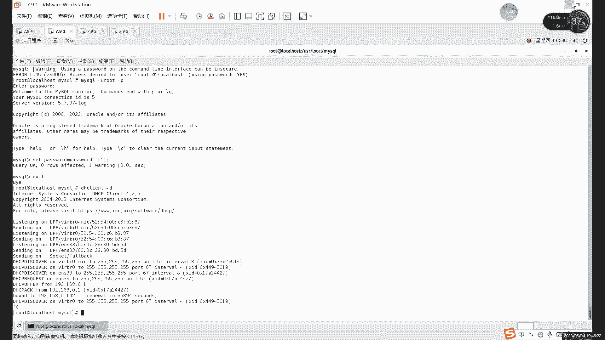

然后呢做之前的话最好是什么最好，第一的话大家记得一定要记得这一步啊，官方火墙好吧，这第一步，有四台的话，你不管是你后边不管做什么实验对吧，你恢复快照也好啊，就是不管是做什么也好，最好第一步就是什么。

第一步就是恢复快照，退不回复，就是把防火墙关了啊，如果你不按防火墙的话，这个东西怎么说呢，他总会在最关键的时候就给你报错啊，因为如果说就是这一个叫几台虚拟机之间，不连接的话。

其实关不关防火墙没什么太大影响，一旦出现了，如果说要连接了，就比如说我们的这个重复制对，一定要一定要连了，其实防火墙就给你拦截了啊，就给你拦截，然后这里的话后边两台的话，我们把这个改一下。

改一下配置文件，我看etc的卖点，现在我们把这个改成复制选项，这里我们改一下数字就行了啊，只要不一样就可以，啊把一改成二，然后重启一下就可以，其他的没什么需要修改的。

就是我们正常做组成BT下的user下logo下的MYSQL，这台，这还是没有恢复快照吗，0。25啊，这才是二，那就是三，这台的话我们就做，为什么就这台没有什么没有这个，诶这是哪台没有恢复，142143。

142这台的话是主库对吧，我们这台就是我先把名字写一下吧，不然这四台就分不清楚啊，嗯142，这台的话是同步143。

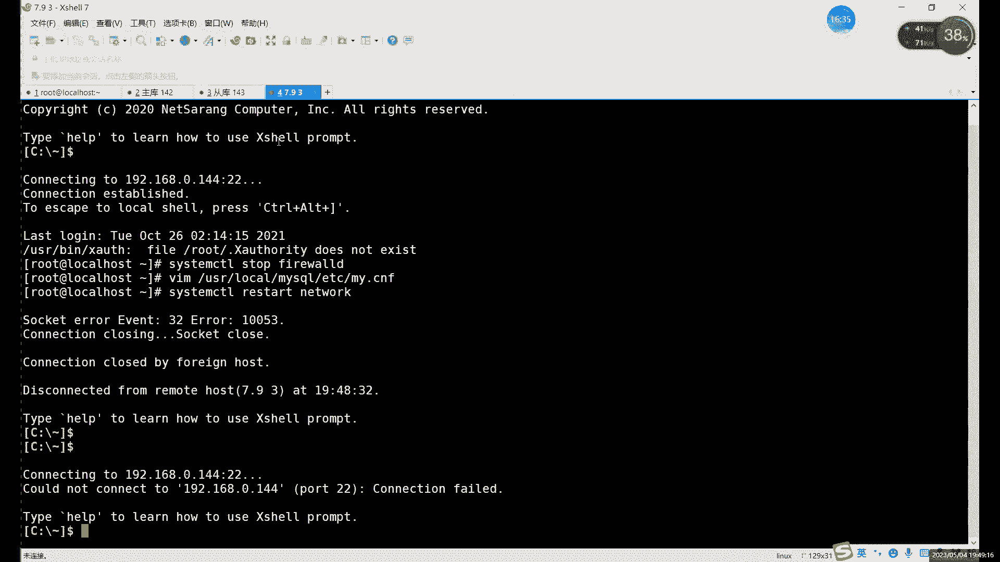

144。

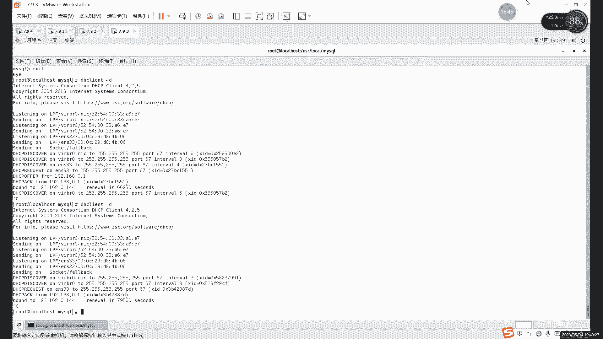

啊这台144，嗯好，关于这个我们的这个数据库的一个高可用的话，其实工具很多啊，工具是很多的，MVA只是其中一个啊，只是其中一个，这样还有什么，还有这个slip也可以用对吧。

像这个其实这个MHMYSQL的话，其实他MYSQL应该自己也是有一个这个高可用的，一个软件的啊，也是有一个高可用软件，就是这个的话就不管说你是做读写分离也好，做主从就是做这个高可用也好。

其实软件都不止一个啊，软件不止一个，具体用哪个呢，这个其实如果你能定的话，就看你习惯，如果你定不了的话，那你就只能现学看，有时候这种东西只能是这个的话，我们就用管理节点啊，NAGER啊。

这个也不一定由得你啊，这个254啊慢一点，这个我们管理节点，管理节点的话不需要装数据库啊，和我们上节课那个读写分离一样，就是代理服务器也好啊，就管理节点也好，其实都可以不用装什么都可以不用装这个。

嗯不用装这个叫什么嗯数据库啊，这只需要装什么，只需要装这个node节点和manage节点就可以了，我这里看一下这三个方向向防火墙，我们这次这台的，编辑一下，这个是二，这个要等二是吧啊。

刚才顺序有点不太对对，改个三，重建MYSQL，然后这边随便改个二吧，第一个我们就默认它是一就行啊，1t user下只要三个不一样就可以，找到我们的复制选项，就改改一下id，重启之后的话，我们直接进到哪。

直接进到数据库里面，我们直接授权就行，然后这里的授权的话，大家注意一下这里，首先我们这里的授权我们就就做全一点吧，啊不仅仅只是单单做主同的授权好吧，我们这里就就相当于是主从和这个MC，一起说了啊。

就主同需要注意的，和MC需要注意的，我们一起说，首先的话主从的授权的话，肯定就是主库允许后边两个同库访问对吧，MAC的授权的话，因为我们的控制节点在哪，在这个位置对吧啊，在这个位置它是控制节点。

在这个MAC里边的话，我们控制点需要能访问到后边的几台数据库，对吧，这个肯定能理解，你不能访问的话，肯定也不能做这个切换嘛，所以说呢说难就是manage节点，肯定要全部都能访问这些数据库，所以说授权啊。

就是所有的数据库都需要给这个，我要控制经验去授权，所以说呢其实如果大家想偷懒，那其实最简单的首先方法就是，啊grant啊啊这样搜索就行对吧，这样的话肯定出来的最简单一点啊，这样的话其实就怎么说呢。

所以所有权限包括访问权限，包括这个主从的权限都在里边对吧，就相当于一次性授权，如果你想分开授权的话，唉也不反对啊，也可以，那样的话，你得多打几条命令，如果想一条一条命令解决。

我们这MAHA里面的这个授权的话，那就是ground on，心点听啊，偷谁呢，口碑不重要对吧，因为你如果这里要写的话，其实准确来说你得写，如果分IP去写的话，你要写三个I是吧。

封IP学员你要去写三个IP，所以说这里的话我们一般就是想想简单点写，你就写对吧，root at是什么啊，加上我们这个，所有的这个相当于是允许所有访问了啊，允许所有访问，密码这里的话我看一下密码。

简单点就行了，这里的话就相当于什么，就相当于是既允许主动的主动的授权，也允许谁呢也允许我们的控制节点的授权，所以说呢这个授权呢，其实我们可以让后面两个数据库也一起执行啊，因为后面两个数据库也需要授权的。

因为控制节点需要访问到我们这个，所有的数据库啊，所以说所有数据库都需要授权啊，这是最简单的，如果说你想准确一点的话，其实就是写谁的，就写我们控制节点的IP就行了啊，就在从库里面授权的话。

就写控制节点的IP，对这就是三个什么三个授权授权之后的话，接着其实就是，Show master status，看一下怎么，看一下我们的日志的一个位置就行了，然后边两台同步，我们就直接连接啊，直接连就行。

买零二的678对吧，然后我们第一个是，Master host，192。168。0。142，是0。142的主库，然后第二个是master的user，用户是root，第三个是密码password对吧。

是我就就简单授权了个一对吧，然后第四个是master glog gfl，就是日志的名字，026百零二，零二最后一个是master glog gun position，就是位置从哪。

具体从哪个位置开始复制对吧，我们是678啊，这个位置要乘max数，然后两边库两边的这个同构是一样的啊，一会儿复制一下就行了，然后start slave，So slave status，有报错。

这个报错的话，日志名字文日志名字的文不是日志文件的名字，写错了，我看一下啊，MYSQL杠好，杠杠是中间的杠，不是下划线啊，啊如果说大家这个做主从出现了，出现报错之后的话，最好是什么。

最好是首先第一个先stop live，就是你先停掉你这个主SLAVE先停掉，停止之后呢再写一次，这个限定八次啊，这里是下划线，写在下面，应该是中间啊，中间的杠不是下划线，然后你复制一下，复制一下。

把这个杠改过来就行，刚才打的是啥来着，但是没有显示全，我们启动一下看看状态吧，我复制过来的话，在这就显示了一半啊，啊没问题，两个yes，我们在直接复制到这边啊，也一样，把这个杠改一下就行。

然后start slave啊就可以了，这两个线都验死，验证的话，我们不验证的啊，因为我们的数据数据是一样的啊，两个yes之后呢，只要你默认的数据一样，那你主动肯定是可以成功的啊，主从肯定可以成功。

然后这里的话就是一组两重啊，这下我们这个数据库这里的主从没问题了啊，但是呢先要退出来啊，就是因为我们还是主要做这个MH，就是而且MAT的配置呢不在数据库里面啊，大家注意就是mt的配置不在数据库里啊。

不在数据库里面。

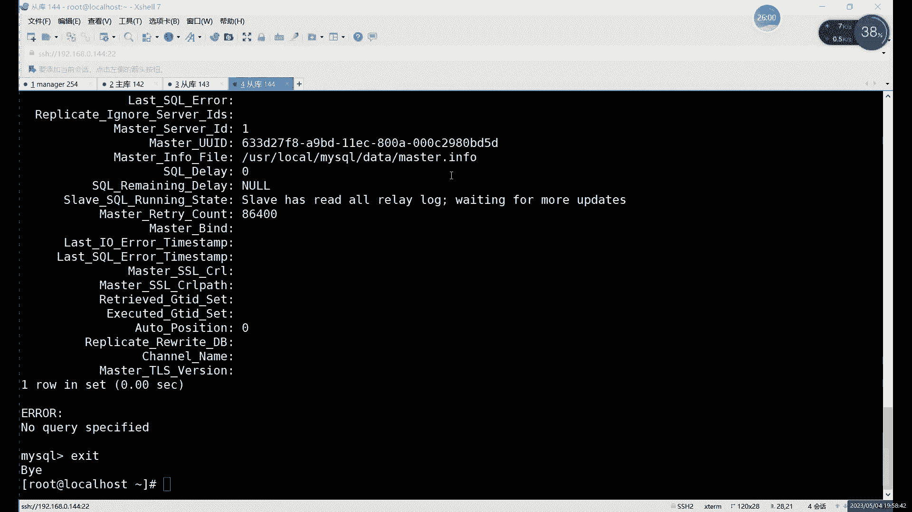

然后这里的话我们来看一下什么呢，接下来做的话，首先刚才也说了，就是每一个节点的都需要什么，都需要这个安装这个mh note这个软件啊，每一台都要装，就是不管是主库也好还是存库也好啊，都可以。

然后这里的话我们可以看一下这个，看一下软件的话嗯，软件的话可以给大家先发一下啊，这个就看到网盘上。

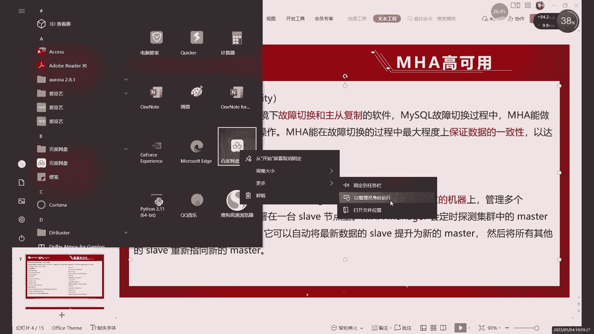

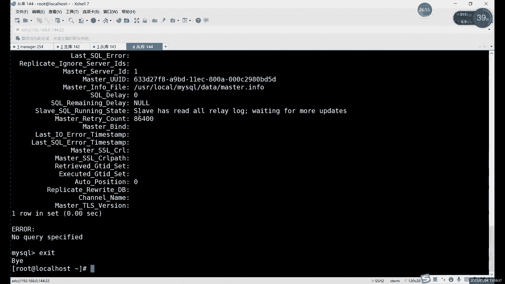

我正常做的话，你三三台分别分别都，把这个包拖拖进去就行了啊，把三台分别都拖进去就可以嗯，在，啊这两个，啊这这两个包这两个的话就是直接是rpm包。

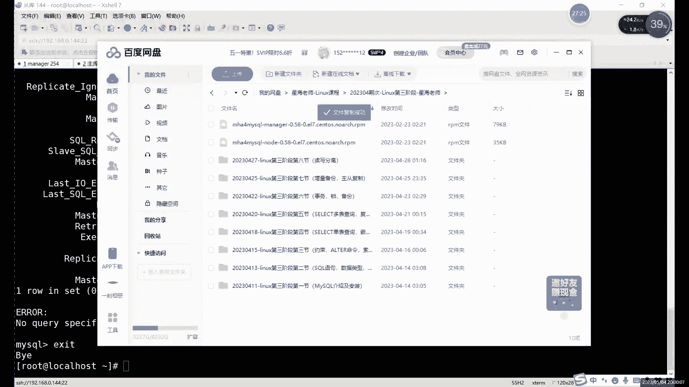

大家可以直接，但是它有几个依赖关系啊，有几个依赖关系需要我们提前装一下啊，用亚麻装一下就行了，然后这里的话你提前把这几个包拖进来就可以，一个是manager，一个是note，看清楚就行啊，两个包啊。

啊一个是manger，一个note，你如果是控制节点的话，两包都脱离就可以，如果是管理节点的话，只错一个就行啊，不是就是我们的node节点就拖一个就行，就拖这个，就说这个note就可以。

而且有这个就行了，就只装着一个包就可以，关进来之后的话，其实依赖关系的话，这个其实。

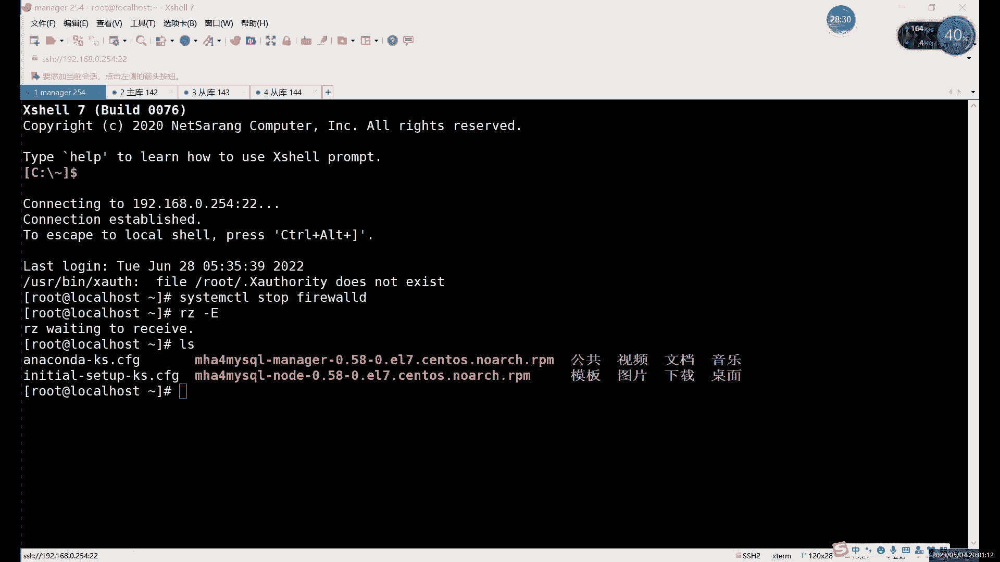

这个的笔记里面有写，大家可以直接复制一下啊，这个可以直接复制啊，依赖关系的话，在，电脑声音有点卡，打开笔记，打开笔记都稍微有点嗯，都不带动啊，在这，依赖关系的话其实包括两部分吧，啊包括两部分。

一个是note几点依赖，node节点依赖其实很少就一个啊，主要更多的其实是这个manager界面，依赖稍微多一点啊，稍微多一点，然后这里的话我们可以看一下啊，首先安装这个首先一组就主动做好之后。

你可以什么可以来装这个，什么可以来装这个node节点和major节点，安装都很简单，就是直接用RTM装这个包里，只需要提前安装一下这几个依赖关系，如果你不提前装的话，你rpm安装的时候它就会报错啊。

这也其实就是rpm安装的一个缺点吧，啊rpm安装它不会自己动解决依赖，不会自动解决依赖关系啊，需要我们手动去安装啊，用什么具体安装方式的话，其实哎你直接用亚马安装就可以啊，因为呢其实直接要么装的话。

其实这样仓库里面没谁没有的啊，样本仓库里面其实没有，啊笔记是吧，笔记我总感觉你应该是有的啊，我看你应该是有的，嗯看看笔记，方法网盘关，笔记的话找一下，啊不是，啊笔记的话也发在网盘上。

大家如果说要跟着一起做的话，可以降下来了，都很小啊，其实其实笔记要比安装包要大，大家可以看安装包就几10K，这个软件的话其实很小，因为它的功能的话只有一个，他就只是做高可用的啊，没有其他的功能。

所以说呢软件还是比较小的啊，软件还是比较小的啊，小一点的话也方便啊，也方便安装，这里的话我们首先你看先是什么，我们先安装一下这个，当然这个呢其实。

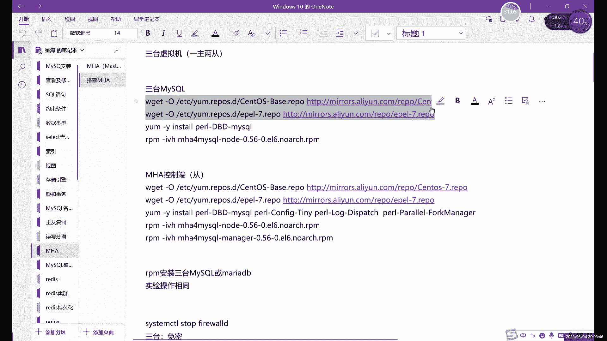

我看啊三台那就一起装一下吧，如果说你同时几台虚拟机都做同样的操作的话，可以用这个左上，用这个工具栏里面的这个发送键入到发送键啊，就是这个一起输入的意思啊，就是一起输入的意思。

这一块你一个输入的其他三台都一起跟着做了，他就一起跟着做了，嗯啊这个的话是嗯您不用一个一个去实行命令，稍微方便一点，然后这里的话装好之后呢，接下来呢NO几点四个都要装啊。

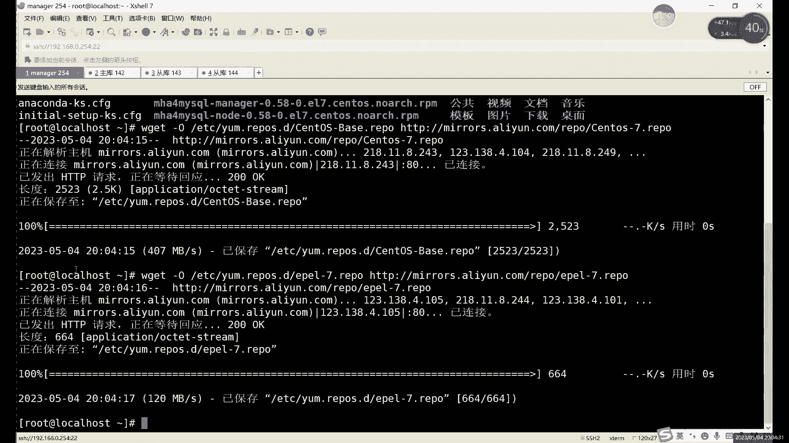

大家注意有note几点的话，四台都要装，所以说呢你就一起装就行了，有四台一起啊，不是说三台MYSQL率，因为什么，因为我们的这个manager节点的话，也需要note节点这个软件啊。

所以说一起安装就可以了，直接执行这两条命令，一个是安装note基本依赖关系。

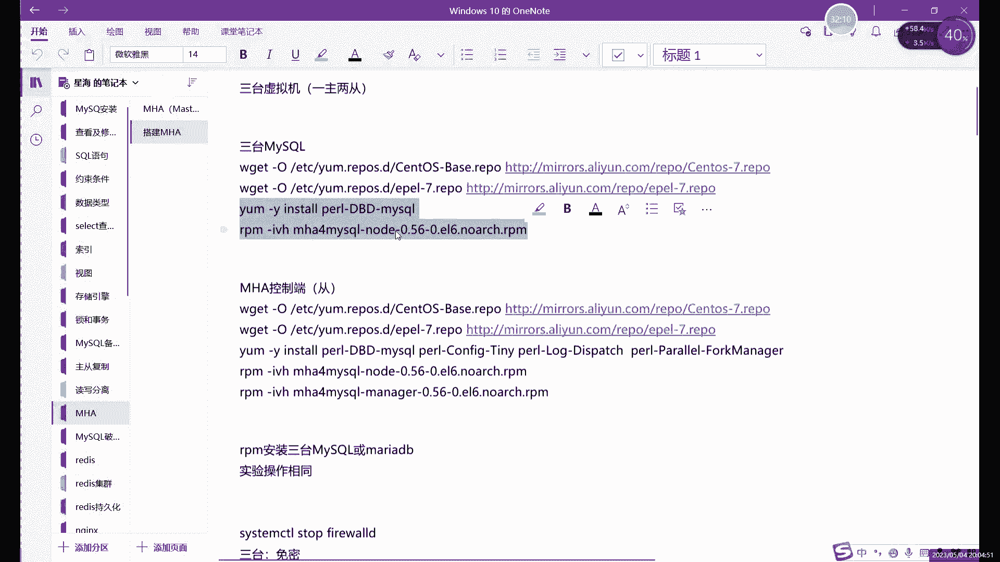

一个是用rpm包，就用rpm命令直接去装这个包就可以，感觉四台一起执行啊，节省点时间嘛啊当然呢嗯在一起装，因为这个软件包其实不是很大啊，就是液压关系也不是很大，所以说呢安装速度也很快啊，那么快。

然后呢这里的话高考用为什么我们说MHA呢，之前上节课我们不是说上节课我们不是讲的，my cat这个读写分离嘛对吧，但是我其实也说了对吧，他其实能做这个主动切换方向操作。

但是呢我们一般不会用这个my cat，这个如果发生故障的话，其实他可以做，但是它的缺点是比较大，就是呢它的这个故障故障转移啊，或者说这个故障切换的时间花的时间比较长，有可能还会出现一些像失败超时的问题。

做是可以做的，但是没有这个MC效果好，所以说呢一般情况下我们做这种高可用的话，很少用白开啊，它有这个功能，但是我们一般用的少啊，像这个MH啊，主paper这些用的稍微多一些啊，用稍微多一些。

然后这里的话就装好了，然后呢你再来个回车，确保一起都创好了，再再回车，要不然的话a rpm哦，对笔记里边的话，我那个包的这个名字是旧版本的，你这个包的话是之前那个是windows6的啊，分之六版本。

这个我们是3DOWS8倍37版本啊，啊安卓拉很快，因为这个包特别小啊，包特别小，rpm杠IVH，对这几个包不太一样啊，不是环境不太一样，我们后边几台再再执行一次，再学习一下。

啊因为这边他多了多了一个manager节点那个包，所以说呢他在打命的时候其实不太一样好吧，这个的话就已经什么就三台里边了，然后这里的话我们再关掉就行了啊，就每一台后面三台数据库的话都已经装好。

这个ma啊，已经装好成note节点，不需要什么配置啊，不需要什么配置，就只安装好就行了，接下来的话主要内容的话还是主要在前面啊，在我们的控制系列里面操作，然后接下来的话装好这个node节点之后呢。

下一步是什么，下一步是装man的节点啊，他们仨就不用管了，就只要在这里装，就行了啊，就是下面这个步骤慢性氧化。

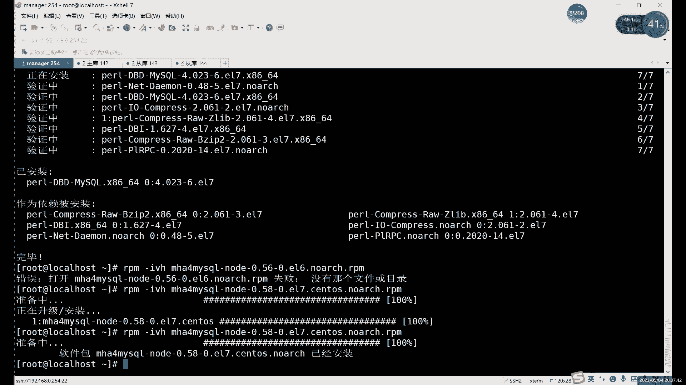

这个依赖稍微多一点啊，就直接用这个复制这个就可以了，其实也不用记啊，这些东西依赖关系，其实这种东西没必要记，然后安装好这个依赖之后呢。

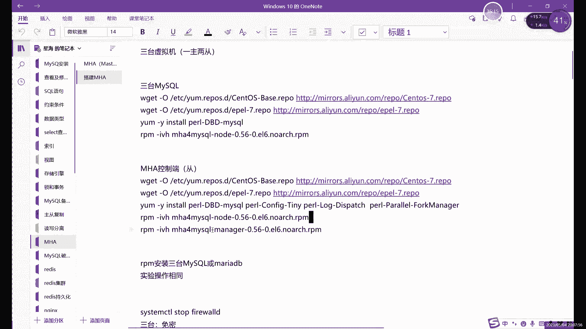

再去安装这个manner这个，再去安装mini的这个软件啊，卖软件。

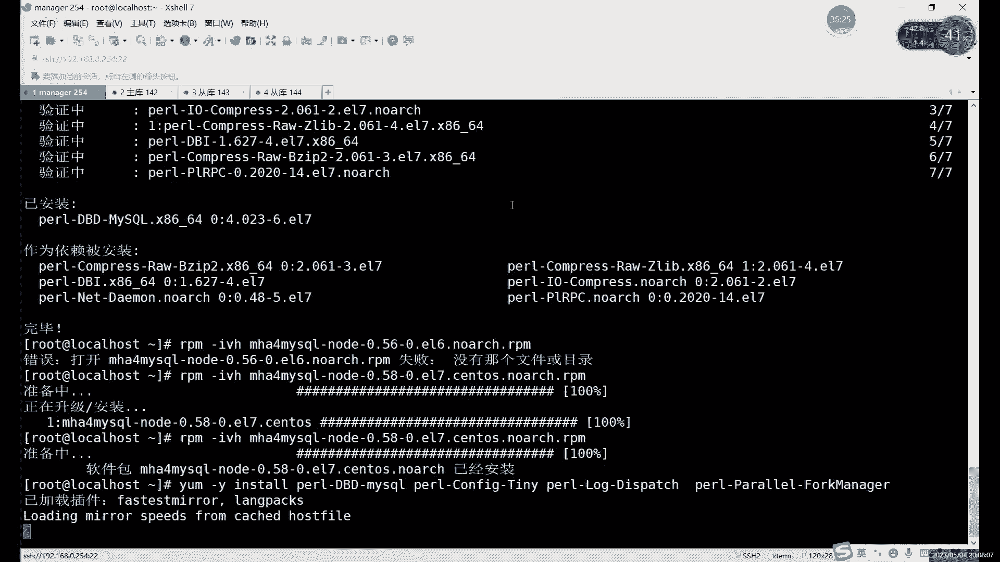

然后在它安装的过程中的话，我们再继续说一下我们的MH需要注意的地方。

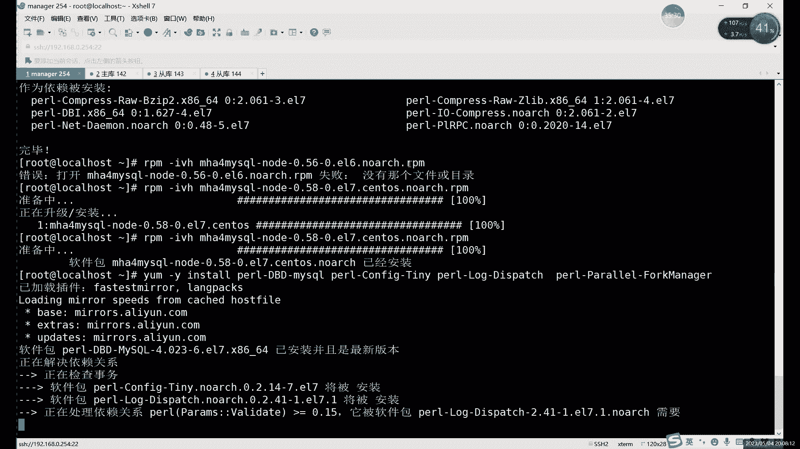

就是除了这个主同以外，就一组两同，这个是第一个就是其中一个前提条件，第二个前提条件呢，这不我们是要让我们的manager。

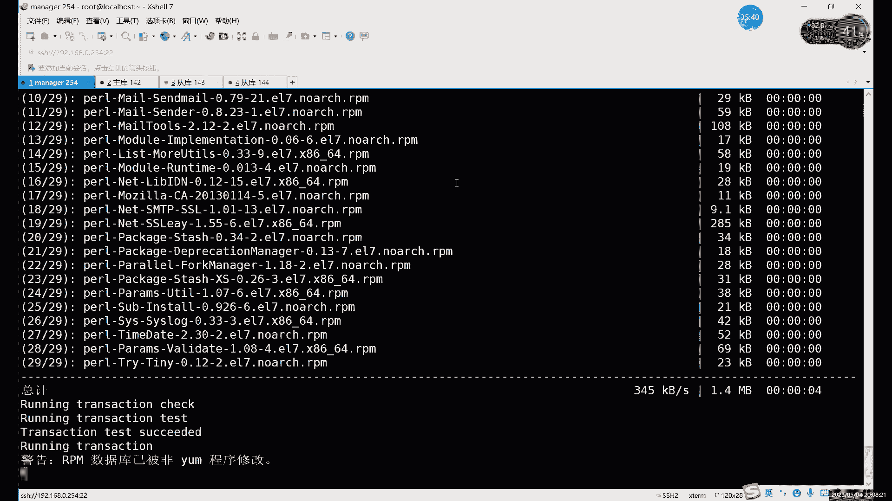

能访问到其他三排主步，哎，这上单数据库吧啊访问到其他三台数据库，对了，刚才我们做了一个什么呢，刚才其实已经做了一个授权了对吧，三台数据库都给我们的这个manager点授权了啊，都已经授过权了。

数据库层面的话也能访问了，但是呢如果要做主动的话，其实或者若要做这个图切换啊，故障切换的话，其实除了这个数据库的授权以外呢，还需要什么，还需要能正常访问，就是用SCH能连接啊，连接上就要执行命令嘛对吧。

连接执行一些自动切换的命令，所以说呢我们这里需要什么，需要这个SSH若能直接免密登录，当然现在的话你正常SSH连的话，肯定是能连的是吧，防火墙也关了，但是其实呢光保护墙也不影响SH对吧，因为你正常。

我每次不都是连着他跳之后才关防火墙吗，就是王宝强默认他不会拦截这个22端口的，但是呢这个你正常直接SSH的话，大家可以看一下，就是啊我当时我们先把这个man点先安装上，MA的manager节点啊。

先装上，装上之后的话，我们可以用S来试一下对吧，root at当92。168。0。142动，随便连一个，大家看到，首先让你输入yes，这个其实不重要对吧，输入yes嘛。

这个其实然后下一步还让你输个密码对吧，就正常的话，你想要远程登录一个这个叫什么，这个叫，远程登录它的设备，不管你训机也好啊，还是真实的物理服务器也好啊，用SSH去连接的话，还都需要让你输密码对吧啊。

就是你这个想要连接对应的用户密码，这里不一定root，你连其他用户，就是其他用户的密码对吧，这个其实就是啊你正常连的话没问题，你知道密码是可以连的，但是呢如果说出现了故障的话。

manager这边他不知道密码，对，他不知道密码怎么办呢，那这个时候需要我们今天做这个免密登录啊，免密登录它就是SH的美名，登录作用的话常简单，就是让咱们就是让我们的这台manager。

能够直接执行这条命令的时候呢，不用输密码，也不用输那些yes什么的，确认什么的，只要一输入这个命令，一回车就能连上后边这几台啊，这个的话就是需要这个也是一个嫌弃条件，就是直接用SV就可以直接连接。

不需要密码就能运登录啊，这个时候我们也是需要提前，提前配置的一个东西啊，怎么配置呢，其实四台之间免密登录其实很简单对吧啊，这个其实还是这个啊。

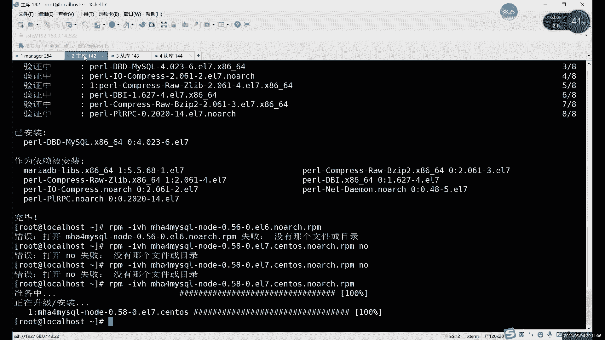

用发送键输入到所有绘画，这个其实非常快啊，其实这个其实用起来非常方便。

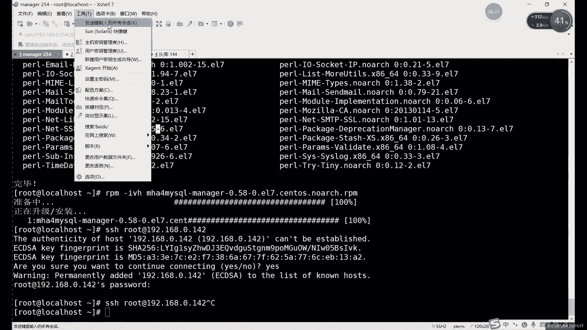

啊这输入这个之后呢，你在其中一台上打印，你相当于在四台里面全部执行了，你只需要打一次的话，其实免密就做完了对吧，明明的话其实就是SHKY杠，SHSH杠，K e y，啊对SS等于是。

直接先获取一下我们自己的一个密钥，或者说生成一下我们这个SSH的密钥，这里的话他就是写一些路径啊，配置也什么呀，其实不用管它，直接全部回收就行了，可以直接用默认的唉，可以直接用默认的这些的话。

你可以可以全部回收就行了啊，他这里就已经生成密钥了啊，已经生成密钥，然后呢直接用什么，直接用SH杠copy，直接拷贝就行了啊，拷贝到哪呢，直接拷贝到我们对应的几台，192。168。0。254啊。

第一次拷贝的时候呢，我们是需要输入这个密码的，就是你这里输入过一次之后呢，后边就不用再输密码了，你后边就话你就可以自动连接了啊，可以直接直接连接了，首先的话第一台我们要写自己啊，这里也是比较特殊的一点。

就是我们这个一定要记得写自己啊，就是做明明的时候，MC这里的话不写自己也不行啊，不写自己也不行，然后这里的话yes，然后呢写密码就行了对吧，这是一台，然后呢0。142，啊这是哎等一下啊。

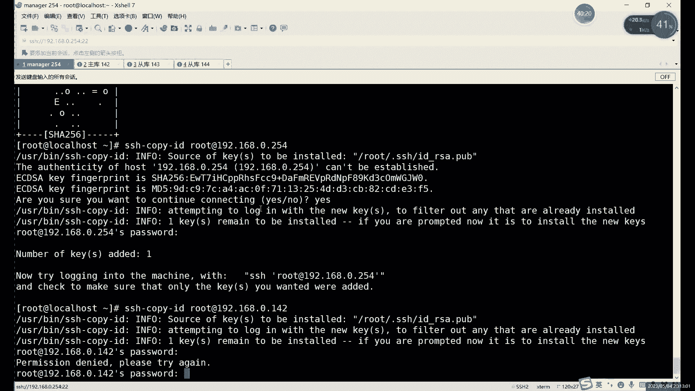

这里输入的是直接输密码对吧，大家已经输过yes。

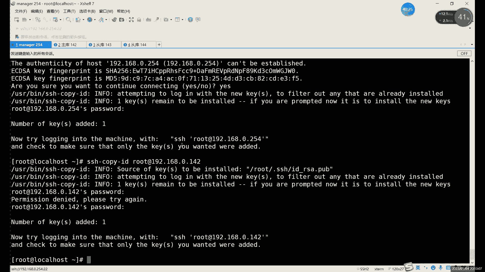

这里的话如果不想打这么多次呢。

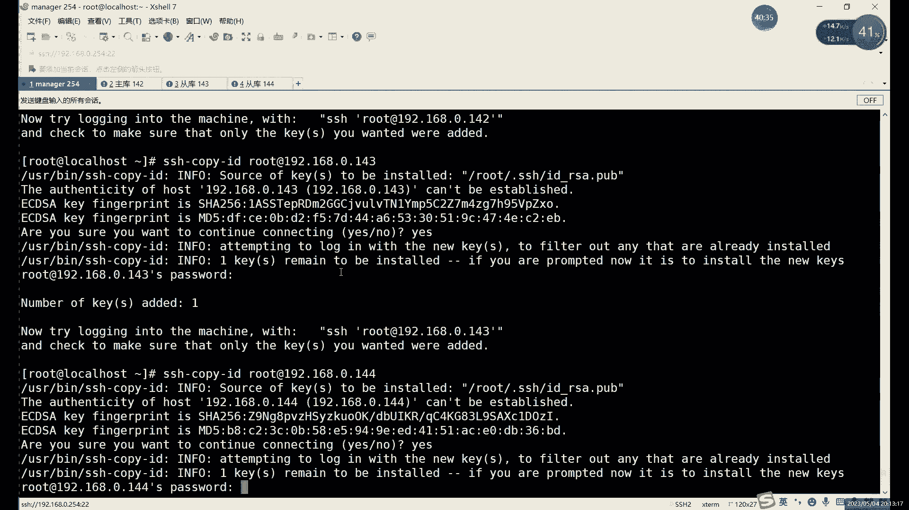

其实也可以用一个循环，但是循环的话你得确保你的密码一样才行吧，然后这里的话这个四台的话都已经做好什么，这里一台敲完的话，其实后边四台也跟着一起，后边三台也一起跟着做了。

所以说呢你只需要在一台上面写就行了，然后现在的话你验证其实很简单啊，或者说甚至你会用MH去验证，也可以来这里提前，你如果不放心的话，可以直接用s root，然后你随便写一个对吧，0。14144啊。

随便随便选一个，你会说啊就直接连上了对吧，直接连上了，验证一下的话，你就直接看一下这个网卡，1233对吧，0。144吧，这个其实就做完美名之后的话，就可以达到这种效果。

就是你ss root at什么什么的时候，就直接就这就去直接就连上了，不需要输密码，也不用输那些yes什么的，这个就是这个就是免密啊，对刚才那么做完之后呢，其实就这几台之间都可以互相连接啊。

都可以互相连接，能连上的话，这个就可以什么，就是其实主要还是确保这个卖淫者，能连上其他几台，这样的话方便执行一些命令，执行一些操作啊，连上之后的话，包括我们刚才主动已经也已经做完了。

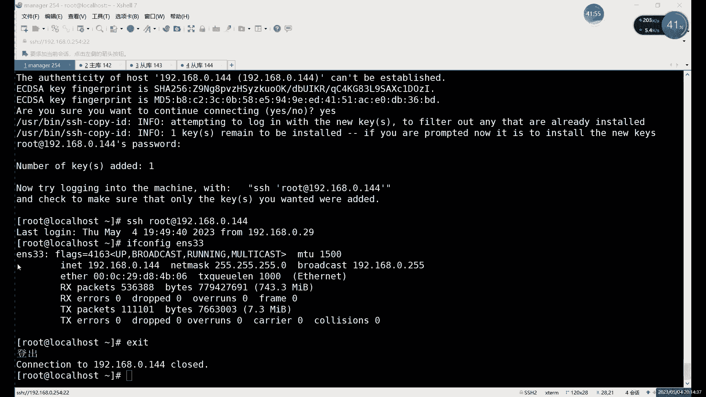

其实就是前提条件的话，基本上已经做好了，大家记得官方好强啊，这已经关掉了，免密登录就好了对吧，主从也做好了，接下来其实就什么，接下来其实就是这个关于我们的MH这个配置，MACA的话。

首先刚才我们已经装好了这个manager节点对吧好。

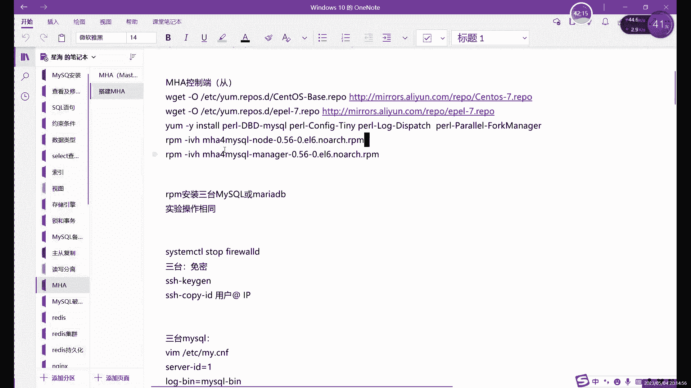

我们其实主要的配置也只需要在哪呢，只需要在这里做就行了，其他三台呢不用管了，他们只要装好客户端就行了，还有那个节点能让我们去监控就OK啊，其他的操作全部都在第一台上做，就行。

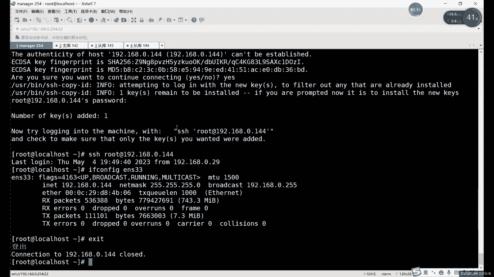

然后这个的话是什么，这个就是manager节点，这边的话我们需要做什么呢，其实就是安装好之后，主要还是直接编辑配置文件就行啊，主要的配置的话就是在配置文件里面嗯，不需要在命令行里面执行什么命令。

只要直接修改一下我们的主配置文件就行啊，主要的步骤的话就修改配置文件，然后首先的话我们第一个啊，这里的话其实它有一个默认的配置文件，当然你如果说想自己创建一个也行对吧，比如说这里按照笔记里面的话。

我们这里就是自己去创建了一个，MH的配置文件啊，随便创建一个就行，然后直接编辑里面的内容就可以，然后这里的内容主要包括什么呢，我们一会儿先复制过去吧，我们先复制到那边，我们一个一个说啊。

我们一个给你解释这边的配置文件里的内容。

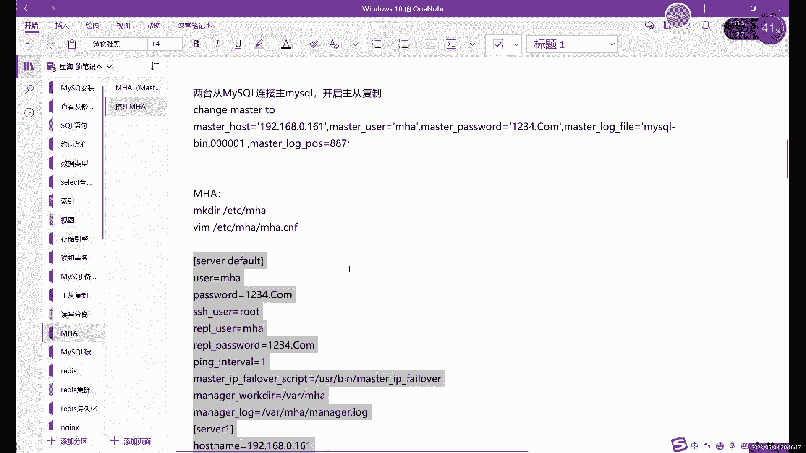

ETZ的ma随便写一起，创建一个目录就可以对吧，ETZ的MHA里面的卖点cf就啊，或者cf这些这个名字其实怎么说呢，没那么重要啊，没那么重要，然后呢把这个复制过来之后呢，名字就叫MH卖点3app。

这个一般就是MYSQL的配置文件复制过来之后，这些人的话我们都是需要改的啊，具体怎么改的，首先我们先一个一个来看啊，一个来看，这里的话其实我们涉及到了一个两个用户啊，短期的说的话。

前面不能说一个两个三个，这里应该叫三个用户啊，三个用户，首先的话这里呢这个名字的话，我们需要改一下，我们这个不叫MH啊，我们的授权用户是谁呢，我们授权用户是这个root对吧，我们授权的是root。

所以说这里我们改成root啊，大家当然也可以按照笔记里面这个用户，当然你授权的时候只要授这个用户用户就行，因为笔记里我记得这个授权的命令的话，授权就是MH用户，这句话就是你授权是哪个用户呢。

就用哪个用户的名字就可以了，然后下边授权密码啊，我们刚才的授权的话是root，密码是一，然后第三个这个的话是什么呢，第三个是SH，其实它是前面也标的很明显了对吧，SH的用户。

其实就是我们刚才做免密登录的用啊，是谁就写谁就行了，这里不需要写密码啊，为什么呢，因为我们的密码已经写过了，就在免密登录的时候，做免费的时候就已经把密码写上去了啊，所以说呢这里的话其实我们不需要加什么。

不需要加这个密码了啊，不需要加密码，啊所以说这里的话其实就是什么，这里我们直接把这个什么呢，把这个，SCH的用户写在这里就可以啊，不用写密码，然后呢接下来第三个用户呢。

r r e pl replication的缩写啊，NBK转速也就是我们主同啊，这里就是我们主同的用户，这就是主铺给重复授权的，这个其实我们刚才为了方便啊，就是我们授权全部都是用移动，所以说这里的话。

其实我们这两个相当于是一样的啊，这两个其实相当于一样，那正常的话其实这两个可以授权不同的用户啊，是可以的啊，可以授权，不用不同用户，就上面的话是数据库授权给im manager访问的。

下面这个是主从复制的用户啊，就是主从复制授权的用户，这两个用户是不一样，当然我们现在呢因为刚才的授权我们都用的root，统一用的root密码也一样，所以说我们这里就可以改成root1就行了。

如果不一样的话，注意一下这两个用户区分开啊，上面是数据库给manager的授权，而reputation的话就是主从复制之间能授权用户，啊可以是什么用户其实都可以，只要这个用户能登录啊。

就是我们在创建MYSQL这个用户的时候，其实他不让他登录啊，如果说想要让它作为登录用户的话，你得让他，你先把那个什么，把那个禁止登录那个权限给不是权限吗，就把他的那个下午改成能够正常登录的用户，就可以。

如把MYSQL改成一个普通用户就可以正常登录，现在的话其实它其实是做一个系统用户啊，知道用户随便，其实这个用户都可以，就是这里这里的话其实就是授权用户对吧，上面第一个和第三个都是全用户对吧。

中间那个是什么，中间这个是免密，就是SS是免密登录的用户，这用户是谁都无所谓啊，只要这用户能正常登录，能这样使用就可以啊，我们这里为了省事全用root啊，你可以用其他普通用户也是OK的啊。

这里因为没有什么不需要什么太多权限，所以普通用户也是也没问题啊，也没问题，然后呢下面这个ping，ping这里它是什么意思呢，啊他这个就是心跳检测的意思，心跳检测的话其实就是简单来说。

就是用来做我们的manager和note节点之间连接的啊，检测之间连接的一的话代表什么，一代表一秒那一秒的心跳，检测指的就是什么，就是一秒连接一次啊，一秒连接一次，如果说哎出现连接不连接不到的情况了啊。

就开始了嘛，就开始其他就可以开始准备什么，可以开始准备这个进行主动的切换啊，连接不到，那就可以轻易主动切换了，这个就是这个主动切换的一个啊关键的地方啊，很关键的地方，这里的话最好就设置一秒就行了啊。

不要太长，太长的话会影响什么，会影响这个切换时间的啊，这里一定要注意，如果说你是时间太长，如果你是十秒，那么可能你主库宕机之后呢，十秒之后才发现啊，这个时候其实就有机器就有点晚了，已经有点晚了。

因为你主动切换其实也是需要几秒钟的时间的，所以说的话从我们发现连不上开始对吧，到切换的话，其实最好是什么，最好就是一秒，就是你一旦一旦发现连不上了，就开始准备进行主动切换啊，切换几秒钟的话。

然后的话我们的存库才能变成一个正常，变成主库啊，所以说这里尽量就是一秒就可以啊，心跳检测一秒，然后下面这个的话就是什么，就是我们的，这个准确来说，其实就是我们这个主要切换的一个关键点。

刚才那个是时间对吧，刚才那个是检测时间，一秒连接一次，连不上呢，就开始准备进行主动切换，那谁来进行主动切换呢，那肯定不是我们呀对吧，因为它是自动的，这个就是一个切换的脚本啊，这脚本的话在笔记里面有啊。

在笔记里面有脚本比较长，我们其实需要修改的地方其实也很少啊，其实其实主要修改的地方也很少，我一会修改完这个配置文件之后的话，我们来看一下脚本啊，看一下再看一下脚本，然后这里的话我们可以来看一下这个。

这就是那个定义脚本的路径，一会的话把脚本写在这个位置就可以，这个可以随便改的，就是脚本放在哪里就写哪个位置就行，然后呢下面是工作目录，对工作目录的话，一般我们rpm安装的默认都是VRVR目录对吧。

你像如果是rpm中MYSQL其实也是VR下载live下的MYSQL，好像这里的话其实就路由器路径的话，可以随便进啊，然后这个是日志文件啊，这两个红色录制文件，这两个呢其实也没啥太大用处啊，用处不大啊。

主要的话是这两个比较关键啊，就是连接的心跳检测心跳周期吧，可以说是心跳检测的周期，以及我们这个脚本文件的位置，然后下面这个就是比较重要的信息了，就是我们的几台数据库的信息啊，你在数据库信息，最主要的话。

首先你把这三个名字都是三个IP吧，就是host name就改成你自己的IP，当然了，如果写想写主机名的话也行啊，但是我这里主机名没有改，所以说我这里就写IP了啊，你想写主机名的话也可以啊，也是可以。

那这个话就是0。11142对吧，第二台143，第三台的话是一四，啊这就是我们把IP改一下，然后下面的话S3part，这个就是S连接的端口对吧，用户的话上面我们统一指定了。

其实大家可以看就是上面这个server default，就是默认的这个server啊，就是所有的这个note节点，默认的也可以理解成列，也可以理解成一个全局配置，上面这部分的话是全局配置。

然后从这个server eco2开始呢，这其实就相当于什么，相当于这个单独的每一台，不同的数据库之间的一个配置啊，上面的话就是所有数据库有统一的对吧，你的用户的话是root对吧啊。

连接用户的话是S的话也是root，主从用户呢也是root，然后的话这个啊当然从这开始的话，其实这个这三个的话是在我们当前本地的配置，本地的这个路径啊，跟其他数据库没关系，然后呢下面这几个就是什么。

下面这几个就是，连接端口是22，通过哪个用户连呢，就通过我们这个数字用户啊，通过注册用户呢去连我们的SH，通过22端口，如果说你这个哎某一台的这个虚拟机啊，或者说是服务器啊，你这个端口啊。

S端口它不是22啊，如果不是22的话，这里需要改一下记载，但一般情况下不改的情况下，都写22就行了啊，一般也不用改，然后下面这个的话就比较重要了啊。

这master blog d i r r directory，就是我们主库的blog，什么意思，二进制日志对吧，二进制日志的一个目录，二进制之目录在哪儿呢，其实就是我们的这个数据目录对吧。

就是我们的数据目录，所以说呢这个要看你自己具体的是用哪种方式，安装以及什么呢，以及用的是，安装在哪个路径下了吧啊，因为是源码安装的对吧，还是推荐单用源码安装，所以说这个路径呢你是可以自己定的。

也不一定和我一样对吧，不一定和我一样，这种方式的话是在rpm的路径下啊，rpm装是这个路径，如果你是源码安装的话，是你要换一下路径啊，具体路径的话你就看你自己装的，如果是跟我方法一样的话。

那就是这个路径啊，user下的MYSQL下面的data目录，那这个就是放我们数据目录的，也是我们的二进制文件位置啊，就是这个目录源码安装，你可以自己定啊，不一定非要不不源码是原码，它不是死路。

一刚才这个路径才是死路径，就是rpm当中的一定是这里啊，这个没得商量，它一定是这原版安装，这个不一定啊，这得看你自己怎么装的，你可以自己换目录的，不一定非要死安装在这一个目录下。

这里为什么要写这个二进制的，二进制文件的路径，然后二进制日志路径，这个前面已经跟大家说过了对吧，二进制文件的路径，二进制文件我用的很多对吧，你看从这个备份开始到我们主从到读写分离呀，到这个MC啊。

每次每天都在用这个啊，因为它确实很重要，这里的话其实是二进制这个日志的话，其实就是记录我们数据嘛对吧，就是记录我们这个数据库里的数据，这里写的这个路径的目的其实就是为了什么呢，为了在主动切换的时候。

能让新的存库能连接到这个新的主，就是让其他的存库能连，能连接到这个新主库的，一个二进制的日式文件啊，所以写了这么路径对吧，因为我们前面讲过，主从复制的关键就在于这个二进制日志，如果没有二进制的话。

主从肯定是不成功的对吧，肯定是NO啊，肯定不可能是两个，所以说这里也是一样的啊，你得指定好你的日志文件的位置才行啊，你这让其他的同步知道你的日志文件在哪，唉知道你的二进制文件在哪。

才能正常的进行一个切换啊，这是正常切换，然后下面这两个的话就是一个额外的设置，就是我刚才说的就是在进行主动切换的时候呢，首先先考虑的是我们的配置里的内容，就是我们主库谁，主库是第一个对吧，主库是第一个。

然后呢如果是主故出现了故障对吧，现在是两个库了对吧，Server 2server3，对不对，两个重复，我这里写了两个不同的这个配置，一个是呢一个是能成为主啊，这个是能成为主，这个是不能成为主啊。

一的话表示都是嘛对吧，这就可以成为主，就可以进行这个主从的切换，就写了个一啊，不能进行主动切换，那就写NO master啊，No matter，这个就是什么，这个就是不让你进行主动切换。

那如果说啊看到这个配置文件的话，那man在切换的时候呢，就直接把什么，就把直接把第二台做成这个主户了啊，第三台的话就因为他这里写了什么，我们配置里面写了个NO matter，是不让它成为主。

那我们就可以这么它就依然还是存库，然后呢，它相当于是给这个新的主库呢作为做一个什么，做一个，因为它它依然是重复对吧，它变成主了，那就是他俩之间还要做一次主，但这个主从的话。

因为我们这里也指定了这个路径了，而且我们也允许什么，也允许每名登录了，所以说这些操作呢全部都是谁呢，都是我们的，ma帮我们去做啊，就自动做了一个重，那这个就是MC这边的一个配置啊。

我看看还需要改些什么嗯，这些的话大家主要还是注意这些IP，把IP的完成，你自己IP改啊，千万不要直接复制笔记里面的啊，我每次还要每次都得改一下，因为那个笔记是第一次啊，那个笔记是第一次做这个。

我第一次做这个主从的一个IP，因为每一次呢因为我用的是自动获取的，所以每次IP它基本上都不一样，所以我也笔记里面我也做不出一个固定的IP啊，所以说每次我视频也得改。

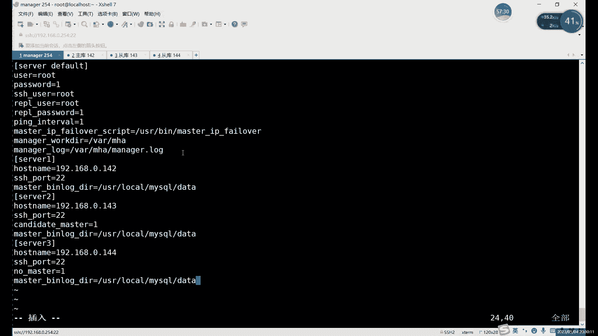

这句话你看142143144对吧。