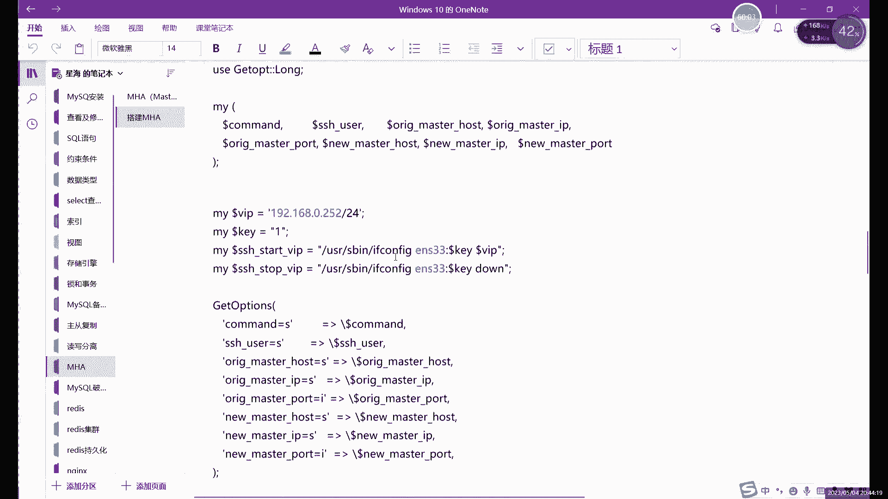
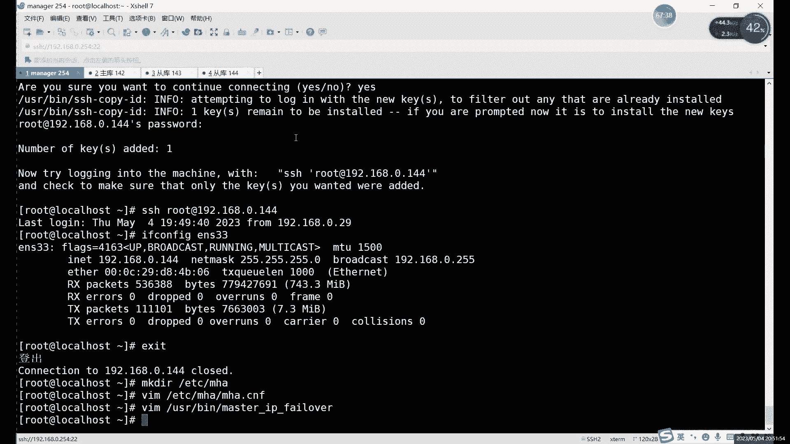
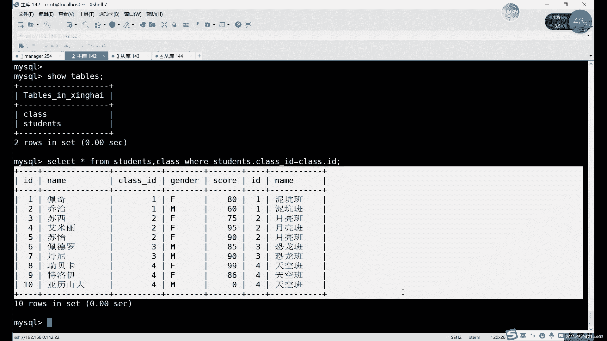

# 0基础小白怎么入门Linux运维？看这套，Linux运维全套培训课程，保姆级教学视频 - P89：中级运维-26.MHA高可用，视图-中 - 小方脸不方- - BV138411B7p5

数据库的IP啊，注意主从第一个问题就行了，然后呢这个目录的话，如果是源码安装，就源码安装就用这个就可以，想用这个就可以，剩下的没有什么太多需要改的啊，如果改完之后的话，就可以保存退出了啊。

保存退出之后呢，我们就可以进行最后两步的配置啊，进最后两步的啊，最后三步吧啊还差最后三步啊，做完这三步的话其实就可以了，就可以启动MA了啊，启动MCA，好我们接下来呢继续啊，来说一下这个MH呀。

这个文件很关键，大家这个每一步就每一行都要检查好啊，哪一个出问题了，我们后边是都都都不能继续往下啊，都不能继续进行啊，因为这个MH的运行的话，其实主要靠就是这些配置文件里面这些参数。

因为每个参数都需要用的啊，基本上都要用到像每一个MYSQL的这个IP啊对吧，IP端口号目录，以及我们这些用户名密码是每个都能用的，就这这里只要错了一个整体，我们MA的话他就连不上了。

如果说有一个数据库连不上的话，他这个环境就不算完成啊，他就没办法完成，所以说的话这里每一每一行都要检查好对吧，确定检查好没问题之后呢，我们保存退出，接下来的话还是我刚才说了，还是在三步对吧，还是那三部。

那倒数第三步是什么呢，就是我们刚才说的，我们配置文件里面有一个脚本。

就是我们进行主动切换，切换的脚本就是谁呢，就是这个这里定义的是脚本的路径啊，大家注意这里定义的脚本的路径，这个路径的话可以改啊，就是你这里如果改了的话，你脚本存放位置也就改一下啊。

这里的话这个嗯如果说你这里指定什么，直接用VM编辑就可以了啊，不用管它存不存在，不存在，就我们就创建了呗，对吧啊，不需要管它是否存在啊，然后我这个配置文件啊，或者说这个脚本的话，其实。

里面内容的话大家可以可以看一下，这个的话没必要去记啊，这个是风险，没必要去记，因为它其实是什么，他其实就用的是这个，和后边我们会讲的一个叫k live的，一个服务有关系啊。

和我们后边讲的k live服务有关，但其实和也和谁呢。

也和这个VRP有关系啊，和黑ARP协议有关，这里的话我们先首先先编辑一下这个啊，user下边目录下的，有个文件叫什么来着。

我看一下文件名字吧，文件名字叫这个master guip杠FAFA对吧。

master杠IPGSL啊，这个文件我把复制进来之后的话，我们也大家注意，也是需要改点内容的，就是上面这部分，嗯我们这里的话，其实MC的一个原理呢，其实这里这个其实就已经涉及到。

我们后面会讲的一个也是高可用的一个软件啊，它的名字叫keep live啊，原理和它是一样的，就是我们会用到一个叫虚拟IP的东西啊，虚拟IP啊，或者有的叫法也一般也有，有也有的叫什么叫漂移IP啊。

都可以啊，有虚拟IP这个IP的话，那这个IP的作用是什么呢，就是大家可以看到，就是我们如果正常你写这么一个IP的话，其实这个IP之后呢，我们在脚本里面的话会执行什么呢，会执行这个if卡。

不用if cp命令去指定一个临时的IP啊，指定一个临时IP，临时的IP的话就是我们这里订的这个虚拟IP，那个虚拟IP的作用是什么呢，啊虚拟IP zone呢其实就是，用户可以用来访问的。

就是在我们这个MJ的集群里面的话，他为什么能实现这个自动的主动切换呢，其实很简单，就是因为这个虚拟IP的作用，包括我们后边讲到的这个后面也会讲的，这个ko live的高可用也是一样的原理。

就是我们这个为什么用户，就是为什么我主库出现故障了，哎用户的访问可以不受影响呢，原因就在这里，就是对于这个用户啊，或者对于其他的服务来说啊，这里说用户其实不太恰当。

因为我们数据库肯定是不可能直接连用户的，我们的前面一定连的是什么，一定是连着其他的像web服务这些，比如说像这个NGS阿尔法奇这些啊，肯定连的连接的这些服务，这些服务去连接网数据库的时候。

它其实是一个IP是什么，他用的IP就是这个固定的IP，虽然说我们后面的数据库有三个对吧，但是呢在外边就是在外人看来，或者在其他服务看来呢，其实我们就是一个IP，或者说什么。

或者说是这个看主库来说是一个IP啊，不能说是整个数据库吧，因为整个数据库还包括从库嘛对吧，他看主库来说的话，他其实就看的是一个IP，就是永远是这个虚拟IP，这个你写写写几都可以啊，写就可以。

比如说我这里写个不要和其他几个冲突啊，嗯写个0。2252对吧，写这么一个IP就是在其他服务看来，或者可以说是在major几点看来的话，其实我们访问的这个主库呢，它的IP呢不是0。1426。

我们现在主播是0。142对吧，当然设置了你这个MH，或者设置的这个虚拟IP之后呢，对于我们其他外部来看的话，其实我们的数据库的主户IP，永远是0。252不变，那主库宕机了怎么办呢，我们进行主动切换啊。

进行主动切换切换之后呢，会在新的主库上再次创建这么一个IP，还是0。252，比如我们正常用户访问，或者其他服务器访问的话，IP不变，只不过是确实是换了个数据库啊。

但是呢我们在其他外部感觉上是没什么感觉的，就是你访问这IP呢，谈正常访问嘛对吧，还是他访问，IP没有变对吧，访问内容也是一样对吧，因为我们主要做什么做自动复制啊，做到主动复制房屋内容也一样。

就是IT没有变啊，这在外部看来的话，其实就是没有什么故障，但其实我们后台已经到了一台数据库，那这个就是主动切换的一个作用啊，就是你们你在切换的时候，你IP不能变的，大家一定要注意啊。

就是主动切换的时候呢，IP一定不能变IP，你要变了的话，其实你其他的用户也好，其他的服务也好，你是访问访问不到数据库的，但是大家一定要注意这个IP一定不能变IP，一旦变量的话，啊IP1旦变了的话。

其实像这里啊，比如说你现在啊我们正在访问数据库对吧，你外部一个连接正在访问的数据库，你看我们访问的IP是0。142对吧。

我们ISS是连接上了，连接上之后的话，你突然宕机了嗯，也就是0。142档了对吧，啊宕机之后呢肯定就连不上了对吧，连不上了，那这个时候呢你新弄了一台主库对吧，把一台重复变成了主库啊，0。143了。

但是我不知道呀对吧，你主库是修好了对吧，是暂时修好了一个主库，但是呢我不知道你的IP就没法连接，那这样的话肯定主动复制，就主动切换的话，切是切了，但是呢用户在用户看来的话，你才是失败的。

就是你这个你的这个数据库还是宕机了，那这种情况下肯定是不对的对吧，那我们需要什么。

就是不管你怎么切换，IP永远不能变啊，这个就只能靠什么，只能靠虚拟IP了，这就是虚拟IP的作用啊，这里提前给大家解释一下，因为后面我们还会用到新年期的话，其实在那个高可用里面是非常重要的。

就是基本上高可用的这个软件，都需要用到虚拟IP啊，主要是为了确保在切换的时候呢，IT是不会变的，就你不管说你后边按数据库也好啊，其他的服务也好啊，不管说宕机当了多少个，你的IP永远就是那一个。

就现在对外提供的服务，那个数据库也好啊，其他的服务器也好啊，IT的话永远是这个0。252啊，这个就是其实就很简单，它其实就是在主库上呢执行了这么一条，这个依法飞的命令，然后呢。

给这个我们对应的网卡呢赋予这个IP就行了啊，赋予这IP就可以，然后这里大家需要注意的就是你需要改什么呢，就是这个IP呢不要和你的IP冲突就行啊，不要和你的IP冲突，然后第二呢就是这里，网卡网卡。

网卡的IP的话嗯就写修改成一盘未命名的话，这个其实之前也没，之前不知道讲过没有，应该没没怎么没怎么说过吧，一行命令是可以临时指定IP的啊，指定一个临时IP啊，这个话其实只需要指定临时就可以。

不用写永久的对吧，写成永久的话还要改回来，太麻烦啊，你只要写一个临时就可以，主库修好之后的话，你就不就又没了嘛对吧，所以说只需要写一个临时P，这里的话就是把这个1233的话。

就改成你自己的那个物理网卡的名字就行了，这个的话你不同的服务器可能叫法都不一样吧，1233123432啊，还有ENO啊，ETH啊，这几种就是你的网卡，物理网卡叫什么就写什么就行了。

啊这里改完之后的话就可以保存退出IP，主要注意不要冲突就行啊，这是倒数第三步啊，倒数第三步就是我们的就能进行掉，故障切换的一个脚本啊，后边最后两步是干什么的，最后两步就是用来测试测试。

我们的MC的环境是否正常，怎么测试测试呢，用的就是我们MH的一个命令，MHA的check啊，ra reputation和check和SSH这两个命令啊，当然了，还要记得给一下这个脚本执行权限啊。

这个刚才没有给，一定要给啊，如果没有决定其行权限的话，这脚本跟没有没什么区别啊，一定要给执行权限，master杠IP there over啊，给个执行权限，转完之后呢，接下来就是测试我们的环境嘛。

我们环境其实分为两部分，一部分呢就是免密登录的环境，一部分是主动复制的环境，这两个环境的话都需要测试，都需要这个测试一下，就测试一下环境是否正常，这两个命令全部执行，没问题的，我们才能正常启动MH啊。

如果说一个其中一个有问题的话，其实我们MC没办法自己做的啊，所以一定要注意这里，首先呢我们先可以做一个简单的测试，这个免密登录对吧，因为免密登录其实我们做的话就一条，就几条命令而已。

Remaster h a，然后加什么，check s h后边加什么呢，后面大家注意啊，这个杠杠杠等于什么，就是我们刚才创建那个配置文件，他这个检测靠的是什么呢，它检具体检测些什么呢。

就是我们刚才配置文件写的那些内容，就是它需要检测的啊，这里的话我们就用什么，就用这个杠杠杠等于什么去指定一个哎，谁正去指定一个MC的这个配置文件就行了，这个你文件写文件名字是什么。

你这里就写什么就可以啊，啊这就是检测SZH的免密登录的。

如果说这个这一步出现报错的话，这个这个其实这步报错其实没什么，这个部位报错其实很好处理，它一般就会报你哪个到哪个都免密，有问题，重新做一下免密就行了啊，重新做一下，明明就可以来可以来可以来看一下。

只要没有那个error，其实就是正常的啊，没有error就可以，然后这里的话第一步的话，它其实就是只是报了一个，我们的配置文件的问题，因为没默认配置文件呢，它叫mh master ha杠default。

点CN很长对吧，我们就写了个短的，就MH点CNF，这个不影响啊，这个不影响，然后这里最后只要没有error，看到一个所有的S连接测试呢都是通过了，都是成功了啊，这说明什么，说明我的名字都会成功的。

还可以看到他们的我们测试过程，它包括测了谁呢，测142~143的，142~144的，143~142的之间，他们的每一个的测试都要都做了一下，这个连接的测试啊，都做了一下SHD。

明明的连接这个没问题之后呢，我们接下来测下一个，你如果报错的话，你就重新做一下，明明就可以进步，报错其实很好处理啊，啊大家注意一下这个就行，如果是这一步有报错啊，只要最后不是显示这个就说明肯定有错了。

你就中间看一下，它会提示是哪个IP，因为这里大家可以看到他测试的每一步，IP都写在这里，你看就测试这个OK就OK就成功了，如果说不是OK的话，那他就会报具体写哪辆啊，哪两个IP的免密有问题。

你可以去重新做一下就行了，重新做一下测试，只要通过就可以继续下一步了啊，下一步就是比较关键的一步，这一步呢怎么说呢。

可能大家可能会经常出现大部分报错的话，就是MH报错，大部分在这一步，这步为什么会报错呢，也不一定呢，不一定是大家主虫做的有问题，主从一般没什么问题对吧，其实我们主从经做了很多次了，你看第一次讲守同对吧。

后边讲的一些主虫虫啊，双主啊，以及这个毒解分离啊，还没拆啊，都用到主同了，这主从我相信大家应该应该不会再错了对吧，主动我相信大家也不会再错了，那真的这一步报错呢啊会涉及到哪个问题，就是。

这里就会涉及到一点这个关于，ma和MYSQL稍微有点就是它的文件上，也不是说这两个软件冲突是有两个依赖关系，稍微有点问题啊，有两个依赖关系稍微有点冲突，就是那个啊没2DB杠left那个。

那你不是我们之前卸载过嘛对吧，那我们之前卸载过那个依赖关系的，那这里其实是会有会出现冲突的，如果有报错的话，其实就是依赖关系的问题啊，缺少了这个MC这边缺缺的依赖关系，但是一般情况下正常的话都还好。

大家一定要注意，就是分开去装啊，分开去安装，就是虽然说呢刚才是说了，这个manage节点可以装在数据库里，但是不建议因为装在数据库里边嗯，数据库装在数据库，装在数据库里面，当然也不致命。

但是呢这个数据库的重启可能会有点问题啊，因为数据库的重启的话，之前就是大家最开始装MYSQL的时候，应该都报过那个叫重启的时候，有那个socket文件对吧，那个问题那个问题那个问题的话。

一般其实就是那个VRDB杠left没有卸载对吧，但是你卸载了之后呢啊，你这个这个家伙就装不上了啊，卸载之后呢，这个MA又装不上，所以说呢在这个文件上稍微有点冲突，但是大概可以装在一起。

装在一起的话就是数据库，你就别再想重启了，想重启数据库的话，你就要卸载这个文案，tb方lies啊，想用MA的话，你你要还要再安装回来，但是这个软件安装很简单，就几秒的事，你就这么来回是很麻烦。

所以说不太建议安装在一块这个文件上，稍微有点冲突啊，所以说呢建议大家把这个MANA几点，装在没有数据库的服务器上，不要有数据库，哪怕你装在像什么呢，你可以装在那个呃AEER。

my cat这个代理服务器上也行，不影响的，可以装在这个代理服务器的啊，就可以把这个读写分离啊，就是MH的，咱们这个这俩软件都装在一起啊，其实他俩都不需要数据库，就可以正好装在一起啊，正好装在一起。

我可以来检测一下吧，如果有报错的话，就是，啊用户，啊这里是报错是什么呢，这个报错是大家注意啊，大家如果看到这个报错呢，嗯回去需要做些什么，做些软链接嗯，因为我们前面其实正常执行MYSQL命令。

就是安装MYSQL时候其实没有做软件对吧，为什么要做呢，我们当时做了这个环境变量，做了环境变量的话，其实可以不作者链接也行，就可以直接执行令，但是呢它这里呢没有这个软链接呢，他又找不到命令。

他要找哪个命令，大家可以看它，它报的错是mysql blog，没有文件和目录，他其实是找不到这个这个命令，又找不到我们的mysql blog，他这个命令是干什么用的呢，对吧。

之前我们其实做这个备份的时候，也讲过这个命令对吧，查看我们的二进制文件的啊，因为我们这个主动切换的话，它一要涉及到要看啊，因为这个涉及到这个切换的话，其实涉及到这二进制文件了。

所以说呢我们需要这个mysql blog以及谁呢，以及MYSQL这两个命令啊，TT我看一下这个在，他报的错是0。1，0。14几张来着，啊0。143上报的错对吧，这句话其实我们可以多做几个。

发送进入到四维绘画，然后把这个关了，我们后面三台可以一起做这个，其实做一个LN杠S，然后呢user下的local下的MYSQL里面的冰录下的MYSQL，你去做所有吧啊做一下所有所有所有这个命令。

啊全部做个软链接就行了啊，搜软件就可以，然后我们再测试一下。

他这里就是少个软链接，没有软链接的话，他找不到命令，没有文件目录，其实就是找不到命令的意思，那我们再执行一下这个check replication，这个这个检测一下，主从这里主动。

这里的话其实首先第一个它是检测什么，检测的是这个组成的一个状态，第二呢其实就是检测什么呢，第二其实就是检测这个啊能否正常执行这个，当然他这部其实也包括什么，也包括那SSH的。

大家可以看这波它检测内容也比较多，那像比如说他这里连接了什么，连接了三台数据库，142143144对吧，连接上了3/3个之后呢，又看分别看了他们三个日志，然后呢下面的话检测是什么。

检测的就是REVACATION的这个设计就是主动设置，怎么设置的话，后边检测内容也比较多啊，大家啊在这里检测，最后完成的话，在这就是我们状态正常啊，检测143和144的这个主动连接啊，检测没问题了。

啊角色没问题的话，他就是个执行，怎么执行这个，最后的话它返回的信息就是OK对吧啊，返回信息就是OK的，然后这里的话最后只要返回的是MYSQLICATION。

然后health is ok就可以啊，这里主要是在安装数据库的时候，没有做这个链接的问题，嗯这个服如果正常一个服务的话，其实你做好之后呢啊，选择的话一般就是可以选择去做这个环境变量。

就是把服务写到环境变量里面，这是其中一种，另一种的话就是做这个软连接啊，其实这两种话主要的目的，就是为了能够在系统里面的任何地方去执行，我们的服务的命令，对吧啊，只要做其中一个就可以，我们当时是选。

我当时做了这个环境变量，所以说没做转链接唉，这就是这个MH这里他他不吃环境变量这一套，他要的是软链接啊，我们要做个软链接就可以啊。

最后两个都OK了对吧，这两个状态都OK了，啊算了，不找了，那个SH多少，其实这里的他其实也做了S是检测的，可以看一下他这个也做了S的减速了啊，这里的话OK就没问题啊，就可以什么可以正常启动我的MJ啊。

这个软件启动的话。

这里的步骤呢其实很简单，就是一个面积啊，这是哪儿呢，就是这个，mini呢知道在这m a h a master h a，然后manager，然后后面加上，我们后边加上这个配置文件就可以啊。

加上我们配置文件就可以启动我们的服务啊。

启动服务我们现在可以来看一下这个。

比如现在呢我们来看一下我们这个IP是吧，看下IP的配置吧，大家可以看到我们在做检测的时候呢，它其实就已经提前给我们买，还做了一个什么呢，你给我提前买好这个IP了，大家看到这个IP没有。

这个就是我们刚才在我们的那个脚本里面，指定的IP啊，刚才在我们检测时候，他其实已经用这个脚本啊，用脚本去检测了。

0。252对吧，他已经把这个IP写在这了，然后大家可以看到其他后面两台吧。

看看后面两台，后台就正常是自己IP的吧，0。143，这个是144，没有其他多余IP对吧，就是主库这里多了一个，那这个就是我们这个主从切换或者故障切换的，一个关键的地方，就是虚拟IP。

也就是说我们其实用户让用户，如果说你做了这个虚拟IP的话，用户访问呢，你就不要不要去设置这个真实IP去访问了，因为什么，因为如果出现了故障，你访问这是IP的话，就访问不到了对吧。

但是呢如果说你设置成这个虚拟IP，就是让用户访问的始终是访问虚拟IP的话，但目前现在访问6。252访问的其实是谁呢，他真正的IP其实是142，这才对吧，就是主控没问题对吧，如果这出现了故障。

那么我这个虚拟IP呢这台断开连接之后呢，我们这个manager节点呢会把这个虚拟IP给去掉，如何把虚拟给关掉，然后呢在新的主库上再执行一次ECV命令，再创建一下这个虚拟IP，创建在新的主库上。

然后呢用户呢依然连的还是0。252对吧，还是0。20。252，但其实已经换了一台最后了，但是那不重要对吧，但用户看来的话，IP始终是一样的，最多最多的就是可能会出现一点卡顿，其实也不至于因为什么呢。

因为其实你正常访问的话，除非就是你正在执行命令啊，正在跑命令，你断了一下，那个时候可能会出现一点反应，如果说你正在正在连接上没有执行命令的话，其实你是没有任何感觉的啊，其实是没什么感觉的。

啊这个就是什么，这就是我们过量切换这里的一个关键点，就是这个虚拟IP用户也好，其他服务也好，连接的都是由虚拟IP啊，他不会直接连连，是神IP，因为连上智能IP当然也可以对吧，连接智能IP当然可以用。

但是呢如果说出现故障了，你即使完成了主动的切换，切到了0。14310台对吧，那你呢你对于用户来说，或者对于其他服务来说，你这都得让他们去换一个访问的IP对吧，这其实就麻烦了哎对吧。

所以说这个就是这个就是我们的国，这故障相关的一个主要作用，也就是虚拟IP的一个作用，就是让在用户看来或者在其他服务看来呢，数据库的IP永远是不变的，就是那个零点就是数据库主库的IP永远不变，都是零点哎。

零点这个140。252对吧，那这个就是虚拟IP的一个作用。

然后现在的话我们可以启动一下这个，我们的MAC这个软服务啊，启动这个服务。

停服务之后呢，大家可以看到它这里就会报这个信息，就是啊，首先他读取了这个配置文件里面，默认的一些配置对吧，就是从这ETCR的，就是我们指定是哪个文件，它就会从哪个文件里读取啊。

然后上面第一行这里的话其实就是啊，如果说这个全局的配置，这个是它默认的一个配置文件，没字太长，所以说当然你如果想用这个文件夹也可以啊，也是可以的，然后这里的话我们看一下这个，嗯读取配置之后呢。

它这里大家注意啊，那他这里其实就相当于，它是一个占用终端的状态啊，他就占用了这个终端了，当然这里的话你其实也可以嘛，你可以挂后台运行对吧，这个其实都可以啊，都可以这样放在前，放在前面的话。

我们其实可以随时能看到一些消息，就比如说我一会做主动切换的时候，我们可以在正好可以盯着这里看消息啊，可以看这个MH的消息，我们这里就不挂后台了，就让他在前台运行好吧，就让他在前台运行。

而这里的话我们正常主从现在是没问题的对吧，主动没问题啊，我们可以可以稍微验证一下啊，之前做好之后没有验证啊对吧，比如说我们看一下有哪些库吧，现在，是吧，没有库对吧，没有库就创建一个，创建好库之后呢。

受DPABC，对吧，这边已经同步到了，这边呢啊也没问题对吧，他数据库都同步到了，那么接下来干什么呢，接下来的话其实就可以什么可以模拟故障啊，可以模拟故障，现在正常，我们主同是正常的对吧。

然后呢这个manager其实也也启动了啊，他一直在这里运行对吧，服务正在运行，千万不要打断啊，这你如果看出来打断的话，就服务器暂时断开，断开到它就起不到监控的作用啊。

所以说这里这里的话一定要让它正常启动啊，正常启动，让他先启动着，我们这里呢可以看一些什么呢啊，比如说呢我现在就可以把其中一台，就主要还是装关主库吧，关主库我们先退出数据库吧。

先因为我们一会儿要看这个关于IP的问题，直到现在它是主库对吧，我们进行主动切换，它其实就是当它发生故障的时候呢，后面重复怎么去处理，哎，怎么去解决，我们现在呢直接把这个模拟的话。

我们直接就模拟它关掉就行啊，你你当然也可以，什么可以直接把虚拟机关了也行啊，也可以都是一样的效果啊，把虚拟关机管理也好啊，把数据库管理也好，都是能起到这个七个模拟故障的效果的，这里比如说我们把这个。

把数据库给它关掉啊，把这个数据关掉，关掉之后呢，我们就可以我们哎不是白word的东西，我关一下MYSQL啊，然后呢我们这里一关的话，我们直接就来看到这边来看一下它的一个消息，好吧，我们直接回车。

然后切到这边来看，大家可以看到往那边一关。

它这里就是什么，它这里开始什么连接不到了，你把他这里报了一个什么呢，他就直接就断开了啊，断开了，然后呢连接了谁呢，唉这里的IP它没什么细节呀。

我们这里可以来直接看这边吧，直接看这个，衣服CONFIG命令对吧，虚拟还可以，已经过了大概也就几秒时间嘛，在这边断开的话，就显示这些信息的话，其实就基本不到五秒吧对吧，不到五秒的时间就已经完全切换啊。

已经完成切换了，现在正常访问的话，比如说我们访问谁呢，比如说访问一个访问我的主库吧，MYSQL干又是杠P1访问谁呢，192。168。0。252吧，是可以直接访问，然后受DTABASES，是吧。

可以正常访问啊，这就是我们这个就是我们现在主播，也就是我们这个0。252呢，其实你不管说原来是在这台上对吧，刚才的我们主库没关之前呢，他的IP在这关了之后呢，我们这边基本上五秒之内。

基本上就完成了转换对吧，主动切换基本上就切到这边了对吧，切到这边之后呢，你看就是IP就直接过来，虚拟IP直接就放到他这，然后这边的话我们就可以了嘛，还依然可以通过这个虚拟IP来连接轮廓。

然后我们可以再看一个比我先退出来啊，NXIT看一个静态，我们本地这台144个IP吧，百度杠u root杠P123带一啊，老说一就行，然后呢我们可以连一下MYSQL，哎不对，你们说什么呢，我们不看数据啊。

数据肯定是同步的好吧，我们看那什么吧，我们看，那叫志同，对吧，之前我们主同事对他俩都是连他的，包括我们都可以在这台上也看一下，哎比如说你show slave s t a t u s，没有了空了啊。

大家注意啊，这里我们show slave stirs，它这里就空了，为什么空了呢，因为它现在呢已经不是什么了，已经不是重复了啊，大家注意，如果说你是，如果你执行了stop slave命令的话，就关闭指。

从之后呢它其实就不是重复了，不是重复的话，它也就是会显示空值，会显示空值在我们这里的，其实这个空值呢，接受什么，其实就是他现在其实已经是什么，已经作为一个主库存在啊，他现在其实已经作为一个主库存在。

所以说现在呢如果说我们想看一下这个人呢，看一下这个主动状态的话，我们得从第二台上看144，给大家去看，我们执行一下，翻到上面对吧，那error这里没有报错了啊，没有报错，我们方向上面两个yes。

就主动状态正常，然后大家看我们这个上面前信息吧，详细信息，master host就是我们主库的IP0。143，这个IP代表什么呢，这个IP它继续对吧，就不用我多说了嘛，主库现在就是他了啊。

他现在就是主库啊，你现在其实我们已经正常完成一个主动切换。

非常快对吧，我们什么都没有干，我们就是关了它之后就几秒钟哎。

他这里就进程结束了，为什么进程结束了，因为其他服务就是已经有一台出现故障了，我们完成切换之后呢，没办法继续进行这个MAHA了，为什么呢，因为刚才说了，MH的这个至少要求是一株两层对吧，一组两重。

我们断掉一台之后呢，他这个ma就已经结束了，就是他这个服务已经挂掉了，这是他最后完成了一次切换之后，就相当于完成了他的使命，完成他的使命之后就已经挂了啊，因为现在主从已经不完整了，就是那一组一组了。

但他最后他是完成主动切换之后。

还是把自己关掉的啊，他最后是把自己给关了，因为一主一从他是没办法做这个题的啊，相当于没办法做的，可以共存啊，主从读写分离，我刚才不是说了吗，你可以把这个MC装到哪了，装到这个那个像my cat也好啊。

MIER也好啊，这些这个读写分离的代理服务器上啊，可以装在他们上面，这样的话能节省一台，能节省一个什么，节省一个服务器对吧，节省一个服务器，如果说把这个MC装，就是MANA装一个服务器对吧啊。

或者状态虚拟机里面，如果那个那个叫什么来着，读写分离，那个代理服务器也再装一台，那有点浪费啊，不管你服务器也好还是迅捷也好，都是有点浪费的，因为他们的着重就是一个是啊转发请求对吧，一个转发请求。

一个是做了一个，一个普通的一个故障切换对吧，尤其像这个故障切换，如果说主库不发生故障啊，你这个故障切换实际上一点用都没有对吧，它其实就是完全他就是开了一个进程，就开了一个小小的进程而已。

它不会占用太多资源，所以说呢，你可以把可以把这俩服务都装在一块哎，装在一台上啊，这在一台上是没问题的，然后这里的话我们可以看一下，正常的话，比如说我们在这台上执行一个。

再创建一个create data vs，X1S啊，我随便写一个，我们这边再来看受database对吧，他又创建了一个啊，这边主动是没问题的啊，这边主动是正常的啊，这个就是什么。

这就是我们的MH的一个故障，切换的速度很快啊，一般介绍里面是吧，0~30秒对吧，这这个0~30秒他也不会到30万，一般刚才我说十秒，他他就有点长了，刚才其实我们差不多五秒，五秒之内他就已经完成切换啊。

五秒就完成切换了，所以说这个其实啊非常快啊非常快。

大家一定要注意啊，就是大家在做的时候呢，注意这个注意这边的问题啊，啊然后这里的话其实这个MC已经挂掉了啊，你暂时现在的话MC已经没用了啊，现在的话这个服务已经暂时已经不能用了啊，只是暂时不能用了。

对工程的话就是读写分离和故障切换，就都有了吧，啊都有了，然后如果说共存的话，大家注意一个，就是那个我们读写分离里边不是指经过那个叫，主库和从库对吧，主库从库我们都指定IP了对吧，如果说要做这个嗯。

要做这两个的话，一定要注意，就是读写分离的那个主库IP要写成什么。

大家知道吗啊，你不能写142，也不能写14314就行，你得写谁呢，你得写0。252，你得写这个这个叫，虚拟IP，因为它才是真正主库的一个IP，因为如果说你发生故障的话，原有的主库的IP是访问不到的。

你也就是你读写分离也就也就废了，如果说你读写分类里面写这个IP的话，你写这个气已经废了对吧，所以说一定要写这个虚拟IP，虚拟IP的，然后具体IP之后呢，你读写分离的话，其实相当于主库还在对吧。

主卧还依然能访问到诶，从库也能访问到，那你这个集训正常还可以正常运转，一旦你这个虚压虚线，就是你这个读写分离里面IP1旦写成真实IP，就主库IP啊，从库你当然写真实就可以。

主库这里一定要写这个虚拟IP啊，注意这个就行，不然你切换的话，不然你这个做主，做这个故障切换也没什么意义啊，没什么意义，这个的话是什么，这就是我们的MC这里啊，这里的话如果说它重新启动。

就是我们主动重新启动，它能不能正常加入加入加入集群呢，不行啊，MAHA没这个功能啊，MC得我们手动去操作啊，MH没这个功能，就是你正常加入金之后，因为现在的MH已经挂掉了，这个服务已经挂了啊。

因为这个服务呢服务运行这个服务运行的环境，它的要求是什么要求，我刚才说了，就是一组两重正常运行，两个测试，就SSC测试和主控测试都OK才能运行这个服务，就是你如果挂了一台的话，你修好之后呢。

你这个服务暂时还不能用，你再去改一下配置文件，得重新再改一遍配置文件才行啊，这个当然是它的一个缺点，优点是优点就是切换时升切换速度确实快啊，切换速度确实快。

啊这个的话就是我们的这个ma这里的问题啊，A这类问题。

然后呢这个，这里的话其实我们刚才是用了。

刚才说的是这个IP，这个叫虚拟IP对吧，这个我们后面还会还会说到啊，这个虚拟IP呢很重要，就是所有的高可用服务都会用的，包括我们后边会讲到那些网站对吧，web服务像NTX应该也都多少都听说过对吧。

NGX像NGX也好，阿帕奇也好，这些的话，其实只要是服务呢，其实都会涉及到这个关于单点故障的问题啊，除非你这个业务不太重要对吧，除非业务不重要，那就不说了，只要是业务是真正的跑业务啊，是是挣钱的业务。

花钱是挣钱的业务，其实都是比较重要的对吧，挣钱的业务都很重要，都需要什么，都需要考虑单点故障的，如果只是一些宣传作用的话，其实就无所谓了，宣传作用的话，你不挣钱的这个不直接挣钱的这个业务的话。

其实单点故障呢，其实也没必要让外服务器做这个预防，单点故障，一般一般预防单点故障其实就是在关键地方，像这个，网站上面对吧，像网站里面比较好，还有像这个数据库里也好啊，在关键业务上的话。

其实都需要考虑单点故障的问题，嗯这里的话后面我们还会说这个像ko live，也就是MH就和MH是一样的嗯，用的是一样的，用的是一样的原理吧，其实都用的是这个VRP原理啊，VRRP的原理。

这其实如果是大家如果学过这个，网络那边的课程的话，其实也知道VRP，只要和它其实是一样啊，和mt其实是类似的，类似的一个原理啊，啊对这里肯定是需要手动同步数据，为什么呢，因为这个大家可以看。

就是如果你这条这条这台主库挂掉之后呢，他成为了新的主库对吧，他还要正常跑数据对吧，跑业务他这边写入了一些新的数据之后的啊，这边也跟着一起同步对吧，他两个数据是正常的，他如果修好之后重新加进来的话。

他数据肯定是少很多的对吧，数据少很多的话，它就暂时肯定是不能做主播了啊，他最多还是他也是需要什么需要，你重新做一下，这个就是也相当于是最好是同步一下数据，就用这个导入导出的方式同步数据。

主从同步数据已经是已经可能来不及了，为什么呢，因为如果说涉及到唉，如果说有一些新的表格，或者说有一些新的库的话，做主从是同步不了的啊，主从同步大家注意，就是它的前提就是，第一就是尽量保持数据的一致啊。

最最起码也要保证我们的数据库啊，表格啊，这些基本的东西都要都要一样一致才行，如果说这里在故障期间呢，这里如果说但凡创建了一个新的表格啊，插入了一个创建的创建库的，一般不会啊。

但是如果说创建了一个新的表格的话，这个新的表格你单纯做主从你是无法同步的，因为它这里本身没有那个表格的信息啊，这个也就是我们之前最开始讲主从的时候，就从一个前提条件，就是原始数据要相同。

所以说这里的话你重新加入进来的，这个确实只能整，就是手动的导入导出，啊这个的话其实，如果说他作为一个新的重复来讲的话，其实呢问题也不会很大，其实也不需要不需要一定要停这个对吧。

我们的那个什么MYSQLDP，大家还记得mysql dump，我们导出的命令，这个命令零我们用的其实就是什么，我们用的其实就是热备份的方式，对我们用的热备份的方式，其实主要就是主要主动复制。

他主要考虑的还是这个表格的问题啊，主要考虑的还是表格的问题，就是，如果说业务重要的话，你会主这个重复还真不能停啊，最多只能是通过认备份的方式呢，把这个啊如果是出现了一些新的表格的话。

把表格备份过去之后呢，至少是能同步数据，就是只要表格和这个数据库一致的话，基本上还是能正常同步数据，正常同步数据其实还是可以的，但是呢这个刚挂掉的这个存库呢，就是暂时不能作为新的这个主库了。

因为它里面数据肯定是没有什么，没有这个这边正常的一个完整的啊，没有这边数据那么完整的，所以说呢，一般情况下呢，如果说这个新出现故障的一个主库，一般我们就不会暂时就只能将它作为重复来用。

就暂时只能作为重复来用，啊这个的话就是这个就是我们这个，MH这边的内容，MAC这下边的话，我们接下来呢MYSQL这边还剩下什么。

还剩下一个叫还有一个内容，就是MH之后的视图啊，还有一个内容是视图啊，这个视图的话嗯怎么说呢，这个是一个比较，也是MYSQL里面一个比较好用的功能吧，一个比较好用的功能，这个视图呢其实简单来说呢。

就是一个快捷方式啊，不是类似于快捷方式的功能吧，它其实和快捷方式也不一样啊，不完全一样啊，就是类似于快捷方式，它其中有一个功能其实是和快捷方式一样啊，不能说所有的都一样啊，不能说所有的都一样。

这里的话我们这个视图的话，视图的这个特点的话，就是首先，视图呢你可以看成一个什么，看成一个虚拟的表格吧，啊还有就这个表格，这里这个是MYSQL视图呢，其实本质上其实就是一个SQL语句，更准确来说的话。

其实主要还是select语句，试图在这个MYSQL里面其实就是两个功能吧，一个功能就是作为快捷方式来用嗯，视图的一般用在什么地方，就比如说像这个一些比较长的一些，查询的语句吧。

啊它更多的主要还是跟这个select语一起用啊，其实这个视图的其实就是简单来说，就是个sweat语句，或者说是可以说是给SELLY，就做了一个快捷方式了，因为像我们之前不知道大家记不记，之前查询的时候。

SY语句之前我们讲查询的时候呢，包括这个，你多表查询也好对吧，像这个嵌套查询也好，就当是一条长与机呢，基本上一两行不一定能写完对吧，一两行真不一定能写完，就如果是出现了这种比较长的这种slide。

距离呢啊而且如果说还比较经常经常要用，那这种情况下，一般就是我们需要用到这个视图啊，就比如说你每次那么长的语句啊，你不管说你找去复制也好啊，还是手敲也好，其实都比较浪费时间，要复制的话。

你还得要找到找到这个视图，具体用哪条命令，不找到这个，你要看这个东西具体用哪条命令，你还要去找对吧，不如什么，不如就是创建一个，就给一个比较长的，比如说两行三行的一个select语句。

创建一个快捷方式啊，每次想用的时候，直接使用这个快捷方式就可以啊，这是这个是视图的一个主要作用，然后视图的话，它其实就是可以看成一个虚拟的表格啊，可以看成虚拟的表格，类似于什么呢，就类似于这个。

像这里嗯新建一个表其实有点什么，如果说你这个表格里面数据特别多的情况下呢，其实新建仪表有点浪费空间啊，我们这个视图的话，它不太基本上不，基本上不占用我们的存储空间啊，它就占用一点点。

它就占用一个定义快捷方式的一个空间，它不它不是真正的数据，就是视图的话，他不是真的数据，就比如说像这个，像这个我们的数据库里面有这个表格吗，其实没有，其实没有这个表格，这个其实都不算，这是什么表格对吧。

但是我们看起来正常，我们执行命令的话对吧，它其实就是什么，就是一个以表格的形式来显示嘛，我现在的话我看一下。

我把之前那两个，把之前那两个我们用C表再找一下吧，找一下那两个表，看你俩表在哪来着，啊在这，对就这两个表，我这里再重新插入一下，因为我回复快照了，之前的数据没了。

边走还报错了。

看一下这个报错。

rpm杠NVERAGE。

啊啊TM杠一。

马思维活动，一般这个报错就是你想看到这个，如果报错里面有这个关于MDB的话，你把这个Mac dB就刚lab文件删一下就行啊，正常启动之后的话，我们进到数据库里，我们把这两个表格在创建一下啊。

创建一。

啊它的作用的话，其实就是类似保存一个查询结果啊，他的其实作用就是保存一个查询结果，当然这个查询结构的它不一定是它不是，它不是固定的啊，它不是固定，它只是保存了个查询语句啊，保存结果这个说法其实不准确。

它是保存了一个语句，就是如果说你数据里面发生了变化，那你这个视图或者你的快捷方式呢，也会跟着一起变啊，也会跟着一起变，看一下create啊，大家可以下课休息几分钟，这里约会回来的话，继续来说一下这个。

视图的内容啊，Create database mysql，哎不对，是不是已经有了，啊我刚才已经创建了是吧。

啊其实也串联一个，两个其实都可以啊。

你主要就是演示一下这个视图的一个作用啊，演示一下视图的一个作用。

那现在这两个表格我们一会儿来看一下啊，一会具体来看一下，我们这两个表格创建好之后呢，我们接下来呢就具体来看一下这个视图啊，首先的话我们先随便查找一个算随便查一个吧，嗯就，简单查一下。

像selection from，嗯嗯这样查的话也行啊，就这样查吧啊，Slash from student，自动加上class，我们两个表一起啊，两个表一起，class的。

看这个名字叫students里面那个叫class杠id对吧，cos表格里面就是点id啊，就这这两个相等，我们随便先查一下对吧，比如说呢我们就把这个就拿这个表格来说，这个表格呢啊或者这个结果吧。

我们这结果它是一个表格的形式来显示对吧，这个没问题，对不对啊，它有一个表格的结果结果来显示。

但其实我们数据库里面是没有这个表格的，它只是从我们这个students表格和class，两个表格里边啊，相当于把这两个表格的东西啊，内容过滤了一下啊，或者说呢加了一个我们加了个限制条件。

我们重新过滤了一下，产生了这么一个新的结果，而这个结果呢，我们其实数据库里面没有这个表啊，我们这只是一个查询结果，那视图的作用呢其实就是用来保存这个结果，当然了，他并不是来保存这个表格的这些内容。

它保存的是这个东西，就是保存的是我们查询这个语句，也就是我们这个跟表格里面数据无关，就是你表格里面再添加其他的同学信息啊，再添加新的班级啊，不影响，就是它会跟着我们原表的数据的改变而改变啊。

这也是视图一个特点，其实就相当于什么，相当于一个软链接嘛，快捷方式对吧，那就是你的原来内容怎么变呢，我们内容也跟么变，那这个快捷方式的好处就是你的这个sly语句，其实越长，它越有优势对吧。

其实我们这里也很短对吧，这就是大行而已，就这么短的一个语句，比如说我们可以把它写成什么，写成一个嗯，比如说我们随便起个名字吧，啊随便起个名字，比如让他叫什么，比如让他叫这个，起个什么名字好呢。

最后还是简单点对吧，反正起太长了也不太好G对吧，比如说create啊，v i e w view呢就是试图的意思啊，will就是视图的单词啊，create table和create table。

create view是一样的对吧，但是创建视图的时候呢不太一样，就是创建命令不太一样，创建视图，比如说我们创建一个看下这个内容的话，我们就学生信息嘛对吧，学生信息，学生信息，信息info对吧。

创建一个就叫他student inf，就是简单拼拼了两个学生信息嘛对吧，学生信息，学生信息表对吧，As i，后面我们加的就是定义这个具体的这个select语句，唉这就是什么，这就是最简单的视图的用法。

就是将一个自带语句呢做做一个快捷方式，快捷方式的名字就叫student info，当然这里写的也比较长，你如果说详细短一点学也可以，这个没有什么太多限制啊，没什么太多限制对吧。

这就是创建了一个创建了一个最简单的视图，那创建好这个视图之后呢，则视图怎么去使用啊，怎么用呢，你刚创建好没有用啊对吧，你具体你得用对吧，你得用这个快捷方式，快捷方式怎么用呢。

就是直接把它作为一个表格来用啊，就是你创建好之后呢，它就类似于什么类似于一个表格了啊，类似于一个表格，比如说呢我们现在直接回车回车好，id冲突了啊，不能直接不能创建，直接创建还不对。

为什么不能直接创建呢，因为我们这里唉这个重复的这个名字还比较多，D冲突了对吧，D冲突了，大家可以看看，你为什么不能创建呢，因为它和一个基本表格其实是一样的特性，就是你看我们这IDID冲突了。

内容内容充足。

