# 0基础小白怎么入门Linux运维？看这套，Linux运维全套培训课程，保姆级教学视频 - P90：中级运维-27.MHA高可用，视图-下 - 小方脸不方- - BV138411B7p5

字段的名字有点麻烦，那我们换一个换一个语句吧，我们换一个，比如说，student排个序，或者说是三个组什么的对吧，其实都行，嗯比如说id，性别，啊黑边等于F的同学对吧，然后排个序，啊随便排一个。

用成绩排序吧，对我就随便写个语句啊，随便写个语句，这样的话我们就简单给几位同学排了个序对吧，这位同学简单排了个序，那大家注意创建视图的时候呢，不要让这个视图里面的这个所有的列呢，名字有冲突就行。

比如说我们这里还是就就student，As select，我就把刚才那个复制一下，啊这还是创建成功了啊，这个我们这一个这一块的话，其实这个表它也是不存在的对吧，它也并不存在于我们数据库里。

它只是我们数据的一个排列组合，然后用了order by的一个排列组合，但是呢我们创建了这个视图之后呢，我们其实就可以用什么select from这样来看啊，你创建好视图，其实就是刚才为什么说了。

你这个sly语句越长，视图越有优势的，就是你你后边不管说你有做好两行，三行的SLG语句，我们这里其实一个视图的名字就可以解决，就是我们只要创建好视图之后呢，不管你后边的内容有多么长。

我们直接select in from，加上14的名字，你就可以看出，我们这个你想要这个表格的一个啊，或者说你想要这个过滤的信息对吧，这个表格呢我们不存在，这个表格是不存在的。

其实我们使用这个slash from student的时候，它其实就是它其实是调用了我，数据库当中的什么呢，调用数据库当中的这个还是又再次，因为我们数据库里面那存的是什么存的。

就是这个语句可能就是我们视图的创建信息，你调用这个视图的名字的时候，它就会相当于在执行一次这个SELLY语句啊，对于数据库来说是没什么区别啊，甚至还多了一步啊，但是我们对于我们来说查询的话更方便一些啊。

尤其是查了一些比较长的啊，比较常用的，而且是四代语句比较长的一些，你就可以什么给他起个别名对吧，相当于给起给这个这个结果，相当于是给他起了个别名啊，或者说呢就是给我们查询用select。

查询出的一个表格的内容起了一个别名啊，这个就是视图的一个最主要的作用对吧，就是一个快捷方式的作用好，当然刚才说了快捷方式，它记录的只是这个select语句啊，他并不记录这个数据内容啊，也就是什么。

也就是数据在变的时候，就是如果说我们啊表格里面数据变了，那么视图它也会跟着变，比如我们来给大家看一下，我们这个视图里面过滤条件是F和成绩对吧，比如我这里再插入一条insert条件to。

那我们这ID123456789十十一对吧，11然后是名字，然后是班级id，啊搬家一数字123，性别的话啊，如果说要显示出来的话，还得用F啊，还是得用F啊，最后的成绩比如说写个100啊。

我们可以插入这么一条数据，查询之后呢，我们再来select from student，来看一下对吧，新插入的数据就显示出来了，也就是它呢它不是保存这个数，结果它是保存这个语句啊，这个应该还好理解。

因为我们创建的时候，他就是用这个create you，然后加上as哎，根据这个语句来创建的这么一个视图，所以说呢它保存的其实是语句，跟数据无关，就哪怕你把这个表格，就把这个。

如果你把四个字的表格数据全删了的话，那他查询结果就变成空值了，也是一样的一个意思，就是你删除呢也会跟着删，增加的话也是跟着会跟着增加的，这个也就是快捷方式嘛啊快捷方式软链接啊。

软链接嘛就是你原源文件怎么变，那我们链接文件呢也就跟着怎么编呗，啊原文件删除了，链接文件也就失效了对吧，那这个就是啊它就和软链接有类似，然后呢它的但是它和表格真正的表格又不一样，对吧啊。

具体有哪些区别呢，我简单说一下啊，简单一下说一下这些区别，你看它其实怎么说呢，你看其实我执行这个语句啊，如果我不说他是个，如果说我不说他是一个视图的话，其实你看起来他就是个表格，对吧啊，没问题。

他就是个表格啊，这个其实但是它和普通的表格还是有区别的，就是表面上看来的话，它其实看起来就是一个啊，看起来就是个表格，甚至我们show tables也可以看到它，啊show tables也能看到的。

但是呢它其实里边他其实其实没数据啊，它里边其实真正的他没有什么数据，说tables的话显准确显示信息的，就是说完视图了，他其实显示的信息主要就是包括表格加上视图，两部分内容都会显示啊。

两部分内容都会显示，然后这里的话，我们可以来看一下它俩的一个区别啊，就看一下这个表啊和我们的视图的区别啊，表和视图的区别，比如说呢我看一下大家直接看下面这部分啊，还是先看下面这部分视图和表的区别。

首先的话视图呢它其实就算是一张虚拟表格啊，虚拟表格它不直接存数据，它就是一个查询语句啊，就select语句，有些说的话就是一个sly语句的一个，当然是给四大语起了个别名吗，刚才也说了，这是这是第一对吧。

第二呢就是纯数计算是基本表，就是我们的，就是这个应该说是视图的原表格是吧，刚才我们原表格是谁呢，原来是students对吧，我们刚才插入数据线，也是在students里面插的，真正存数据的是原表格啊。

正在存数据的是原表格啊，视图的话它其实不存储数据啊，视图是不存放数据的，这是一个需要注意的点啊，你不要说他是用flag语句，能看到一些东西对吧啊，能看得到一些东西，但其实它里面其实没有数据啊。

然后呢接下来我们看一下这个第三点对吧，视图呢是可以把什么，它其实是可以把多张表内容结合在一起的，就像我们刚才刚才其实是一个意外啊，刚才其实是个意外，主要是什么呢。

主要是这个class表格那两个那个名字啊，有点别扭，如果说想弄两个表格的话，看下我把这两个名字改一下也行，嗯C就能C吧，Alter table，我们可以用alt命令去改一下什么的，改一下那个。

啊起个原名也行，或者把原表格名字也改一下，可以这两种方法都行啊，都可以用，比如说呢用如果用alt命令的话，其实就是alt table加上class，我直接用change吧。

change改一下这个列的名字，change我们把那个，你叫什么来着，那名字叫2D对吧，Id，id后边我们加上这个，谁杠ID吧啊，C杠D，再等一下刚才那两个。

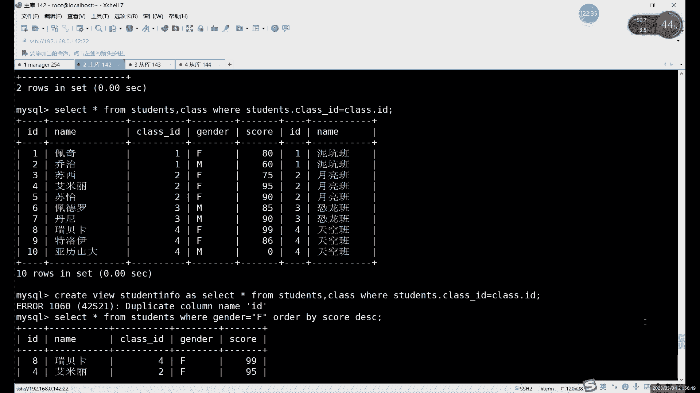

原来数据类型应该就是看看数据类型的。

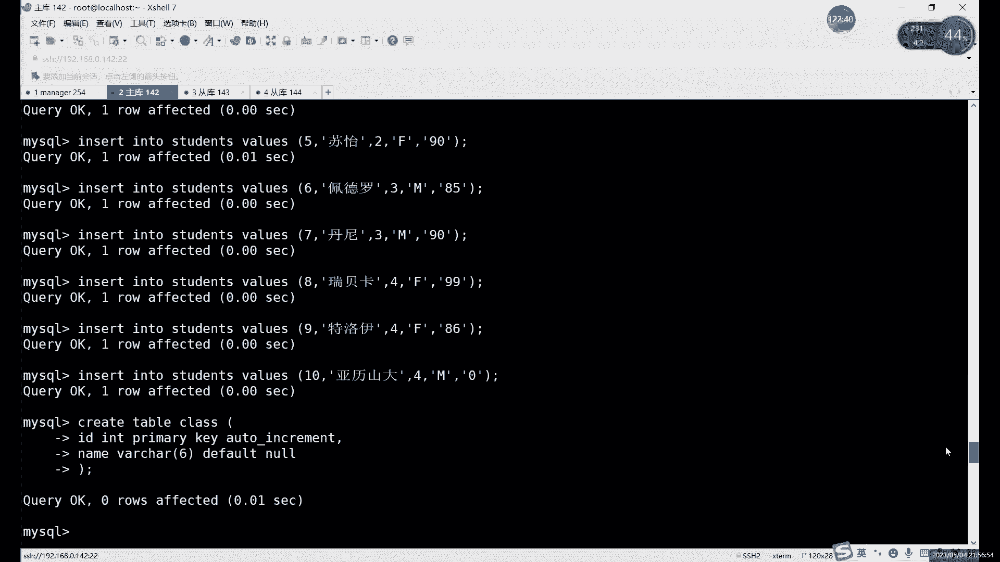

IDINT啊，有自增约束是吧，自尊的话倒也无所谓，其实我们也用不到这IDINT和，name v r c h a r吧，啊那就这个吧，I dt，还有一个是内膜。

alter table加上我们表格名字是class，啊autumn拿错了ALTER，alter命令，然后再把name改一下也行，name改成这个，改成CD，啊改完之后其实就可以正常一起用了。

比如说我们还执行一下上面那个select from from啊，执行这个命令，呃class点C杠啊，就这样这样名字不一样的话，就可以直接创建的对吧，你看这里的话其实是什么。

这个我们是把两个表格的内容合在一起的，对吧啊，这个也是势头的一个优势啊，就在它可以在相当于是把一个两个表格的内容，或者三甚至三个表格内容呢合在一起啊，作为一个新的表格啊。

就可以把多余表格里面的内容过滤出来，作为一个新的表格，这也是视图的一个功能吧，优势啊，就比如说我们可以看一下啊，Create with you，加上就比如说这student。

student info有点长了，长长就长点吧，As，对吧。

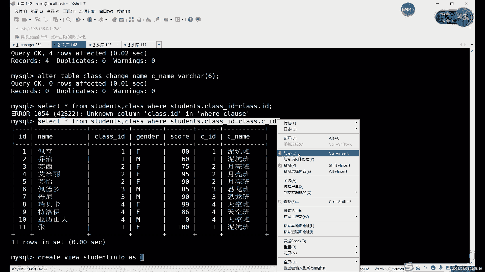

这相当于是把两个表格就合成一个表格啊，这也是视图的一个优势，select啊，正常我们想看这两个表格的一起信息，一起看这两个表格信息的时候，就selecting from，用负号就行了。

但我这里名字起的稍微有点长，可以再短一点啊，可以再短一点啊，这样就可以了对吧，这也是视图的一个优势，就是把多个表格内容合在一起，然后把多个表格内容合在一起，啊这也是视图的一个特点啊。

基本表肯定是做不到的，因为基本表一个就是一个对吧，你想同时看的话，那就得多表查询了，对我们其实这个视图就可以，把多表查询的一些语句，是因为多表查询一般都比较长啊，一般其实多少长音都比较长的语句啊。

其实查的东西再简单，因为你涉及到两个表了，一些限制条件啊什么的，加起来的话就比较长，所以说你可以设置成什么，设置成一个视图来看，唉就比较方便一些，然后呢接下来接下来的话还有这个啊。

这关键的问题就是视图的一个缺点啊，就是这个约束的问题，基本表我们是有约束的对吧，那视图它没有视图呢，它只是简单的记录一下，我们这个查询出来的数据啊，不是记录查询数，就简单记录一下我们这个语句。

他不会真正的去记录这个，哎我们原表格的一些这个约束啊对吧，像一些这个数据类型啊，啊数据类型大家肯定这肯定是有的，他不会记录一些像约束啊这个索引啊，那些复杂的消息啊，复杂的内容啊，这个是是。

就是这个就是我们这个视图的一个缺点，但是它主要内容或者主要工作他本来就是什么，本来就是记一下这些常用的一些唉，是常用的，像那个啊常用的一些查询结果嘛对吧，所以说呢这个其实没有呢，也不影响啊。

不影响什么太太多这个内容啊，这个就是图的一个，视图这边的一个和表格的一个区别吧，啊和这个区别，然后呢它的虽然说视图呢我刚才说了，他虽然说只是记录一个语句对吧，但是它也是占磁盘存储的啊，它也是占磁盘存储。

表格的话我们占的是表结构对吧，表数据这些视图的话我们占用的是什么，就是定义语句，就是定语句的话是个很短的吧，就一条语句，但是你多少还要占点空间啊，多少还是占的空间的，但是要比一个正常表格啊。

要占的空间要少很多了啊，要比一个正常空间少很多，然后这个是这个是一个问题啊，这是一个问题，然后呢下边这个你看啊，这里试图基本表对吧，怎么存储，然后呢接下来的话这个是比较重要的一问题。

就是视图的创建和删除的话，是不会影响到基本表的对吧，你快捷方式你管不管怎么变，那你不会影响到什么，不会影响到原表格对吧啊，不会影响到原数据，然后呢，基本表的数据修改呢会影响到这个视图对吧。

刚才我们已经演示过了对吧，你我们在刚才在这个表格里面，插入一条新的数据对吧，插入一个新的张三的数据，我们的视图里面还立刻就收到了啊，收到之后呢，我们就可以正常显示对吧，因为其实我们查那就试图查找它。

查找的还是原表格，所以说原表格是只要数据变了嗯，和这个视图里面相关的它就会变，如果说你这里插了插一条是什么，插一条这个性别是M的对吧，因为我们的视图的话，性别等于是F限制是F对吧。

如果你插入一条M的数据，会不会影响到视图呢啊他其实不会影响到视图，那因为视图里边我们这个有限制条件，那就是L是性别是F的才能显示对吧，你添加那个M的，是不会对视图进行造成影响的啊。

不会到试图带着太阳影响，但其实呢表格是已经变了，只不过查找的时候呢，哎没有这个消息啊，没有这个消息，然后呢最后一条哎，最后一条的话可能理解上就可能，啊可能是大家不一定能直接理解。

就是这个对于视图的增删改查会同步到基本表，啊这个其实就是什么，这个其实就是嗯一个双向的同步吧，这个视图的话其实嗯它不仅仅是基本表的修改，会影响到视图，就是如果说对视图进行了这个，增删改的操作的话。

也会影响到基本表的，这个视图的话，因为视图呢大家一定要注意啊，就是试图它是怎么来的对吧，视图的数据全部是基本表来的，你如果说你要对这个视图进行增删改查的话，它在实质上哎，在根本上他修改的还是什么呢。

它修改的还是这个基本表，就你改视图对吧，等你改视图是改视图，其实改视图的时候呢，因为视图里面数据全部都是试图自己没有数据，你一旦要进行这个insert啊，GDELETE这些操作的时候呢。

它其实改的还是谁呢，它其实改的还是这个积分表，啊它改的还是基本表，所以说这个的话其实啊，可能大家这个的话就怎么说呢，就，给大家演示一下吧，那还要演示一下，其实就能明白，就是增删改查呢。

因为他试图本身没有数据啊，视图它本身没有数据，所以说呢你增删改查他改的根本就不是视图啊，你可以对视图进行这个insert updbt命令，但是呢改完之后呢，怎么说呢，跟视图其实一点关系都没有啊。

跟视图没什么关系，主要是什么，主要就是针对于这个，比如说insert into哎，我看一下啊，比如说呢我们像改这个student这个吧，inserting to啊，student value啊。

我们这里有哪几个数据看一下啊，还是id name，Class，Id，性别和成绩对吧，如果添加一个像，十一十二从12开始的对吧，从12开始的12，呃第二个是名字对吧，第二个是名字，第三个是什么来着啊。

Class id，这还是F吧，因为不是F的话，视图你看不到对吧，不是F10都看不到，然后下一个是最后一个是成绩，这个我们是插入了谁，我们向向视图里面插入啊，我没有插入students。

students表格，students表格，这个是原表在哪，在这儿它是原表对吧，我们的视图名字是这个啊，这个我们视图的名字，你看正常插入没问题啊，他也没报错对吧，正常的话也是跟我们正常执行插入命令。

是一样的，返回结果啊，有一行添加了一行信息啊，添加了一行信息内容，然后我们可以看一下这个select信号from student，对吧啊，加进来了十一十二对吧，刚才差不多是12对，没问题对吧，没问题。

可以正常插入，然后呢我们再来看一下students这里，对吧，12也过来了，原因其实很简单，就是我刚才说的那句话，就是你只要知道视图是个什么玩意儿就行了，视图呢它是个虚的东西，虚拟的东西，它没有数据。

它只是一个命，所以说呢对视图的操作，其实还是归根到底还是修改的人是谁呢，修改的还是我们的原表格啊，修改的是原表格，你看像这里看我们插入的是视图，没问题对吧，是视图插入之后呢，其实还是在原表格里写了啊。

还是在原表格里写，因为视图它10%是没有没有数据的，视图是10%没有数据，啊这个就是什么，这个就是我们的这个，啊这个就是我们这个视图的这个特点啊，视图这个特点，嗯总体上来说的话，它其实嗯看起来正常的话。

如果你不执行具体的一个查看命令，只是简单的show tables啊，或者说用slave命令来查看，其实没什么差别对吧，哪怕你是用DESC来看的，其实也是，比如说我们DEC看看一下这个student对吧。

这个是我们正常看表格结构的对吧，这个是我们的students原表格，那视图呢，你正常来看呢，其实也正常对吧，其实就是你不对比原表，其实你看不出来区别对吧，区别就是在这儿就试图呢。

它不能他没有那些约束什么的啊，不是说约束吧，就是不能说约束，就是不能有这个像主键啊，啊不能有这些这个索引吧，可以说是索引啊，或者说是一些特殊的约束啊，非空这个可以有啊，只除了飞空以外呢。

其他的他这边没有，没有办法那个什么没有办法这个复制啊，就他呢其实因为它就是个虚拟表格，它它其实连表结构呢，这个其实就可以说它是可以勉强说，它是是它的表结构啊，但其实实际上呢其实也不能完全说是啊。

不能完全百分百十四，然后比如说我们这里来看一下这个，那正常我们看视图怎么看呢，啊我们用寿命令啊，说明你去看DISC的话，这个它不太具体，他只说只能看一下这些约束什么的，从约束上呢。

其实你说这样写一个表格可以写，这样写一个表格可以啊。

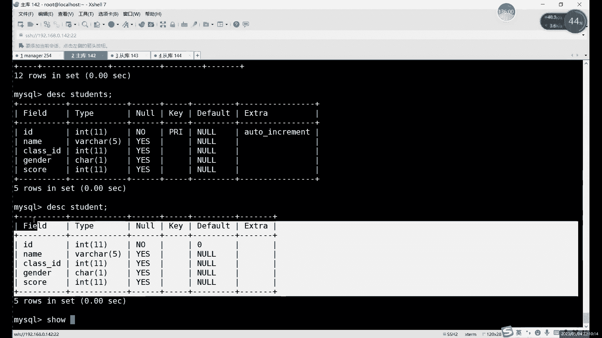

可以写这样的表格对吧，所以说你这样呢不能判断它是视图，正常我们判断视图的方式是什么呢，就是这个寿命啊，那show tables也没用，show tables它看起来和表格也是一样的。

所以正常判断一个视图是否为视图，有一个表格是否为视图的一个方法呢，就是用查看show加上什么呢，tables app加table status，啊用用show table来看看。

正常一个show table的话，其实我们student啊，students students吧对吧，students的话，这个是我们的原表格，你看你看有正常的引擎啊对吧，有正常的一些时间啊。

字符集啊等等这些内容啊，他是有信息的啊，如果说换成什么，换成我们的这个图的话，我们可以看一下，其实分别是不是非常简单，你一回车就出了，完事啊，只要你用show tables看啊，什么内容都没有。

那它就是什么呢，那他就是试图啊，他在最终最后的描述这里，他自己也写到了啊，他就是个视图，这叫什么，这个就是分辨视图的方法，我们正常的命令他是看不出视图的啊，必须得用什么。

必须得用我们这个受show table，然后scissors like这个命令来看啊，这个就是看视图的一个分辨视图的方法啊，分辨视图的方法，呃总体上来说呢，这个视图的话其实，管理上的话。

其实删除就是创建的话create对吧啊，删除就是job，那修改啊，修改这个命令，可还是用这个什么还是用alt也是一样的，和我们这张表格是一样的，就是create alter和job3个命令对吧。

就是你这张表格怎么改，你试图怎么改就行了，就是他呢其实和表格很像，只是一一它没有数据二呢，他也没有这些，像这些表格的一些最正常的一些格式是吧，这个是视图的一个特点啊，因为它只是简单的保存一个链接啊。

它只是简单保存链接的，还是，嗯然后这里的话这个，视图的话它其实因为他在表格里面，它其实是没有什么，他没有这个实质上的一个，你比如说我看这里退出看一下吧，iOS user下logo。

下载MYSQL里面的data目录CD吧，CD过去，CD到我们的目录下，我们看一下，大家可以看到我们就是其实就是没有数据啊，他其实没有数，你看class f2M和IVD对吧。

students这里FMMVD，你看这两个视图，那就只有什么，只有F2M啊，他就只有F2，就他就只有一个定义的这个，嗯只有一个定义的文件，而是结构文件啊，他就只有一个结构文件。

也就是你在导出这个视图的数据的时候呢，其实嗯怎么说呢，和正常导出其实也其实也一样啊，就是和正常导出表格其实是一样的，就是它是没有数据的，大家注意他是没有数据的。

恢复的方法的话其实就是嗯可以重新create啊，恢复制度可以重新create，或者说呢嗯正常导入导出，正常导入其实也可以的啊，正常导入也可以，然后这个的话就是视图的一些特点。

然后试图除了这个快捷方式以外，它还有自己的一些特殊的用法啊。

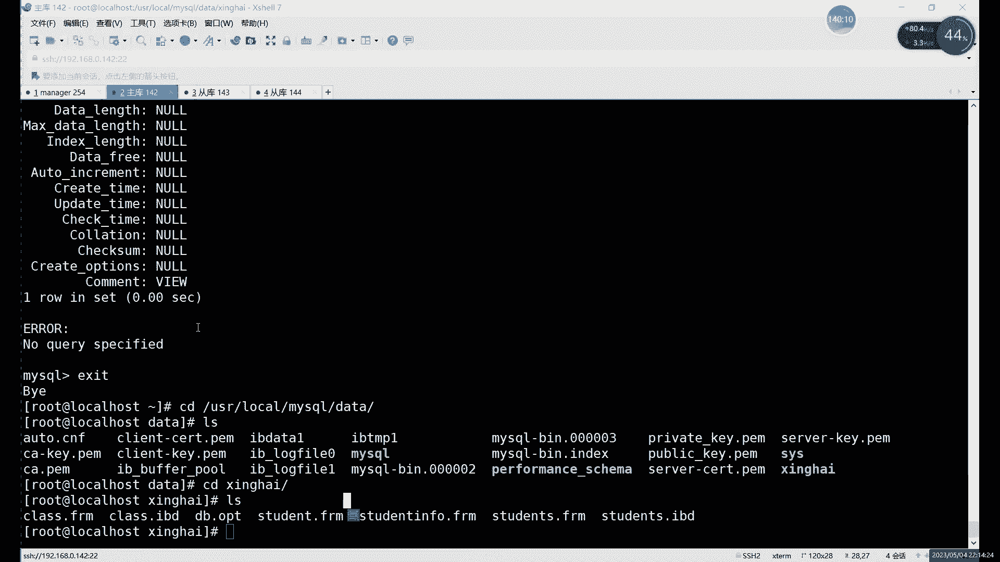

就比如说我们可以看一下啊，大家这个视图的这几个特点，大家知道就行了啊，还有一个就是什么呢，视图呢不能是修改，不能修改什么的，不能修改这几种啊，由于几种比较特殊的，嗯就是像其实他其他地方和正式表。

其实是一样的，它就是不能修改什么，不能修改，像那些有这个，啊比较特殊的一些像啊函数分组排序啊，像这个联合查询啊，就是这个联合查询，多表查询这些啊，他不能强制修改这些里面的数据啊，不能修改这些数据。

其他的车还是正正常可以用的啊，正常可以用的，然后视图的话这个特点的话其实其实就这么多，然后呢下面的话删除创建的话，这些其实和正常表格一样啊，和正常表格是一样的，就是create啊。

或者说是rareckless reckless，这里的话其实就是可以改，可以修改我们视图里面的一些内容啊，可以修改里面视图一些内容，或者用offer都可以啊。

create replace和outer都行，然后呢这个更新数据的话就是update对吧，和我们正常这个表格是一样的一致的啊，insert也好啊，delete也好都行啊，都可以，然后删除视图的话。

就用的是job命令啊，就用job命令，照命令的话，当然你可以这个判断呢，其实大家知道一下原因就是有判视图，这里呢可以直接删除啊，如果说你删除视图不存在的话，会报错的，所以说呢啊你如果擅长删除的话。

可以加上if axis，就是不存在，不会就是不存在，会警告一下啊，不存在会警告一下，然后试图上还剩下最后一个用法，就是，啊当然这个是show table的，show table的。

用show table的信息啊，然后这里我们看一下什么，看一下这个创建视图，这里啊创建视图这里其实我们刚才只是什么呢，只是用create with you，然后as创建了一个对吧。

创建视图这里还有一个特殊用法呢，啊就是视图呢是可以限制什么的，可以限制插入的一些数据的对吧，刚才我们其实创建视图，就是你想插入什么数据都可以啊，想插入什么数据都可以，只要你不违反什么。

不违反我们原表格里边的一些这个内容，就行了啊，其他的没有什么太大太多要求啊，当然了，我们试图自己也可以限制用什么，就用这个with check option来限制一些什么。

限制一下我们插入数据的一个范围啊，插入数据的范围可以用这个with check option来限制啊，啊怎么限制呢，其实就是，那比如说呢正常的话，像我们刚才这个试图在插入数据的时候，它有什么限制呢。

其实就是比如说给大家看一下这个。

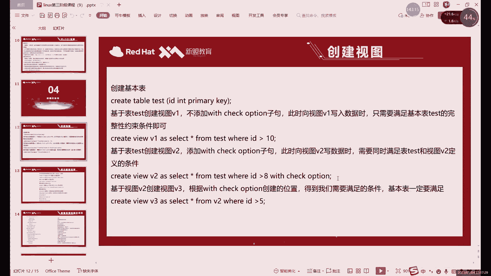

刚才这里啊，嗯视图是student还是用student和students，是两个students，哦我就退出来了，那这里我们是有约束对吧，有一个主键约束啊，或者说不能叫主键吧。

这里准确的说是要自增约束啊，自增约束，然而你它也是主键啊，它既是自尊又是主键，这两个相当于它都有啊，同时有只有这个约束的话，我们可以验证一个什么呢，就是比如说我们可以在视图里面插入什么呢。

大家注意就是试图在创建啊或者插入的时候，一定要遵循一个原则，就是，insert into value啊，student啊，就是我们往视图里面插入内容，插入数据的时候呢，大家注意。

就是比如说呢现在我们的123456789，十十一十二到12了，对吧啊，现在那个李四是12是吧，我们可以再插入一次，然后就直接找到这个，这个是我们之前插入那条数据嘛对吧，正常插入李四。

但是呢我们这个啊dsc student这里呢，其实我们是它的约束只有一个非空对吧，它只有一个非空哎，默认是零，其他的没有什么太多的需要注意的对吧，然后我们这里呢把这insert语句粘贴下来。

我们看执行一下吧，他这里报的什么错呢，唉他报了12啊，违反了什么，违反了我们组件约束啊，这个也是什么，这个也是我们试图的一个特点，就是试图在修改数据的时候，一定要注意什么呢。

不能什么不能违反我们原表格的一个限制，主要包括什么呢，主要其实就包括主键约束啊，唯一性约束呀啊主要包括这些啊，因为这些如果插入的时候，你违反了是为什么是会报错的，对吧啊，他是会报错的，所以说就不能违反。

不能违反这些约束啊，这个怎么这个是啊，试图在修改数据啊的一个需要注意的点，因为我还是那句话，就是它的数据来源于基本表，它在修改数据的时候，其实相当于在修改基本表啊，那相当于在修改就怎么样。

所以说你不能违反基本表的一些设置啊，不能违反基本表的设置啊，这个就是试图的另一个特点啊，嗯这是默认的啊，这是默认特点啊，默认特点还有一个可以添加的特点是什么呢，就比如说给大家接下来看一下。

这个最后一个特殊的一个特点吧，就是这个位置check option。

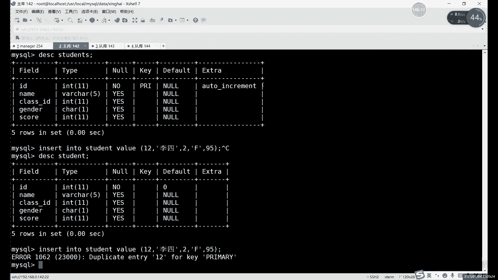

就正常我们的限制条件只有其实其实只有谁呢，只有我们的原表格里面的一些约束，是我们的限制条件对吧，虽然说我们的视图本身没，已经没有那些约束了啊，因为它不能复制那些约束，所以说呢它本身没有了。

但是呢他还需要遵守一些默认的，那其实呢本身啊我们试图本身是没有限制的啊，视图本身的话，其实你只要不违反什么，不违反原有那些约束，你想怎么插入怎么插入，对吧啊，你就插入一些不属于你范围内的。

其实也无所谓啊，不影响。

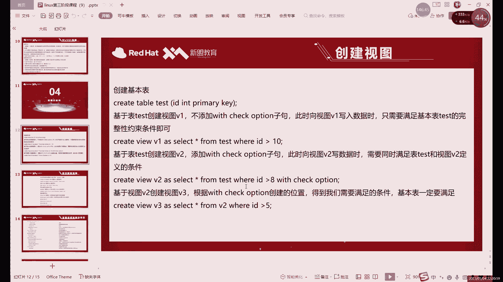

比如说你像你看我们这里，正常插入一个F的对吧，刚才一直插着F，如果我现在插一个开一个M的行不行的呢，也是可以的对吧，也是可以，你看能正常插入，然后呢我们可以来看一下select信号form。

就等于这里我们可以看一下啊，喂123，我刚才查的是13对吧，差的13没有对吧，没有啊，原表是有的，那就是你虽然说呢，刚才插入的这个不在我们的范围之内对吧，这个M呢不在我们的这个视图里面。

但是呢但是还是那句话，还是插入到的是原表，原表里面有了对吧，原表里面有，那这个就是什么，它本身其实只要你不违反这个已有的约束，就比如说我们这里其实只有一个约束，就是自增约束，其实自身约束不算约束。

其实自身约束它只是一个特殊功能，更准确来说，我们的约束应该叫主键约束，主键约束只要不违反主键约束都可以，什么都可以正常插入啊，就和和我们视图这里的限制范围，你看我们视图这里当时限制的是谁呢。

嗯视图大致限制的是那个叫等于F对吧，等于F的啊，跟这个是没有关系的啊，跟这没有关系的，然后呢。

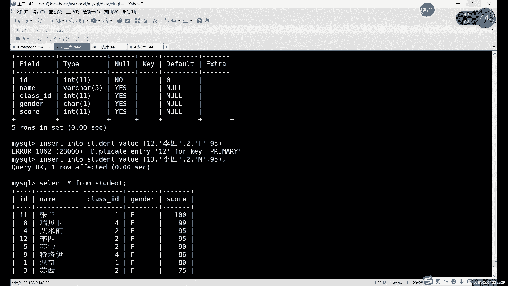

我们这里来再来看一下，我们这个with check option的功能就是什么，就是如果说我们在创建视图的时候，添加了这个with check option啊，一旦添加了的话，我们这个条件呢就比较少。

比较苛刻一点了啊，就比如说呢嗯看比如说我们现在，可以添加一下吗，可以添加一下这个一个新的什么，添加一个新的这个视图吧，啊添加一个新的视图，比如说我们就叫它什么，就叫他这个C暂停一啊。

然后这次呢我们用这个word check option来创建啊，我们上面那个创建视图的面积呢，我们再复制一下吧，啊great with you是吧，这个是多表扬那个单表，那个在哪儿呢，啊在这对吧。

这个是我们当时创建了一个视图的一个命令，我们给它复制下来，我们再创建一次，这次我们创建一个新的呃student1，然后呢我们在后边加上这个，在整个语句结束之后呢，我们再加一个。

再加with w i t h check option，啊我们加这么一条正常创建，唉，没问题，这个table就是student1创建出来了啊对吧，是正常吗，没问题对吧，然后呢我们往这个查看一下吧。

select信号，from student题，查询的结果的话，其实和刚才的C段是一样的啊，因为限制条件是一样的，而这次的话我们给这个C1里面插入的内容，我们来看一下，Insert into。

这叫什么来着，Insert insert，student12依然还是原有表格里面的数据呢，不能违反，所以说我们这里改成14对吧，顺到14了，一二十三十四容易得从14开始查对吧，就像这里插入啊。

我们可以来执行执行一下啊，他这里暴露什么错呢，啊他这里报错的话，跟我们主线就没有关系了啊，你像正常的话，其实表格里面，如果是语言表里面想插入这条数据有问题吗，没问题，因为我们现在14还没有对吧。

现在是1~13了，14是可以正常插入的，这个报错其实就是什么，就是check option field啊，就检测我们这个限制条件还错误了，我们的限制条件是什么呢，啊我们限制条件就是哪儿去了啊。

在这这个杯子cheer operation的检查的是什么呢，tag一般就检查例子对吧，检查的意思，它检查的是什么呢，检查就是后边这部分他检查的就是这个啊，当然和分组没有关系，就和排序无关啊。

我们条件其实就一个就检查它，啊with check option，作用，其实就是检查一下我们这个视图里面，这个限制条件啊，视图中的限制条件呢我们是否符合，如果是符合的话，哎我们就正常可以正常插入对吧。

可以这样插入，如果不符合呢，我们就什么就报错，就报这个check option的问题，比如说我们现在换一个正常的，比如说你换成十，嗯不对啊，我们看一下换成F，这里换成F换成F其实就符合条件对吧。

你看可以正常插入，你换成M就不行对吧，这个其实就是嗯视图之类的一个限制条件，但正常如果说你现在，如果说像这个原表里面插入行不行呢，我们可以来看一下，insert into啊。

students我们再换一个原表了啊，这次换原表了，Students，那么改一下这个数字就行了，改成15啊，改成15没问题对吧，原表是可以查的，就是我们这个限制为了拆包不准值限制谁呢，限制我们视图啊。

不限制原表，他就是他就是一个快捷方式，就他能耐再大，它也只能限制自己啊，他不能说限制一下，它不可能限制到这个我们的原表格的啊，它不可能限制到原表格啊，这个就是视图的一个特点啊，以及它的一个用法吧。

就除了限制我们这个，啊这个叫除了我们限制这个表格之外，啊除了限制我们这个嗯，就是我们经常插入数据啊，或者更改数据的时候，就是在视图里面更改数据的时候，除了遵循我们的原表格的约束以外呢。

还需要遵循我们啊为了check，就是我们加上位的check option。

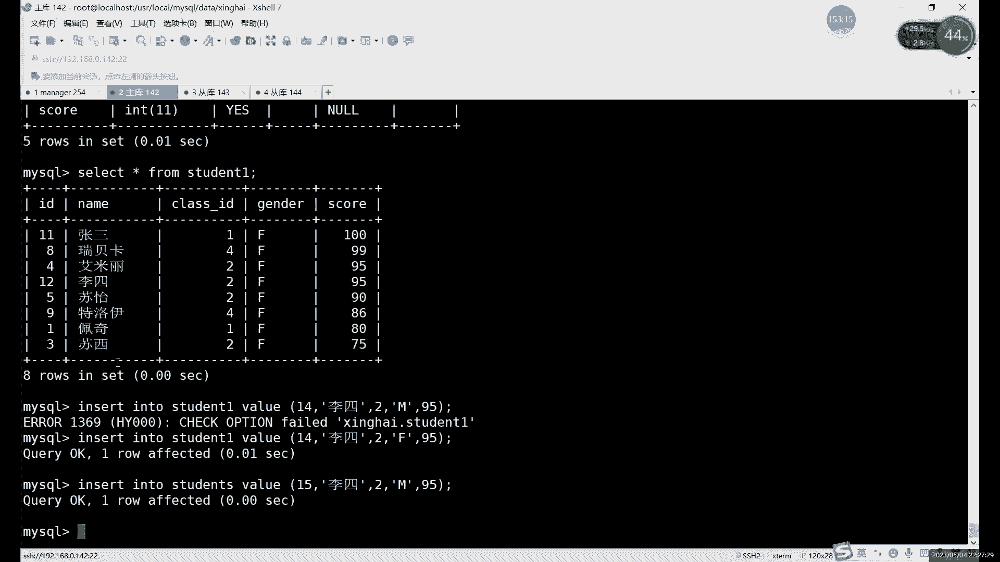

这里这条这里的这个约束条件啊，就是你前面限制什么，你需要遵循什么啊，这里的话比如说大家如果想练的话，可以按照这个PPT里面这个项目嗯，这个是之前啊，之前我用这个数字也说过啊，用数字也举个例子啊。

这次的话我们就直接用了一个随动词表格，用数字的话，这个其实你可以用这个其实也比较好啊，比较好玩，这个你可以限制什么，限制一个数字的范围，就是在表格里面插入数据啊，是只插入数字啊。

你看你通过这个位置太高也好啊，就通过我们这个限制条件也好，就可以限制什么，限制我们这个插入的这个数字啊的一个大小啊，限制插入数字的大小不加，为了拆个operation，它其实就是什么。

就是你只需要遵循我们这个原有表格的条件，就行了，加上之后呢啊既要遵循原有的，既要遵循谁，又要遵循这个位置调位置，check open这里这个条件啊。

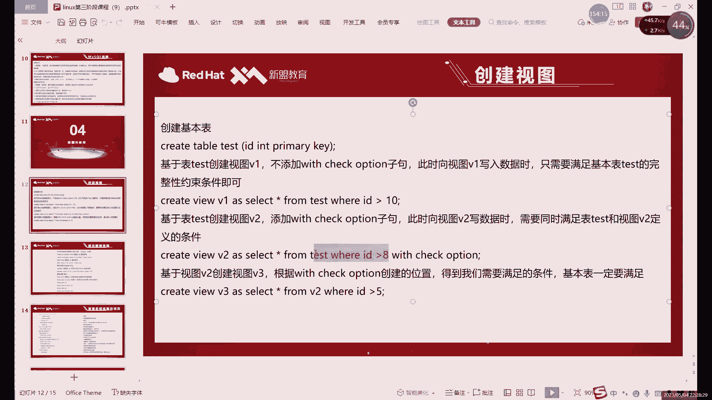

就比如说这和其实和我们这里是一样的，一个意思，这个PPT里面是用数字去演示，我们这里是用这个where的限制条件去演示，也是用where，这里我们是用这个性别吗，F和M来限制啊，也是一个道理的对吧。

这里其实就是啊check option之类的用法啊。

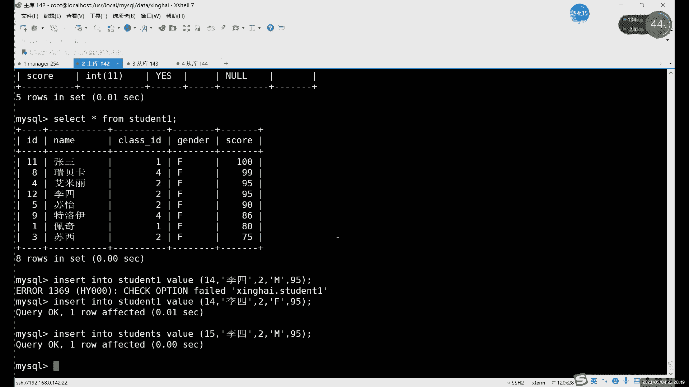

当然还有两个学会了拆开，我们这里为了拆个open，这里细分的话，其实还有两个，大家如果感兴趣的话，下就可以了解一下，就是这个with check option，它其实不是一个用法，它其实是有两个的啊。

为check operation是其中一个，另一个的话叫with check lock of啊，稍微更长一点啊，不是为with local check up啊，更长一点，两个的区别其实就是什么呢，就是。

嗯如果说我们这个，啊那是我看一下这个写的之前那条在啊，这就是with check option呢，其实它全写是这样的test case啊，还还有还有TT，比如with check with test。

然后开下一个open，这个是它的全写，正常的话我们写写这么短就行了，他这个其实就是更新视图的时候，或者说插入插入也好啊，更新也好，删除也好，其实都有分析，取的时候需要满足所有视图和表的条件啊。

这个是为check option嗯，加如果换成local的话，就是local代表本地意思嘛对吧，这个其实就是我们在更新视频的时候，只要满足我们的基本表，和我们的当前视图就可以了啊。

这个local check option的话，它限制条件更少一点啊，如果是这个正常的普通的为了check option的话，一旦加上他需要满足所有的视图啊，什么意思呢，就是什么叫所有视图呢。

这个大家感兴趣可以下边啊，下去可以自己先练一下啊，下节课不行，我们可以先说一下，这个就是我们视图也是可以创建视图的啊，我们可以在视图的基础上去创建视图，因为视图我们前面也讲过了对吧，我们是一个什么呢。

我们是，什么是一个虚拟表对吧，虚拟表它也是表呀对吧，我们在MYSQL的目录里边，数据目录里面啊，我们是由什么的，我们是有两部分啊，我们是有两部分的，啊两部分的话分为什么呢，其实就是不正常的话。

我们一个表格是结构和数据嘛对吧，我们的视图的话它是有结构的啊，他只有结构，没有数据，但是它其实也算是一个表格嘛，所以说呢可以在视图的基础上去创建视图啊，这个今天可能没时间，我们可以下节课说一下啊。

下节课可以先说一下关于这个视图的问题啊，这是我可以可以创建视图的啊，这个大家呢呃用的肯定没有说只创建，一般情况下，大部分情况下，我们只需要创建一个视图就可以了啊，但是如果说你想创建多个的话。

其实也是可以的，因为视图它毕竟也算是一个表对吧，也算是一个表，它其实也有数据，只不过它的数据是来源于谁，来源于我们的原表格的，所以说我们可以在视图的基础上。

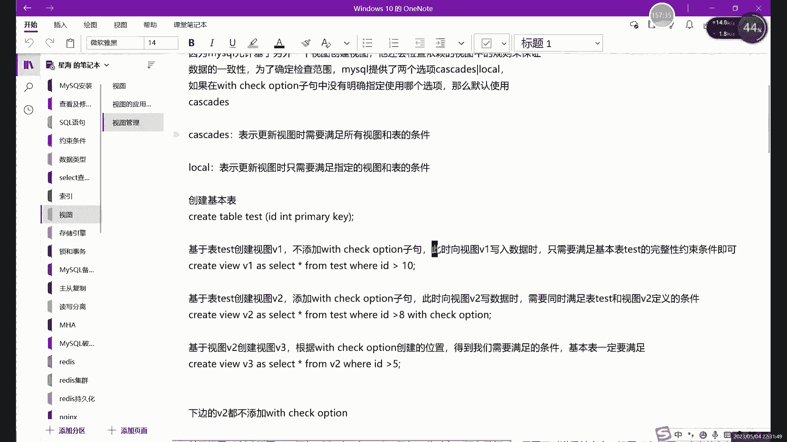

也可以进行查询对吧，你看其实从我刚才执行这个select语句，大家其实能看出来能执行slain from，它其实就能执行一些复杂的语句啊，它能执行这简单的就是自自然能执行复杂的啊，这个就是什么。

这个就是视图的一个特点吧，它其实也算是表格啊，也算是表格好吧，那这个就是什么，这就是我们的，啊视图里边的内容，我们下节课的话可以先来说一下关于视图。

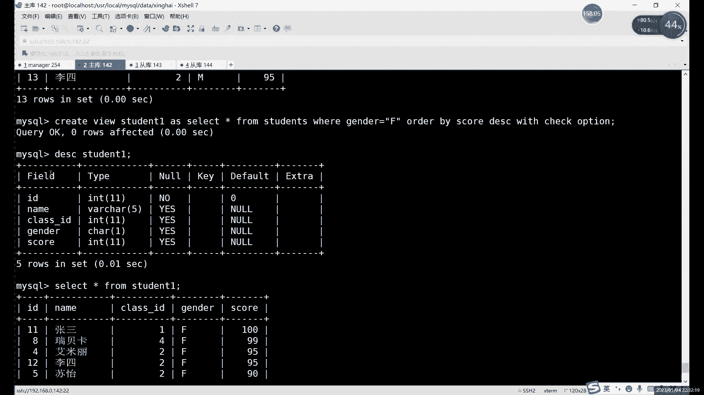

就是这个为了拆高更具体一些吧，因为他这里其实是分为两个的啊，准确说完呢是分为两个的，好大家可以下去的话，可以先练一练，结果笔记也会发给大家，就会发给大家试图这个这两个的话大家可以嗯。

其实创多创建几个视图，其实就能理解，这两个就是为了check option的一个含义了啊，如果有什么问题的，可以啊，可以问我下节课的话，可以先讲一下这个位置，check option这个限制嘛。

啊讲一下这个限制条件，好吧好了，今天的话呢我们内容啊就这么多，那下期的话把这个MA先做一下对吧，ma先做一下啊，做的时候一定要注意啊，就尽量用四台吧，用四台吧，三台呢，三台因为其实有这个关于城门二。

dB lives和这个MYSQL的问题啊，就和一是有冲突的对吧，之前最开始装的时候也说过是有重复的，所以说呢，最好还是用用四台去装三台数据库对吧，一台一台这个控制端啊，一台控制端，然后视图这里的话啊。

大家可以先看着笔记先练一练啊，有什么不明的可以啊，可以在群里问也好啊。

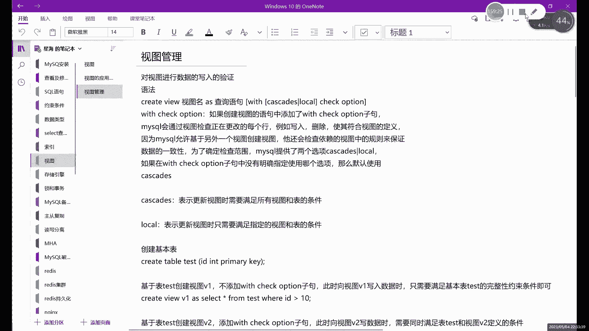