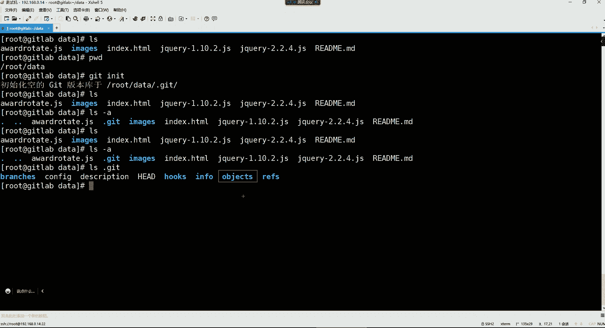
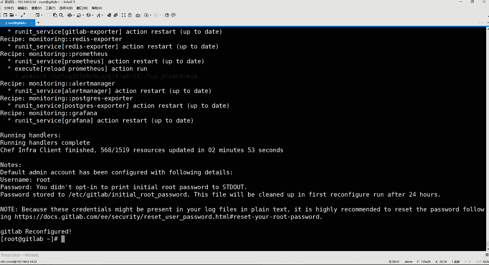

# 0基础小白怎么入门Linux运维？看这套，Linux运维全套培训课程，保姆级教学视频 - P92：DevOps-2.GitLab快速入门 - 小方脸不方- - BV138411B7p5

声音吗，听到声音的兄弟讨论区刷个一开始，咱们今天的课程又到了，我们大家都非常喜爱的学习时间了，是吧啊，最近呢也是买了个扩展屏，知道吗，买了个扩展屏哈，这聊天记录就放到扩展屏里面了，我可以一直关注一下。

这以前没有扩展屏啊，感觉特别不方便啊，看看聊天记录还得放旁边，特别扭，上了一个档次了对哈，明显就感觉是不太一样了，是不是啊，所以我们说这干啥的话呢，这设备是不是得到位呀，嘿嘿大出血是吧。

呃也不算大出血呗，就几百块钱，但是呢确实是能够怎么说呢，感受是不太一样的哈，所以你们学习我建议大家你们也买个扩展屏，就你们买个扩展屏之后，你看你自己的电脑干嘛呀，你自己电脑学习是吧，你比如你敲命令啊。

看笔记啥的都可以，或者说你就这个自己的电脑，你就专门去敲命令去用，然后你搞个扩展屏干嘛呢，放笔记，你把你的笔记放在扩展屏里边，然后呢你敲命令的时候，你记不住鼻翼的时候，你就看看右边的那个笔记。

这边就边敲了，是不是这效率不就直接提升上，不就直接提升上来了吗，呃14寸笔记本是吧，14寸笔记本也可以配个扩展屏，配个小的那种也没啥问题，非常的nice哈好了。

那咱们就开始我们这个上节课讲到了哪里来着，我们讲到了一些前面的基本概念是吧，基本概念讲完之后呢，我们又给大家讲了这个GITHUB的一些使用，但是呢上节课呢讲，只是带领大家感受一下这东西怎么用哈。

然后我们这节课才算是真正开启了，我们这个什么呢，呃基于GLAB加JS的一个divers的内容，然后我们先把我上节课的那个机器。

我先连一下，我上节课那个机器，我是嗯上次讲公开课的时候用了一下，然后这个机器的环境的话好像还原了一下呃，那个地址是192。168。0。14，你看这个名字我们上次是不是改了呀。

好然后我们今天这个看哈，咱们今天这个实验环境就得用到虚拟机了，我们这虚拟机呢准备一个呃，然后这个主机名的话，那我们就让他就get li这IP地址呢，大家可以自定义，因为我这里面用的是192。16，8。

0。30是吧，但是你们其实无所谓哈，我们用哪个都无所谓，IP地址，然后系统呢还有这个硬件环境核心数量，两核心CPU加上4G的内存，然后再加上那个50个G的磁盘，我们一直都是这么一套环境是吧。

然后主机名呢咱们改一改，上次上次是，我们一会儿要开始讲这部分内容。

Get lab，然后退出再重新登录一下，重建一下行。

然后呢，我们首先呢要先单点的家去熟悉一个工具，这个工具呢叫做git工具，然后我们先给它安装一下哈。

这东西呢在我们的这个亚目园里面，就直接有这个东西，我们可以直接给他安装一下，用这个em guy get好。

然后让他先安装，然后咱们先介绍一下这个东西哈，git工具是什么呢，git它是一款开源的分布式版本控制系统啊，这个我们运维呢用的比较少啊，或者说我们运维几乎也用不到这东西。

但是呢开发用这个东西呢是比较什么的，比较多一些的，因为他们要去用这个东西呢，比如要推送自己的代码，都得用这个get工具拉取代码，也也可以用这个get工具啊，然后git工具是这个李纳斯托瓦兹，他为了管理。

帮助管理自己的LINUX的内核开发而开发的一个，开放源代码的一个版本控制软件，咱们先说这个git是他这个一些介绍啊，这个我曾经收藏过一篇文章，在我这个里面有一个怎么被我给删了呢，是在这里面吗，没有是吧。

等会儿啊我们来搜一下git工具的诞生，嗯给他工具，咱们看看啊，看看怎么介绍的，嗯这个介绍的也并不是很全面，然后看看这个哈，十天后给它诞生，这个也并不是很全面，看看这个简短的哈，他那个是红的一个节目。

该招人嗯，看一个git是一个，我曾经收藏过一篇文章，那个文章写的还是非常的详细的，包括他什么背景啊，历史啊都有介绍，这里边也不是看看知乎吧，看知乎怎么样哈，知乎也并不是很详细，算了吧。

那咱们就简单介绍介绍吧，是吧嗯，诶这个也不对，get工具的介绍呢，行就看看这个吧是吧，get是什么工具，每次提交过保存状态时，哎什么时候，真的是啥哈，这个被我给删了，现在找还找不到了。

我就简单跟你们介绍这个东西哈，get这个工具呢它是专门帮助开发人员去，比如说我们在企业里边，在企业内部呢，我们说这个CCD的这个工作流程啊，它是这样子的，就是我们在企业内部呢。

我们会有这种私有的代码仓库，我们前面给大家讲的那个GITHUB，它是一个专门用于什么的，托管一些开源项目的一个代码仓库，但是开源项目呢他也不怕被别人给什么呢，不怕别人被别人给这个，比如说这个抄袭啊。

或者说偷窥啊等等等等的，因为人家那个东西开源出来，我就是说白了就是让大家免费去看的，是不是啊，你要有能力，你就干嘛呢，你就抄袭，你就二次开发，这都无所谓的，但是我们在企业内部，你比如说在企业里面。

它在开发一个软件的时候，他可不是为了把这个软件开发出来之后，把自己的代码放到那个公共的代码仓库里面，让大家可以免费去白嫖，免费去抄袭，是不是啊，所以在企业内部呢，我们在开发一个程序的时候。

我们是为了靠这个程序挣钱，所以呢我这个代码呢，肯定不可能放在一个公共的一个仓库里面，让大家都可以去抄袭的，所以我们在企业内部，我们要自己搭建一个GLAB，这个get lab呢我们前面也是说过是吧。

就是一个代码托管仓库，然后它呢主要是在企业内部用，我们在企业里边呢，开发人员在开发这个程序的时候，他们写好的代码呢，他要把这个代码给他提交，提交到哪里呢，要给它贴到这个仓库里面。

那么它在提交到仓库的时候，它得有一个工具网上提交才可以，是不是啊，所以就用的是这个get这个工具，这个工具的话就可以帮助开发，把它代码给它提交到这个代码仓库里面。

然后我们后续呢这个也会部署这个集成服务器，那这个集成服务器的话呢，他也要用到这个get这个工具，干嘛呢，他要通过git呀来到仓库里边，把这个代码可以给他拉取到本地，拉取到本地之后。

因为这个东西呢主要就是我们用，就是用它拉取代码的，拉取到本地之后呢，我们要对代码做一些，比如在集成服务器里面要对码，要呃对他这个代码做一些编译审查，打包之类的，这个我们统称叫做构建啊。

就是这个build的意思，build对代码做一个构建，构建完了之后呢，这个代码我们要发布出去，但是发布也不用get了，通过集成服务器呢就可以给它发布到测试环境，或者说呢给它发布到这个生产环境都可以。

所以这就是git工具哈，那对于get工具呢，我们既然是学习呢，我们也得了解了解他的一些用法是吧，我们想要使用git，首先你把这个东西下载下来之后啊，这gt的要求就是呃。

每一个使用git的这个人都要去干嘛呢，都要去创建一个get的用户，和设置一个这个用户的邮箱，因为在企业里边，你比如说这个开发这个人叫张三，那么张三他自己写好的代码，他要把代码。

是不是要给他提交到这个仓库里面去啊，那他贴到仓库，那你想想后续，那公司里面的那些什么开发主管呢，他们在审查这个开发人员代码的时候，他是不是得知道这代码是谁提交上来的呀，因为到代码仓库这个里边之后。

还得由这个开发人员，去对他的代码做一个什么呢，做后续的一些审查的工作，看看你的代码符不符合规范，所以你每次提交代码的时候，我得知道这代码是谁写的，然后你谁提交上来的，所以我们在使用get的时候呢。

他自己要求啊，你必须得先什么呢，先设置一个账号，然后你每次提到这个代码的时候呢，要以这个账号的身份去提交，这样我就知道这个代码是谁提交过来的，能理解了吧，所以这是使用get的一个前提，必须得去干嘛呢。

设置用户和这个用户的邮箱，而这命令的话呢，我们就通过这个get config global user，点name后面跟上一个用户名就可以了，我们这个把这个命令拿过来说是，但是他这是两个杠啊。

这里面怎么变成一个杠，一个杠了两个杠哈，这个看了吗，这个用户名呢你怎么叫都行，因为毕竟是你这个自己去设置的。

所以这就无所谓了，我们把gt安装完了之后，我们就直接在这设置一个使用git的账号，这个账号我们就知道叫什么呢，就让它叫，比如说yes sir，可以吧，设置完用户以后呢，你还要去设置个邮箱。

就是你要把这个优势点name换成U4点嗯，email是吧，Email，Email，然后邮箱的话呢我们这边也随便设置一个哈，比如说yes sir at qq点com。

好，设置好了，设置好了之后的话呢，我们这边为了使用get的时候，能够更加的体验感更好一些，我们可以去配置这个命令的颜色，如果你不配置的话，你在使用git命令的时候，你所有的字体都将是系统统一的白色。

我们这里面不都是白色的吗是吧，那么就没有任何的颜色显示了。

所以我们为了这个东西的使用起来。

更加的体验感更好一些呢，也是设置个字体的颜色啊，OK但是你看我们是不是全局设置啊，杠杠GLOGO，这个全局设置就针对于整个系统都生效了，你在这个系统的任何一个这个目录里边，你想提交代码。

那你都可以使用这个用户的身份。

所以这是全局用户针对整个系统都生效的，那这个我们设置完之后呢，咱们就带领大家了解一下，这个git的一个工作流程，date呢我们在用的时候呢，它是这个分为这个工作目录和这个暂存区域，还有这个本地仓库。

还有这个远程仓库这么几个概念。

那这几个概念呢我们先怎么说呢，咱们比如说我现在建一个目录哈，MDR我建一个我们在哪儿建呢，我就在我的家目录建一个吧，嗯在我的家目建一个data目录，好建建完这个目录之后呢，我在CD到这个目录里边，好。

这个目录里边我就可以存储我的这个项目代码。

然后我们上节课，是不是给大家用到了一个项目啊，就是这个抽奖的这个项目是吧，咱们把这东西给它拖进去啊，我现在的。

脱下来之后呢，我们给它解压一下，但是我这里面也没有解压工具，安装一个on zip，然后我们现在解压，用unzip把这个抽奖点ZP给它解压一下，那夹之后呢，他就多出了一个目录，多出了目录之后呢。

这个目录里面是什么呢，这个目录里边就是项目文件啊，然后我们把这个项目文件给它移出来，把这个路径下的所有东西都给它，移动到当前目录好，然后再把原先那个压缩包给它移走，给它移动到我的root目录去。

没有了吧，然后再把这个空目录给他删掉，我们刚刚是不是，这个目录里的东西都移出来了呀，所以他就不要了，删掉啊，这里面只保留了我的这个嘶，这个这些什么这些这个前端页面，这个前端页面就是一个抽奖的前端页面。

这是用HTML和这个什么呢，和这个这是这个一个是点JS结尾的，点JS结尾就是java的这个什么一个动态页面啊，我们后续在访问的时候呢，因为它是可以动的，所以呢这是由java来实现的。

就是结合着是HTML加HTML，再加上java编写的一个前端的一个抽奖页面啊，那我们这个一会儿访问再说好吧，我现在有了这个项目之后，这项目是不是都在我的当前的data目录啊。

是吧好，那这个当前的这个data目录我们就称之为什么呢，我现在是把我的项目放在这个里边了是吧，那我现在如果想把我当前目录下的这些项目，给他提交上去，我首先要这样呀哈，嗯就是我当前的这个目录的项目文件。

我要贴到我这个暂存区，这是暂存区域是吧，好，那这个data目录作为什么呢，作为我当前的工作目录。

就是你工作的地方我们称为叫工作目录，但是这工作目录现在还没有变成一个版本库，你得通过GINIT回车好，那么你看他就把我当前的这个什么呢，把我当前的这个data里面有一个点get给它。

初始化成了一个什么呢，一个git的版本库了，好那么现在对于date这个date这个目录。

大家首先要知道它叫做工作目录，就是我们说白了工作的地方好，然后呢，我工作公里面我是不是放了一些项目文件呢，那我这项目文件我最终要放在哪儿呢，放在我的远程仓库去是吧，但是远程仓库我们现在还没有部署。

那没关系，我们先这样，我们先这个说一下这个暂存区这个概念，暂存区呢是我们在使用这个git的时候。

这里边不是有一个隐藏目录吗，我们可以用阿拉斯杠A看哈，你要这ALEX你看不到，你看不到那个点get到了吗，你得阿拉斯杠A啊，这里面是不是一个点get的隐藏目录啊，然后我们可以打开这个点get的隐藏目录。

这里面就是什么呢，就是作为gate的本地的仓库所用到的一些数据，然后在在这里面呢有一个object，这个后续的话呢，会和会存储我们本地的这些项目文件的，这么一个目录啊。

所以我们现在也要使用git，之前当前目录已经变成一个这个什么呢，变成一个git版本库的话，我现在就可以使用这个命令，将我工作目录的项目文件，提到我的这个git的暂存区，这个概念呢大家不用去过多去研究它。

这是在使用git的一个流程，就是你想把你目录下面的这些所有的文件给它，提交到本地仓库，再提交到远程仓库的话，这个流程必须要做第一步呢，它有个暂存区的一个概念，这个暂存区最终就是一个。

是不是就是在这个点get，下面有一个叫index的这么一个文件。

但是如果你现在看的话，你看不到，你看我们刚刚是不是已经打开了这个点，get这个目录了呀，但是你发现这里面有那个叫index的文件吗，并没有是吧，那什么时候才会有呢，就是你使用这个git。

然后ADDADD呢，就是把我当前工作目录的这些项目文件，这是我们的工作目录里面的这些数据是吧，我要把这个东西给它先放到date的暂存区域，那是我要把当前目录所有文件都放进去是吧。

那我就得用直接用点就可以了，点代表当前路径下的所有回车，但你执行以后，你发现他没有任何的什么的，没有任何的输出是吧啊。

但是你得看怎么看呢，用这个命令呃，有一个叫做git status，status是可以查看我仓库当前的一个状态，看看有没有这个变更的文件。

就这样用get status有吗，注意他现在看的是什么呢，是这个暂存区下面的这些文件，现在这些文件都在暂存区呢哈，但是在暂存区不行，有了暂存区的话呢，你再看这个我们当前点get目录的时候。

这里面是不是就多了一个叫index索引文件了呀，好比说现在你所有的那些这个项目文件。

都被记录到这个索引文件里面了，那光记录是不行的，我们现在还得提交，所以我们接下来要得就得用这个命令，用git commit杠M，这个呢就是提交我暂存区域的那些数据，到我的本地仓库去，本地仓库是谁呢。

就是在我们刚刚的那个get里面，有一个叫object这么一个目录，这是作为gate的本地仓库。

可以存储你的项目文件好，然后我们就可以这样get，然后commit杠M你可以加一些什么呢。

就是提交了一些，这个它里面杠M是可以指定一些什么呢。

可以指定一些你提交的一些信息，你比如说我提交的这些东西是什么呢，就是我的嗯前端的抽奖页面，然后回车看看下面有输出。

是不是有了输出之后，就证明我现在把我这个暂存区里边的那些东西，已经提交到了本地的这个object这个目录里面了，也说现在这个东西已经到达你的本地仓库了，那到达本地仓库其实放到本地没有任何的意义。

为什么呢，就像我们在这个图里边，开发人员，他想使用git把代码放在这个远程仓库的时候，那他得先把代码放在自己的本地仓库，然后呢，最后呢，再把本地仓库里的代码给他提交到远程去，得走这个过程，这过程得走好。

然后接下来呢我们想贴到远程仓库，我们现在有远程仓库吗，我们并没有远程仓库是吧，所以我们现在要去自己部署一个远程仓库去，所以我们要去安装这个get lab啊，我们安装git lab的话。

哎呦这地址是对的是吧，我把前面这个删掉哈，把这个环境准备给它删掉，那我们前面这些东西，我前面这东西就就是简单给大家做一个了解，内容吧，行吧，这东西啊我们到时候就给它删掉吧，没有什么意义哈。

其实一直到这留不留都无所谓的好，然后接下来呢我们就来说说这个，这个get live这个代码的托管平台，它对比GITHUB呢，它更适合在团队的内部使用，然后我们部署的话呢，就是这我们的IP地址。

因为我用的也是这个地址，然后这是GLAB的一个官方地址，我们看能不能访问一下他，这地址呢在国外不一定能够防得过去，哦也还可以，但是呢翻译不了，因为我们现在这个谷歌浏览器已经，如果你使用不翻墙的话。

现在谷歌浏览器根本就翻译不了，我们用的是国内版的，翻译不了哈，所以他这东西呢对于官方文档的话，那我们看不看，其实关系也并不是很大，了解一下吧，然后这是它的官方，然后他有自己的文档在这个位置。

然后如果有需要的话，大家可以去看看文档去，当然也都是没有汉化，当然我这个东西呢，我们就是也不需要去参考他的文档，我们就说这东西怎么用，软件包从哪下载呢，啊对于这个GUTHLAB它的版本也是分为什么呢。

这个CE社区版本和这个E的企业版本，这两种类型，这两种类型呢我们用的是它的这个社区版本，企业版本可能是收费的，但是呢收费归收费哈，功能肯定比这个社区版本要全一些，而且呢官方也会给你提供技术支持的。

但对于我们来讲无所谓，我们是用不上是吧，所以我们想要下载这个给他来个包啊，下载它的C版本，我们去清华大学下载你想下载的企业版本，这里边清华大学也有，我们可以去来到这个清华大学。

然后在这儿搜他的这个GLAB好，看到了吗，是不是有一个GLAB杠C的社区版本呢，然后这个呢就是它的企业版本，这个是叫做集成框架版本，它的这个集成框架版本，到底是收费的还是免费的呀，没有用过这个版本哈。

免费的吗，自己本地搭建啊，不是给他把杠杠RNER，看看啊是不是这个版本的话啊，这也是一个开源的啊，用于运行papa作业，服务器有没有什，好那就和他的这个C版本差不多了，那无所谓吧。

我就仍然选择这个C的哈。

这也是一个免费的，点进来之后呢，我们是SN和S的操作系统，那咱们就选择这个YM这个文件夹里面，但如果你要是用的别的系统呢，你比如说用的是deb的呢，用的是乌班图的呢，那是不是就去对应的文件夹里面。

找他的包就可以了呀，然后我们选择这个YM点进去。

然后再点到那个一七这个文件夹里边，好，这就是我们当前看到的可以使用的这些版本，看到了吗，是不是非常多呀，然后我用的是哪个版本的，我用的是这个是这个14。1。0的，这个版本也非常新，我们可以看一下这14。

1。0的在哪儿呢，在，在这儿呢看到吗，这14。1。1。0的这个版本是吧，这是二，这是2021年7月份的一个发布的一个版本，也很新了哈，当然现在最新的是这个15。7的版本，跟咱们差了一个版本，无所谓哈。

我们就选择用这个14。1。0的，这个版本就可以，这包我已经下载好了，这个包挺大的，这包1。800多兆，你看这个包哈，它这里面可不是说只有一个软件啊，它里面是有好多个软件都放在这一个包里面的。

然后总共加息，你看到了吗，是不是就800多兆吧，那一个软件包不可能有这么大的，所以我们把这东西给它传进去。

800多兆船的话，我们得用这个这个x FTP传，找到我们这个包，软件get live给他拖过去，这样传还算快点呢，如果你要是直接用那个命令行的那个LR。

CSZ那边更慢，但这包我拖到这儿了是吧，给他移走哈，把这个get lab这个包给移动到我的root下面，然后接下来我们就可以直接给它安装上，用YM按就可以，它有依赖，但是呢我们不用管，好安装。

这个安装的话呢有点慢，所以我们就得等等着哈。

然后我们一会儿的话呢，再把这个仓库安装完了之后呢，咱们再去把前面的这个命令呢，其实这个命令就没啥了，就这几条命令我们几乎几乎已经都用了是吧，这个get init是初始化代码仓库的。

就是初始化和本地的目录为一个代码仓库，然后这两个命令呢，就是创建一个用户和设置一个用户邮箱，然后GADD点呢，就是将我当前路径下，所有文件提到我的这个get的暂存区，然后当你的这个文件在暂存区中。

你想看的话，你可以通过这个GTATERS，去看你这个仓库的暂存区的一些数据，然后看完之后的话呢，你可以把你暂存区里的文件给它，提高到你的这个本地的git仓库，提交到本地仓库之后呢。

我们接下来就要去涉及到这个远程仓库的，这条命令的一些使用了，比如查看远程仓库啊，删除远程仓库啊，上传本地代码到远程仓库啊，通过这些命令好，Get lab，安装完以后呢，它就会出现这么一个图标。

就是一个小狐狸头。

安装完了是吧，好安装完了之后，我们来看一下，你看它上面是不是又出现一个小狐狸头啊，然后下面这是一个get lab，然后这是他说这个感谢你安装GLI，安装完之后呢，他下边有一些这个提示，告诉我们怎么做哈。

我们翻译一下。

这翻一下哈，好。

来看这哈，然后他说什么呢，他说get lab现在无法检测到实力的有效主机名，什么意思呢，就是我们后续呢要通过这种web界面的方式，去访问这个给他lab，那你访问GITHLAB。

是不是你得需要一个UL的地址啊，所以他现在并不知道你当前这个主机的这个，UL地址是多少，所以他现在让你去设置怎么设置呢，他说现在请通过设计设置你的GITHLAB实例，然后你给他配置一个URL地址去。

后续呢我们要访问，然后这是他告诉我们去配哪一部分，配这个external url l，那哪个文件可以配呢，它这里面告诉你了，看到吗，你要去改的就是它的这个文件，这是它的主配置文件。

所以我们现在就是要把他的这个文件给它打开，Vm，好把这文件打开，打开之后啊，我们往下翻一翻哈，找那个external url，是不是在这呢，好就把这个里面的它这里面默认叫GLIA，点一个赞。

点com把它删掉，删掉删掉之后呢，我们可以自己写个IP，192点就把我们的本地IP写上去就可以，或者说你自己做个本地解析，你写一个你自己解析个域名也可以能理解吧，所以这就这个看你自己的一个个人习惯了。

你习惯用域名去访问，你就自己配个解析，不习惯用域名访问的，你就直接用IP也行啊，但是公司里面可能会用域名是吧，那我们也来个域名吧，不知道那叫web点GLAB点co可以不可以，你配什么都行。

但是你配完之后，这边你是不是得在windows里面做一个解析，去windows c盘的system32里面，然后找这个driver etc host。

是我们编辑这个文件，编辑完了之后呢，咱们是不是就在这里面，在最后我们加一个192。168。0。14，匹配的域名的是web点GLAB点com，是不是就可以了呀，然后保存。

这个配完之后呢，我们配完他这个域名解析哈，我们接下来他让你他告诉你怎么做了，好了吗，看这，但是然后你就可以通过运行以下命令，启动你的get lab实例了，哪个命令呢，让你使用这个命令，使用这个哈。

那你就把这命令拿过来执行一下，他就开始帮你启动get ti吧。

但这个过程还是不要浪费时间的，然后趁着这会儿功夫呢。

咱们来了解了解GITHUB的一些组件哈，这个组件呢，我们就除了除了他自己核心的组件以外呢，我们有几个是我们比较熟悉的，它会通过NES提供他的web服务的功能，就是我们最重要访问它的这个web界面去。

所以它的web界面是通过N年来运行的，然后还有他自己本身的这些核心程序，这个呢我们就不说了，然后我们再来说说它的这个数据库，因为它也需要用到数据库去存储，它的自己的一些数据，包括我们的这个项目数据啊。

什么都会放到他的数据库里面，而他的数据库呢默认用的是这个post grecile，这个数据库存储的数据，这个了解一下哈，然后他也会用到REDIS缓存它的一些相关的数据啊，其他都是他自己的核心程序。

这个呢我们一般就不用去管它了，然后下面这个还有就是一些服务参数，服务参数的话呢，我们是通过这种YM的方式安装的，然后它的相关的路径，比如说这些应用的代码和相关的依赖程序。

当然这种的话我们一般也不用去改变，它是他自己的本身的一些这个依赖的东西，然后续如果你的OPT里面，如果你发现有一些什么跟GITHLAB相关的东西，你别删，因为我们习惯没事呢。

这个OPT我们拿鱼拿来用做一些实验，是不是，但是到了这些服务的这个阶段的话，大家没事就不要去删OP t目录了，也不要去拿OP目录去做什么相关的实验了，因为包括后续我们在学容器的时候。

在学习这个docker的时候，你要知道你安装完docker以后，docker的一些数据也会存储在OPT下边，所以后期的OP目录就不要瞎动了，然后他的自己的相关的配置文件呢，就包括我们刚刚配的文件也在那。

然后它的主频软件是叫做GLABRB，然后他的这个各个组件产生的日志是在march的log，直接有一个GLAB目录，这里面这些组件每个组件都有自己的日志文件，包括N9S啊，还有这个pc circle啊。

都会放在这个路径下边呃，然后这个库的默认存储目录的话，仓库里面我可以去存储一些代码，那么呢它这个仓库呢对应在这个系统的位置，就是在这个位置这个路径下边好，然后备份文件，这个生成的目录呢在Y上有个OP。

有个get line吧，这个的话呢我们一般接触的比较少一些啊，包括像什么ex的配置文件，我们一般都不用去动它，因为这种东西呢，它所有东西都已经给你配好了哈，所以你就简单了解一下就行，我们这里边。

其实后续呢，也很少去跟这些相关的文件去打交道，知道一下它的服务参数，然后它的服务密令的话呢，这里边呃启动服的话呢，我们直接用这个github gun control start，是启动它全部的服务。

因为一个GITHUB服务非常多哈，123456788个符，所以后续你想启动它所有符的话，那你就可以这样通过start，直接就把所有服务起来了，想重启所有服务呢就是restart。

然后想关闭所有服务呢就stop吧啊，但是后续你说我想，如果我只想关闭某一个服务呢，那你后面跟着服务名，你比如说我想我想关闭N减S。

那你就get lab gun control stop n g s就可以了，这种是只关闭某一个服务，但这种的比较少见一些，然后这个其他的话呢也就没啥了，后续想卸载就用这个命令uninstall。

这是卸载给他lab，但是他数据并不会删除哈，就包括他的什么呢，它的这个自己的这个目库的默认的存储，存储目录里面有一些数据并不会删掉，如果你想删的话，你再加上这个命令，删除所有数据重新开始。

但是这种几乎用不上啊，我们不可能去删它，所以这东西就作为了解就行，呃其实我们是通过这种方式部署的，其实如果后续你通过容器部署的，如果你后续你通过容器部署这些命令，你都不用记，你后续你是控制容器。

你记这东西干嘛呀，后续你如果是通过docker部署，你只要需要通过docker start启动get lab就可以了，你想关闭服务呢，你就dark top glab就可以了，弄裂了吧。

所以这东西看你怎么部署，而且而现在好多企业也比较习惯，用这个容器的方式去部署这个东西，知道一下哈，所以这个命令呢我们其实这个了解了解，你得知道我们这个安装一个服务是吧，它的服务的相关参数。

服务的常用命令都有哪些呀，配好了吗。

拍好了是吧，那配好之后的话呢，我们这边可以用这个，它有一个glab control。

应该有个taters，Glab gun，status是可以看他的所有的服务的，你看他这里面这个服务非常多是吧，如果你看到的都是这种running的这些这个什么呢，输出的话。

就证明这些服务现在都属于运行的状态，你就不用动了，服务都已经跑起来了吧，服务跑起来之后，我们现在要访问访问的话呢，在这儿应该怎么访问呢，我们前面说配个域名啊，配个域名之后哈。

我们要去访问这个域名，去在我们的这个浏览器这个位置跟上web点，get web点com，它默认端口就是八零，就是N减S那个八零哈，然后我们现在就来到了这个他的这个web界面了，来到这个界面之后。

我们这里边得需要输入用户名，你才能登录上去，那么这个用户名我们应该用哪一个用户登录啊。

所以呢你在安装的时候，他已经告诉你了，在这儿看了吗，他的这个username是root，root呢，是作为这个GLAB的一个超级管理员，的一个用户啊，是web是登录web界面的一个超级管理员。

那用户的密码呢，他是首次的话，你是首次安装，他把密码给你放在了这个文件里面的，看了吗，所以我们要先去把它这个密码先给他查出来，这个文件总共就一行，当然我说的是没有被注释的，就一行啊，看了吗。

就这行没有被注释，然后这就是root的密码。

所以我们现在要把这个密码给它复制一下，然后放在这个位置，用户名就是root登录就可以了，那登录上来之后呢，我们现在看的这界面也都是英文的，看不太懂是吧，没关系，像他这种啊支持中文。

所以呢我们用这个东西呢也不用考虑说看不懂，难学这些问题，你看右上角，这是你的个人资料，在你的个人资料里面可以看到，你当前是以哪个用户在登录，是不是，然后呢他这有一个什么有一个这个偏好设置。

你点这个偏好设置之后，你在这儿呢下拉下来之后。

