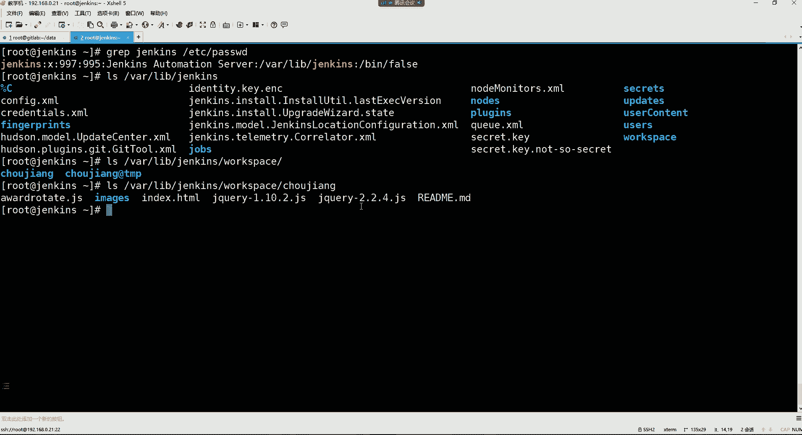
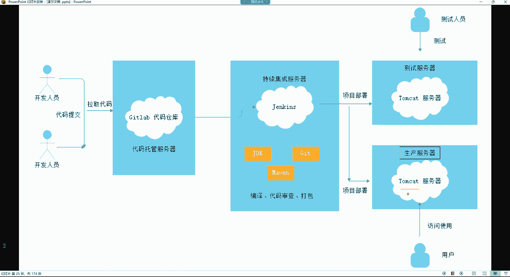

# 0基础小白怎么入门Linux运维？看这套，Linux运维全套培训课程，保姆级教学视频 - P94：DevOps-4.Jenkins快速入门 - 小方脸不方- - BV138411B7p5

呃。听迷糊了，上面的SSHK讲了吗？这个SHK吧，这个是跟这个get lab的SSHK哈，这个我们用不上。😊，而且我们没有用这个S3的K的话，我们是不是也把这个代码上传上去了。

所以这一部分你们可以忽略它哈，这一部分是无所谓的。😊，我们主要讲下面这部分，我们这一部分是不是就嗯想用S4K的话，是在这儿是不是啊？但是我们也没用，是不是啊？所以没用的就先不用管它哈。我们先说谁呢？

先说它。😊，先入他。啊，你是看笔记去了的，你先别看笔记哈，别看笔记。😊，呃，这期讲con D还是讲do上呢？呃，这期的话我还没有更新cont D的内容，所以这个这期可能讲不上。嗯。然后我们来看哈。

因为我因为我这期在准备这个E1K的内容，E1K内容还是这个蛮多的。所以不一定有时间去搞那个肯特的地，但是肯特蒂搞的话比较简单。然后我们来看一下，我们现在要去干嘛呢，要去创建一个管理员。那管理员的话呢。

这里边你可以用什么都行，反正就一个名字嘛。在这里边我们可以让它是ad me，也可以让它是root都行哈。😊，然后密码密码的话呢，我们这里边这个jakins它对密码的要求呢不严格啊，也不要求长度。

也不要求复杂度。我们就直接来一就行了。确认密码一全名我们也让它叫的min。然后电子邮件。我的命。艾特QQ点儿comOK吧，然后选择保存并完成。行，然后这时候我们后续访问ja个的1个UIR地址是吧？

那就保存并完成。行，然后就可以开始使用这个jakins。我们就来到了jas的 web界面了。我们来到这个界面之后呢，大家看到默认好像是。能看懂。是吧你发现啊这个ja个字怎么默认就有中文的呢？为什么呢？

😡，好，那这个得还回顾到我们前面做的哪一步呢？这个怎么展不开呢？这位置哈。这玩意倍儿烦，你看到吗？我展不开我的笔记了。在这一步。就说我们是不是前面是选择社区推荐的插件啊？所以这个社区推荐插件里面。

其中就有一个是中文插件。啊，但如果你要是选择自定义它的插件呢，你要选择它是这边的话，那。😊，你进到是这个界面，然后呢你想安装哪个插件，你自己去勾选，但是你自己勾选，你可能也不知道哪个到底是中文插件。

是吧所以呢我们就选择他推荐的就可以了。😊，啊，然后来到这个界面之后，我们现在应该干嘛呢？我们现在应该去创建任务。什么叫任务呢？就是jaja呢，它可以让我们实现很多工作流程的一个自动化。例如对项目的打包。

以及这个项目的部署，还有定时运行一些工作等等等等。那这些。我们都得放在哪呢？放在他的任务里边，就是你有一个任务之后呢，你可以在任务里边，比如说这个设置我到底这个执行什么操作？

所以在这里面呢我们应该去点击左边的这个叫新建item。这个新建ite点完之后呢，这里边你要输入一个任务名。这个名字叫什么都无所谓哈，但是必须得有的，看到了吧？他说该字呢不能一空。

你比如说我现在就让它叫什么，就让它叫。😊，抽奖的一个任务可以吧？可以叫啥都行，这里面无所谓哈，必天项。然后呢，你要给你的任务呢选择一种类型。它里面有这种呢，比如说叫freeestyle project。

这种就属于自由风格的任务了。就是你自己定义在你这个任务里边执行哪些操作。好，然后还有像什么pe的流水线的这种任务。😊，那这个呢我们现在先不涉及，好吧，我们现在就点这个自由风格的，你得先点击。

你才能点下面的确定，不然下面的确定你发现你点不了看到吗？点不了哈，所得先选择你这个任务的类型。😊，第一个，然后再点确定。好，那我们现在呢就来到这个任务里边了。这个任务里面呢，你看它这里面有很多个什么呢？

很多个步骤。比如说像这种在呃这个janajana就一些基本的。😊，这就是一些基本的或者说常规的一些这个什么呢？一些配置项了。呃，然后剩下的还有一些源码管理的。构建触发器的等等的这些是吧？好。

那在这里面呢我们就在折那里边，我们什么都不选。😊，我们现什么都不用管它哈。然后我们就在这个源码管理里边，我们要把这个给它勾选一下，这是啥呢？这个叫做。呃，你针对于你的原码，你应该。呃。

用什么工具去拉取它？我前面不是在这个图里面，咱们不是说过吗？jakins不是要来到仓库里面去拉取代码吗？那么它拉取代码，它用什么工具去拉取啊？所以我们这里面可以选择让jaens用get这个工具去拉取。

当然呢，有些公司他可能不用get用一个叫做SVN的这么一个东西。它跟get呢是一样的。但是我们并没有安装这个SV的插件，所以这里面呢我们就没有。办法使用这个SVN。但是呢SVN现在用的不多。

主要还是以get为主。所以我们这边就选择。get啊用get帮我去仓库里边去拉取。代码去，但是你勾选get的时候，我们这个ja主机安装get了吗？

你不安装，他是不是没有办法用这个工具啊？😡，没有安装是吧，没有安装就安一下。给他。

好，安装完了安装完了之后呢，我们这边你勾选完之后啊，这里边有一个叫叫什么呢？叫reposory URLL。😊，这个UL呢，你如果你不懂是啥意思，你可以获取他的帮助。我们可以看一下。

它指定get存储库的UIR或路径，这使用与您的什么get克隆命令相同的语法之类的，是吧？其实这个地址就是你希望。😡，ja通过这个get去哪儿了，去干嘛呢？去克隆它的源码去。

那我们的源码是不是都放在我们的这个get lab的这个叫买抽奖的这个仓库里边呢？好，那我们不就是要拉取这个仓库里的这些源码吗？是吧？或者说这些项目文件嘛。啊，那我在拉取的时候，它这里面有个克隆。😊。

看到吧？然后这课隆里面呢，你可以选择用SSH的方式。😊，去访问这个仓库。但如果你要是用SSH的方式访问的话，这里面你得配置什么呢？配着SSH的那个密钥才行。就是你得要在Jens主机生成一个密钥对。

然后你再把ja的这个公钥。

干嘛呢？在他的这个。eddit profile里边。在这里面有一个叫做访问令牌。不是在这儿有一个。是这呢有个SSH喵，看到了吗？你要把这个JX的公钥给它粘贴到这个里边。然后呢。

Jx在访问这个get lab这个主机的时候，就可以以这种SH的这种方式。来访问这个什么呢？来访问这个。放这个getla了。这种是第一种方法。如果你不用这种方法呢，你可以选择我们再点这个get lab哈。

你可以用第二种再点到我们这个仓库里边。我们这个仓库是叫这个是吧？叫买抽奖的这个项目仓库。😊，我们可以选择用第二种用这种HTDP的这种。方式来克隆这个仓库里的代码。这种呢比较省事儿一些。因为这个SSH啊。

😡，上一次呢我验证的时候呢，S33H现在不能克隆了，你就算是用SS3H的K的话。不好用了，现在用不了了。所以我们就不用这个不用这个了哈，我们就直接使用使用HTTP的方式。

其实它的最终呢不就是克隆这个代码嘛，所以无所谓，我们就复制复制这个地址哈。复制完了之后呢，把这个地址要放在这个。😊，链放在这个框框里边。好，那当我们放到这个框框之后啊。

就是我们就是说白了想让jax通过get工具来到这个仓库，克隆他的代码去。那你克隆他的代码，它里面有爆红了，他说失败了。😡，什么意思呢？他说他连接存储库失败。是吧好。这个连接存储库失败的原因就是因为。

我们首先咱们的这个项目仓库是不是有一个小锁头啊，被上锁了。因为我们设的是私有仓库，你私有仓库不是说谁想访问就访问的哈，必须得经过授权才可以。所以我们这边就是因为你让jax来到这个仓库，克隆代码。

他没有权限能够访问这个仓库。所以这时候你应该怎么办呢？我们这又在jakins这要给他去添加一个平据。在这儿哈这有个添加看到了吗？你下拉，然后这里边有个jakins，看到吗？你创建一个什么呢？平均。😊。

创建一个jakins能够访问到这个地址的一个凭据去点这个jakins啊，然后这个凭据呢是全局的，就是我整个这个jakins。任务都可以使用这个频率，那可以。可以哈，然后类型的话。

它里边可以用user name和pass word的用户名和密码的这种方式。😊，那你也可以选择这种SSH这种。这个密钥的方式，你看通过这种pri K有公钥的这种方式。那通过公钥方式呢。

就是你得你们两个之间得要什么的，要相互泯密了。当然我们现在免密也用不了，所以我们这边就用户名和密码。然后这个用户名是谁呢？这个用户名就是谁有权限能够访问这个仓库，你就得指定这个用户。

那我们现在在get lab里，在这个get lab里边，谁有权限访问这个仓库啊，是不是也只有现在这个root超级管理员呢？所以我们就可以以什么呢？对我们就可以让这个root干嘛呢？作为我们的一个凭据。

😡，的一个用户。是吧啊，让这个使用root的这个用户身份去访问那个仓库。那密码呢密码就是这个root密码，我们这边是123。45678。是吧下面什么都不用写了，其实就是指定个用户名。

再指定这个用户的密码就行。😊，然后就选择添加就行。这屏据添加好了之后，你要在这找到你的这个频据。然后选择上。一点击。有。有。呃。我们这个。我们配这个域名是不是有点问题呀？Yes。

jaen词是不是无法解析这个域名啊？这还有点麻烦了是吧？外包点儿。ge lab点儿com是吧？这他得做个解析去。哎呀，我们这搞的还比较麻烦是吧？那就也得配个解析。😊，是吧。啊，其实我们呃对。

如果是GIP就比较省事了，没事儿，做个解析吧，无所谓是吧？在这个词解析一下不就可以了吗？192。168点0点14，域名是web点get lab点com。😊，外点儿get lab点。

是不是就可以了呀？再看看。刷新一下。重新加载一下。Get。仓库地址。克隆。我们把地址给他。放进去。找到凭据是否可以了，是否就是解析就可以了呀。啊，但是你们做你说就不用解析了，你们用。

因为你们可能说容易忘哈。😡，哎。🤢，好。行了，然后呢这个我们要去拉取这个仓库的哪一个分支的代码啊？mat分支，注意这个ma分支，我们叫主分支。因为我们当前的所有代码，注意啊。

这些所有代码现在都在哪个分支呢？在它的mat分支。这个分支的话呢，这个概念对于我们运维来讲呢，我们接触的也不多。你就知道mat分支就是真正可以放在。😊，生产环境里边运行的这些代码。

如在企业里面都会放在ma斯分支里面。好。因为这种东西没关系，到时候这个。😊，因为在公司里面嘛，他们在做项目部署的，他会告诉你拉取哪个分支代码。😡，他让你拉去哪个分支，到时候你就拉去哪个分支就可以了。

这无所谓的是吧？我们默认都是ma斯分支。😡，啊，然后下边呢我们就别的先不管，我们点保存，点这保存。好，保存完了之后呃，这时候的话呢，我们就这个任务就已经创建好了。然后这任务里面呢就只有一步。

这一步操作就是通过get。去。拉取代码是吧？好，那现在我想执行这个任务怎么执行呢？😊，好，我们点这个build new立即构建。点这个啊一点的话，他就帮我去执行这个抽奖任务。

那这个任务里面不就是拉个代码吗？所以你看这儿。看到吧？就是你每次构建，它这都会有什么呢？都有构建次数，井一就代表你是构建了一次。如果你再次构建呢，就井二以此类推。好。然后在这个位置啊。

你看它有个绿色的对勾，这个绿色对勾呢就代表你的本次构建是成功了。如果出现红色的叉的话，就代表你是构建失败了。好，那我们构建成功之后，我们点到这个里边可以点进来哈。点了之后我们可以看什么呢？😊。

我们可以看他执行了哪些操作。首先呢他是以哪一个用户的身份执行了我们的这个抽奖任务，是以这个命管理员的身份。以这个身份执行的这次任务，然后他执行这个任务，我们就看这儿有没有成功就行了。如果是4个size。

就代表你本次。这个任务是执行成功了好，那执行成功干了什么事儿呢？😡，其实它就是通过这个get这个工具。他通过这个get工具来到哪个呢？来到这个仓库地址，看了吗？来到这个仓库地址。

把这个仓库里边的那个分支的代码给它拉取到了哪个路径了呢？拉取到了本地看到吗？这一步它会通过get in把自己的本地的这个路径。初始化的一个版本库，就说白了现在。他把这个仓库里的代码放到了本地的这个路径。

并且本地的这个路径呢也变成了一个你的get版本库了。

所以我们就可以看一下我们这个本地这个路径。在其实就是这个jas的加目录哈。我们前面说这个jakins有个加目录是吧？😊，在这个va lab js里边，所以你看这个va下的lab下的jas这个目录。

这里边就会有一个叫workspace，就是你通过这个默认情况下，你构建的所有的项目都会放在这个workspace这个目录里边。然后我们就打开这个。workspace这个目录。看了吗？

这里面就会有一个什么？就会有一个你本次构建。的这个什么呢？这个一个任务的目录，你的任务叫什么呀？你的任务是不是叫抽奖啊啊，那他就会在那个目录里面建一个你的跟你的任务同名的一个目录。

然后这目录里面呢就是什么呢？就把我们拉取的代码放在这个目录里边了。

啊后这里边我们看看有都有哪些东西哈，在这个抽奖这个里边。😊。

看到这些东西了吗？其实这些东西是不是就我们在这个get lab里边存储的这些东西啊？

就这些项目文件。是不是？不就这东西吗？你看有什么index ht mail，就这不就是这个页面文件吗？😊，是不是还有什么readme的文档，是不是readme文档。

还有包括这些以GS结尾的这些java的页面。😊，是吧还有一个以age的一个文件夹。哎，你妹的文件夹呢？

没有拉血过来吗？

啊，有是吧，这儿呢这儿呢是吧，在这儿。比如这嘛一age着的文件夹。所以就是他现在执行的这个操作，就是把get lab上面的那个代码给拉取到了我们本地的这个jas主机上面来了。😊，呃。

放在他的这个自己的这个任务里边。好，那现在这个代码在本地我们干嘛呢？但这个代码无非就是一些前端的一些什么呢？😊，抽奖的页面。这个我们也不需要去做什么这个编译啊审查之类的。

因为它无非就是一些HTL加一些java的。GS页面。HTHTM的静态页面，加一些java的一些动态页面结合到一块儿的。好，那么这个东西。😊，我们现在作为一个前端页面。

我要给它发布到我的这个NGS这个服务器里边。我们要准备一个生产环境的服务器。因为我这页面没有办法跑在他们ca里面。

其实跑在他们看的也行啊，但是我们搞1个NGS。我们后续有专门的用处，用这个time们ca的。

所我们先搞1个N点S服务器去哈。😊，NS的话，我们这边就用这个吧，用这个随随便找个机器就可以。我用这个哈。

初始化下环境。好，再开机。

你看我这主机的地址是192。168。0。34。所以我们接下来这个位置要涉及到什么呢？部署这个NGS的这个web服务器。完后我我们要把这个代码给它发布过去。这个。主机名IP自定义吧。

啊，然后把这个N压4安装一下就可以。先改个名儿。能叫NS。好。好，退出。重新连一下。NDS我因为咱因为咱们这里面有阿里仓库是吧？所以我们这个NDS这个直接我们用EM。list直接能够看到这个N加C的包。

我觉得这样安可能有点慢。啊，也行，那就这样安吧哈，y么杠外。认识到。NGS。给他赖吧。代码。托管。拖写。这个。Jkins。集成服务器。这个。那你S死的。外b服务器。

这我每次操作应该都知道我操作哪个机器了，是不是啊？我的物理级特别强是吧？其实我这配置也不高，我这是。我这个电脑的配置。

主要是我这我这电脑里边没啥东西，主要是。

看一下哈。咱俩可以。计算机管理。右机。属性。告诉这电脑号。然后。行，就从这看，我这处理器是英特尔的，英特尔creed的，然后是I5的10400。这个号。然后内存的话就是32几个G呃，是总共是32G内存。

这个哈32G，其实32G对于我们来讲算是起步。我们想做实验，你的内存我跟你讲。😊，你16个G可能说。都不太够用啊，都有32G起步。我后续我还要准备。如果我要是做一些实验的时候，如果后续做一些实验的话。

我这些内存不够用的话，我还要再加一个直接我如果再加的话，我就直接上1个32G的内存条。让它变成64G。因为我觉得32G的，反正目前来讲还没啥问题，问题不大哈。😊，然后磁盘的话呢，我这里边就是。对。

16G不行哈，16G不行，磁盘我这里边就这样是本身的话呢是有一个。总共加起是200256G的一个固态。我这两个盘这两个盘加在一起是200。256G的一个这个固态硬盘。

然后这个盘的话呢是一个T的这一个T呢是什么呢？是机械硬盘。这个机硬盘还不是什么呢？还不是我这个。😡，不是我电脑里边的，是我自己用的这个什么呢？用的这个移动的。移动的机械硬盘。

后加的。反正够用，讲课肯定是没啥问题啊。嗯，N9S安装完了以后啊，这别的不用干，把服务起来就可以了。😊，T把你S。EnableNS好。80端口起来了吧，80端口起来之后可以访问一下这边。

192。168。0点，我们那个地址是34。是不能够看到那个页面呢啊，这是。😊，这是这个变成sinS的还原页儿了，是吧？那没办法，因为我们安装的这个包就是从sinS。

仓库里面安的嘛？好，这就可以了。可以之后呢，我们现在。😊，就是要现在实验的功能是啥呢？就是我要把我jas这个路径下边的这一堆。项目文件发布到NGS里面去。我要给它发布过去哈，那么发布过去。

我就得通过什么方法去发布呢？这为得涉及到脚本。得通过脚本去发布。所以我们去写个脚本哈，这个脚本主要是给jakins发布项目用的，所以我们也是放在jakins的这个加目录吧。

我们直接CD到这个va下的lab下jakins。😊，来到他的家目录，我们再建一个目录，叫做quier。建这么一个目录，然后我们进到这个目录里面去。然后我写个脚本，比如说呢叫。deploy杠NGS点SH。

这脚本献血可能说有点麻烦，我们可以参考一下这个脚本哈。😊。

这脚板相对来讲还是比较简单的。我们可以来这个说一说啊这脚本，你看我是发布项目到NGS这个服务器里边。那发布项目呢，首先你我不是要把这个什么吗？要把项目发布到NGS里边吗？那NGS它存储项目的路径是在哪？

是不是默认情况下是如果我们是用亚么安装的，它默认情况是在这个。😊，优色。share有1个NS4。下边它是存储在Ht mail里面了，是不是啊？这个里面是存储的的项目啊，它的这个页面文件的。

所以我最终是不是要把这X里面的那些东西放到这个Ht mail里面去啊？😊，这是第一步吧是吧？所以呢你发布项目，你的项目要放在哪个路径，我们是不是得定义一下呀？😊，所以通过一个web点R。

定义了一下NGS这个网页跟目录在哪儿。但是我并没有直接定位到它的这什么呢？它这个HTL里边，而是我只。😡，定义到了NGS的。这个路径。并没有定到H mail，为什么呢？这个一会儿再说，好吧。😡。

这是第一步。第二步呢就是我的项目在哪儿啊？我的项目是不是放在了vas的 labbjas的 workspace，这里边有个抽奖的一个目录啊。没错吧，这是我们这个。

前面在拉取项目的时候，是不是这个字就把这个项目放在他自己的这个路径下面来呀？是不是啊？那如果后续我们比如说我又建了一个别的。我又变了我又建了一个别的什么呢？这个任务呢，比如我这个任务叫买。😡。

太子的任务。也是自由风格的，我们点确定。然后我们在源码管理里边，我们到时候通过get拉取的话，那是不是。😊。

你的任务叫什么？最终呢在jakins。它的这个什么呢？workspace里边，它的目录名也不一样啊。所以这个名字是不是后续根据自己的情况去改不就完事了吗？那前面路径是不是就不用动了呀？没错吧。啊。

我们可以这样。我们可以什么呢？一会儿啊咱们再去建一个任务。

或者我们现在就去建一个，我们直接来到get live呢，我们再去。😊，什么呢？在它的这个menu of命里边。咱们再去新建一个项目空白项目，我们这个项目名字。这是买抽奖是吧？咱们来一个叫买。😊。

test可以吧？然后呢，这个项目也放在这个test组里边。测试项目。私有的新建建完之后呢，咱们再搞一个给它传上去。我们在这咱们我我这里边还有一个哈，还有一个是也是一个抽奖的。😊。

页面，但这页面呢挺low的，一个叫DCP。我们简称叫大转盘。

我们也给它解压，把这个DDZP。点CIP解按一下。呃，这是我们刚刚解压说的这个路径。然后呢，我们。这个。直接就进到他这个目录里里边去吧。进到解压目录里边。

然后我们接下来就直接在这里面通过get IIT把当前目录也初始化成一个什么呢？get版本库。然后呢，也是把这里面的这些项目呢给它上传上去，上传到那仓库里边。第一步也是get。ADD。点儿。

把我的当前的这些这个项目文件贴到暂存区getts。是吧现在在暂存区呢，然后呢再通过get。permit杠M。写一些提交信息，比个叫幸运。转盘。大抽奖。

提交调完之后呢，再给他调到远程仓库。那是不是这个仓库里面，他也给你准备命令了呀，这是远程仓库的。😊，地址我们复制。

来到这儿添加一下，然后通过get。remon看一下是不是这个目录，是不是这个仓库里面也有一个叫orange的一个远程仓库啊。那我现在就可以这样了，get。pch杠U指定。Orange。这是仓库名字。

然后呢，推哪个代码呢？推所有代码。用户名引引入它推密码，12345678。也给他推上去成了吧。成了之后，我们这边刷新这个仓库。

这里面是不是也看到这些项目文件了呀？好，然后在这个字呢，我还要去什么呢？😊，我还要去拉取那个仓库的代码，是不是就选择get，然后把它的仓库地址克隆一下。是吧刚录完了之后呢，放在这儿。

那我还用这同一个屏据是不是可以啊？因为都是root嘛，通用的嘛。因为我我们这个就是全局的嘛，是吧，一个全局平据嘛，所以针对于它的所有仓库都可以用，然后也是拉取它的ma分值，然后我们先保存。😊。

然后选我们选Bil的 new构建一下。是不是也成了呀？但是这个第二这个仓我们这个任务里面的构建。那对于这个jax服务器来讲。

你看哈。我们再复制一个终端哈。好，然后我们再去看它的这个va现的lab下ja克s目录。还是看他的workspace啊。你看这里面是不是又有一个叫做买test的一个目录啊？

那这个里边存储的不就是我们刚刚拉取过来的另外一个项目的。一些。文件吗？是不是？啊，所以就是我们通过这个词。😊，你要发布的是哪一个任务的那些里边的那些东西，你就得把这个名字啊，这个名字后续要改。

你比如说我现在我要发布的其实就是谁呢？就是那个叫买pas的里边的那个项目呢。😡，那我是不是要把这个东西给它改成myt？改成这个名字，改成这个目录名啊。是不是啊哎。

我要把这个目录下的那些项目发布到NGS里边去。是这意思哈。那如果你的NGS，比如说你是通过源码部署的呢。如果你通过永远部署，是不是就这路径也不一样了呀？😡，你是不是得指定它的原码路径啊。

原码路径一般就是在它的这个。呃，我们一般啊按照我们的习惯，可能会放在优色local的NDS的。里边是吧，然后它的页面就在这个HtL里面嘛。所以这就是看你的。具体的环境需求啊。好。

然后下边呢每次发布项目我们都。这个。定义一个发布时间。我们通过time环境变量定义了一下。年月日小时分钟表。这个命令拿到系统里面一执行的就是获取了我们的什么呢一个。当天系统的时间，年月日小时分钟表。

我获取这个时间是为了什么呢？就是我每次啊我不是要把这个路径下的项目要给它发布到这个目录里边吗？😊，但是这个项目这里面的东西我最终是不是得打个包啊，因为这里面是好多文件呢。

是不是啊你这些东西我不能挨个拷贝，我得给他通过tmining啊给他打个包压缩一下，然后再拷贝。😡，所以呢我这里边就是每次打包的时候呢，我也去干嘛呢？附带一个打包时间。

打包的时间其实就是我发布项目的一个时间，就这个意思。能列了吧。然后这部分命令是什么呢？这部命令就是我们就开始打包了。😊，对项目做打包，我要塞到我这个codeDR目录里边。

这个codeDR最终就是对应的是我这个真正的项目目录。我所有项目都在这个路径下边，所以我就进到这个路径去进来之后呢，我就并且通过t命令对当前路径下的所有。打包命定是不是得先。它的语法就是呃你。

指定对谁打包，然后呢，打包以后呢，放在哪个路径叫什么名字？它语法格式是这样子的是吧？所以呢我们就是进到这个项目路径之后，我们就去对当前路径所有的内容进行一个打包。打包以后放在哪呢？

放在我们的系统的TMP下边，然后呢这个名字呢让它叫这个名字叫web杠time点他点GZ。好，那这个命令我们从这往下给它删掉。从这儿D大写的G删掉，删掉之后，这脚本咱们就只执行这一部分，可以吧？

我们先试试。看看前面这部分执行完以后，最终是个什么效果。保存一下哈。保存完之后呢，我们去通过bitge直接去执行一下。De不lo。杠NS回车。好，这个脚本执行完以后，我们要去看谁呢？

看TMP目录有没有一个压缩包。你看是不是有一个压缩包的名字叫做web，而且呢后边是带一个当前的系统时间的一个压缩包啊。而这个里边是什么呢？这里边我们可以通过ta杠TF你看一下这里面的东西。

这里面是不是就我们的项目文件？没错吧。好，那这个项目文件最终已经放在TMP了，我是不是得把这个压缩包？拷贝到我NS的这个web服务器里面去啊。因为你这个项目最终在你的集成服务器没有任何意义呀。

就都说现在我已经对我的这个集成服务器里面的这个项目做了一个打包工作了。

那你打完包以后，你放在集成服务器有什么意义呢？你是不是得给他发不走啊？😡，是不是你得拿到人家服务器里面去跑起来呀？😡，好，所以我们接下来。

这个脚本里边。下半部分我们就开始干嘛呢？就是得通过这个复循环，通过下面这一堆复循环的操作发布项目。发布项目呢，首先呢你有多少台web服务器，这里边呢我们就得这样玩，我们再开个机器哈。😊。

我们再找一个机器，一个机器有点少。

再找一个机器作为我们的web服务器。

我也给他恢复一下出入环境哈。😊，咱们搞两台外部服务哈，都是NGS的。这样呢大家能够这个更好的理解我们发布项目。如果有很多台机器应该怎么发布？😊，Yeah。这题是192。168。0。33。点儿0。

33这里。好，改个名儿。那个叫。N你S。01NS这样吧，NS杠n。02。好吧，这个呢是NS杠note01。这名字规划好。这两台web服务器哈。N你S杠。note01。你S杠n。02的。服务器外部服务器。

你看我现在有2个NGS的服务器是吧？那这我们也得安个包杠Yinta NS。咱们先安着吧哈。😊，好，反正我们现在是不是已经是验证了我的这个项目已经打包了呀，打包之后。那这项目我现在有两台外部服务器。

假设我现在不是两台，假设我有20台。我现在让你把这个路径下的这个买ts目录里边的那个打包好的，就是在TLP下面打包好的这个压缩包给我发布到20台服务器里边，怎么发布？😊。

第一是不是你得先把这二台服务器定义好啊？把它的每个主机的IP地址定义好。没错吧。啊，所以我们接下来。要去写一个文件，把我们这个要发布项目的主机的地址呢给它写到文件里边。这个文件呢我们也。进度。哇。

现子来吧，现子。jaagons的那个crapper，我们前面自己创建的这个脚本目录，这里面是不是有脚本，我后自己再去VM编辑一个叫NS点TIT的文件。😊，或者说叫做这个NDS。Host的。这么一个文件。

NS的主机。然后在这里边呢，我有两台服务器，它的地址分别是。192。168。0点。诶。一个是4。这个地址是33是吧，33的主机名是doode02。这个主机名变成note01了是吧？那我们这样吧。

咱们主页面搞的是吧，让他跟他的IP地址最后一位。一样吧，让它叫DS杠n33。这样可以是吧？重新连一下。然后这个主机呢让它是。note34。Not。是NGS杠node34。这样不就可以了吗？

我也知道他的最后一位了。好，那我现在就可以。把它俩192。168点0。33，对应的主机名是NGS杠node。33第二个呢是192。16，哎，不用写名哈，这我们又不是做解析。😊，192。168点0点34。

保存推出，这是我要发布项目的两台机器，是不是啊？没错吧，这名字就不对了哈。😊，No。33。node34。这两台机器，然后它的这个NS。这个机器的这个这个机器N加4都安装好了吧。没起服应。好。他起来了。

是吧行。那我现在把这两个主机的地址也定好了。那现在我是不是要把我的项目发布给这两个服务器啊？那我发布给这两个服务器的话，我通过负循环发布。我通过负循环发布的时候呢，我我要去循环这个文件里的IP地址去。

而我那个文件名叫什么呢？是不是叫NGS下划线hose的呀？😊，下划现hosse的，这是我们的这个这个文件里面是不存储的就是。我们的这个想发布项目的这这两个主机的IP啊。好，然后接下来呢我就开始。😊。

对这个文件里的2个IP地址去循环。循环执行什么操作呢？SCP这是一个远程拷贝的操作是吧？拷贝谁呢？拷贝TMP下面的web down每到time点他点GZ好。

那么这个每到time点他点ZZ其实就是我们放在TMP下面的那个压缩包。就这个。就是我要把这个压缩包。我要给他拷贝到哪个服务器呢？以root的身份拷贝到这个do了IP的这个服务器。

所以说doIP里面存储的不就是。我的这个文件里的这2个IP地址嘛，是不是啊？所以等于说我要把我这个压缩包拷贝给我的。这两个外b服务器拷贝到这个服务器的哪个路径呢？拷贝到它的。外bDR这个路径。

这个路径对应的是哪个？是不是对应的是这个呀？就是说拷贝到它的这个usershare NS这个路径下边。能列了吧。啊，这是第一步就把这压缩包也给它拷贝过去。然后第二步呢。拷贝过去之后。

我是不是得连到这个机器上面呢？连到机器是不是这压缩包得需要解压吧，因为你不解压到这个服务器，它是一个压缩文件也没用。所以呢我要连到这个服务器上边，以root的身份连这两台主机连上去之后呢。

我们再切换到它的这个哪个路径的这个webDR。😊，就是这个usersha NS这个目录群进去之后呢，我们再去单独创建一个目录。我们单独创建一个目录干嘛呢？😡。

把我们的项目夹到我们自己创建的这个目录里面去。😡，而我们创建这目录的时候，也是会附带一个当前的创建时间。就你那目录呢也会有一个。当前的创建时间。所以第二条面呢就是连到这个。

这两台服务器的这个路径再去单独创建一个目录去。好，创建完目录之后呢，我们下边再连到这两台服务器。连上去这时候干嘛呢？再切换到它的那个。webDR这个目录里边，这时候再切换进去，就是我们要解压。

通过t令把我们前面的这个压缩包。因为我们前面压缩包不是已经给它拷贝到这个目录里面了吗？然后我要给它解压。解到哪里呢？解压到当前的那个我们前面创建好的这个叫web杠time这个目录。夹到这个目录里面去。

把项目夹到这个目录。解压到这个目录之后呢，再把这个目录里面的压缩包再给它删掉。因为你已经解压了，是不是压缩包呢就没有用了，就把这个压缩包给它删掉了。好，就是我已经把这个里边的项目给它解压出来了。好。

再把压缩包给它删掉，删掉之后呢，这一步。也是最后一步，我再连到这个服务器去，再切换到这个IGS的这个什么呢？网页目录里边。切换到这个webDR里边，然后我再把它的HT mail给它删掉。

也如时最终呢我这个HT mail在按键S里边也不要了。因为现在的HTL里边存储的是什么呢？存储的是默认的那些。这些页面是吧？那对于我们来讲肯定没有用啊。哪怕说你后续的话，你想发布项目。

那这个里面的东西其实我们也不要了。删掉。好。删掉之后干嘛呢？删掉之后，那里边是不是那目录你都删了。因为我是直接把它的这个HT mail直接就给它删掉了。😡，有的时候那目录就没了，没了之后呢。

我们再做个软链接。😊，我们再把我们前边的这个创建好的这个web time这个目录。这个目录里面有什么呢？这个目录里面有我们自己解压进去的那些项目文件。😡，我们是把这个压缩包里的呢都给它夹到这个。😊。

目录里面了，然后呢，我直接对这个目录做个软链接链接成Ht mail。也就是最终呢这HtL里的这些数据是从我的这个。解压的目录里边。同步过去的。好，那么我们来看看效果，好吧。这部分不知道大家能不能看懂。

反正就是各种环境变量的一种一种调用，就是无非也也都是一些系统里面的一些什么创建目录啊、拷贝啊、远程拷贝啊，然后删除啊，做一些软链接的操作，没有什么难的这类面东西。那我们这里边就先这样是吧。

执行一下这个脚本。😊，呃，这个脚本的话呢，我们给它加个直行权限哈，加个X的直行权限。加完啊，待会我看看啊。这个脚本里面的东西。路径对不对呀？这个文件的路径是吧？好，对的，行。然后这个脚本的话呢。

我们现在让谁执行呢？让jakins去执行。因为后续呢这个脚本我们要让jaen能够在外部界面去自动帮我们调这个脚本。所以这脚本呢最终让jakins去执行。所以我们还要让jas。😊。

有呃就是有能力去执行这个脚本。什么叫有能力呢？有，反正权限可能是有。因为我们直接就是把这个脚本的权限设置成什么呢？任何人都可以去执行了，是吧？有能力是啥意思？就是这个呢他现在。😡，不能登录这个系统。

我们可以看一下啊，你gra过滤这个的用户。你看这次用户，他的解释器是变一下的false是吧？foalse就是一个不能登录系统的一个假的解释器。或者他压根就没有启就没有给他启用解释器，它不能登录哈。

你现在你速杠。😡，这公司。你看你根本就。切换不了切换不过去。所以呢你要把它的解释器给它改一下，通过这个。Useer mode。把它的解示器通过杠S指定为并下的SH。改谁呢？改。Jakins。

而你再去过滤的时候。是不是就变成并下的SH了呀？而这时你再去竖杠的。J克上变。是不就可以了呀？是吧。你看他现在不就在他自己的家目录呢吗？mar写的labja这个路径嘛啊，然后在这个路径之后呢。

它切换到这个qui这个目录里边。😊，切换机了之后呢，他就执行这脚本，看能不能执行。😊，当前路径。Dlo点 essay。呃，这没有做免密是吧？这没有做免密的话，不行，我们先给它取消掉哈。

你看这两个机子没有做免密。你发现如果你不做免密，每次发布项目是不是都得输入对方的。😊，用户名和密码是吧？所以这个比较烦吧，所以咱们这边先这样，咱们在这边先给他做个免密。

这个免密你你也得用jakins用户去免密哈，用jakins去免密。😊，在我们这边SSH因为最终是这子去执行脚本发布项目。咱们这边SSH杠。Kjas这个用户生成一个妙对，然后呢再通过SSH。港靠背。

那他是不是可以通过负循环？4。IP in。然后看这文件里的内容呢。是不是看的没亮。看我当前的这个。路径下的这个你是这个host的。文件呢？是不是啊不就获取到这两个机器的IP了嘛？然后呢，我们再去度。😊。

SSH杠靠be。杠ID把我的公钥以root的身份拷贝给。这个文件里的那些主机就是糟了IP。明毛病吧？SNCH copypyID如此是能拷贝，但是这功效却是谁的就是谁的功。

