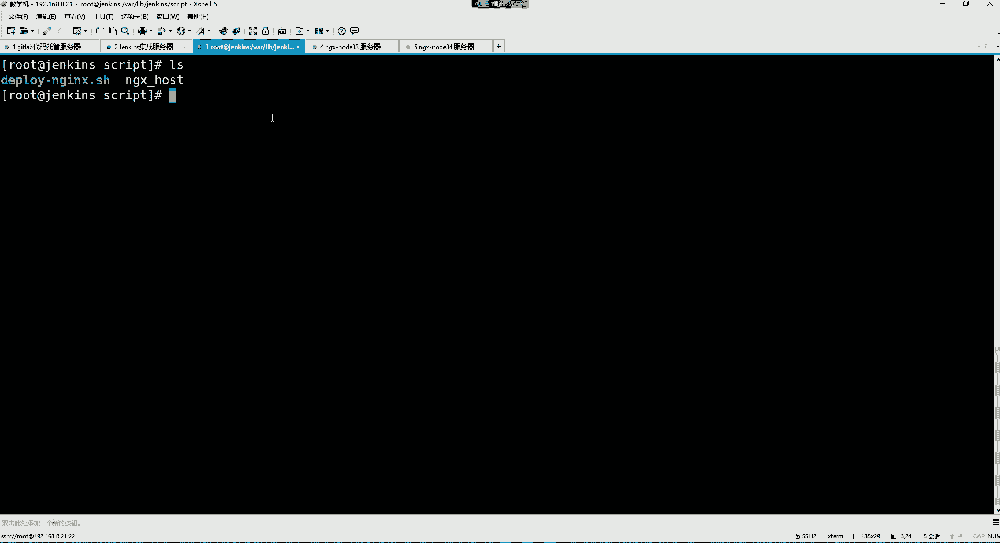

# 0基础小白怎么入门Linux运维？看这套，Linux运维全套培训课程，保姆级教学视频 - P95：DevOps-5.Jenkins快速入门 - 小方脸不方- - BV138411B7p5

要啊就是ja个s的公药。好，然后到首次拷贝验证个yes。输入对方的root密码。再建那个yes输入它密码可以了。是吧你把公钥下发之后，你再去执行这个脚本的话。推车。是不是这脚管直接就过去了呀？😡。

免密吗？是不是啊？你看直接就过去了吧。然后你我们再看这两台外b服务器哈，再看它的这个什么呢？😊，usershare NS0目录，你看这里面是不是就有了一个什么呢？😡，解压以后的这个目录啊。

而这些目录里边是什么呢？是不是就是我们的这个给他拷贝过来的那些项目文件呢？😊，是吧但是最终呢这些项目文件你放在这目录，其实没有任何意义。😊，你要放哪啊？最终。放在这个里边，所以我们就直接对这个目录的。

因为你看这个HM它是个软链接。我们直接进到这个优色shareS里边哈。你看啊其实这个HT mail它这个软链接，它指向的语言文件是谁？是不是就是这个目录啊？

所以HtM里的东西是不是都是从这儿同步过来的呀？那也说我这里面有的页面，在这里面你也有。那最终呢只要这个里面有页面，是不是我们就可以。房都到了呀。那这个机器呢？我们也设D到us色 shareS里边。

看一下是不是也一样的呀。是不是在这个web这个目录里边是不是也有它的项目文件呢？然后最终。HML也是这个。我们这个项目目录的一个软链接呀。好，那只要这里边有内容的话，我们是不是就一刷新浏览器。

我们现在访问是192。18。0。34是吧？😊，刷新。这是啥？抽奖页面。

这是我刚刚发布过的发布到NDS那个项目。知道吧？当然这是34这个机器是吧？33那个机器呢？😊，是不是也是相同的页面呢？因为我们发布的项目都是相同的项目嘛。没错吧。

是不各位，但是这页面写写的有点low啊，这真的有点像拼多多，我觉得这个。😊，这页面我从哪下载的呀？这页面我是从。这个。Gate。BE下载的。这个getE里边我是。嗯。

代码管理。哎。

他这个啊。开源软件。

好像是在这个开源软件，他因为他这个界面又更新了，在开源软件里边。这个这个getE是什么呢？get e叫做什么呢？中国版的。叫做中国版的。Gate。好吧。能理解啥意思了吧。

这个getthub它不是国外的嘛，是吧？😡，不就专门去托管一些开源项目吗？然后国内也有一个专门可以托管一些开源项目呢，叫做getE。我们简称叫什么呢？叫做。马云。简称叫马云哈。

我就是从这里面下的，然后我当初那个下载的时候是。我是怎么搜的来着，忘了哈。更多。诶。选我当中下载就是1个HtL的语言的。HTL的，然后这里面是。我就从这里面找的，看到吗？😡。

但我当初也是比如说一些这个HTm的抽奖页面，HTm。抽奖页面。看到吗？就从这里面搜的什么hello的抽奖页面在里边哈。😊，阿里巴巴的HLCS。这个应该不错呀。我看一下它的效果哈。

我觉得他这个页面应该挺不错的。我们试试哈，克隆一下。复制他地址。哎，下载它压缩包吧。是吧赛尔特压缩泵。

下个这边包。呃。

这得需要登录一下。在里面随便找哈，等会儿，我我得那个啥，我得找一下我的账号哈。😊，好久没有用了。Sure。是我的手机号。已确认上述。他那种。以后再提醒我吧。哎，这怎么没有反应啊？请确认当前账号绑定状态。

是他卡住了吗？这离谱是吧？算了，那我就不下了吧，好吧。哎，但是。不应该呀。个人主页。我已经登录了呀。开个软件。

Stl。抽奖垫。挺快的是吧？咱们先试试它能不能用哈，别到时候用不了，尴尬了，咱直接给它拖到IGS服务器里面吧。😊。

这给它拖进来。然后我们直接给它解压试试啊。呃，我们先把这个先把原先的先给它删掉哈，把这个外b这个目录。还有这个HTL把俩都给它删掉。然我们自己建一个。Ht mail。啊，这里面也没有onz的解压工具。

哇，这么多页面。移动一下哈。把这里的所有都移动到HtL里面去。让我来看看是谁那样的。好，就这些是吧，这是哪个机器？这是note34。😊。

note34。Yeah。

啊，你起伏了呀。有80号。哎。Index。

耍我呢吗。😡，不是他这里面不不涉及到什么重启服务的这些操作呀。

就是上传个页面，不用它不需要你重启。啊。哦，少一个L是不是？😮，你们看到了吗？😊，这太狗了吧。😊，我靠。😊，是不是啊？😊。

这谁能？这我都没注意到。😡，是不是？😊，是阿里巴巴。1688是吧，广州。叫做这个什么小工厂批发。这不就阿里巴巴页面吗？但是你点没有用啊，它是假的。😡，就是一个只有一个。这么一个页页面，啥也点不了。

但这确实是阿里巴巴首页。😡，没毛病吧，3W。点儿。淘宝点com。确实是阿里巴巴首页吧。😡，有一些区别。没区别。那不就这玩意儿吗？😡，是吧这就一个前端页面。要吗？😡，你们要吗？你们不要我删了。😡，啊。

要不要这玩意儿？不要是吧。你要他干啥呀，没啥用，是不是？有些好东西没事，可以自己来扫来找一找哈。😊，在他这里边我跟你讲。有些好东西的。什么小小猪麦兜抽奖。这不行，这里边儿。抽奖的smail。

这一看就不行啊，拉倒吧。就是。就就从这里面找的哈。😊，指导一下就行。

好，然后是不是项目就发布过去了呀？

项目发过去之后。

脚本是不是也比较简单的？没错吧，就是你就算是有多个服务器的话，最终。是不是你服务器的IP地址写到文件里边，脚本不就对文件去批量执行了吗？所以无所谓哈，你多少台服务器需要发布这个项目，脚本就可以。😊。

完成了。就是这样子的。呃。行。那如果要再发布项目呢？如果。咱们再去干嘛？咱们再换一个项目哈，咱们把那个脚本再去调整一下，行吧。换换另外一个项目哈发布。把这个develop NS。

我们这个是不是另外一个项目？叫做抽奖啊，把目录换一下。抽奖目录里边。产生供效能直接。产生工药的话，啥意思？什么产生功效，直接能用脚本吗？没太明白呀。我们要把这个抽奖这些目录里边这些页面给它再发布过去。

我们退出这个真实用户哈。就是哪个呢？在这个。workspace里边这个咱们原先发布的不是这个目录里的项目，我我现在要发布的是这个目录里的项目，是不是就改改脚本就行了呀？把这目录给它换成对应的这个什么呢？

项目目录不就完事了吗？后边东西需要改吗？😊，是不不需要改呀？因为你发布的是同一批主机嘛，而这而针对于什么这些打包的这些是不是就无所谓了呀？😡，有多台服务器，那你多台服务器提前下发公钥啊。😡。

提前下发公钥哈。好，就改一个项目，你要发布的哪个项目路径就可以了，别的不用动。然后咱们去。但是现在发布我还去手动执行脚本吗？你手动执行不行啊。😡，是不是啊手动执行不智能？所以我们要的效果是啥呢？就是。

😊，每次发布项目。我希望。

我在JX上面去鼠标点一点，可不可以？其实也可以。所以这时我们要干的，我们要在他的。😊，咱们是哪个任务来着？我们是回到面板哈。这个抽奖任务。我现在是要发布这个任务里的那项目是吧？点进去。点进来之后呢。

我们点配置。配置的话呢，我们就可以来到这个界面了。源码管理这里边是拉取项目是吧？然后它这里面还有一个什么，还有一个叫构建。构建这个功能，这里边就在这儿呢哈，构建这里边你可以增加增加一个构建步骤。

因为它这个每一步。😊，按照顺序帮你执行。知道吗？如果你没有配，那肯定就不会去执行。但是如果你配了，比如我在源码管理里面，我配了使用get拉取代码，那肯定是什么呢？从左往右帮你先去拉取代码。

然后呢再往后1。1点去什么的执行每一个。😊，环节下面的这些操作。而我现在要在这个构建这个环节里边，我增加一个构建步骤。这个构建步骤里面，你可以让他帮你去执行一个叫做excute show。

就帮你执行sha有命令。😊，点这个只要设用命令的话呢，在这里边你可以用bach。

然后指定什么呢？指定我们的这个脚本的位置，然后让这个词去帮你执行。这是我们的这个脚本路径。通过be去指那个脚本下的哪个脚本呢？

这个脚本。只类脚本。可以了，就是。😊，在这里边J可以帮你执行shall命令，而这个shaill命令就是通过bech执行这个路径下这个脚本去。保存。接下来呢点这个别的 new。第二次构建。是吧点进去。

成功了吗？是不是也是ss啊，成功了。也构建完成了。构建完成之后。他干了什么事儿啊？😡，前面不就拉取代码吗，是吧？😡，那你看这儿有一个。啥呀？Butcher。帮我们执行了这个路径下这个脚本。

而这个脚本恰巧不就是发布项目的那个脚本吗？那也就是说jakins可以帮你去执行脚本去。而这个脚本你也不用手动执行了，你就在这一点，就在你这个任务里边点这个build new就可以了。好。

那最终它执行了吗？我们来验证一下，我们来到我们的这个外b服务器。

这里面有两个。冇录。看到吗？而哪个目录是我们刚刚给他。解压出来的呢，那就看时间呗。是吧应该是这个22。02分这个。而这个时候我们是21点46分的那个是吧？那这个主机呢也一样。是不是它这个里边也一样。

也是多了这么一个我们刚刚发布过来的这个线目目录啊。咱们把这东西给删掉哈。😊，这一个是压缩包。一个是目录。是不是啊？

好，那么接下来咱们再刷新一下页面，看看有没有变化哈这样个机器。一个是0点。

33。哎，变成这样子了。怎么不转呢？这java的页面反应就是慢，你看到吗？😡，卡住了是吧。好，赚了，抽奖了吧。是吧。这是33这个机器吧。34呢。刷新一下，有缓存，是不是也变成了页面了呀？没毛病吧。是吧。

所以就是这个脚本的话呢，你发布项目。

你看我们总共发布了两次项目。那如果说我觉得我这个项目呢。比如说我这个。发布的有问题。😡，然后呢，人家呢让我把这项目给他回滚回去。那我咋回滚呢？我现在项目已经发布了，我咋给他回滚呢？

人家现在让我再回滚到我们的上一个那个项目的。😡。

那个环境。

那咋办呢？我现在已经发布过来了。好，注意。我是不是还有我原先的这个项目的那个文件夹在着那样？没错吧。这文件夹是不是还在呢呀？这里面是不是还是上一个项目的这个东西呀？😊，这是21这个页面还在吧。

那你可以手动回滚一下LN杠S。指定一下。把这个目录下边的。就是对这个目录再做个软链接。链接到。HTL里边。就可以了。啊，你再看HCmail的时候。哎，这里面。这个压缩包是怎么回事儿？啊，不是。搞错了哈。

这样不行哈。因为你那个座因为我们这种座者链接的话，手动的做就得需要去。指这个绝对路径，你手动杠S一下，把优色share下的你S的这个这个目录里的项目。再给它链接到优色shareS的。t mail里边。

就可以了。再打开见没有。哎。没有山是吧？哎呀，这事搞的是吧？😡，应该就先把这个HL给它删掉，不留它了。在LN杠S。我看当前路径音应该也没有问题。不行，这当前目录不行，我们这手动的必须得绝对路径。

tmail的这个。手动的回滚一下不就完事儿了吗？再给它链接到。我的当前，并且呢叫做。HTM。打开频料看一眼。再刷新的话呢。我们那机是哪个机33是吧？

是不是又回到上一个项目的页面了呀？所以我们这个每次的话呢，如果后续要做回滚的话呢，这里边。

你都可以通过我们这种方法去回滚。那我现在又想回我到我的刚刚那个项目呢。刚刚下面是不是在这个目录里边呢？再把HTL给它删掉。现在之后呢再来个软链接。优色share NS下面的这个。

目录里的项目链接到当前的HtM就可以了。哎，我没有删吗？对，是吧，那这里面怎怎么有一个。这么个东西啊。等会儿啊。删掉。然后LN杠S。优色 share这个ES的这个。这个目录。

链接到优色share的mail里面。这每次链接怎么还有个链接文件在呢？难道这目录里面他有吗？在目录里面有一个链接。啊，我说的呢。我说这里面怎么感觉怪怪的呢？是不是？把这个里面东西给它删掉哈，啥玩意儿啊？

这是。这里边的这个链接文件。是不是你要他干啥呀？删除。T smell。

然后你再刷新又回来了，是不是？抽奖应该全是血业回顾，对吧？

那他这是啥呀？他这应该手气不错嘛。

好。是不是啊？所以我们发布项目呢，后续这些东西也可以留下来做回滚。😊，也很诚见。项目回稳嘛，发布错了，再回再回滚到我们原先那个项目。因为你这些目录它并不会删。知道吧？并不会深哈。

呃，这就是我们怎么通过jakinens去通过鼠标一点就发布项目。

哎，那正常来讲说我的不同的项目就是你应该用不同的脚本呢。因为我们在真子里面，这里面你不可能说。😡，你旦有新的项目发布的时候，然后你再去重新去查吧。去调整这脚本吧，不至于吧。😡，是不是啊？所以就是。😊。

你发布项目的时候，最好是不同的项目，用不同的脚本，但是思路差不多都这样。都这样，但是我们这里边指的都是一些什么呢？像像这种不需要编译的。也不需要解决什么依赖的这些。如果你是发布java项目。😡。

在这里边就会比这相对会麻烦一些。

但这流程大家现在能够感受到了吗？😊，是吧开发把代码放到仓库。jakins呢可以来到仓库，把代码拉取到本地，对代码做一个打包。打包之后呢，把代码发布到生产环境，或者说发布到。测试环境。是不是？就可以了呀。

这个流程现在。这个思路现在顺了吗？嗯。OK了吗？思路顺的刷个一，没还没捋顺的刷个2。说了吗？你捋顺就捋顺啊，没捋顺就没捋顺。如果没捋顺，下去再什么呢？再细细的去。思考思考。没关系。对这个流程是不是？M。

看录屏了。😊，没关系啊这。😊，没关系，这都不是什么大事哈。很多东西呢第一遍确实思路可能跟不上，这可以理解。😊，可以理解啊，思路可能第一遍的时候，你这个有点有点跟不上节奏，没关系啊，这图还是非常清晰的。

😊，好，然后接下来的话呢也没啥了。😊，好，接下。呃，接下来我们再来这个说一说这个设置SSHK这个位置哈，就是这个设置SSHK的话呢，就是因为我们在推送项目的时候注意。😊，流程实验要改哪些文件，记不住。

我们也没改什么文件呢。

咱们没有咱们没有改什么文件吧。😡，是不是啊？我们没有改文件哈。😊。

然后呢，这里边有一个设置S3HK。这个设置SSAK的话呢，是怎么回事呢？就比如说。

我们每次在推送项目的时候。我们是不是得通过这个这个位置输入一个root用户名？然后再输入这个root密码去推送的呀。其实正常来讲，你也可以设置一个密钥，这样在你的本机。SSH杠K震。

就是我用这个主机往上推的话，我就在我的这个本机里面设个妙盾。然后呢，我这妙盾不是在我的加目录吗？😡，在我加目录里面有个点SH里边嘛，是吧？然后这里面有一个。IDRSA。点p，这里面是我的公钥是吧？

你要把这个公钥呢。

放在。这个。get lab里边。放在哪儿呢？好像是这儿有一个。嗯，看看啊。个人中心。编辑啊Iit the profile啊，这里边有一个SSH的密钥粘贴到这儿。然后添加密钥。

那这里边就我们再点SSH密钥的时候，你看这里面就有1个SISSH的密钥了，是吧？这个妙钥的话呢，后续就是什么呢？就是我当前这个主机。

在。这个什么呢？在访问这个get lab的时候，比如说我去从它上面去拉取项目啊，还是推送项目啊，都不用输入用户名和密码。就是以这种公司要认证的方式。

去进行一个访问。然后这步做完之后呢，我们再回到我们这个仓库里边。😊，比方说哪个仓库啊，哪个都行。比如说就这个卖。嗯，回到仓库没有用了，我们现在要去干嘛呢？行，先来到这个。买t里边吧。

假设我现在要往这个里边再去上传一个文件。好。那首先的话。

我们再验证一下，我们进到这个目录里边哈。😊，给我再touch一个。pas了点Ht mail的文件。我现在要把这文件再往上推的话。那我这时候就。gatet AD点就把我新增加的这个文件也给它放到本地仓库。

Get。peters所这里面只有一个新文件呢，因为其他文件不都提交到仓库了嘛，所以只识别到了一个文件，然后呢gatet。Commit杠M。啊，这是一个。测试的文件。提交一下。

然后再给它推送到远程仓库get。Remondt。机头啊。remon这是远程仓库的地址。G。push杠U。然后。在指定。杠杠。不行，这样推不行，为什么？因为这样推我们这个前面添加的远程仓库是什么类型的呀？

😊。

是HTTP的是吧，我们还得。这样复制一下。复制SSH这个地址啊，因为我是如果通过SSH推的话，你就得复制SSH的链接，不然它不匹配。

所以这边咱们还得把这命令拿过来。等会儿。那我这就得这样了。G。Remont AD。把远程仓库添加到本地，然后名字叫做比如说。买。Test。回车。Get。remon是不是有一个叫买test的一个仓库啊。

但是这个我们在访问的时候，是不是通过SSH的方式啊？啊，就是我是把这个仓是同一个仓库啊，但是呢我这个是通过S，我是什么呢？是添加它SSH的这种访问访问地址了哈，放在本地叫这个名字。

不一定非得叫orange，叫啥都行。你看我就让他叫买t的。😊，这添加有生仓库到本地。然后接下来呢get。Push。orange啊，这不是不是orange了哈，我要p my test。

我要把我的项目放在这个买test的这个里边，但是同一个仓库。然后杠杠哦验证个yes，你看我输入用户没密码了吗？

并没有吧。是不是直接就上去了呀？😡，有吗？刷新一下。是不是多了一个testHM这么一个文件来？

没错吧。哎，所以就是如果我们是想实现这种免密的方式的话，你们就可以。

这样。你可以在因为默认情况下，我们在这个。如果你没有添加妙的话，它在前面是这这位置会有提示的。我看看哈，在这儿有吗？没有了，就是你在没有配置这种SSH的话，你的上面会有这么一个提示。

假是你可以在你的个人资料中添加一个SSH的密钥。😊，其实你这个me最终就是以什么呢？你想你这个me钥是添加在哪个用户的个人资料里面了呀？😡，你的密钥是不是填加在这个root的个人资料里面了呀？

那也就是说后续你是可以以root的身份。勉密的来访问这个get lab的。知道吧。因为你的公钥是放在这个root的。个人资料里边的。能裂了吧，是不是？所以你就以root的身份可以勉密的去。

比如说推送项目啊，拉取项目之类的，他是这样子。所以在这就是你可以如果你觉得用S3H这种免密的方式推更方便一些。你就设置一下。😡。

如果你觉得反正我们其实这种东西对我们来讲，你说意义并不是很大。因为这种东西本身也是跟我们其实没啥关系，这活不是运维干的，是开发干的，他们要往上推代码。😡。

我们无所谓。是吧所以这部分我们怎么做，无非不就是最着最终就是要把代码给它搞上去嘛，那怎么搞？😡，是吧你就怎么舒服，怎么搞。好，然后对于这个我们今天的内容呢。

我们再给大家说一说get lab的一些常用的一些。使用的一些这个。比如说这个定制logo这些叫做偏好设置哈。呃，前面几乎我们都讲了吧，是不是？从这儿到这儿。我们按照这个流程的话，无非也是前面这位置。

我们在使用get hub的时候，这个位置。我们就可以把什么呢？啊，咱们把这个SSH的这个给它删掉吧，好吧。把这删掉。没有必要啊这位置。get ha对于我们来讲，其实我们也用不上它。这款都不要了啊。删掉。

你只要把仓库创建好了。接下来呢我们就可以通过命令往上去推代码。而这一部分的所有东西我们都是在get lab里边讲的。这部分啊。这一部分。我我下边有推动代码的命令吗？有。是吧这里边有。

所以我这部我都把这个笔记哈。那一部分说就没有必要留了呀。这些我们是往哪儿推呀？我们是往get ha推。往那儿推的话，我们说白了留这些命令干嘛呀？是吧。所以我们从这儿。开始。一直到哪儿呢？一直到下边。

我们在这儿推代码的时候，我才能去讲这个。什么呢？讲get号，讲这个get工具。从这个设置SSHK开始，我们就去推代码。是不是放在这儿吧？往第一步安装get工具。安装完get工具之后呢，咱们就学习命令。

学习命令之后呢，咱们就开始去了解get的工作流程。没错吧啊，接下来呢开始推送项目到这个ge他 lab。是不是哎，这个逻辑是对的吧，O吧。😡，前面无所谓的是吧？一直到时候你注册账号创建仓库，这有啥用啊？

😊，对我们来讲无所谓的。只是了解地方而已。然后说说定制logo。定制logo的话呢，这边。在哪儿呢？在这个。Mual。What的命。这里边有个设置，设置里边有一个外观。

外观里面呢这有个叫handle logogo，handle logogo呢是。对应的是这个。这个小图标，这小狐狸头哈，这小狐狸头的话呢，你可以给它换一个。你比如我们选择文件。😊，你可以换一个。

比如说小企鹅。选择完了之后呢，下拉这儿有一个更新你的设置。开始。变成小企鹅了吧。好。那这个在公司里边，你想放啥就放啥，人家让你放公司的一个什么自己的logo，你就放公司logo。无所谓的这种东西。

然后下边这个系统页页头和页脚要不要放点东西呢？这个叶头和腋脚我还没怎么用，我们试试啊，我看叶头腋脚最终是展示啥效果哈？😊，啊，这儿。Hello。啊，hello。意义好像并不是很大吧。是吧。不是很大。

你最多设设置一些欢迎语呗。We come to。这个get live吧是不是啊？意义不大。然后这儿呢就是标题，标题的话呢，这可以写什么？可以写公司名称。啊。

或者说你这个你的这个你的自己的这个平台是干嘛的？😡，不要让他调。Get。L吧。嗯。代码。托管。仓库。描述。巴拉巴拉的稀尔东西。都可以。啊，都可以哈。你也可以写啥呢？你也可以写，比如。公司名称。企业文化。

行不行？好。然后这个logo呢可以放一个文件。可以也可以放公司logo，也可以放个美女。是吧我们放个美女吧，我觉得放公司logo太无聊了。简直就是对于我们来讲，一点意义都没有。是吧我们去找个美女去。

性感美女。哇塞。哇塞。我觉得。😊，我们困的时候。那这种不是特别性感啊。嗯。我们。这个。看看这个哈。这都是视频是吧？性感美女图片。这可以吧。这个哎呀这双小清新的是吧？这小清新的还是蛮不错的，是吧？

你们应该都比较喜欢这种类型。啊，但这种类型我不是特别喜欢，我比较喜欢这种类型。哎，对。就这种，但是他怎么这么模糊啊？他有点模糊啊，兄弟们。这也可以。这图片有点大哈。有点大不行。嗯。这里边儿。

这小清新太瘦了是吧？这啥呀？是不是。年轻人，我说。年少不知。少富好错把这些小姑娘当成宝，等你们到达一定年纪，你就知道这小姑娘一点意思都没有。找一个。有点味道的这种。哎，这个。对。嗯。😀。😊，但这个。

太丑了是吧，这太丑了。这。😡，哎呀。哎呦，这小清新这。Yes。这个挺不错的。是吧。不太高清是吧，这也不太咋地。是吧我就这咋都这样呢？确实都不是特别高清哈。啊，这种办这种办公室风情的。办公室风情的。

不咋地。哎呀，这搞个图片怎么这么难呢？随便来一个吧。😮，是不兄弟们。是在。挺费劲。挺费劲的哈，想找一个自己喜欢的类型的，怎么就那么难呢？😊，就他吧。高清跑不动是吧？将图片。这真的不咋地哈。

我觉得哈兄弟们真的。😊，确实不咋地。高清。性感美女。这可以吧。行，就他。救他了。另存伟。桌面儿。换个名字哈。呃。baby点GPG。😊，Yeah。😊，是吧。😊，选择文件。桌面儿。打开。选择上了吧啊。

baby点GPG。然后。更新一下。更新完之后在哪看呢？😊，得退出哈。诶。怎么没识别呢？啊，我给取消了呀。是吗？我咋没太注意呢？Mual。有的面。外观。哎呦，还真让我给取消了。这事儿整的。退出哎。

有点这意思了吧。是不是啊？是不是啊这个。你天天一打开这个东西，你的心情是不是就不一样了呀？😊，是不是啊你这看着小清新一上班。心情瞬间。就。感觉特别甜蜜，是不是啊？啊，什么需要定制此页面吗？

这页面偏号设置里边。这个页面的话。有啥可定义的呀，没啥可定义的。你可以设置什么导航的主题，什么语法的高亮。这主题我们让它设置绿色吧，是吧，我们比较喜欢这绿色，那这主题确实变成绿色了，是吧？这种颜色。

这种颜色。这种颜色。啊，就绿色吧，我们都比较喜欢绿色。语法高亮的话呢，这里边行，就如果后续如果你需要敲代码，就让它是默认是就是有一些高亮显示布局的宽度。这就无所谓了吧，首页内容首页内容放我们的项目吗？

就放项目吧，是不是啊？然后项目概览内容。活跃的。rananddom算了吧，默认就行了。可以了哈，我觉得。😊，保存修改。保存修改。是。这里边也没也没有啥地，无所谓了，我觉得这种东西。还有一个说一下这个。

开启注册功能，查看设置。注册的话呢，它这里边是。这儿哈有个注册限制。呃，柱册限制它这是啥意思呢？最终我们可以翻一下哈。😊，第一就是启启启不启用注册功能。启不启用注册功能，但是它已经启用了，你看到吗？😡。

已已经是en内状态了。如果启用后任何访问这个地址的用户都将能够创建一个账号。就说白了，我只要是能够访问到这个UIL上面来，我就可以在这个里面去自己注册一个账号用。如果你不希望。

这个在我们公司里边这个get lab大家能够随便注册账号的话，你就把这个勾选掉。把这个勾选的话，就是把注册功能取消，取消就是别人就不能注册了。那别人不能注册的话，那后续如果如果有人需要什么？

如果有人需要，比如说一个能够登录到这个get lab的一个账号咋办呢？后续给他自己去见用户去。你见用户，你下发给他就可以了。你不要让他去自己注册，能列了吧？那下面这个的话呢是啥意思呢？

启呃，启用后的话呢就是能。