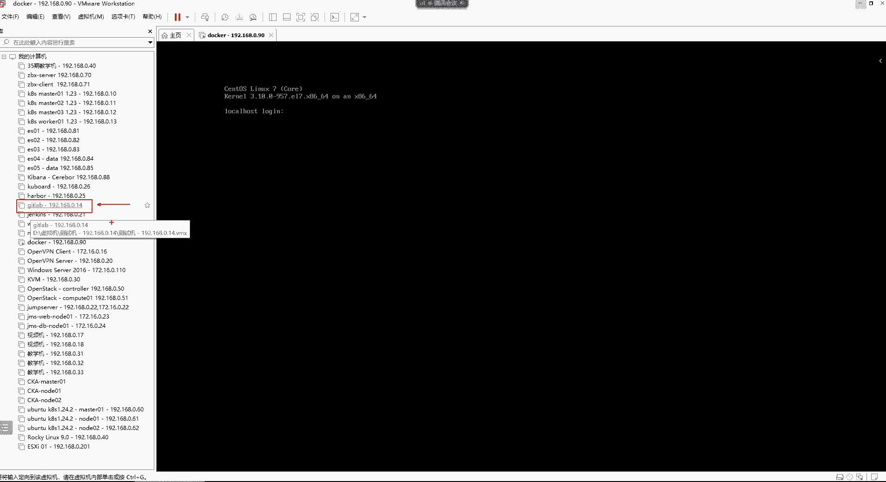
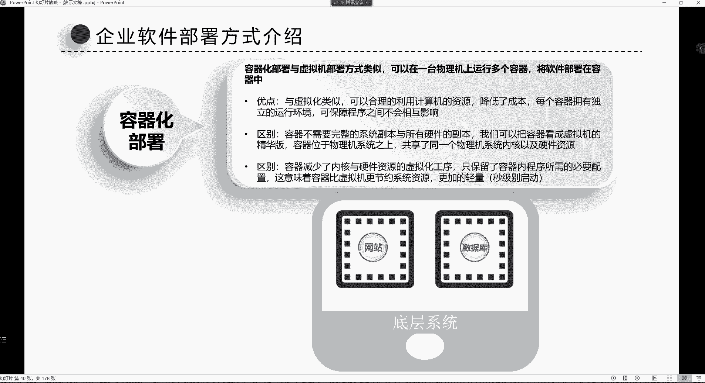
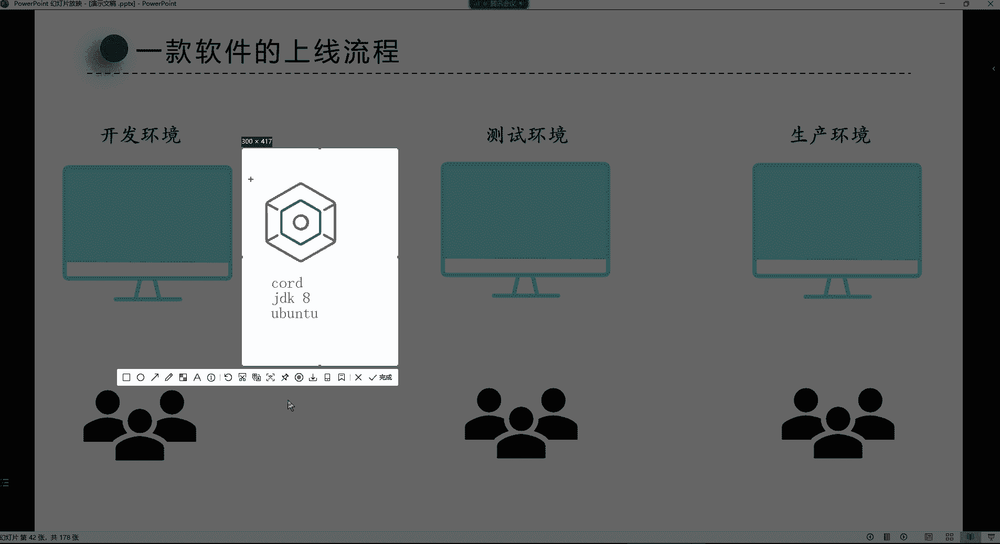

# 0基础小白怎么入门Linux运维？看这套，Linux运维全套培训课程，保姆级教学视频 - P96：Docker-1.docker容器概念介绍 - 小方脸不方- - BV138411B7p5

hello hello，各位，我们开始吧。😊，我们这个系统已经安装好了是吧，安装好了之后啊，我们。这个给他做个初始化，然后呢们就用它了。嗯，我们讲docker的话，其实一个机器就够用了。然我们连一下啊。

嗯。是。doker杠192的168。0点90。地址是192的168。0090。root记住用户名。密码一，记住密码，下次直接连了。然后咱们把这个。脚本给他拿过来。

跑一下，把我们的这个。

这个脚本。跑一遍。把这个环境给它顺化一下。环境处始化之后的话呢，我们就可以直接用这个机器。然后一会儿再给他改个名就完事了。但这个我们得等一会儿哈呃趁着这会儿功夫呢，咱们讲讲这个da口的相关概念。

这个还是蛮重要的哈。😊，嗯。这个刀cker容器的话呢，哎。这是。把这个关掉。

好，我们讲这个刀口容器。呃，刀口容器也是近些年来在这个行业里边非常热门的一个技术了。也就是说后续大家在找工作的时候，你比如说我们去找这个运维。你看一下啊，你们去boss上面去搜一下这个岗位啊。呃。

搜哪些岗位呢？上如果是找这种运维工程师这个岗位的话呢，因为有些企业他确实是这个得必须需要你掌握这个技术。你看一下啊，我们搜这个运维工程师这个岗位是吧？你看你搜这个岗位的时候，他得需要你具备的技术。

像什么jabi。我前面是不是讲过了呀？好，然后这个一说到这个ja based，我曾经在呃是我在很呃是我在。😊，这个大学刚毕业的时候，我去面试的时候，就曾经有人问我呃，问过我哪些扎斯面试题呢？

他说这个扎贝克斯的。那个叫做什么自动发现和自动注册的那个面试题哎。这是。这个以前被问到的一些这个ja的内容哈。然后呢，你看现在在企业里面在在招聘的时候，他就得需要你会容器技术了。

像容器、K8S、docker等，你看下面也一样是吧？dokerjabiskins1KK8S容器技术。你看现在所以我们说我们想把这个运维这个方向发展的话，这些技术可以说是。😊。

作为我们的一个入职的标配技术了。虽然说不是什么新的技术啊，但绝对是你想往这个方向发展，你必须得会的一个技术。那么对于这个docker技术来讲，有很多的这个基本概念，我们得先给大家搞清楚。

就第一个问题就是什么是容器。第二个问题呢就是这个容器它用在哪里。第三个问题呢，容器解决了什么问题，这是摆在我们的三个问题。这也是我们在学习任何一个技术的时候，我们应该知道这东西是什么能干什么。

然后我们再去学它是吧？那第一个问题什么是容器。你说容器这个东西在我们的在对于我们来讲哈，可能好多同学觉得这东西非常抽象，容器容器到底是什么？但是如果我们要是换一个这个什么呢？

换一个思路去理解这个容器的话，就比如说我们生活中用的这些什么锅碗瓢盆，瓶瓶罐罐这些东西，你说它是不是容器啊，其实都是容器。所以容器其实它的本质是什么？就是装东西的，只要是能够容纳东西的。

我们就都可以把它称之为叫做容器的。但是我们在这个计算机里面它也有容器这个词儿，或者说容器这个技术。但是呢在计算机里面容器这个技术它到底用在哪里呢？啊，那这个我们就得来。所以说。😊。

在企业当中软件的部署方式了。呃，就是我们在企业里边，我想往服务器里边安装软件。那我觉得我们到了这个阶段的时候，安装软件我们应该都知道怎么去安装是吧？但是呢这个软件呢，它在部署的时候。

分为这种传统的部署方式，以及这个虚拟化的部署方式，还有容器的部署方式。如果是传统的方式部署的话呢，是在企业的最初期，我们直接将软件部署在我们的物理机上边，这就是我们的公司的服务器了。然后呢。

我们想在服务器里面去部署网站部署数据库等等等等，就直接把这个软件部署在服务器里边。这种就是我们所说的叫做传统的部署方式了。其实你像这种部署方式，就类似于什么呢？

我们有一个就像我们在windows电脑里边。你说我想给我的windows电脑安装软件。那这怎么安呢？我们只需要去来到这个软件商店。😊。

然后呢，我想下载什么软件，我是不是就直接在这点下载就可以了呀。然后这个软件就下载到我的电脑里边了。其实这种就都是属于这种传统的部署方式，它没有什么技术含量。你只要知道怎么去找到这个软件。

怎么去下载它就完事儿了。是是非常简单，所以传统的软件部署方式就是部署简单，也没有什么其他的技术掺杂。😡，但是缺点是什么呢？缺点就是我们无法定义程序的资源使用量。就是你们有没有一种这个什么呢？

有没有一种场景，就是你在windows里面，比如说你在使用一款软件的时候，你这个软件突然间卡死了。😡。

你这个软件卡死了，可能会导致你整个系统你都不能去使用了。你可能说你连点鼠标都点不了了，我觉得这种场景应该在windows里面比较常见一些，是不是？所以这种传统的部署方式在这个。

呃，linux里面也有，就是比如说我们在一个服务器里边是吧？对，蓝屏了，我部署网站部署数据库。那如果其中某一个程序，你比如说我的数据库出现了这种内存泄露的这种问题。

一般这种内存泄露不是由于我们服务器的这个这个bug导致的，而是由于这个数据库本身它的这个内部的因素所导致的。比如说程序代码出现了一些漏洞了，所导致这种内存溢出的这种情况，所以出现这种情况，你怎么办？

出现这种情况，你比如说我服务器我本身就多少内存呢？我本身就是这个128G内存。好。那我本身就128G内存，你一个程序出现那种内存泄露的这种情况了，他就直接把你这服务器里面所有内存都给你吞噬没了。

那他一个程序把你的所有内存吞噬没了之后，你其他的你比如这个网站这个程序还有内存可用吗？是不是就没有内存了呀？因为你一个程序把所有内存都吃没了，其他程序呢？😡，其他程序说白了，没有内存，不就出现问题了吗？

就像我们平时生活中用的手机一样，你说我手机。😡，为什么现在很多人买手机喜欢买那种大内存的手机啊，不就是因为内存大，我可以安装更多的软件，我可以同时运行很多的软件，我手机运行流畅嘛？😊，但如果你内存小呢。

或者你内存不够用呢，说你本身你程序运行的时候需要内存，但是又没有内存怎么办？是不是程序就运行异常了呀？😡，甚至说卡死了呀。所以说啊这种情况呢，在传统的这种部署领域呢就会有这种问题的发生。

就是你没有办法定义我这个程序。使用我系统的资源的一个量。如果你可以定义的话，你比如说我这个数据库我就定义了，你最多可以使用我系统多少内存。比如说这个10个G内存，假设哈最多可以使用11个10个G内存。

那即便说你这个程序造成这种内存泄露了。😊，那也无所谓。怎么无所谓呢？我服务器总内存128G，但是呢我最多只给你分为10G内存，而你出现这种内存泄露的问题，你最多也就只能吞噬我这个服务器的10G内存。

再多我就不会给你了。😡，但是你这种传统的部乳方式，你没有办法去限制它。😡，所以这就导致什么呢？你如果一旦一个程序出现这种问题的话，你整个服务器的程序都会受到影响。能列了吧，那咋办？

你说我们想解决这种问题的话，我们可以这样，我一个服务器只跑一个程序，可以不？😡，我一个程序跑网站，一个程序跑了优库，是不是这种也可以呀？😡，也没毛病。其实。但是如果你是真的是这样玩的话。

除非你们企业真的是特别特别的有钱。我不在乎什么呢？不在乎我这个服务器的一个，或者说我压根就不在乎成本。😡，我只考虑它的是一个什么呢一个程序的安全。

但是往往这种不太现实，为什么呢？这就等于是什么呢？等于说我一个我花了两三万块钱买一个服务器。😡，然后呢，我这一个服务器里面只跑一个软件，就等于说我这一个电脑，我这一个电脑里面只安装了一个软件。😡。

我一个电脑就为一个软件去服务了。你想这一个软件怎么可能占用我所有电脑里的那些内存CPU磁盘网络呀。😡，是不是？

所以这就导致了什么呢？这就导致了我这个一台服务器，其中可能会有多少呢？90%的那些资源在那白白的闲置着浪费了。而只有10%的资源是给我这个服务器里面这个程序所使用的。你想想，那你这90%的资源。

是不是也都是经济呀，也都是钱。说白了，但是呢我没有合理的利用。😡，所以这种不现实。所以这个行业里面呢就有了一个虚拟化的。虚拟化这个东西呢，其实我们用的这个虚拟机呢就是虚拟化技术。

所以虚拟化呢它其实它就是一种计算机系统里面的一种仿真技术。我们可以在一台物理服务器上边，其实就像我们自己的这个平时学习里边用的那个work station一样。我们在我们的windows电脑里边。

我们就安装一个work这么一个软件，然后我们通过这个work station这个软件呢模仿出多台跟我的物理机一模一样的单独计算机出来。然后呢，我把我的软件放在我的虚拟机里面去运行。

是不是跟在我们的自己电脑里面运行是一样的呀。没错吧，只不过你的虚拟机的优点是什么呢？可以帮你合理的利用你计算机的资源了。你正常来讲，你说我这一个服务器，我的配置非常高，我不可能只运行一个软件呢。😊。

所以我就可以通过虚拟化技术创建很多台虚拟机。然后呢，我每个虚拟机里边跑程序。这样可不可以啊，可以啊，因为每个虚拟机它都拥有独立的运行环境啊，就是你把每一个虚拟机就可以理解成一个独立的计算机就可以了。

然后我把我的程序跑在我的这个虚拟机里边，这样你可以保证程序之间不会相互影响。其实这就像什么？像我们平时学习的时候，我们用到的这个比如我这个虚拟机，假设哈假设我们前面讲的这个。😊。

如果我用的这个getlab这个虚拟机出现问题了，它会影响到我们这个ja这个虚拟机吗？不会吧，你看我get lab这个虚拟机里面跑的是getlab这个程序是不是？那你ge lab这个程序出现问题了。

会影响到我ja这个虚拟机里的这个程序嘛，是不是也不会呀？因为他们之间都是相互隔离的，这就等于说我是有两套系统，我两套系统之间说白了你程序发发这个发生这种故障的话，它根本就不会相互影响的呀。

所以虚拟机它的特点是什么？就是隔离。😊。

这是他的优点啊。那缺点是什么呢？我们也不能说是缺点就是不完美的地方，就是每个虚拟机不仅虚拟出一套完整的系统副本，还需要虚拟搜索的硬件副本。那如果像我们前面讲的这个东西，比如说我现在就需要跑一个什么呢？

跑一个get lab，你看我们就得需要一虚拟一个虚拟机出来是吧？我这一个虚拟机里面就跑一个get labb这个程序，你想想。😊。

那可能说。我在我这个电脑里边虚拟一个虚拟机所需的资源，比我一个get lab这个程序所占用系统的资源。是不是要高得多呀？你虚拟出一个虚拟机。

这虚拟机在运行的时候所占用的系统资源是不是比一个程序所占用的系统资源要高？😡，没错吧，是不是？因为虚拟机里面有什么呢？虚拟机里边有一堆的完整的硬件副本呢。

有这些什么虚拟内存条，虚拟CPU、虚拟硬盘、虚拟驱动、虚拟网卡、虚拟显示器，这些是不是都得都得需要我们物理机的资源去支撑啊？没错吧。哎，所以说像这种就是。呃，有的时候。

如果说我们这个虚拟机里面只跑好一个程序的话，你还得需要一个独立的虚拟机。这虚拟机所占有的资源比你这个程序所占用的底层系统资源要高得多。这就有点什么呢？有点这个就是。不太划算。啊。

所以这个虚拟机有自己的虚拟系统，然后还有一堆虚拟的硬件，什么内硬盘、CPU内存、网卡这些呢都得需要经济去虚拟。好，那这些东西都得需要经济。所以虚拟机我们。达不到这种资源的极时利用了。

所以就有了容器的诞生。容器这个东西的话呢，它也是一种虚拟化技术。容器嗯。它跟虚拟机其实它们从这个某种意义上来讲是类似的，它也也是一种虚拟化技术。我们都可以在一台物理机上面去运行多个容器的。

然后我们把软件呢跑在这个容器里边。就是也就是说你看我这一个底层系统，我现在不用虚拟机了，我觉得虚拟机呢达不到资源的集中利用，我干嘛呢？我要用容器。😡，我在我的底层系统上面我去启容器。

而我的程序呢跑在容器里边。那么容器首先呢它跟虚拟化它的优点几乎是一样的。首先呢每个容器都是相互独立的。然后呢，你的程序跑在容器里面，你比如说我这个网站跑在左边这个容器，然后呢。

我这个数据库呢跑在右边这个容器，它们之间是相互隔离的，知道吧？互不影响。你哪怕说你的网网站这个程序出现问题了，也不会影响到这个数据库这个容器。所以这是它的优点。所以这就可以什么呢？

可以帮我们这个达到一个隔离的效果，而且容器呢也可以合理的利用我们计算机的资源。怎么合理利用呢？就是你这一个底层系统，如果你的资源充足的话，你可以起很多个容器的，不是说只能起两个。就只要你有这种需求的话。

你都可以起。😡，那还有区别就是什么呢？就是容器它是不需要完整的系统副本的。什么意思啊？你看我们虚拟机里面是不是有这种独立的内核啊？😡。

这是我们虚拟机里的内核是吧？然后还有什么？它的底层的系统。这是我们虚拟机里面的系统，但是我告诉你，容器是没有内核的。😡。

容器的内核是共用底层同一个操作系统的。我这个容器共用我这个物理级的同一个内核，我这个容器也共用物理级的同一个内核。这种东西呢就是在这个容器里面是不存在的。还有什么呢？

还有就是容器也减少了那些这个硬件资源的虚拟化。你看虚拟机里面有一堆的这些硬件虚拟化是吧？什么内存条、CPU、磁盘、光驱网卡、显卡，这在虚拟里面是不是都有啊，但我告诉你在容器里面压根就没有这东西。

在容器里面只有我的程序和我这个程序所需要运行的环境。就比如说你看。

我这个容器里边，比如说跑的是一个java的这么一个程序。那我这个java程序所需要的这个环境是什么呢？是JDK的环境，是不是？好，那我这个容器里面就JDK的环境。好。

那我这个java环境最终所需要的底层系统，注意你比如说我需要什么系统呢？需要无关图的。好，那么这个容器里面就会帮你提帮你这个容器里面就有这个无伴图的系统，以及我这个程序在运行的时候所需所依赖的一个环境。

但是它没有内核，内核呢都是共用底层系统的。知道吧？共用底层系统的同一个内核。而也而且也没有那些硬件的虚拟化工序了。所以这个容器现在这个对比于虚拟化这个技术来讲呢，会更加的清亮一些。

更加的节约你系统里的资源。少了很多工序嘛，所以从启动上来讲呢，一个容器的启动就像启动一个进程一样。你比如说我们去在系统里面，我要启动一个什么呢？比如说我通过systemCTL，我启动一个这个。NDS。

好，那你启动1个NGS，可能说你需要的时间是一秒钟。一秒钟没错吧，那你其实你启动一个容器。😡，就像启动一个进程一样，速度非常的快。但是如果你要启动一个虚拟机呢，是不是至少得需要个一分钟左右啊？

所以其实它的功能是跟虚拟化，或者说跟那虚拟机是类似的。但是呢从某些方面来讲，要比虚拟机呢更加的有优势。但是容器的隔离效果不好。为什么隔离效果不好呢？你看啊如果对比于虚拟的话，我这个虚拟机。😡。

是不有是不是有自己的独立的内核啊？我这个虚拟机呢是不是也也有自己独立的内核啊？😡，就算是我们对于内核的参数做一些修改的话，你这虚拟机之间是不是都不会相互影响啊，但是容器不太一样。

你比如我这个容器和我这个容器都是共用的我底层的同一个lininux内核的话，那如果我们对于内核做了一些修改的话，那它是直接什么呢？会影响到我系统里面所有容器的所以从隔离的角度上来讲。

容器没有虚拟化强。能领了吧。但是从节约资源这个角度来讲，容器会比虚拟机更加的节约系统资源。啊，这就是我们所说的这个容器。这个优势啊，而且呢这个容器呢它还可以为。

开发测试运维提供一个可移植的一致的操作环境，这个又是什么意思呢？你看哈就我们在企业里边，我们都知道这个我们这个软件从开发到最后的上线。Right。这里面首先要要经经历什么呢？开发。测试和生产环境。

那么你想象一下。这个软件从开发的时候开发不就写代码吗？然后就写代码开发软件嘛，然后把这个软件开发出来之后呢，打个包。打包之后呢，把这个软件要交给运维，要交给测试环境去测试一遍。啊，那测试完成之后的话呢。

这个时候测试人员如果觉得这个代码没有任何问题，因为他得经过层层测试啊，是吧？我曾经是不是跟你们讲过，我说在公司里面这个软件测试又分为什么功能性测试啊，性能性测试啊。

而且好多企业招聘这种测试人员的时候都喜欢招那种刚毕业的女大学生。😊，为什么呢？因为大学生。实属在实习期间。首先呢工资非常低，还有就是国家有补贴。所以好多企业呢招聘这种测试人员的时候。

当然是那种功能性测试人员的时候，这个就喜欢招那种刚毕业的女大学生，一是好看是吧？你看着也舒服，然后呢。又给不了多少钱，而且国家还有补贴。所以对于这种的话呢。

功能性测试无非不就是对于软件的功能做一个测试嘛。你比如我这个软件的功能是否正常？😊，啊，但是性能性测试呢，这里边就会有专门的人员了哈，这一般测试代码。😊，测试完事以后，然后把这代码呢再交给生产环境。

当然这前提是这个代码没有任何问题的情况下，再放到生产环境，运维人员把这个代码呢放在生产环境去部署。部署完事之后的话呢，然后这当然这里面还有什么呢？😊，还有这个公司里面还会有市场部，市场部他会做营销。

就把这个软件的APP。给他发布到各大的应用商店。你比如像什么苹果商店，还有这个什么腾讯商店等等等等哈，什么360商店软件商店发布到各大的商店，然后呢再去开始打广告。打广告之后呢。

大家就可以去软件商店里面去下载这个软件了，然后就去使用这个软件了。所以这不就是我们所说的一款软件商业流程嘛，是吧？从开发到测试再到上线。😡，就这么几个阶段，就我们前面给大家讲那1个CACD1样。

其实你把它串联起来，其实。😊，就是什么呢？CI就是从开发。到测试。再到。当然生涨环境就不属于CI的这个阶段了哈，CI就是从代码的提交。😊，嗯。🤢，从代码的提交，这一部分我们称之叫CI就不断的提交代码嘛。

然后测试的话呢，是不是严束于CI环节呀？😡，我代码提交上来，我是不是得测试？😡，是吧也属于CI环节。测试完测试完事之后的话，那这个代码我最终要部署到生产环境，就是这个环节就属于CP环境了。😊，CD。

把代码放在生产环境。这个过程如果实现自动化的话，就是从CS到CD就是由开发测试生产环境来一起完成CS到CD的这么一个环节。但是你要知道你从开发。他去开发这个软件的时候，然后把这个软件最终发布到生产环境。

在企业里面早些年会有这么一个问题，就是环境不一致。这个环境不一致是怎么回事？你比如说开发他在开发代码，他在开发这个软件，他喜欢用什么操作系统啊？乌斑图。或者说windows。这很正常哈。

但是呢生产环境用什么呀？😊，生产环境很少用什么物斑图的，因为物斑图更新太激进了，bug太多，所以生产环境喜欢用syn。或者说那个红帽的。reo系统。好，那你说这环境一致吗？是否不一致啊？

你开发软件用无关图环境开发的，但是我生产环境用的是森透S，又或者说你开发环境，你在比如说我们在这个开发java项目的时候，你用的JDK环境。😊，你比如说你用的是JDK7的，但是呢我生产环境。

我用的是这个JDK几啊，JDK6的。比你小一个版本。好，那是不是这个我的环境也不一致啊？😡，没错吧。开发可以用深子字么？不适合开发一般要依赖于图形界面。你能理解吧。

而sindows呢也它的图形界面非常不友好。所以开发很少会用sint透S去什么呢？很少会在sintS环境下面去开发软件的。它依赖于图形界面啊。所以大多数的开发用的都是无斑图。所以你说这环境压根就不一致。

你这代码从开发环境再拿到生产环境，是不是有可能出现什么呢？就是我这个。😡，环境不一致会导致这个代码在跨环境迁移的时候，水土不服啊。😡，没错吧。这如果拿到生活当中，我们怎么举这个例子呢？

就比如说你看我现在。😡，这个。我们就拿这个一条鱼来说吧啊，一条小金鱼儿。一条小金鱼儿啊，它最初的时候。适应了什么环境呢？比如说大呃这个大海里的环境是不是啊？😡，一但这不太像是吧？😊，啊。

它比较适合它它已经适应了这个大海里的环境了。但是呢你非得把这个鱼呢要拿到哪呢？要拿到一个什么呢？😡，这个。其他的环境里边，比如说拿到一个这个这个湖泊里边，你想想它能适应吗？他肯定不适应啊。

他可能活都活不下去。是不是挺过的，所以他可能活都活不下去。😊，那这不就是因为环境不一致导致的吗？我水土不服啊，或者说你一个南方人，你到北方，或者说你一个北方人到南方。

你肯定也会出现这种水土不服的一个情况，是不是？😡，所以代码也一样，代码也会有税土不服的这种问题，那咋办？所以你像头些年在企业里边，我们经常说有人说这个运维叫什么呢？叫背锅箱。为什么管运为叫背锅侠呢？😡。

是因为开发它的代码，它在开发的时候，他在自己的环境里面肯定是测试过，可能没有问题的。而测试环境的话呢，如果测试也没有问题，拿到生产环境就有可能出现问题。😡，是吧。是不是各位。对呀。

你就是呃这种跨环境肯定是肯定是出现这种这个。呃，还这个什么呢？这种税度不符的问题。你想想，那这这咋办呢？😡，那这时候你运维你就得去问开发，你得问他，你说。这个程序啊在咱们的生产环境啊。出现一些问题。

跑不起来。然后这时候的开发就得，这时候开发就得什么呢？就得去找你了是吧？那你把你的这个那你把程序的日志拿给我看一下吧，他跟你要日志。😡，你能理解吗？他会跟你要日志啊，他不会直接否定你说你的环境有问题。

他会先跟你要日志。然后你把日志给他之后的话呢，他看完日志以后的话呢。😡，他自己心里其实已经有数了，但是呢他会把这个锅甩给你。他说哎呀，这个我这个日志里边也这个没有出现什么这个呃我的这个程序的报错。

那可能就是你这个环境部署的不太什么呢？这个可能说你程序或者说你这个生产环境跟这个程序有些这个什么不太兼容啊等等等等一系列问题，反正把这个问题甩给你。反正人人家最终肯定会说我的代码没有问题。😡，啊。

那这个锅就得你背了。所以这这种问题投影经在企业里面是非常非常常见的哈，我们称为叫甩锅嘛。😊，那咋办呢？那没办法是吧？😡，确实它的代码在它的环境里面是可以正常运行的呀。但是在你的环境里面跑不起来了是吧？

在生产环境跑不起来了，那就是生产环境，可能说是你部署的问题。😊，那其实在头线型的时候，一些小问题，我们可以通过什么呢？通过这个实有脚本。可以帮他去。干嘛呢？去把这个一些小问题给它解决掉。

但是一些如果真的是由于代码本身出现的问题，你什么都白扯。😡，所以有了容器之后就不会出现这种问题了。有了容器之后，你比如说开发它在开发这个程序的时候，它这个用的底层系统是。乌斑图。然后呢。

他这个java的环境呢是JDK8的环境，我告诉你。这个时候容器可以直接把它的代码以及这个代码所依赖的环境给它装到一个容器里面，装起来，装到容器里面了。装到容器以后的话，这容器里面有什么呀？

各位容器里面是不是首先有我的代码。有代码是不是？好。有首先是有我的代码的，还有什么呢？还有我这个代码在运行的时候所依赖的环境，JDK8的环境，还有什么呢？还有我这个底层的系统无斑图。

好，那么。这个东西。最终。

是一起装在容器里面了，注意啊，这是一起装在容器里面了。好，那这时候这个容器我要干嘛呢？拿给测试环境去测试。注意哈，你看这时候我把我的这个容器拿到测试环境测试。那我这个容器里面有什么呀？各位。😡。

是不是首先有我的代码？😡，还有什么呢？还有我的代码所依赖的环境，还有我这个代码在运行的时候所需要的底层系统呢。那如果你的测试环境，比如说你用的不是无斑图，我你用的是。渗透OS。那我这个容器里的程序。

会受到你的这个s托S系统的影响吗？或者说你这个系统里面的JDK环境。你是7的。那么我告诉你，我这个容器里的这个程序都不会受到你的这个。外部的环境影响。知道吧？Hm。这样的话可以解决什么问题呢？

就是我这代码在跨环境迁移的时候。不会受到你这个环境的影响了。那最终这个代码我再拿到生产环境呢？😡，拿到生产环境也一样啊，是不是你生产环境，比如说你用的是s透s系统。😡，好，你的JDK环境是。

JDK7的都无所谓，为什么呢？我程序压根就不需要这些东西，不需要我程序所需要东西都在我容器里面装上呢，装着呢。知道吧？都在这里面装着呢。所以容器解决的问题是什么呢？就是。你这个软件或者说你的代码。

你在跨环境迁移的时候，你水土不服，我都可以帮你解决。😡，知道吧。这就是我们所说的容器它所解决的问题。知道吧。这是容器哈，现在知道容器能干嘛了吗？第一就是装东西的，装什么的呢？就是装这些程序的。

只要我的程序扔在容器里边。那么他在进行跨环境迁移的时候，就不会出现这种什么呢？势土不服的问题了。而且从启动的角度上来讲也是非常快的。😡，对比虚拟化来讲，也更加的节约系统资源。因为他少了很多工序嘛。好。

行。那。接下来我们就得给大家讲讲这个doker了。drk呢它是基于构语言编写的一个开源项目，是一套完整的容器管理系统。这个哈docker的话呢，它是管理容器的那为什么非得通过docker管理容器呢？

这个我们先给大家说一下，其实容器这个东西。😊，叫container。container叫容器。其实这个东西它本身就是在linux系统里边的内核自带的这么一个功能模块。就在内核里面啊，就有这个。

容器这个功能模块，只不过呢我们用户没有办法直接跟内核打交道。就没有办法直接去调用内核里的这些功能。😡，那我们所有的功能都得干嘛呢？都得借助工具。才可以。

所以docker呢就是能够让我们去操控我们内核里面这个容器的这么一个工具而已。你通过docker给我们提供的命令就可以使用这个容器了。而这个dock呢。

它最主要就是可以让开发人员把自己的项目给它打包到一个容器里边。然后呢，这个东西呢，这个容器就可以拿到任何的流行的linux系统上边去运行了。所以dock的理念叫做一次封装随处运行。所以对于它的这个理念。

就像java的理念一样。你看。Java里件叫什么呢？叫一次编译随身运行。你比如说我通过java开发了一个软件，那么这个软件你拿到windows里面可不可以运行？可以。好。

我再拿到linux里面可不可以运行，可以。我或者说拿到mac OS系统里面可不可以运行，可以，这叫做什么呢？一次变译随时运行。而容器呢就是一次封装随处运行。

只要是开发人员把自己的项目给它打包到一个容器里边。那么这个容器你只要是给它拿到任何的同一个linux系统上面，它不区分发行版哈，你比如说开发人员通过这个什么呢？容器打包一个NGS这么一个。😊。

打包1个NS这个程序。那么这个NGS这个程序最终它不区分操作系统。你甭管是什么物班图还是。stoS还是readhead，还是sie，还是得ban等等等等，它不区分，都可以正常运行。为什么呢？

因为我这个NGS里边已经具备了我在运行的时候所需要的底层环境了。比如我底层需要s，那么你外部的环境是什么？我不我不关心，只要咱们是同一个内核就行。它只要求我们是同一个内核。知吧。

只要求是同一个内核就可以了。好，这就是docker。然后当陆的思想是来源于这个集装箱。那这个的话呢，我们先说说这个一1一说到这个集装箱，我们就得看它这个logo哈。你看它这个logo是什么呢？

是一个鲸鱼是吧？上面这个载满了这个集装箱。😊，那这个对于呃现在的官方你可能看不清了。他这个官方是这样子啊。嗯。Yeah。windows和ss内核不同。能运行吗？呃，不不能哈。😊，如果是windows呢。

有这个什么呢？有windows的这种相关的这种版本。lininux有lininux版本，因为它们的内核不一样，它是这个因为它依赖于同一个内核嘛，你win你windows内核是这个。哎。

windows内核是是什么来着？叫做NTFS版NTFS版。这windows内核是吧，linux那个是这是linux内核。windows是NTFS好像是。忘了。嗯。然后这个它的这个官方logo啊。

如果你现在去他的官网的话，你看不清了，我们可以去访问一下。呃。3W点儿。Doker点comM。

这他官方网站，你看这时候你能够看到看清他的这个logo嘛，你根本就看不清。是不是啊？这logo是啥呀？😡，你看这logo，你根本就看不清到底是鲸鱼还是海豚。😡，或者海报。是吧。这到底是啥？看看不清。😊。

啊，但是你得看他早些年的这个logo啊，早些年logo，你还最起码还能看清它是一个鲸鱼呢。这个为什么会选择这么一个logo上面，而且还装了一些集装箱呢？主要就是说呃它的思想就是来源于这个集装箱。

因为集装箱的特点是什么呢？比如我这个集装箱里装一些货物，这个集装箱里也装一些货物，这个集装箱里又装一些货物。如果假设我这个箱子里的东西。😊，坏了。那么其他箱子里的货物会受到影响吗？

我这个箱子里面又装一些货物。坏了会影响到我的其他箱子里面的东西吗？不会。是不是哎，所以说集装箱的特点是啥？就隔离嘛。就是隔离哈，所以它的优点就是隔离。而且还有一个特点是啊。

我们可以思考一下集装箱这个东西可不可以堆叠。😊，堆叠起来。是不是能够更好的利用我这个空间呢？如果你不堆叠呢？不堆叠啊，这放一个置放一个置放一个置放一个置放一个。没有任何规律的去摆放的话。

是不是大部分空间都白白浪费了呀？😡，没错吧。啊，所以。集装箱的特点一是隔离。二是。节约空间。所以doker是采用这个集装箱作为它的一个呃来表达它的这个理念的话，或者说思想的话，其实还是蛮贴切的。

但是我们这个东西如果再换一个角度看的话，这个鲸鱼是什么呢？鲸鱼是你的底层的。操作系统。然后上面这个集装箱是什么呢？一个集装箱就是一个容器，一个集装箱就是一个容器。我一个系统里面跑多个容器。

每个容器里面运行不同的程序。比如这个这个容器里面跑NS，这个容器里面跑my circle，这个容器里面跑readdis，这个容器里面跑ja这个容器里面跑get这个容器里面跑jakins可不可以可以。

这个容器里面跑其他的巴拉巴拉一大堆的程序都可以。我所有程序都可以放在同一个系统里边。他们也不会相互影响。😀呵呵。😊，知道吧？只要你这个服务器的配置够高。这就是它的优势。因为容器就像熏机一样。能理解吗？

就像训机一样，我我们原先好学个get lab。😡，那怎么办？单独把get lab放在一个服务器里面了。我学个jakins是吧？把jas又单独放在一个虚拟机里边了。好，而然然后我要用，然后我又用到NGS。

我就把NGS放在一个虚拟机里面了，是吧？怕的是什么呢？不就相互隔离吗？😡，我跟你讲，有了刀以后，你可以把它们同时放在同一个系统里边，用不同的容器去启动就可以了。我再来个jab都在同一个系统里面。

可不可以？可以啊？因为都是相互隔离的嘛。也不会相互影响。这就是容器嘛。好。那了解了这个容器的基本概念之后，容器是什么呀？啊，兄弟们。我再问一下你们容器是什么呀？哼别人问你。😊，容器是什么？嗯。

这然吃ろし。😊，容器是集装箱啊。😊，容器就是。呃。容纳东西的。容器不就是装东西的吗？是不是啊？😊，那刀cker是什么呀？啊，我就在问你刀是什么？😡，嗯。懵了吗？大哥什么呀？哎，这个回答是对的哈。对。😊。

对，如果我现在问你docker是什么，你就直接说你说docker就是用来管理容器的一个工具。就可以了。知道吧。那容器是什么？容器就是容纳东西的。是不是？😊，行。但其实也没有人会问你这么无聊的问题。

😀Yeah。😊，好，接下来咱们来说说这个dock的基本组成哈。dck的基本组成呢分为镜像、image、容器container、仓库reposory这三部分。😊，呃，镜像是什么呢？

镜像就是用来创建容器的模板。其实就像我们前面给大家所说的，你说开发把自己的程序。就说白了把自己的代码。😡，把自个的代码和我这个代码所依赖的什么JDK环境和我底和我这个代码所运行的时候需要的操作系统。

那这时候是不是都给它装在一个容器里面啊？其实这个容器它的本质是一个什么呢？是一个镜像。其实这个镜像你可以把它列成是一个什么的这个压缩包。这个压缩包里边有什么呢？有代码，有环境，有底层的系统。

这就是一个压缩包。就像我们前面这个所说的什么呃，那个点儿踏的这些压缩包一样。在这个压缩包里边，就我这个。容器所具备的所有东西，只不过它叫做镜像，其实就一个文件啊，文件里面包含了所有的东西了。

然后这个镜像呢，到时候可以创建容器了。你把这因为这镜像就是一个文件，把这文件拿过来一创建好，我这个代码就运行了。环境呢也在里面都已经具备了，所以这叫景象，就一个文件，就把它连成了一个压缩包就可以了。

然后容器是什么呢？容器coner是一个程序的载体，就装东西的嘛，是吧？最终呢装什么呢？装程序的。我们这里面的容器是装程序的。行吧。所以我的程序是运行在容器里边，然后呢，每个容器相互隔离互不影响。

就像前面那个集装箱一样，箱子嘛是吧，一个一个的都是相互的隔离嘛。这是容器仓库呢。仓库repoitory叫集中存放镜像的一个地方。集中存放镜像的一个地方。就像什么？就像软件商店一样。

其实你比如说我们这里边看哈腾讯软件中心。😊，腾讯软件中心里面这里面是什么呢？是不是都是软件呢？我们想下载，是不是从这下载呀，这叫软件商店。😊，里面都是放软件的。那仓库呢镜像仓库呢？

镜像仓库就是存放镜像的嘛？你想想开发人员。把自己的程序。放在镜像里面了，给把自己的程序给你封装上一个镜像文件。这镜像文件放在哪儿啊，我才能下载呀。😊，是不是啊？哎，放在仓库里面才行。

所以这个仓库就是存放倾像的一个地方。我们后续可以来到仓库里面去下载，但是这个仓库呢就分为两种。第一种叫做public公开仓库。第二种呢叫做private私有仓库。这两种类型这两种类型的话呢。

呃反正呢在企业内部呢一般私有仓库用的比较多一些。公开仓库的话呢，这就是大家都可以去这个仓库里面去下载镜像的这么一个。地方就像公交车一样，就像公交车一样，这就像私家车一样，这好理解了吧。

公交车大家谁都能上是吧？私家车呢我自己私有的地方是吧，我让你上，你才能上，我不让你上，你就不能上。😊，是不是啊就像女朋友一样。Yes。😊，啊，但这好像男女朋友形容不太恰当是吧？😊。

然后这个最大的公开仓库是目前dog hub给我们提供的地址是har点dock点com。然后这个这是公开的哈，其实国内还有很多工业中什么阿里的网易的中科大的这些都有哈嗯。😊，然后这个。呃。

私有仓库就没什么太多可介绍了。我们我们后面会给大家讲私有仓库，像什么haror。这是一个我们可以自己搭建的一个私有仓库，在企业内部去使用的。好，这是这个仓库。那这个我们给大家介绍完以后。

看镜像容器仓库三部分怎么用啊？最终。首先。比如说我现在我想下载1个NS的这么一个镜像，这镜像是不是放在仓库里面呢？好，那这个镜像放在仓库里边，我们怎么办呢？这是我的docker主机看了吗？

我在我这个主机里边安装一个docker，我想下载NGS镜像，我想以容器的方式去部署NGS，你得通过docker命令去干嘛呢？去控制这个docker这个进程。

然后docker呢会帮你去来到这个仓库去拉取这个镜像到你的本机到本机之后，它只是一个文件呢。😊，然后呢，你再通过docker命令，docker run NS就把这个镜像的给它创建成容器了。容器最终运行。

你的程序就跑起来了，知道吧？那我想再通过容器去部署1个NGS呢。好，你也是第一步通过docker命令去来仓库里面下载这个my circlecle的这个镜像。镜像下载本机之后的话呢。

再通过docker的命令，把这个镜像给它创建成容器，my circlel就跑起来了，非常简单。Okay。这就是我们所说的什么呢？叫做这个do的组成，这三部分怎么用呢？第一步安装docker。

第二步呢拉取镜像。第三步呢把镜像创建成容器就完事儿了，就这三步。

好，那我们这个环境现在系统环境应该是OK了哈。O之后咱拍个拍照哈，我这机器哈。😊。

这个。咱们给他拍快照。嗯。就是。初始候。系统环境。

拍摄。开机。咱们接来是不是就得安装了呀，在这机里面就得安装docker了。😊，要不要休息一下，各位。啊啊，兄弟们，咱们要不要休息一下呀？是不是？得需要休息一下呀。啊，不需要吗？

你们现在你们关键以后都这么顶吗？😡，这个是兜来着90是吧？我发现你们关键以后，这怎么学习劲头，突然间比年前。这个不知涨了多少倍啊，嗯，真是回家受刺激了，是吧？

人也多了是吧，那必须的呀。

我就说了嘛。😡，每嗯每年逢年回家，回家的时候必须得受刺激。你看别人是吧，开宝马回家。开个这个几十万的车回家，你呢是吧？坐个绿皮火车回去的。钱也没攒着，女朋友也没混着。那你能不受刺激吗？是不是？😡。

特别是在这个。遇见那个。曾经青梅竹马一起长大的那个女孩子啊，现在呢变成别人的媳妇儿了，那你不更扎心吗？是不是？这如果要是再参加什么同学聚会的话，哟那我觉得这。

我估计这种心情啊可能得需要很长一段时间才能被平复啊。是不是？遇到曾经那个心爱的女孩子，看见人家是不是这个现在过得比你好，那你的心里肯定会有一定的波澜呢。那那个对方的女孩子，人家心里也肯定有一定的波澜呢。

是不是人家这个你可能会想我现在混这逼样，这女孩子如果当初跟了我。那他现在会是一个什么样的一个生活呢？是吧？人家女孩子看见你的时候，人家也会想啊，她现在混这逼样，如果当初瞎了眼跟着她的话，我现在。

是不是啊？但是人家会庆幸人家庆幸什么呢？啊，我幸好当初没跟你。😡，是不是但是人家没说出来。😡，但是你自己心里肯定会。有一些什么呢？是不是一丢丢的波澜。这很正常啊，暗恋的啊啊追没追到的。对呀，所以说哎呀。

😊，最终你发现，其实每每年逢年其实每年过年回家都是你这一年的努力，为了什么呢？为了。要把你的成果拿给你的父老乡亲们去看的。是这样子的。你这一年如果浑浑噩噩混下去了，你觉得我自己在外面一经吃饱。

全家不饿了，一个月挣点钱够自己花了。但是你发现你回家的时候，他就感觉是不一样的，是吧？毕竟你家里面还有一堆人的嘛。嗯你可能平时你这个跟他们联系比较少，但是你一旦回家的时候，我跟你讲。😊。

这感觉就上来了是吧？这还得啥呀，还得提升。

这得歇会儿了，兄弟们哈，歇会歇会儿。