# 1. 杨哥rhce介绍及环境准备 - P1 - 自普男 - BV1st411d7rF

OK那接下来我们一起来了解关于CEC的一些细节。首先呢这边呢大家可以呢这个通过恢复到RCE2017这个位置呢来恢复到我们的这个讯CE的一个考试环境。啊，这个CE呢和之前的CAC不太一样。CAC考试呢。

我们在前面是要要求大家破解密码的。而且呢还要设置IB地址。

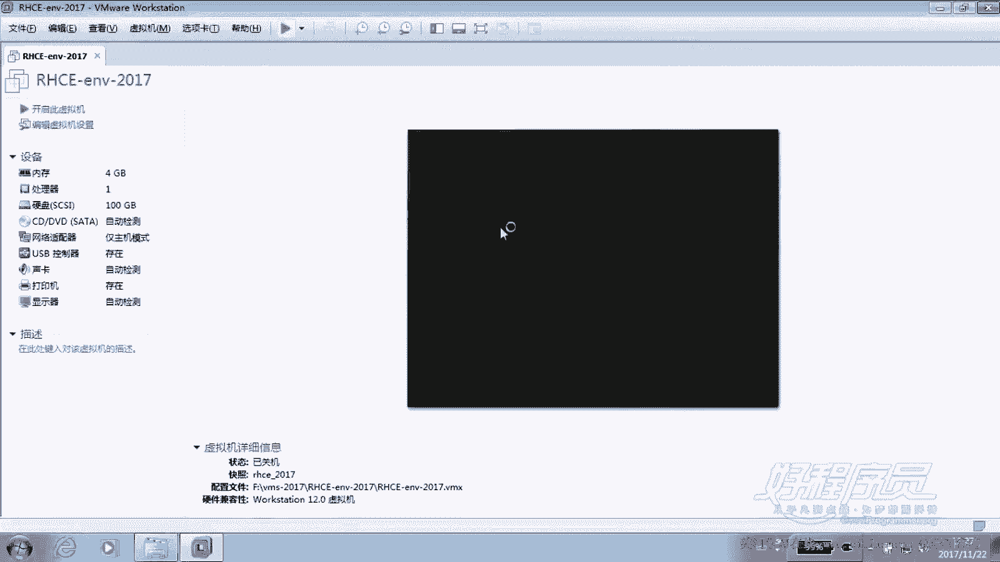

当时呢也只有一台服务器，而CE考试首先需要的是两台服务器，我们不需要破解这个IP破解密码，也不需要去设置IP。换句话讲，就是上来以后呢，我们直接做。但是呢很多同学会遇到第一个问题。

那就是他不知道这个密码是多少。

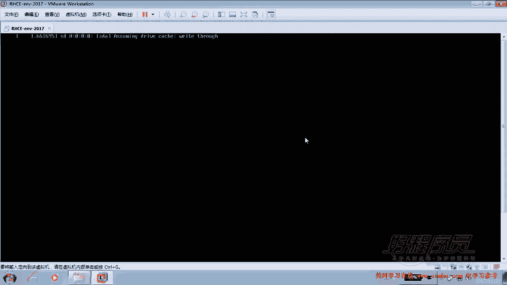

因此，我们在考试的时候，大家注意。他有一个考前的一个环境，也就是考试的一个环境。当然也是在也是属于他提的一部分。有一个考试环境。而这个考试环境里面呢，有好多信息是我们需要去拿到的。其中包括用户名密码。

也包括什么呢？就是ym。因为在下午考试实际上呢它没有一道题明确的说是让我们配ym这个环境。但如果说你不配置的话呢，嗯，那肯定呢没办法去装软件包。所以这些细节。但然这些细节我们在整个这个题看完以后。

带大家把整个题过一遍以后呢，我们会再详细的给大家去交代一下，有一些注意事项。

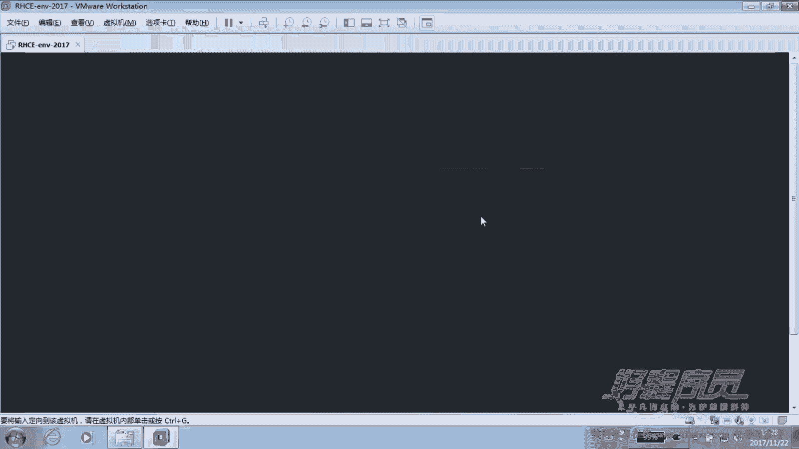

好，也就是说每次呢你如果说想要重新练习CE，那你恢复到CE这个环境就可以了。

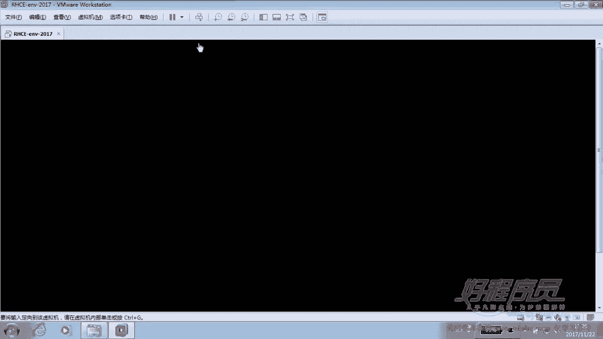

好，这边我们同样呢在。这个服务器上面我们还是以普通用户登录密码呢，大家都知道是readd hand。

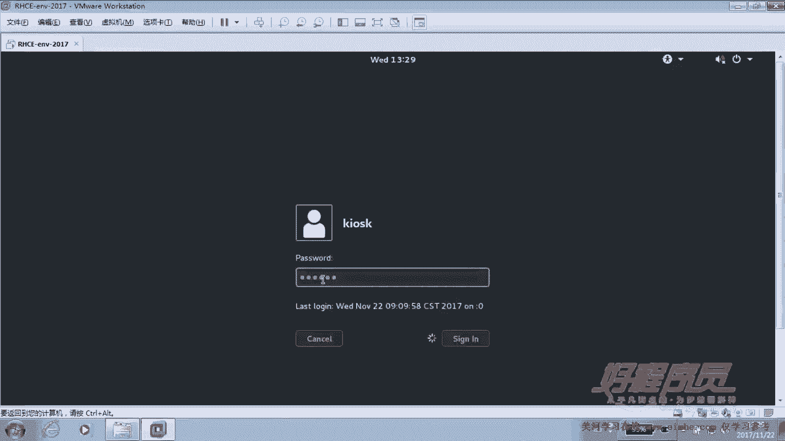

好，那么进去以后，我们首先要等待classroom这台服务器能够启动起来。因为只有它启动起来以后呢，才能够给我们提供一些学习用的一些呃，不是学习啊，就是考试用到的一些资源。包括我们在建设网站的时候，嗯。

会有一个网页啊等等等等。这些都是通过classroom服务器提供的。而classroom服务器呢，目前我们也可以看一下它有没有启动起来。

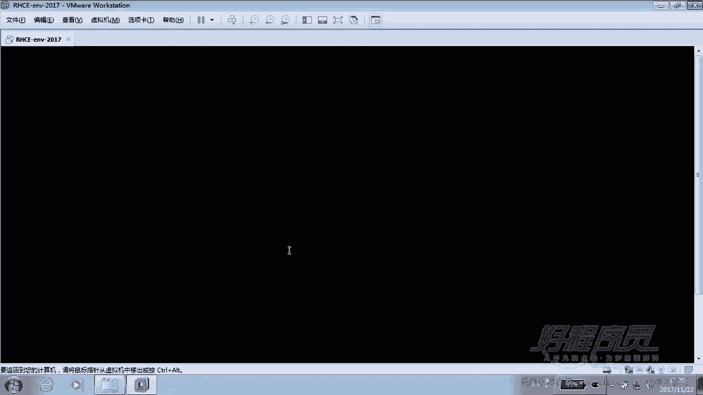

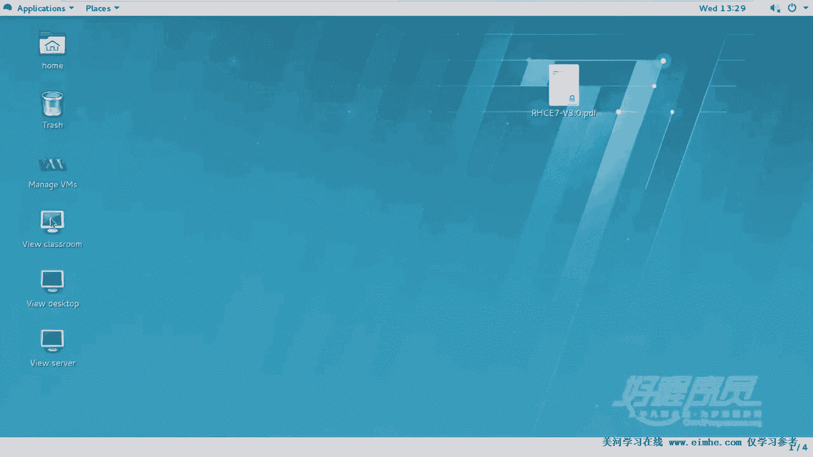

所以最好大家等待classroom这台机器能够启动起来以后，也就是到达这个登录界面的时候呢，我们才开始去做做题去启动。在默认我们去重置环境以后，这个classroom这台教室环境它是处于关闭的。

但是我们双击它就会启动。当然不双击它也会启动，但是这需要一个过程。🎼应该说准确的讲，就是在所操作所有这个呃class room已经完成以后呢，启动完成以后，我们才去做所有的题。

否则的话没办法去用到这个环境。好，这边等待一下。因为我们给的内存可能有点低。嗯，但是呢如果大家你的你的这台物理机啊内存比较高的话呢，你可以相对来说给的高一点。因为我这边嗯预设了一个4G内存。

也就是这台微微 world这台机器。最终里面会跑三个虚拟机，一个是class room。这个机器呢，当然我们不需要碰，它只是给我们提供了这种供了一个用到的环境。那么另外两个呢是我们要用到的。

因为我们刚才跟大家强调过CE考试是需要两台机器，一个作为sever，一个作为gd客户端。而且有很多题他们都是要求在两边做，可能是做了相同的操作，也可能呢是。左边ser作为服务器，而右边呢我们作为客户端。

比如说去挂载NFS挂载桑把的这个共享。好，稍等到这儿其实可以了，我们关掉就行了啊。然后呢我们再把那个sever和desktop启动起来。

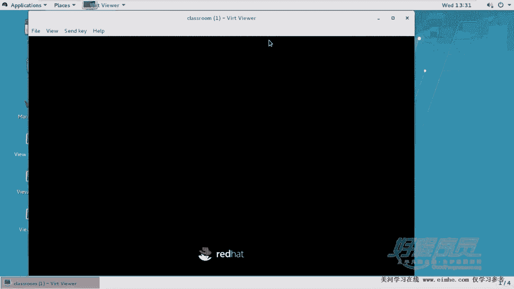

这个启动的方法呢，可以通过命令行的方式启动，也可以直接双击去启动也可以啊。那他它都会帮我们帮我们把它启动起来。好，首先我们来看一下这个考试题。

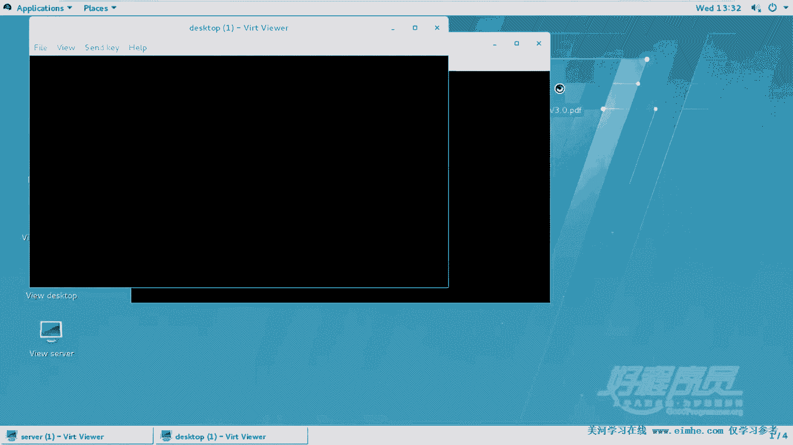

好，那这个考试题呢嗯首先是呢我要求各位，你平时在练习的时候呢，最好是能够在1。5小时之内圆满的完成，而且呢是没有错。那这边我也给大家提供了这种自测脚本。但这个脚本有一个小问题，就是呃我把这个题呢。

按照官方的考试，就拆成了拆成了很多道。但是我们的这个脚本呢可能在检查的时候呢，它只是比如说把某了某两道题，作为一个整体检查。那，基本上这个脚本给反映出90%到95%的这样一个信息啊。

没有办法完全的去反映出所有信息来。好的。嗯。在我们的模拟环境当中，servver零充当的是服务器，而destop0呢是客户端录的密码呢，这边告诉你了，不用你碰它。然后这个还有一个是什么情况呢？

在这个环境信息里面，它会告诉你服务器的名称啊，以及呢密码。另外还有一个是两台服务器的IP地址。那很抱歉，我这边没有给大家写两台服务器的IP地址，因为我们一会连接主机名，其实也是可以的。除此以外。

大家可能注意到还有两个域，两个域，一个叫example点com。这正是什么？我们这两台服务器他们所在的域。另外一个是叫correct点com或者OG，这个是24。3。0。那这两个域是干嘛的呢？

在之前我也给大家讲过，这个ZE考试其实它考的是什么？它考的主要思想或者主要的这样一个目标，就是去让我们实现各种服务的。安全。那这里的安全可能是基于用户的访控制，也就是某个用户能够以什么权限访问。

而某个用户不能访问。另外一个是什么呢？实现主机的安全。那么实现主机的安全，也就是指的是哪些批哪些网段能够访问哪哪些不访问。所以这边呢它模拟了一个坏人域，我们这边呢就叫做crrack点com这个域172。

24。3。0这个域这个网站。那它有很多题，有很多服务，像三把NFS都是非常明确的要求，只能是example点com这个域中的主机可以访问坏言之就是这个网段可以访问。

那另外呢很有有很多服务是明确拒绝corrb点com这个域中的主机，也就是172点24。3。0这个网段主机访问。所以这是给大家预设的一个环境。好人所在的域坏人所在的域。

所以我们可以在后面呢去实现这种基于主机的访问控制。当然实现的方式可以是什么呢？可以是防火墙，可以是早期的TCP，也可以是呃其他的像基于服务本身像NFS服务三服务。

那么他们本身就可以实现这种什么访问控制去拒绝或允许某个网段。那这边如果说你用防火墙实现的，可能给到的分数呢不一定是满分。所以我们要明确的知道考试的时候，他到底要什么。好，那除了这个信息以外。

还有什么信息呢？还有呢就是。会告诉你我们的亚源的位置。因为我们在这个考试的时候，嗯，在CE的这两两台机器啊，两台机器它里面默认是没有配置亚源的。但是呢它又没有明确的在题上，在题上面说我要亚源。

这个大家应该有印象。在我们的CSA部分呢，其实有配置亚米源。但是CE呢，无论是IP不你设置，因为设置过了，还是密码不用你改主机你不用你碰亚源呢，那得做。因为你们要做的话呢，是不能够去考试的。嗯。

这个环境里面还有一些信息，我们在接下来的后面边讲的时候边说，就比如说后面会有一个科verse的一个密码，这个密码是多少了？当然也会在环境里面告诉你。所以呢我们怎么那个连接这两台机器呢啊。

不用去那个打开台机器的终端了，直接打开一个标签，打开一个终端。

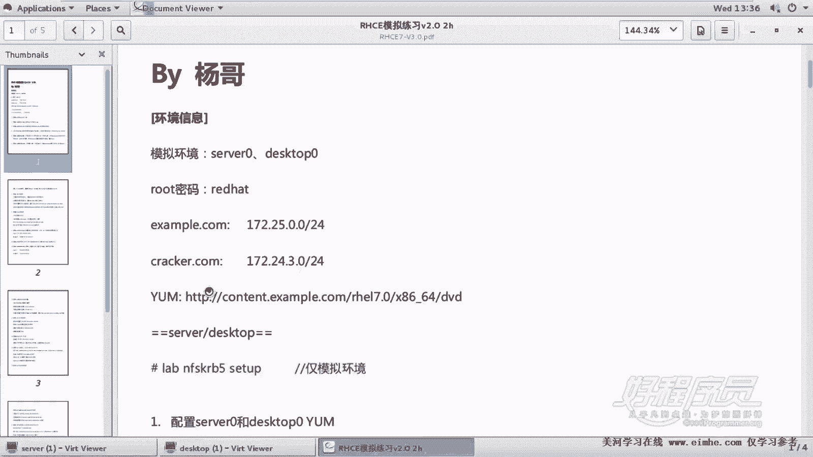

🎼这个终端呢我们打开一个标签，这个标签呢可以按文件table，也可以按shactrol加T考试的时候呢，我们好像只能按controrl shift加T的方式，来打开一个标签。好，那大家看到两个标签。

左侧的标签呢，我们大X各位应该还记得大X吧，它是连到远程补机，并且使用这种什么呃图形化的方式的这种能够使用图形的方式。

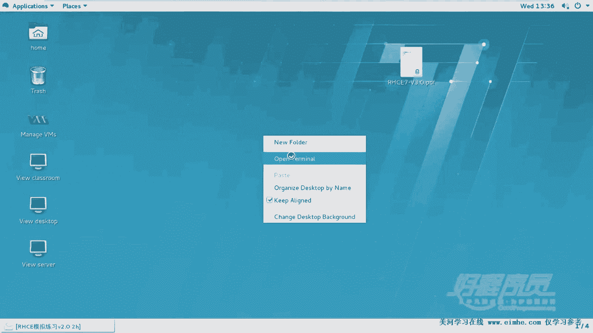

然后我们后面呢加上用户名root at。70。当然会有密码，因为我们这个练习环境，它本身呢那边已经已经帮我们把密码呢通过公钥的方式认证了，所以不要了啊，这是serv音。然后右侧呢我们SSH杠Xroot。

然后连到destop0。当然你也可以使用IP地址。好，这边我们看到已经连到两个主机。那左侧呢是我们的服务器，右侧是客户端，我们两个都是管理员账号，所有所以。我们在后面做题的时候。

一定要看清楚这个题到底是做在哪个哪个记忆上面，否则的话会出问题。好，这边呢我们要首先说的是。我们模拟环境里面呢有一些东西没有做好的。

我们需要在server机器和dessktop机器上面运行一个叫lebel NFSKRB5seta。这个大家应该在前面见过类似的操作。我们当时是创建了一个逻辑卷。当然这个环这个命令，听好了。

各位只限于模拟环境。在考试的环，考试的环境当中，一切已经准备好的东西都已经准备好了。所以在考试的时候是用你准备的，不用你准备什么东西的。那么它一切都有了。好，那我们下面呢在两个机器上。

各位两台机器都准备一下这个一些环境。lele。K那个NFK2B。随他。好，这边也是一样复置一下这条命令，可能有一个过程，因为它内部要装包，而且要把这个这个客户端呢，像我们之前讲的那个lap客户端一样。

加到ld里面去，并且要使用Cverse的方式进行验证。那它现在在配置这个coverse客户端和ld客户端。好。那我们稍等一下稍等一下，看看这个命令成不成功。如果这个命令不成功的话呢。

那么也就意味着你的环境准备有问题。那你有可能需要重新重置一下战机啊，然后呢这个去做。当然重置的方法呢，这边其实也给大家之前介绍过，我们打开一个终端，在这个。在我们那个命令行里面。好慢，因为这边在装啊。

我们可以通过RGT杠VM。有点慢，杠VM杠TDM。CTL。然后forest side后面加sever或者是什么dessktop这种方式重置，其实也可以。如果这种方式重置了的话呢。

啊建议大家恢复到我们的快照，反正是我们有两种手段去重置我们的练习环境。那么如果使用for set的方式重置的话呢，有一个好处就是你不用再等待那个class room那个机器，它慢悠悠的启动。

因为你的环境很快就可以搞可以搞定。好，说了这么多，其实现在还没有这个什么开始做好。那么我们在最后一小节段会会给大家去明确的介绍一下这个CE考试的一些注意事项。一些这个相应的注意事项。

比方说我们应该打开几个标签，我们应该先把什么东西记下来，我们应该遵循什么样的一个流程，这些都有一个规范和规则。因此呢这个这边暂时呢是只能够等待。好，我们等待一下它的结束，因为它啊这边已经结束了。

那怎么验证它是成功的呢？一个方法是IDLd user0，看看有没有这个账号有。然后最好呢再来看一下。呃，当然这个这是测试啊，其实觉得没问题的话呢，也可以不测。呃，如果大家记不住的话，就算了，就到这儿。

那么另外一个步骤是登录以后，输入一下科bo密码，然后来验证有没有个票啊，这个就所谓了。好，这边我们看看ID还有dap user里。好，如果能到这一步，基本上说明呢我们的环境已经就绪。

那接下来呢就开始可以去做题了，这是环境。嗯，然后呢有一道题呢，其实这道题呢，实际上它不不属于什么？它没有这道题，听好了，各位，它没有这道题。在真正考试的时候是没有这道题的。

没有这个s0呃s0和destop0的压配置。但是如果说你不做配置的话呢，你肯定过不去，因为你没有可软件包的位置。但是这个信息它同样在环境接受当中有，因此大家呢可以多一步哪一步呢配一下亚码。

当然各位也很清楚，我们这个练习环境当中，其实亚木呢已经就绪了，我们可以先把它删掉，然后我们人工的来创建一下这个下面的，比方说RGU7点rappo文件。这个我应该知道怎么写。然后是。啊，不是那个。

然后是R117。然后name等于RG要7。base URLRL等于刚才我复制的那个路径，然后GTCHECK不检查签名。好，那么你也可以把这段话整个复制出来，因为另外一个机器呢同样需要这个操作。好。

我们呢到该机箱去。刚才好像就在这边，好吧，所以很容易有时候很容易这个做错啊。好，这边我们也删一下，这个删除其实并不是有意的啊，是因为我们的练习环境当中本身亚目的这个配置已经就选。

所以呢我们为了我们手段练习一下啊，那咱们就把它删一下，来手动的配置一下。我再再次提醒各位，这道题本不存在于我们的题当中，但是它是一道隐形的题，你必须做，你不做的话呢，就过不去。好。

这边我们看到亚m的仓库正常，亚仓库正常。好了，到这儿到这一步呢，说白了我们其实还没有答对一道题只是把我们的环境准备好了。

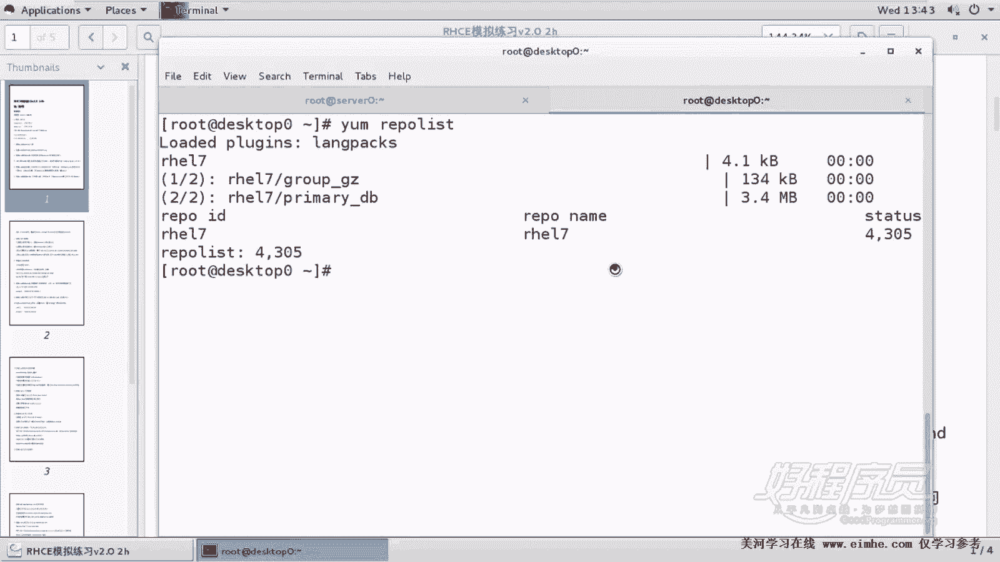