# RHCE课程：1：杨哥RHCE介绍及环境准备 🚀

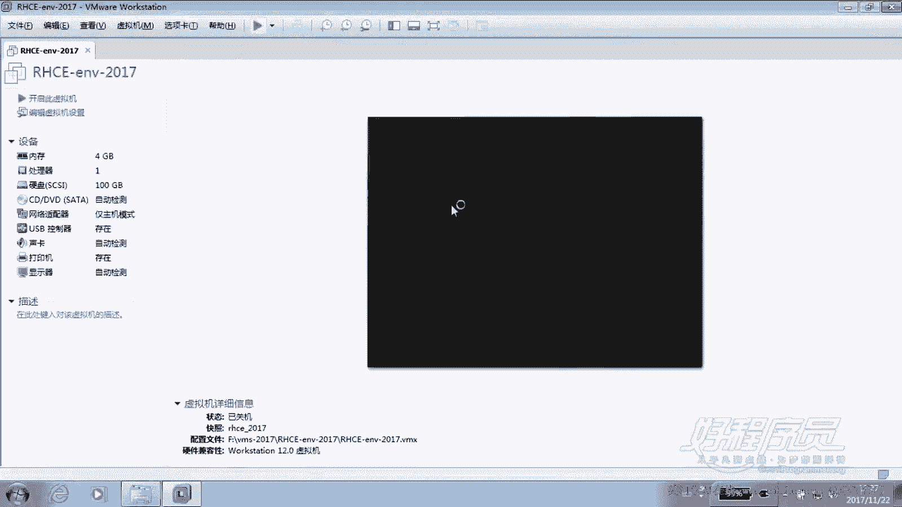

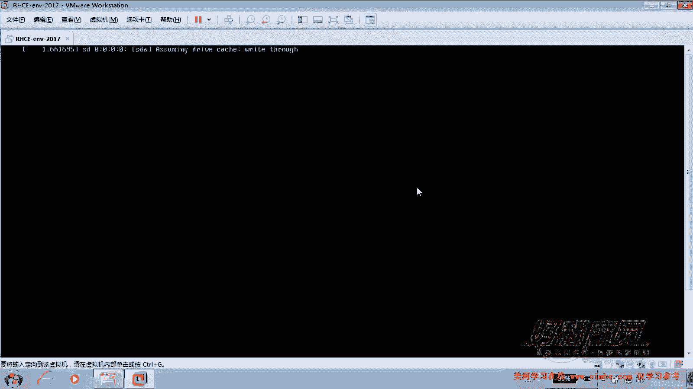

在本节课中，我们将学习RHCE考试的基本介绍，并完成考试环境的准备工作。我们将了解RHCE与RHCSA的区别，熟悉考试环境的结构，并完成必要的初始配置。

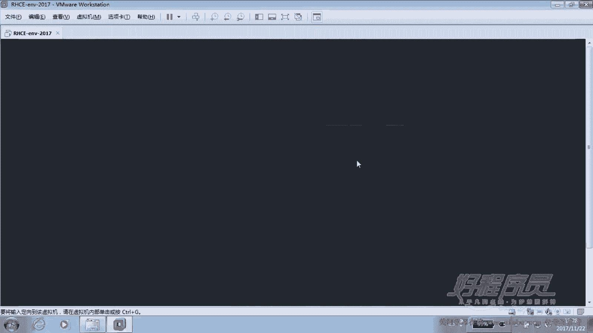

## 环境概述与差异

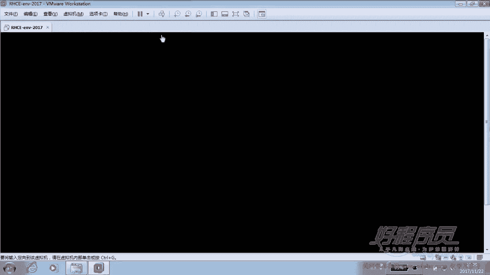

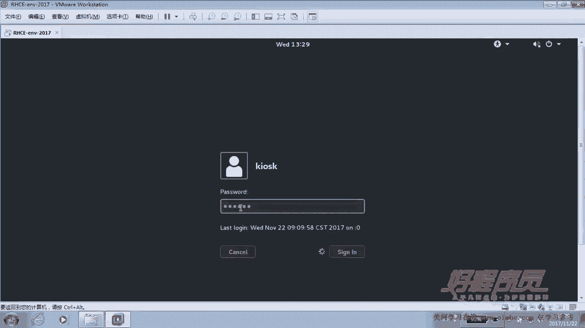

上一节我们介绍了课程背景，本节中我们来看看RHCE考试的具体环境要求。RHCE考试与之前的RHCSA考试存在一些关键差异。

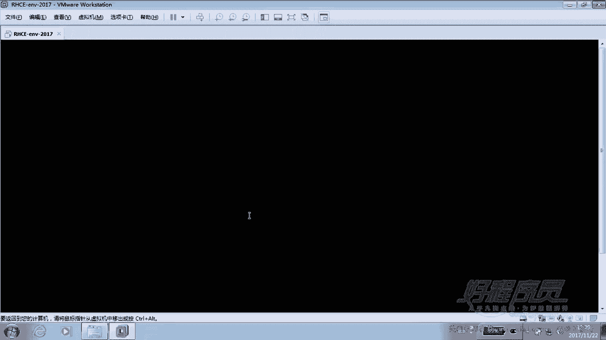

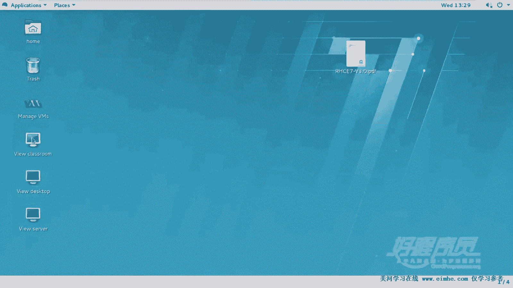

RHCSA考试要求考生破解root密码并设置IP地址，且考试环境通常只有一台服务器。而RHCE考试则不同，它需要两台服务器（一台服务器，一台客户端），考生无需破解密码或设置IP地址，可以直接开始答题。

然而，许多考生遇到的第一个问题是不知道登录密码。实际上，考试环境中包含一个考前准备环节，该环节会提供所有必要的信息。这些信息是考题的一部分，考生需要从中获取用户名、密码以及YUM仓库的配置信息。虽然在下午的考试中没有明确要求配置YUM的题目，但如果不配置，将无法安装软件包。这些细节和注意事项，我们会在完整过一遍题目后详细说明。

## 启动考试环境

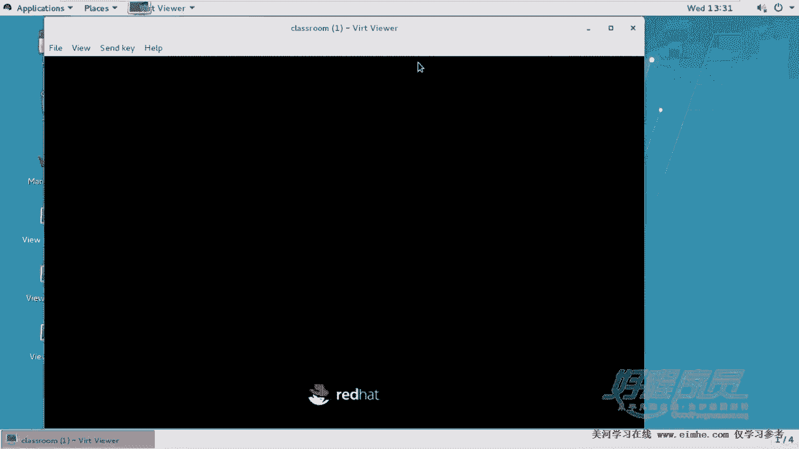

以下是启动和准备考试环境的步骤。

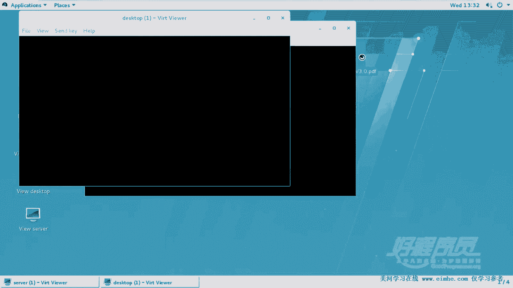

1.  **恢复考试环境**：每次练习时，需要恢复到“RHCE 2017”这个快照位置，以获取标准的考试环境。
2.  **登录控制机**：在提供的服务器上，以普通用户 `root` 登录，密码为 `redhat`。
3.  **启动Classroom服务器**：登录后，需要等待 `classroom` 服务器完全启动。这台服务器不用于直接操作，但它为考试提供了必要的资源，例如构建网站时所需的网页文件等。只有 `classroom` 启动完成后，才能开始正常答题。在默认重置环境后，`classroom` 处于关闭状态，需要手动启动或等待其自动启动。
4.  **启动考试服务器**：待 `classroom` 就绪后，启动 `server0` 和 `desktop0` 这两台考试用虚拟机。启动方式可以通过命令行或直接双击虚拟机图标。`server0` 充当服务器，`desktop0` 充当客户端。

## 考试题目与环境信息

上一节我们启动了环境，本节中我们来看看考试题目和预设的环境信息。在模拟环境中，`server0` 是服务器，`desktop0` 是客户端，登录密码已预设，无需更改。

环境信息中会明确提供以下内容：
*   服务器的主机名和密码。
*   两台服务器的IP地址（本教程中我们主要使用主机名连接）。
*   两个关键的域名：
    *   `example.com`：这是 `server0` 和 `desktop0` 所属的“好人”域。
    *   `crack.com`：这是模拟的“坏人”域（网段为 `172.24.3.0`）。
*   YUM仓库的位置。

RHCE考试的核心目标是实现服务的安全控制。这包括基于用户的访问控制（权限管理）和基于主机的访问控制（网络层面）。题目中会多次要求只允许 `example.com` 域（或对应网段）的主机访问特定服务（如Samba、NFS），并明确拒绝 `crack.com` 域的主机访问。实现方式可以是防火墙，但更推荐使用服务自身的安全机制（如Samba的 `hosts allow/deny`），以确保获得满分。

## 连接考试机器与初始配置

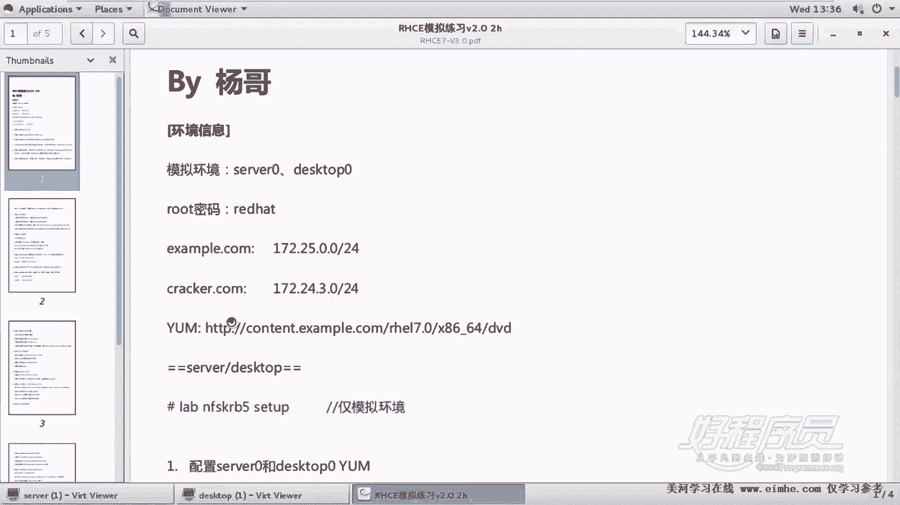

以下是连接考试机器并进行初始配置的步骤。

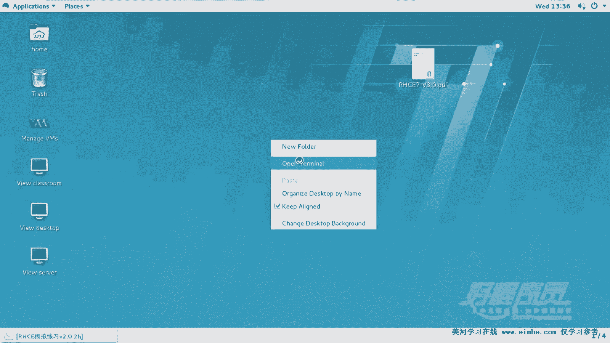

1.  **打开终端标签页**：在控制机上打开终端，并使用 `Ctrl+Shift+T` 打开两个标签页。
2.  **连接服务器**：在左侧标签页，使用以下命令以图形支持模式连接到 `server0`：
    ```bash
    ssh -X root@server0
    ```
3.  **连接客户端**：在右侧标签页，使用以下命令连接到 `desktop0`：
    ```bash
    ssh -X root@desktop0
    ```
    至此，我们同时连接到了服务器和客户端，并以root身份登录。

**注意**：我们的模拟环境需要额外运行一个初始化脚本，该步骤**仅适用于本练习环境**。在真实考试中，所有环境都已预先配置妥当，无需此操作。

在 `server0` 和 `desktop0` 上分别执行以下命令：
```bash
lab nfskrb5 setup
```
此命令会安装必要的软件包，并将机器配置为LDAP和Kerberos客户端。执行后，可通过 `id ldapuser0` 命令验证LDAP用户是否存在，以确认配置成功。

## 配置YUM仓库

虽然考试题目中没有明确要求配置YUM仓库，但这是一项必须完成的“隐形”任务，否则无法安装任何软件包。YUM仓库的地址已在环境信息中提供。

我们需要在 `server0` 和 `desktop0` 上手动创建YUM仓库配置文件。以下是配置方法（以 `server0` 为例，`desktop0` 操作相同）：

1.  删除可能已存在的旧配置（仅练习时需要）：
    ```bash
    rm -rf /etc/yum.repos.d/*
    ```
2.  创建新的仓库配置文件 `/etc/yum.repos.d/rhel7.repo`，内容如下（请将 `baseurl` 替换为环境信息中提供的实际路径）：
    ```ini
    [rhel7]
    name=rhel7
    baseurl=http://classroom.example.com/content/rhel7.0/x86_64/dvd
    enabled=1
    gpgcheck=0
    ```
3.  清理并重建缓存：
    ```bash
    yum clean all
    yum makecache
    ```

完成以上步骤后，环境准备就绪，可以开始正式答题。

---

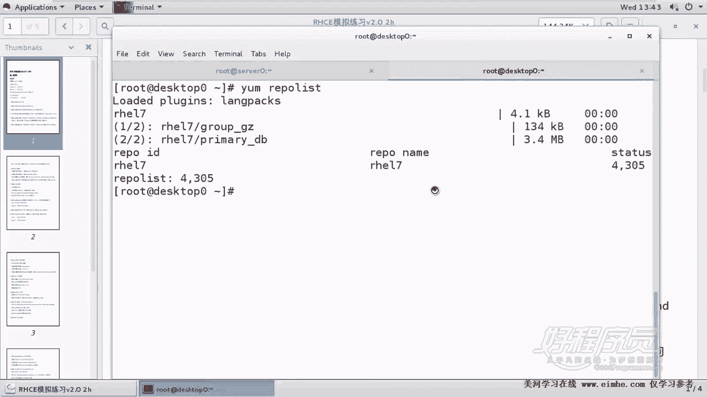

本节课中我们一起学习了RHCE考试的环境特点、启动流程、关键环境信息（如双域设计）以及必须完成的初始配置步骤，特别是YUM仓库的配置。这些准备工作是顺利通过后续所有实操题目的基础。在接下来的课程中，我们将开始逐题解析RHCE的考试内容。