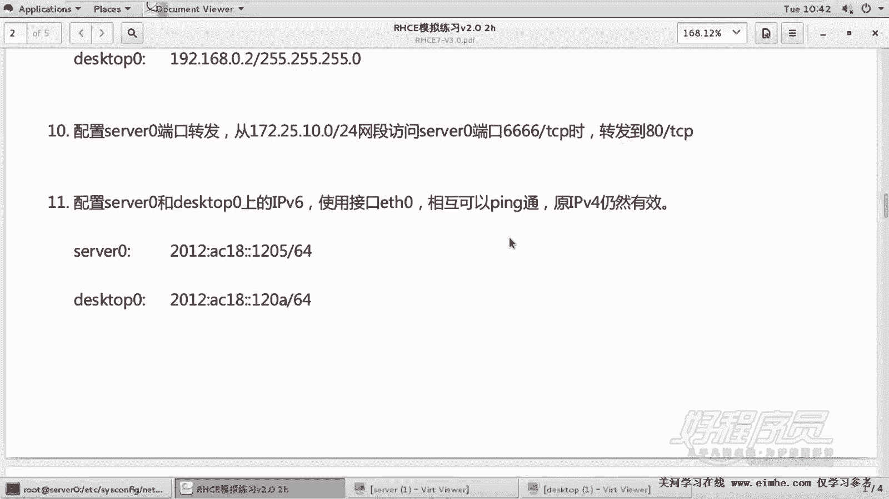
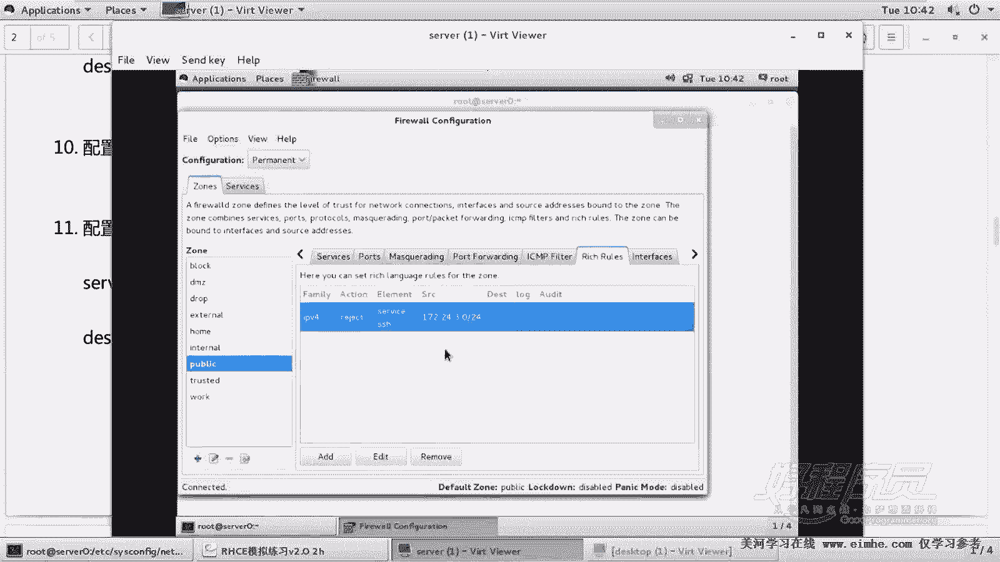
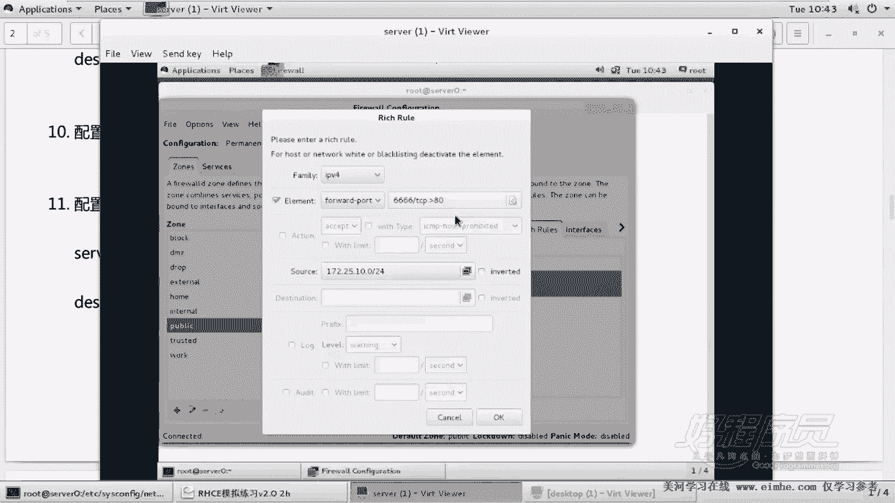
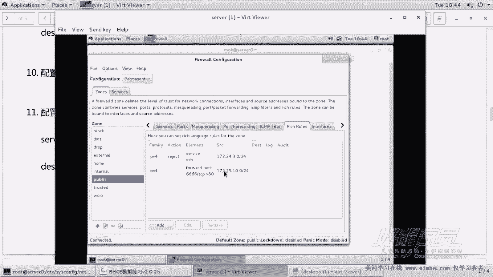
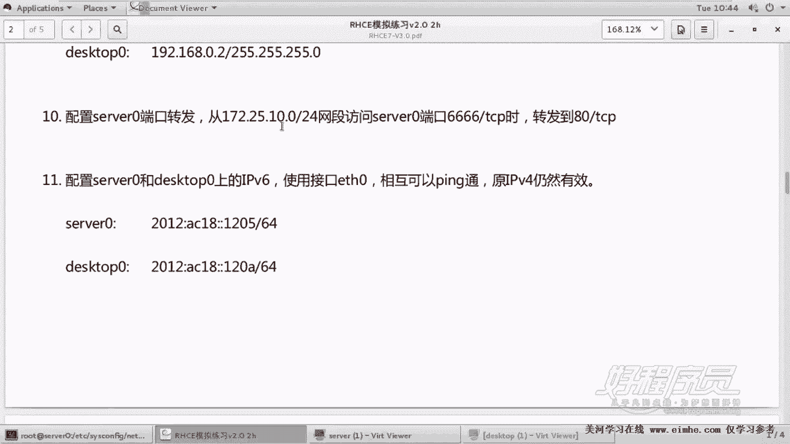
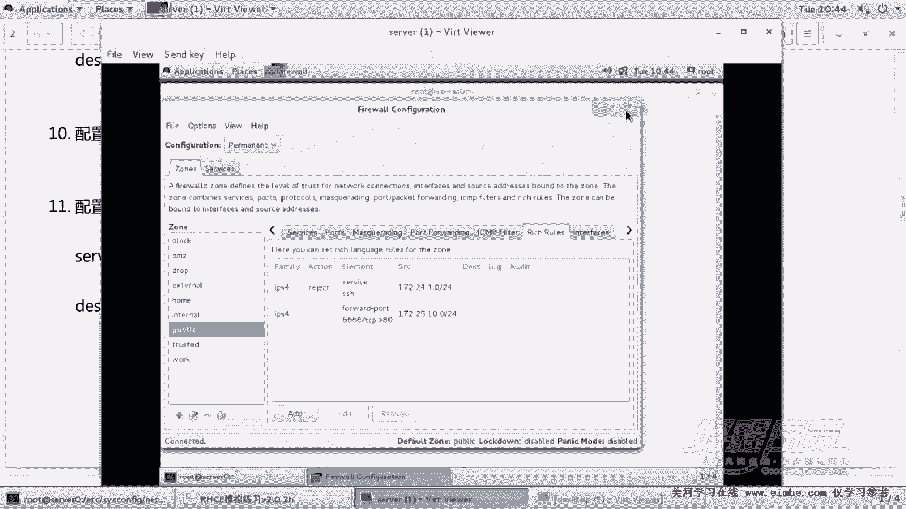
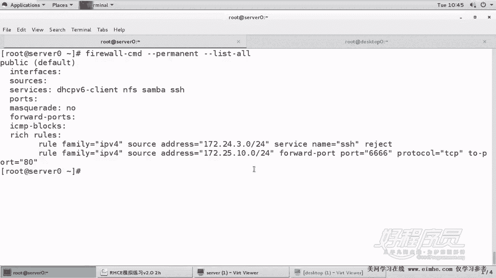

# 1. 杨哥rhce介绍及环境准备 - P10：10. Port Forward - 自普男 - BV1st411d7rF

。

好，我们接着来看后面内容啊。那么第十题呢其实是相对来说非常简单的一道题。它要求的是配置s0。记住啊，s0只配这个机器。它配置serv0的一个端扣转发，要求的是从。嗯，172。25。10。0。

各位可能你看到了，这不是我们所在的网段。所以呢。所以所以这块呢一定要注意，你不要顺手填成了我们所在的网段。从这个网段访问s0的端口，4个6的时候转到其80端口上面。当访问他4个6的时候。

转到其80端户上面，这个题其实没法测试的。因为现在我们没有做网站，我们只能把这个题呢做出来，然后看一下。好，保问4个6TCP4个6的时候转到他自己的，注意不是其他人呢，是自己的自己的80端位上面去。好。

这怎么做？同样的我们要靠防火墙。

我们找到server这个机器。通过faairwork config。好，那第一步呢我们是要将防火墙的配置呢改成永久模式，这个一定要记住永久模式。然后紧接着呢，我们找到副规则叫rich ruler。啊。

这是之前对SSH服务的一个拒绝，拒绝3。0网段。现在我们要加一个副规则，点击end。

然后找到IPV4，然后找到了元素是。是端口转发。forward port端口转发，然后再找到。后面这一项，当访问TCP466的时候。转到哪儿去呢？转到注意本地，而不是远程远程的远本地的80端位上去。

当然这里呢光这么做还不行，这样做的话是任何人访问4个6的时候，就任何主机访问4个6的时候都会转到80上去。那这边呢我们看一下。它有一个原地址的一个设置，原地址。这边是来自于172。25。10。

0-24网段，后面这边只能够写斜线mask这种方式啊，注意1725。10。0点OK。注意千万不要点反转，如果点了反转的话，就是取反的意思。这样的话呢就只能够只能够这个使网段访问。就除了时网段都拒绝。啊。

都都那个除了是网段都转发，那就达不到这个效果。好，OK。

各位来看一下。IRPV4family元素是端口转发。然后访问4个6，转到访问TCB4个6，转到TC80上去。然后原地址呢是来自于17225。10。0。我们来看一下题啊，17225。10。0OK是这个。

千万不要做错地方了。然后做好以后呢，注意我们要点击reload当前加载。当然如果是你忘了点re，其实也没有关系，为什么？因为你做的是永久配置，你最终的机机器是要重启的。因为重启以后。

如果你的这些保存你的这些配置还在的话呢，当然就是有分的。

好，我们来看一下这个题的结果。firerework干com，杠干proment杠杠list。哦。好，各位看到这边有两条非规则，一条是之前我们做的SSH那条，一条是这个就是当访问当原地址是这个网断的。

你确认一下，并且呢访问的是什么呢？是我们这个。4个6端口的时候，最后将其转到TCP。80上去。好，这道题呢我刚刚讲过没法测试，除非这上面做了一个网站，做了一个网站。呃，当然你也可以先简单的测一下。

也没关系。嗯。你在这边装一个网站，那也比较麻烦，你还要去配防火墙啊，之后只要去访问4个6的时候，就转到8顶上去。你需要做装一装一下网站，而且把网站服务起起来，而且需要什么呢？配防火墙啊，这个就先不做了。

大家这么做就OK了，这就是我们的端口转发。

