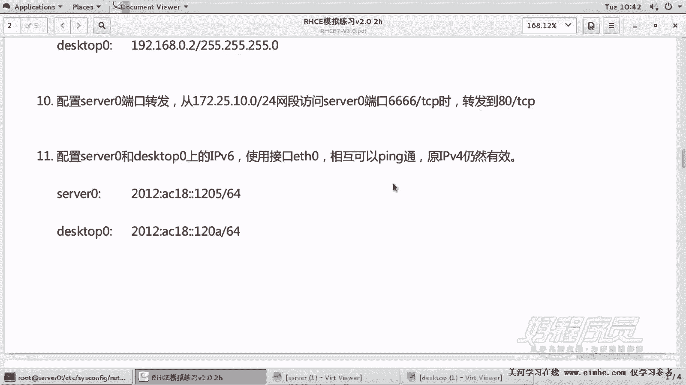
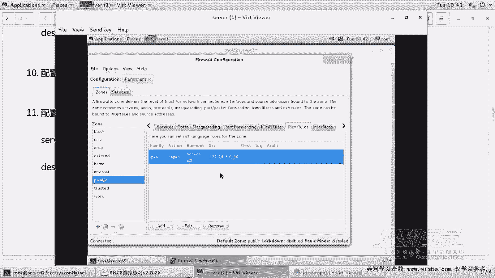
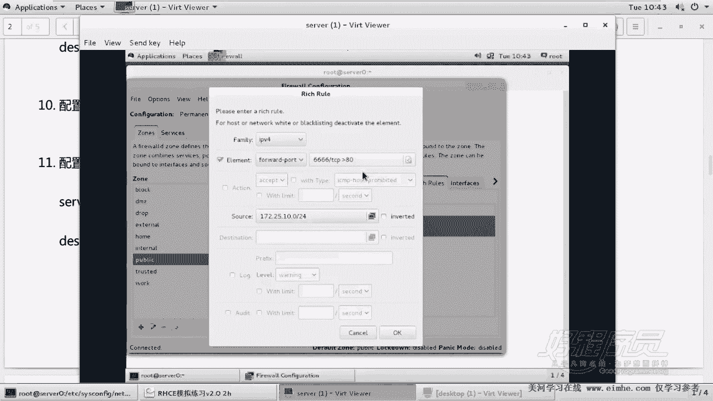
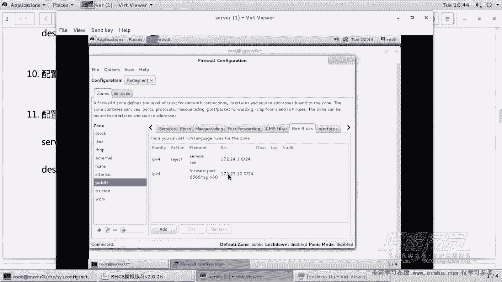
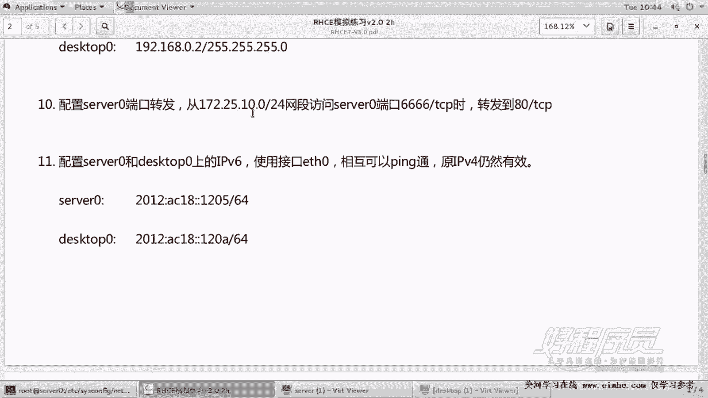
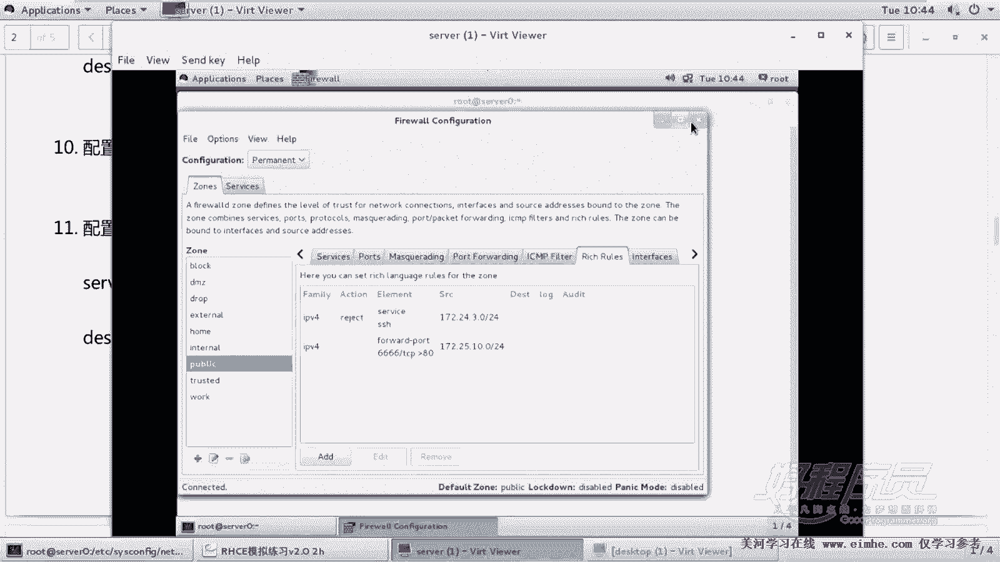
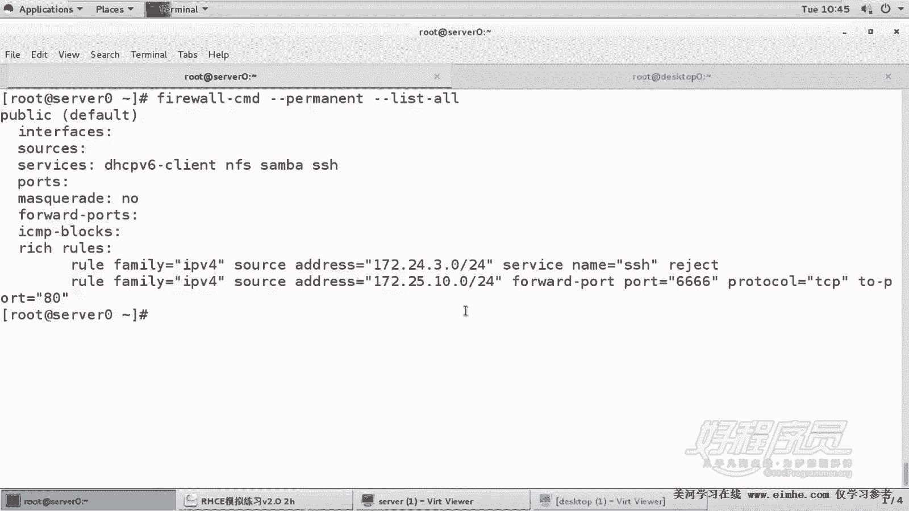

# RHCE课程：1.10：端口转发配置 🚀


在本节课中，我们将学习如何配置防火墙的端口转发功能。端口转发允许我们将到达服务器特定端口的流量，重定向到服务器自身的另一个端口上。我们将通过一道具体的RHCE考题来实践这一操作。

上一节我们介绍了防火墙的基本规则配置，本节中我们来看看如何实现端口转发。

## 考题要求



题目要求配置 `server0` 主机的防火墙，实现端口转发。具体要求是：当来自 `172.25.10.0/24` 网段的客户端访问 `server0` 的 TCP 466 端口时，流量应被转发到 `server0` 自身的 TCP 80 端口。

**核心概念**：端口转发规则。
**关键点**：规则仅针对 `server0` 自身，且源地址限制为特定网段。



## 配置步骤

以下是使用图形化防火墙配置工具 `firewall-config` 进行配置的详细步骤。

1.  **启动防火墙配置工具**
    在 `server0` 主机上，以 root 权限运行 `firewall-config` 命令。

2.  **切换到永久配置模式**
    在工具界面中，首先点击顶部菜单栏的“选项”，在下拉菜单中选择“永久配置”。这是确保配置在系统重启后依然生效的关键步骤。



3.  **添加富规则（Rich Rule）**
    在“区域”选项卡下，找到当前激活的区域（如 `public`）。点击下方的“富规则”选项卡。这里会显示已有的规则，例如之前配置的SSH拒绝规则。

4.  **创建新的端口转发规则**
    点击“富规则”区域下方的“添加”按钮。
    *   **规则系列**：选择 `IPv4`。
    *   **元素类型**：选择 `Forward port`（端口转发）。
    *   **端口和协议**：
        *   **端口**：填入 `466`。
        *   **协议**：选择 `tcp`。
        *   **转发至端口**：填入 `80`。
        *   **转发目标**：选择 `Local port`（本地端口），表示转发到本机。
    *   **源地址**：
        *   勾选“源地址”复选框。
        *   在地址栏中填入 `172.25.10.0/24`。**务必注意**，此处填写的是考题指定的网段，而非实验环境的默认网段。
        *   **切勿勾选“反转”**。如果勾选，规则将变为“除了此网段以外的地址”，这与题目要求相反。





5.  **保存并重载配置**
    规则添加完成后，点击“选项”菜单，选择“重载防火墙配置”。这会使新的永久配置立即生效。即使忘记重载，由于配置已保存为永久规则，在考试系统重启后，规则依然有效。

## 验证配置



配置完成后，可以通过命令行验证规则是否已正确添加。

执行以下命令查看所有永久配置的规则：
```bash
firewall-cmd --permanent --list-all
```
在输出的 `rich rules` 部分，你应该能看到类似以下的新规则：
```
rule family="ipv4" source address="172.25.10.0/24" forward-port port="466" protocol="tcp" to-port="80"
```
这条规则清晰地表明了：来自 `172.25.10.0/24` 的、目标为 TCP 466 端口的流量，将被转发到本地的 TCP 80 端口。

## 关于测试的说明

在当前的实验环境中，此配置无法直接进行功能性测试，因为 `server0` 上并未运行 Web 服务（监听80端口）。若要完整测试，需要额外安装并配置 Web 服务器（如 Apache httpd），并确保其防火墙允许80端口的访问。考试中，通常只需按要求完成配置并通过 `firewall-cmd --permanent --list-all` 命令展示出正确的规则即可得分。



本节课中我们一起学习了防火墙端口转发的配置方法。我们使用 `firewall-config` 工具添加了一条富规则，实现了将来自特定源网段的、访问指定端口（466）的流量，重定向到本机另一个端口（80）的功能。重点在于准确设置源地址、端口号，并确保配置在永久模式下进行。