# 1. 杨哥rhce介绍及环境准备 - P11：11. Ipv6 配置及注意事项 - 自普男 - BV1st411d7rF

好，接着我们来看这个下一道题。那，这道题呢也非常简单，就是配置2个IPV6的地址，在serv0和desktop0上面配置IPV6地址。嗯，要求的是呢必须配置在ETH0上面，而且能够相互拼通。

而且原来的IPV4的这个。地址依然是有效的，所以要注意原来的IPV地址依然是有效。好，这边呢我们由于呢各位由于我再强调一遍，远端如果能够远端连接。

我们就直接在这边通过NMcolction edit就可以了。能不能连接我们看看啊。好，双击一下它吧，双击一下stem0。这个连接还是有问题。这个是。挺痛苦的。考试要遇到这种情况，也挺悲哀的。

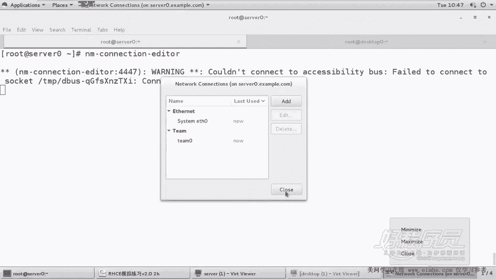

还点关不了了。好，先不管他来这边。NM杠。Connection editor。在我们的E贴指您上面双击或点编辑都可以。这边除了IP4以外呢，还有1个IPP6。在IPP6上面呢，我们选择手动。

然后添加一个地址，这地址多少呢？对不起，复制不了，因为这是虚拟机。如果说你能从外端去连接的话呢，是能够复制的，所以我们只能够老老实实的去敲了。现在。

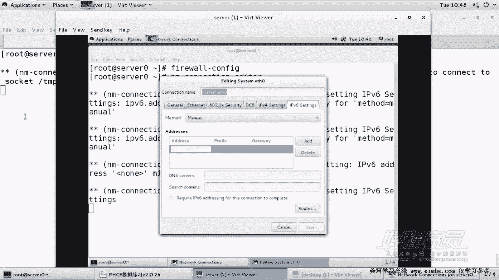

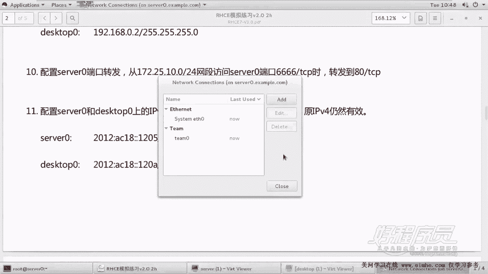

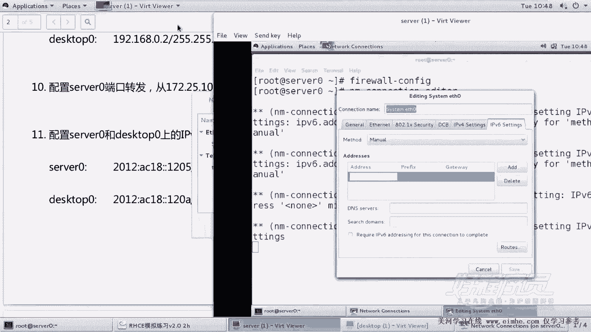

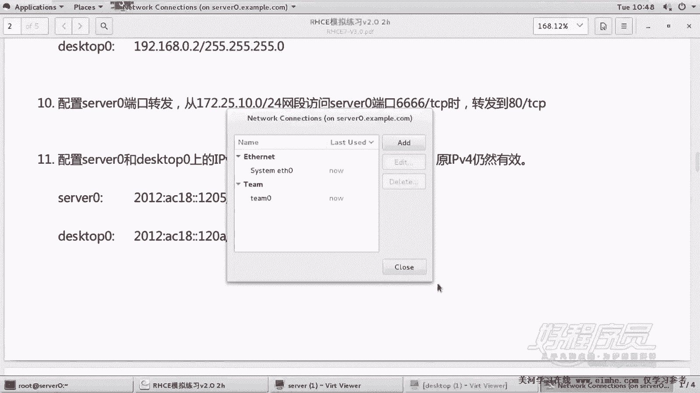

这关不掉。好，敲一下吧。2012。冒号AC18。冒号冒号1205，注意同样不要搞错地方了，掩码呢是64。保存。保存。当然还没有生效，别着急。呃，C号的方式呢我们是需要重新加载的。

加载的方式呢是在客户端这边。

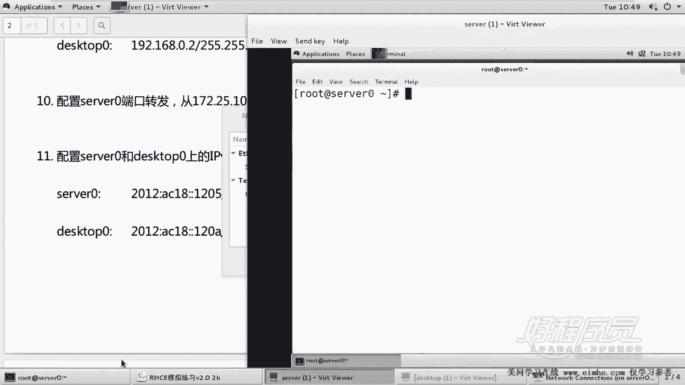

好，我们重新连接一下啊。conttrol shift加T打开一个新标签。换个位置。好，刚才我们的IP各位看到那个EPS0上那个IP其实没有生效的。所以我们需要重新加载一下NM collection呃。

comcom line collection，然后去。up一下，其实按理讲应该先当一下这个地址，然后再再做一个这个up。啊，可以也可以直接app就行了。

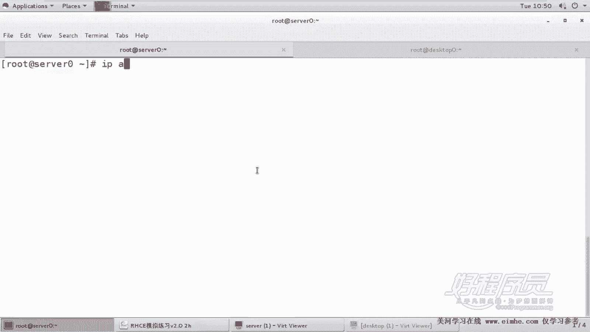

看一下。2012AC18冒号冒号1205OK可以了。来来到2号机做同样的类似的动作，只是IP地址不一样。

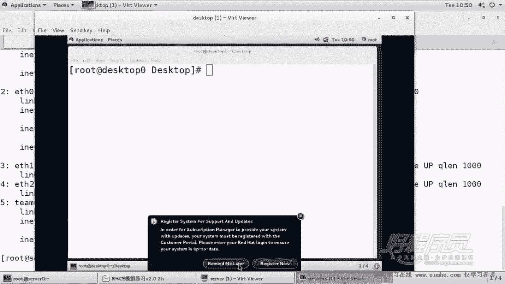

这个是。2012AC18120A。

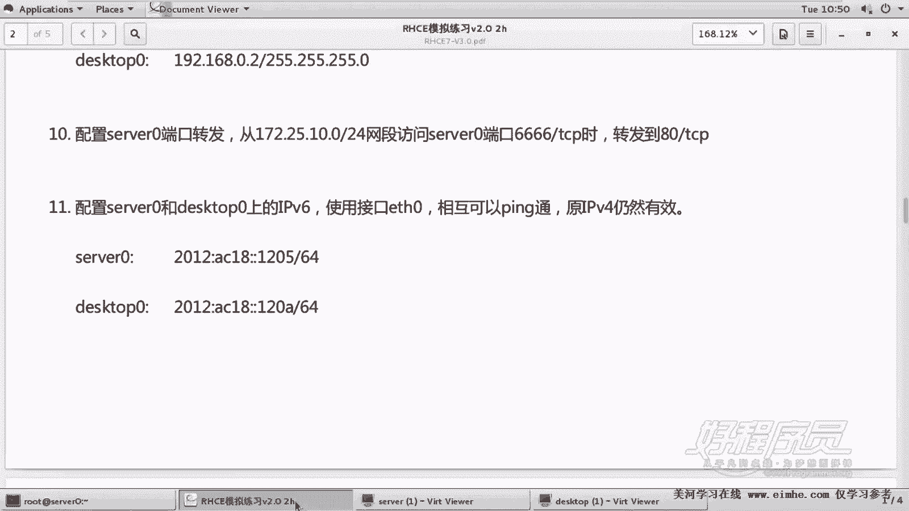

一定是E天使0，不是编辑其他的啊。找到IPP6，然后找到手动，不要去碰人家原来IPV4地址。2012。AC18冒号120A。

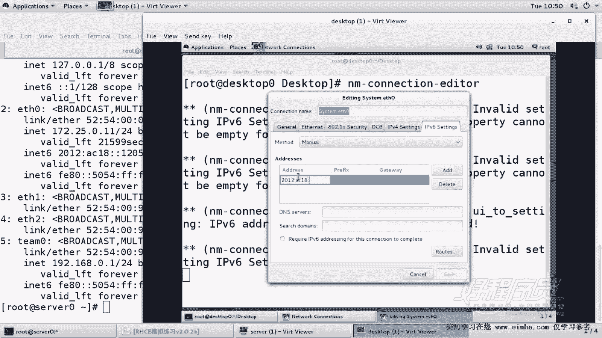

64的野马。20哦少了个冒号。好了，那我们就统一在远程来远端来重载吧。NMcollection。然后是。up一下，当然最好是荡一下，荡一下，你要注意，你这么回车就完蛋了，你远程就掉了。

一定要像这样敲两行呃，敲到一起。考试的时候呢，它就叫Eage0，没有system0。所以呢这还是比较简单的，最好先荡一下，然后再up一下啊。好，这边我们看到IP地址有没有2012AC18120A有。好。

然后呢这边嗯。我们来拼测试一下这里的拼呢，大家注意用的是拼6。P6啊，他自己的IP是。我们先听一下自己。自己肯定没问题。1205呢。大家看也没问题，来从这边拼一下，拼6。好，这都没问题。好。

说明这道题呢都是OK的，没问题啊，非常简单。

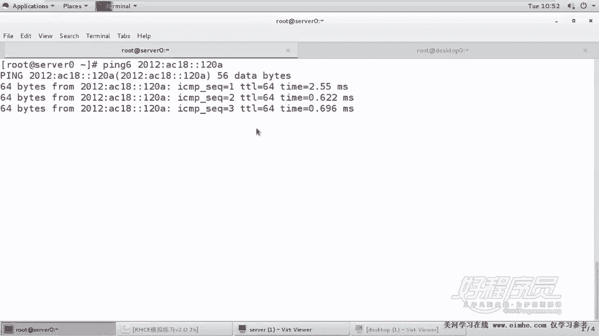