# 杨哥RHCE课程：P11：IPv6配置及注意事项 🌐


在本节课中，我们将学习如何在两台主机上配置IPv6地址，并确保它们能够相互通信，同时保留原有的IPv4地址配置。

上一节我们介绍了其他网络配置，本节中我们来看看IPv6的具体配置方法。

## 配置步骤

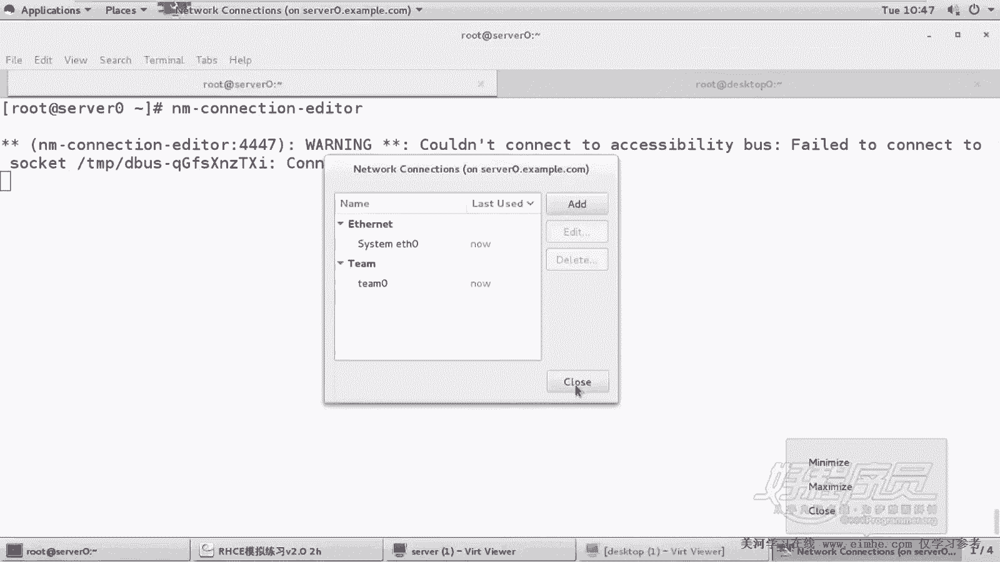

以下是配置IPv6地址的核心步骤。

1.  在 `server0` 主机上，编辑 `eth0` 网卡的连接配置。
2.  在配置界面中，找到IPv6设置部分。
3.  将IPv6的配置方法改为“手动”。
4.  添加指定的IPv6地址：`2012:ac18::1205/64`。
5.  保存并退出配置界面。

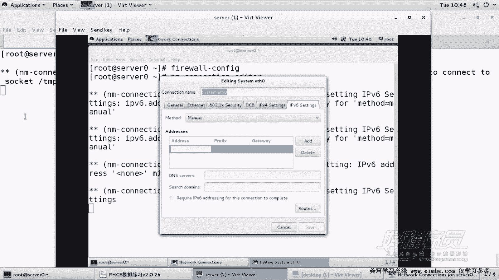

配置完成后，需要重新激活网络连接以使配置生效。可以通过以下命令完成：

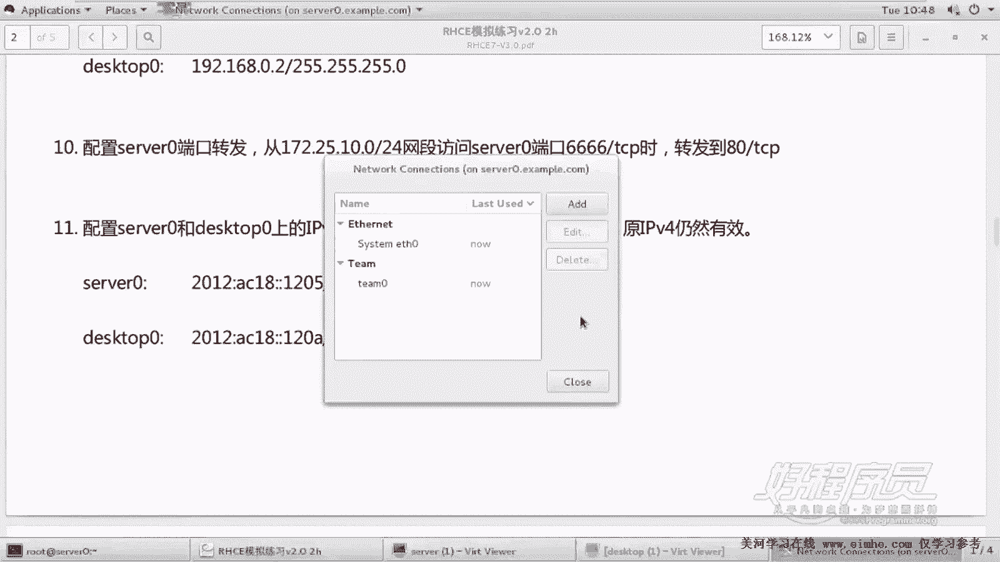

```bash
nmcli connection down eth0 && nmcli connection up eth0
```

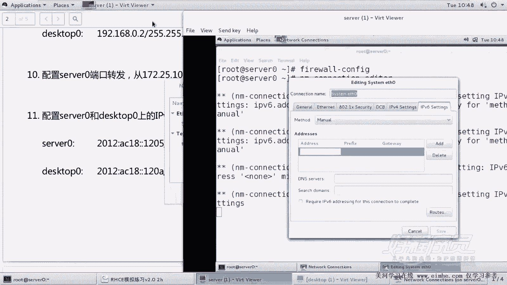

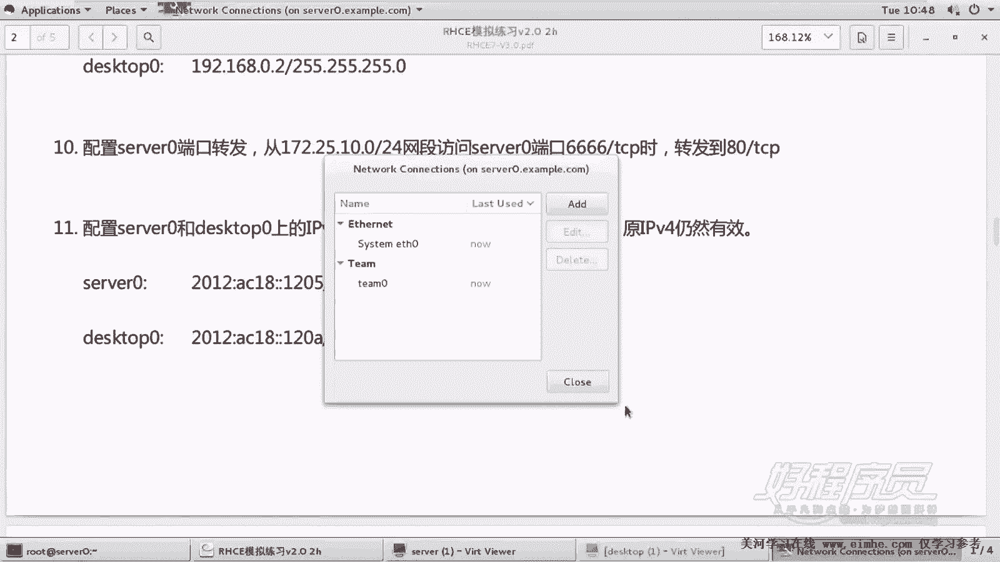

请注意，在远程连接时，应将 `down` 和 `up` 命令写在一行执行，以避免网络断开导致连接丢失。

接下来，我们需要在 `desktop0` 主机上执行类似的操作。

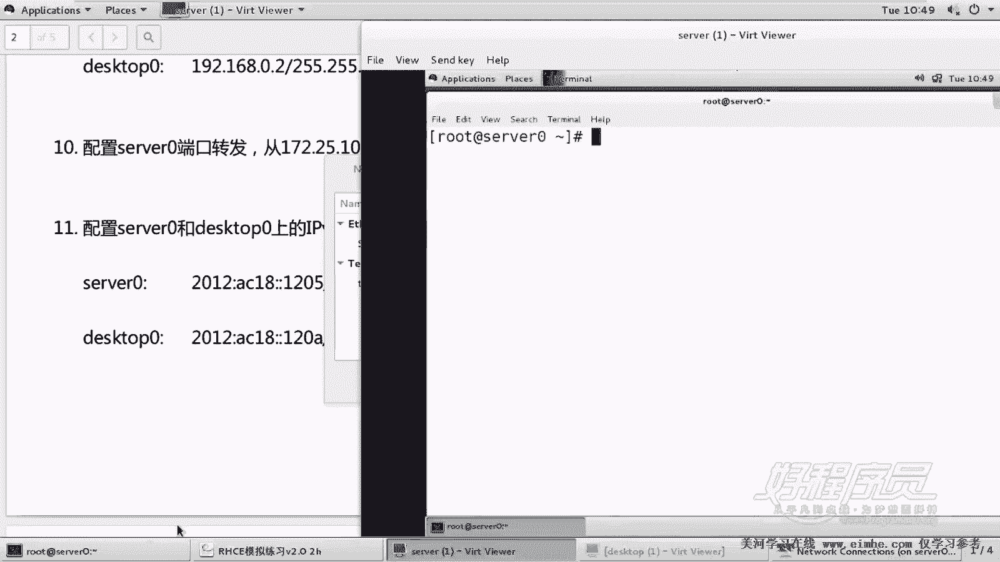

1.  同样编辑 `desktop0` 主机上 `eth0` 网卡的连接配置。
2.  在IPv6设置中，选择手动配置。
3.  添加指定的IPv6地址：`2012:ac18::120a/64`。
4.  保存配置。

同样，使用命令重新激活 `desktop0` 的网络连接。

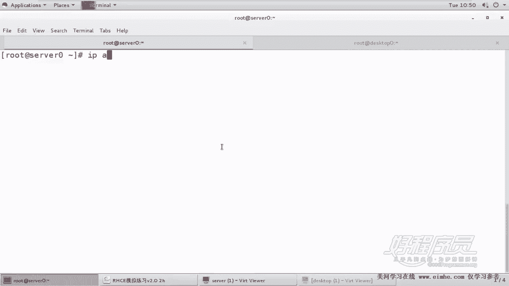

## 连通性测试

配置完成后，需要测试两台主机之间的IPv6连通性。测试时需使用 `ping6` 命令。

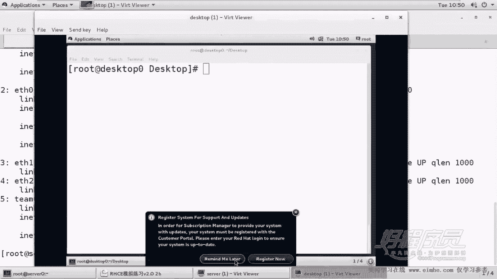

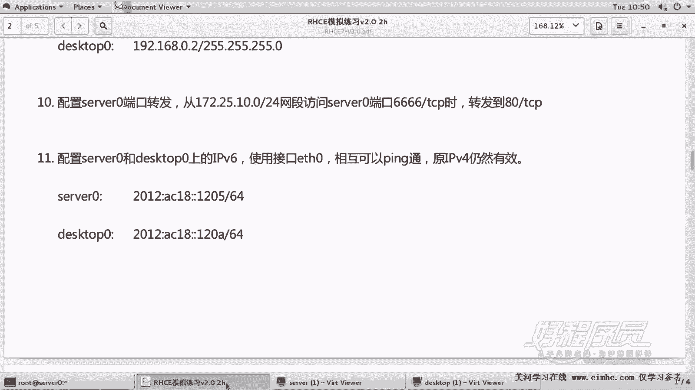

首先，在 `server0` 上测试到自身的连通性：
```bash
ping6 2012:ac18::1205
```

然后，在 `server0` 上测试到 `desktop0` 的连通性：
```bash
ping6 2012:ac18::120a
```

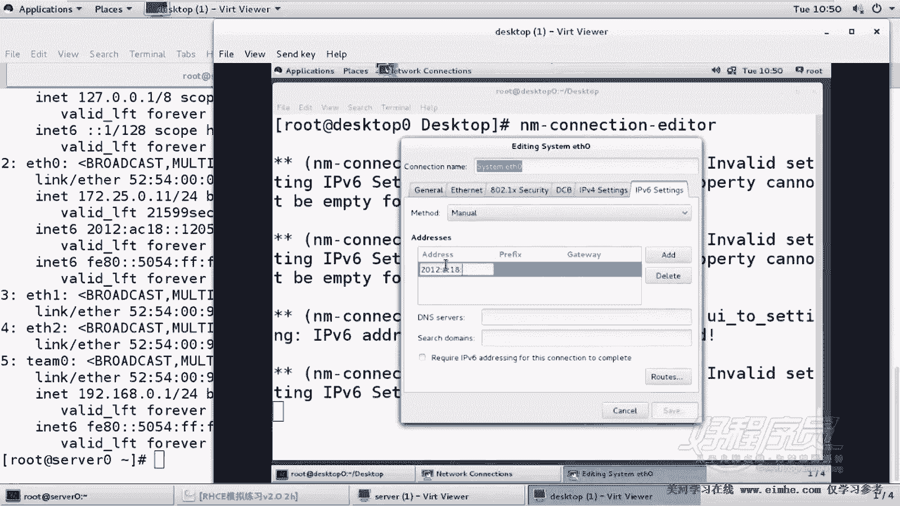

反之，在 `desktop0` 上也需要进行相应的测试。如果双向 `ping6` 测试均能成功，则证明IPv6地址配置正确且网络通畅。

## 注意事项

在配置过程中，有以下几个关键点需要注意。

*   **保留原有配置**：在配置IPv6时，**不要修改或删除**原有的IPv4地址配置，需确保两者共存。
*   **使用正确命令**：测试IPv6连通性时，必须使用 **`ping6`** 命令，而非普通的 `ping` 命令。
*   **地址格式**：输入IPv6地址时，需注意冒号 `:` 的分隔和缩写格式，避免输入错误。
*   **远程操作**：若通过远程连接配置，重启网络连接时，务必使用 `down && up` 的组合命令，以防止连接中断。

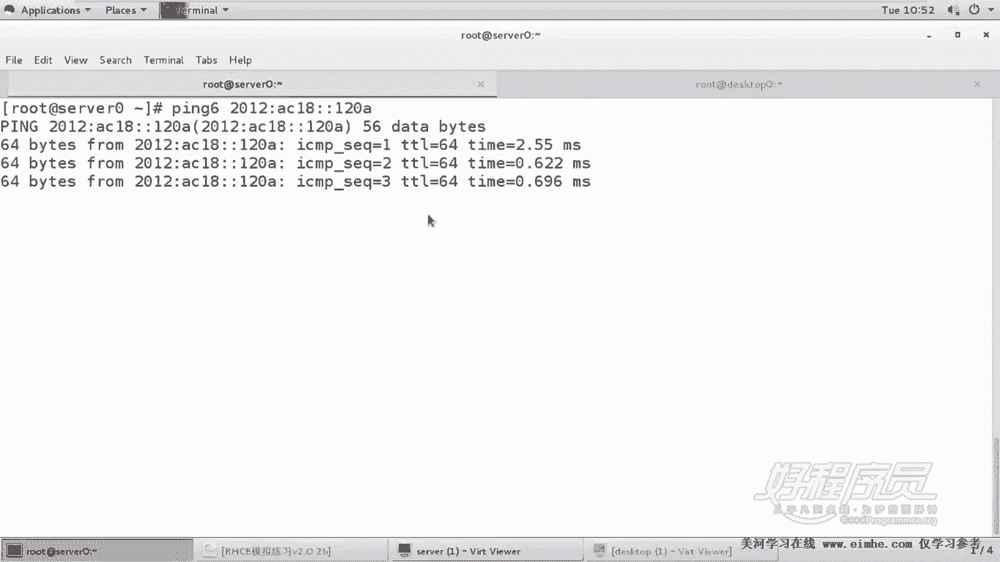

本节课中我们一起学习了如何在RHEL系统上为两台主机配置静态IPv6地址，并确保其能与原有IPv4地址同时工作。我们掌握了使用图形化工具或 `nmcli` 命令进行配置的方法，以及使用 `ping6` 命令测试IPv6网络连通性的技巧。记住配置过程中的注意事项，即可顺利完成相关任务。