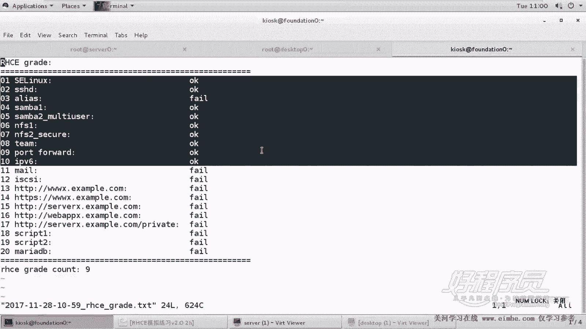

# 1. 杨哥rhce介绍及环境准备 - P12：12. 杨哥脚本阶段测试 - 自普男 - BV1st411d7rF

好，我们下面已经完成了很多道题了，我们来做一个阶段测试啊，我们再打开一个标签。这边是之前我们测试的时候呃，测试的时候留下的一些痕迹吧。然后这边我们来测一下。ICE。但是这个脚本它和题不是一一对应的。

因为之前有些题我是分开的，像那个NFS，我就分为分为那个常规的和和那个基co的两种。而且这个脚本呢我们看到。他他他测试的速度呢，这个是有点慢，因为有很多道题，包括后面的题他也在检查。好。

最后产生了一个文件。201728。好，3把一别名都失败了吗？三百。三马懿没有挂载，我们看一下。哦，不是这个机器啊。是这台机器。哦，38一没有挂。对，381我们没有没有那个当时没有挂载，嗯。

是在考试的时候也不也没有要求挂载。但是这边呢我们检查题的时候有一个要求挂载，笔名怎么也失败了，阿法S2也是失败了。端口转发端口转发失败的是有原因的。什么原因呢？是我看一下我的脚本啊。

我的脚本里面端口转发，也就是。IP forward。IPSORW。第几题你看。哦，这个地方是第二个失败，是因为我挂载点的位置当时改掉了，改成了这个。安门地下的。哎NFSSECURE好。

这个脚本呢我们也改动一下。NFSICCURE。下面这儿也是一样。嗯，SECURE。嗯，再看一下。端口转发哦，这边是这样的。这边测的是。172。25点。10。0，然后是。端口转发访问666的时候转到。

巴0上去。好，我们再来走一遍。新点TST。因为这个题我也经过很多次改版，所以脚本这块呢也是在也是在做一些变化。包括这个每次考试呢，我会做一些这个。变化。啊，稍微等待一下。有些题我们要知道为什么是错的。

而且是不是因为脚本检查错了，还是因为我们自己做错了。好，2017。好，各位看到现在就看的顺顺畅多了。但是第一个桑ma没有挂载了，是因为确实没有挂。因为我们。我们这个题上没有挂，但是如果你要挂上的话呢。

当也没问题。你看mount。当时在哪挂的，是杠。杠O，然后usose等于。嗯，Ld user一密码是多少呢？House。好，知道了，是天语音。s0下的N那个。3把一挂到MNT。吓的。

是31还是SMB1SMB。挂到最下面的SMBE上面。好，还没有建这个目录。那这个呢是。考试的时候呢是不需要做的。但是这边呢，由于我们脚本检查，你只有挂上我才能知道成绩。所以你可以像这样挂上。

你挂上以后呢，我再如果再检查的话呢，就成功的。来，我看那个角PS6。这怎么是失败的？哦，我知道了。这个脚本里面呢有一地有的地方是。我们再改下脚本。别名检查别名检查我用到的是脚本叫。PS加这个这个这个。

我们看一下是不是有这个吗？

哦，还不一样，这边不是加号哦。空格PS空格加杠。如果这个过滤出来的OK如果这个过滤出来O。是两个机器都有问题吗？PS6。哦，是B机器有问题，这个B机器怎么呢？我们看一下脚本没有问题，是B机器的问题。

我们找到B机器B机器大家看到之前做的那个PS6。哎，可以呀。那A机器呢？PS6。好，这家伙怎么会检单失失败的？本来这个命令是有的啊。好，这个就我们稍后再来看一下啊，反正是我们自己知道是OK的。好。

再把脚本呢再来。跑一下啊。我把这个删了，我不喜欢原来的成绩，看起来挺痛苦的。由于三把一不需要挂载，所以我脚本检查是检查不出来的那如果你想要脚本检查的话呢，你把三把一呢也挂一下。

这样让脚本呢能够知道脚本我们在检查的手段是最后去看你能不能挂上，最后有没有挂上这个行为。我没有帮你去挂载，我只是帮我只是看看你挂的这个结果是什。好了，看起来都OK了。那别名呢我们自己也测了。

我后面来看一下这个脚本，为什么对别名不感冒啊。好，这边我们都测试都没问题。就基本上现在到目前为止呢，第十道做了十道题就已经成功了。

都都是最后是成功的。除了3把一，我们要求你手动挂一下以外，呃，除其他的呢都没问题。因为三八一呢在考试的时候是不让是没有要求挂载的。好，这就是一个阶段测试。

