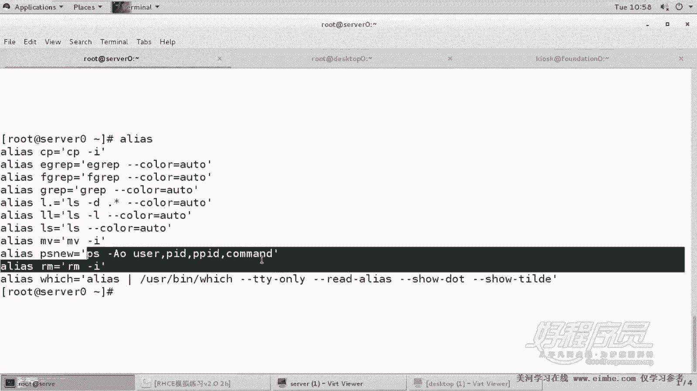
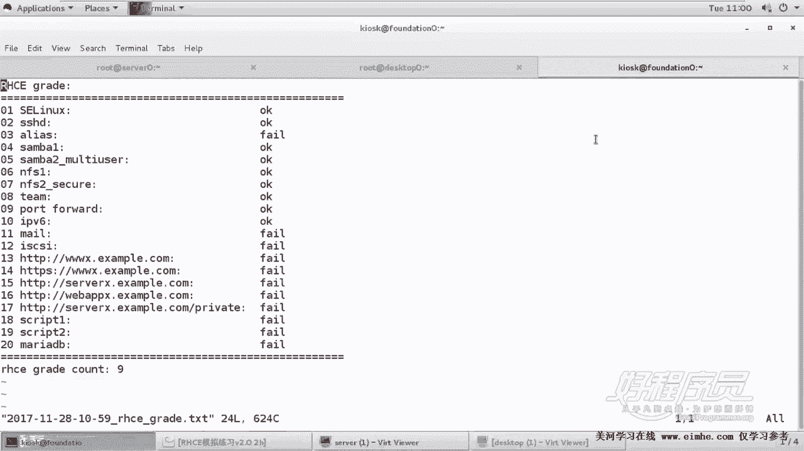
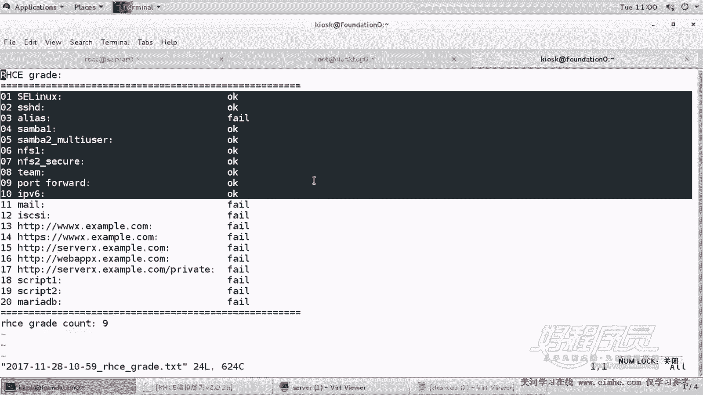
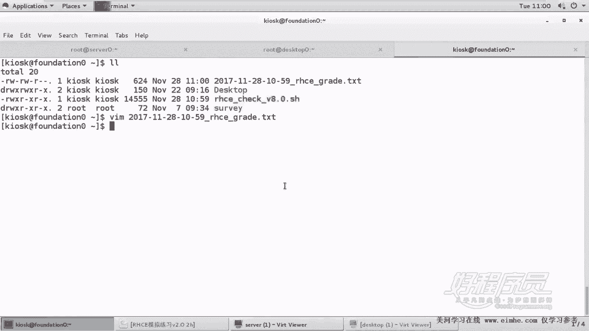

# RHCE脚本阶段测试：P12：阶段测试与脚本检查


在本节课中，我们将对之前完成的脚本相关题目进行一次阶段测试。我们将使用一个自动检查脚本来验证配置的正确性，并学习如何解读检查结果、排查常见问题。

## 概述

我们已经完成了多道脚本相关的练习题。本节将使用一个综合测试脚本，对之前的配置进行批量检查。这个脚本并非与题目一一对应，因为它整合了包括NFS常规配置和基于Kerberos的配置在内的多种题型。通过运行脚本并分析其输出，我们可以系统地验证学习成果。

## 脚本运行与初步结果

我们首先在一个新的终端标签页中运行测试脚本。

```
./test.sh
```

脚本执行速度较慢，因为它需要检查多道题目。执行完毕后，脚本会生成一个结果文件 `201728`。

检查初始结果，发现存在几处失败：
1.  **Samba挂载失败**：脚本报告 `smb1` 别名挂载失败。
2.  **别名检查失败**：`PS6` 等别名检查未通过。
3.  **端口转发失败**：相关检查项未通过。

## 问题分析与排查

下面我们针对每个失败项进行分析和修复。

### Samba挂载问题排查

脚本检查 `smb1` 挂载失败。经确认，在考试环境中，`smb1` 共享并不要求永久挂载，因此我们之前的练习中也未挂载。但脚本的检查逻辑是验证挂载点是否存在。

**解决方案**：为了通过脚本检查，我们可以手动挂载该共享。

```
# 创建挂载点目录
sudo mkdir -p /mnt/smb1

# 挂载Samba共享
sudo mount -o username=lduser1,password=redhat //server0.example.com/smb1 /mnt/smb1
```

挂载后，脚本在下一次检查时即可识别该挂载点。

### 脚本路径修正

检查失败的部分原因在于脚本自身的检查路径与我们的实际配置存在偏差。例如，脚本中关于NFS安全配置（`NFSSECURE`）的检查路径需要更新。

我们需要编辑测试脚本，将相关的检查路径修正为当前环境下的正确路径，例如 `/mnt/nfssecure`。

### 端口转发问题排查

脚本检查端口转发（IP forward）失败。根据脚本提示，它检查的是将访问 `172.25.10.0` 网段端口 `666` 的请求转发到 `80` 端口的功能。



我们需要核对 `servera` 和 `serverb` 上的防火墙或内核转发规则配置，确保该条端口转发规则已正确设置并生效。可以使用 `firewall-cmd --list-all` 或检查 `/etc/sysctl.conf` 中的 `net.ipv4.ip_forward` 设置。

### 别名检查问题排查

脚本报告 `PS6` 别名检查失败。我们首先手动验证别名是否生效。

在 `serverb` 上执行：
```
PS6
```
如果命令能正常执行，则说明别名配置正确，问题可能出在脚本的检查逻辑上。

检查脚本发现，其使用 `grep` 过滤 `ps aux` 输出时，匹配模式可能存在空格或符号差异。例如，脚本中使用 `grep ‘ps +-’`，而实际别名定义可能为 `alias PS6=‘ps aux --sort=-%cpu | head -7’`。这种细微差别可能导致检查失败。

**解决方案**：根据实际情况调整脚本中的检查命令，使其与真实的别名定义匹配。或者，如果我们确认别名功能正常，可以忽略此项脚本报告的“失败”，因为它更可能是检查脚本的容错性问题。

## 重新测试与验证

在完成上述分析和修正后，我们删除旧的测试结果文件，并重新运行测试脚本。

```
rm -f 201728
./test.sh
```





再次查看生成的 `201728` 结果文件。现在结果显示，除了 `smb1` 挂载（此项在考试中非必需）外，其他题目检查均已通过。`PS6` 别名功能实际可用，脚本检查结果可能因匹配问题显示失败，但实际配置正确。

## 总结

本节课中，我们一起进行了脚本阶段的综合测试。我们使用自动检查脚本验证了之前题目的完成情况，并实践了如何分析脚本输出的错误信息。关键点包括：
1.  理解脚本检查原理（如通过验证挂载点、执行命令来判定）。
2.  学会区分“考试要求”与“脚本检查要求”的差异（如 `smb1` 挂载）。
3.  掌握排查配置问题的基本思路：手动验证功能、核对脚本检查逻辑、修正路径或参数。
4.  认识到自动化检查工具可能存在局限性，最终应以实际功能是否实现为准。



通过本次测试，我们巩固了之前的脚本知识，并为后续更复杂的学习打下了坚实的基础。