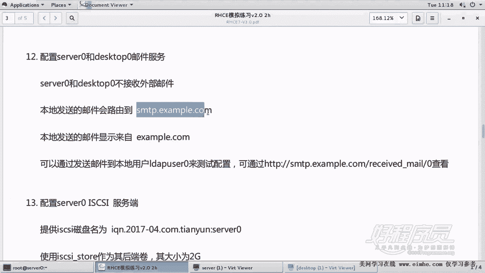
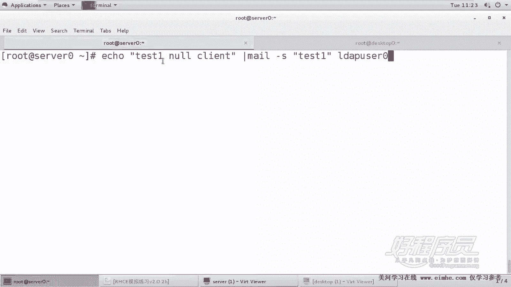
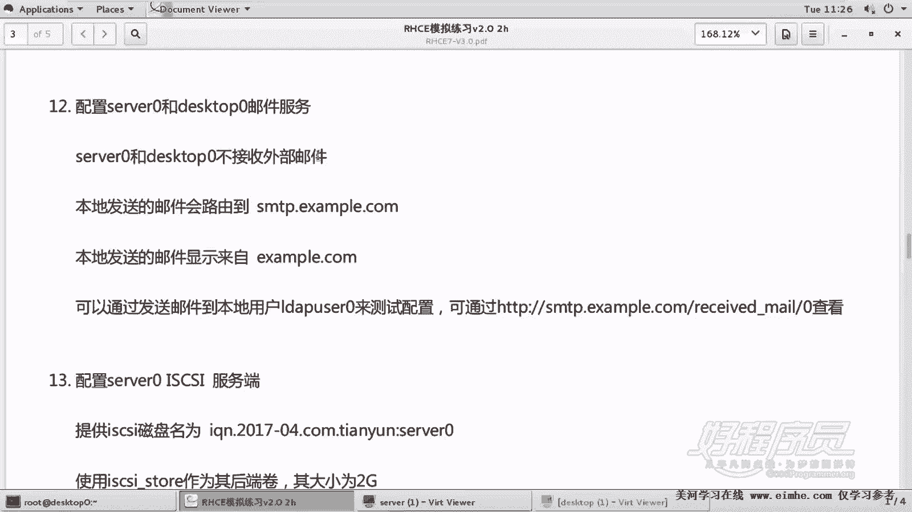

# 1. 杨哥rhce介绍及环境准备 - P13：13. Mail Null Client配置 - 自普男 - BV1st411d7rF

好，各位，我们接下来继续学习那个C一的考前辅导。嗯，这道题呢是要求配置serv0和dessktop0作为邮件服务器的空客户端。啊，什么意思呢？比如说第一。两个机器都要做这个题。第二呢。

这两个机器配置的是一个空客户端，空客户端它是不允许接受外部邮件的。它所有发送的邮件，本地发送的邮件都会被转到SMTP点example点com这个主机上去。而且本地发送的邮件呢。

最后会显示来自于examilycom。我们最后呢在真正考试的时候呢，是可以通过一个最终转发的那个机器呢去测试授信的。所以我们可以使本地的Ld0来测试配置，最后能够在远端的服务器上面看到什么。

看到我们的发的邮件。就是我们自己会发两封邮件，比方说给入的用户，最后呢发完以后，其实呢它是会转到SMTP点examp点com上去。这道题很遗憾的是不能够去测试啊，我们没办法测试，只能够配好就行啊。

就不能够没有办法去通过这个。页面的方式测试，我们能通过别的手段测试。在考试的时候呢，你发两封邮件以后，一旦配置成为空客户端。发邮件发完以后呢，你就可以通过这台机器这个网页URL去获得你刚才发送的邮件。

也就是他会转到这边去。好，这个怎么做？邮件服务器呢其实应该来讲的话是已经已经这个装好了的啊，我们不用再去装postse fix，除非没有装啊，除非没有装，应该一般都装好的。放大一下。好。

首先我们打开EDCR的。post fix下的manding control，这是post fix的主配置文件。好，我们在这里面呢来配置空客户端。但是呢呃一般我们建议大家将光标直接移到最后去。

我们不要去这个去。改前面的了，直接呢在后面来改这边呢大家看到有一个叫readme的一个目录。USR shell DOOC post fix2。10readme files。我们在这里面呢有一个帮助文件。

有一个帮助文件，我们找到这个destop这个机器呢，在这边去打开，找到这边路径一下有一个。有一个帮助文件叫做stand。configurationread me这个文件看好了。

叫做read me下面的standary，然后configurationread me这个文件。在这里面呢，我们搜索一下，大家看它告诉我们邮件服务器的配置方式呢，可以是一个标准的interlet的主机。

这种方式，也可以是一个空客户端，也可以是本地网络，也可以是邮件网关啊，那我们要配的是第二种空客户端，说白了就是只发不收啊。那我们找到搜索一下空客户端这个位置。其实就在这儿各位看到了吗？

这一段话就是我们空客户端的配置。

复制一下来到这边。好，为了大家看得清楚，多敲几个回车。好，一定要小心点，这里面有好多好几个问题需要注意ctrol加V。快选择一块删一定要顶行写。如果不顶行写的话呢，像这个my house name。

它会默认就是上一段，就是如果没有顶行写的话，像这边有个空格的话，缺省的话就是。连续的是上一段，上一个指令，这个是错的。好，我们看看主机名叫什么呢？叫做我们的主机名叫做s0这台机器。

然后my orangemy orange也就是发出去的邮件伪装成什么。这边有一个伪装成exumbble点com，就是发出去的邮件显示成什么，就myorange就是这个东西。

然后rere host转到哪去，各位看到转到哪儿去呢？这边有一个转到。

这个上去好，复制它。这边呢呃由于呢我们需要什么禁止解析，所以我们需要在这个主题上加一个方括号来禁止做名字解析。下面呢有一个叫in Ilet interface。

就是在哪个接口上监听look back仅还回接口，它不会收别人邮件的，仅监听在本地的还回接口上面，还有一个mlation，就是我这个邮件服务器为哪些预提供服务呢，没有，因为我不是一个常规的邮件服务器。

所以我们就是这样来做。那除了除此以外呢，还有一个就是还要加加一条指令。我们在这里面搜索，刚刚搜的是空客户端，现在搜一下er。那个错误这边用那个localtransportarrow。

这是这条指令啊一个。错误的一个信息。错误错误投递的一个邮件。当遇到错误的时候会显示local mail投递禁止啊，这是一个错误的一个信息给用户提供。那这几行123456。

这几行呢就是一个标准的空客户端配置。空客户端配置一只是接近在本本地回还。第二呢。不为任何预提供服务。第三呢，我们转出去的邮件会落款为什么？就是伪装成什么？第四，转到哪个地方去。

还有一个是呢当遇到错误的时候呢，给用户一个什么错误消息。好，就这几个指令。好，那这边呢要特别小心的是特别小心。如果说前面我们加了一个空格，在这儿啊看。我们来重启邮键服务器post。Fix。

大家看到报错了。因为我刚才讲过，如果说前面有个空格的话，表示续上行，它就是上行的指令。好，一定要注意这里空格。好了，我们怎么验证一下呢？首先看一下它的端口，它的端口是TCP的25号端口。

他现在只签订在本地回还结构上面。好，这个怎么验证？我们说了，没有办法使用这个题上面给的链接验证。我们可以呢给一个用户发个邮件，我们发邮件到这个用户上去。那么按照常规来讲的话，你看啊按照常规来讲。

如果说一个主机还没有配置空客户端，按照常规来讲，我们发一份邮件，比方这是测试low空客户端的一个测试。发给谁呢？发给我们的通过mile。主题呢也是。太一吧，然后发给LTIP user0这个用户。好。

现在是没有我的2号机是没有做什么配置的啊，我现在发给了这个LW user0，它现在不是空客户端，是一个标准的优件服务器。所以我们切换到Ldap user0的时候，大家会发现。这边有一封邮件。

因为他收到了一封邮件，就是刚才那封邮件测试空客非空客户端。而我现在我的左侧也就是这台机器已经是空客户端。各位看到。我同样来发一封邮件给什么呢？test。一我们就测试空客5端吧。给谁呢？

mail主题subject给。测试一给那个LDIP user0用户。好，现在这边呢显示的是已经okK了。但是我们来到这个主机上，来到这个用户上看一下他的邮箱里面有没有呢。答案是没有的。那怎么看呢？

我们可以通过。post，然后post，然后看一下它这个邮件的这个列表啊，对列里面。啊，postq对列里面没有看到，这是强制刷新啊，我们可以看日志。呃，Mcu，sorry。没有票。这个mailQ呢。

我们看到这个里面有一封有一封邮件呢，他是想往哪投啊，他是他是发给这个用户的，但是他想往这个往这个主机投，但是这边他说没法解析啊，这就不关我们事儿了。因为我们练习环境呢。

这个题呢没办法做到完全的测试的这个效果。但是可见他是想转发的，而且转发的时候呢，落款也是对的。好，那然后再把这个题的所有的配置复制给谁呢？复制给我们的。

那台机器。

但复制过去有个地方要改，就是主机名要改EDC下的manding那个post fix下的maning control这个题啊，这个我。这个文件。粘到这儿，注意前面呢一定不能有空格。啊，这边的主机名呢叫做。

that是top0好，其他都不用改了。好，重新启动我们的。邮件服务器。嗯。Pos啊。Post。哦，打对话打多了一个又打多了一个这补全了，我就打又打出来了。好，O。当然，出于责任心的话呢。

你还是应该把它设置为开机启动。这个应该也到倒没没有什么大问题。啊，这边也是一样，设置为开始启动。Enable post。Fix。好，然后我们在这个机器上再测试一下。各位刚才还记得我们发发邮件的时候。

发邮件的时候呢。发了第一封邮件，那个用户是不是收到了？现在再来看一下，我们有发了第二封邮件，然后切换到还有d user零上去。他没有收到第二封邮件。而且呢我们看邮件的对列里面呢，mailQ里面。

有一封未投递的邮件，这是因为我没办法转到那个主机上去。好，那么这个就说明我们的空客户端配置是正确的。那在真正考试的时候呢，我们能够刚才发的那两封邮件，就是发给lW user两封邮件。我们能通过一个链接。

也就是连到这个邮件服务。这个服务器去收到刚才那两封信。如果能收到的话呢，说明我们的邮件服务器确实就是配置成功，而且能够本身就是一个空客户端，它自己是不收邮件的。各位我们通过这个例子看到在空客户端之前呢。

我们的ld user零是能够收到邮件，它会给它投递到这个邮箱里面去。而在这个做完空客户端以后呢，我们这个邮件就会往外转转到哪去，取决于你的rename host啊，这样一个方式。最后呢转过去以后呢。

在考试的时候，你能够通过这个路径，这个UL看到你两台机器发送给Ldap user里的邮件，这就足以说明我们的空客户端配置正确。这里要特别强调的是，如果你记不住的话呢，一定要记那个帮助文件。

还有一个是呢两台机器。都要做。

