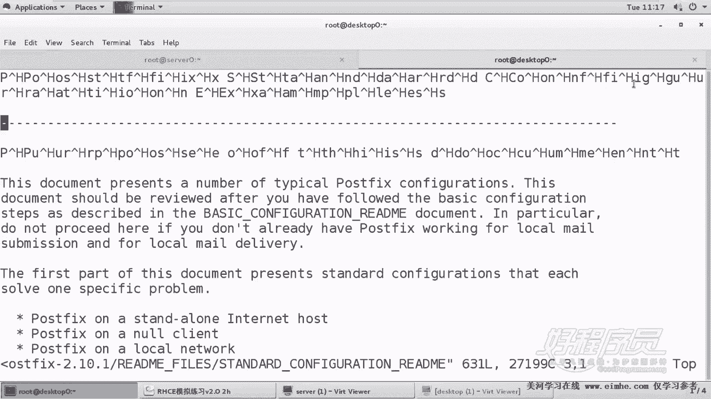
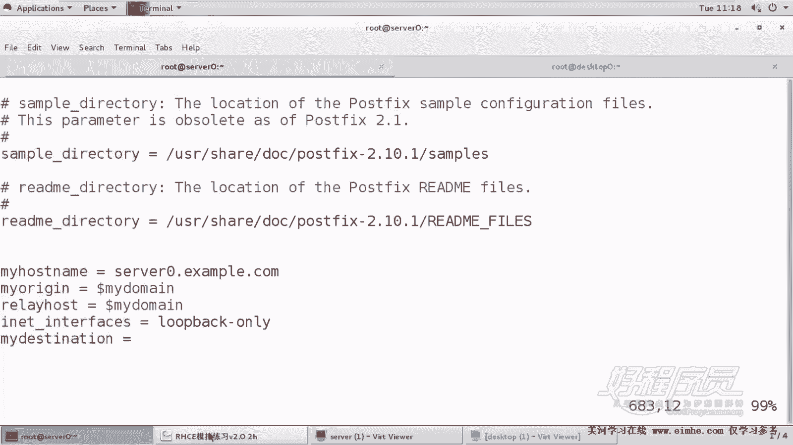
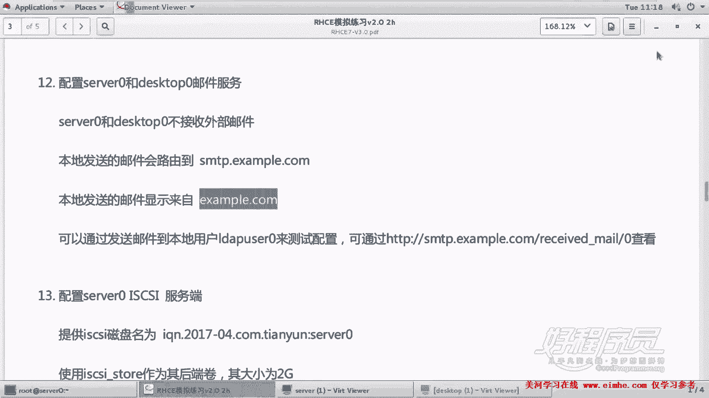
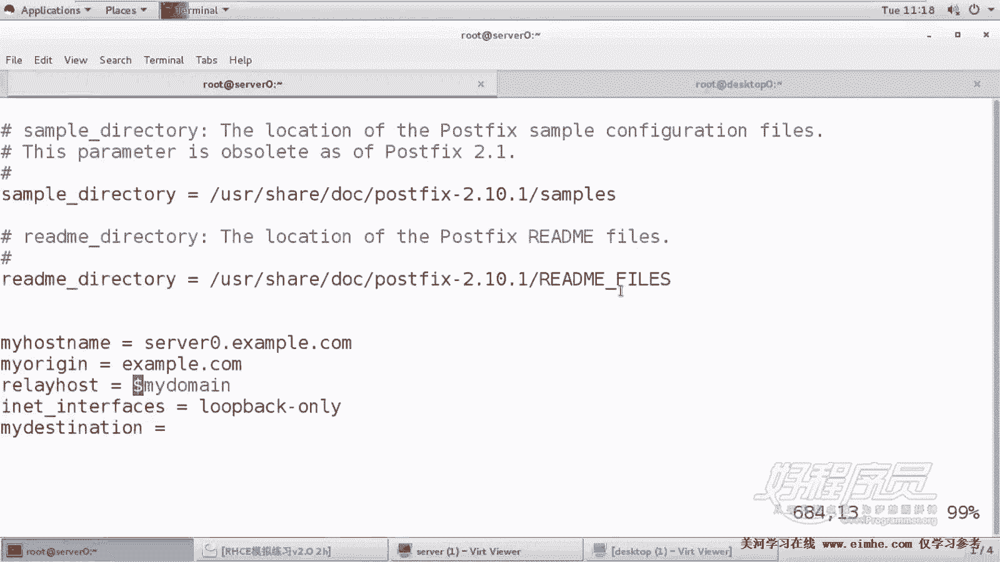
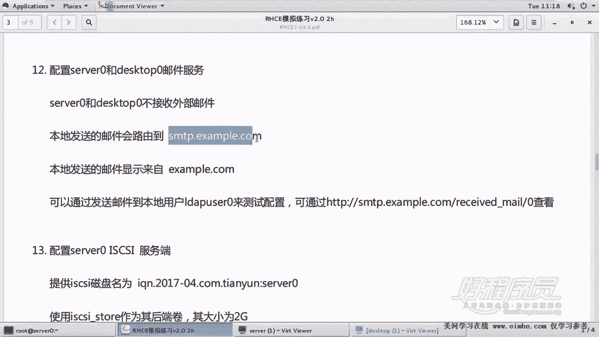
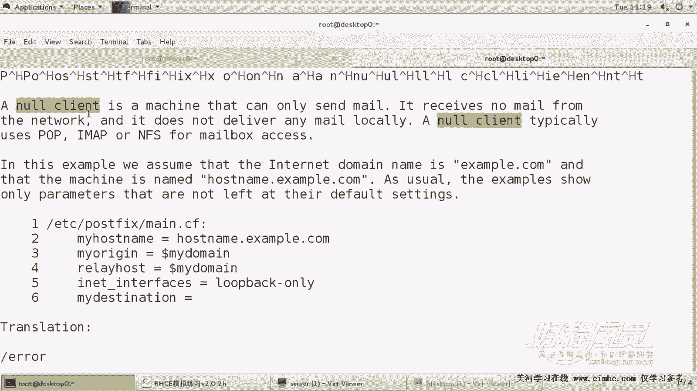
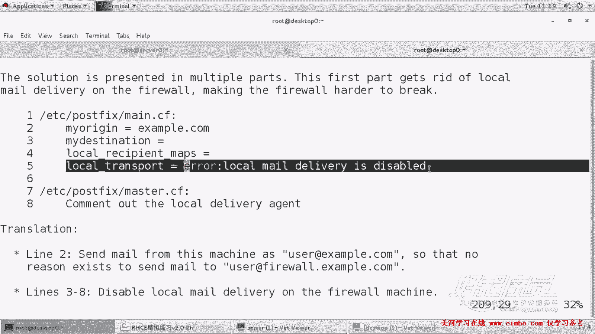
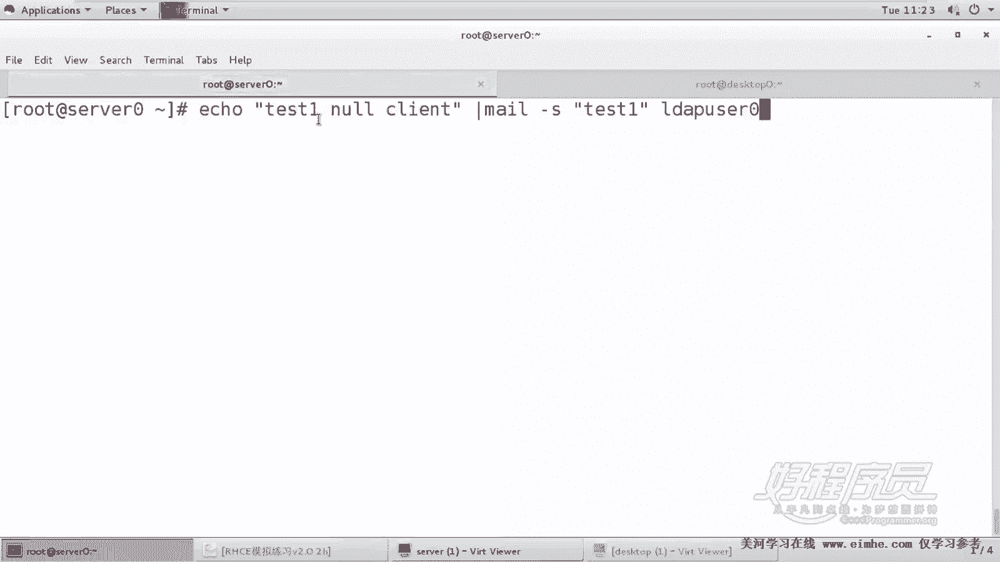
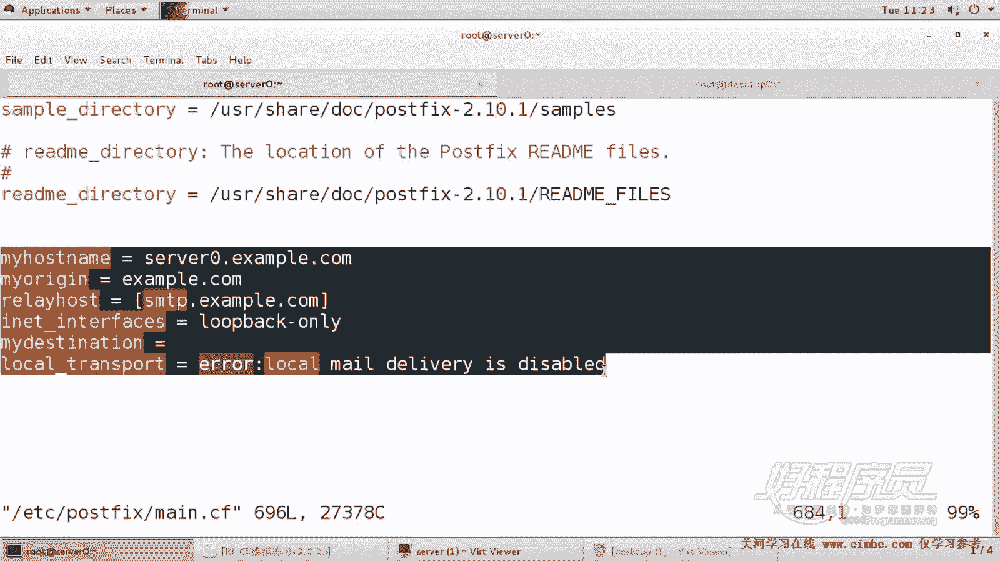
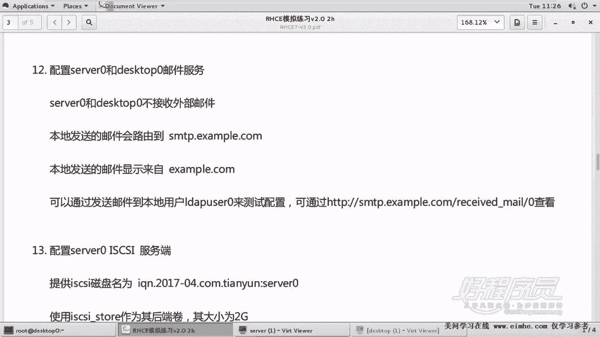

# RHCE考前辅导：13：Mail Null Client配置 📧


在本节课中，我们将学习如何配置邮件服务器的空客户端。空客户端是一种特殊的邮件服务器配置，它只负责发送邮件，而不接收任何外部邮件。我们将通过配置 `server0` 和 `desktop0` 两台机器来实现这一功能。

---

## 概述

空客户端配置的核心是修改 Postfix 邮件服务器的主配置文件。配置完成后，所有从本地发送的邮件都会被转发到指定的远程 SMTP 服务器，并且邮件的发件人地址会被伪装成指定的域名。本地服务器将不再处理任何邮件的接收。

---

## 配置文件定位与准备

首先，我们需要找到并编辑 Postfix 的主配置文件。该文件通常位于 `/etc/postfix/main.cf`。

为了避免修改原始配置造成错误，建议将光标移至文件末尾进行追加配置。Postfix 提供了详细的配置示例，我们可以参考其自带的帮助文档。

以下是定位帮助文件的方法：
```bash
/usr/share/doc/postfix-2.10.11/README_FILES/
```
在该目录下，可以找到一个名为 `STANDARD_CONFIGURATION_README` 的文件，其中包含了空客户端的标准配置示例。



---

## 空客户端标准配置

在 `STANDARD_CONFIGURATION_README` 文件中，搜索 “null client” 可以找到对应的配置段落。该段落提供了空客户端所需的核心配置指令。





我们需要将这段配置复制并粘贴到 `/etc/postfix/main.cf` 文件的末尾。以下是配置内容及关键参数说明：





```
myhostname = server0.example.com
myorigin = example.com
relayhost = [smtp.example.com]
inet_interfaces = loopback-only
mydestination =
local_transport = error: local mail delivery is disabled
```

**配置参数解析：**
*   **`myhostname`**: 设置本机的主机名。
*   **`myorigin`**: 设置外发邮件的发件人域名伪装。所有从本机发出的邮件都将显示来自此域名。
*   **`relayhost`**: 指定邮件转发的中继主机。方括号 `[]` 表示禁止对该主机名进行 DNS 解析（直接使用 IP 地址或已配置的主机名）。
*   **`inet_interfaces`**: 设置 Postfix 监听的网络接口。`loopback-only` 表示仅监听本地回环接口，从而拒绝接收外部网络发来的邮件。
*   **`mydestination`**: 设置本机作为最终目的地的域名列表。留空表示本机不为任何域名提供邮件接收服务。
*   **`local_transport`**: 定义本地邮件投递的传输方式。设置为 `error:` 会在尝试本地投递时向用户返回错误信息。

**⚠️ 重要注意事项：**
粘贴配置时，**每一行指令必须顶格书写，不能有前导空格**。如果行首有空格，Postfix 会将其视为上一行配置的续行，导致配置解析错误。





---

## 应用配置并验证

配置完成后，需要重启 Postfix 服务以使更改生效。

```bash
systemctl restart postfix
systemctl enable postfix  # 设置为开机自启
```

由于实验环境限制，我们无法完全模拟题目中的远程测试。但可以通过以下方法进行基本验证：

1.  **检查服务状态与端口**：确认 Postfix 服务已运行，并且只监听在本地回环地址的 25 端口。
    ```bash
    ss -tlpn | grep :25
    ```

2.  **发送测试邮件**：从配置为空客户端的机器上，向一个本地用户（如 `ldapuser0`）发送测试邮件。
    ```bash
    echo "This is a test for null client." | mail -s "Test Subject" ldapuser0
    ```

3.  **验证邮件队列**：使用 `mailq` 命令查看邮件队列。如果配置正确，这封邮件不会投递到本地用户的邮箱，而是会进入队列，准备转发到 `relayhost` 指定的远程服务器。
    ```bash
    mailq
    ```

在真实的考试环境中，发送测试邮件后，可以通过访问考题提供的特定 URL 来查看是否成功收到了从两台空客户端转发的邮件，这是最终的验证手段。

---



## 配置第二台主机



上一节我们完成了 `server0` 的配置，本节中我们需要对 `desktop0` 进行相同的配置。

将上述配置片段同样粘贴到 `desktop0` 的 `/etc/postfix/main.cf` 文件末尾。**唯一需要修改的是 `myhostname` 参数**，应将其值改为 `desktop0.example.com`。

修改完成后，同样重启并启用 Postfix 服务。

```bash
systemctl restart postfix
systemctl enable postfix
```

---

## 核心概念总结

本节课中我们一起学习了邮件空客户端的配置。关键点总结如下：



*   **目的**：配置服务器只发送邮件，不接收任何外部邮件。
*   **核心配置**：通过修改 `/etc/postfix/main.cf` 文件，设置 `relayhost` 进行邮件转发，并利用 `myorigin` 伪装发件人域名。
*   **关键指令**：
    *   `inet_interfaces = loopback-only` (仅本地监听)
    *   `mydestination =` (不接收外部邮件)
    *   `local_transport = error:...` (禁用本地投递)
*   **验证**：在考试中，通过向指定用户发送邮件，并在远程 Web 界面查收，来验证配置是否成功。
*   **最终步骤**：确保 `server0` 和 `desktop0` 两台主机均完成配置。