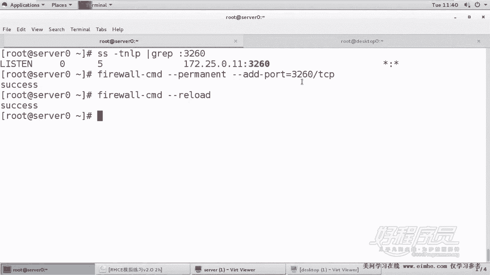
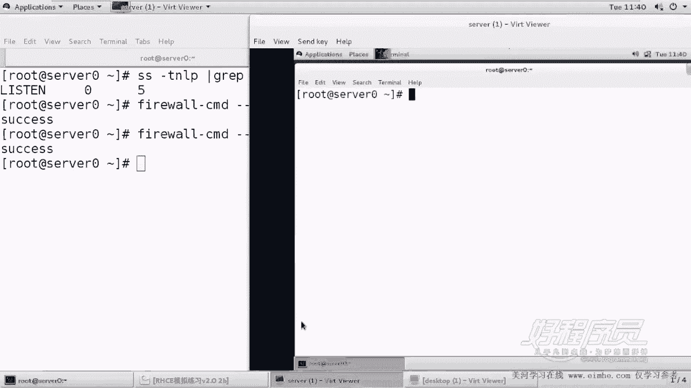
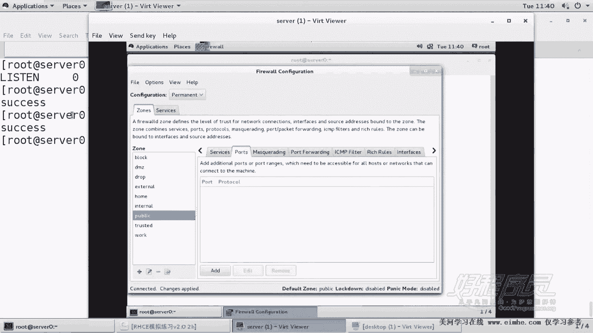
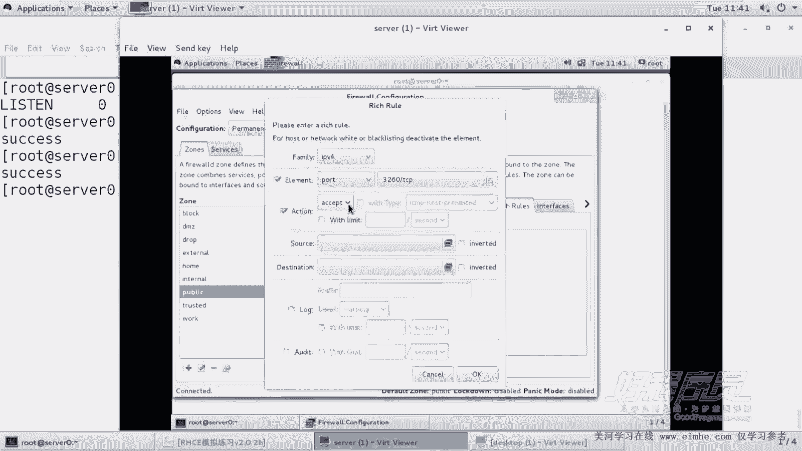
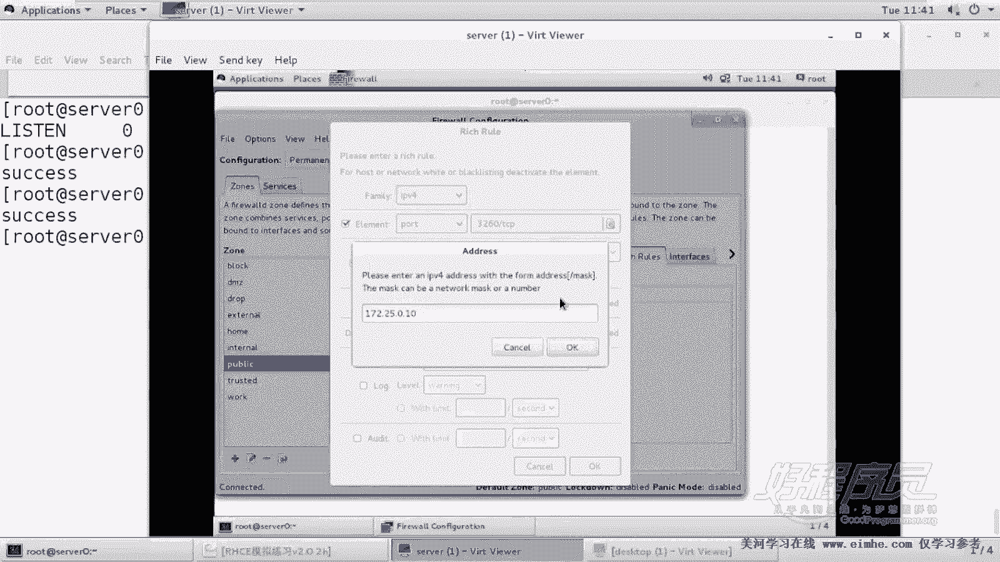
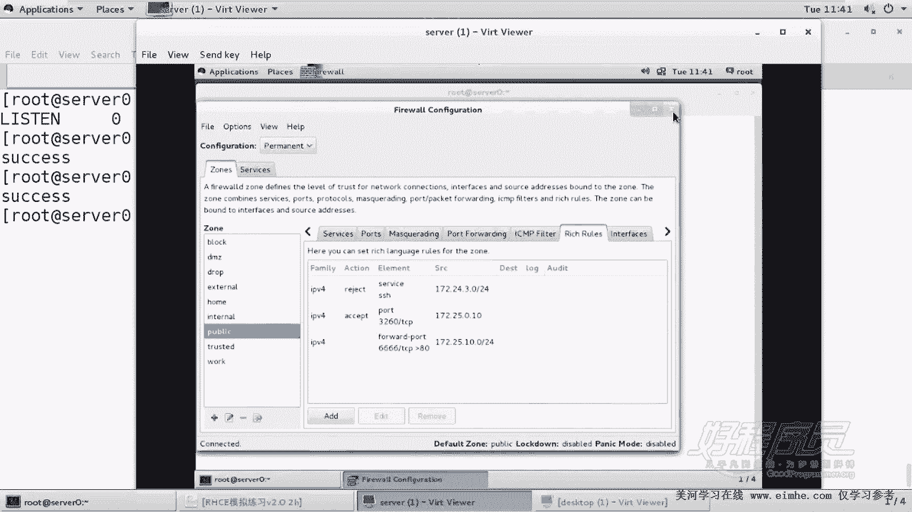
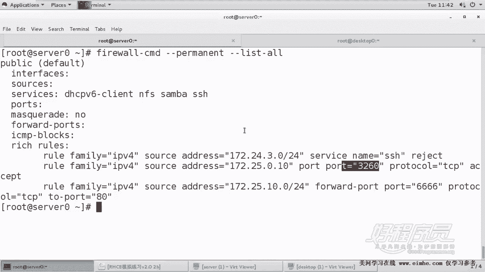
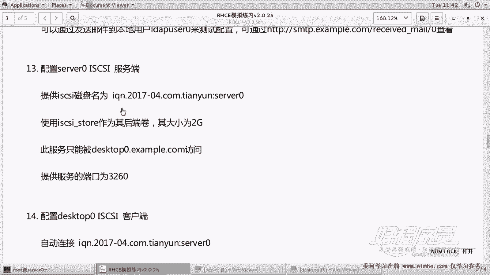

# 1. 杨哥rhce介绍及环境准备 - P14：14. Iscsi 服务器端配置及注意事项 - 自普男 - BV1st411d7rF

好，接下来的这道题呢是我们的IP3，也就是配置我们的Sive服务。为我们的客户端提供这种IP3的存储，也就是快快的存储方式。嗯，那么快存储呢在我们的生产环境当中也是必经常用到。嗯。

所以这道题呢是通过在lininux上面，通过S这样的一个服务来为客户端呢提供1个IP3。那这个题是同样在考试的时候是两道题，一个是服务器端serv0上做为一个服务器呃。

专业术语叫做scar target目标。另外一个呢叫scar init，也就是客户端。他这边告诉我们，提供S咖的磁盘名字，磁盘的名字呢为这个IQN2017-04，然后com天云。这是一个域名的反转啊。

这个是日期。当然了，这这个是日期啊，当然这个要根据什么呢？这个要根据考试的时候给提供的名称来走，不能乱写I这是一个s完全合格的名字。类似于类似于我们的这个FQDN，也就是DNS的FQDN这种方式。好。

后面呢是一个描述。后面他告诉我们，使用S story作为后端存储的卷，大小为2G此服务只能被desktop example。点com这个主机访问提供的服务的端口是标准的3260OK这题怎么做呢？

这题相对来还说比较麻烦一点。第一，我们需要了装这个呃需要先准备准备什么，准备一个2G大小的一个分区。然后这个分区呢将用来作为S对外提供这个服务的一个后端存储。然后紧接着我们再装S，然后以及呢配置S。

うん。ok。一定要搞清楚在哪个机器上做。第一步呢我们先来准备一下DV下的VDB。我们看下当前分区没有6主分区。Yi。守住面尾住面加上2G就可以。当然。part pro DV下的VDB这里再次强调一遍。

真正考试的时候呢，是在VDA上分，也就是你没有2块硬盘，就一块硬盘。而那块硬盘呢，系统已经默认了已经用了好多的，已用了很多的这个东西。O。好，我们看一下这个DV下的VDB。一有没有出来已经出来了啊。

大小应该是两个G，这是一块裸设备，我们不用对它进行格式化。我们要把它作为S咖的共享存储使用。啊，这是第一背。第一步，我们要准备Sclass的共享券。然后第二步呢，我们要安装提供S咖的服务端，叫做。

叫做S呃，叫tart TRGET，然后comment linecom那个 line，我们要装这个装它的时候，其实它会装一些依赖包。大家看到。这是一个命令行的方式。

通过命令行的方式呢来配置这个S的一个工具。🤧啊。好，那装好以后呢，我们首先要将S咖的这个服务呢给它启动起来，就叫TRGET目标。然后并且呢。我比较习惯使用restar，防止以前启动过。好。

那这里呢已经起来了。那么起来以后呢，我们下面就开始来来对这个Sgaci进行这个配置。那怎么配置呢？就是通过刚才那个target。comd line这个工具，它提供了这样一个命令行工序啊。

它是它说叫做tart command line shell的版本啊。好，在这里呢我们可以通过help来获得帮助，同样也可以通过LS呢来看到当前的配置。当然它也可以清屏。当前的配置呢，我们看到后端存储。

无论是块还是文件都没有，还有Sclassci对外提供的Sclassci呢也没有，这是一个空的环境。在这里呢我们可以使用绝对路径，也可以使用相对路径。因为我们当前在根下面。

所以我们可以直接使用bank story下的block create，大家看都可以补全，也可以使用绝对路径，也就是根下的bank story下的block。create创建一个券，这个券叫什么名字？

这个券呢不能够随便起。这个券呢，它要求叫做sclass story，看到吗？所以它要求作为后端卷，那么就必须使用这个来作为Sclass story。然后把谁来作为这个卷呢？DV下的VDB1。好。

各位看一下，它创建了一个快存储对象S story使用的是DVVDB1。这里呢我刚刚讲过可以使用相对路径，也可以使用绝对路径。我们完全可以直接使用绝对路径。

在根下的bank story后端存储里面呢我们的后端存储呢不是文件I是一个具体的块。所以我们用到的是块，在块下面create创建一个卷的名字叫S story，它是它来创建的。好，我们清一下屏。

这是第一条命令。看一下这边呢就在这里面有一个叫S story。当然这个东西呢用户是看不到的，这是只是后端存储。用户要看到的呢必须是一个什么S的一个名字。所以我们要创建一个S的一个名称。

或者叫S的一个呃这个FQ那个IQ。跟下的S下面创建一个叫什么呢？这个名字呢不能瞎写，必须是给我们的。Sgaci的磁盘名称叫这个。好了，创建完了以后啊创建完以后呢，这边呢我们再来看一下。好。

这边大家注意到有一个后端存储。然后有一个什么对外的一个ic叫做icune点2017-04，这个是规范的啊，然后TPG1啊，这里是它的一些策略设置的地方啊，策略策略组的设置地方。

这包括它的accel包括 lens它的端口，但是这里各位看到，如果现在有用户访问这个ic其实是没有后端存储的。所以我们现在这个Sic是没有办法和后端存储做关联的。那么怎么做关联呢？是通过这里面的los。

然后也就是说他要去关联什么呢？上面这个Sclass的一个story。否则的话，当用户访问的时候是。没有东西可访问的。好，但然我们可以一个一个来做ACL我们来做一个防控制。他怎么告诉我们。允许被谁访问呢？

他说被desstop0examp点。点。被那个desktop里点ex点com这个主机访问。但这里呢要注意的是。这个客户端依然呢我们要使用什么呢？要使用IQN的形式IQ的形式。

所以呢这边其实题上面并没有给出一个IQN，它并没有给出一个IN。但是我们要用到一个IQ的方式。因为限制的话也要使IQN。好，OK这边呢。首先我们在S的IQN下的TPGE下的SL里面，然后去创建一个。

注意这里不要随便回撤啊。IK217。天云，然后是。That。号林。好了，那现在做了这样一个Sel的限制，做了这样一个SL的访问控制。看到了吗？这是IQN。但是现在同样呢当用户来访问的时候。

它是没有没有任何的lan的。因此呢我们要在Sga下的IQN下的什么PPGE下的lesss下面去和谁绑定呢？和上面那个大家这边你要按table键就可以了，因为它就一个。

现在啊就一个给它会和商它做一个关联回车我们再来看下结果。可能显示有点乱，上面是后端存储，下面是用户访问的I。当用户访问这个I的时候，它当然它的前提是必须使用这个来访问。然后呢能够意识到烂宁烂宁是谁呢？

就是这个烂宁。而烂宁呢它是。连到了上面那个后端存储。最后关于端口这一块端口这一块我们再设置一下。Sclass下的icTPGE下的portsgre。他这边告诉我们，要接听的端口是3260。

这边呢要注意的是。坚定在本机的3260上面。3260。注意这个IP一定是本机的IP也是我啊这个IP这个端口是在哪个这个千万注意不是客户端的IP啊，这是本机的，就是我现在我要在哪个接口上监听3260。

好了，最后结果是什么呢？各位看一下这屏幕上全部的内容在这儿呢，已及。后端存储，然后这是对外提供的ICN。当访问这个ICN的时候，当然前提是只有它可以访问，然后呢去访问的是耐宁。

映射到这个耐耐尼耐宁是它然后呢，我这个主机是在这个端口上这个接口的这个端口上提供监听的这个地方千万注意不是客户端的IP。好，做完又怎么办呢？做好以后，可别看。如果写错了怎么办？

这边有一个有一个清楚的方式叫clear confi，看了吗？当然你回车以后，它不让你清除作为。保护，那么它要你加一个确认，就跟你删除这个根一样，它不会让你删的。作为保护需要一个确认。好。

你给它加个确认就可以了。烤饼粘贴。好了，这个时候大家看到什么都没有了，回到了最干净的状态。所以如果你做错的话，同样可以删除。好，那我们下面呢再做一遍。bank story下的注意前面有没有跟都无所谓。

因为这边本身在跟下面嗯，创block下创建一个叫做S。最好复制这东西打错的话呢，是要付出代价。B位下的VDB1。好看一下，然后再在S classci下创建1个IQN。这个IQN呢是它。好了。

然后呢我们紧接着可以进到哪去呢？进到S guysIQ下的TVGE下面。看它在这个位置SL里面，然后SLcre。创建一个。谁能够访问？That'stop0。好，然后紧接着呢在nice里面呢去关联什么呢？

上面那个。我自动补全的啊，然后端口pos创建一个，注意是本机IP我一般输入17的时候，它就能补全。然后是3260端口。好了，这样的话，这次我就不删除了啊。注意删除的话，在这儿删除的话要回到根CD啊。

回到K啊，回到这个根这个位置，在这儿地方进行删除。同样你想保存的话呢，也是什么呢？save confi保存，注意保存只能回到跟保存。好了，那么现在为止呢，这就OK了，然后再见。嗯，服务器这边做完了吗？

当然没有，我们看看端口。每次都敲成这啊。32。60好了，这边有监梯是监梯在本机，本机的IP就是172125。0011上面啊，千万小心。然后很显然防火墙我们还没有做，因为防火墙呢同样会阻止用户的访问。

fireairwork杠com杠杠perment杠杠AD这边可以使用端口。3260。杠TCP。好了，然后我们再加上。呃，再加上一个。没唠的。当然我们这里呢有一个大家注意有一个问题是什么？

这个防火墙加的规则其实是有问题的。为什么它并没有说只允许谁访问，只允许这个主机访问，只允许客户端访问。所以呢我们可以在防火墙上这个地方不要这样做这种方式，它只是允许所有主机访问。

我们看一下客户端的IP客户端的IP是172250。110。好了，那怎么做呢？

图形化的方式。不规则。好，第一步呢，我们依然是要将这设会永久模式永久模式。然后在这边呢，我们看到端口呢，刚才起了3260，我觉得这个没必要删掉它啊，刚才不应该这样加，找到副规则，在这边呢添加一个。

IPP4元素呢是端口，哪个端口呢？3260端口TCP。

哎啊没亮起来点一下，然后动作是接受。然后呢，这个圆呢是来自于。

172点嗯25。0。10。啊，这是1个IP，所以不用加掩码了啊，只有网段需要加掩码，掩码是可以选的。好了，这样的话我们就能够限制。

限制来自于17250。10的主机访问。所以刚才那个规则其实是不妥的。好，点击reown。好，这样的话呢我们就做好了这个规则。我们来看一下，刚刚这个规则就撤销了啊。

By work。common刚刚promit刚刚list。哦。好了，我们看到最后一套规则，来自于10点啊，不是最后一条规则，来自于这个172250。10的主机。当它访问它是可以访问3260端口的。

接受别的地访不了。这样的话我们就做到了这样一个允许这个主机访问的这样一个能力。好，所以呢在防火墙上我们加了这样一条规则。

那么到到此为止呢，我们看到服务器端，我们来验证一下。第一，我们准备的那个卷是2G。没错，这个券的名字呢叫做s story。

对外提供的IKN呢是这个这是我们稍后会访问的IKN对外提供的端口呢也是3260没有问题。但是千万小心那个3260呢是一定要什么设置在本机IP的3260上面的，不要搞错了。搞错的话，别人就访问不了。好。

这是关于这个呃S服务器端的配置。

