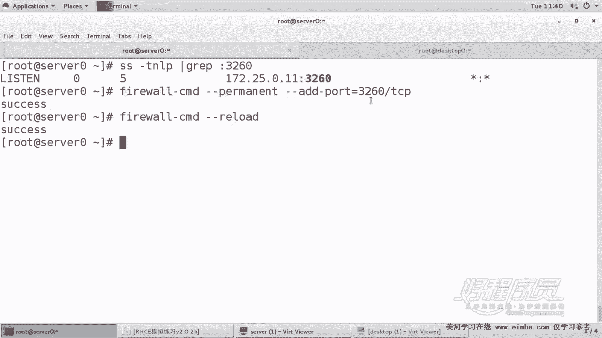
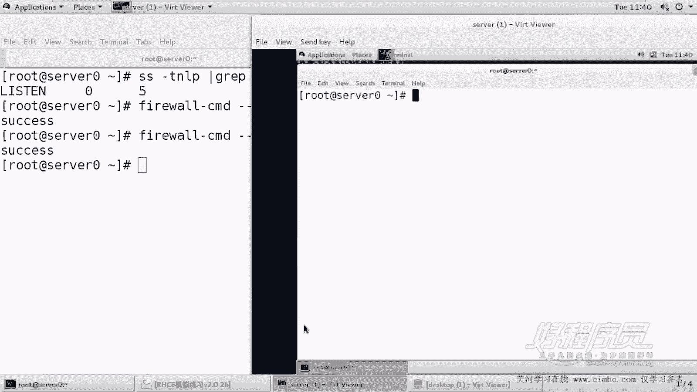
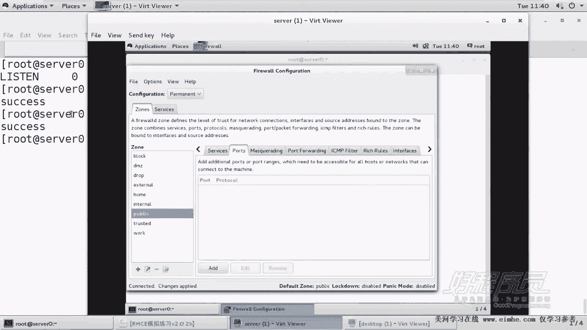
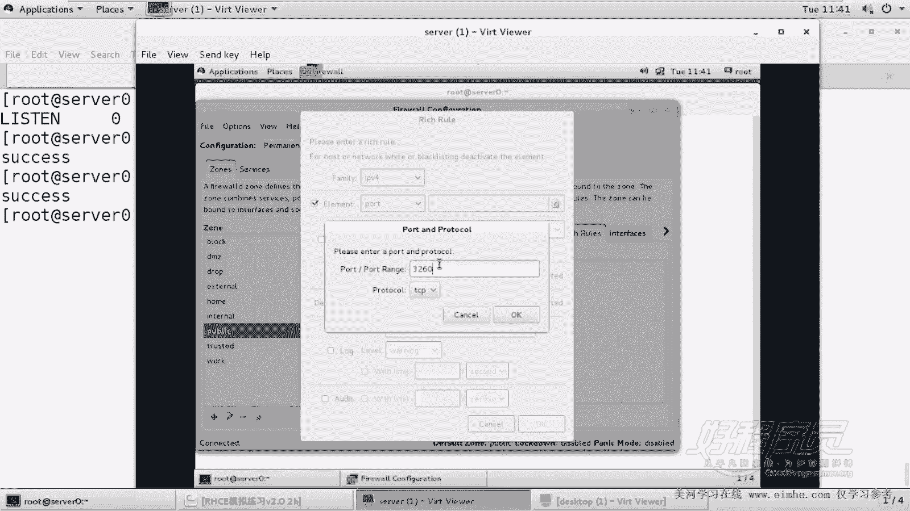
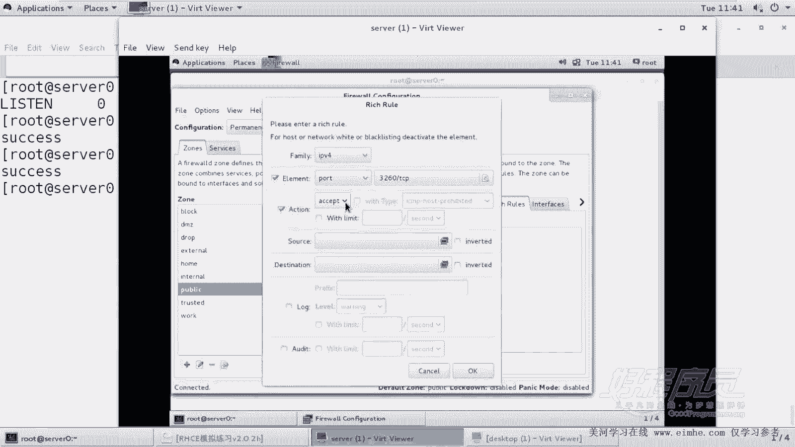
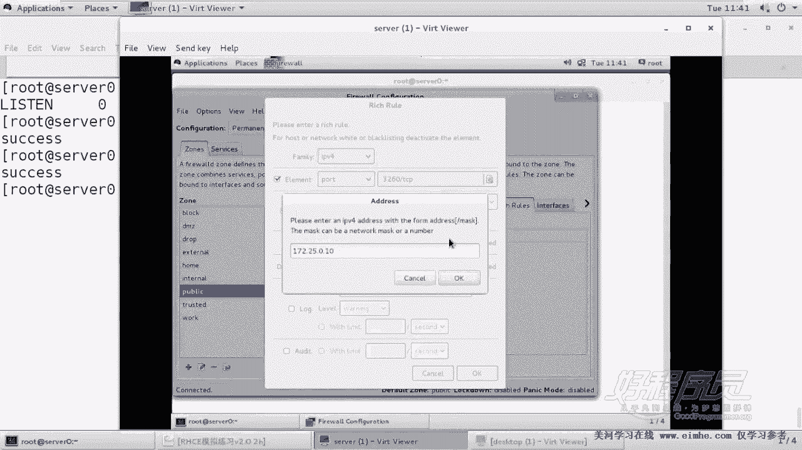
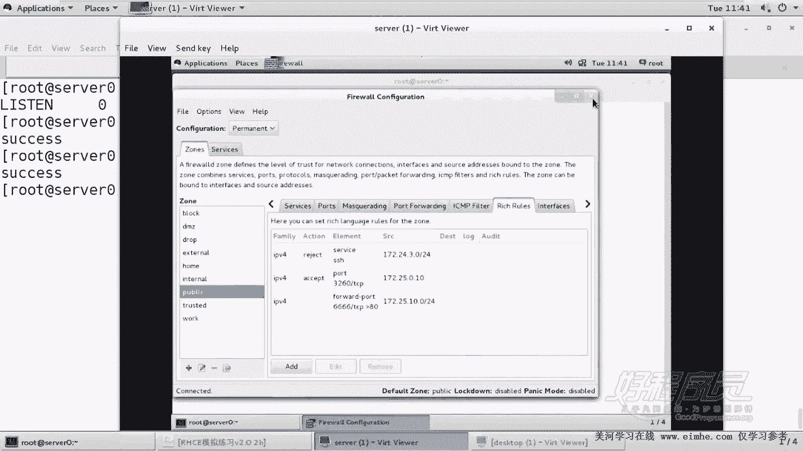
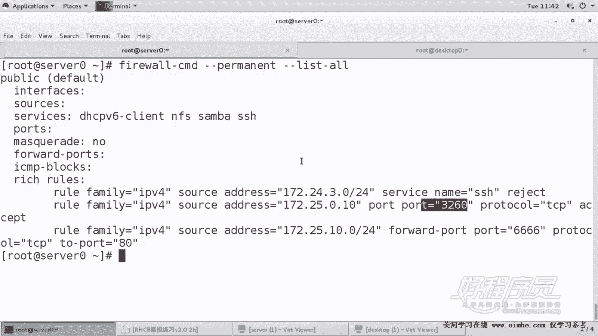
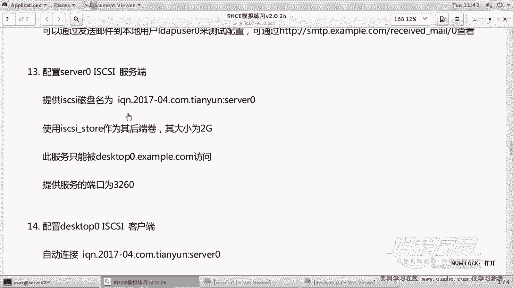

# Linux系统管理：14：iSCSI服务器端配置及注意事项


在本节课中，我们将学习如何在Linux服务器上配置iSCSI Target服务，为客户端提供块存储。iSCSI是一种基于IP网络的存储协议，在生产环境中应用广泛。我们将从环境准备开始，逐步完成服务安装、配置、访问控制及防火墙设置。

## 概述

本节教程将指导你完成iSCSI服务器端的完整配置。核心任务包括：准备后端存储分区、安装服务、创建iSCSI目标、配置访问控制列表（ACL）以及设置防火墙规则。我们将使用命令行工具 `targetcli` 进行配置。

## 环境准备与分区创建

首先，我们需要为iSCSI服务准备一块后端存储空间。根据题目要求，我们需要一个大小为2GB的分区。

以下是创建分区的步骤：

1.  在服务器上，我们使用 `parted` 工具对第二块硬盘 `/dev/vdb` 进行分区。在实际考试中，可能需要在系统盘 `/dev/vda` 上划分空间。
2.  创建一个大小为2GB的主分区。
3.  创建完成后，使用 `partprobe` 命令让系统重新读取分区表，无需对新分区进行格式化。

具体操作如下：
```bash
# 对 /dev/vdb 进行分区
parted /dev/vdb mkpart primary 0 2G

# 通知系统分区表已更新
partprobe /dev/vdb

# 检查分区是否创建成功
lsblk /dev/vdb
```
现在，我们已经准备好了用作iSCSI后端存储的裸设备 `/dev/vdb1`。

## 安装与启动iSCSI服务

上一节我们准备好了存储分区，本节中我们来看看如何安装并启动提供iSCSI服务的软件包。

我们需要安装 `targetcli` 工具包，它提供了配置iSCSI Target的命令行界面。

执行以下命令进行安装和启动：
```bash
# 安装 targetcli 工具
yum install -y targetcli

# 启动并启用 target 服务
systemctl restart target
systemctl enable target
```
安装完成后，`target` 服务已启动。接下来，我们将使用 `targetcli` 交互式shell进行配置。

## 配置iSCSI Target

服务启动后，我们进入 `targetcli` 的交互式配置界面。初始环境为空，没有任何后端存储或iSCSI目标。

以下是配置的核心步骤：

1.  **创建后端存储卷**：将之前准备的 `/dev/vdb1` 分区创建为一个块存储对象，名称必须为 `iscsi_store`。
2.  **创建iSCSI目标**：创建一个iSCSI限定名称（IQN），这是客户端访问时使用的标识符。格式为 `iqn.年-月.域名反转:自定义标识`，本例中为 `iqn.2017-04.com.example:server0`。
3.  **创建LUN并关联存储**：在目标门户组（TPG）下创建逻辑单元号（LUN），并将其与第一步创建的后端存储卷 `iscsi_store` 绑定。这样客户端访问时才能看到实际的存储空间。
4.  **设置访问控制列表（ACL）**：限制只有特定的客户端（IQN为 `iqn.2017-04.com.example:desktop0`）可以访问此iSCSI目标。
5.  **配置监听端口**：设置服务在本机IP地址（如 `172.25.0.11`）的3260端口上进行监听。

进入 `targetcli` 后，依次执行以下命令：
```bash
# 1. 创建后端存储卷
/backstores/block create iscsi_store /dev/vdb1

# 2. 创建iSCSI目标
/iscsi create iqn.2017-04.com.example:server0

# 3. 进入目标门户组，创建LUN并关联存储
cd /iscsi/iqn.2017-04.com.example:server0/tpg1/luns
create /backstores/block/iscsi_store

# 4. 设置访问控制列表（ACL）
cd ../acls
create iqn.2017-04.com.example:desktop0

# 5. 配置监听端口
cd ../portals
create 172.25.0.11 3260
```
配置完成后，可以使用 `ls` 命令查看完整的配置树。如果配置有误，可以返回根目录使用 `clearconfig confirm=true` 命令清除所有配置重新开始。使用 `saveconfig` 命令可以保存当前配置。

## 配置防火墙规则

服务器配置完成后，我们需要在防火墙上开放端口，但为了安全，应只允许指定的客户端访问。

题目要求只允许 `desktop0.example.com`（IP为 `172.25.0.10`）的主机访问3260端口。因此，我们需要添加一条精确的防火墙规则，而不是允许所有主机。

以下是使用 `firewall-cmd` 命令添加规则的方法：
```bash
# 添加一条永久规则，允许特定IP访问3260/tcp端口
firewall-cmd --permanent --add-rich-rule='rule family="ipv4" source address="172.25.0.10" port protocol="tcp" port="3260" accept'

# 重新加载防火墙使规则生效
firewall-cmd --reload



# 查看已生效的规则
firewall-cmd --list-all
```
这条规则确保了只有IP地址为 `172.25.0.10` 的客户端能够连接到服务器的3260端口，从而访问iSCSI服务。



## 验证服务状态





最后，我们来验证一下服务器端的配置是否全部正确。



1.  **验证分区大小**：确认 `/dev/vdb1` 分区大小是否为2GB。
2.  **验证服务监听**：使用 `ss -ntpl` 命令检查 `172.25.0.11:3260` 端口是否处于监听状态。
3.  **验证防火墙规则**：确认防火墙规则已正确限制访问源IP。



执行以下命令进行验证：
```bash
# 检查分区
lsblk /dev/vdb1



# 检查端口监听状态
ss -ntpl | grep 3260



# 列出防火墙规则
firewall-cmd --list-rich-rules
```
如果所有检查都通过，说明iSCSI服务器端已成功配置完毕。

## 总结



本节课中我们一起学习了在RHEL/CentOS系统上配置iSCSI服务器端的完整流程。我们首先准备了一块2GB的磁盘分区作为后端存储，然后安装了 `targetcli` 管理工具。通过 `targetcli` 交互式界面，我们逐步创建了后端存储卷、iSCSI目标、LUN映射，并设置了基于客户端IQN的访问控制。最后，我们配置了防火墙，仅允许指定的客户端IP访问服务端口，从而完成了安全、可用的iSCSI Target服务搭建。