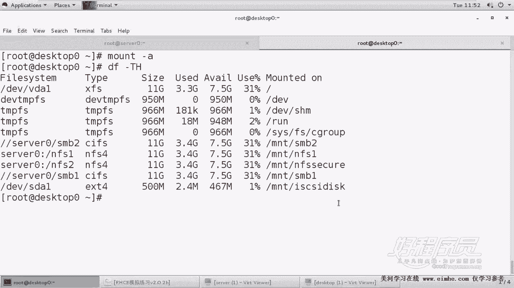
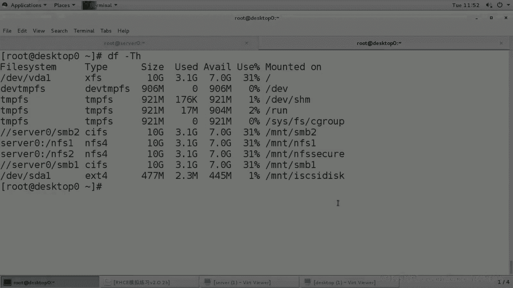

# 1. 杨哥rhce介绍及环境准备 - P15：15. Iscsi 客户端配置及注意事项 - 自普男 - BV1st411d7rF

好，那我们接下来呢开始来配置Sga的客户端，也就是第十4题。desktop0作为客户端，它要求的是能够自动连接到Sga的这个IQN，并且呢用连接到以后的那个卷呢。

那个设那个块啊去创建1个500兆大小的分区格式化成T4挂到这儿。这个行为看起来也比较也比较这个简单，但实际上还是挺麻烦的。来，我们来到客户端这边。第一，我们在客户端这边呢是需要先装软件包。

这个软件包的名字有点长，所以我一般。就叫做Sga星了，它的全称叫什么呢？叫Sgay initator。如果你记不住的话呢，也没关系，就这么装。好，然后我们把那个。S咖D客户端进程启动起来。

然后是enable ice classB集奏起来。好，启动起来以后呢，我们紧接着呢然后来。嗯。先做一个设置，设置什么呢？我们客户端。在。EDCR的S下面有一个文件叫initator的name。

也就是它要它要以什么身份去连接。这边呢它的连接的身份呢？就是我们刚才在哪儿设置的各位。在。在这里面。我们允许的。连接这个名字。否则的话连不上啊。好呃，其实当然应该准确的讲是先改这个文件再启动进程。

那我现在只能重启了，因为凡是改过这个文件的话呢，是需要重启的。所以第一步呢应该是先配哪个呢？第一步是先配这个文件，这是。第一步。改这个文件，然后改完以后呢，它才可以以这个授权的SL方式去连接。第二步呢。

我们去restar SCSD。第三一步呢，我们去做一个。发现。去发现我们的这个icune。到第四一步呢是loin去连接啊loin登上去。一共就四个步骤。各位看啊。

当然第一步呢是那个装包没没有说第一步装包，第二步是去设置客户端的init的名字。因为这个名字是在那边那边只有授权的名字才可以访问。第三一个是重启SD。第四个是什么去发现一下IQN第五步是loing。

那么这几步做完以后。你这边就会多出一个设备，各位看目前我们是没有没有其他设备的，就VDAVDB没有这个设备。那么现在呢我们这一步做完了，这一步做完了该做什么呢？该做一个发现的as as me。

然后是杠MDCOVRY杠TST杠P哪个主机呢？seven0这个主机。好，回车以后，大家看到他已经发现了，就是我们这边这个IQN。那这个IK呢有关联设备，对不对？有关联设备。但是发现不代表就做连接啊。

发现不代表连接，因为有可能连不上。因为你的这个授权信息不对，发现有可能发的现，但是连接不一定成功。好，那发现以后。这个发现命令我不知道大家能不能记住啊，其实这个我们可以慢一下，也可以看I。

I say I I admit前面加一个man。然后我们搜索一下EXAMPLE大写的example。这边呢其实你看第一条命令askcusive杠moddi D B。我刚刚说的是简写杠M。

然后杠T3s targets杠P我都是简写，你完全可以复制这一段，把这里面的IP呢改成s0就可以了。好，然后发现以后怎么去连接呢？呃，怎么去那个login呢？我们启动一个服务叫做。

S注意这个Sgay和SgaD不是一回事儿啊。SgaD呢这是我们的客户端的一个。守护进程这个进程呢它必须要启动，这样的话才能够进行和服务器端的Sgaci通讯，这个是必须要启的。那么Sga这个东西是干嘛的？

它只是帮你去把那些已经发现的连接上。当然，前提是我们的授权必须是正确的。好了，这边没有报错的话。如果说你这儿的名字不对。还有一个是呢你的防火墙上那些设置不对，那你都连不上。好，然后呢。

当然这东西要不要开机启动呢？要的。因为这样的话只有在开机的时候，他就会帮你去连接。大家注意哦，不是说少个D的问题。上面这个D是S客户端的标准通讯的进程。没有它的话呢，你的S服务不能用。而这个小子呢。

它只是临时的启动一次，它只是在开机的时候，把你所有已经发现的这些东西呢，我们叫loin叫连接上。好，然后各位看。我们现在多了一块硬盘，2G的硬盘，这是一个块设备。这个硬盘呢在我们这边呢是两个G。

我们下面呢对这个硬盘进行操作。那么它告诉我们要做做什么操作呢？要分1个500兆的分区格式化成T4，然后挂到MND下的S disk上面。OK那这是这样的来，我们要分区。

for disk第一位下的SDDA回车6主分区嗯，分区编号没问题，守住面没问题，加上500兆right。portt proDV下的SDA好了，我们看一下这个。我们的分区的设备名出来了吗？yesSDA1。

然后呢，他要求的是格式化成T4，那你一定按照要求来，他希望你格式化成什么就什么DV下的SDAE。好，割完以后呢，紧接着呢我们要建立一个挂载点。好，这里有几个特别注意的事项要说明一下。我们现在要准备挂载。

怎么写？各位必须要使用UUID。因为这种设备它的名字可能会发生变化。1UUIDSTAESTAE的UUID好，然后呢我们打开FStable文件，在这里面呢写上UUID注意前面呢不能少一个东西啊。

大家注意到我每次粘贴的时候是进入到插入模式。所以呢前面一定要小心。后面呢挂在点是MND下的SS。IC S I disk。啊，对不对？别别打错了，太。I S I C S I disk。ISCSID好。

后面呢特别要注意的一个点是什么呢？有一个下划线let BEV。letDEV看了吗？哦，还少一项少一项就是它的类型，呃，类型是。EXT4类型。各位这里有两个点非常注意，否则的话这个题如果做不好的话呢。

可能会导致你考试失败，就是你系统起不来。那你想你的dtop里如果起不来，也就是你的客户端如果起不来的话，这一分都没有了，一半的分就在这上面。第一，一定要使用UUID挂载，这是其一。第二呢。

挂在选项里面有一个下划线likeDV，这是什么意思？也就是说这个设备它不是一个标准的本地设备，它是需要借助于网络服务已经被成功启动以后才能够被去挂载。所以呢我们加了这样一个选项。

就是告诉他说你开机的时候，你不要挂，而是在网络服务启完以后了，才能够挂载。好，这是两个非常重要点。这个地方容易造成。特别惨的状态。OK这个没问题。那稍后呢我会也会在后面给大家说一下，如果这个题做错了。

会导致惨烈的效果会怎么办？OK现在这是正常的一个结果，我们先看到一个正常结果把小H取。

好，说明这个题呢就已经okK了。

