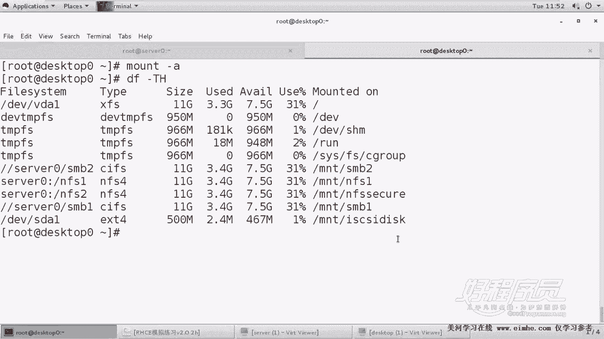
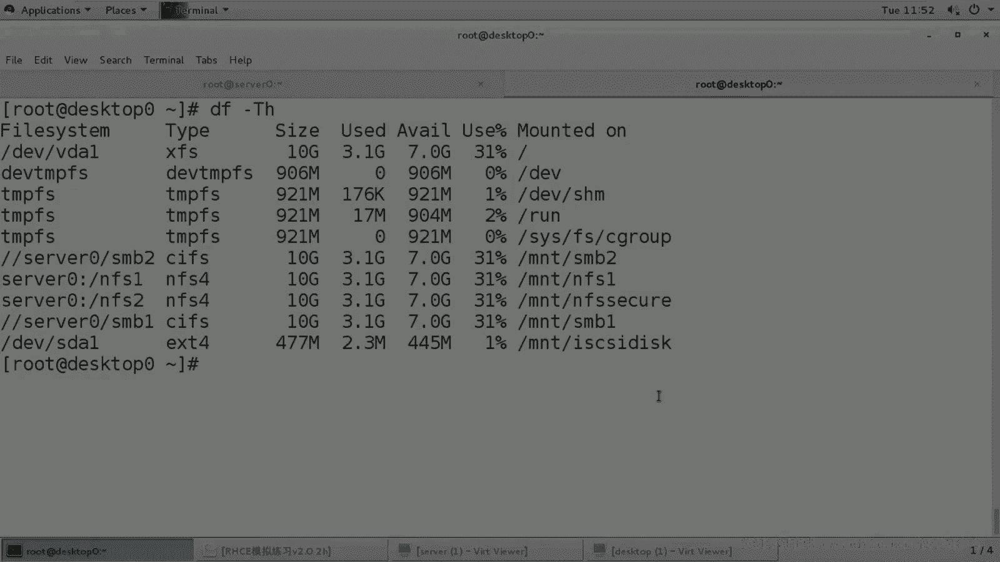

# RHCE课程：15：iSCSI客户端配置及注意事项 🔧


在本节课中，我们将学习如何在客户端（desktop0）上配置iSCSI，以连接到服务器提供的iSCSI目标，并使用其存储卷创建分区、格式化并挂载。整个过程涉及软件安装、身份配置、目标发现、连接以及最终的磁盘操作。

---

上一节我们介绍了iSCSI服务端的配置，本节中我们来看看如何在客户端进行连接和使用。

## 客户端软件安装与进程启动

首先，需要在客户端安装必要的软件包并启动相关服务。

1.  安装iSCSI客户端软件包。软件包全称为 `iscsi-initiator-utils`，可以使用通配符简化安装命令。
    ```bash
    yum install -y iscsi*
    ```
2.  启动并启用iSCSI守护进程 `iscsid`。该进程负责与iSCSI服务器进行通信。
    ```bash
    systemctl start iscsid
    systemctl enable iscsid
    ```

## 配置客户端身份

客户端需要以服务器授权的身份进行连接。以下是配置步骤：

1.  编辑客户端发起程序名称配置文件 `/etc/iscsi/initiatorname.iscsi`。
2.  将文件中的 `InitiatorName` 值修改为服务器端允许连接的IQN名称。此名称需与服务器配置的授权列表匹配。
    ```
    InitiatorName=iqn.2024-08.com.example:desktop0
    ```
3.  修改此文件后，需要重启 `iscsid` 服务以使配置生效。
    ```bash
    systemctl restart iscsid
    ```

## 发现与连接iSCSI目标

配置好身份后，即可发现并连接服务器上的iSCSI目标。

以下是操作步骤：

1.  使用 `iscsiadm` 命令发现指定服务器（server0）上的iSCSI目标。
    ```bash
    iscsiadm -m discovery -t st -p server0
    ```
2.  发现目标后，使用 `iscsiadm` 命令登录（连接）到发现的目标。
    ```bash
    iscsiadm -m node -l
    ```
3.  登录成功后，系统会多出一块新的磁盘设备（例如 `/dev/sdb`）。可以执行 `lsblk` 命令进行确认。

## 磁盘分区、格式化与挂载

连接到iSCSI磁盘后，需要按照题目要求对其进行操作：创建一个500MB的分区，格式化为ext4文件系统，并挂载到指定目录。

以下是具体操作流程：

1.  对新磁盘（例如 `/dev/sdb`）进行分区。使用 `fdisk` 命令创建一个500MB的主分区。
    ```bash
    fdisk /dev/sdb
    # 在fdisk交互界面中，依次输入：n (新建), p (主分区), 1 (分区号), 回车 (起始扇区), +500M (大小), w (保存)
    ```
2.  格式化新分区为ext4文件系统。
    ```bash
    mkfs.ext4 /dev/sdb1
    ```
3.  创建挂载点目录。
    ```bash
    mkdir -p /mnt/iscsi/disk
    ```

## 配置自动挂载（关键注意事项）

将iSCSI磁盘配置为开机自动挂载时，有两个至关重要的细节，配置错误可能导致系统无法正常启动。

1.  编辑 `/etc/fstab` 文件，添加自动挂载配置。
2.  必须使用分区的 **UUID** 进行挂载，因为设备名（如 `/dev/sdb1`）在系统重启后可能发生变化。可以使用 `blkid /dev/sdb1` 命令查看UUID。
3.  必须在挂载选项中添加 **_netdev**。这告知系统此设备依赖于网络，需在网络服务启动后再尝试挂载，避免因网络未就绪导致的启动失败。

一个正确的 `/etc/fstab` 条目示例如下：
```
UUID=你的分区UUID /mnt/iscsi/disk ext4 defaults,_netdev 0 0
```

配置完成后，可以执行 `mount -a` 测试挂载，并使用 `df -h` 命令确认挂载成功。



---



本节课中我们一起学习了iSCSI客户端的完整配置流程。我们首先安装了软件并启动了服务，然后配置了客户端的连接身份。接着，我们发现了服务器上的iSCSI目标并成功建立连接。最后，我们对远程磁盘进行了分区、格式化，并特别强调了在 `/etc/fstab` 中使用UUID和 `_netdev` 选项进行正确挂载的关键步骤。掌握这些步骤和注意事项，是顺利完成相关RHCE考题的基础。