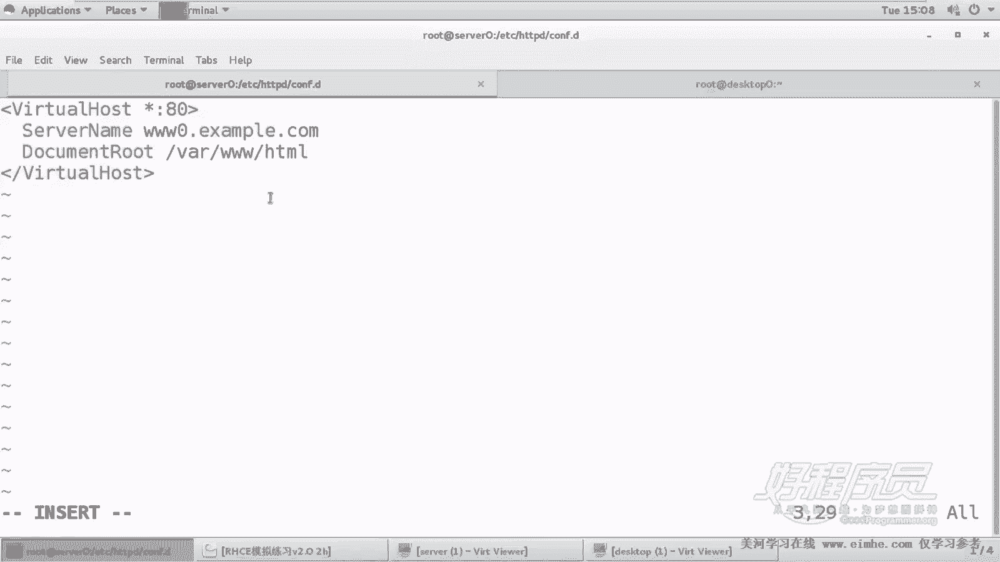
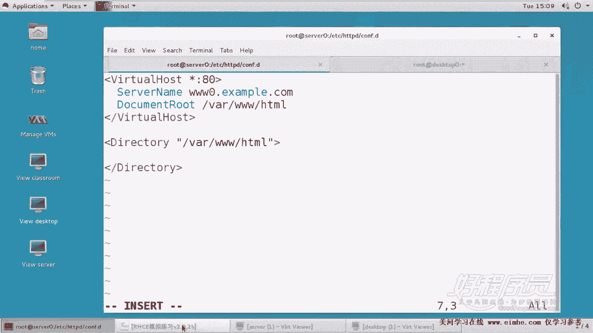
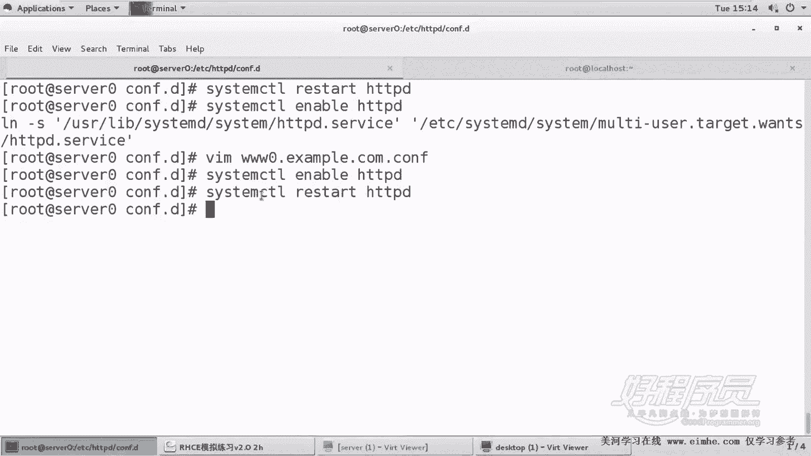
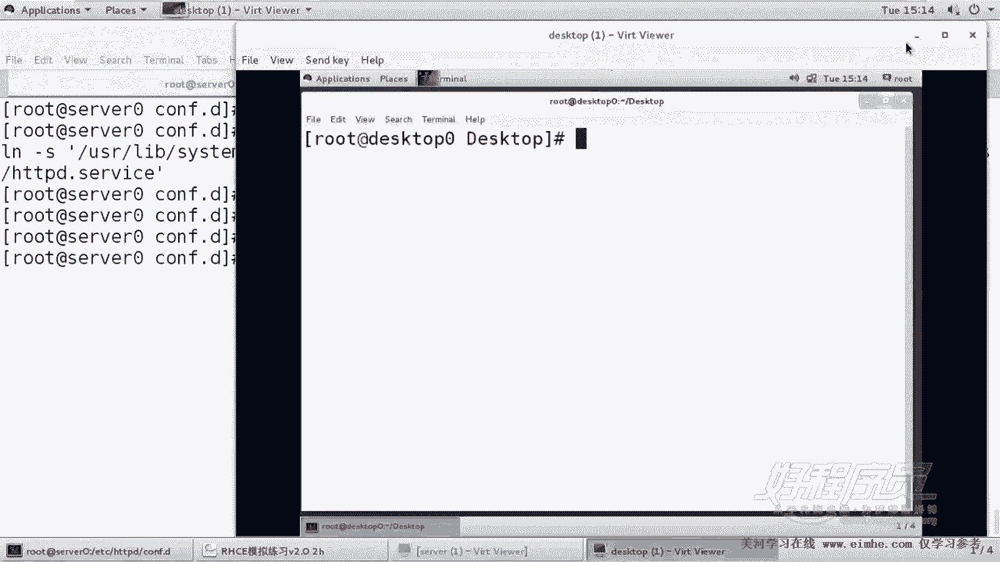
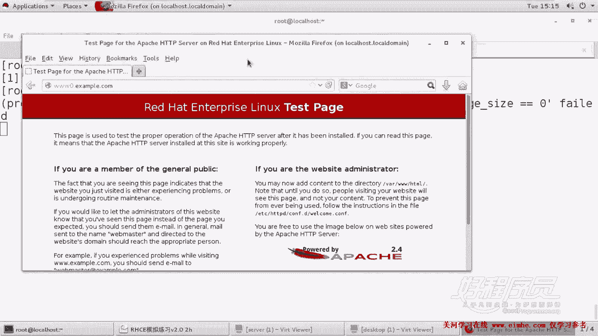
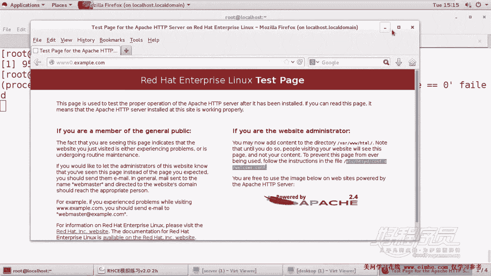
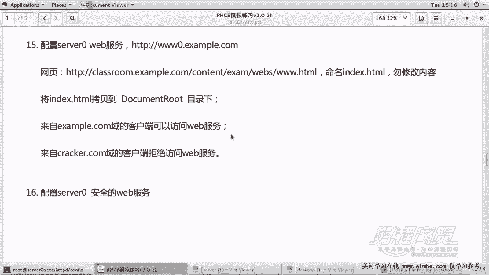

# 1. 杨哥rhce介绍及环境准备 - P16：16. Apache服务器 Http-www0-example-com - 自普男 - BV1st411d7rF

好，我们继续来学习RGCE后续的一些内容啊。首先我们到这个环境里面去。嗯，第十五题呢是配置网站服务器。这个网站服务器呢，它。首先有一点要说明的是，在整个我们配置网站服务器的过程当中。

这种解析原本呢我们使用DNS服务器，我们手动来配DNS服务器解析这种方式呢不用做。因为它已经将所有这里面所涉及到的名字，包括这里面我们所看到的3W0，还有我们后面的serv0，这些都已经解析好了。

因此呢我们只需要用就可以。也就是说这些主机呢其实都指的是你这台机械。那么第一道题呢，它要求我们配1个3W0点example点comM。网页呢是。在这个目录下面准备了一个网页，然后要求我们将其。

下载下来以后，放到网站主目录里面。放到网站document的root里面。将它命名成indexedATL。而且明确也说了，只有example域的中的主机可以访问。那这个怎么做？是通过防火墙做还是怎么做？

很显然，我们不能通过防火墙做。因为防火墙呢它一旦做了这种限制，它将是对所有网站。因为我们后面还有别的一些站点。那在整个做的过程当中，我们还要用到阿帕奇的虚拟主机技术。

也就是说那一共呢有那么四五道网站服务器题，我们这些都每一个建议大家都使用虚拟主机。允许来自于这个域的。客户端可以访问来自于这个域的客户端呢是拒绝的。好的，那这怎么做呢？

首先我们来安装我们的软件app帕奇软件。由于在。由于在后面呢，我们还用到M model SSL加密的方式。另外我们还会用到了这个python的这种WSGI。所以呢这边我们直接把它装好就装好就可以了。

一并把它装好。好的好，各位。那装好以后呢呃网站服务器呢，我们建议大家先把它这个防火墙给它做好。fireworkcom杠杠perment。刚刚APDservice。ITDP和ITTPS。

别out一下防火墙。好，那首先呢这个先将它的网页下载下来。这个网页呢是刚才我们copy过这个路径，下载下来以后呢，直接给它放到杠O重令像到VR下载3W下载ATML。

这是我们默认的网站主目录名字呢直接叫做。index好，我们查一下。VR下载3W下载ATM下面有一个网站首页。好，这是已经把这个网站首页做好了。那我们说了。现在其实你启动网站服务器可以访问。

但是呢由于我们后续还有很多站点。因此，我们把每一个站点都配置成为虚拟主机，进到阿帕奇的主目录里面的子目录啊，confi定影目录里面，这里面呢其实就有一些现成的配置。好，我们可以在这里面新建一个。

但这里要注意，后缀必须是点coml的文件。好，比如这个叫什么呢？它的名字叫3W0点example点com。好，那我们就叫做3W0点EXAMPL点com点com文件。注意一定是点com。

如果不是点com文件呢，将不会被将不会被我们的这个主配置文件所引用啊。在这里呢我们使用的是一对指令叫做VRRTOULLpost。虚拟主机。然后紧接着呢是我们的这个接口，监听的接口，所有接口的80端口。

好，我们先把这个结结尾写上斜线。其实在阿的配置文件当中是是不区分大小写的。所以说这个wat host你怎么写，只要对就行。但曾经有一个学生把这个冒号写成了点儿，这个很难检查出来啊，而且启动还不报错。好。

这个网站呢s name。是3W0点EXAMPL点comM。然后以及呢。document rootot网站主目录是VR下3W下载APML。当然应该严格讲，应该再写上这个网站的访问的日志和错误日志。

在这里呢呃考试的时候呢，我们还是力求简单，只要能够把这个做对就行。好，除此以外，我们还应该对网站主目录，通过DRECTYYdirecty对网站主目录，也就是VR下的3W下的ATML做一个。

防控制。这怎么做防控制？这边最好啊拉两个空格吧。好，这个防控制呢，刚才我们看到它是要拒绝。

拒绝这个什么。某一个网段哪个网段？允许来自于这个网段的主机可以访问。但是呢有一个网段，也就是cb点com网段的主机是拒绝的。OK那也就是说除了它以外呢，别的都可以访问。好的，那我们在这里面怎么写呢？

我们要用到一个require or标签。斜线。好，这里呢没有颜色啊，这这这一段之间在这里面我们通过。Requiry哦。呃，如果写上require or granted的话呢，它是表示允许所有主机。

当然如果是只是想允许所有主机呢，其实也不需要这个require order的标签。如果只是你的这个整个访问控制里面，仅仅是仅仅是做什么呢？做这个。嗯，允许，那我们没必要使用require or。

只有当我们使用拒绝的时候，需要require all。requiry notIP每个IP呢172点。我们得知道crack点com。这个域的网段是多少？同样呢在考试的环境当中有17224。3。0这个网段。

好，我们将国标，我们将这个移到下面。172点24。3。0-24。好了，注意注意这里无论是你使的是IP还是网段，后面这关键字都叫做IPlet IPP这里呢我再次提醒各位一下。

如果说这个目录你仅仅是允许所有主机访问，那就直接rere or granted的就可以，不需要require or标签。只有当我们这里面有拒绝的话呢，我们需要使用quire or标签啊，这里要注意。好。

如果没问题的话呢，我们来把这个阿帕奇呢启动一下。好，这边没有报错，这是最好的。如果报错的话呢，有可能是某一个指令写错。那比如说我们这里面指令写错一个，像这样写错一个啊。他在起的时候就会报错。

大家特别小心。当然报错的话呢，你看它也会提示我们使用这条命令去看。可以看。回车。那使用这条命令去看，但看的话呢，他明确告诉我们在这个文件的353行有语法错误啊，353行啊。好。

那这边呢我们使用打开这个文件。直接进到353行上去。就是这一行啊，但也不能说这一行是因为。前面这个错了话会导致后面呢也会出错。好，我们再次重启一下服务器。嗯，启动服务器以后。

下面呢我们就开始测试一下这个网站的访问情况了。因为防火墙也是开着的。啊，别忘了还要将其设置为。system CPL将其设置为开机自动启动。好的那怎么测试呢？我们可以在客户端这边做一个测试，在客户端这边。

在客户端这边呢，我们可以打开，如果可以的话呢，我们可以打开浏览器faair world fire force。浏览器。好，这边提示我们不能打开，这还是跟这个有关系。我这边也用了哦也用了这个图形化的方式。

呃，图你用X，但是就是不好用啊。正常情况下，你使用X叉window的话呢，就能够直接打开图形。但是我们不知道这个能不能在前面我们用的时候发现一有问题。3W0点EXAMPL点comM好了。

各位现在访问的网站是这个网站，至少说明这个是对的。如果说你想要反向测试一下的话呢，可以怎么做呢？你可以在这里面。打开这个文件，然后你。可以把我们的172点。25网段，也就是0。0这个网段拒绝一下。

就是想测试一下。那个3W0点ex点com。诶。哦，这是logo host，这是哪啊？我们就从这里面访问吧，我们的IP刚才有没有写写对啊？172。25点。0。0呃0。0对没错。配置文件这边呢哦刚没有重启。

我以为是重启。

enable好，再次来测试一下。呃，无论是在这里面访问，还是在这里面访问呢，都可以。只要是打开客户端浏览器啊，都可以来测试。

3W0。好了，各位现在其实访问不了，不是是网站访问不了，网站可以访问。因为现在我们看到的是默认的网站，默认网站的这个主主主页文件啊，默认的网页也就是这个页面。那我们原来的那个网站内容已经访问不了了。

因为我们已经拒绝了。好，同样的我们把它改回来。

啊，考试的时候你不要这么欠啊，因为这样的话会害死你的。重启。好，再次来刷新一下。好，可以了。好，这就是这台呃这个第一道题的这个做法，这里注意几个点，一。你的网网站的名字一定叫这个名字。还有一个呢。

你的网页必须从这儿下载，而且里面内容不让修改，下下来以后呢，放到网站主目里面去叫做首页。而且我们是新建了一个配置文件，新建了一个虚拟主机的配置文件。最后呢拒绝了这个网段。

我们用到了一个标签叫require or。我刚刚也提到过，如果只是简单的允许的话呢，是不需要requequire or那个标签，直接写上requi谁谁谁就可以了。好，这是关于。

这道题的这个做法。