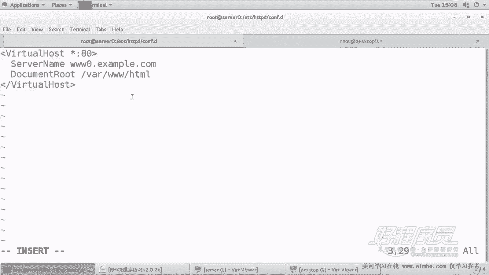
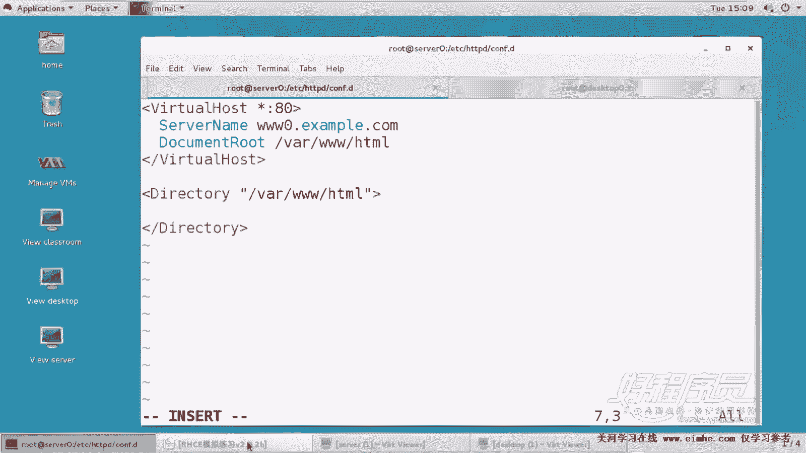
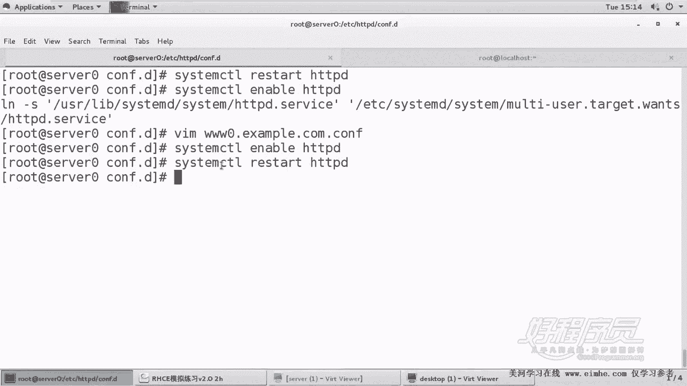
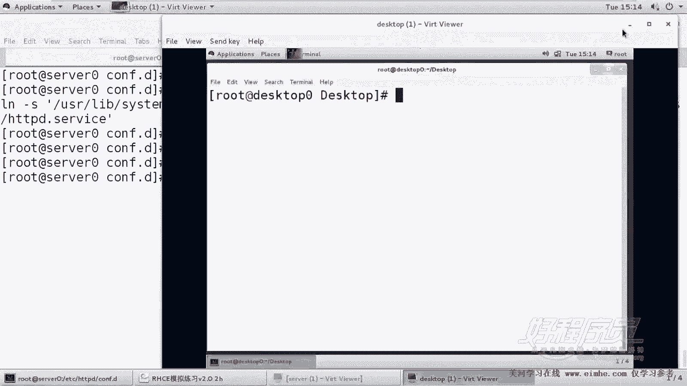
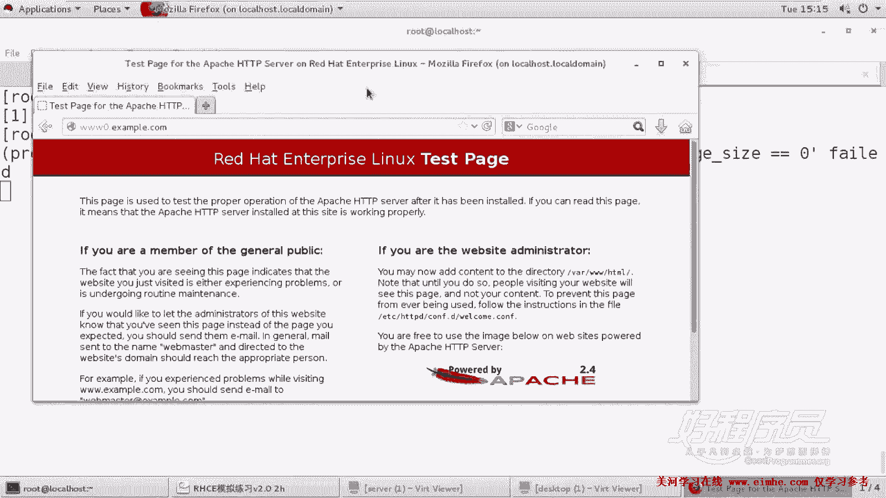
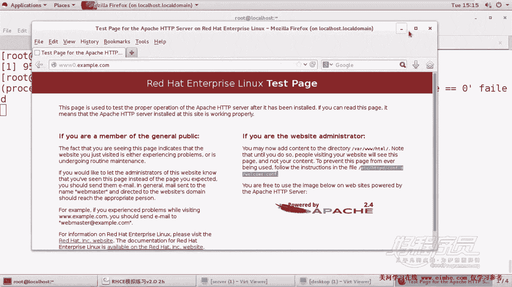
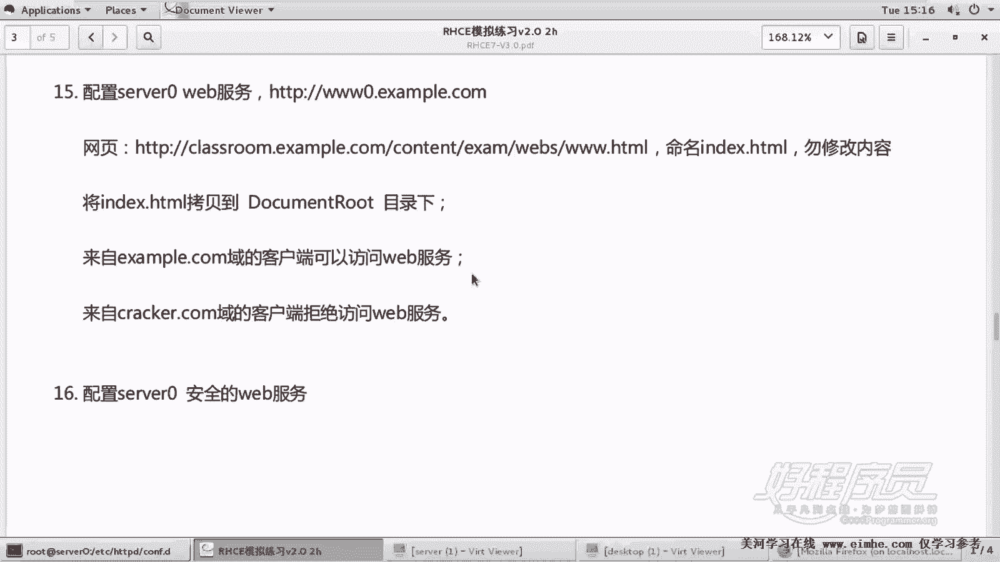

# RHCE课程：1.16：Apache服务器配置 - www0.example.com


在本节课中，我们将学习如何配置一个基本的Apache虚拟主机，并设置基于IP地址的访问控制。我们将完成一个具体任务：为域名 `www0.example.com` 配置网站，并限制只有 `example.com` 域内的主机可以访问，同时明确拒绝来自 `cracker.com` 域的主机。

## 概述与准备工作

上一节我们介绍了RHCE课程的整体环境。本节中，我们来看看如何配置Apache网站服务器。

首先需要说明，在本次配置任务中，所有涉及的主机名（如 `www0.example.com`）已由系统预先解析完毕，指向本机。因此我们无需手动配置DNS，可以直接使用这些主机名。

第一道题要求我们配置 `www0.example.com` 网站。网页内容已预先准备，我们需要将其下载并放置到网站主目录下，并重命名为 `index.html`。题目明确要求只有 `example.com` 域的主机可以访问。这不能通过防火墙实现，因为防火墙规则会影响服务器上的所有站点。我们将使用Apache的虚拟主机技术和目录访问控制来实现这一要求。

在开始配置前，我们需要安装Apache软件。考虑到后续课程还会用到SSL加密模块和Python WSGI支持，我们将一并安装这些软件包。

以下是安装Apache及相关模块的命令：
```bash
yum install -y httpd mod_ssl mod_wsgi
```

安装完成后，建议先配置防火墙，放行HTTP和HTTPS服务。

以下是配置防火墙的命令：
```bash
firewall-cmd --permanent --add-service=http
firewall-cmd --permanent --add-service=https
firewall-cmd --reload
```

## 下载并放置网页文件

首先，我们需要下载提供的网页文件，并将其放置到默认的网站主目录 `/var/www/html` 下，同时重命名为 `index.html`。

以下是下载和放置文件的命令：
```bash
wget -O /var/www/html/index.html [此处为提供的网页文件URL]
```

下载完成后，可以验证文件是否存在。
```bash
ls -l /var/www/html/index.html
```

## 配置虚拟主机

现在，网页文件已就位。但为了不影响后续其他站点的配置，并为当前站点设置独立的访问规则，我们为 `www0.example.com` 创建一个虚拟主机配置文件。

Apache的主配置文件会读取 `/etc/httpd/conf.d/` 目录下所有以 `.conf` 结尾的文件。因此，我们在此目录下创建新的配置文件。



以下是创建并编辑虚拟主机配置文件的步骤：
1.  进入配置目录：`cd /etc/httpd/conf.d/`
2.  创建配置文件：`vim www0.example.com.conf`



在配置文件中，我们使用 `<VirtualHost>` 指令块来定义虚拟主机。关键配置项包括监听端口、服务器名称、文档根目录以及访问控制。

一个基本的虚拟主机配置框架如下：
```apache
<VirtualHost *:80>
    ServerName www0.example.com
    DocumentRoot /var/www/html
    # 其他配置指令...
</VirtualHost>
```

## 设置目录访问控制

题目要求仅允许 `example.com` 域访问，并拒绝 `cracker.com` 域。在RHCE考试环境中，`cracker.com` 域对应的IP网段是 `172.25.0.0/24`。

我们需要在虚拟主机配置中，对文档根目录 `/var/www/html` 使用 `<Directory>` 指令块进行访问控制。这里会用到 `Require` 指令。

**核心概念**：当访问控制列表（ACL）中**同时包含允许和拒绝规则**时，必须使用 `<RequireAll>` 标签将它们包裹起来，Apache会按顺序评估这些规则。如果只是简单的允许所有或拒绝所有，则不需要此标签。

配置目标是：允许所有访问，但明确拒绝 `172.25.0.0/24` 网段。

以下是配置访问控制的代码：
```apache
<Directory "/var/www/html">
    <RequireAll>
        Require all granted
        Require not ip 172.25.0.0/24
    </RequireAll>
</Directory>
```
*   `Require all granted`：允许所有客户端。
*   `Require not ip 172.25.0.0/24`：拒绝来自 `172.25.0.0/24` 网段的IP地址。
*   `<RequireAll>` 标签要求内部的所有规则都必须满足，因此结合上述两条，效果是“允许所有非172.25.0.0/24网段的访问”。

## 完整的配置文件示例

将虚拟主机和访问控制配置组合起来，`/etc/httpd/conf.d/www0.example.com.conf` 文件的完整内容应如下所示：

```apache
<VirtualHost *:80>
    ServerName www0.example.com
    DocumentRoot /var/www/html

    <Directory "/var/www/html">
        <RequireAll>
            Require all granted
            Require not ip 172.25.0.0/24
        </RequireAll>
    </Directory>

    # 可选的日志配置，考试中非必需
    # ErrorLog logs/www0.example.com-error_log
    # CustomLog logs/www0.example.com-access_log common
</VirtualHost>
```

## 测试与验证

配置文件编写完成后，必须检查语法是否正确，然后重启Apache服务使其生效，并设置开机自启。



以下是检查语法、启动服务并设置自启的命令：
```bash
httpd -t               # 检查配置文件语法
systemctl restart httpd # 重启Apache服务
systemctl enable httpd  # 设置开机自启
systemctl status httpd  # 检查服务状态
```

服务启动成功后，即可进行测试。可以从另一台属于 `example.com` 域的客户端机器上，使用浏览器或 `curl` 命令访问 `http://www0.example.com`，应能正常看到网页内容。



为了验证访问控制生效，可以尝试从 `cracker.com` 域（IP属于 `172.25.0.0/24` 网段）的主机进行访问，应该被拒绝。在考试环境中，可以通过临时修改配置文件，拒绝一个测试用的IP网段来模拟此效果，但测试后务必改回原配置。



**注意**：在考试中，请勿随意修改拒绝的网段，以免导致自己的访问被阻断。



## 总结

本节课中我们一起学习了Apache网站服务器的基本配置。我们完成了为 `www0.example.com` 配置虚拟主机，并实现了基于IP地址的访问控制。关键步骤包括：

1.  **安装软件包**：安装Apache及可能用到的模块。
2.  **准备网页**：下载指定网页并放置到正确位置。
3.  **配置虚拟主机**：创建独立的 `.conf` 文件来定义站点。
4.  **设置访问控制**：使用 `<Directory>` 和 `<RequireAll>` 指令块，结合 `Require all granted` 和 `Require not ip` 来允许大多数访问，同时拒绝特定网段。
5.  **测试验证**：检查语法、重启服务，并从不同网络来源测试访问结果。



记住核心点：当需要混合“允许”和“拒绝”规则时，务必使用 `<RequireAll>` 标签。