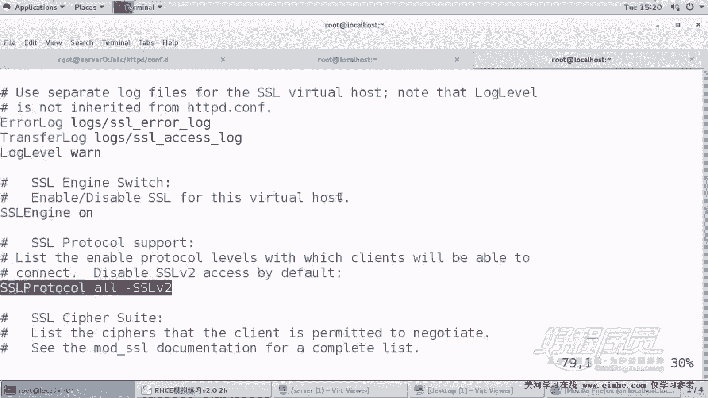
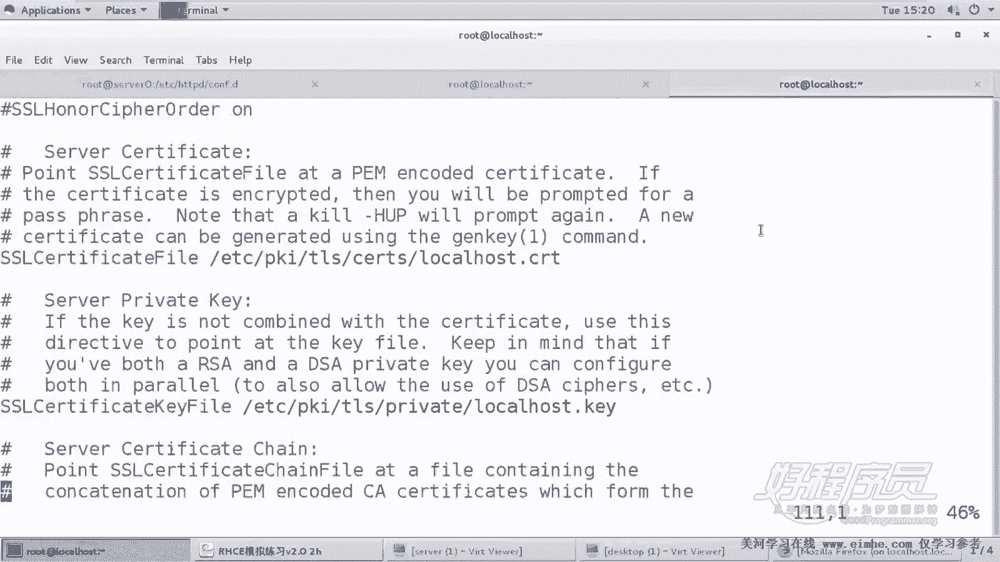
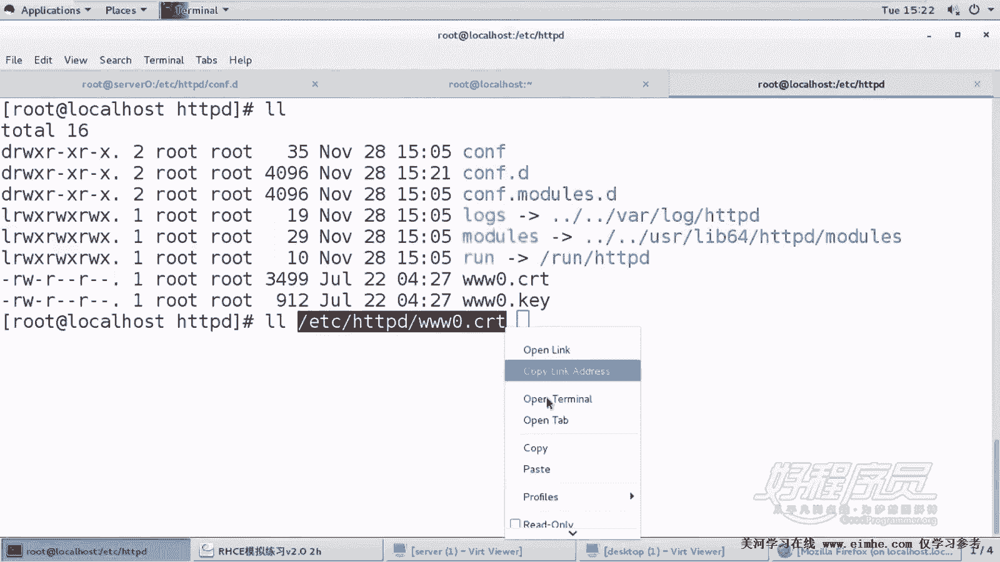

# 1. 杨哥rhce介绍及环境准备 - P17：17. Apache服务器 Https-www0-example-com - 自普男 - BV1st411d7rF

好，下面我们来看第二道那个网站复习题。那这道题呢？

也同样是在server零上进行配置，它是要求配置一个安全的web server。好，这边呢我们要使用到。

ITITTPS这种加密的方式。所以呢。还是刚才那个网站，只不过呢我们要配置成为一个加密的呃，两种方式访问，一种是80。这个之前在前面已经实现过了。然后这边呢我们要实现的是加密的方式访问。嗯。

首先要去得到几个东西，一是这个网站的证书。这个证书呢当然是由CA机构，也就是我们的证书签发机构签发的这块呢在不在CE的考试范围的理解当中。而我们如果想要去学习。像CA的证书的这个机构的一些设置呢。

我们要学习更多的一些课程。还有一个此证书的密钥是这个。另外一个呢是此证书授权的信息是从他授权的，也就是由这个CA机构授权的。我们这边呢需要用到这么几个信息。

好，那怎么做呢？同学看。我的建议呢是。可以，就直接还是刚才那个网站，那就打开这个网站。在这里面呢我们去。新建一段。把这段复制一下，我是怎么复制的啊，移到这儿cttrol加V向下向下向下Y选择。

然后粘贴这边呢我们使用43。当然有一个前提，什么前提呢？我们刚才在前面装包的时候，各位看装包的时候已经装了SSL这个模块，所以呢才能够支持SSL，否则的话也不能够实现啊。打开。打开的话呢。

这边呢网站的名字，网站的主目录这个是不变的，只不过变的是什么呢？我们要打开SSL引擎，这怎么打开呢？这个其实不太好记啊，所以我们最好找一个找一个找一个机器呢。我们可以把这个机器再这台服务器再连一次。

找一个找一个终端再连接一次啊SSH杠Xroot。ats0再连接一次。然后这里面呢大家看到在哪儿呢？嗯在我们的EDC下的。ITDPD下的。comtl点D下面有一个叫PHP的一个。啊。

有1个SSLSSL的一个文件，这就是我们的模板。

当然它也是被在在被使用。这其中呢我们看到有什么呢？有这个。有几项我们需要用wacher host这里面看一下。

一个是打开SSL的引擎。

直接复制粘贴就可以了。

然后呢，SSL的这个算法。

这边算法这边呢其实没有明确要求，呃，包括是否支持SSLV3V3这个版本呢我。

可以把它加上去。还有呢就是。

这个其实算法这些呢都是呃协议啊SS协议和算法这些东西可以不不写啊，都是默认的，可以不写。就是你不写也没关系。这些呢它会从那个文件里面读到，我们直接打开引擎，然后呢再写上它的证书和它的私钥就可以了。

好，这边哪个是证书呢？我们看到SSL certification fell，后面呢是证书的位置。好，我们好像还没有下载证书，所以。这个证书下面哪个地方？首先。

其实没有严格的这个定义。按照按照这个原来的文档上定义的，它是下载到EDCPKITLS下面。其实这个无所谓啊无所谓，不是说非要下到这下面去，你可以下到任何地方。那比如说我们我先把这套指令复制一下。

这是它的K。

后面呢我们需要一个路径。我们首先进到EDCITTBD这里面，我一般喜欢把它这个放到这个这里面啊，W get下载一下刚才我们在页面上。

比在那个整个。

考题里面所提供的这样一个证书。下到此处。然后还有一个是他的私钥。

好的，那这里的路径呢是EDC下的ITTBD下的。3W0点CRT文件和那个3W0点K文件。好，我们将这个路径做一个复制。

这上面的这个是。没有带K的这个啊是证书。下面这个呢是。KY资要。好，OK是这样的。好了，那这样的话呢，我们这个网站大家再仔细看一下，一是监听的端口是443。另外一个是这个我们打开了SSL引擎。

以及呢写上了它的证书和它的私钥。好，那即将会建立在43端口上面。好，这边呢我们重新启动一下。ITTPD。好，还好没有报错，来看一下。80端口或者是43端口。好，用到的是igrap啊。

因为只有一个rap才才能够去使用这种扩展原子符数线，这种或者的原字符43还有80坚定在所有接口上面的，OK没问题。那怎么来访问呢？这个访问呢当然不是说必须必须要去测试。这个访问的话，我们是从这个。

客户端这边。也就是dstop这边去访问的这边去访问。好，大家可能看到这个名字有点变化，这个名字呢本来叫s0或者叫stop0，现在变掉了啊，这是因为我们的这个配了1个IP的原因啊，解析有些问题。

不过这不重要。好，我们看当前的名字其实已经出了出了一些问题。这个名字呢在CE的时候是不要求我们做的。所以。把它改过来。好，这个不是必须的啊。C因为CE这块呢，它会自动，它本身就有一个正常的名字。

我们不需要设置所有的关于网络的信息。好，那现在我们在客户端这边怎么测？首先我们如果现在打开浏览器的话。

去访问那个网站肯定会很会有问题。因为现在我们客户端没有，因为它是一个私有的机构签发的证书，所以我们手上是没有这个机构的公钥的啊，没有这个机构的这个那个公钥。因此呢我们访问。

ITTBS。3W0点examp点comM。

大家发现有一个不被信任的这样一个东西，大该怎么做？我们关掉。

double get我们把那个。

CA机构的证书download一下。当然这个是在客户端上download的。

放到任何位置。那放到这就好使了吗？当然不是我们还需要打开浏览器，在浏览器里面呢，把这个私有的CA机构的证书给它载进去，点编辑属性。然后最后一项高级最后一项的最后一项，最后一项最后一项，然后查看证书。

最后呢导入证书。

导入证书找到我们root下刚才下载那个C证书导入。他会问你，你这个证书是用来干什么的？我说我来信任我们的网站，信任邮件，信任软件，其实就关键是第一项啊OK。

OK这样的话，我们的这个浏览器就导入了这个证书。我们再次来像刚才一样访问一下。

大家看到这边都已经正常了，而且这边这个小锁呢，我们也能看到更多的information，看到这里面的证书的一些情况，签署的情况是对他签署的一个名字。

O。这就说明什么呢？说明我们整个。

整个这个是okK的。说明证书这个签发啊，证书的签呃，证书的这个使用是OK的。

OK这就是关于我们的第二道题，这里几个要点，各位再来看一下。嗯。我们第一步下载这书，其实放在哪个地方，并不是说一定要放在放在他所要求的这个目录里面。当然你也可以放到那里面，没关系。下载证书和私钥。

这个是用于我们服务器的服务器端的客户端这边呢，我们下载一下那个CA的这个公钥，写CA的证书，最后导入浏览器。

在服务器这边，我们依然是在刚才的3W这个网站里面去加了一个wat host。端口变成了43，然后呢，这个主机名没有变，网站主目录没有变，还有呢它的引擎启用了，还有证书和它的私钥，其他的都没有变化。好。

这就是关于什么呢？关于我们的第二道ITTPS的这道题的一个做法。

