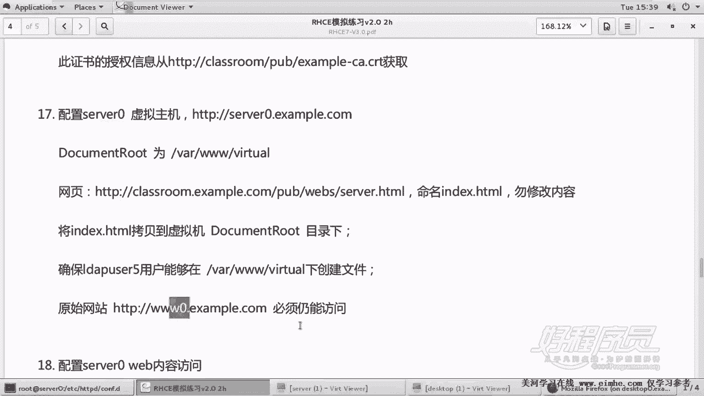

# 1. 杨哥rhce介绍及环境准备 - P18：18. Apache服务器 Http-server0-example-com - 自普男 - BV1st411d7rF

好，我们接着来看另外一个虚拟主机。那这边呢要求的是s0。s0这个虚拟主机呢，它的网站主目录呢，这边也给了一个定义，就是在根下的VIR下啊跟下的VIR下的3W下的watcher这个目录。然后另外呢。

这个网页这个网页文件呢从这边下下来以后，命名叫做INDX点TL这个页面。然后将它放到网站主目录下面，也就是VR下3W下的wat下面。嗯，然后呢这个。内容是不能够做任何修改。

还有一个是确保一个用户叫ld user5这个。用户能够在VR下的3W下watcher下创建文件。原始网站必须能够访问这是题的要求。那么很显然这是另外一个虚拟主机。所以我们在一开始做这个做网站的时候。

就把3W0也做成了虚拟主机。这个也是一个虚拟主机，包括后面还有一个网站呢，当然也是一个虚拟主机。好，那么这个这个题呢，我们第一步呢肯定要先准备一些资源，一些材料，包括网站融目录，包括下载文件。

以及呢去设置相应的权限。好的。好，在这边呢我们怎么做呢？第一步，创建VR下3W下的VRRTUL这个目录。然后呢，紧接着我们去下载d get去下载这个页面啊，这个网页。

到港欧到VR3W下的wa下面叫做IDXAT。大家看到这边报了个错，他没有找到这个页面，404的错误。这个路径我们看一下。好，这也有一个小问题，这个路径我写错了。

这路径应该是countent下的example下面the serverever。所以大家呢下的时候呢要注意一下，这个是可能当时呢这个改的时候没改好啊，我们把这个内容改一下。好，是这个文件看了吗？

我们将其下到VR3W下的wacher下面叫做index。可能有同学说我们一直是没有关注过这个叫SElinux权限，其实不用关注。因为啊Slinux是开启的，你下到这里面来以后呢。

它默认就会配一个正确的上下文给它，所以没有问题。还有一个呢，我们要设置一下我们要设置一下这个用户Ldap。user5这个用户。啊，sorry是user。能够干嘛呢？能够读写执行啊，对于目录来讲的话呢。

我们需要给一个执读和执行权限，否则的话用户是没办法切换到这里面去的。好了，那么前期工作准备好了，我们下面呢该开始来创建这个虚拟主机。好，千万不要改里面的内容啊。你可以把刚才的那个叫。

3W0这个文件拷贝成。s0这样的话呢，你可以快速的去生成一个新的东西。s0。然后在这里面呢，他现在肯定不要加密的这个啊，所以我们只需要这一段。是是。s0网站逐步录制。我操。当然这边呢由于是拷贝的。

所以很容易出问题。你一个地方没有改好的话呢，这个差你做就排错的话可能就很困难。因此呢呃大家呃一定要认真一点，好，这个网站呢倒没有说谁不能访问，所以我们就让所有访问就可以了。刚才我说过。

如果说你只是单纯的允许的话呢，是不需要使用recor标re or标签的，不需要使用requi all标签啊。好了，我们再次来来看一下这个这个东西是不是我们做对了。

wa host星号80名字s0点ex co网站主目录VR下3W下的wa然后网站主目录呢VR3W watch这个目录。然后requi or granted好了，应该是可以。嗯，这边的倒也倒也不需要重新去。

配防火墙，因为这已经是配好了的啊。好，语法了但愿没有错，没有错的话呢，我们再次来从客户端这边呢做一个测试。嗯，这不是客户端。这是服务器这边啊。这才是客户端。我们先测一下原来的网站，3W0可以访问。

再测一下这个ITTPS。3W0哦，可以访问，还有小锁两个不同啊，再测一下那个severever0点EXAMPL点comM。好了，各位内容呢都不一样啊，不是都不一样啊，这个不一样，这两个是一样的。

3W说明呢我们这两个这三个站点呢做的都是成功的。好，各位再次来看一下。这个网站呢它的主目录不一样，还有网页呢，这边我在笔记上我在这个出的题上面有点问题，你照着上一个路径去下载一下就可以啊。

不是在pub下面啊，是在countent下的example下面的rebs里面。然后呢，另外呢，我们的用户ld user5能够在这个目录下创建文件。这个其实我没法测啊。

因为我们的站点只是一个普通的一个网页，没办法去测试。然后最后确保原来的网站都是正正常访问的，也就是做我们的虚拟主机。

