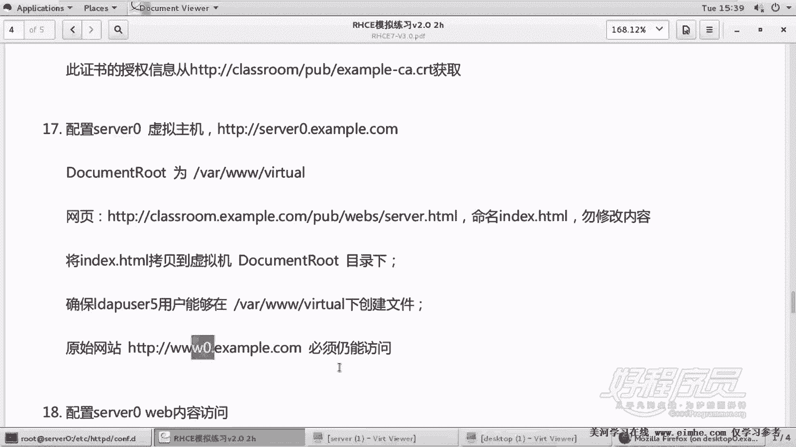

# RHCE课程：P18：Apache服务器配置 - 虚拟主机 `server0.example.com` 🖥️

在本节课中，我们将学习如何为Apache服务器配置第二个虚拟主机 `server0.example.com`。我们将从准备网站目录和文件开始，然后配置虚拟主机，并确保满足特定的权限要求。

## 概述

上一节我们介绍了如何配置一个基本的虚拟主机。本节中，我们来看看如何配置另一个名为 `server0.example.com` 的虚拟主机。这个任务要求我们设置特定的网站目录、放置指定的网页文件，并确保特定用户拥有在该目录下创建文件的权限。

## 环境与资源准备

在开始配置虚拟主机之前，我们需要准备好网站运行所需的目录和文件。

以下是创建网站目录和下载网页文件的步骤：

1.  首先，创建网站的主目录。
    ```bash
    mkdir -p /var/www/watcher
    ```

2.  接着，从指定路径下载网页文件到网站主目录，并重命名为 `index.html`。
    ```bash
    wget -O /var/www/watcher/index.html http://content.example.com/webs/server0.html
    ```
    **注意**：下载路径应为 `content.example.com/webs/server0.html`，而非视频中最初提到的路径。下载后，文件内容不可做任何修改。

3.  最后，设置目录权限，确保用户 `ldapuser5` 能在该目录下创建文件。对于目录，需要赋予读(`r`)和执行(`x`)权限。
    ```bash
    setfacl -m u:ldapuser5:rx /var/www/watcher
    ```
    **说明**：SELinux在开启状态下，文件下载到 `/var/www/` 目录后会自动获得正确的安全上下文，因此无需额外配置。

## 配置虚拟主机

前期准备工作完成后，现在可以开始配置虚拟主机。我们可以通过复制上一个虚拟主机的配置文件来快速创建。

以下是配置 `server0.example.com` 虚拟主机的步骤：

1.  将上一个虚拟主机（例如 `www0.conf`）的配置文件复制为新文件 `server0.conf`。
    ```bash
    cp /etc/httpd/conf.d/www0.conf /etc/httpd/conf.d/server0.conf
    ```

2.  编辑新的 `server0.conf` 文件，修改关键配置项。
    ```apache
    <VirtualHost *:80>
        ServerName server0.example.com
        DocumentRoot /var/www/watcher
        <Directory /var/www/watcher>
            Require all granted
        </Directory>
    </VirtualHost>
    ```
    **关键修改点**：
    *   `ServerName`：修改为 `server0.example.com`。
    *   `DocumentRoot`：修改为 `/var/www/watcher`。
    *   访问控制：由于允许所有访问，仅需使用 `Require all granted` 指令，无需额外的 `<RequireAll>` 标签。

3.  保存文件后，检查Apache配置语法是否正确。
    ```bash
    apachectl configtest
    ```
    如果显示 `Syntax OK`，则说明配置无误。

## 测试验证

配置完成后，需要验证虚拟主机是否工作正常，并确保原有网站不受影响。

以下是测试各个虚拟主机的步骤：

1.  重新加载Apache配置以使更改生效。
    ```bash
    systemctl reload httpd
    ```

2.  从客户端（或服务器自身使用 `curl` 命令）测试所有虚拟主机的访问情况。
    *   测试 `www0.example.com` (HTTP):
        ```bash
        curl http://www0.example.com
        ```
    *   测试 `www0.example.com` (HTTPS):
        ```bash
        curl -k https://www0.example.com
        ```
    *   测试新的 `server0.example.com`:
        ```bash
        curl http://server0.example.com
        ```

3.  如果每个命令都返回了正确且**内容不同**的网页HTML代码，则证明三个虚拟主机（`www0`的HTTP和HTTPS站点，以及新的`server0`）都配置成功，可以独立访问。



## 总结


本节课中我们一起学习了如何为Apache服务器添加一个新的虚拟主机 `server0.example.com`。我们完成了从创建目录、获取网页文件、设置用户权限，到复制并修改配置文件的全过程。最后，通过测试验证了新虚拟主机可以正常访问，并且没有影响之前配置好的其他站点。这个练习巩固了虚拟主机配置的核心步骤和注意事项。