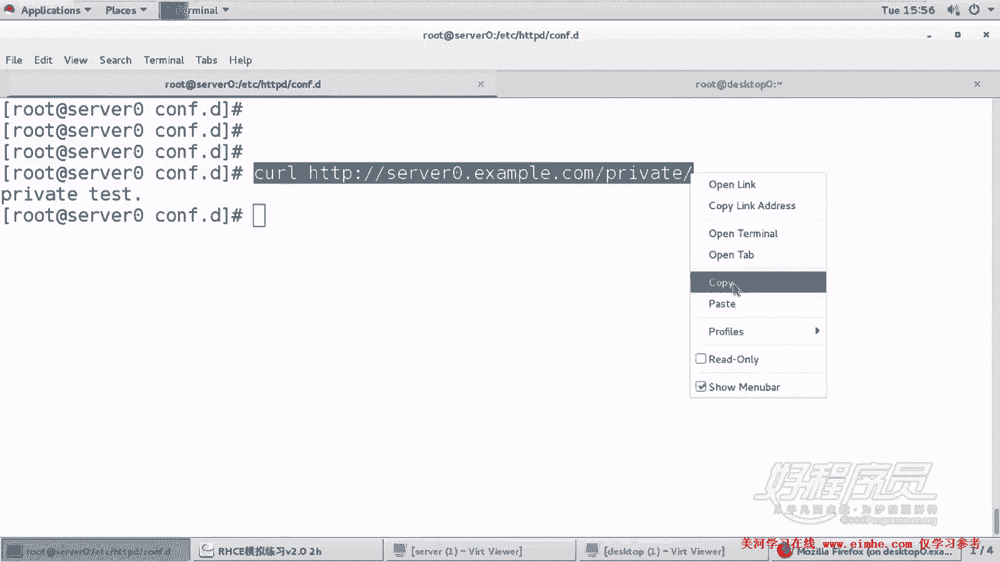
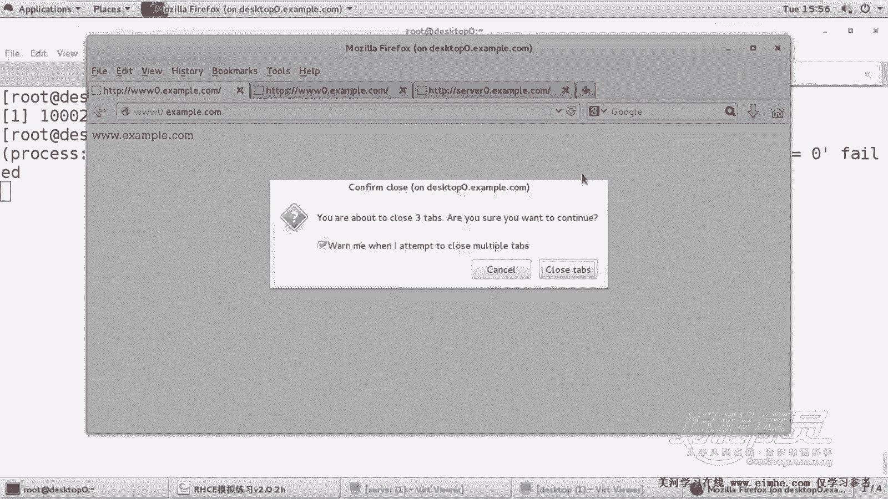
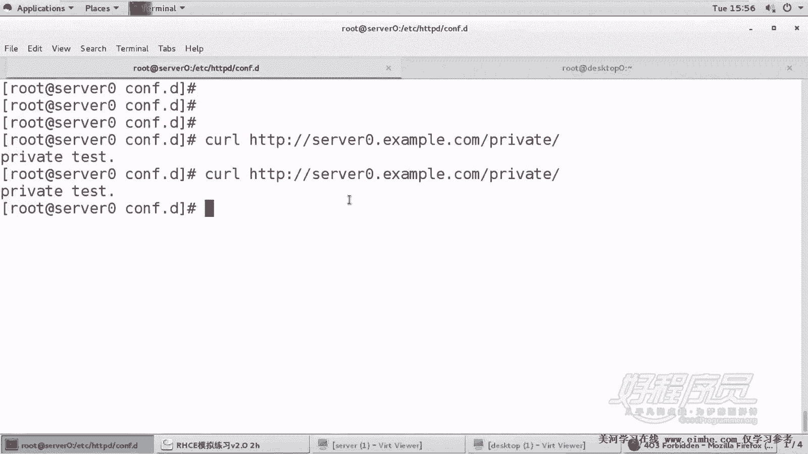

# 1. 杨哥rhce介绍及环境准备 - P19：19. Apache服务器 Http-server0-example-com-private - 自普男 - BV1st411d7rF

好，我们接着来看啊。那十八题呢是让配置s0的外部内容访问。呃，要求呢是在网站的主目录下面创建一个叫private的私有目录。这个网站的网页呢也给大家准备好了，在这个叫做priva点L这个页面。

然后下载下来以后将其命名为首页，不要改内容，但是这里有一个要求啊，从s零任何人都可以访问这里内容。但是从其他主机不能访问。也就是说，只允许从本机访问。只允需从本地访问OK那我们下面呢来做一下这个题。

在VR下的3W下的wat下面创建一个叫做PRIVATE的目录名字，对不对？看一下啊对。然后d get下载这个比较长的页面啊。港大欧。

VR下的3W下的watcher下的private名字呢叫做index mail首页文件。好了，这边路径没问题，我们来检查一下，或者干脆看一下啊。好了，这个内容呢是这样的p test这个内容。好。

那这怎么怎么做呢？我们只需要在刚才的这个s0。这里面呢来做一个加一个防控制就可以。在这里加一个防控制。加的位置是在。VR下的3W下的waer。这不要写错了，写错的话呢，最后排起来也比较麻烦。吓的。

prirate目录。好，允许谁来访问呢？这边没有什么拒绝，只允许本机访问就可以了。所以用关键字。Requiry。local这个关键字就可以。那么也就是说这一个目录呢，是只允许从本地访问。

任何地方都不能访问。保存。重新启动一下。服务器。好好很好啊，就是每一个都没有报错，有报错的话呢就会很惨啊。到时候呢如果真的报错，你起不来的话呢，那就只能把某一个虚主机给砍掉啊。你宁可断一只手。

也不能够让整个生命丢失。好，这怎么测呢？我们使用CURL也可以，然后访问。嗯，s0点EXAMPL点com下面的。Private。好，大家看到从本机是可以访问的，里面有内容。

那我们在这个其他机器访问测试一下。

浏览器当然也可以啊也可以。我们从浏览器里面访问一下。

嗯，是ITDP。s0s0肯定可以访问啊，下载PRIVATE好了，for啊那个出现一个报错啊，这是一个一个错误信息for啊。然后这边我们再来看一下之前的那些还能访问吗？刷新一下F5刷新没问题没问题。

没问题，你看s0点ex个amp就可以访问，但是就是那个子页访问不了，这个子页在哪儿可以访问呢？在它本地可以访问。好，这就是一个也是一个访问控制啊，也是一个访问控制啊，只限制这个目录只有从本地可以访问。

