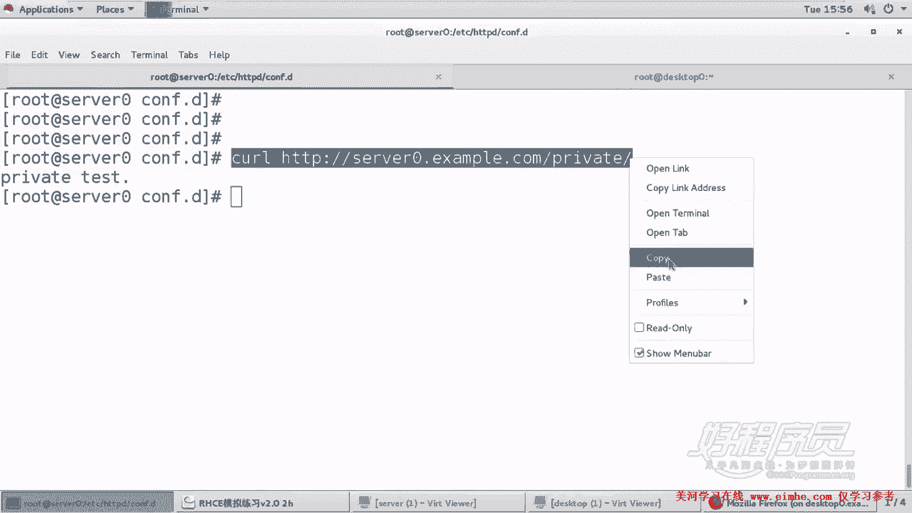
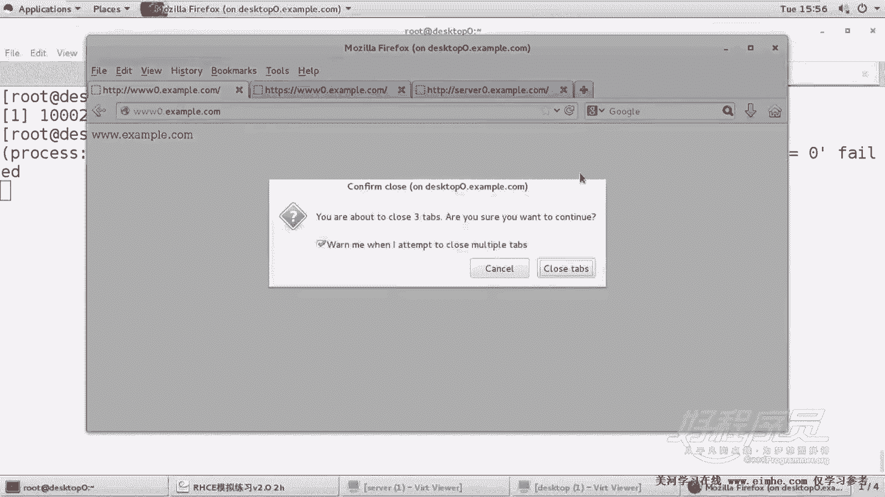
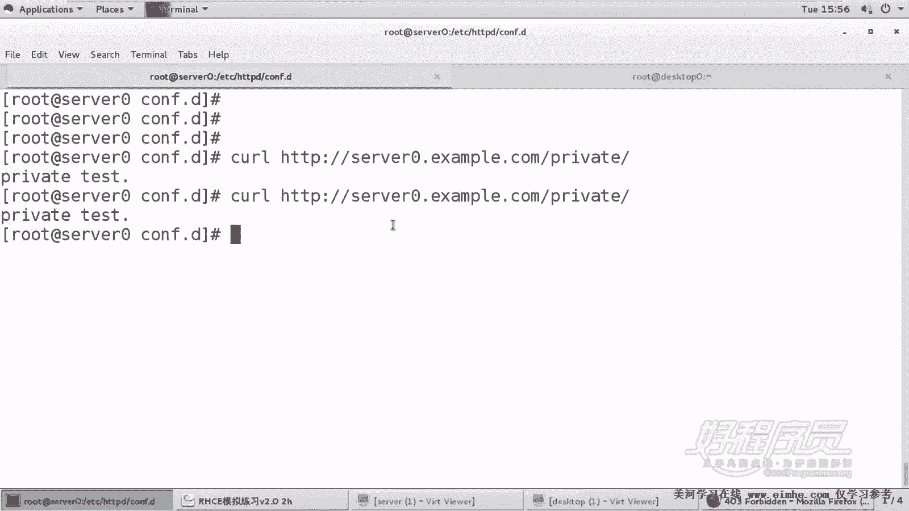

# RHCE课程：P19：Apache服务器 Http-server0-example-com-private 配置教程 🔧


在本节课中，我们将学习如何为Apache虚拟主机配置目录级别的访问控制，实现仅允许从服务器本地访问特定私有目录的功能。


上一节我们介绍了虚拟主机的基本配置，本节中我们来看看如何通过访问控制指令来精确管理特定目录的访问权限。

## 环境与任务概述

本次实验的目标是为`s0.example.com`网站配置一个私有目录。具体要求如下：
*   在网站主目录下创建名为`private`的目录。
*   将提供的网页内容设置为该目录的首页，且不修改其内容。
*   实现访问控制：仅允许从服务器本机（localhost）访问`/private/`目录，拒绝其他所有来源的访问。

## 配置步骤详解

以下是完成此任务的具体操作流程。

### 1. 创建私有目录与首页

首先，我们需要在网站主目录下创建指定的私有目录，并下载设置首页文件。

```bash
# 在网站主目录下创建名为 private 的目录
mkdir -p /var/www/vhosts/s0/private

# 下载提供的网页内容，并将其命名为 index.html（首页文件）
curl -o /var/www/vhosts/s0/private/index.html http://server.example.com/pub/private.html
```

操作完成后，可以使用 `cat` 命令检查文件内容是否正确写入：
```bash
cat /var/www/vhosts/s0/private/index.html
```
预期文件内容应包含类似 `p test` 的文本。

### 2. 配置访问控制规则

这是实现访问限制的核心步骤。我们需要编辑`s0.example.com`的虚拟主机配置文件，为`/private/`目录添加访问控制指令。

1.  打开`s0.example.com`的虚拟主机配置文件（通常位于`/etc/httpd/conf.d/`目录下，例如`s0.conf`）。
2.  在`<VirtualHost *:80>`段落内，为`/private/`目录添加一个`<Directory>`配置块。

以下是需要添加的关键配置指令：
```apache
<Directory "/var/www/vhosts/s0/private">
    Require local
</Directory>
```
**核心概念解析**：
*   **`<Directory “/path/to/directory”>`**：这是一个容器指令，用于将其中包含的配置指令应用到指定的文件系统目录及其子目录。
*   **`Require local`**：这是Apache 2.4版本中用于授权访问的指令。`local`是一个特殊的关键字，代表满足以下任一条件的请求来源：
    *   与服务器运行在同一台物理主机上（通过`localhost`或`127.0.0.1`访问）。
    *   通过Unix域套接字发起的请求。
    简而言之，`Require local` 意味着**只允许从服务器本机内部进行访问**。

### 3. 保存并重启服务

配置修改完成后，必须保存文件并重新启动Apache服务以使更改生效。

```bash
# 重新加载或重启Apache服务（根据系统管理习惯选择其一）
systemctl reload httpd    # 平滑重载配置，不影响已建立的连接
# 或
systemctl restart httpd   # 完全重启服务
```
重启后，务必检查服务状态，确保没有语法错误导致服务启动失败：
```bash
systemctl status httpd
```



### 4. 功能验证测试



配置完成后，需要进行测试以验证访问控制是否按预期工作。

**测试1：从服务器本机访问（应成功）**
在服务器终端上，使用`curl`命令模拟访问：
```bash
curl http://s0.example.com/private/
```
预期结果：能够正常返回`/private/index.html`页面的内容（即之前看到的“p test”等文本）。

**测试2：从其他远程主机访问（应被拒绝）**
从网络中的另一台计算机（非Apache服务器本身），尝试通过浏览器或`curl`访问 `http://s0.example.com/private/`。
预期结果：浏览器会显示 **“403 Forbidden”** （禁止访问）错误页面，`curl`命令会返回权限错误信息。

**测试3：验证其他目录不受影响**
访问网站的其他部分（例如 `http://s0.example.com/`），应确保这些原本公开的页面仍然可以正常访问，证明我们的访问控制只精确作用于`/private/`目录。

## 总结

本节课中我们一起学习了Apache Web服务器中一项重要的安全配置技巧——基于目录的访问控制。我们通过完成一个具体任务，掌握了以下关键技能：
1.  使用 `<Directory>` 指令对特定目录应用独立配置。
2.  使用 **`Require local`** 授权指令实现仅允许本地访问的限制。
3.  理解了访问控制列表（ACL）在Web服务器安全中的作用，即通过定义“谁可以访问什么”来保护敏感资源。



这种配置模式在实际应用中非常常见，例如用于保护服务器状态页面（如`/server-status`）、内部管理后台或API端点，确保它们不会暴露在公网上，从而有效提升网站的安全性。