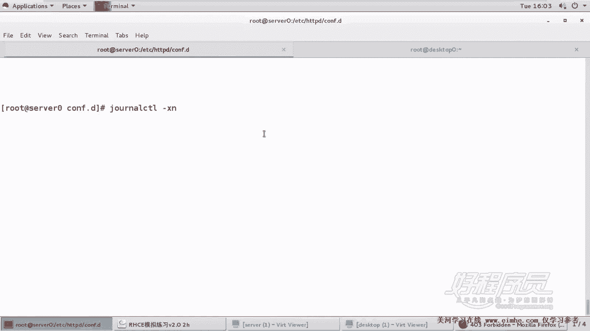

# 1. 杨哥rhce介绍及环境准备 - P20：20. Apache服务器 Http-webapp-example-com-8888 - 自普男 - BV1st411d7rF

OK这也是最后一个网站服务器的这个内容，嗯也是一个比较有挑战性内容啊。这个内容呢它要求我们做一个动态网站，搭建一个动态网站环境，并且呢能够去运行python的应用程序。WSGI这个程序。嗯。

这里呢倒没有明确说我们网站主目录是哪个，这都没有啊，所以呢我们自己可以定义okK它的网站的名字叫做webAPP0点exexcom。但是这里有一个问题，他跑的这个端口呢是4个8。

这个呢一会儿在Sinux这一关就过不去。好，我们首先呢来准备一些条件。第一，这个在之前我们其实已经装过一个模块，叫做modelWS。WSGI这个sorry，打错了啊。WSGI这个之前装过了。

所以不用装了啊。然后紧接着呢我们要准备一个网站主目录，我们就放在wevoAPP0这个位置吧。好，然后把我们的网网页。让log下来，它下来以后注意它不能够叫首页。我们直接。把它下下来以后。

杠到O放到这里面去。嗯，哦放到这里面去以后呢，还要起个名字，叫做就叫做weableAPP点WSGI它要起一个名字。好了，这边我们来看一下。在VR下3W下的wifiAPP下，您下面有一个这个文件。

这是它的内容啊啊，他这边用到了一个就是python程序，用到了一个时间的一个模块啊。然后这边是一个函数，最后呢它的作用是呢能够去显示我们当前的时间。OK那这边呢我们去。把这个环境搭建好了以后。

我们这些资资源准备好了啊，包括包括那个网站主目录，包括网页准备好了。好，下面呢我们来配置一个虚拟主机。那么还是按照这种方方法呢，我们来copy一个表如s0。450这个主机成为。

weleAPP0点example点com点com注意一定是点com文件啊，否则的话呢你就白做了。好，这边首先要注意的是，它监听的端口是不是80，也不是43。所以我们需要多加一个端口监听。

这个端口监听呢是一定要放在虚拟主机之外的，也就是放在全局的。listen哪个端口呢？4个84个8端口啊，listen4个8端口。好，嗯，紧接着呢我们看到我们这个虚拟主机接听端口就是4个8。

网站的名字呢叫做。vivoAPP0。网站主目录了，这边用到的不是domentroot，用到的是。啊，这边不用这个这这种方式啊。我们先把这下面做完啊，weAPP0。好，最下面这些呢去掉了，授权一下就可以。

好，这边用到了一个。叫做WSGI脚本别名。当然这边呢啊这边不需要说一定要大小写啊，叫交本别名。当你访问这个别名，也就是根的时候，当你访问问这个网站的根的时候，其实访问的是什么内容呢？访问的是。

这个内容好，我们。复制一下路径呢，最好是敲一下，然后再复制，就怕呢不小心写错了啊。好，这个是一个别名，根是一个别名。也就是说当你访问WSTI的脚本别名网站总目录的时候，那其实访问的是这个文件啊。

但然这个文件不是说非要放在我们现在看到这个位置啊，最后我们也对它进行了一个授权。好，然后呢我们下面呢。重新启动阿帕奇。大家看到报错了。好，如果这个错误你解决不了怎么办？

那就情愿把刚才那个网站的配置给它删掉，因为它会连累其他的网站。好，我们这边呢使用。胶了。controrl杠XN也就是这边这个XN啊。

好，回车。呃，我们看到。

哦，不是使用这个就就是它啊，这边最好把这个缩小一点。各于我们看到什么呢？看到这边有一个提示，他说什么呢？他说。你想要访问访问的这个网站，它绑定的绑定的端口这边看不清楚。有一个参数可以全屏全部显示。

我们看下忘掉了。杠L4。杠L负。啥也不好说。那不支持。好吧，那我们就放小一点看吧。

好，那他的意思是说，如果说你希望你你想要允许呢你的进程去绑定在网络接口8888上面。那么你需要修改端口的类型，那这就是Sin。它给你建议了一件事情。

就是你通过这条命令SEport杠A就是去管理它的端口添加一个类型，给4个8端口呢TCP的4个8端口加一个类型，什么类型呢？这边。port type类型哪个type呢？

他告诉你这个port type呢可以是following如下的这些里面的其中一种。

但你还可以把这个窗口放小一点，像这样放小一点，就看得更清楚一些啊。

呃，我记得有一个东西能够全屏的，我一下想不起来了。好，那我们把这条复制一下。

下面呢我们就使用其中任何一个，我比较习惯使用的是。ITTP port。我们给这个端口哦，IDBDport。看一下。哦，ITDPport杠Tsorry。这个这道题呢在考试的时候有几次是不考的。

但是我们不敢保证，因此呢大家还是要会做，也就是给4个8端口呢加上这样一个类型，ITDPport杠T的类型。当然我们也可以查一下它为什么比较慢呢？是因为它在修改Sin规则。嗯，相当慢。这个慢的有点过分啊。

好，可以了。然后你可以列取列列主那个列出来一下杠L列出来一下，它回收比较多，我们可以搜索，比如说ITTP。这样的关键字。好，我们看到以前的80呢，其实它也是HTPport杠T这个类型。

我们四加了4个8上来，当然还要在防火墙上面呢去。开放这个端口。4个8端口TCP。fireairwork杠com，杠杠reload。好了，这个时候我们再来。当然防火墙不是影响它启动的原因啊。

只要是把那个Slinux给它改完以后呢，就应该可以启动。现在我们来看终极结果，ki到全全部终端上来杠PLP。Sorry。过滤一下这个。我们是Egra吧，过滤一下。巴黎。嗯，43，还有呢。啊，实数线。

还有4个8。好，各位这些端口呢，我们看的都是正常的。好，那我们先从网站这边呢去访问一下访问一下啊。这个防不了正常。这个是viableviableAPP0点EXAMPL点com呃，端口是12344个8。

好，大家看到这边就是python那个程序的输出结果了，它是动态网站。好，我们可以点击它这边呢会发现时间之后会发生变化。好，这就是一个基本的一个。python的一个程序密行环境的一个搭建。

它这里呢比较特特别的是呢，它使用的是4个8端口，而且呢这个我们要去修改Sin，否则的话呢就会导致。啊，整个竞争起不来，它不能够绑定。因为他发现4个8端口的是不能够被Slink所使用的。

它没有1个ITDP就是能够使用的一个类型端口类型。

所以这块大家要注意一下。