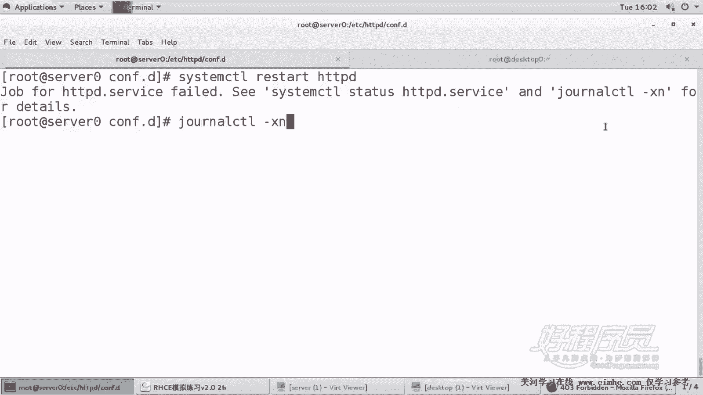
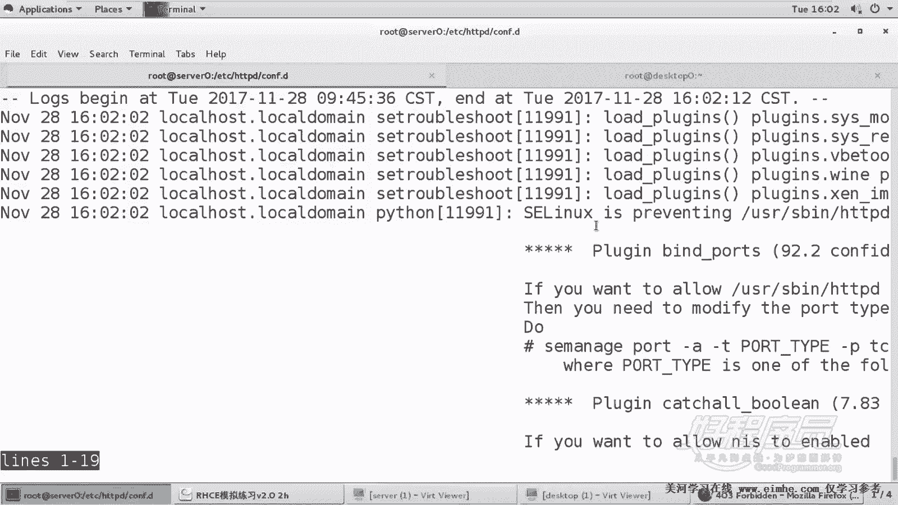
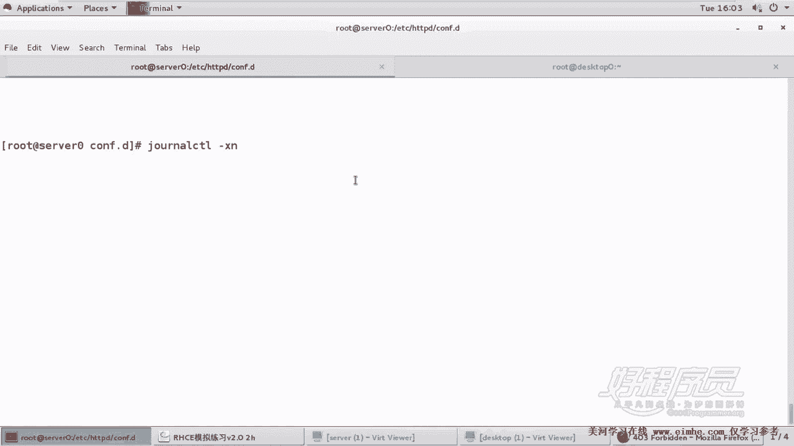
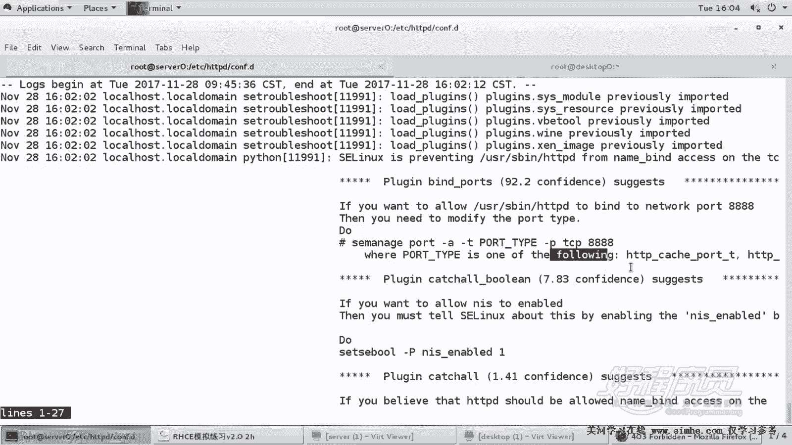
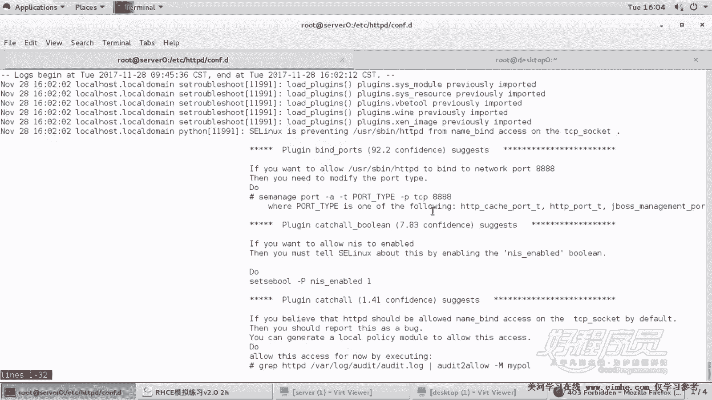
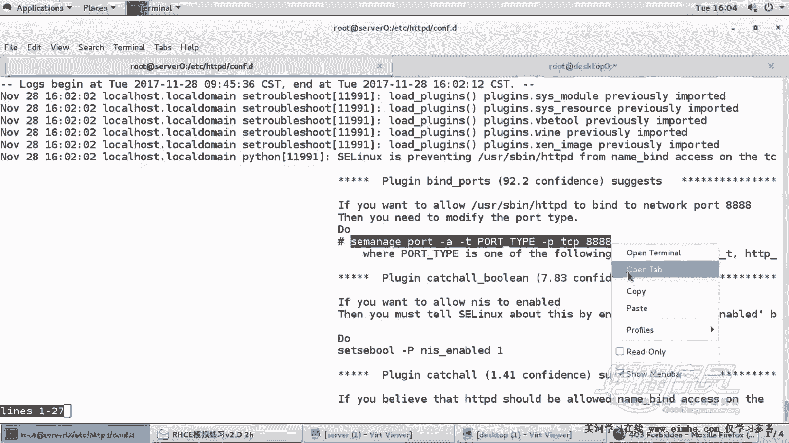
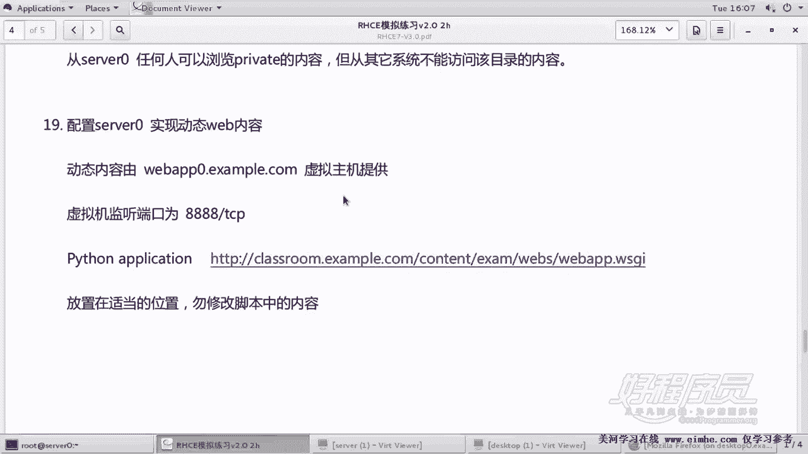

# RHCE课程：P20：Apache服务器配置 - 搭建Python WSGI动态网站

## 概述
在本节课中，我们将学习如何在Apache服务器上搭建一个运行Python应用程序的动态网站环境。我们将配置一个名为`webapp.example.com`的虚拟主机，使其在8888端口上运行一个基于WSGI规范的Python程序。课程将涵盖从环境准备、配置文件修改到SELinux策略调整的完整流程。

---

## 环境与资源准备
上一节我们介绍了Apache的基本配置，本节中我们来看看如何为Python应用准备环境。

首先，需要确保系统已安装`mod_wsgi`模块，该模块允许Apache运行Python WSGI应用程序。若未安装，可使用`yum install mod_wsgi`命令安装。

接下来，创建网站的主目录并准备网页文件。

以下是具体操作步骤：
1.  创建网站主目录：`mkdir /var/www/webapp`
2.  下载提供的网页文件到该目录。
3.  将下载的文件重命名为`webapp.wsgi`。此文件是一个Python脚本，其功能是显示当前服务器时间。

至此，运行Python应用所需的目录和脚本文件已准备完毕。

---

## 配置Apache虚拟主机
资源准备好后，接下来需要配置Apache，使其能够处理对`webapp.example.com:8888`的请求。

我们将复制一个现有的SSL虚拟主机配置文件作为模板，并修改其内容。

以下是配置虚拟主机的关键步骤：
1.  复制配置文件：`cp /etc/httpd/conf.d/ssl.conf /etc/httpd/conf.d/webapp.example.com.conf`
2.  编辑新配置文件`webapp.example.com.conf`。
3.  由于网站使用8888端口，需在全局配置区域（即`<VirtualHost>`标签之外）添加监听指令：`Listen 8888`。
4.  修改`<VirtualHost>`标签，将其端口改为`*:8888`。
5.  将服务器名称`ServerName`改为`webapp.example.com:8888`。
6.  配置WSGI脚本别名，将网站根路径`/`映射到我们准备的`webapp.wsgi`文件。使用指令：`WSGIScriptAlias / /var/www/webapp/webapp.wsgi`。
7.  为`/var/www/webapp`目录设置适当的访问权限。

完成配置后，尝试重启Apache服务：`systemctl restart httpd`。

---

## 解决SELinux端口限制
重启Apache时可能会失败，并提示进程无法绑定到8888端口。这是因为SELinux默认不允许HTTP服务使用8888端口。

我们需要修改SELinux策略，为8888端口添加正确的类型标签。

以下是解决此问题的步骤：
1.  使用`semanage`命令为TCP协议的8888端口添加`http_port_t`类型：`semanage port -a -t http_port_t -p tcp 8888`
2.  此命令会修改SELinux的策略规则，允许Apache绑定该端口。
3.  同时，确保防火墙也放行了8888端口：`firewall-cmd --permanent --add-port=8888/tcp && firewall-cmd --reload`

策略修改完成后，再次重启Apache服务，此时应能成功启动。

---

## 验证与测试
配置和策略调整完成后，最后一步是验证网站是否正常运行。

我们可以通过以下方式进行测试：
1.  检查Apache是否正在监听8888端口：`ss -tlpn | grep :8888`
2.  在浏览器中访问`http://webapp.example.com:8888`。
3.  如果配置正确，页面将显示由Python程序动态生成的当前时间。刷新页面，显示的时间会随之更新。

这证明我们已成功搭建了一个能够运行Python WSGI应用程序的动态网站环境。

---

## 总结
本节课中我们一起学习了在Apache上部署Python动态网站的完整过程。关键点包括：准备`mod_wsgi`模块和WSGI脚本文件、配置监听非标准端口的虚拟主机、以及解决SELinux对非标准HTTP端口的限制。掌握这些步骤，你就能为各种Python Web应用配置运行环境了。