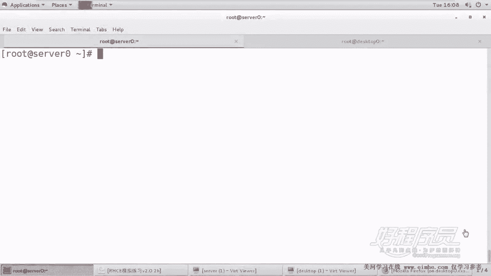
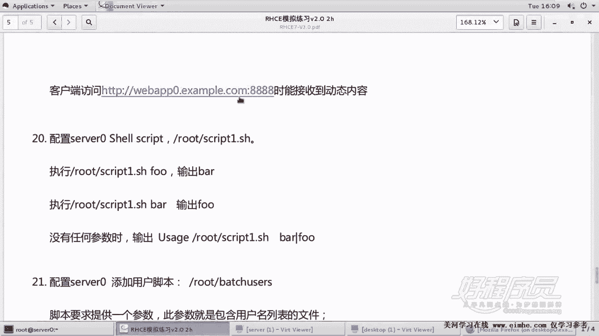
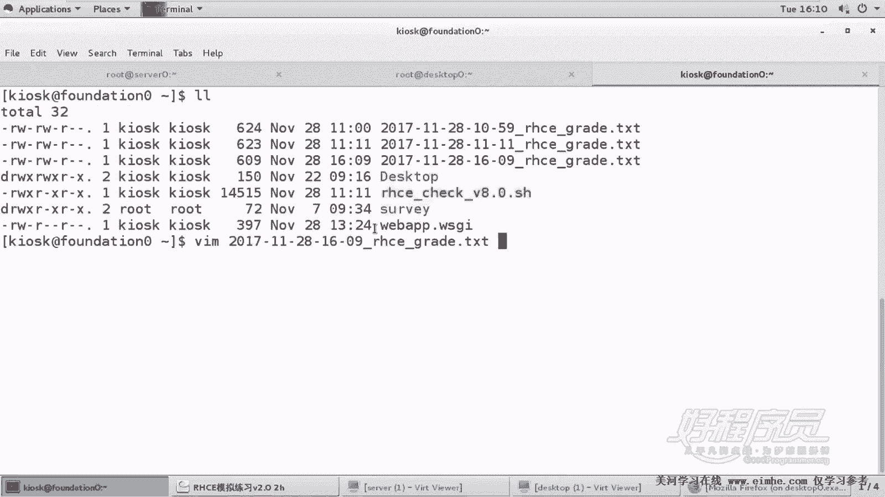
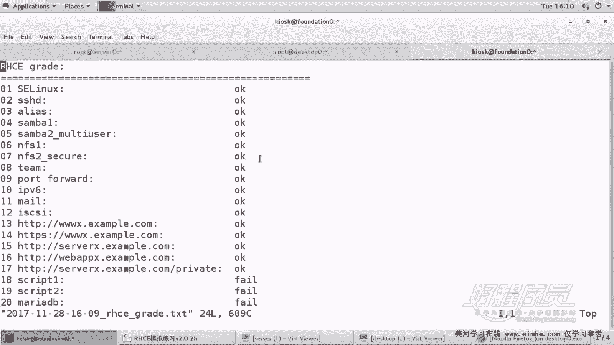
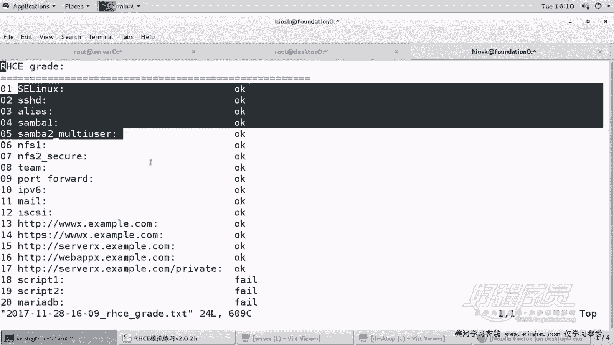
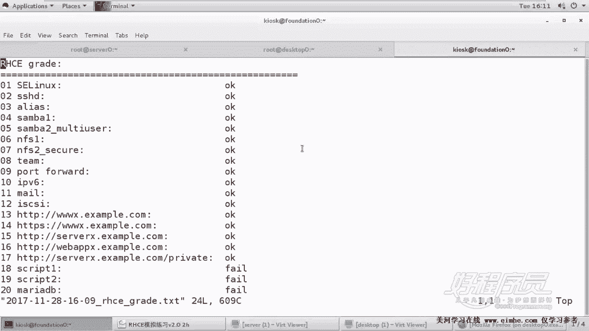

# 1. 杨哥rhce介绍及环境准备 - P21：21. 杨哥脚本阶段测试 - 自普男 - BV1st411d7rF

好，那我们下面呢来做一个结论测试。因为我们已经把网站做完了啊，网站这道题呢已经做完了。嗯，最后一句话呢，其实刚才没看到，就是他告诉我们说我们客户端可以访问这个网站能够接受到动态内容。这个我们也做了啊。

好，我们来看看这个脚本的问题。

如果脚本有问题的话，我们一起来改动一下。运行一下RHCE。这个脚本文件。但是我们这边两台主机都没有启重启，如果重启的话呢，呃也可能还会有一些问题。所以呢我们先来检查一个没有重启以前一个结果。好。

这边我们检查完了，大家来看一下。看最近这个文件，201711月28号的。16点。

好，大家看到现在一切比较顺利。之前那个别名呢也被我改到改了啊，这个改改了这个脚本也没问题。好，下面我们剩下三道题。

啊，其实也不能说算是这里并不是说那个一共是17道题啊，因为有些题我们是拆开的。

或者说是合到一起的啊。因此这里我们看到现在目前呢都是正确的。如果按照这个情况的话呢，你考试就应该绝对的过了。因为我们整个考分才有200满得两满分是300分，但得分是210分。好，这算是非常的不错的啊。

结果。大家在这个整个做的时候呢，也同样可以去像我这样去测试一下啊。

