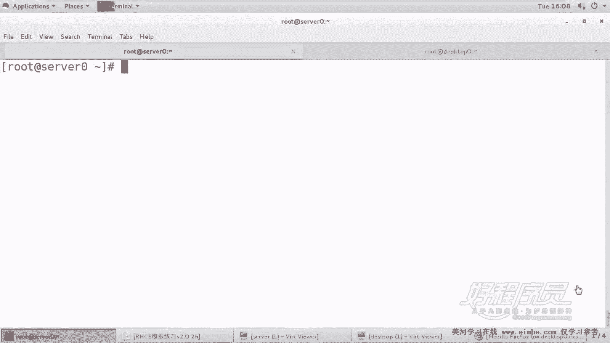
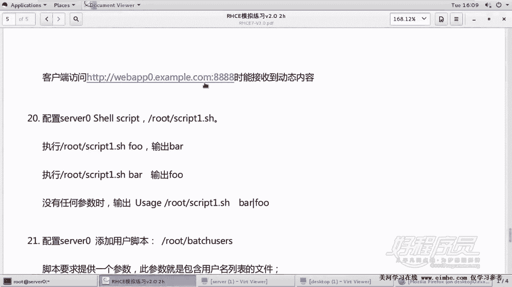
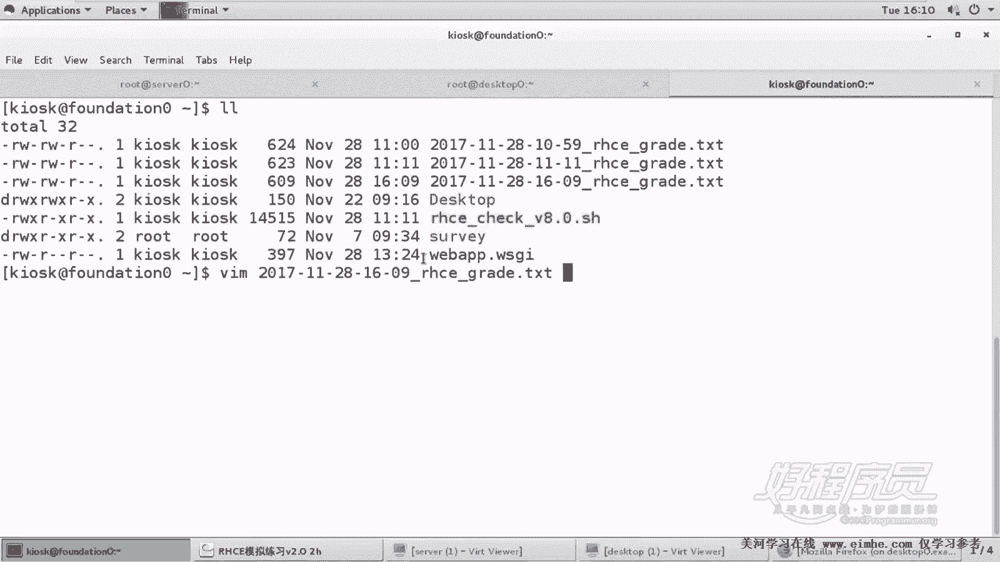
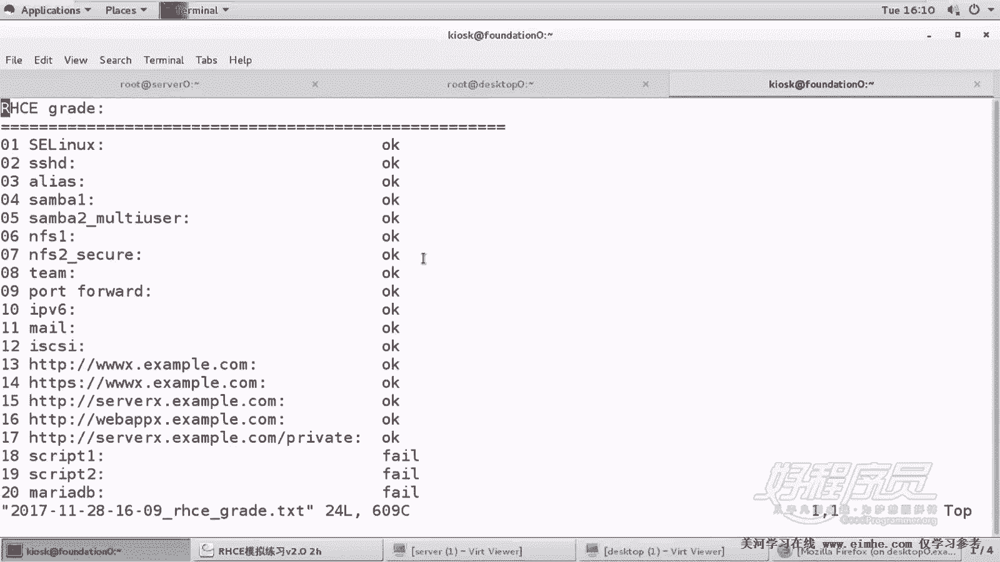
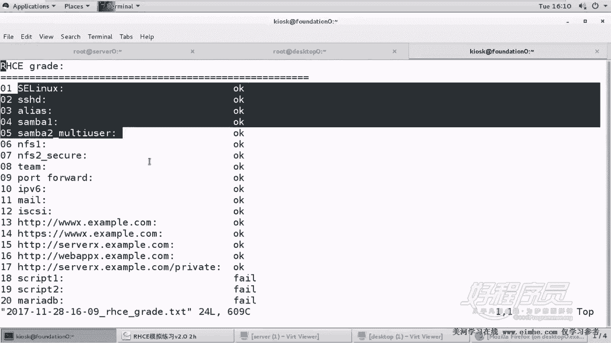
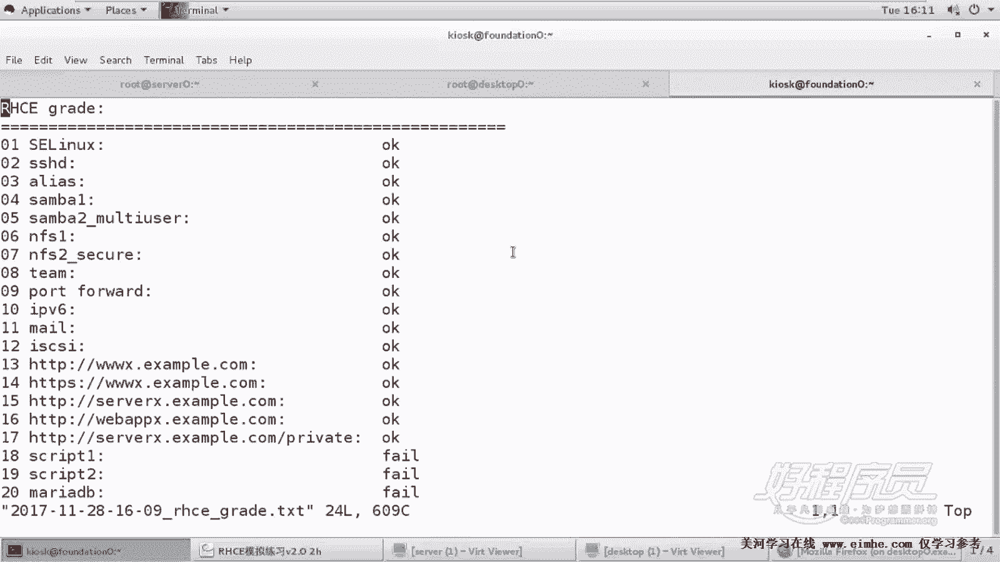

RHCE课程：P21：脚本阶段测试

在本节课中，我们将对之前完成的脚本进行测试，以验证其功能是否符合考试要求。我们将运行测试脚本，检查当前系统的配置状态，并确认所有任务是否已正确完成。

---

上一节我们完成了网站服务的配置，本节中我们来看看脚本测试环节。

首先，运行RHCE考试提供的测试脚本文件，以评估当前系统的配置情况。由于系统尚未重启，此测试反映的是当前运行状态下的结果。

以下是运行测试脚本后的关键检查点：

*   检查最近生成的日志文件，确认其时间戳为`2017年11月28日 16点`。
*   验证之前配置的别名（Alias）已按脚本要求成功修改。
*   确认脚本运行过程顺利，未报错。

目前测试结果显示所有配置均正确。RHCE考试总分300分，及格线为210分。根据当前的测试结果，已具备通过考试的条件。

建议在学习和练习过程中，可以参照此方法定期运行测试脚本，以便及时发现问题并进行修正。

---

本节课中我们一起学习了如何使用官方测试脚本验证RHCE实验环境的配置结果。通过测试，我们确认了之前完成的网站服务及脚本修改任务均符合考试要求，为顺利通过考试打下了坚实基础。