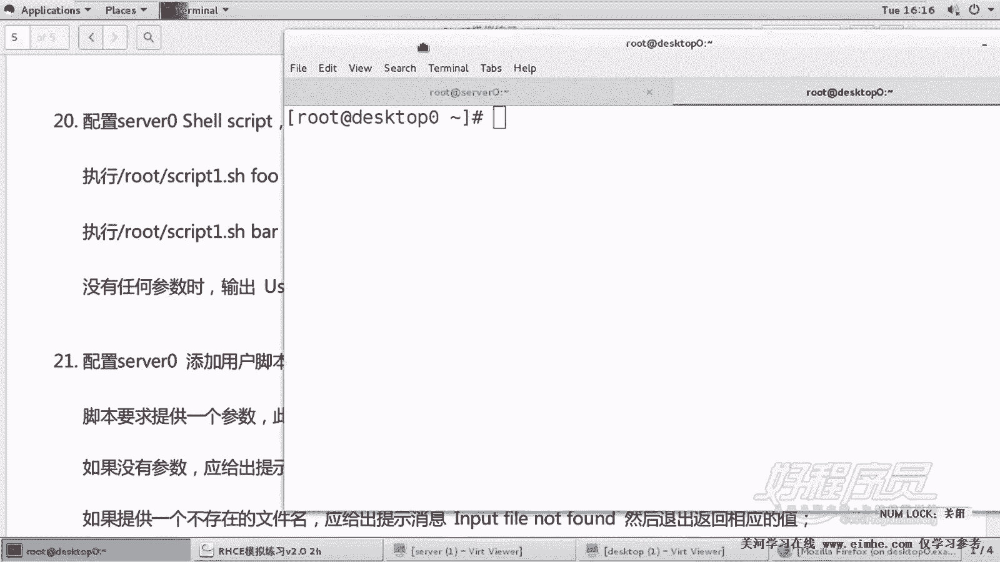
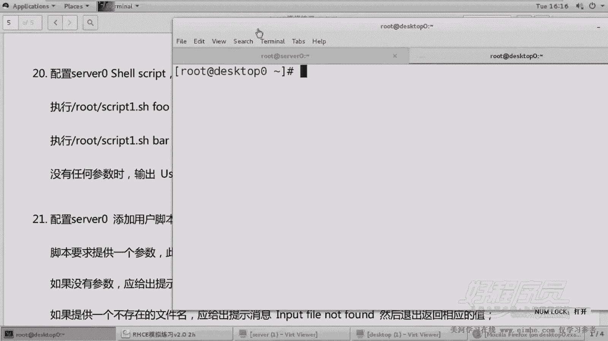

# 1. 杨哥rhce介绍及环境准备 - P22：22. Shell 脚本1解析 - 自普男 - BV1st411d7rF

好，各位我们再接再厉的来把最后几道题呢再做一下。最后还有这个三道题啊，这三道题呢都比较简单。

而且呢可能有可能在考的时候，脚本还不会考两道。鉴于其中有两个脚本。一个脚本呢是。让我们配一个配置一个这样一个脚本，放在root下面叫做sip1点SH。他告诉我们，在执行这个脚本的时候。

后面如果加一个FOO参数。那么将输出BAR。相应的，如果在执行脚本的时候加1个BR参数呢，将输出FO如果没有加任何参数。那我们将说出这样一段话，整个输出这样一段话啊。好，所以呢。

所以这边呢我们这怎么写呢？可以使有同学说我们使到底是使if呢，还是使用case呢？其实大家在前面学过我脚本呢，学过我们脚本的视频发现这东西太简单了，但是简单归简单，你的每一个输出。

包括一个空格都应该是和它一样的。另外还有这个名字也必须是一样的啊。

好，那下面呢我们来创建一下这个脚本。呃，是在哪个机箱撞建的？各位。420啊。井号叹号。USR下的B下的bash。我这边移动一下。

这边看题，这边来写脚本。我们使用case语句啊，kis呢，然后它后面呢是。未通过位置参数，所以我们使用dollar一这个位置变量位置参数E。先把这个结果写上ESAC。然后如果说用户输的是什么。

如果输的是FO的话呢。就匹配的是FO的话，那我们叫ele说BAR啊，当然双引号是不会输出的啊。F那个分号分号。如果输的是BAR的话呢，然后我们这边呢是。FO。同样分号分号。如果是其他的话呢。

那么应该是输出。

好，这个内容呢不用乱写，一定是他给我们的完整的这一个。

出错信息。好，这脚本我相信非常简单。然后写完以后呢，大家看。写完以后我们。检查一下这个脚本。语法上呢基本上没有错。好，怎么执行呢？有同学可能会有一有一个问题啊，如果脚本起到这儿，你像这样执行。

后面加上FO。大家看到输出BAR输入BAR了FO输入其他的或者不输了。输出这段话，可能你以为你这道题是满分，但是错了。各位人家要求执行的时候是怎么执行，要求执行的时候是这样执行，也就是敲路径的方式。

这样执行。

大家发现你的脚脚本是没有权限，所以一定要加一个权限，这是一个习惯的问题啊。好，所以我们再来试一下它没问题。BR没问题，不输没问题。好，这就是这个脚本的一个问题。我们再次打个列角度看一下ro下个。

SCIPT脚本。你不限于使用ki还是使用if这些都可以。然后当然最后一个了，这个最后一个后面是可以不加两个分号的啊，前面要加，而且也可以把它写成一行。没关系。而且这个双引号把这个变量引起来的话呢。

这是一个比较严谨的做法。啊，因为对于这种字符串变量，我们最好使用双引号引起来，否则的话有可能会出错。嗯，因此呢你要引起来。什么情况会出错呢？我们看有没有可能出错啊，试一下。啊，这倒没有。

只有在一些特定的位置呢，脚本里面会出错。包括我们在做条做这个方工号的这种判断的时候，条件测试的时候，对这种字符串变量请使用不双引号。好，一定要记住，给脚本，很多人就是没有给脚本加执行权限。

导致结果呢整个零分，至少在这一点上零分。

