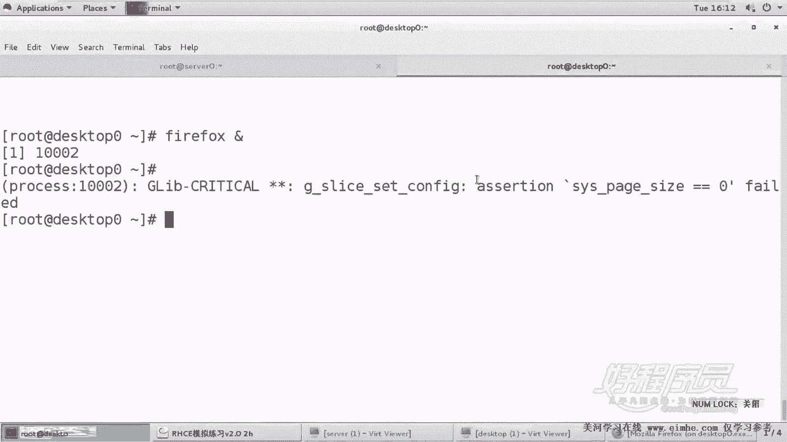
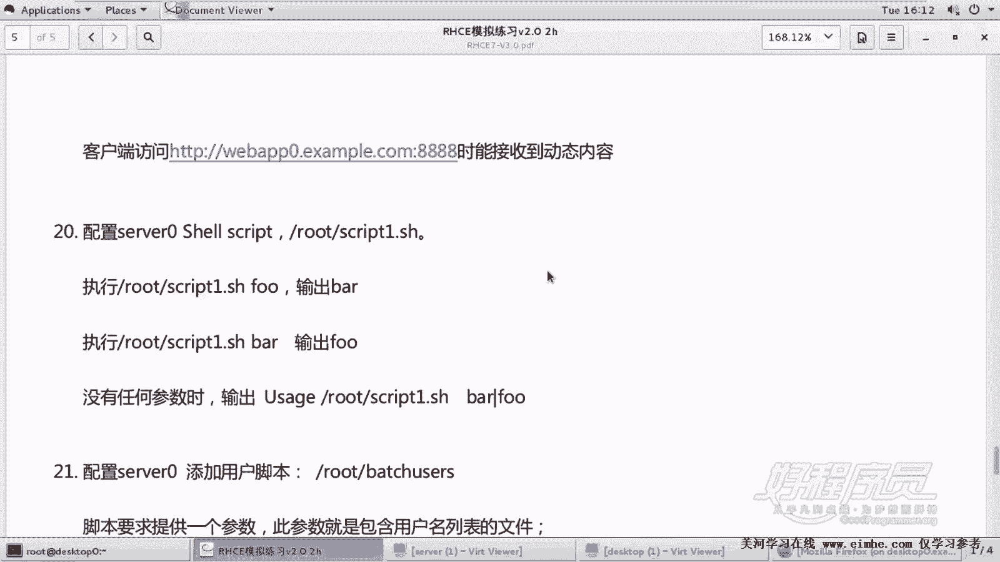
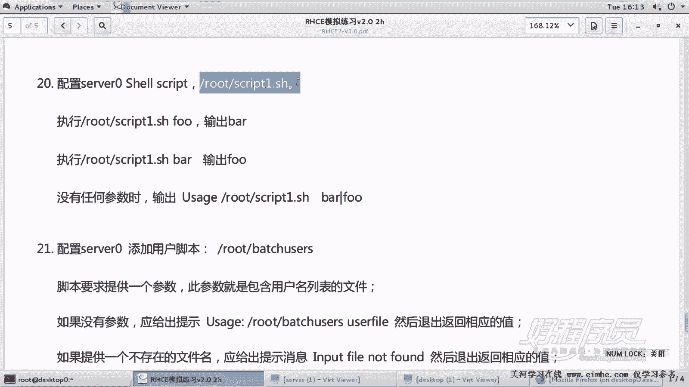
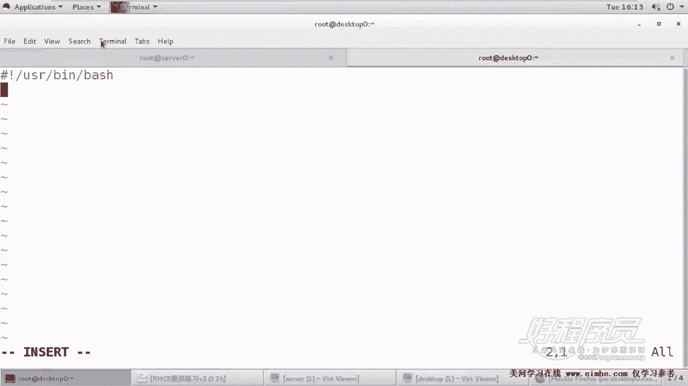
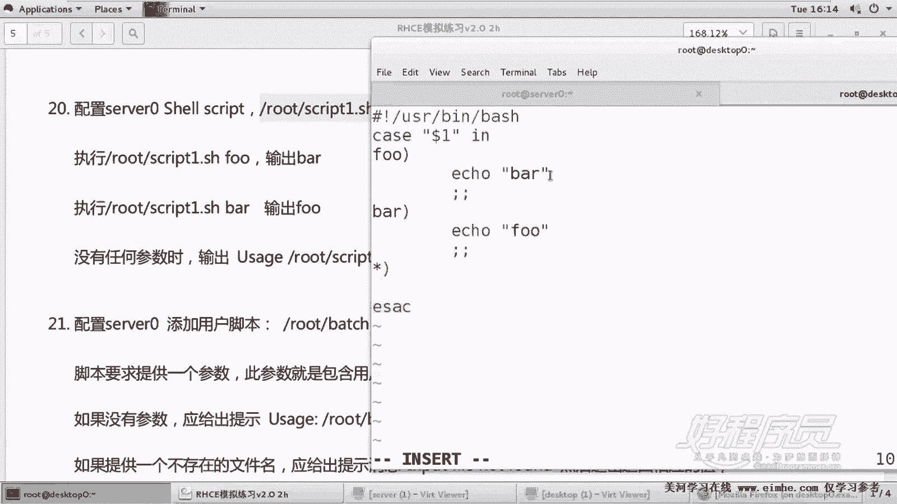
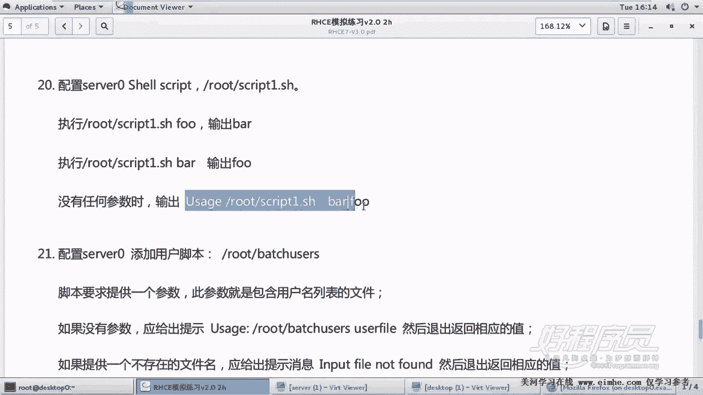
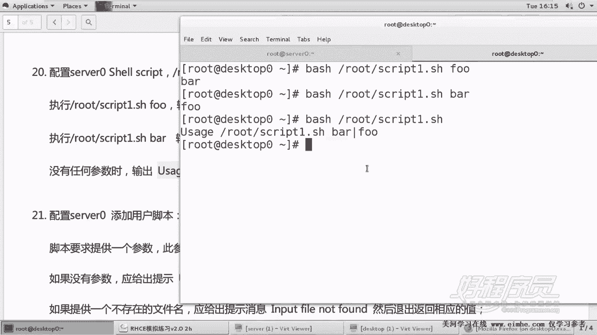
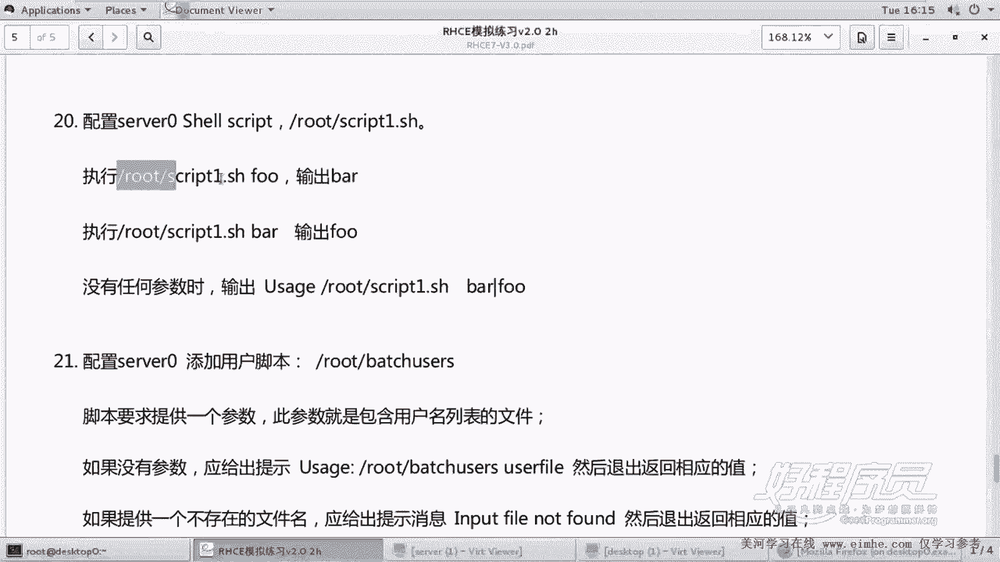
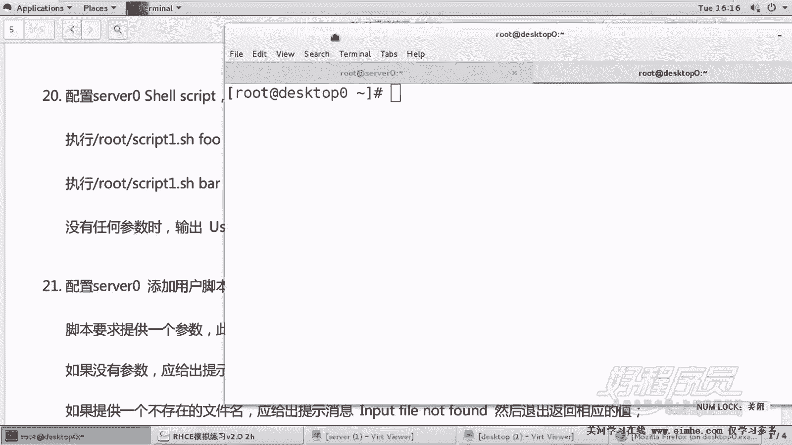
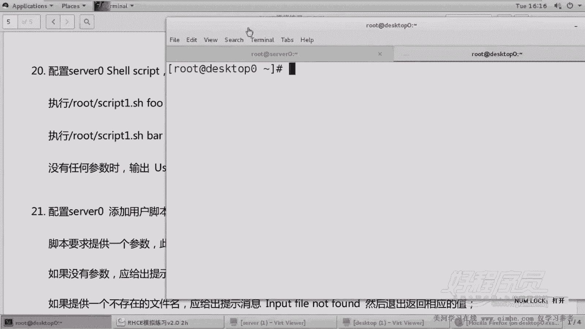

Linux Shell 脚本编程：P22：Shell 脚本1解析


在本节课中，我们将学习如何解析并编写一个简单的Shell脚本。这个脚本将根据用户输入的参数输出不同的内容，并涵盖脚本创建、权限设置和条件判断等核心概念。



---



### 脚本要求概述

题目要求创建一个名为 `script1.sh` 的脚本，放置在 `/root` 目录下。脚本需要根据执行时传入的参数进行不同的输出：
*   如果执行脚本时加上参数 `foo`，则输出 `bar`。
*   如果执行脚本时加上参数 `bar`，则输出 `foo`。
*   如果执行脚本时不加任何参数，则输出一段指定的提示信息。

脚本的输出内容，包括空格，都必须与题目要求完全一致。

---

### 创建脚本文件

首先，我们需要在指定的目录下创建脚本文件。



以下是创建脚本的步骤：
1.  切换到 `/root` 目录。
2.  使用文本编辑器（如 `vim`）创建并编辑 `script1.sh` 文件。



脚本的第一行需要指定解释器，我们使用 `bash`：
```bash
#!/usr/bin/bash
```

---

### 编写脚本逻辑

上一节我们创建了脚本文件，本节中我们来看看如何实现其核心逻辑。我们将使用 `case` 语句来根据不同的参数执行不同的操作。



以下是使用 `case` 语句的脚本内容：
```bash
#!/usr/bin/bash

case "$1" in
    foo)
        echo "bar"
        ;;
    bar)
        echo "foo"
        ;;
    *)
        echo "Usage: $0 {foo|bar}"
        ;;
esac
```



**代码解析**：
*   `"$1"`：代表执行脚本时传入的第一个参数。使用双引号包裹变量是严谨的做法，可以避免某些情况下因空格或特殊字符导致的错误。
*   `foo)` 和 `bar)`：匹配用户输入的参数。
*   `*)`：匹配所有其他情况（即未输入参数或输入了 `foo`/`bar` 以外的参数）。
*   `echo`：用于输出指定的字符串。
*   每个匹配分支以两个分号 `;;` 结束。

---

### 设置脚本权限并测试

脚本编写完成后，并不能直接通过路径执行，因为新建的文件默认没有执行权限。



以下是测试脚本的步骤：
1.  使用 `chmod` 命令为脚本添加执行权限：
    ```bash
    chmod +x /root/script1.sh
    ```
2.  通过指定脚本的绝对路径来执行它，并传入不同的参数进行测试：
    ```bash
    /root/script1.sh foo    # 应输出：bar
    /root/script1.sh bar    # 应输出：foo
    /root/script1.sh        # 应输出：Usage: /root/script1.sh {foo|bar}
    ```



**重要提示**：在考试或实际应用中，忘记给脚本添加执行权限是一个常见的错误，会导致脚本无法执行，从而影响得分或功能。

---

### 其他实现方式与注意事项

除了 `case` 语句，我们也可以使用 `if` 条件判断来实现相同的功能。

以下是使用 `if` 语句的等效写法：
```bash
#!/usr/bin/bash

if [ "$1" = "foo" ]; then
    echo "bar"
elif [ "$1" = "bar" ]; then
    echo "foo"
else
    echo "Usage: $0 {foo|bar}"
fi
```

**核心注意事项总结**：
1.  **输出一致性**：脚本的输出必须与题目要求**一字不差**，包括大小写和空格。
2.  **变量引用**：在条件测试 `[ ]` 中引用字符串变量时，务必使用双引号，例如 `"$1"`，以防止语法错误。
3.  **脚本权限**：通过路径执行脚本前，必须使用 `chmod +x` 命令赋予其执行权限。
4.  **脚本名称**：确保脚本的文件名和存放位置完全符合题目要求。



---



本节课中我们一起学习了如何根据需求编写一个基础的Shell脚本。我们掌握了使用 `case` 或 `if` 进行条件分支判断的方法，理解了位置参数 `$1` 的用法，并强调了设置执行权限和保证输出准确性的重要性。这些是Shell脚本编程中最基础且关键的技能。