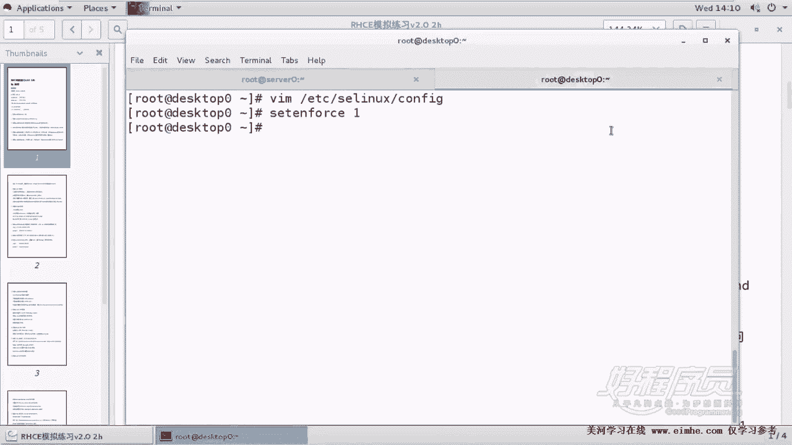
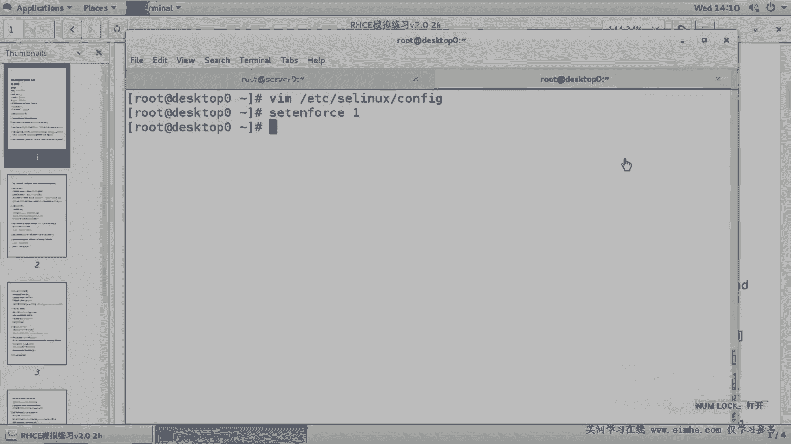

# 1. 杨哥rhce介绍及环境准备 - P2：2. Selinux 配置与注意事项 - 自普男 - BV1st411d7rF

好，那我们已经把这个环境准备好了以后呢，ym这边再次提醒各位，一定要手动配置。因为如果不配置的话呢，后面没法装软件包。那所以这道题其实我在脚本里面是不检查的啊。好。嗯。

紧接着呢我们是要保证s0和desktop0上的SElinux的环境为inforcing。这个同样要做。因为在考试的时候，它是一定。不不让你去关Slin的那有同学说，那如果我关掉会怎么样呢？

你如果你关掉的话呢，会扣你分啊，所以大家不要去关这个扣多少分，不太清楚，反正是在红帽这边呢考试CE考试是一定要求你开的。当然我们在生产环境当中，Slin呢，这个作为一个更高级别的一个文件访问控制机制啊。

这个其实我们一般都是关掉的。关掉的原因。因为它对我们整个系统的负载负担会加重一些。另外呢可能由于它的一些规则的复杂性，很多人不太习惯，因此会选择关掉。因为可以从其他方面来进行一个控制。

这里呢就要提醒各位，两个机器都要做打开EDC下的SElinux下的config。好，在这里面我们看到。其实已经是inforcing。那只是告诉你，不准关，如果现在不是enforcing。

是promissive，也就是这种警告模式 warningning或者是diable，那我们一定要改为inforcing就可以了。好，这是这边。那除除此以外呢，还有另外一台机器也要做。

如果说你忘了做的话呢，很显然这就扣分的啊。所以大家要注意哪些题需要在两台服务器上面都做，或者说做什么，你一定要很清楚，你一定要清楚这是s0，这是什么that'stop0。当然真正考试的时候呢。

其实不是serv0和dessktop0，是system一和system2。你记只要记住system一是服务器system2是客户端，这就可以了。脑子里面随时要绷紧这根弦啊，这是关于Slin。

那Slin的配置呢，我相信各位可能没有问题。只要当前这个状态，或者我们可以通过一个叫get enforcing看到当前状态，如果当前不是这个状态是promissive我怎么办呢？

那et enforcing一就可以。当然各位要知道的就是Slinux啊，它是不能够从diable变成enforcing或promissive的。

我们这个一呢是inforcing0呢是promissive。也就是说只有在在那个inforcing和promissive时也可以切换。如果你想再切换到diable的话呢，除非你关机重启。

因为它整个要想关闭，那是需整个要想这个重置的话呢，是需要重启才可以。好，这边也是一样。如果不对的话呢，你觉得就把它改成一就行。好，这是关于Sim的一个东西。大家一定要记住。

我们考试的时候是一定要什么开启的。

