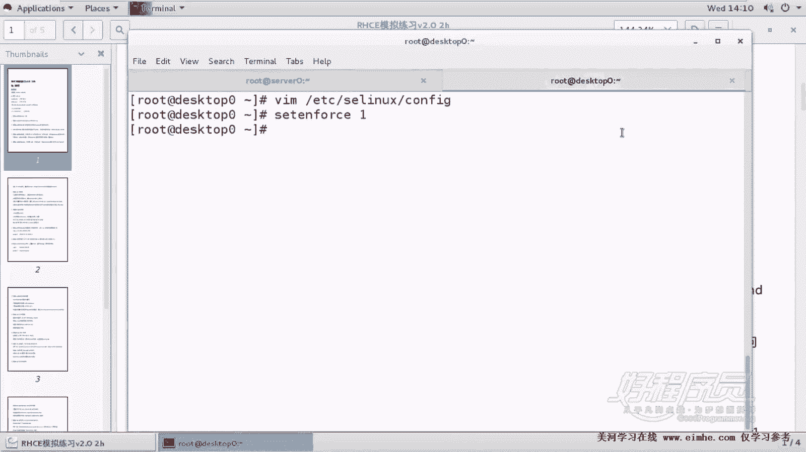
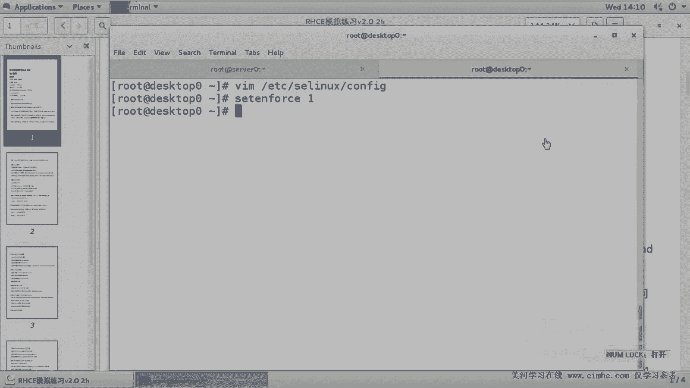

# RHCE课程：1.2：SELinux配置与注意事项 🔐

在本节课中，我们将学习SELinux的基础配置，这是RHCE考试中的一个重要考点。我们将了解如何确保SELinux处于正确的运行模式，并理解相关的注意事项。

上一节我们介绍了环境准备，本节中我们来看看SELinux的配置要求。

## 配置SELinux为强制模式

考试要求必须将`server0`和`desktop0`（实际考试中为`system1`和`system2`）上的SELinux设置为`enforcing`（强制）模式。在生产环境中，由于性能和管理复杂性考虑，管理员有时会关闭SELinux，但在RHCE考试中，保持其开启是强制要求，否则会被扣分。

以下是检查与设置SELinux状态的步骤：

1.  **检查当前状态**：可以通过命令 `getenforce` 查看当前SELinux的运行模式。
2.  **修改配置文件**：主要的配置文件是 `/etc/selinux/config`。需要确保其中的 `SELINUX=` 参数被设置为 `enforcing`。
3.  **临时切换模式**：如果当前是`permissive`（宽容）模式，可以使用命令 `setenforce 1` 临时切换到`enforcing`模式。命令 `setenforce 0` 则切换回`permissive`模式。
4.  **重要限制**：SELinux无法直接从 `disabled`（禁用）状态切换到 `enforcing` 或 `permissive` 状态。如果处于`disabled`状态，必须修改配置文件后重启系统才能生效。

**核心概念与操作**：
*   **运行模式**：
    *   `enforcing`：强制模式，阻止违反策略的操作。
    *   `permissive`：宽容模式，仅记录违反策略的操作而不阻止。
    *   `disabled`：禁用模式。
*   **状态查询**：`getenforce`
*   **临时设置**：`setenforce [0|1]` （0对应permissive，1对应enforcing）

## 考试环境区分

在实际考试中，主机名并非`server0`和`desktop0`，而是`system1`（服务器）和`system2`（客户端）。进行任何配置时，必须清楚当前操作的是哪台机器，并确保两台主机都满足考试要求。

本节课中我们一起学习了SELinux的配置。关键点是：在RHCE考试中，必须将SELinux设置为 **`enforcing`** 模式，且需在**所有考试机器**上进行检查和配置。记住使用 `getenforce` 检查状态，并通过修改 `/etc/selinux/config` 文件或使用 `setenforce 1` 命令来确保配置正确。