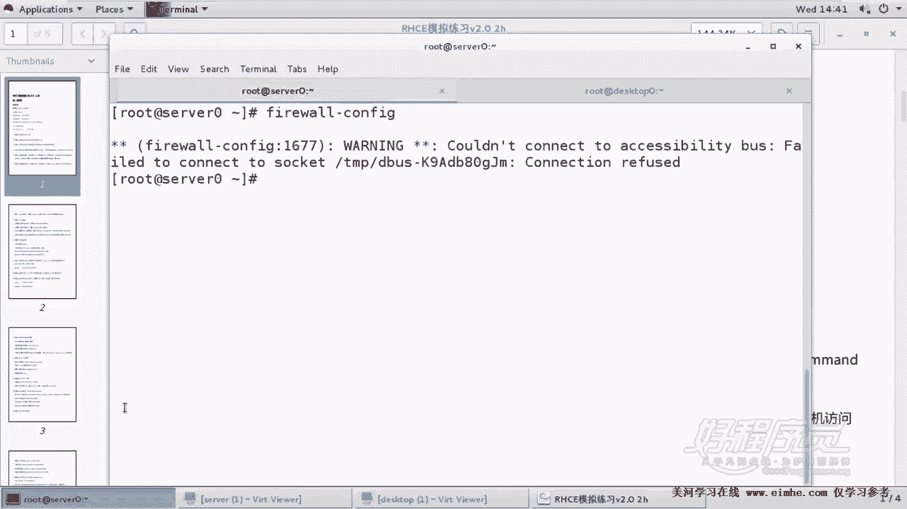
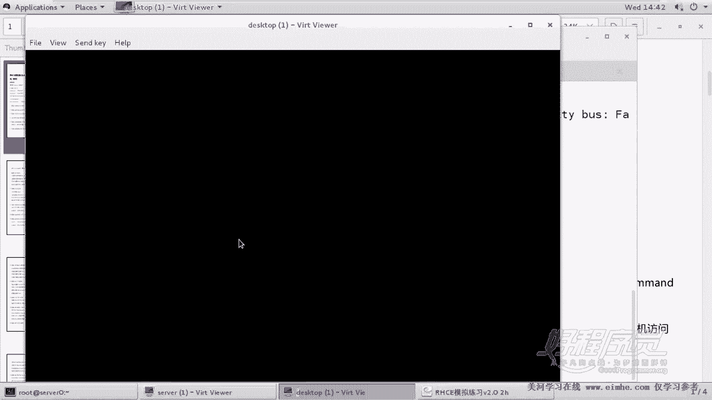
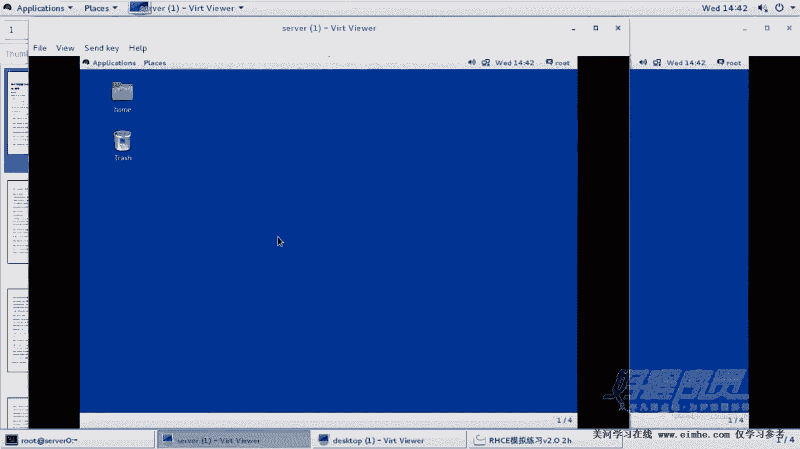
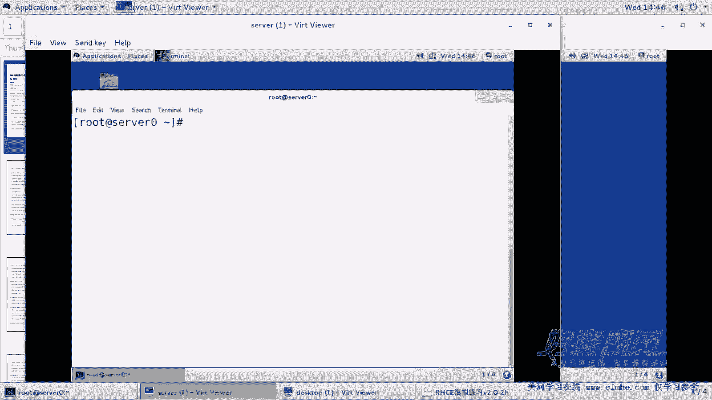
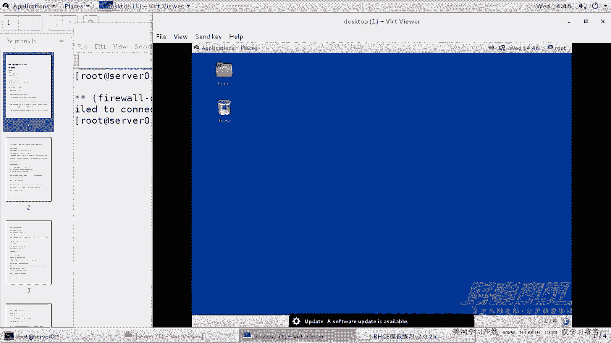
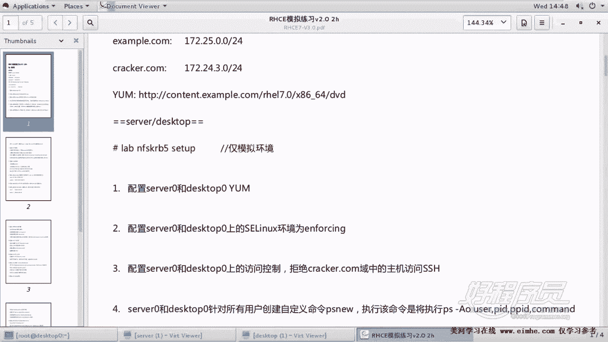
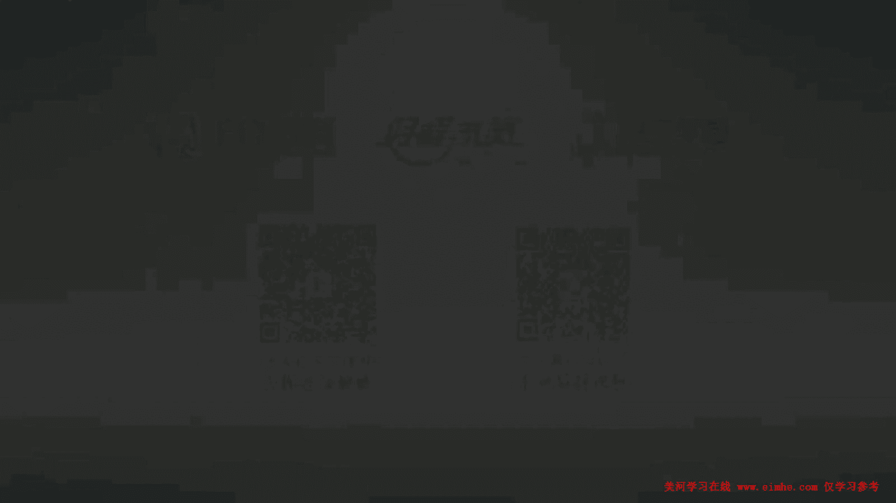

# 1. 杨哥rhce介绍及环境准备 - P3：3. Ssh通过firewalld实现访问控制 - 自普男 - BV1st411d7rF

好，接着我们看下一题。嗯，那么这个第三题呢嗯它要求的是在severever和desktop，也就是两台服务器上面都配置防控制。拒绝的是corrb点com域中的所有主机访问SSH。好，这里两个点。

大家注意，一是两台服务器，一个serv，一个ttop也就都要做。如果说你只做一个的话呢，肯定就没有相应的这个分数啊。嗯，然后另外一呢是这个拒绝crb点com中的主机访问SSH这里呢要特别小心。

如果说你不小心拒绝错了，会导致一个非常严重的后果，就是可能最后没有办法考官收你的成绩，那么这样的话你就零分。因为考官在收成绩的时候呢，他采用的是远程的方式，SSH的方式去收你的成绩。

甚至是对你做一些重启操作。因此，我们要非常明确的去拒绝，只是拒绝这个correct点com域中的主机。所以在前面的考试环境当中，各位应该有介绍，我们现在我们是好人。

好人所在的域呢叫example点com是172250。0。就是现在我们主机所在的网段。另外一个是什么呢？是这个cr点com这个域。那这个域呢它的网段是172。24。3。0这个网段。

所以我们要拒绝这个网段就可以了。那到底怎么拒绝？说实在的，有很多方式。嗯，比如说像早期的我们在56那个时代呢，经常会使用的一种防控制机制叫TCP reports。

那么也就是说我们使用的是E下的posts4posts。点dline或者hoss allow这个文件来做控制。那么现在呢这个其实没必要了，因为。因为在这个考试当中，我们在前面给大家提过。

就是实际上呢你要做这个访问控制啊，因为红贸它考试嘛，它考的就是一个访问控制，基于用户的或基于主机的。而这道题呢考的是基于用户的访呃基于主机的访问控制。那你可以通过理论上讲，你可以通过很多种方法来完成。

但是这里呢我们建议大家使用防火墙，使用防火墙来完成就可以了。也就是F沃地。那这个防火墙各位采用可以采用图形化的方式，也可以采用呢文本的方式来配置都可以。那么对于这个初学者，或者说我们要考试的话呢。

尽量还是节约时间，那怎么做呢？使用图形。那我们从这个服务器这边已经连到了这个从已经连到了服务器，我们可以使用。我们看当前防火墙的状态。fireair word D这个服务目前是running。好。

那我们可以使用。config这种方式来进行配置。好，打开了这个防火墙，但是大家看到好像点不了。这边点不了。嗯，这个问题呢实际上。嗯，有两种可能性，一种可能跟我们的虚拟化有关系。就这还虚拟虚拟化。

另外一种呢，其实之前我们也没有遇到过这个问题。因为在以前我们使的那个环境是相对老一点的版本，这个是我下载的一个新环境。嗯，如果遇到这个情况怎么办？那我们还有另外一种手段，就是去到这个机忆本地终端。

这个问题在考试的时候应该不存在，那你直接可以打开图形化工具来配置。那如果遇到如果我们现在遇到这个问题解决不了的话，大家看这边报错。

那我们就打开本地终端，在这边来做推车。用户名root密码是。Red hard。172。24。3。0。那我们要使用防火墙的副规则啊，也就是富有的规则啊。好，那些机器我们也将它登一下，免得浪费时间。

在考试的时候，如果说你像我刚才那样连有问题，但这个情况应该不存在啊，因为考试环境没有问题，你就远程的通过fairwork confi打开图形化就可以。因为只要你远程连接的时候使用大X。

理论上讲是可以连接的那如果也不能连接的话呢，那你也可以登到本地终端。但是我们也给大家提示过，它的这个默认情况下，这个终端是不起图形界面的那么你可以敲一个star X，也就是这条命令。

嗯，不是在这儿敲啊，是在文本界面下登完以后，我们可以使用一个叫。

start X来启动图形就可以了。好，我们现在是在server机器上面通过fireairwork杠config。本地呢应该不会报什么错误。好，首先各位要注意的是，这里面呢有两个选项。

一个配置是run time，也就是只是修改当前配置，一个是改proment永久配置。很显然我们要首先将它调到永久模式。然后呢，我们要配的是不是说拒绝SSH而是拒绝某一个网段。

所以我们要选择的是rich rulers。好，如果有问题的话呢，请参考我防火墙的这个课程啊，rich rulers好，那么找到ri rulers以后呢，在这边添加一个规则，我们选择是IPV4。

然后元素呢，选择服务好，慢点来啊，然后这个哪个服务呢？这边我们找到。SSH服务。O。好，然后action动作是什么呢？动作是。注意这个到底是drop还是reject，这个没有什么争论呢。

因为考试的时候明确会要求你是用reject，也就是拒绝的方式，而不是drop。因为这两者的区别在于什么？drop呢是把这个包丢掉，而reject是丢掉，并且返回一个消息拒绝。好，后面呢哪个网段呢？

如果像这样回车的话是都拒掉。我们选择它哪个网段。172点。24点。3。0-24。杠24好了，这个填填对，这就是坏成那个网段填对，检查没有问题的话呢，我们点击OK。当然这个时候还没有生效啊没有生效。

各位看一下IPP4动作是reject元素是SSI是这个服务，原地址是来自于。17224。3。0-24这个网段。好，然后我们点击。reloadreload farwork干嘛的呢？其实我们刚才这个修改。

它改的是永久规则。换句话讲，它不对当前生效。你如reload以后呢，它就会对当前生效。当然有同学说，老师我要是忘了reloadult行不行呢？其实也没关系，为什么？因为考试的时候要进行重启啊。

但是最好是reload一下，这是这个规则。然后完了以后，我们可以通过faairwork杠comd杠杠perment杠杠list。哦，这种方式来看一下。

刚才我们加的一个re ruler复规则family啊，如果说你你觉得这个图形画你操作比较麻烦的话怎么办呢？你可以使用这个fawall杠 command。Comcom。杠杠proment杠杠ADD。

港ri ruler。好，后面呢那就等于。后面把ruler的这个写到里面就可以了。一般我们使用一对单引号，比如像这样把这个整个ruler的规则写到里面就可以了。这样的话呢，这是mini行的方式。

但是相对来处业者来讲的话，还是有点麻烦。好了，按照同样的方法，这个其实没法测试的。为什么？因为我们没有那个网段。好，按照同样的方法，我们呢来做一下。

第二台机器，因为这个题呢是两个机器都需要做。很多题是没办法测试的，至少是没办法通过我们手动的方法来测试，通过脚本肯定可以测啊。好，呃，我说的脚本是指的是你是不是设置对了啊，我们有一个自测脚本。好。

然后这边是。嗯，faairwork。杠com杠杠那个考fiig。打开图形化的配置方式。然后第一步呢，先将它改为永久模式，然后找到rich ruler添加。添加IPP4元素服务。然后这个服务呢是。SSH。

可能大家觉得有点小这个这个东西啊，因为我们刚才那个图形化连接远程连接有问题，所以会有这个这样一个一个情况。好，然后这边呢。网段是172。24点。3。0-24。嗯，有一个地方忘了选了。

就是动作是reject拒绝。呃，这边要特别说一下这个反转功能，大家千万不要勾这个小勾，这个小勾表示反转的意思，也就是相当于在前面加了个叹号。说白了就是拒绝的是谁呢？除了他以外的都拒绝，那这不要勾啊。

点ok就行了。然后点击选项reload firewall。好了，那么这样的话，我们远程就把这个防火墙做好了，我们又回到了本这边本地。最后第一步来看一下。刚刚proment刚刚list。

然后哦来看下这个规则对不对。这是看永久规则。当然如果把这个去掉的话呢，是看临时规则，就当前生效的规则，其实也没问题。因为我们加了一个reload。好了，这样的话呢，我们就完成了。

对这个第三题其实应该讲是第二题。因为这道题呢并没有这道题。那么对他的一个一个操作。好，一定要注意的是什么呢？就是前面这个网段172。243301定要对啊。另外我们使用防火墙用到的是副规则啊，要特别小心。

不要把考官这个对你的成绩判断呢拒在门外。

