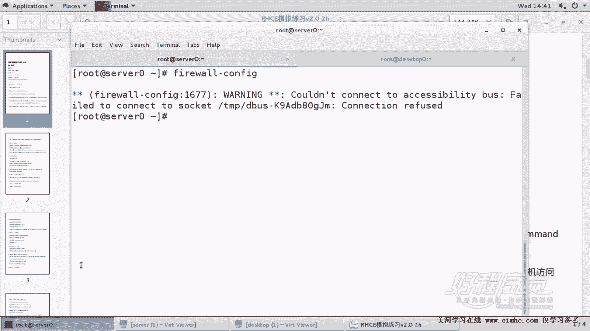
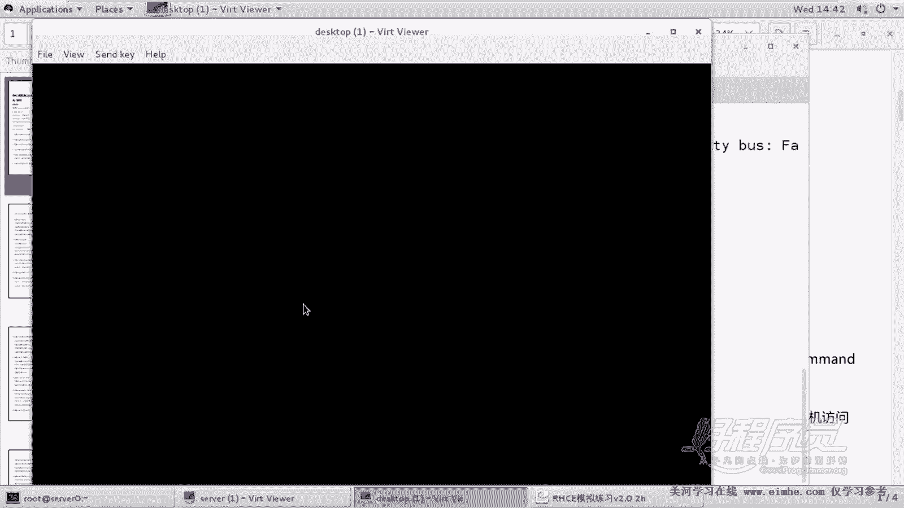
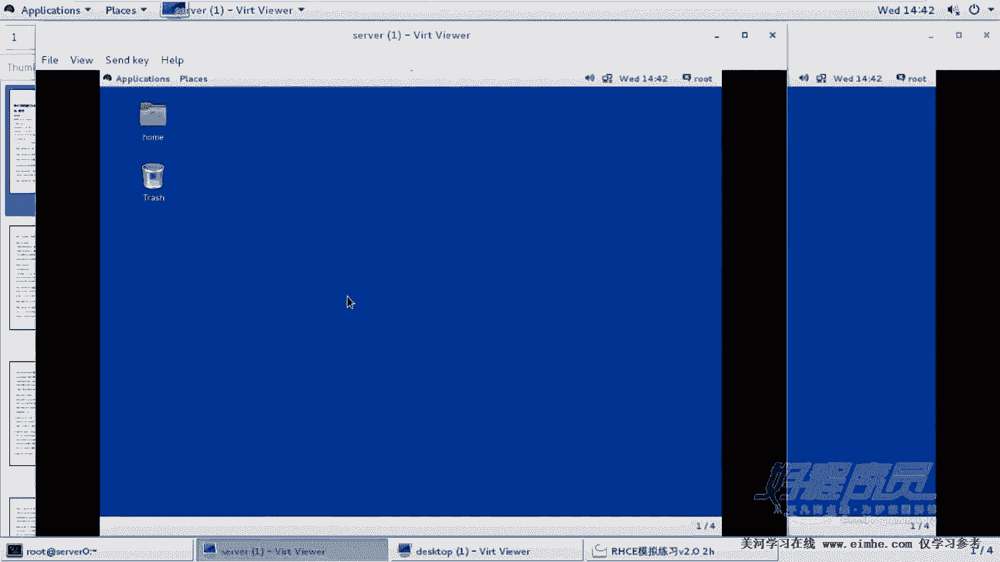
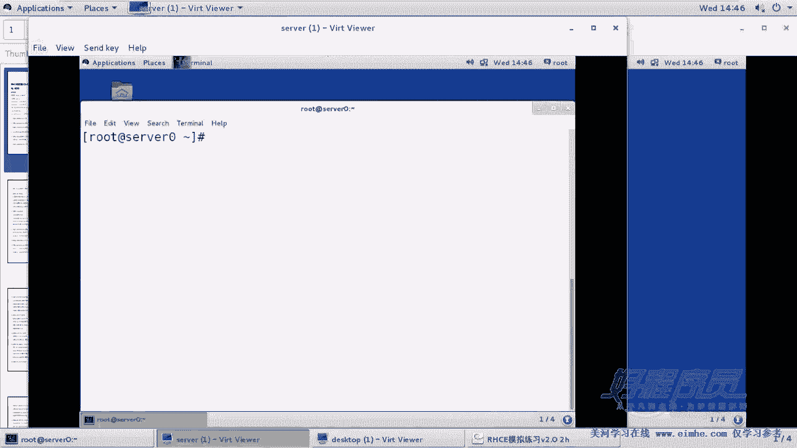
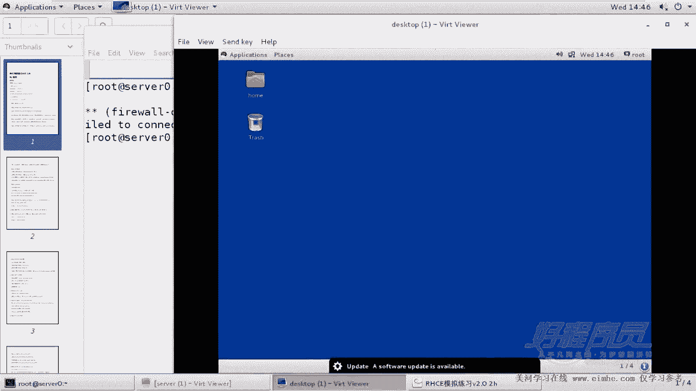
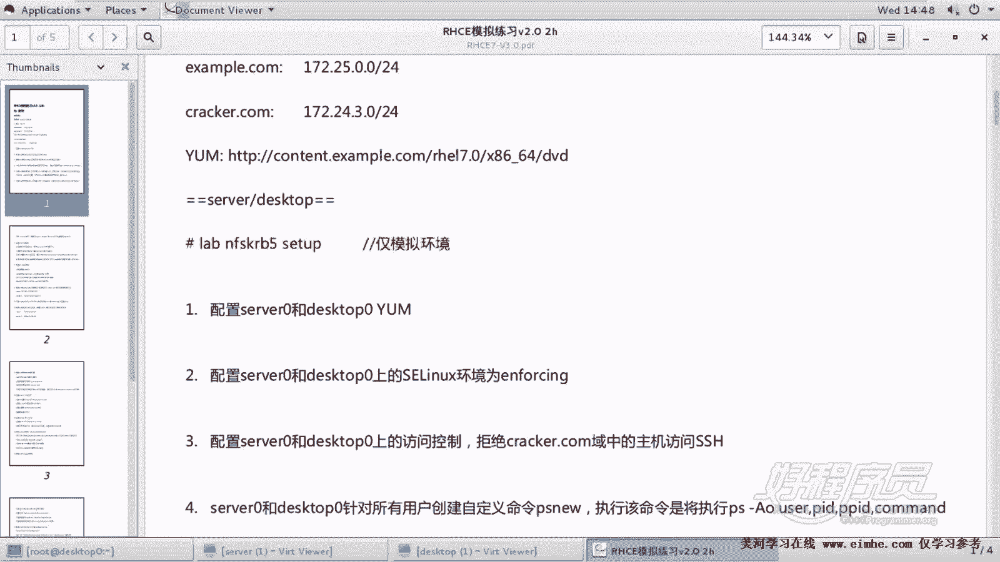
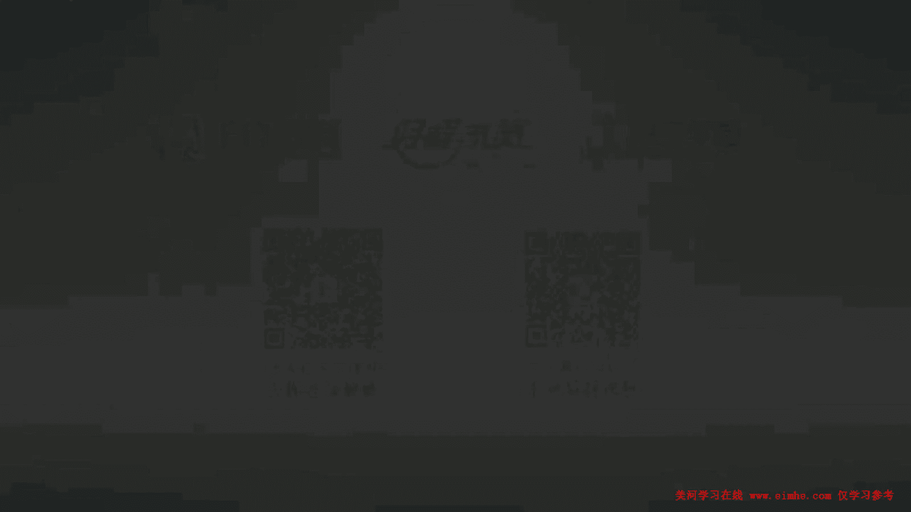

# RHCE 课程：P3：使用 firewalld 实现 SSH 访问控制 🔐

在本节课程中，我们将学习如何通过 `firewalld` 防火墙服务，在服务器上配置基于源 IP 地址的 SSH 访问控制。这是 RHCE 考试中的一个重要考点，要求我们精确地拒绝特定网络对 SSH 服务的访问。

## 概述与要求

上一节我们介绍了防火墙的基本概念，本节中我们来看看如何应用 `firewalld` 的富规则来实现精细的访问控制。

题目要求如下：
1.  在 `server` 和 `desktop` 两台服务器上均需配置。
2.  拒绝 `corrb.com` 域（网段为 `172.24.3.0/24`）中的所有主机访问 SSH 服务。
3.  必须使用 `reject` 动作，而非 `drop`，以确保连接方收到明确的拒绝响应。

**核心概念**：访问控制的核心是匹配源地址（`172.24.3.0/24`）和目标服务（`ssh`），并执行拒绝（`reject`）动作。

## 配置步骤详解

以下是使用图形化工具 `firewall-config` 进行配置的详细步骤。此方法直观，适合初学者和考试环境。

### 步骤一：启动防火墙配置工具

首先，确保 `firewalld` 服务正在运行，然后启动配置工具。

```bash
systemctl status firewalld
firewall-config
```



如果无法通过远程桌面启动图形工具，可以登录服务器本地终端，执行 `startx` 命令启动图形界面后再操作。

### 步骤二：配置永久规则

打开 `firewall-config` 工具后，进行以下操作：
1.  点击界面上的 “Configuration” 下拉菜单，选择 “Permanent”。这确保规则在重启后依然有效。
2.  在界面区域选择 “Zones” 标签页下的 “public” 区域（通常是默认区域）。
3.  切换到 “Rich Rules” 标签页。





### 步骤三：添加富规则

现在，我们来添加具体的拒绝规则。
1.  点击 “Rich Rules” 标签页下的 “Add” 按钮。
2.  在弹出的规则编辑窗口中，按顺序配置：
    *   **Family**：选择 `ipv4`。
    *   **Source**：勾选 “Invert” 选项**前请务必确认**。本题中**不能勾选**。在地址栏填写 `172.24.3.0/24`。
    *   **Service**：勾选 “Service”，并在下拉菜单中选择 `ssh`。
    *   **Action**：选择 `Reject`。
3.  检查所有配置无误后，点击 “OK”。

**关键点**：`Source` 地址必须准确填写为 `172.24.3.0/24`。如果错误地拒绝了考官所在的 `example.com` 网段（如 `172.25.0.0/24`），将导致成绩无法收取。

### 步骤四：重载防火墙使规则生效

新添加的永久规则不会立即生效。需要点击菜单栏的 “Options”，选择 “Reload Firewalld”。这将使新配置的永久规则立即应用到当前运行环境中。

### 步骤五：验证规则

配置完成后，可以通过命令行验证规则是否已正确添加。

```bash
# 查看永久规则
firewall-cmd --permanent --list-rich-rules

# 查看当前生效的规则
firewall-cmd --list-rich-rules
```

### 步骤六：在另一台服务器重复操作

题目要求在两台服务器（`server` 和 `desktop`）上执行相同的配置。请按照上述步骤一至五，在 `desktop` 服务器上完成完全相同的防火墙规则配置。





## 命令行配置方法（备选）

如果倾向于使用命令行，或图形界面不可用，可以使用 `firewall-cmd` 命令直接添加规则，效果相同。

```bash
firewall-cmd --permanent --add-rich-rule='rule family="ipv4" source address="172.24.3.0/24" service name="ssh" reject'
firewall-cmd --reload
```

**命令解析**：
*   `--permanent`：将规则设置为永久生效。
*   `--add-rich-rule`：添加一条富规则。
*   `rule family=”ipv4”`：指定规则应用于 IPv4。
*   `source address=”172.24.3.0/24″`：指定源地址。
*   `service name=”ssh”`：指定目标服务。
*   `reject`：执行拒绝动作。
*   `--reload`：重载配置，使永久规则立即生效。

## 总结与注意事项

本节课中我们一起学习了如何使用 `firewalld` 的富规则功能实现基于 IP 地址的 SSH 访问控制。

**核心总结**：
1.  **环境**：必须在 `server` 和 `desktop` 两台主机上分别配置。
2.  **规则对象**：拒绝源地址为 `172.24.3.0/24` 的网络访问 `ssh` 服务。
3.  **动作**：使用 `reject` 而非 `drop`。
4.  **生效**：修改永久规则后，需执行 `--reload` 或 `firewall-cmd --reload` 使其立即生效。
5.  **验证**：配置后务必使用 `firewall-cmd --list-rich-rules` 命令检查规则是否正确。





**最后提醒**：配置时务必仔细核对源 IP 网段。错误的配置（如拒绝了考官的 IP）可能导致考试失败。完成配置后，虽然无法在实验环境中直接测试，但可以通过上述验证命令确保语法和逻辑正确。