# 1. 杨哥rhce介绍及环境准备 - P4：4. 命令别名alias - 自普男 - BV1st411d7rF

好，下面我们请上我们的脚本来做一个小测试。好，这边呢脚本在哪儿呢？还是在这个本地，也就是在我们的物理机上面，这边有一个脚本是RHCEcheck8。0点SH呃，现在当然很多题都是没有做的啊。

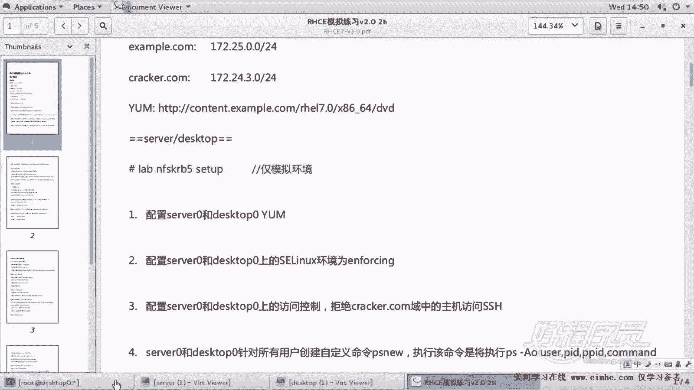

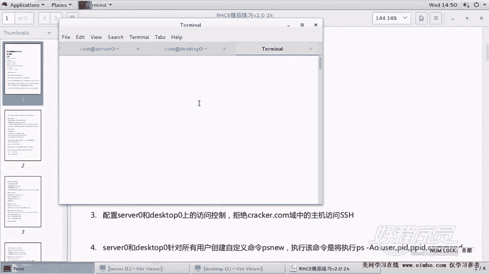

肯定会有些题会报错啊，咱们不管它，我们就看一下。呃，这里的这个检查的结果呢，大家不要去看那个编号，你要看的是哪道题，具体是哪道题。好，由于呢后面有好多题在检查，因为我们连的是两台机器，一台是serv0。

一台是destop0。所以它这个检查周期很长。至少需要一分钟以上，所以大家务必耐心等待一下。嗯，这个最好是做好了再去检查，否则的话呢，因为它连不上某一些服务，所以呢会在这边。卡住感觉像卡住一样。好了。

这边提示我们检查完了，我们看哪个题是对的啊。好，这边生成了1个201711月22号14点50分的一道一个结果。好了，各位看到这里大家不要看这个编号，因为这个编号和那个不对应啊。

这是当时呃有些题呢我是把它放在一起了。那么你看整个就可以clinux没问题。然后SSD没问题。好了，那就说明呢我们这两道题没问题啊，这是一个阶段测试。

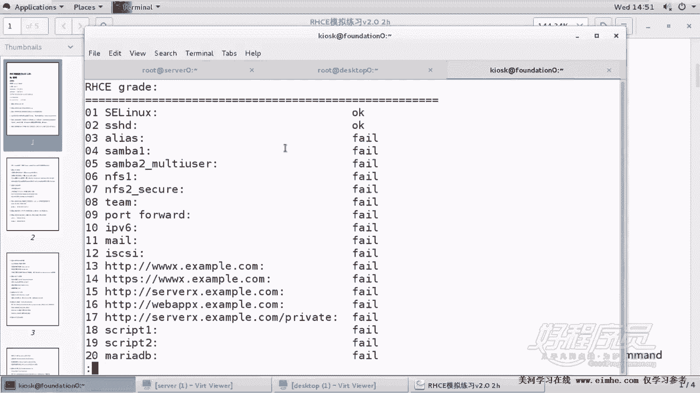

嗯。

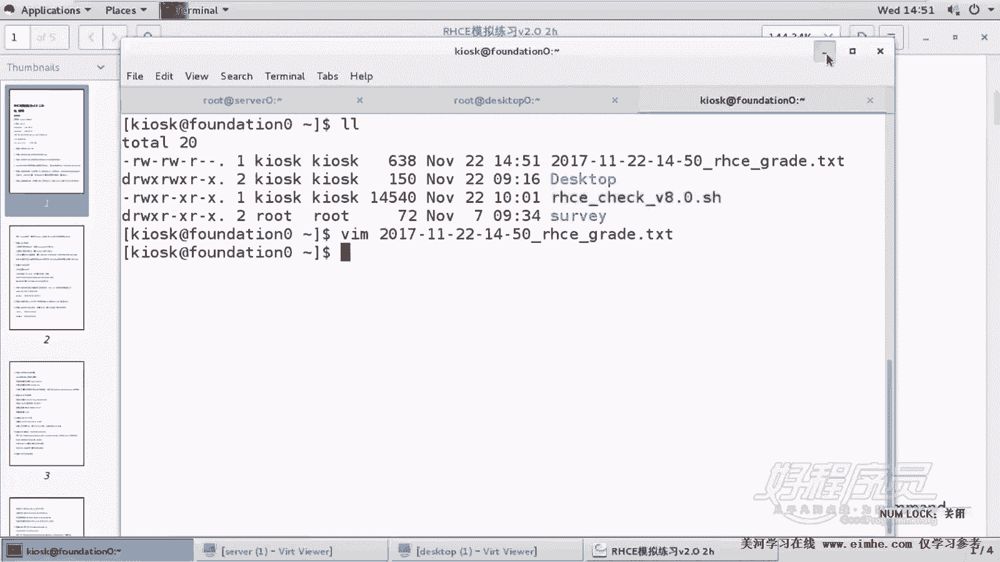

然后紧接着呢就是。我们的下一道题啊，这道题呢它要求在ser0和dessktop零上面针对用户所有用户创建一个自定义命令，也就创建一个命令，也就是我们使用命令的别名方式。然后这个执行该命令呢将。

执行这条命令。换句话讲，它PS6，它其实是它的一个别名，两件事一。两个机器都要做。第二呢，命令的名字。第二，还有一个是这个执行命令的名字。好，那我们在AG上做一下。

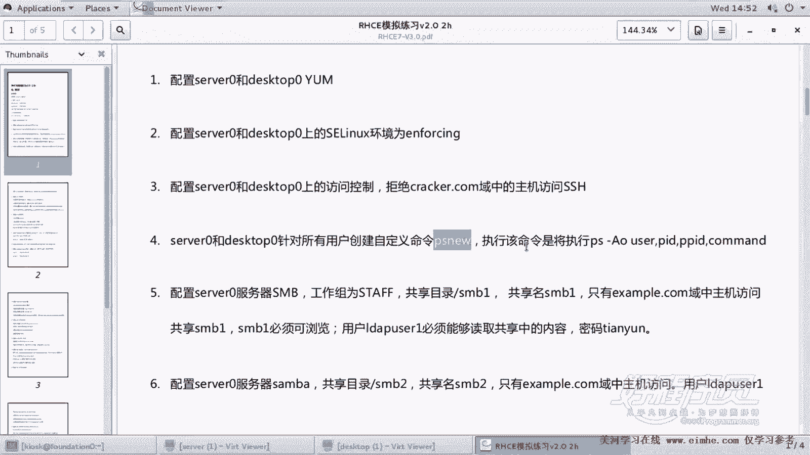

打开EBCR的profile，这是一个全局的一个文件。呃，当然或者是掰12RC其实都可以。因为我们就掰12RC吧，掰12RC文件。好，在拜2RC文件里面呢，到最后去。呃，到最后去设置一个BB哔令。

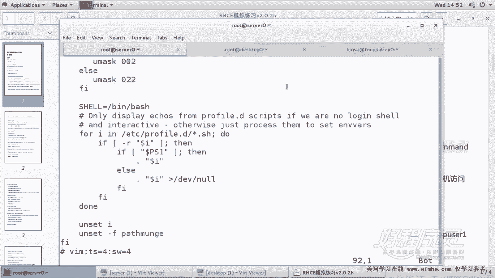

呃，到底应该是用beRC还是用profile呢？如果从绝对保险的层次上来讲，应该用profile。为什么？因为用户这个登录了，它涉及到一个log gain和loadin这个关系。换句话讲。

就是它并不是说一定会执行beRC。所以我们呢来使用这个profile方式来做。一般放到最后加一个叫als别名谁呢？这玩意最好不要最好不要去那个。

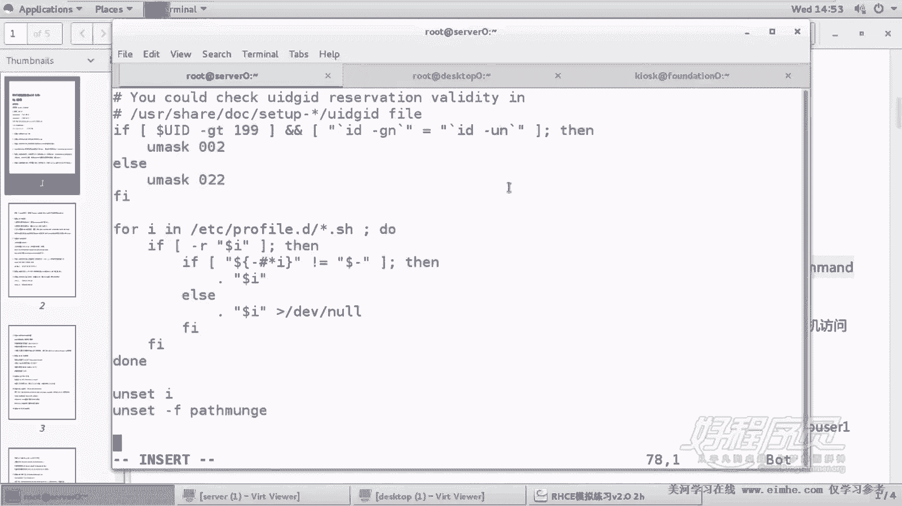

手动敲，因为它的命令很古怪，万一你写错的话就会带来痛苦。

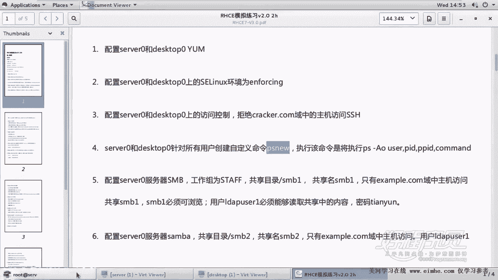

注意这里呢不是反引号，是单引号，两个单引号。后面呢是我们要执行的那个真实命令。

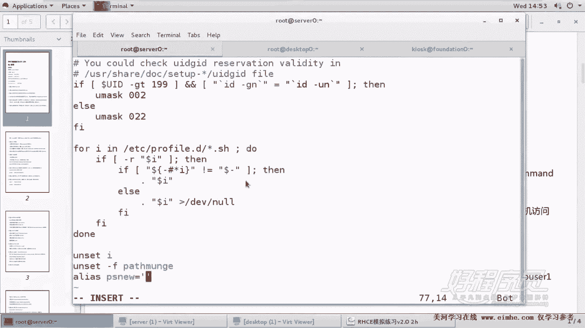

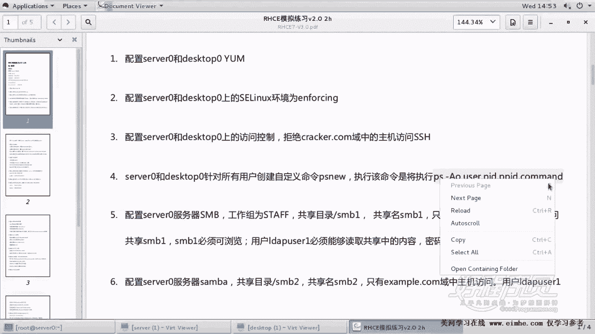

这场命令。粘贴好了，然后呢，我们为了测试退出再重新进一下啊，再重新以这个用户的身份进一下。最后我们再执行PS6这个命令，如果打印的结果，有结果的话呢，那基本上是对的。好了。

那现在我们把这个什么最后一行把这个ETC下的profi里面的这个最后一行呢粘出来给另外一个机器。因为我们还需要另外一个机器的这个配置。好，那么关于检查的话呢，大家就。就是关于脚本检测啊。

就不用先着急检测。因为。啊，先执行一下叫PS6这个命令。好，没问题。那我们从我们这个肉眼的层次上来看呢，说明已经没问题了啊，这就是关于别名的配置。大家看到到目前为止，基本上好多题都是两个机器都要做。

你看像第一个。

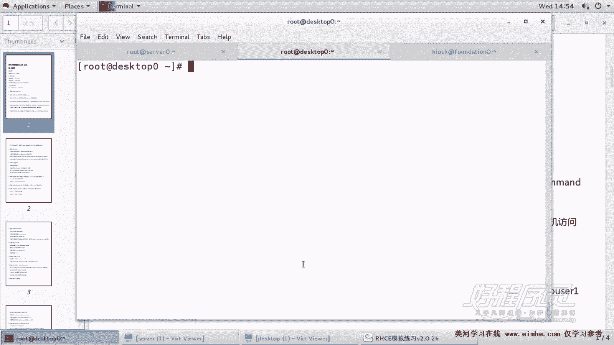

呃，配亚么呢就不用说了。第二个呢配什么配这个slin。第三，配SSH的防控制。第四，配置这个别名都要做。因此呢这种题呢我们如果做少的话呢，肯定是要减掉相应的分数的。

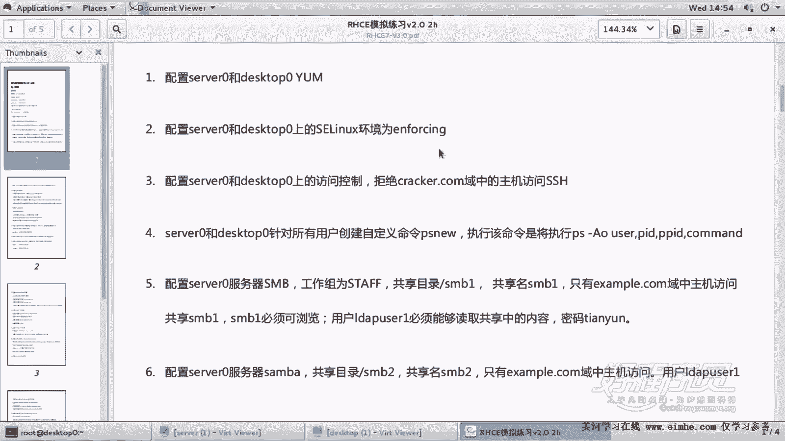