# RHCE课程：P4：命令别名alias


## 概述
在本节课中，我们将学习Linux系统中一个非常实用的功能——命令别名。通过创建别名，我们可以将复杂的命令简化成一个简短的单词，或者为常用命令添加默认参数，从而提升工作效率。我们将通过一个具体的RHCE考试题目来实践如何为所有用户创建全局命令别名。

---

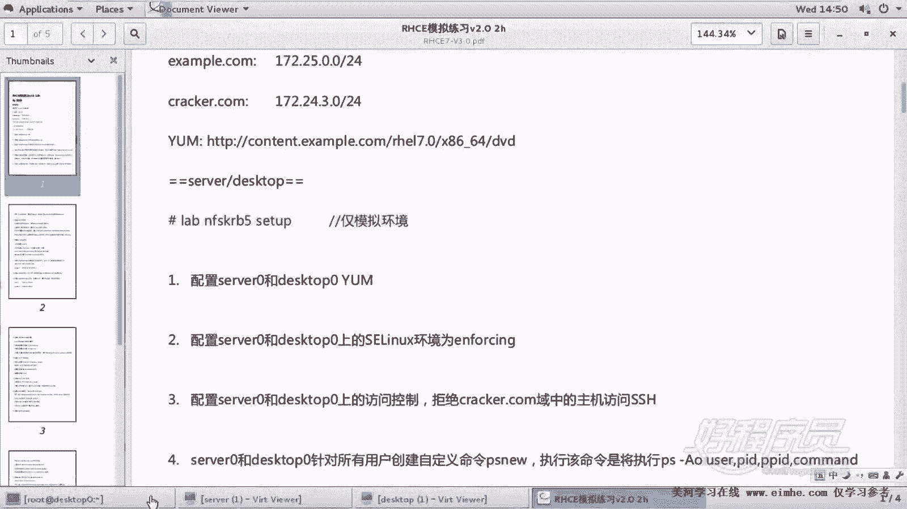

## 环境检查与题目回顾
在开始配置别名之前，我们首先使用一个检查脚本对之前题目的完成情况进行测试。这有助于我们确认当前环境状态。

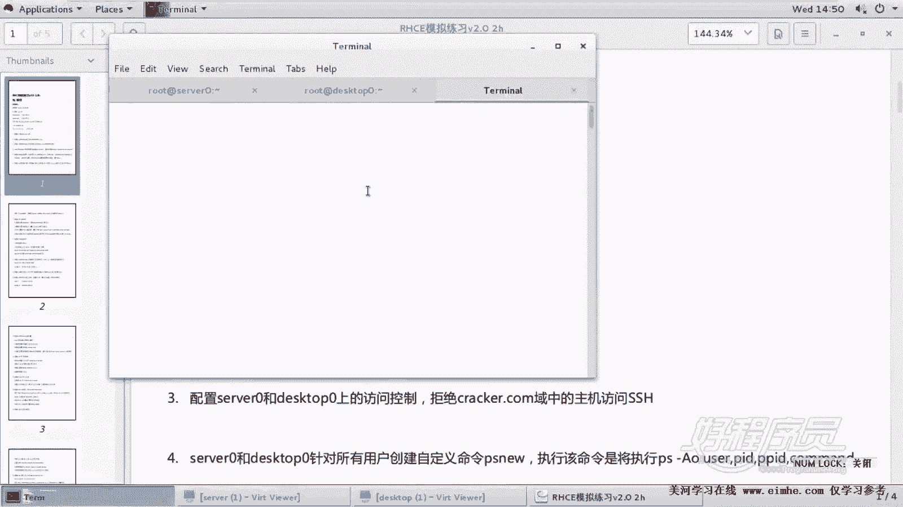

以下是脚本检查的简要过程：
*   脚本名称为 `RHCEcheck8.0.SH`，运行在物理机上。
*   脚本会连接到 `server0` 和 `desktop0` 两台虚拟机进行检查，因此耗时较长，需要耐心等待。
*   检查完成后，会生成一个结果文件。我们需要关注的是具体题目的对错，而非结果文件中的编号。

检查结果显示，关于 `chrony` 时间同步和 `SSH` 免密登录的题目已正确完成。这为我们进行下一项配置打下了良好的基础。

上一节我们完成了基础服务的配置，本节中我们来看看如何通过命令别名来优化日常操作。

---

## 题目要求解析
接下来需要完成的题目要求如下：

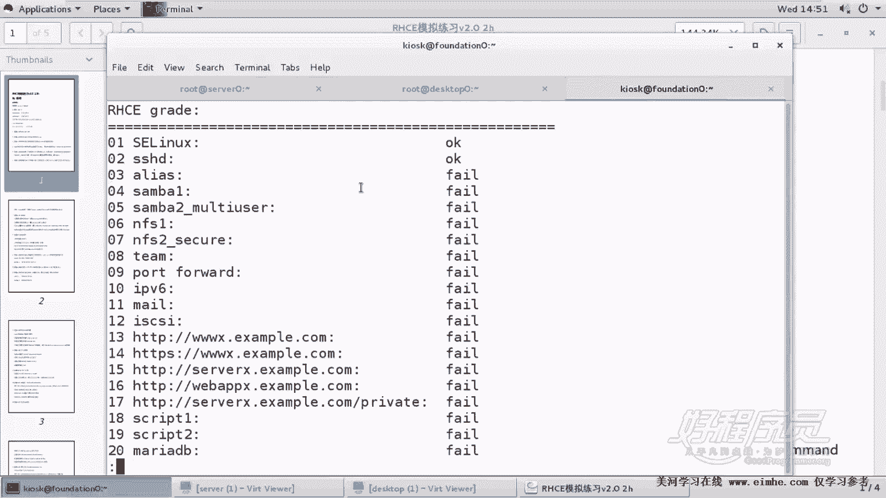

1.  **实施范围**：在 `server0` 和 `desktop0` 两台机器上均需配置。
2.  **配置目标**：为系统中的所有用户创建一个自定义命令。
3.  **实现方式**：使用命令别名来实现。
4.  **具体内容**：创建名为 `psaux` 的别名，当用户执行 `psaux` 时，实际执行的是 `ps -aux` 命令。

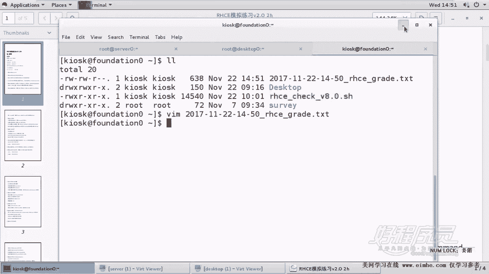

这道题的核心是理解并应用 `alias` 命令，并将其配置到全局环境中，确保所有用户登录后都能使用。

---

## 配置命令别名
命令别名可以通过 `alias` 命令临时设置，但若要永久生效（特别是为所有用户设置），需要将别名定义写入Shell的配置文件中。

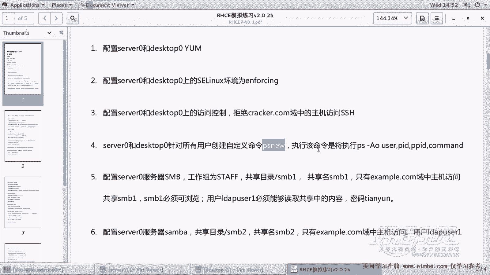

对于为所有用户配置全局别名，应选择 `/etc/profile` 文件。因为用户登录时一定会读取此文件，比用户家目录下的 `.bashrc` 文件更可靠。

以下是配置步骤：

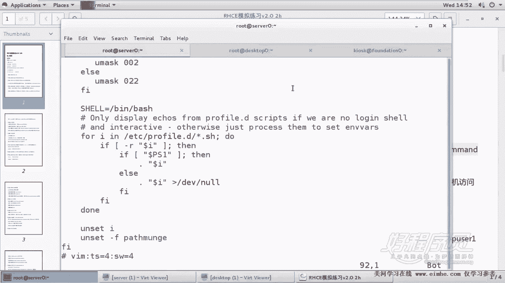

1.  使用文本编辑器（如 `vim`）打开全局配置文件：
    ```bash
    vim /etc/profile
    ```

2.  将光标移动至文件末尾，并添加以下内容。**建议直接复制题目给出的命令，以避免手动输入错误**。
    ```bash
    alias psaux='ps -aux'
    ```
    **注意**：等号右侧的命令需要用**单引号**括起来。

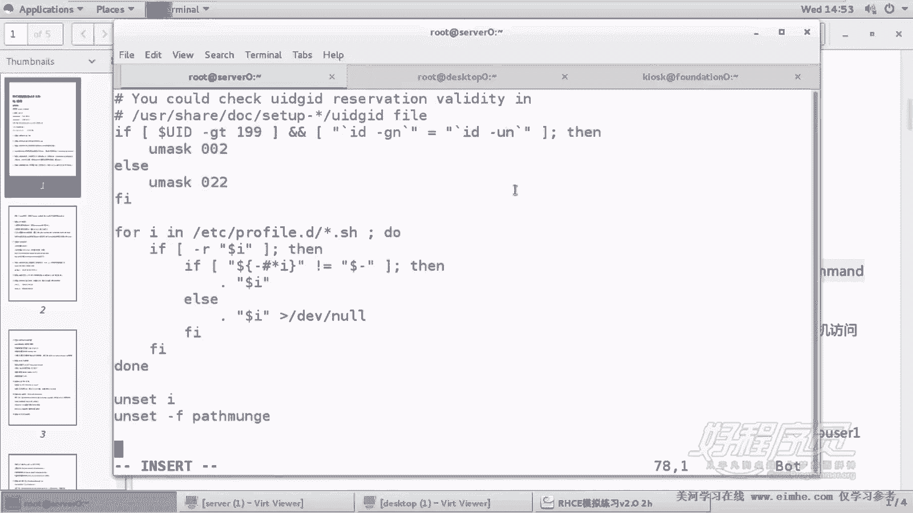

3.  保存并退出编辑器。

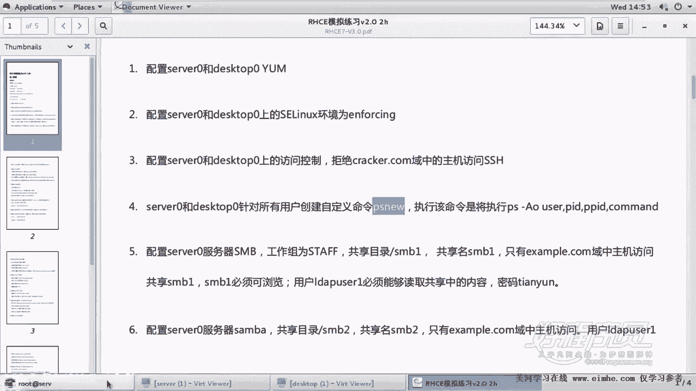

为了使配置立即生效，我们需要让用户重新加载配置文件，或者退出当前Shell重新登录。可以执行以下命令：
```bash
source /etc/profile
```
之后，即可测试别名是否生效。

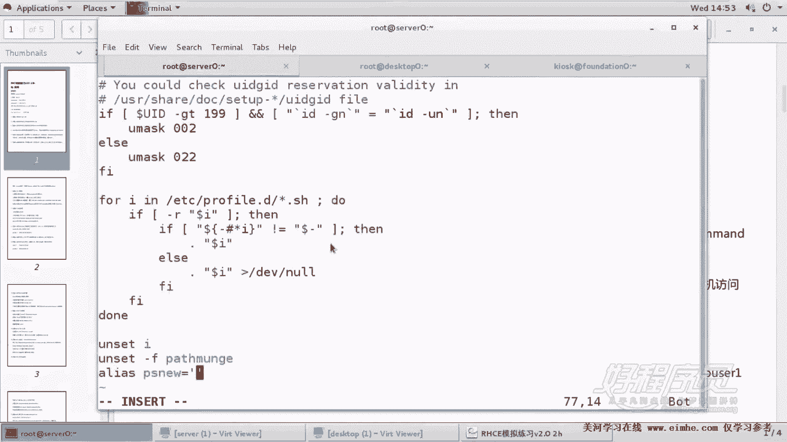

---

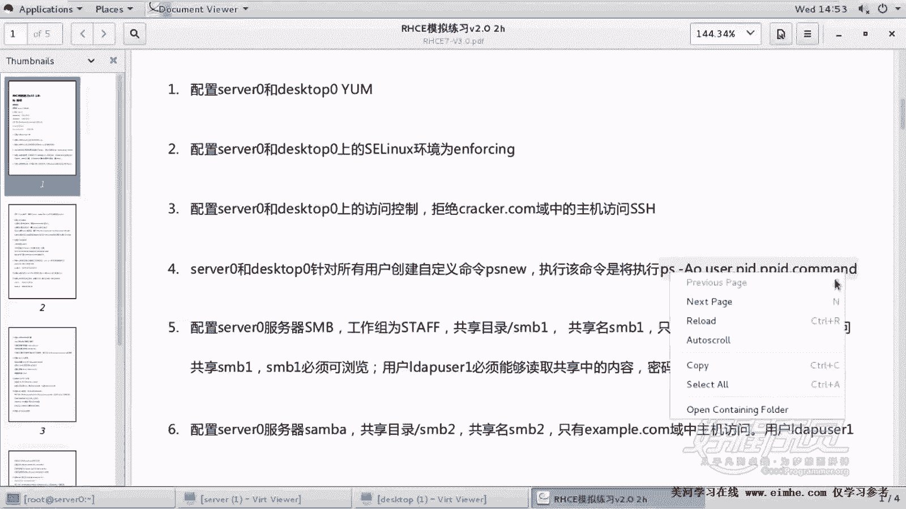

## 测试与验证
配置完成后，我们需要进行测试以验证别名是否工作正常。

在终端中直接输入我们创建的别名命令：
```bash
psaux
```
如果该命令能够正确列出系统进程信息（即等同于执行了 `ps -aux`），则说明别名配置成功。

由于题目要求在两台机器上配置，因此需要在 `server0` 上完成上述步骤后，将 `/etc/profile` 文件中新增的那一行配置，同样地添加到 `desktop0` 机器的 `/etc/profile` 文件末尾。

---

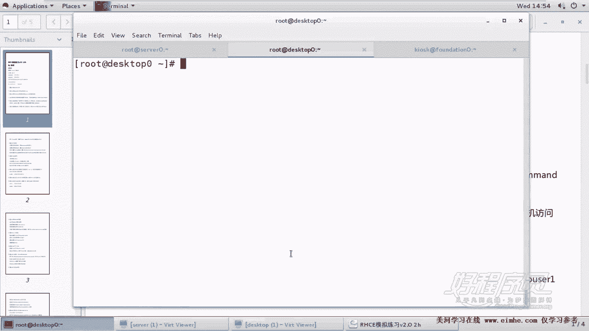

## 核心概念与技巧总结
本节课中我们一起学习了Linux命令别名的配置与管理。以下是关键点总结：

*   **命令别名**：使用 `alias` 命令可以为长命令或复杂命令创建简短的替代名称，语法为 **`alias 别名='原命令'`**。
*   **生效范围**：
    *   临时生效：直接在终端输入 `alias` 命令。
    *   永久生效（对单个用户）：将 `alias` 命令写入用户家目录的 `~/.bashrc` 文件。
    *   永久生效（对所有用户）：将 `alias` 命令写入 `/etc/profile` 文件。
*   **配置技巧**：对于考试或生产环境，复制题目或文档给出的精确命令，比手动输入更安全，可以避免因拼写或符号错误导致的问题。
*   **RHCE考试提示**：在考试中，务必注意题目要求配置的机器范围。像配置别名、Yum仓库、SSH密钥这类题目，通常需要在多台主机上重复操作，遗漏任何一台都会导致失分。

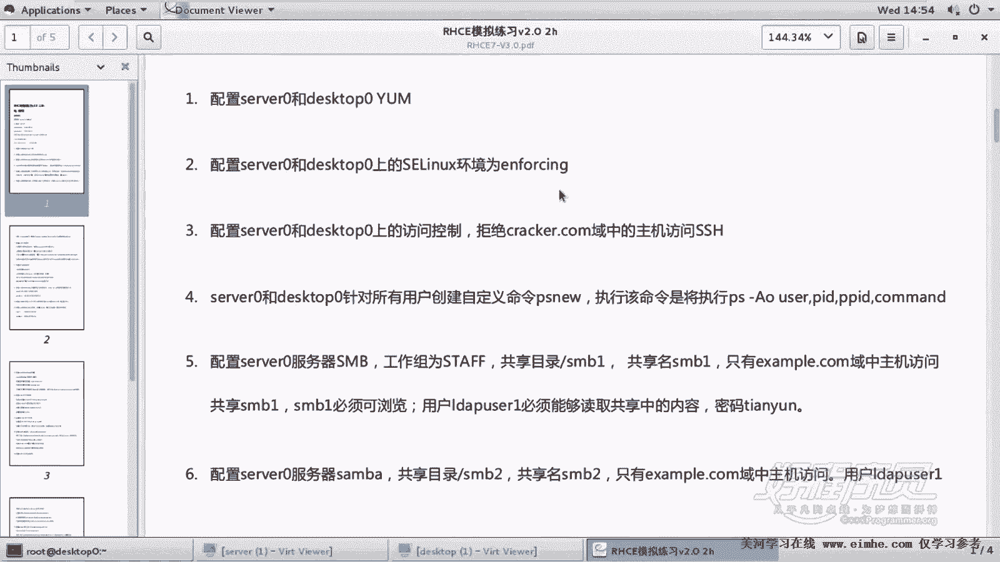

通过掌握命令别名，你可以极大地简化命令行操作，这是Linux系统管理员必备的效率工具之一。