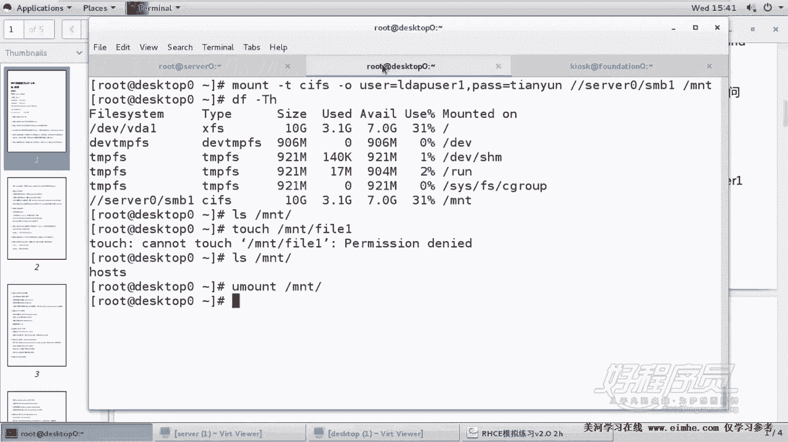
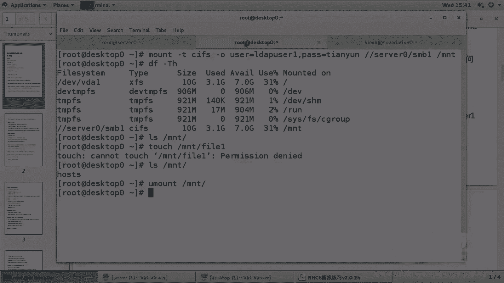

# 1. 杨哥rhce介绍及环境准备 - P5：5. Samba共享1 - 自普男 - BV1st411d7rF

好，接下来我们开始来配这个CE的第一个服务。嗯，这个服务了是桑把，而且各位看到桑把好像还不止一道题，是两道题。这个s把服务呢呃它要求的是在s零上进行配置工作组为staff呃。

然后我们要共享的目录是跟下的三巴一。如果这个目录不存在的话呢，当然是要创建共享名叫SMBE。明确说明，只有example域的成员呃，主机可以访问。31，而且这个目录是必须是可浏览的。

用户Id user一必须能够读取共享目录中的内容，密码是天云。好，那在做这个题的时候呢。下面我们还会涉及到很多的服务。我们建议大家就在旁边呢找一张纸或者找一个文档来。

写一下这些服务的一个整个的一个配置步骤。这样的话我们就可以每道题呢可以按照这个步骤来做一个配置。第一，我们先要装软件包，就是亚minstore软件包。就是要把相应的软件包装上，这是第一步。第二步呢。

我们会带它做一些配置。按照这个配置肯定是按照需求配置。第三一步呢是我们会对它做一个启动，并且呢要做一个开机启动。二来部。呃，然后呢还有一个是第四步，我们还要关注的是防火墙fireairwall。

因为我们。默认情况下，防火墙大家知道是前面是开启的，它会影响到我们的这个服务的访问。当然还有可能性就是有一些服务跟这个相关。因此，我们在做每一个服务的时候，都来看一下，因为考试的过程当中呢。

可能容易紧张。所以我们把这个步骤呢写在旁边或拿一张白纸写在旁边。然后每做一个服务，我们都按照这个步骤做第一步装包，装包以后呢进行配置，然后别忘了启动，还有就是设为开机启动。

以及防火墙是不是开放了相应的端口，如果没有开的话呢，客户端这边肯定不能访问。第四1个是SElinux，是不是。相应的需要一些配置。好，首先我们来做的第一个服务呢是三ma服务。那么这个三ma服务呢？

我们要装的包。叫做桑板。其实有一些包是可选的，比如说s板杠cleland，还有CIFS杠UTIS这两个包实际上是可选的。它主要是在客户端一定要装。好，我们第一步来装软件包。装完以后呢。

由于它共享的目录是根下的SMBE这个目录不存在，所以我们进行了创建。一定要清楚的是，我们在第一台机器，也就是。420这个机箱做啊。好。

然后他说的是有一个用户叫做ldap user一这个用户我们看看ldap user一这个用户有没有大家看到有我们要给他设置一个扫码密码杠ALdap user一。密码呢是。天云。天云大家观察一下。

它显示添加用户还有dus一。好了，然后我们开始来对这个sba进行配置。sba的配置文件是ETC下的ss8点com。好，回车找到里面我们搜索work。Group。找到里面呢下一个下一个就这个位置。

大家看到我们将它改为要求的这个工作组。然后光标移动到文这个整个文档的最后，大G也就shift加G移到最后，我们来创建我们的共享共享零呢，刚才各位看到要三大一，然后呢路径是根下的三大一好。

那他这边呢明确说明了什么呢？这个目录是。可以只允许这个域中的主机访问，而这个域是哪个域呢？我们可以将光标移动到最前面，或者说去看一下那个环境信息，其实就是你所在的网段17225。0。0。

但是在这里写的时候要注意，我们在这里写的时候。啊，桑b它的这种写法呢是这样的。用一个叫host4alow等于。hosts等于多少呢？172。25点注意呃，25。0点，这是网段，那只写到前面的网段就可以。

1725。0点就可以了。那么至于这个可浏览。prosible等low和yes其实就是一个隐藏共享或者是不隐藏共享。其实默认情况下，它本身就是可浏览的那如果说你用你要用prossible等等等yes呢。

当然也可以，但实际上大可不必啊，我们这就是这样一个配置。好，保存以后，紧接着呢我们把这个服务起来，它的服务有两个两个你有两个进程NMB和SMB两个进程，我们将其设置为开机自动启动。OK然后呢。

防火墙防火墙可以采用文本的方式，也可以采用图形的方式。那么我们在最后呢会给大家统一的去讲一下这个防火墙应该在考试的时候怎么配置。perment杠杠ADD杠service。等于。3把。然后。

Fairwork commandreload一下加载，让它在当前上像。好了，这样的话防火墙做好了。那么关于sma来讲的话，它还有一个就是关于SElinux设置。

那这个可以说是唯一的一个需要设置设置的一个。Slinux权限CH。CON杠R杠T我们要将它的这个类型呢改成3版 shellll。钢T这个类型。我们看一下这个目录杠DG来看它s权限。各位。

它的类型是s巴 shell钢体。好了，这个就按你讲，我们的配置就应该okK了。那么这个题大家看到它并没有说用户需要什么，他并没有说在客户端那边需要挂载，所以我们可以测试一下，怎么测，到客户端那边去呢。

做一个相应的这个测试，注意这里只是测试啊，其实是不给分的，只是测试，没有要求挂载。那就那你就只是测试一下就可以了。好，来到这边要装上s巴的。客户端软件。要支持我们的CFS5件系统。好，那怎么挂载呢？

我们刚才讲我临时挂载一次mount杠O呃，杠那个T，这是文文件系统类型。CFS当然这个可以省掉啊，杠TCFS这个类型可以省掉杠O后面加上什么？加上我们的这个选项。

这个选项呢挂载的时候要使用用户ld userer一啊，sorry应该是user这个选项等于ld userer一逗号，然后是密码pass选项等于。天云好，这边要看清楚LDIPUSER1pass天云。

这是我们的选项，也就是使用用户名密码。后面呢加上我们的主机。s0哪个共享呢？381这个共享挂在哪个目录，我们现在挂到一个临时目录，跟下载MNT就可以了。好，这边我们来看一下挂的这个结果。好。

那这边他告诉我们呃，有一个错误的类型。错误类型。错误的类型错误类型，然后。不支持。SERVER0，我们看以拼得通吗哈？SERVER0这个主机OK可以拼得通。那这边是哪儿错了呢？我们来仔细看一下第一。

这个包刚才我们装看看是不是成功的，必须要支持哦，难怪不支持。这个这个各位看到它显示明确显示这是一个错误的文件系统类型。因为我们刚刚装包的时候没有仔细看这个包装错了。CFS杠UTILS这个包。好。

这是我们三把的5定系统5件系统类型啊，也叫CFS通用的internet5件系统。好，最后我们再来挂载一次，大家看到挂载成功了。杠TH它是1个CFS类型。好了，那么这个挂载呢其实是不给分的。所以我们将其。

呃，我们先访问一下，看可不可以访问啊MNT我们能往里面写吗？fi一答案是不可以的。因为这边呢告诉我们这个用户能够读取其中内容。那比如说我们做个测试，我们在这边往这个。往这个里面SNBE里面扔一个文件。

好，我们再来这边访问一下。好，各位看到有这个文件。最后将其卸载。我们下一道三马题呢是要需要去挂载的。那么这一道呢只是要求各位能够访问到就可以。所以我们测试一下就可以了。

