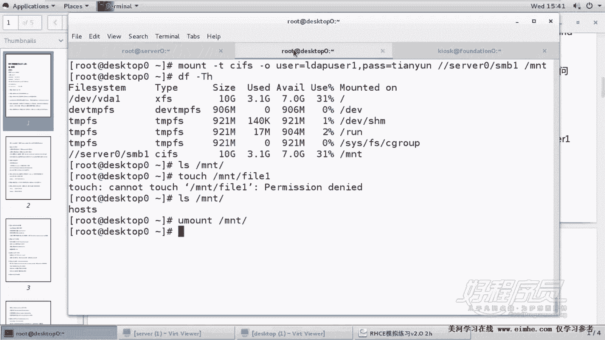
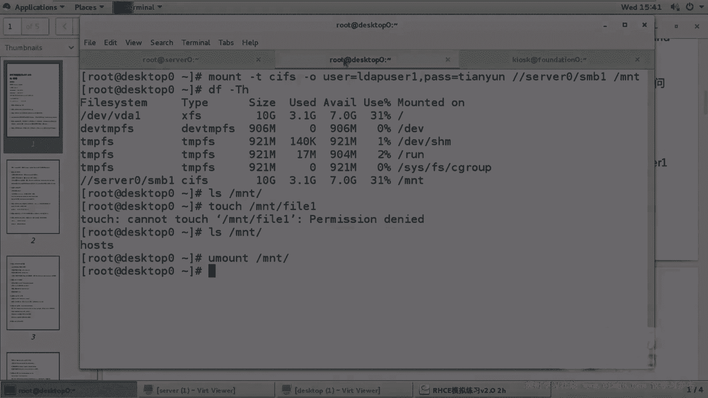

# RHCE课程：P5：Samba共享服务配置教程 🔧


在本节课中，我们将学习如何配置Samba共享服务。Samba服务允许Linux系统与Windows系统之间共享文件和打印机，是RHCE认证考试中的一个重要考点。我们将按照清晰的步骤，从安装软件包到完成配置和测试，确保初学者也能轻松掌握。

---

## 第一步：安装软件包 📦

首先，我们需要在服务器上安装Samba服务所需的软件包。这是所有服务配置的基础步骤。

执行以下命令安装核心软件包：
```bash
yum install samba -y
```
此外，客户端还需要可选软件包以支持挂载，但在服务器端，核心的 `samba` 包已足够。

---

## 第二步：创建共享目录与用户 👤

上一节我们安装了必要的软件，本节中我们来看看如何准备共享环境和用户。

根据题目要求，共享目录是 `/smb1`。同时，需要为LDAP用户 `ldapuser1` 设置Samba访问密码。

以下是具体操作：
1.  创建共享目录：
    ```bash
    mkdir /smb1
    ```
2.  为LDAP用户设置Samba密码：
    ```bash
    smbpasswd -a ldapuser1
    ```
    根据提示，将密码设置为 `tianyun`。

---

## 第三步：配置Samba服务 ⚙️

现在，我们来对Samba服务进行核心配置。配置文件位于 `/etc/samba/smb.conf`。

以下是需要修改的关键配置项：
1.  设置工作组：找到 `workgroup` 参数，将其值修改为 `STAFF`。
2.  配置共享定义：在文件末尾添加共享段落，定义共享名、路径和访问控制。
    ```ini
    [smb1]
        path = /smb1
        hosts allow = 172.25.0.
        browseable = yes
    ```
    *   `hosts allow` 限制了只有 `example.com` 域（即 `172.25.0.0/24` 网段）的主机可以访问。
    *   `browseable = yes` 确保共享目录在网络中可被浏览。

---

## 第四步：启动服务并设置防火墙 🔥

配置完成后，我们需要启动服务并确保它能被网络中的客户端访问。

以下是启动和防火墙设置的步骤：
1.  启动Samba服务并设为开机自启：
    ```bash
    systemctl start smb nmb
    systemctl enable smb nmb
    ```
2.  在防火墙中永久开放Samba服务：
    ```bash
    firewall-cmd --permanent --add-service=samba
    firewall-cmd --reload
    ```

---

## 第五步：配置SELinux安全上下文 🛡️

SELinux可能会阻止Samba访问共享目录，因此需要调整目录的安全上下文。

执行以下命令，将 `/smb1` 目录的SELinux类型设置为 `samba_share_t`：
```bash
chcon -R -t samba_share_t /smb1
```
可以使用 `ls -ldZ /smb1` 命令来验证类型是否已更改。

---

## 第六步：在客户端进行测试 🧪

所有配置完成后，我们可以在客户端进行连接测试，以验证共享服务是否正常工作。

以下是测试步骤：
1.  在客户端安装必要的工具包：
    ```bash
    yum install cifs-utils -y
    ```
2.  使用 `ldapuser1` 用户身份临时挂载共享：
    ```bash
    mount -t cifs -o username=ldapuser1,password=tianyun //server0/smb1 /mnt
    ```
3.  测试访问：在服务器端的 `/smb1` 目录创建一个测试文件，然后在客户端的 `/mnt` 目录查看是否能读取到该文件。
4.  测试完成后，卸载共享：
    ```bash
    umount /mnt
    ```

---

## 总结 📝





本节课中我们一起学习了Samba共享服务的完整配置流程。我们按照“安装软件 -> 准备环境 -> 修改配置 -> 启动服务 -> 配置防火墙与SELinux -> 客户端测试”的标准步骤，成功配置了一个仅允许特定网段访问、指定用户可读的Samba共享。掌握这个流程对于通过RHCE考试和实际工作都至关重要。