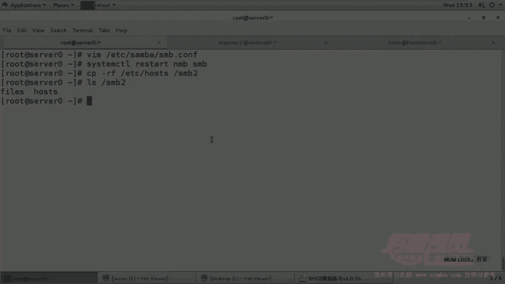

# 1. 杨哥rhce介绍及环境准备 - P6：6. Samba共享2 Multiuser - 自普男 - BV1st411d7rF

那第二道三大题呢，这边呢要求能和刚才不太一样。它要求的是共享目录382，共享名叫382，同样也只是允许example域中的主机访问，这个没有问题。呃，但是这边呢他告诉我们。

ld user一读取对该目录是读取。Id user2是读写，密码是密码是天云，而且客户端desktop0要以marty user的方式自动挂载到MNT下的382。

所以这边呢和刚才呢稍微有一些各位发现有一些不同。哪个地方不同呢？是一个是。他加入了一个加入了一个这个读写，还有一个是呢必须要以多用户的方式去挂到382，挂到那个2号机上面去。好，下面我们来做一下。

这里呢其实不用再装三版了，因为装好了啊，我们直接来看一下有这两个用户吗？LDAPus一这是有的2也有的那我们要做的事情是给这个用户382也加一个密码杠A。那个ld user2这个用户加密码，密码叫天云。

填云好了，显示添加成功。然后紧接着呢我们来创建这个FSNB2这个目录。这个目录呢呃当然也不用重启了，我们直接给它设置一下。直接给它设置一下这个slin权限吧。38hell杠7382好了。

检查一下DC后面这个目录没问题。好，然后他要求的是第二个用户是可以读个写，那怎么处理呢？set FACL杠M user。用户ld user2能够读写执行。注意对于目录来讲的话呢，对于目录来讲的话。

如果没有执行的话呢，这个是会有问题的。所以我们它基本上连进都进不去啊。所以我们准备好这个目录，也可以看一下这个目录的权限。我们看一下LLd user一，其实相当于其他人他能够读。

而dap user2呢是一个可以读写的这样一个角色。好，下面我们来配置配置3版，打开三版。SNBNB点com那下面呢我们再加一个。382，然后pass等于382post4。后s4这边呢。

allow这边是alow等于172。25。0点。好，然后呢这边呢和之前不一样了，这边各位看两个用户，有一个用户是。用户LWer一读取IW2是读写密码为天云。其实LWer一本身就是本身就是这个。读取。

因为它。呃，因因为因为他这边呢嗯我们是默认是公开的，所以大家都可以读取。好，所以那user2呢这个用户呢他是要读写的，所以我们可以在这边加一个。Right。WITread list等于。LDIPus2。

当然这边呢我们需要再加一个指令叫valduser4。注意这里是死啊，一定是死，少写个S的话也也不会报错，感觉啊，但是结果是错的，等于谁呢？等于一和ld user2，这两个用户都可以访问。

但是呢呃能够写的只有这个Idap user2这个用户。OK那这边呢我们将pro做一个重启。NMBSMB重启好，语法上就算是报错的话呢，也基本上不会影响启动。然后对于防火墙这些呢肯定是不用再设置的。好。

那我们要来到了2号机这边，2号机这边呢也就是desstop0这个机机器这边，它要求挂到MN地下的3ber2。这边由于我们之前已经装过了这个叫sbercle，还有一个是。那个CFS杠UPIIS这个包。

所以其实这个字不用再装了。好，我们主要建立MNT下的SNB2这个目录。当然考试的时候是必须是是什么地方就什么地方啊，这不能乱写啊，必须是相应的这个位置。好，然后打开FSTAB文件，我们要永久挂载。

在这边我们写上。sever0下的3-2这个目录，然后挂到ME下的3-2类型是CFS，然后defas。第一。defor注意这里呢它的选项要加用户的user等于等于多少呢？我们一般等于LW userer一。

也就是这个普通用户权限比较小的用户就可以了。然后pass等于。田云。另外呢还要加一个很重要的选项叫做什么呢？叫做marty user。多用户挂载这种方式。好，最后是不备份，不检测。好，我们来保存一下。

现在此时此刻，我们观察一下有没有挂载。没有mount。杠A好了，各位看到这边已经显示命令指令成功，有挂上吗？有挂上挂好了。那现在我们怎么测试呢？各位。这个测试的方式呢。

首先我们切换到ld user一这个用户。啊，这是这个用户切换到这个用户上去。然后我们看一下这个用户有没有权限访问。大家会发现。有一些很奇怪的现象，这个用户圈peration delay是这样的。

我们刚才虽然说挂上了，但是呢它只是一个普通的方式挂好的呃，多用户挂载是什么意思呢？就是每一个用户其实。他我们知道。LW1LW2这两个用户呢，他们的权限不一样，但是不需要重新挂载。

他们只要重新申请他们的凭凭证或者凭据就可以。那怎么申请呢？这边我们用到了一个CFScs。后面加上ADD添加，就向谁申请一个凭凭证呢？像s0，然后只要填入自己的密码就可以了。这个是桑法密码。好了。

现在我们再看一下MND下的。320这个目录好，里面呢没有东西，我们在里面呢创建一个。内容看看可不可以。答案是不行的。好，为了能够看到更好的效果呢，我还是往这边拷贝一个文件，往SNB下的。

SNB2里面拷贝一个文件。好，这边我们再来看。哎不是不是to啊，是我清一下屏，是查看。好了，有这个文件，那说明一这个账号只能够读，那二账号能不能写呢？嗯，我们切换到ldus二上去。

然后同样呢通过CFS create aDD去申请一下凭证。当然填的应该是他的扫码密码。这边呢我们看一下他读的情况可以，那他写能不能写呢？大家看可以写。结果我们再看看这个效果。好。

回到这边服务器这边来看看这里面的目录里面呢，是不是也有。382382里面的这个写助的东西有没有有，所以这就是多用户的方式。多用户挂载允许什么？它不像以前那样，我们以某个用户的身份挂好了。

就是那个用户的权限。这回不是这回是什么？挂载了，只是开机帮你挂上。我们只是一个普通的身份去挂上。那只是挂上而已。如果说你你要用什么账号，你不用重新挂载，可能你也不能够重新挂载，因为你没有权限。

那你可以呢重新向服务器去申请你的凭证，申请你的权限。因为我们在挂载的时候明确的加了一个选项，是多用户挂载，所以说你可以申请这个选项。好，这就是我们的第二道3大题。

